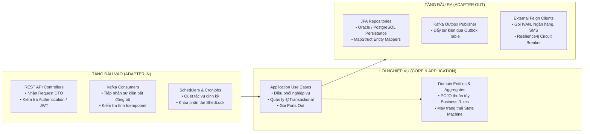

# QUY CHUẨN ĐẶC TẢ KIẾN TRÚC BACKEND VÀ XỬ LÝ TIẾN TRÌNH (BACKEND PROCESS SPECIFICATION)

Tài liệu này quy định hệ thống nguyên tắc, kiến trúc Hexagonal (Ports & Adapters), các mẫu thiết kế chịu lỗi (Resilience Patterns) và quy chuẩn mã nguồn cho các dịch vụ Backend và Tiến trình chạy ngầm.

---

## 1. NGUYÊN TẮC THIẾT KẾ BACKEND CỐT LÕI

1. **Kiến trúc Lục giác (Hexagonal Architecture / Ports & Adapters):**
   * Tách biệt hoàn toàn giữa Logic nghiệp vụ cốt lõi (Domain), Tầng ứng dụng (Application Use Cases) và Tầng hạ tầng giao tiếp (Adapters).
   * **Domain Layer:** Không chứa bất kỳ annotation phụ thuộc framework nào (ngoại trừ bean validation thuần túy).
   * **Application Layer:** Chứa các Use Case Interfaces (Inbound Ports) và Repository/Publisher Interfaces (Outbound Ports). Không viết SQL hay gọi HTTP trực tiếp tại tầng này.
   * **Adapter Layer:** Gồm Adapter In (REST Controller, Kafka Consumer, Scheduler Cron) và Adapter Out (Spring Data JPA, Feign Client, Kafka Publisher).
2. **Quy chuẩn Không Hardcode Backend (Zero-Hardcode Standard):**
   * Tuyệt đối không hardcode chuỗi ký tự, số ma thuật, mã trạng thái hay tham số cấu hình trong mã nguồn.
   * Toàn bộ trạng thái phải được định nghĩa bằng Domain Enums hoặc Constants tập trung (`ReportConstants`, `SecurityConstants`).
3. **Quy chuẩn Import Sạch (Clean 4-Group Imports):**
   * Tuyệt đối không sử dụng tên đầy đủ FQN (`com.mascom.dip...`) trong thân hàm, tham số hay kiểu trả về. Mọi kiểu dữ liệu phải được import ở đầu tệp.
   * Khối import được sắp xếp thành 4 nhóm theo thứ tự:
     1. Nhóm 1: Gói nội bộ dự án (`import com.mascom.dip.*`).
     2. Nhóm 2: Thư viện bên thứ ba và Framework (`import org.springframework.*`, `import lombok.*`).
     3. Nhóm 3: Thư viện chuẩn Java (`import java.util.*`, `import java.time.*`, `import java.math.*`).
     4. Nhóm 4: Static imports (`import static ...`).

---

## 2. KIẾN TRÚC PHÂN TẦNG VÀ CẤU TRÚC THƯ MỤC

---

## 3. CÁC MẪU THIẾT KẾ CHỊU LỖI VÀ XỬ LÝ ĐỒNG THỜI (RESILIENCE PATTERNS)

### 3.1. Mẫu Outbox (Transactional Outbox Pattern)
* Khi một nghiệp vụ yêu cầu *"Lưu cơ sở dữ liệu đồng thời phát sự kiện Kafka"*:
  * Tuyệt đối không gọi lệnh gửi Kafka trực tiếp trong cùng một transaction của nghiệp vụ (tránh lỗi cơ sở dữ liệu đã commit nhưng gửi tin nhắn thất bại hoặc ngược lại).
  * Ghi nhận sự kiện vào bảng `outbox_events` trong cùng một giao dịch cơ sở dữ liệu.
  * Một tiến trình nền hoặc công cụ Debezium CDC sẽ đọc bảng `outbox_events` để đẩy lên Kafka an toàn.

### 3.2. Mẫu Xử lý Hàng đợi Chống Trùng (Consumer Idempotency)
* Mọi tiến trình tiêu thụ thông điệp Kafka (Kafka Consumer) bắt buộc phải có cơ chế kiểm tra `event_id` hoặc trạng thái bản ghi trước khi thực thi nghiệp vụ:
  * Nếu `event_id` đã được xử lý trước đó → Bỏ qua an toàn, không xử lý lại.
  * Nếu là sự kiện mới → Xử lý logic và ghi nhận `event_id` vào bảng `processed_events`.

### 3.3. Mẫu Khóa Phân tán, Điều phối Cụm và Khóa Lạc quan (Concurrency Control & Coordination)
* **Khóa lạc quan (Optimistic Locking):** Áp dụng trường `@Version` trên các bảng có nhiều người dùng thao tác cập nhật (duyệt hồ sơ, đổi trạng thái). Câu lệnh cập nhật bắt buộc kèm điều kiện `WHERE id = :id AND version = :current_version`.
* **Khóa phân tán (Distributed Locking qua Redis/Redisson hoặc Zookeeper):** Áp dụng khi xử lý các điểm nghẽn đồng thời cao (như Webhook thanh toán cùng mã giao dịch, sinh mã hồ sơ tuần tự).
* **Bầu chọn Nút Chủ Điều Phối (Leader Election qua Apache Zookeeper / etcd / ShedLock):** Áp dụng cho các tiến trình Cronjob hoặc Batch Job chạy trên cụm nhiều Pod, đảm bảo tại một thời điểm chỉ có duy nhất 1 Pod đóng vai trò Leader thực thi tác vụ, các Pod còn lại đóng vai trò Standby.

### 3.4. Quản trị Vi Dịch Vụ Phân Tán (Service Discovery & Circuit Breaker)
* **Đăng ký và Khám phá Dịch vụ (Service Discovery via Eureka / Consul):** Mọi vi dịch vụ tự động đăng ký endpoint và gửi tín hiệu Heartbeat định kỳ. Cổng API Gateway và các Service khác tự động cân bằng tải phía client (Client-Side Load Balancing / Spring Cloud LoadBalancer).
* **Mẫu Ngắt mạch và Thử lại (Circuit Breaker & Retry qua Resilience4j):** Mọi lệnh gọi tới API của đối tác bên ngoài (Ngân hàng, Cổng bảo hiểm, Cổng dịch vụ công) bắt buộc phải bọc trong `@CircuitBreaker` và `@Retry`:
  * Tự động thử lại tối đa 3 lần với khoảng cách thời gian tăng dần (Exponential Backoff).
  * Khi tỷ lệ lỗi vượt ngưỡng 50% trong 10 giây, Circuit Breaker tự động chuyển sang trạng thái `OPEN`, ngắt kết nối và gọi phương thức dự phòng (`fallbackMethod`) để tránh làm nghẽn luồng xử lý nội bộ.

---

## 4. QUY CHUẨN XỬ LÝ TIẾN TRÌNH LÔ VÀ CHUYỂN ĐỔI DỮ LIỆU LỚN (BATCH PROCESSING)

* Với các tác vụ xử lý tệp tin hoặc dữ liệu lớn (nhập danh sách 10.000 dòng từ Excel):
  * **Không bao bọc toàn bộ 10.000 dòng trong một Transaction duy nhất** (tránh cạn kiệt bộ nhớ và giữ khóa CSDL quá lâu).
  * Cắt nhỏ danh sách dữ liệu thành các phần nhỏ (Chunks / Batches: 100 - 500 bản ghi mỗi chunk).
  * Thực hiện ghi nhận theo từng chunk với cơ chế `saveAll()` để kích hoạt JDBC Batch Insert.
  * Lưu vết tiến độ xử lý (% hoàn tất, số dòng thành công, số dòng lỗi) để phản hồi trạng thái thời gian thực cho người dùng.
