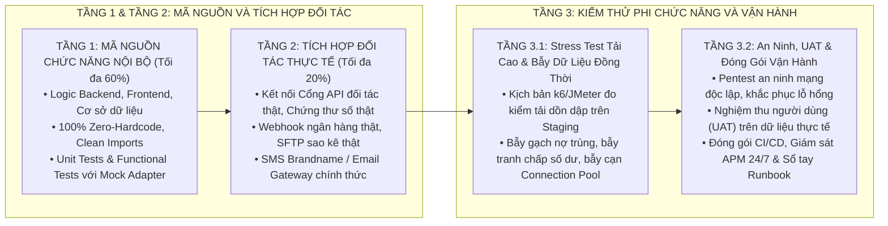

# NGUYÊN TẮC VIẾT TÀI LIỆU, GIAO TIẾP VÀ QUẢN TRỊ TIẾN ĐỘ TOÀN CỤC

Tài liệu này áp dụng chung cho toàn bộ các phiên làm việc, dự án và tác vụ của hệ thống Antigravity / Gemini.

---

## 1. NGUYÊN TẮC NGÔN NGỮ VÀ DIỄN ĐẠT

* **Tiếng Việt chuẩn mực, tự nhiên và chuyên nghiệp:**
  * Sử dụng tiếng Việt rõ ràng, mạch lạc, tự nhiên và chuyên nghiệp.
  * **Tuyệt đối không chèn/đệm tiếng Anh kèm theo không cần thiết** (ví dụ: không viết dạng song ngữ, không mở ngoặc đơn dịch nghĩa tiếng Anh bên cạnh từ tiếng Việt thông thường như *Hạng hội viên (Tier)*, *Nhiệm vụ (Missions)*, *Lượt chơi (Turns)*, *Kiến trúc (Architecture)*, *Lưu nháp (Draft)*, *Màn hình (Screen)*, *Người dùng (User)*,...).
* **Bảo lưu tuyệt đối các thuật ngữ chuyên ngành chuẩn quốc tế (Domain-Specific Terms):**
  * **Bắt buộc giữ nguyên tiếng Anh chuẩn cho các thuật ngữ công nghệ, kỹ thuật chuyên ngành khó hoặc không thể dịch tương đương**, nơi việc dịch sang tiếng Việt làm sai lệch, méo mó hoặc xa rời ngữ nghĩa kỹ thuật thực tế.
  * **Các ví dụ điển hình bắt buộc giữ nguyên:**
    * *Thành phần & Cơ chế nền tảng:* `Engine` (Sync Engine, Routing Engine, Feature Flag Engine, Workflow Engine - tuyệt đối **không dịch là "Động cơ"** vì xa rời bản chất phần mềm), `Framework`, `Middleware`, `Pipeline`, `Token`, `Buffer`, `Cache`, `Gateway`, `Payload`, `Webhook`, `Driver`, `Schema`, `Socket`, `Cluster`, `Worker`, `Plugin`, `Kiosk`, `WASM`, `PWA`, `SaaS`, `Multi-tenant`.
    * *Chuẩn mực & Quy tắc công nghiệp:* `FIFO` (First In, First Out - tuyệt đối không dịch gượng ép), `LIFO`, `BOM` (Bill of Materials), `OEE` (Overall Equipment Effectiveness), `SPC` (Statistical Process Control), `Nelson Rules`, `LOTO` (Lockout-Tagout), `Kanban`, `Kaizen`, `RAG` (Retrieval-Augmented Generation), `Vector Clocks`, `Exponential Backoff`.
    * *Mô hình kiến trúc & Mẫu thiết kế:* `Microservices`, `Hexagonal Architecture`, `Ports and Adapters`, `Outbox Pattern`, `ShedLock`, `Circuit Breaker`, `Zero Trust`, `Clean Architecture`, `Domain-Driven Design (DDD)`, `Event-Driven`.
    * *Giao thức, Công nghệ & Định danh mã nguồn:* `RESTful API`, `gRPC`, `OpenAPI`, `Kafka`, `Redis`, `PostgreSQL`, `ClickHouse`, `Docker`, `Kubernetes`, `Token AES-256`, `JSON`, `SQL`, `status = APPROVED`, `martyrs.identity_code`.
* **Tuyệt đối không đưa câu chữ chỉ dẫn định dạng vào nội dung văn bản:**
  * **Tuyệt đối cấm** đưa các cụm từ mô tả kỹ thuật vẽ sơ đồ, giải thích hiển thị hoặc câu chữ chỉ dẫn nội bộ (như *"theo tỷ lệ lưới 2x2"*, *"tỷ lệ vuông"*, *"Ký tự Unicode Chuẩn (Đảm bảo hiển thị trọn vẹn 100% trên mọi nền tảng)"*, *"Phương thức 1 / 2 / 3"*, *"Theo quy chuẩn docsbase"*,...) vào lời văn báo cáo kỹ thuật. Lời văn chỉ tập trung thuần túy vào giải pháp nghiệp vụ và kiến trúc hệ thống.
  * **Chỉ trình bày duy nhất 1 sơ đồ phù hợp nhất** cho mỗi mục thiết kế, không liệt kê nhiều phương thức lựa chọn thay thế trong cùng một tài liệu bàn giao.

---

## 2. NGUYÊN TẮC TRỰC QUAN VÀ ĐỊNH DẠNG

* **Không lạm dụng biểu tượng (Icon / Emoji):**
  * **Không chèn icon/emoji tràn lan** vào các tiêu đề chương mục (Heading), danh sách đầu dòng, bảng biểu và nội dung văn bản khi không cần thiết.
  * Giữ phong cách trình bày kỹ thuật trang nhã, chuẩn mực, tập trung vào chiều sâu nội dung, tính chính xác và cấu trúc logic.
* **Cấu trúc phân cấp chuẩn:**
  * Sử dụng hệ thống phân cấp đề mục rõ ràng (Heading 1, Heading 2, Heading 3).
  * Dùng bảng biểu (Table), danh sách có thứ tự hoặc gạch đầu dòng để trình bày dữ liệu so sánh, ma trận và thông số kỹ thuật.
* **Sử dụng ký tự Unicode thay cho công thức LaTeX:**
  * **Tuyệt đối không dùng ký hiệu toán học có dấu `$`** như `$\times$` và `$\rightarrow$`.
  * Thay thế toàn bộ bằng ký tự Unicode thuần túy (`×`, `→`), triệt tiêu hoàn toàn độ trễ của bộ máy KaTeX / MathJax và tránh làm treo các công cụ xem trước (Markdown Preview Enhanced).
* **Quy chuẩn Đặt tên Tệp tin Ngắn gọn & Không Trùng lặp Ngữ cảnh (Concise Context-Aware File Naming):**
  * **Tối ưu hóa tên tệp theo ngữ cảnh thư mục cha:** Khi một tệp tin đã nằm trong một thư mục chuyên biệt chứa ngữ cảnh tính năng/dự án/nhiệm vụ (ví dụ: `plan/pentest/`, `plan/smart-otp/`, `docs/topup/`, `specs/kyc/`), **bắt buộc phải đặt tên tệp tin ngắn gọn, súc tích, tuyệt đối không lặp lại ngữ cảnh của thư mục cha** (tránh lặp lại tên dự án, tên phân hệ hay tên tính năng dài dòng).
  * **Quy chuẩn danh mục tên tệp tài liệu chuẩn:**
    * *Hướng dẫn Upcode / Triển khai:* `HDUC.md` (hoặc `HDUP.md`).
    * *Thiết kế Tổng thể:* `HLD.md`.
    * *Thiết kế Chi tiết:* `LLD.md`.
    * *Thiết kế Dữ liệu CSDL:* `DBDD.md` (hoặc `DB_DESIGN.md`).
    * *Tài liệu Yêu cầu Phần mềm:* `SRS.md`.
    * *Hướng dẫn Cài đặt & Vận hành:* `HDCD_VH.md` (hoặc `RUNBOOK.md`).
    * *Hướng dẫn Sử dụng:* `HDSD.md` (hoặc `USER_GUIDE.md`).
    * *Kịch bản & Nghiệm thu UAT:* `UAT.md`.
    * *Ước lượng Nỗ lực:* `EFFORT.md` (hoặc `ESTIMATION.md`).
    * *Đề xuất Giải pháp:* `PROPOSAL.md` / `SOLUTION.md`.
    * *Báo cáo Phân tích An ninh / Nghiên cứu:* `analysis.md` (hoặc `pentest_analysis.md`).
  * **Quy tắc sử dụng tên đầy đủ:** Chỉ sử dụng định dạng đầy đủ dạng `<MÃ_LOẠI>_<TÊN_DỰ_ÁN>_<TÊN_TÍNH_NĂNG>_v<VERSION>.<ext>` khi xuất tệp tin độc lập bàn giao ra ngoài thư mục dự án (standalone deliverables / email / ticket attachment).

---

## 3. NGUYÊN TẮC THIẾT KẾ SƠ ĐỒ VÀ MÔ HÌNH HÓA (DIAGRAMS)

Mục tiêu cốt lõi: **Sơ đồ phải hiển thị to rõ, cân đối ở tỷ lệ chuẩn 4:3, trọn vẹn trong 1 khung nhìn (không bị dẹt ngang co nhỏ chữ, cũng không bị kéo dài dọc gây cuộn trang và trống bên phải), đồng thời tối ưu hiệu năng để không làm treo công cụ xem trước.**

### 3.1. Chuẩn hóa sơ đồ luồng kiến trúc (Flowchart Architecture)
* **Thiết kế 2 cột song song bằng `flowchart LR`:**
  * Sử dụng `flowchart LR` với 2 khối `subgraph` song song (Cột trái và Cột phải), mỗi cột định dạng `direction TB`.
  * Tránh dùng `flowchart TD` đơn luồng vì sẽ làm các khối bị xếp chồng 1 cột dọc hẹp, kéo dài trang và để trống hoàn toàn nửa bên phải.
* **Định dạng nút dạng khối hộp (Block Node):**
  * Sử dụng thẻ ngắt dòng `<br/>` và dấu gạch đầu dòng `•` bên trong nhãn nút để thông tin được dàn đều 3-4 dòng, tạo thành các khối hộp vuông vắn, chữ to rõ.

### 3.2. Tối ưu hóa sơ đồ cơ sở dữ liệu (ERD Optimization)
* **Thu gọn Mermaid ERD mức cao:**
  * Sơ đồ `erDiagram` chỉ hiển thị các thực thể chính và mối quan hệ liên kết giữa các bảng cốt lõi.
  * **Tuyệt đối không nhồi nhét toàn bộ trường/thuộc tính chi tiết vào trong khối Mermaid ERD** (tránh làm quá tải bộ nhớ và treo trình duyệt).
* **Mô tả chi tiết bằng Bảng Markdown tiêu chuẩn:**
  * Toàn bộ mô tả cấu trúc trường, kiểu dữ liệu, khóa chính/ngoại và ý nghĩa nghiệp vụ phải được trình bày bằng danh sách hoặc Bảng Markdown chuẩn (render tức thì, mượt mà 60 FPS).

### 3.3. Quy chuẩn Thiết kế Sơ đồ Khối Hộp Ký tự Unicode (Unicode Text Art Box Standards)
Áp dụng cho các sơ đồ văn bản thuần (Unicode Box Art) nhằm đảm bảo hiển thị hoàn hảo 100% trên mọi nền tảng, không bị lỗi lệch hàng cột:
* **Giới hạn bề ngang cố định 85 - 90 ký tự:**
  * Bề ngang toàn bộ sơ đồ tuyệt đối không vượt quá **90 ký tự**. Việc vượt quá 90 ký tự sẽ gây tràn viền (Line-Wrapping), làm lặp viền dọc (`│ │ │`) và phá vỡ hoàn toàn cấu trúc trên các trình đọc Markdown và màn hình hẹp.
* **Độ dài dòng nhất quán tuyệt đối (100% Exact Line Length):**
  * Tất cả các dòng trong cùng một khối ` ```text ` bắt buộc phải có **chính xác cùng số lượng ký tự** (tính cả khoảng trắng đệm và ký tự viền `│`).
* **Căn dóng tọa độ cột trực giao (Orthogonal Column Alignment):**
  * Mọi đường nối dọc (`│`), mũi tên (`▼`, `▲`), nút phân nhánh (`┬`, `┴`, `┼`) giữa các tầng/khối bắt buộc phải nằm trên **cùng một chỉ số cột (Column Index)** cố định.
* **Bố cục phân vùng con tối đa 2 cột:**
  * Khi chia các khối con bên trong một tầng, chỉ bố trí tối đa **2 cột song song** (mỗi cột rộng 38 - 42 ký tự). Tuyệt đối không xếp 3 - 4 cột con nằm ngang trong một hàng. Nếu có nhiều thành phần (ví dụ 4 microservices), bố trí dạng lưới 2 hàng × 2 cột (Grid 2x2).

### 3.4. Tiêu chuẩn đánh giá sơ đồ đạt chuẩn
* **Độ dễ đọc và hiệu năng cao:** Đọc rõ ràng ở tỷ lệ 100% không cần phóng to, tải ngay lập tức không gây đơ/treo công cụ xem trước Markdown Preview Enhanced.
* **Tính trọn vẹn:** Toàn bộ sơ đồ hiển thị trọn trong một khung nhìn duy nhất, cân đối cả chiều ngang và chiều dọc, không bị tràn trang hoặc cắt đôi khi xuất ra tài liệu PDF/DOCX hoặc in ấn.
* **Không lỗi lệch cột:** Mọi đường kẻ, khung viền và mũi tên khớp nối chính xác tuyệt đối từng tọa độ ký tự.

---

## 4. NGUYÊN TẮC BẰNG CHỨNG THỰC CHỨNG VÀ CHỐNG BÁO CÁO KHỐNG (ZERO OVER-REPORTING)

Áp dụng cho toàn bộ hoạt động đánh giá tiến độ, nghiệm thu kỹ thuật và rà soát mã nguồn:

* **Nguyên tắc "Bằng chứng thực chứng hoặc Chấm 0%" (Hard Evidence or Zero):**
  * Tuyệt đối **CẤM** suy đoán, làm tròn hoặc tô hồng tiến độ.
  * Nếu trong repository **chưa có tệp kịch bản kiểm thử thực tế** (tệp k6 `.js`, tệp JMeter `.jmx`, biên bản Pentest an ninh, hoặc tệp log kết quả đo kiểm trên hạ tầng cụ thể) → **BẮT BUỘC ghi nhận là `Chờ xử lý (0%)` hoặc `Chưa thực hiện`**.
  * Cấm tự ý tuyên bố các chỉ số hiệu năng (như *"Đã kiểm thử tải 1.000 RPS P95 < 200ms"*) khi chưa chạy bài đo kiểm thực tế trên môi trường Staging/Production tương ứng.
* **Phân biệt rạch ròi giữa Test Chức năng Đơn luồng và Tải Cao Thực Tế:**
  * Việc chạy pass các bài kiểm thử đơn vị (Unit Test) hoặc kiểm thử giao diện/API đơn luồng (E2E Functional Test với Mock Data) chỉ chứng minh logic nghiệp vụ chạy đúng trong điều kiện lý tưởng.
  * Tuyệt đối **KHÔNG ĐƯỢC** đánh đồng kết quả kiểm thử đơn luồng này để kết luận hệ thống đã "Hoàn tất 100%" hoặc "Sẵn sàng Go-Live".

---

## 5. QUY CHUẨN ĐÁNH GIÁ TIẾN ĐỘ 3 TẦNG ĐỘC LẬP (3-TIER PROGRESS VALUATION)

Tiến độ của một dự án/phân hệ chỉ được coi là hoàn tất 100% khi và chỉ khi vượt qua cả 3 tầng độc lập, tuyệt đối không lấy tầng này bù cho tầng khác:



* **Tầng 1 — Mã nguồn chức năng nội bộ (Tỷ trọng 60%):** Xây dựng xong logic nghiệp vụ, Entity, Repository, API, giao diện và bài test đơn luồng nội bộ.
* **Tầng 2 — Tích hợp Đối tác Bên ngoài Thực tế (Tỷ trọng 20%):** Hoàn tất kết nối thông suốt với các dịch vụ bên ngoài (ngân hàng, cơ quan nhà nước, nhà mạng viễn thông, chứng thư số). Nếu đang chạy Mock Adapter → Tầng này bắt buộc chấm 0%.
* **Tầng 3 — Kiểm thử Phi Chức Năng, Tải Cao & Vận Hành (Tỷ trọng 20%):** Thực thi kịch bản k6/JMeter tải lớn trên cụm phân tán Staging, Pentest an ninh, UAT thực tế và sẵn sàng Production.

---

## 6. QUY CHUẨN KIỂM THỬ TẢI VÀ TOÀN VẸN DỮ LIỆU ĐỒNG THỜI (CONCURRENCY DATA INTEGRITY)

Mọi hoạt động kiểm thử hiệu năng và tải cao bắt buộc phải tuân thủ:

1. **Bắt buộc có bài bẫy dữ liệu đồng thời (Concurrency Data Integrity Check):**
   * Không chỉ đo lường thời gian phản hồi (Latency P95/P99) và số lượng request/giây (RPS), mà **bắt buộc phải có câu lệnh truy vấn cơ sở dữ liệu đối soát sau khi kết thúc tải**.
   * Bẫy xung đột khóa phân tán: Đảm bảo nhiều request cùng tác động vào 1 tài nguyên chỉ có đúng 1 request thành công, các request sau bị từ chối an toàn (chống thanh toán/gạch nợ trùng).
   * Bẫy tranh chấp số dư tài chính: Đảm bảo tổng số dư cuối cùng trong sổ cái khớp 100% với tổng giao dịch, không bị lỗi Dirty Read / Lost Update do thiếu Transaction Isolation.
2. **Giám sát tài nguyên phần cứng và Connection Pool:**
   * Giám sát Connection Pool (HikariCP, c3p0) không bị cạn kiệt (`pending connections = 0`, không phát sinh `ConnectionTimeoutException`).
   * Giám sát Deadlock và Lock Contention trên cơ sở dữ liệu quan hệ (Oracle, PostgreSQL, MySQL).
3. **Môi trường đo kiểm đạt chuẩn:**
   * Bắt buộc thực hiện trên môi trường cụm phân tán (Staging / Pre-Production) có cấu hình phần cứng, mạng và cơ sở dữ liệu tương đương Production. Tuyệt đối không lấy kết quả chạy trên máy cá nhân đơn lẻ để kết luận năng lực chịu tải của hệ thống.

---

## 7. NGUYÊN TẮC THỰC THI KHỚP NỐI 100% THIẾT KẾ VÀ CHỐNG CẮT XÉN KỸ THUẬT (DESIGN-DRIVEN EXECUTION & ZERO SHORTCUTS)

Áp dụng cho toàn bộ hoạt động lập trình, hiện thực hóa mã nguồn từ tài liệu thiết kế (HLD, SRS, LLD, DBDD):

1. **Tuyệt đối cấm tự ý thay đổi Tech Stack (Zero Tech Stack Deviation):**
   * Mọi phân hệ mã nguồn bắt buộc phải được triển khai **chính xác theo đúng nền tảng công nghệ đã được phê duyệt trong HLD và LLD**:
     * *Phân hệ Web Quản trị (CMS/Admin/BackOffice):* Bắt buộc dùng Web Framework (Next.js / React) chuẩn FSD.
     * *Phân hệ Hiện trường Kiosk / Tablet Cố định:* Bắt buộc dùng Native/Flutter Tablet cho màn hình ngang Kiosk, kết nối phần cứng công nghiệp.
     * *Phân hệ Hiện trường Di động Cầm tay (Handheld):* Bắt buộc dùng Flutter Mobile cho công nhân/kỹ thuật viên hiện trường.
     * *Phân hệ Ứng dụng Nhân viên Dùng Chung:* Bắt buộc dùng Flutter Mobile đa vùng mạng.
   * **Nghiêm cấm hành vi tự ý "gộp chung toàn bộ vào Web Monorepo"** hoặc dùng giao diện Web để giả lập ứng dụng di động/Kiosk nhằm đi đường tắt.

2. **Nguyên tắc Chiều sâu Nghiệp vụ (Deep Functional Implementation):**
   * **Tuyệt đối cấm triển khai bề mặt (Shallow Implementation / Placeholder):** Nghiêm cấm việc chỉ tạo khung giao diện tĩnh với 1-2 nút bấm sơ sài để "đối phó" tiến độ.
   * Mọi màn hình chức năng khi triển khai bắt buộc phải hiện thực hóa **100% các thành phần trong bảng mô tả giao diện**, bao gồm:
     * Hộp thoại xác thực phân quyền / mã PIN / chứng chỉ kỹ năng trước khi thao tác.
     * Toàn bộ các bước Checklist nghiệp vụ an toàn (ví dụ: LOTO 5 bước).
     * Các luồng xử lý ngoại lệ (Exception / Alternative Flows), kịch bản biên (Edge Cases), cảnh báo và xác nhận nguy hiểm.

3. **Nguyên tắc Ma trận Đối soát Chức năng 1-1 (100% Functional Traceability Matrix):**
   * Trước khi bắt đầu lập trình hoặc nghiệm thu bất kỳ phân hệ nào, bắt buộc phải lập bảng **Ma trận Đối soát 1-1** đối chiếu từng mã chức năng (`F-1.1`, `F-1.2`, ..., `F-x.y`) từ SRS/LLD sang tệp mã nguồn cụ thể (Screen, Service, Repository, API Endpoint).
   * Tuyệt đối không để sót bất kỳ tính năng vệ tinh, tính năng hỗ trợ hoặc công cụ phụ trợ nào đã được mô tả trong tài liệu thiết kế.

4. **Nguyên tắc Tách bạch Tầng Dữ liệu & Cấm Mock Data trong UI Component (Mandatory Service Layer):**
   * 100% các thành phần giao diện (UI Components / Screens) **bắt buộc phải gọi dữ liệu thông qua Tầng Dịch vụ (Service Layer) và HTTP Client**, truyền nhận DTOs khớp chính xác với API contracts của Backend.
   * Tuyệt đối cấm định nghĩa mảng dữ liệu Mock cứng (hardcoded array) trực tiếp bên trong component giao diện.

---

## 8. NGUYÊN TẮC RÀ SOÁT BẢO MẬT, XÁC THỰC PHIÊN VÀ KIỂM THỬ AN NINH THỰC CHỨNG (SECURITY REVIEW & CALL-PATH VERIFICATION)

Áp dụng cho toàn bộ hoạt động lập trình, rà soát mã nguồn (Code Review), vá lỗ hổng Pentest và nghiệm thu bảo mật hệ thống:

1. **Nguyên tắc "Mặc Định Từ Chối Trên 100% Luồng Dữ Liệu" (Default Deny & 100% Call-Path Verification):**
   * **Kiểm tra quyền sở hữu tại điểm trả dữ liệu cuối cùng:** Không bao giờ giả định dữ liệu lấy từ hệ thống ngoài (Core eWallet, WSO2, vi dịch vụ nội bộ) đã an toàn. Mọi dữ liệu trước khi trả về cho Client bắt buộc phải so khớp danh tính người dùng (`loggedInfo`).
   * **Dò vết 100% các nhánh rẽ (`if/else/return`):** Tuyệt đối không kết luận một API an toàn chỉ vì thấy có đoạn kiểm tra quyền ở nhánh phụ (Fallback/DB) mà bỏ quên luồng chính. Dữ liệu không chứng minh được thuộc quyền sở hữu của người gọi bắt buộc phải từ chối ngay (`ERR_PARAMETERS_INVALID`).

2. **Nguyên tắc "Đồng Bộ Trạng Thái Trong Kiến Trúc Phi Trạng Thái" (Stateless Distributed Cache Persistence):**
   * **Biến trong RAM là vô nghĩa nếu không ghi lại xuống Cache:** Backend là Stateless, mỗi HTTP request là một luồng độc lập. Mọi thay đổi trạng thái đối tượng nghiệp vụ (như tăng số lần thử sai `failCounter++`, đổi trạng thái phiên, ghi nhận thời gian) bắt buộc phải được gọi lệnh ghi đè ngược lại Redis (`setOtpTransaction` / `RedisService.set`).
   * **Bảo toàn trạng thái tại mọi nhánh thoát lỗi (`Early Return / Catch`):** Khi hàm trả về lỗi xác thực OTP, bắt buộc phải cập nhật trạng thái `failCounter` vào Redis trước khi trả về response lỗi cho Client để ngăn chặn tấn công vét cạn (Brute-force).

3. **Nguyên tắc "Phòng Vệ Chiều Sâu Khép Kín 2 Chiều" (Action-Gate Defense-in-Depth):**
   * **Phía Hành Động (Action Integrity):** Khi người dùng Đăng xuất (Logout), Đổi PIN hoặc Khóa tài khoản, phải xác định định danh chính xác từ phiên đã xác thực (tránh bẫy `null` trong key format), xóa triệt để trên toàn bộ các tầng cache (Redis Token, Redis Device) và cập nhật trạng thái DB (`LOGGED_OUT`).
   * **Phía Cổng Chặn (Gate / Filter / Interceptor):** Bộ lọc bảo mật (`RsAuthFilter`) bắt buộc phải kiểm tra đa lớp: Token phiên có tồn tại trong Cache không VÀ trạng thái thiết bị có đang là `LOGGED_IN` không (từ chối `401 Unauthorized` ngay lập tức nếu là `LOGGED_OUT`).

4. **Nguyên tắc "Bằng Chứng Thực Chứng — Hard Evidence or Zero" Trong Nghiệm Thu An Ninh:**
   * Tuyệt đối **CẤM** đánh giá "PASS" hoặc "Đã khắc phục" chỉ bằng việc đọc mã nguồn bằng mắt.
   * Bắt buộc phải có **kịch bản kiểm thử thực nghiệm (Proof of Concept - PoC)** mô phỏng đúng hành vi tấn công (gửi request chéo tài khoản cho IDOR, gửi liên tiếp 5 OTP sai rồi 1 OTP đúng cho Brute-force, dùng lại token cũ sau khi logout).
   * Cấu hình hạ tầng (Nginx Rate-Limiting, WAF) chỉ được coi là hoàn tất khi đã kích hoạt thực tế trên Staging và có kết quả đo kiểm chặn mã lỗi `429 Too Many Requests`.

5. **Nguyên tắc "Sửa Lỗi Nhất Quán Toàn Cục" (Global Consistency over Local Patch):**
   * Khi phát hiện và vá một lỗ hổng bảo mật tại một điểm (Controller/Service), bắt buộc phải dò quét toàn bộ codebase (`grep_search`) để tìm và sửa đồng bộ trên tất cả các chức năng có logic tương tự, tuyệt đối không sửa cục bộ để sót các endpoint khác.

---

## 9. NGUYÊN TẮC CỐT LÕI BẮT BUỘC KHÔNG ĐƯỢC PHÉP VI PHẠM TRONG MỌI TÌNH HUỐNG (MANDATORY NON-NEGOTIABLE CORE DEVELOPMENT PRINCIPLES)

Áp dụng tuyệt đối cho 100% các hoạt động lập trình Backend, Frontend Web CMS, Mobile/Tablet App và tích hợp hệ thống:

1. **Tuyệt đối CẤM Hardcode Chuỗi & CẤM So Sánh Trực Tiếp Không Dùng Enum (100% Enum-Driven):**
   * **Bắt buộc dùng 100% Enum:** Mọi trạng thái (`status`), phân loại (`type`, `category`), vai trò (`role`), phương thức (`method`), mã lỗi (`errorCode`), phân hệ (`module`), kênh (`channel`) bắt buộc phải được định nghĩa bằng Enum ở cả Backend (Java) và Frontend (TypeScript / Dart).
   * **CẤM so sánh chuỗi literal tự do:** Tuyệt đối cấm so sánh dạng `if (status == "ACTIVE")`, `if ("OPERATOR".equals(role))`, `if (code == "ERR_01")`. Mọi phép kiểm tra, phân nhánh, switch-case, parsing và validation bắt buộc phải thông qua Enum an toàn (`Enum.valueOf`, `fromCode()`, `EnumSet`).

2. **Tuyệt đối CẤM Mock Data & CẤM Gán Giá Trị Mặc Định Giả Lập (Zero Mock Data & Zero Fake Default Values):**
   * **Cấm Fake Default Values khi nạp/xử lý dữ liệu:** Khi dữ liệu đầu vào (tệp Excel/CSV, Request API) bị thiếu hoặc không hợp lệ, tuyệt đối **CẤM** tự ý gán giá trị mặc định giả lập (như tự gán `role = OPERATOR`, `status = OFFLINE/RUNNING`, `capacity = 4`, `category = MAIN_DISH/VOUCHER`, tự tạo tòa nhà/chuyền giả). Dữ liệu sai/thiếu bắt buộc phải được ghi nhận thành lỗi cụ thể (`RowErrorDetail` / `BusinessException`) để người dùng/hệ thống nguồn điều chỉnh.
   * **Truy vấn 100% từ Cơ sở Dữ liệu thực tế:** Khi tạo tệp mẫu, danh mục tham chiếu, Lookup Sheet hoặc trả dữ liệu DTO, 100% dữ liệu bắt buộc phải được truy vấn từ CSDL thực tế theo `tenantId`. Tuyệt đối cấm tạo danh sách giả lập `List.of(...)` trong mã nguồn.
   * **Trạng thái khởi tạo UI rỗng:** Khi khởi tạo form/state tại Frontend, bắt buộc nạp từ API hoặc để giá trị rỗng (`""`, `null`, `[]`), cấm tự ý điền sẵn dữ liệu giả lập.

3. **Tuyệt đối CẤM Ghi Log Bằng Tiếng Việt — Bắt Buộc 100% Tiếng Anh Chuẩn Kỹ Thuật (Zero Vietnamese in Technical Logs):**
   * Toàn bộ câu lệnh ghi nhật ký kỹ thuật (`log.info`, `log.warn`, `log.error`, `log.debug`, `console.log`, `print`, `logger`) trong mã nguồn Backend, Frontend và Mobile **bắt buộc phải viết 100% bằng tiếng Anh chuẩn kỹ thuật** (ví dụ: `log.info("Generating template for tenant: {}", tenantId)`, `log.error("Failed to parse Excel file for tenant: {}", tenantId, e)`).
   * Tuyệt đối cấm viết log có dấu hoặc không dấu bằng tiếng Việt để đảm bảo tính tương thích và giám sát tập trung quốc tế (ELK, Datadog, Grafana Loki, CloudWatch).

4. **Tuyệt đối CẤM Hardcode Thông Báo & Bắt Buộc Khai Báo Đa Ngôn Ngữ i18n (100% i18n Internationalization):**
   * Toàn bộ câu chữ thông báo giao diện, nhãn trường, mô tả cột, thông điệp thành công/thất bại, thông điệp lỗi nghiệp vụ và mã lỗi trả về cho người dùng **bắt buộc phải được quản lý tập trung qua hệ thống i18n** (`messages_vi.properties`, `messages_en.properties`, `messages.properties` ở Backend, và tệp dịch i18n JSON/TS tương ứng ở Frontend).
   * Tuyệt đối cấm hardcode câu chữ tiếng Việt hoặc tiếng Anh trực tiếp trong Service, Controller hay React/Flutter Component.
   * Khi tạo mới bất kỳ tính năng hoặc mã lỗi nào, bắt buộc phải khai báo đồng bộ vào toàn bộ các tệp ngôn ngữ của hệ thống.

---

## 10. NGUYÊN TẮC GIẢI QUYẾT SỰ CỐ PHỨC TẠP VÀ TRUY VẾT NGUYÊN NHÂN GỐC RỄ THỰC CHỨNG (ROOT CAUSE TRACING & SYSTEMATIC DEBUGGING FRAMEWORK)

Áp dụng cho toàn bộ hoạt động xử lý lỗi, điều tra sự cố kéo dài và gỡ lỗi hệ thống phân tán:

1. **Tuyệt đối Chống Suy Đoán và Thử Bừa (Zero-Guesswork Policy):**
   * Khi một vấn đề kỹ thuật xử lý quá 2 lần chưa dứt điểm (hoặc phát sinh hiện tượng chập chờn, lúc được lúc mất), **CẤM TUYỆT ĐỐI** việc chỉnh sửa mã nguồn dựa trên phỏng đoán cảm tính hoặc thử nghiệm may rủi.
   * Mọi can thiệp mã nguồn chỉ được phép tiến hành sau khi đã xác định chính xác 100% nguyên nhân gốc rễ bằng dữ liệu thực chứng (Hard Evidence).

2. **Thiết lập Cây Đánh giá Yếu tố Ảnh hưởng Đầu Cuối (End-to-End Dependency & Impact Factor Tree):**
   * Bắt buộc phân rã luồng xử lý thành chuỗi các mắt xích độc lập từ đầu vào đến đầu ra:
     * *Mắt xích 1 — Tiếp nhận & Dữ liệu đầu vào (Ingress / Sidecar / Webhook):* Dữ liệu có vào hệ thống không? Định dạng payload có đúng chuẩn không?
     * *Mắt xích 2 — Xử lý Logic & Lưu trữ CSDL (Backend Engine & Persistence):* Backend có nhận được request không? Bảng CSDL có ghi nhận bản ghi mới không? Trạng thái trường có đúng không?
     * *Mắt xích 3 — Tầng mạng, Hạ tầng & Bộ đệm (Reverse Proxy / Nginx / Buffer / SSE / Socket):* Gói tin có bị chặn ở Proxy không? Bộ đệm Proxy có giữ luồng không? Timeout có bị ngắt không?
     * *Mắt xích 4 — Dịch vụ Bên thứ ba & Cổng Thông báo (Gateway / FCM / APNs / Third-party):* Khóa chứng thư có hợp lệ không? Cổng đối tác trả về mã thành công hay thất bại?
     * *Mắt xích 5 — Máy khách & Kết xuất Giao diện (Client App / Local Cache / Reactive UI):* Client có kết nối thành công không? Bộ nhớ đệm cục bộ (SQLite / WatermelonDB) có lưu không? UI có lắng nghe đúng sự kiện để render lại không?

3. **Thu thập Bằng chứng Thực chứng Độc lập tại Từng Mắt Xích (Step-by-Step Evidence Verification):**
   * **Bằng chứng từ Log hệ thống:** Trích xuất log chính xác từ Container (`docker logs`), tệp log ứng dụng, tệp log Nginx (`access.log`, `error.log`), hoặc log thiết bị (`adb logcat`, Console log).
   * **Bằng chứng từ Cơ sở dữ liệu:** Chạy câu lệnh SQL trực tiếp trên CSDL máy chủ và kiểm tra bảng dữ liệu cục bộ trên máy khách để đối chiếu sự nhất quán.
   * **Bằng chứng từ Đo kiểm Mạng:** Trích xuất mã trạng thái HTTP, luồng sự kiện SSE, hoặc phản hồi API từ Gateway của đối tác.

4. **Cô lập Điểm Lỗi và Xử lý Dứt điểm Một Lần Duy Nhất (Isolate & Patch):**
   * Chỉ sửa mã nguồn tại đúng mắt xích bị lỗi sau khi đã chỉ ra được bằng chứng tại mắt xích đó.
   * Sau khi sửa, bắt buộc chạy lại đúng kịch bản kiểm tra thực chứng từ đầu đến cuối để xác nhận 100% các mắt xích đều thông suốt.

