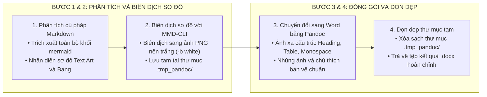

# QUY CHUẨN XUẤT BẢN TÀI LIỆU KỸ THUẬT SANG WORD (DOCX / PDF EXPORT STANDARD)

Tài liệu này quy định hệ thống nguyên tắc và quy trình xuất bản các tệp tài liệu kỹ thuật từ định dạng Markdown sang định dạng Microsoft Word (`.docx`) hoặc PDF, bảo đảm sơ đồ và bảng biểu hiển thị sắc nét, không vỡ khung và tương thích hoàn hảo.

---

## 1. NGUYÊN TẮC XUẤT BẢN TÀI LIỆU CỐT LÕI

1. **Chiến lược Hiển thị Sơ đồ Đa Phương thức:**
   * **Phương thức Sơ đồ Khối Hộp Ký tự Unicode (Unicode Text Art):** Khi xuất bản tài liệu sang Word/PDF, các khối `text` chứa sơ đồ hộp ký tự Unicode (`┌`, `─`, `┐`, `│`, `▲`, `▼`) được chuyển đổi nguyên vẹn 100% bằng phông chữ đơn cách (Monospace font như Consolas, Courier New), không cần cài đặt bất kỳ công cụ đồ họa nào và không bao giờ gặp lỗi thiếu ảnh.
   * **Phương thức Biên dịch Mermaid sang PNG:** Mọi khối mã `mermaid` bắt buộc phải được biên dịch thành ảnh định dạng `.png` độ phân giải cao với **chế độ nền trắng (`-b white`)** để tránh việc chữ đen trên nền tối khi xem Word ở Dark Mode.
2. **Xử lý Chú thích Ảnh (Figure Captions) chuẩn mực:**
   * Tiêu đề chú thích ảnh phải được định dạng căn giữa bằng cú pháp Markdown chuẩn `` để trình biên dịch Pandoc nhận diện đúng đối tượng hình ảnh và bảng biểu trong Microsoft Word.
3. **Chuyển đổi Khối Cảnh báo & Hộp thông tin (Alert Callouts):**
   * Các khối thông tin đặc biệt (`NOTE`, `TIP`, `IMPORTANT`, `WARNING`, `CAUTION`) phải được tự động chuyển đổi thành đoạn văn bản in đậm có đánh dấu phân loại rõ ràng, giúp nổi bật các lưu ý kỹ thuật khi in ấn hoặc xem trên Word.
4. **Quản trị Tệp tin Ngăn nắp (Zero-Clutter):**
   * Toàn bộ tệp ảnh trung gian và tệp tạm thời sinh ra trong quá trình xuất bản phải được lưu trữ trong thư mục tạm `.tmp_pandoc/` và tự động dọn dẹp sạch sẽ sau khi hoàn tất.
   * Tuyệt đối không để lại các tệp `.mmd`, `.png` rác ở thư mục gốc của dự án.

---

## 2. QUY TRÌNH BIÊN DỊCH VÀ CÂU LỆNH MẪU

Sử dụng kịch bản tự động hóa Node.js hoặc công cụ `mermaid-cli` kết hợp `pandoc` theo quy trình 4 bước:

