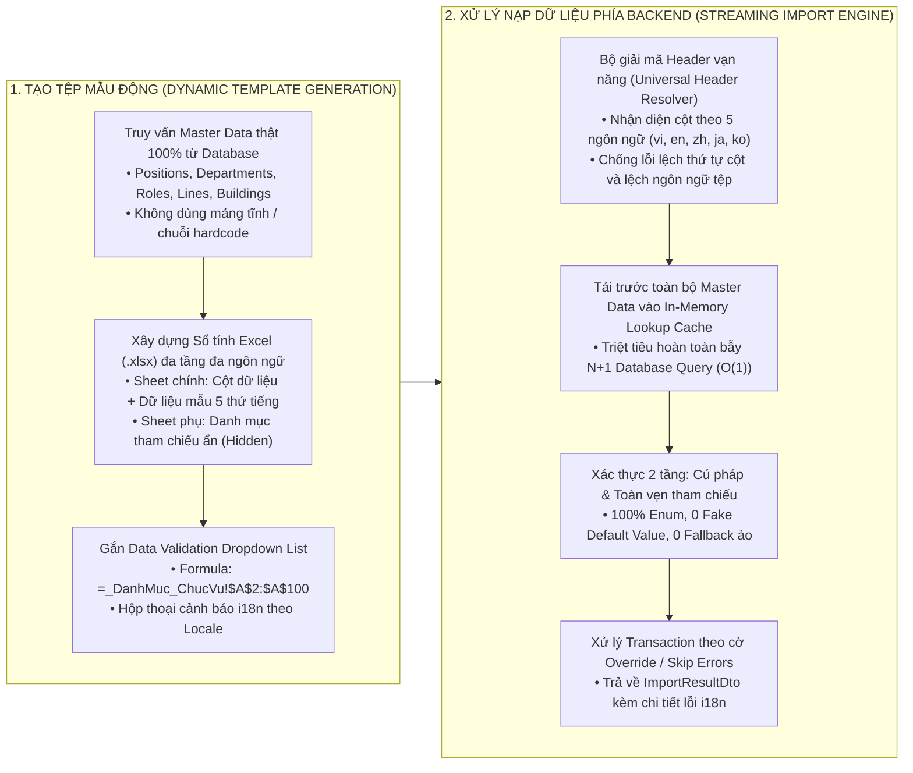
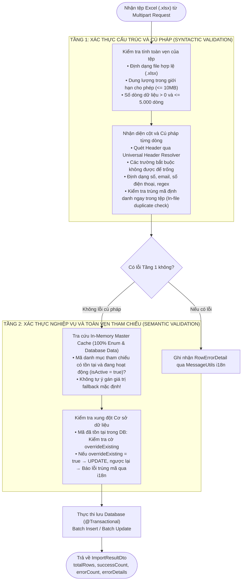

# QUY CHUẨN KIẾN TRÚC IMPORT/EXPORT DỮ LIỆU CẤP DOANH NGHIỆP
# (ENTERPRISE MASTER DATA IMPORT/EXPORT ARCHITECTURE RULES)

Tài liệu này là quy chuẩn bắt buộc áp dụng trực tiếp cho toàn bộ phân hệ Backend và Frontend khi thiết kế, xây dựng và nghiệm thu các chức năng Nhập/Xuất dữ liệu hàng loạt (Batch Data Import/Export).

---

## 1. NGUYÊN TẮC CỐT LÕI KHÔNG THỎA HIỆP (NON-NEGOTIABLE PRINCIPLES)



### 1.1. Chuẩn Hóa CSDL Master Catalog & Tuyệt Đối Cấm Fallback Ảo (Zero Fake Default Values)
* **Bắt buộc có Bảng Danh mục CSDL Thực tế (Database Catalog Integrity):**
  * Mọi trường thông tin mang tính phân loại hoặc danh mục (Chức vụ, Vai trò, Phòng ban, Dây chuyền, Tòa nhà, Món ăn, Quà tặng) **bắt buộc phải có bảng Master Catalog tương ứng trong CSDL**, kèm tệp migration Flyway/Liquibase, Entity, Repository, chỉ mục `idx_<table_name>_tenant` và ràng buộc duy nhất `uq_<table_name>_tenant_code`.
  * Tuyệt đối cấm để dữ liệu danh mục thành chuỗi tự do (String literal) mà không có bảng Master Catalog quản lý.
* **Khi sinh tệp mẫu (`GET .../import/template`):**
  * Mọi danh mục tham chiếu đổ vào Sheet tra cứu (`Reference Sheets`) **bắt buộc phải được truy vấn 100% từ CSDL thực tế theo `tenantId`** với trạng thái đang hoạt động (`is_active = true` hoặc `status = ACTIVE`).
  * **TUYỆT ĐỐI CẤM** gán cứng danh sách giả lập trong Service hay Controller.
* **Khi nạp dữ liệu (`POST .../import`):**
  * **TUYỆT ĐỐI CẤM** tự ý gán giá trị mặc định (Fallback) khi dữ liệu người dùng nhập bị thiếu hoặc không tìm thấy trong CSDL.
  * Mọi trường hợp sai lệch giá trị, không tìm thấy khóa ngoại tham chiếu trong CSDL hoặc sai định dạng Enum **BẮT BUỘC phải ghi nhận lỗi vào danh sách `RowErrorDetail`**.

### 1.2. Chuẩn Hóa Đa Ngôn Ngữ 5 Thứ Tiếng Toàn Diện (Multilingual i18n Standard)
Hệ thống Import/Export bắt buộc phải hỗ trợ đồng bộ 5 ngôn ngữ chuẩn doanh nghiệp: **Tiếng Việt (`vi`), Tiếng Anh (`en`), Tiếng Trung (`zh`), Tiếng Nhật (`ja`), Tiếng Hàn (`ko`)**:

1. **Tên tệp đính kèm (`Content-Disposition`):**
   * Đặt tên tệp theo chuẩn quốc tế RFC 5987 / RFC 6266 (`filename*=UTF-8''...`).
   * Sử dụng `ExcelHttpHelper.createAttachmentResponse(byte[] content, String filenameI18nKey, Locale targetLocale)` để giải mã tên tệp tương ứng với ngôn ngữ của Client.
2. **Tên Sheet và Tiêu đề Cột Header:**
   * Tên Sheet chính (`sheetNameI18nKey`) và tiêu đề từng cột (`headerI18nKey`) trong `ExcelColumnSchema` phải được phân giải động theo `targetLocale`.
   * Cột bắt buộc nhập phải có dấu hoa thị đỏ `*`.
3. **Dữ liệu Mẫu (Sample Data / Sample Rows):**
   * Toàn bộ giá trị trong các dòng dữ liệu mẫu (`sampleRows`) và `sampleValueI18nKey` trong `ExcelColumnSchema` **bắt buộc phải được khai báo đa ngôn ngữ** trên cả 5 tệp `messages*.properties`.
   * Bộ tạo mẫu `ExcelTemplateBuilder` tự động nhận diện tiền tố `excel.sample.` để dịch động sang ngôn ngữ Client khi tải tệp.
4. **Hộp thoại Hướng dẫn và Data Validation Dropdown:**
   * Tiêu đề và nội dung cảnh báo dữ liệu (`Validation Error Alert`) hiển thị bằng ngôn ngữ của người dùng.
5. **Bộ Giải Mã Header Vạn Năng Khi Import (`Universal Header Resolver`):**
   * Phương thức `ExcelParserHelper.resolveHeaderIndices(headerRow, schemas)` tự động quét dòng tiêu đề thực tế trên tệp Excel của người dùng và so khớp linh hoạt theo cả 5 ngôn ngữ (bỏ qua dấu sao, dấu hai chấm, khoảng trắng thừa, chữ hoa/thường).
   * Cho phép người dùng tải tệp mẫu bằng tiếng Anh nhưng nạp lại trên giao diện tiếng Việt (hoặc ngược lại) mà không bao giờ bị lỗi lệch cột.
6. **Quốc tế Hóa Thông Báo Lỗi:**
   * Toàn bộ thông điệp lỗi trong `RowErrorDetail` và kết quả nạp tệp phải được dịch qua `MessageUtils.getMessage("import.error.*", args)`.

### 1.3. Chuẩn Hóa 100% Tiếng Anh Cho Hệ Thống Log Kỹ Thuật (Zero Vietnamese in Logs)
* Toàn bộ câu lệnh ghi nhật ký kỹ thuật (`log.info`, `log.warn`, `log.error`, `log.debug`) **bắt buộc phải viết 100% bằng tiếng Anh kỹ thuật chuẩn mực**.

### 1.4. Bắt Buộc Sử Dụng 100% Enum Cho Mọi Trạng Thái & Phân Loại
* Không so sánh chuỗi literal tự do.
* Sử dụng phương thức an toàn của Enum (ví dụ: `Enum.valueOf` trong khối `try-catch` hoặc `fromCode`) để validate. Nếu không thuộc tập hợp Enum hợp lệ, lập tức ghi nhận lỗi `RowErrorDetail`.

---

## 2. QUY TRÌNH THIẾT KẾ BỘ SINH TỆP MẪU EXCEL (`ExcelTemplateBuilder`)

Mỗi API sinh tệp mẫu (`GET .../import/template`) phải trả về tệp `.xlsx` đáp ứng các tiêu chuẩn kỹ thuật sau:

| Thành phần Sheet | Tiêu chuẩn Kỹ thuật | Chi tiết Triển khai |
| :--- | :--- | :--- |
| **Header Row** | Dòng tiêu đề cột | Nền Header `#0284C7`, chữ trắng in đậm, căn giữa, tự động bật Filter (`sheet.setAutoFilter`). Cột bắt buộc đánh dấu `*`. |
| **Freeze Panes** | Cố định dòng tiêu đề | Cố định dòng 1 (`sheet.createFreezePane(0, 1)`) để khi cuộn trang người dùng vẫn nhìn rõ tiêu đề cột. |
| **Sample Rows** | Dòng dữ liệu mẫu đa ngôn ngữ | Điền 2-3 dòng dữ liệu mẫu thực tế đã được dịch động theo `targetLocale` (tự động giải mã khóa `excel.sample.*`). |
| **Reference Sheets** | Sheet danh mục tra cứu | Tạo các sheet riêng biệt chứa danh mục thực tế từ CSDL: Cột A là Mã (Code), Cột B là Tên (Name). Ẩn sheet (`sheet.setHidden(true)`). |
| **Validation Dropdown** | Hộp chọn thả xuống | Sử dụng `DataValidationHelper` và công thức `=_DanhMuc_TenSheet!$A$2:$A$N` vào các cột danh mục từ dòng 2 đến dòng 5.000. |

---

## 3. QUY TRÌNH XÁC THỰC VÀ XỬ LÝ TRANSACTION PHÍA BACKEND

### 3.1. Ma Trận Xác Thực 2 Tầng (2-Tier Validation Matrix)



### 3.2. Cấu Trúc DTO Phản Hồi Chuẩn Mực (`ImportResultDto`)

```json
{
  "totalRows": 100,
  "successCount": 98,
  "errorCount": 2,
  "overrideCount": 15,
  "insertedCount": 83,
  "errors": [
    {
      "rowNumber": 14,
      "columnName": "email",
      "invalidValue": "invalid-email-format",
      "errorMessage": "Email không đúng định dạng chuẩn RFC 5322"
    },
    {
      "rowNumber": 42,
      "columnName": "buildingName",
      "invalidValue": "Tòa Nhà Z",
      "errorMessage": "Tòa nhà không tồn tại trong hệ thống quản lý KTX"
    }
  ],
  "errorReportUrl": null
}
```
