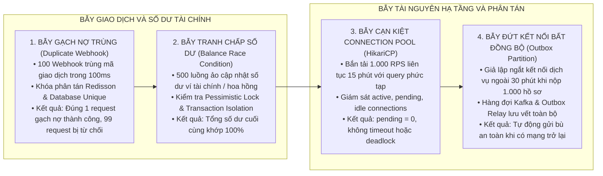

# QUY CHUẨN VÀ NGUYÊN TẮC KIỂM THỬ TẢI CAO VÀ TOÀN VẸN DỮ LIỆU ĐỒNG THỜI (LOADTEST & CONCURRENCY)

Tài liệu này quy định hệ thống nguyên tắc, 4 kịch bản bẫy dữ liệu bắt buộc và phương pháp thiết kế kịch bản kiểm thử tải cao (k6 / JMeter) bảo đảm tính toàn vẹn dữ liệu khi có tranh chấp đồng thời lớn.

---

## 1. NGUYÊN TẮC BẰNG CHỨNG THỰC CHỨNG VÀ BẢO ĐẢM TOÀN VẸN DỮ LIỆU

1. **Nguyên tắc Có bằng chứng thực chứng hoặc Chấm 0% (Hard Evidence or Zero):**
   * Tuyệt đối không suy đoán, làm tròn hoặc công bố chỉ số hiệu năng (như *"Đã test 1.000 RPS P95 < 200ms"*) khi chưa chạy bài đo kiểm thực tế trên môi trường Staging/Pre-Production tương đương.
   * Nếu chưa có tệp kịch bản k6 (`.js`) / JMeter (`.jmx`) và tệp log kết quả đo kiểm thực tế → Bắt buộc ghi nhận là `Chờ xử lý (0%)` hoặc `Chưa thực hiện`.
2. **Không đánh đồng Kiểm thử Chức năng Đơn luồng với Kiểm thử Tải & Tích hợp:**
   * Việc vượt qua các bài kiểm thử đơn vị hoặc kiểm thử giao diện đơn luồng với Mock Adapter chỉ chứng minh logic nghiệp vụ chạy đúng trong điều kiện lý tưởng.
   * Tuyệt đối không lấy kết quả này để kết luận hệ thống đã sẵn sàng Go-Live.
3. **Mọi bài kiểm thử tải bắt buộc có Khẳng định Toàn vẹn Dữ liệu (Data Integrity Assertion):**
   * Không chỉ đo lường thời gian phản hồi (Latency P95/P99) và số lượng yêu cầu mỗi giây (RPS), mà **bắt buộc phải có câu lệnh truy vấn cơ sở dữ liệu đối soát sau khi kết thúc tải**.
   * Đảm bảo không phát sinh các lỗi tranh chấp dữ liệu: Gạch nợ trùng, tính sai số dư ví tài chính, cạn kiệt Connection Pool hoặc Deadlock CSDL.

---

## 2. BỐN KỊCH BẢN BẪY DỮ LIỆU ĐỒNG THỜI BẮT BUỘC

Mọi hệ thống xử lý giao dịch, tài chính hoặc hồ sơ trực tuyến phải trải qua 4 bài bẫy dữ liệu sau:



### 2.1. Kịch bản 1: Bẫy Gạch nợ trùng lặp (Duplicate Webhook Stress Test)
* **Mục tiêu:** Giả lập nhà cung cấp thanh toán / ngân hàng gửi Webhook nhiều lần cùng lúc do lỗi mạng (Replay / Retries dồn dập).
* **Thiết lập:** Gửi đồng thời 100 Webhook có cùng mã giao dịch (`tx_code`) từ 100 luồng ảo trong vòng 100ms.
* **Cơ chế bẫy:** Kiểm tra khóa phân tán Redisson `lock:transaction:pay:id` và ràng buộc duy nhất trên CSDL (`UNIQUE CONSTRAINT`).
* **Kết quả bắt buộc:** Đúng 1 yêu cầu đầu tiên xử lý thành công (HTTP 200), 99 yêu cầu sau bị từ chối an toàn (HTTP 409 Conflict hoặc bỏ qua Idempotent) mà không thực hiện gạch nợ lần 2.

### 2.2. Kịch bản 2: Bẫy Tranh chấp Số dư tài chính (Financial Race Condition Test)
* **Mục tiêu:** Kiểm soát xung đột ghi nhận số dư ví tiền / hoa hồng đại lý khi phát sinh hàng trăm giao dịch đồng thời trên cùng một tài khoản.
* **Thiết lập:** 500 luồng ảo đồng thời ghi nhận doanh thu và cộng/trừ số dư trên cùng một ví.
* **Cơ chế bẫy:** Kiểm tra mức cô lập giao dịch (`Isolation Level`) và câu lệnh khóa bi quan (`SELECT ... FOR UPDATE`).
* **Kết quả bắt buộc:** Tổng số dư cuối cùng trong ví phải bằng đúng số dư ban đầu cộng tổng toàn bộ các giao dịch phát sinh (Sai số = 0, không xảy ra Dirty Read hoặc Lost Update).

### 2.3. Kịch bản 3: Giám sát Cạn kiệt Connection Pool (HikariCP Pool Exhaustion Test)
* **Mục tiêu:** Đảm bảo hệ thống không bị treo nghẽn kết nối CSDL dưới tải cao dồn dập.
* **Thiết lập:** Bắn tải 1.000 RPS trong 15 phút liên tục với các tác vụ truy vấn bảng lớn và ghi nhận dữ liệu.
* **Chỉ số giám sát:**
  * `hikaricp.connections.active`: Số kết nối đang xử lý.
  * `hikaricp.connections.pending`: Số luồng đang chờ cấp kết nối (Bắt buộc = 0).
  * `hikaricp.connections.idle`: Số kết nối rảnh rỗi trong pool.
* **Kết quả bắt buộc:** Không phát sinh lỗi `ConnectionTimeoutException`, thời gian mượn kết nối < 30ms, không xảy ra Deadlock trên CSDL quan hệ.

### 2.4. Kịch bản 4: Bẫy Đứt kết nối Bất đồng bộ (Outbox & Network Partition Stress Test)
* **Mục tiêu:** Kiểm tra khả năng chịu lỗi và tính tự phục hồi khi đối tác bên ngoài bị gián đoạn mạng.
* **Thiết lập:** Ngắt kết nối Cổng đối tác trong 30 phút trong lúc người dùng vẫn nộp liên tục 1.000 hồ sơ.
* **Cơ chế bẫy:** Kiểm tra Outbox Pattern (`outbox_events`) và cơ chế Retry / Dead-Letter Queue (DLQ) của Kafka.
* **Kết quả bắt buộc:** Toàn bộ 1.000 hồ sơ được lưu an toàn trong CSDL nội bộ ở trạng thái chờ xử lý; khi đối tác kết nối lại, hệ thống tự động gửi bù đầy đủ 100%, không bị rớt dữ liệu.

---

## 3. CẤU TRÚC KỊCH BẢN K6 CHUẨN MẪU

Mọi tệp kịch bản kiểm thử tải k6 phải bao gồm đầy đủ cấu hình Stages, Metrics tùy biến và Assertions:

```javascript
import http from 'k6/http';
import { check, sleep } from 'k6';
import { Rate, Trend } from 'k6/metrics';

// Định nghĩa các chỉ số đo lường chuyên biệt
export const errorRate = new Rate('custom_error_rate');
export const transactionLatency = new Trend('custom_tx_latency_ms');

export const options = {
  scenarios: {
    stress_test: {
      executor: 'ramping-arrival-rate',
      startRate: 50,
      timeUnit: '1s',
      preAllocatedVUs: 200,
      maxVUs: 1000,
      stages: [
        { target: 200, duration: '2m' },   // Khởi động (Warm up)
        { target: 1000, duration: '10m' },  // Duy trì đỉnh tải 1.000 RPS
        { target: 0, duration: '2m' },     // Hạ tải (Cooldown)
      ],
    },
  },
  thresholds: {
    'http_req_duration': ['p(95)<200'],   // 95% yêu cầu phản hồi < 200ms
    'custom_error_rate': ['rate<0.001'],  // Tỷ lệ lỗi < 0.1%
  },
};

export default function () {
  const url = 'https://staging-api.example.com/api/v1/transactions/pay';
  const payload = JSON.stringify({
    transaction_code: `TX_${__VU}_${__ITER}`,
    amount: 1500000,
  });

  const params = {
    headers: {
      'Content-Type': 'application/json',
      'Authorization': 'Bearer ' + __ENV.AUTH_TOKEN,
    },
  };

  const res = http.post(url, payload, params);
  
  const success = check(res, {
    'status is 200 or 201': (r) => r.status === 200 || r.status === 201,
    'transaction_id is present': (r) => JSON.parse(r.body).data?.id !== undefined,
  });

  errorRate.add(!success);
  transactionLatency.add(res.timings.duration);
  sleep(0.1);
}
```
