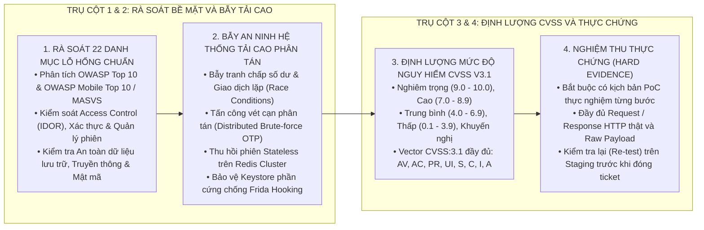
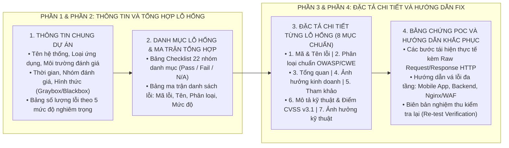

# QUY CHUẨN RÀ SOÁT, ĐÁNH GIÁ VÀ BÁO CÁO KIỂM THỬ XÂM NHẬP (PENTEST ASSESSMENT & REPORTING RULES)

Tài liệu này quy định hệ thống nguyên tắc, danh mục lỗ hổng tiêu chuẩn, tiêu chí an ninh cho hệ thống tải cao nhiều người dùng và cấu trúc báo cáo kiểm thử an toàn thông tin (Pentest Report) chuẩn mực, đồng bộ hoàn toàn với định dạng báo cáo kiểm thử xâm nhập thực tế.

---

## 1. MÔ HÌNH QUẢN TRỊ VÀ ĐÁNH GIÁ AN TOÀN THÔNG TIN

---

## 2. NGUYÊN TẮC CỐT LÕI TRONG ĐÁNH GIÁ PENTEST

1. **Nguyên tắc "Bằng chứng thực chứng hoặc Chấm 0%" (Hard Evidence or Zero):**
   * Mọi lỗ hổng được ghi nhận bắt buộc phải có kịch bản tái hiện thực tế (Proof of Concept - PoC), bao gồm: tài khoản thử nghiệm, đường dẫn API/màn hình cụ thể, ảnh chụp bằng chứng hoặc nội dung gói tin HTTP Request/Response thực tế.
   * Tuyệt đối không ghi nhận lỗ hổng dựa trên suy đoán lý thuyết khi chưa chứng minh được khả năng khai thác thành công.
2. **Nguyên tắc "Phòng vệ chiều sâu khép kín đa tầng" (Defense-in-Depth):**
   * Đánh giá bảo mật phải bao quát đầy đủ 4 tầng kiến trúc:
     * **Tầng 1 - Client (Mobile App / Web SPA):** Chống can thiệp nhị phân, chống Frida hooking, bảo vệ bộ nhớ cục bộ, che mờ màn hình đa nhiệm (`FLAG_SECURE`).
     * **Tầng 2 - Đường truyền (Transport Layer):** Bắt buộc HTTPS, khóa chứng chỉ số SSL Pinning (Public Key Pinning SHA-256), chống tấn công Man-in-the-Middle (MITM).
     * **Tầng 3 - Cổng kết nối & Hạ tầng (API Gateway / Nginx / WAF):** Rate-Limiting phân tán, chặn quét cổng, lọc payload độc hại, bảo vệ phân vùng mạng.
     * **Tầng 4 - Ứng dụng nghiệp vụ & Dữ liệu (Backend / Microservices / Database):** Kiểm soát phân quyền đối tượng (chống IDOR), xác thực phiên Stateless, mã hóa dữ liệu nhạy cảm, bẫy tranh chấp giao dịch đồng thời.
3. **Nguyên tắc "Mặc định từ chối trên 100% luồng dữ liệu" (Default Deny):**
   * Mọi API trả về dữ liệu cá nhân hoặc thực hiện giao dịch tài chính bắt buộc phải so khớp định danh người gọi (`loggedInfo`) với chủ sở hữu bản ghi tại tất cả các điểm thoát dữ liệu (`return`).
4. **Nguyên tắc "Đồng bộ trạng thái phân tán" (Stateless Distributed Cache Persistence):**
   * Trong kiến trúc Backend Stateless, mọi trạng thái bảo mật (số lần nhập sai mã OTP `failCounter`, cờ khóa tài khoản, trạng thái phiên đăng xuất) bắt buộc phải được lưu tức thì vào bộ nhớ đệm phân tán (Redis Cluster) trước khi trả phản hồi lỗi cho Client.
5. **Nguyên tắc "Sửa lỗi nhất quán toàn cục" (Global Consistency over Local Patch):**
   * Khi phát hiện và xác nhận 1 lỗ hổng tại một endpoint hoặc một chức năng, đội ngũ kỹ thuật bắt buộc phải rà soát toàn bộ các endpoint và chức năng tương tự trong toàn hệ thống để xử lý đồng bộ.

---

## 3. DANH MỤC 22 NHÓM LỖ HỔNG TIÊU CHUẨN

Theo chuẩn mực đánh giá an toàn thông tin quốc tế (OWASP Top 10, OWASP Mobile Top 10 / MASVS, NIST SP 800-115 và CWE), toàn bộ hệ thống phải được rà soát qua bảng ma trận 22 nhóm lỗ hổng sau:

| STT | Nhóm Lỗ Hổng (Category) | Tiêu Chuẩn Ánh Xạ | Trọng Tâm Đánh Giá |
| :---: | :--- | :--- | :--- |
| **1** | **Server Security Misconfiguration** | OWASP A05:2021 | Cấu hình máy chủ, để lộ trang quản trị, thông tin phiên bản, debug trace, CORS lỏng lẻo. |
| **2** | **Server-Side Injection** | OWASP A03:2021 | SQL Injection, NoSQL Injection, Command Injection, LDAP Injection, SSTI. |
| **3** | **Broken Authentication & Session** | OWASP A07:2021 | Token không hết hạn sau logout, Session Fixation, bypass xác thực, quản lý phiên yếu. |
| **4** | **Sensitive Data Exposure** | OWASP A02:2021 | Lộ thông tin cá nhân (PII), lộ mã OTP trong phản hồi HTTP, lộ khóa bí mật trong mã nguồn. |
| **5** | **Cross-Site Scripting (XSS)** | OWASP A03:2021 | Stored XSS, Reflected XSS, DOM-based XSS trên các cổng thông tin và Web CMS. |
| **6** | **Broken Access Control (BAC / IDOR)** | OWASP A01:2021 | Tham chiếu đối tượng trực tiếp không an toàn (IDOR), leo thang đặc quyền ngang/dọc, BOLA, BFLA. |
| **7** | **Cross-Site Request Forgery (CSRF)** | OWASP A01:2021 | Thiếu CSRF Token trên các giao dịch thay đổi trạng thái qua trình duyệt Web. |
| **8** | **Application-Level Denial-of-Service (DoS)** | OWASP A04:2021 | Khóa tài khoản vĩnh viễn không kiểm tra nguồn gốc, ReDoS, xử lý file kích thước lớn làm cạn tài nguyên. |
| **9** | **Unvalidated Redirects and Forwards** | OWASP A01:2021 | Chuyển hướng URL không xác thực dẫn người dùng đến trang giả mạo (Open Redirect). |
| **10** | **External Behavior / SSRF** | OWASP A10:2021 | Server-Side Request Forgery, máy chủ bị lợi dụng để quét mạng nội bộ hoặc truy cập metadata cloud. |
| **11** | **Insufficient Security Configurability** | OWASP A04:2021 | Thiếu cơ chế Rate-Limiting cho phép vét cạn (Brute-force) OTP, thiếu CAPTCHA tại bước đăng nhập. |
| **12** | **Using Components with Vulnerabilities** | OWASP A06:2021 | Sử dụng thư viện bên thứ ba, SDK, package có lỗ hổng bảo mật đã công bố (CVE / SCA). |
| **13** | **Insecure Data Storage** | MASVS-STORAGE | Lưu trữ Token, mã PIN, mật khẩu dưới dạng plaintext trong SharedPreferences, SQLite, LocalStorage. |
| **14** | **Insecure Data Transport** | MASVS-NETWORK | Truyền dữ liệu qua HTTP không mã hóa, sử dụng thuật toán mã hóa đường truyền lỗi thời (TLS 1.0, 1.1). |
| **15** | **Insecure OS/Firmware** | MASVS-PLATFORM | Khai thác lỗ hổng cấp hệ điều hành, cấp quyền ứng dụng quá mức (Over-privileged permissions). |
| **16** | **Broken Cryptography** | OWASP A02:2021 | Sử dụng thuật toán băm yếu (MD5, SHA-1), mã hóa đối xứng chế độ ECB, sinh số ngẫu nhiên không an toàn. |
| **17** | **Privacy Concerns** | MASVS-STORAGE | Thu thập dữ liệu người dùng không cần thiết, tự động sao lưu dữ liệu nhạy cảm lên đám mây của bên thứ ba. |
| **18** | **Mobile Security Misconfiguration** | MASVS-RESILIENCE | Thiếu kiểm tra thiết bị bẻ khóa (Root/Jailbreak), thiếu phát hiện môi trường giả lập (Emulator), bật cờ Debug. |
| **19** | **Client-Side Injection** | MASVS-PLATFORM | Khai thác Deep Link, Universal Link không xác thực tham số, lỗ hổng WebView JavaScript Interface. |
| **20** | **Lack of Binary Hardening** | MASVS-RESILIENCE | Không che mờ màn hình đa nhiệm (`FLAG_SECURE`), ghi log nhạy cảm ra Logcat, không làm rối mã (Obfuscation). |
| **21** | **Network Security Misconfiguration** | MASVS-NETWORK | Thiếu cơ chế SSL Pinning, tin tưởng CA người dùng cài đặt, cho phép nghe lén gói tin qua Proxy. |
| **22** | **Indicators of Compromise (IoC)** | NIST SP 800-115 | Phát hiện mã độc chèn vào ứng dụng, backdoor, web shell, kết nối trái phép đến máy chủ điều khiển C2. |

---

## 4. TIÊU CHÍ AN NINH ĐẶC THÙ CHO HỆ THỐNG TẢI CAO NHIỀU NGƯỜI DÙNG

Đối với các hệ thống phân tán phục vụ hàng triệu người dùng (Tài chính số, Ví điện tử, Viễn thông, Thương mại điện tử), ngoài các bài kiểm thử thông thường, bắt buộc phải rà soát và đánh giá 6 kịch bản an ninh tải cao chuyên sâu:

### 4.1. Bẫy Tranh Chấp Số Dư & Giao Dịch Lặp (Concurrency Race Condition & Double Spending)
* **Vectơ tấn công:** Kẻ tấn công gửi đồng thời nhiều HTTP Request (sử dụng kỹ thuật HTTP/2 Single-Packet Attack hoặc script đa luồng) trong khoảng thời gian mili-giây đối với các API giao dịch (Rút tiền, Chuyển tiền, Nạp tiền, Đổi điểm thưởng, Áp dụng Voucher).
* **Rủi ro:** Hệ thống xử lý song song các luồng trước khi cơ sở dữ liệu kịp khóa bản ghi hoặc trừ số dư, dẫn đến giao dịch được thực hiện nhiều lần (Double Spending) hoặc số dư tài khoản bị sai lệch.
* **Yêu cầu kiểm soát:**
  * Bắt buộc có cơ chế khóa phân tán (Distributed Lock qua Redisson / Redis) theo mã người dùng/mã tài khoản với thời gian tồn tại (TTL) hợp lý.
  * Cơ sở dữ liệu bắt buộc sử dụng khóa bi quan (`SELECT ... FOR UPDATE`) hoặc mức cô lập giao dịch phù hợp (Serializable / Repeatable Read) tại các giao dịch tài chính.
  * Mọi API giao dịch tài chính bắt buộc hỗ trợ mã khóa trùng lặp (`Idempotency Key`).

### 4.2. Tấn Công Vét Cạn Phân Tán (Distributed Brute-Force & Credential Stuffing)
* **Vectơ tấn công:** Kẻ tấn công sử dụng mạng lưới botnet hoặc dịch vụ Proxy xoay vòng dân cư (Rotated Residential Proxies) để gửi các yêu cầu dò quét mã OTP / mật khẩu từ hàng ngàn địa chỉ IP khác nhau, nhằm vô hiệu hóa cơ chế Rate-Limiting theo IP đơn lẻ.
* **Rủi ro:** Vượt qua lớp phòng thủ Nginx/WAF để bẻ khóa mã OTP 6 chữ số hoặc vét cạn tài khoản người dùng.
* **Yêu cầu kiểm soát:**
  * Cơ chế Rate-Limiting đa tầng kết hợp: Giới hạn theo IP, theo Subnet mạng, theo Thiết bị (`deviceId`), theo Tài khoản (`accountNumber`/`msisdn`).
  * Khóa tài khoản hoặc vô hiệu hóa mã OTP sau 3 đến 5 lần thử sai liên tiếp, lưu trạng thái khóa tức thì vào Redis Cluster.
  * Tích hợp cơ chế chấm điểm rủi ro (Risk-based Authentication) và thách thức bổ sung (CAPTCHA / OTP kênh phụ) khi phát hiện hành vi bất thường.

### 4.3. Quản Lý Phiên Stateless Phân Tán & Thu Hồi Tức Thì (Distributed Token Invalidation)
* **Vectơ tấn công:** Kẻ tấn công thu thập được Access Token của người dùng (qua nghe lén, lưu cache hoặc chia sẻ thiết bị) và tiếp tục sử dụng để gọi API sau khi người dùng đã thực hiện thao tác Đăng xuất (Logout), Đổi mật khẩu (Change Password) hoặc Khóa tài khoản.
* **Rủi ro:** Chiếm quyền điều khiển tài khoản (Account Takeover) trong khoảng thời gian hiệu lực còn lại của Token.
* **Yêu cầu kiểm soát:**
  * Cơ chế phòng vệ khép kín 2 chiều: Khi người dùng Logout, Backend phải lập tức xóa Token khỏi bộ nhớ đệm phân tán (Redis Token Cache) và chuyển trạng thái phiên thiết bị sang `LOGGED_OUT`.
  * Bộ lọc xác thực (`RsAuthFilter`) tại Gateway/Backend bắt buộc kiểm tra trạng thái Token trong Redis trên từng yêu cầu, từ chối ngay lập tức mã `401 Unauthorized` nếu phiên đã bị thu hồi.

### 4.4. Bảo Mật Xác Thực Sinh Trắc Học Phần Cứng (Hardware-Backed Biometric Security)
* **Vectơ tấn công:** Kẻ tấn công sử dụng công cụ can thiệp tiến trình tại thời gian chạy (Runtime Hooking như Frida / Xposed) để chèn mã giả mạo, ép hàm callback `onAuthenticationSucceeded()` trả về thành công mà không cần quét vân tay hoặc khuôn mặt thật.
* **Rủi ro:** Vượt qua bước xác thực sinh trắc học để đăng nhập hoặc xác nhận giao dịch trên thiết bị đã bị bẻ khóa.
* **Yêu cầu kiểm soát:**
  * Bắt buộc gắn kết quá trình xác thực với đối tượng mật mã (`CryptoObject`) trên Android và `SecKeyRef` trên iOS.
  * Khóa bí mật phải được tạo và lưu trữ trong vùng phần cứng an toàn (Android Keystore / StrongBox / Secure Enclave) với cờ `setUserAuthenticationRequired(true)`.
  * Thiết lập cờ `setInvalidatedByBiometricEnrollment(true)` để tự động vô hiệu hóa khóa mật mã nếu người dùng thêm mới hoặc thay đổi dữ liệu sinh trắc học trên hệ điều hành.

### 4.5. Bảo Vệ Bộ Nhớ Đệm & Che Mờ Màn Hình Đa Nhiệm (Anti-Screen Scraping & Sensitive Blurring)
* **Vectơ tấn công:** Ứng dụng khi chuyển xuống chế độ chạy ngầm (Background) bị hệ điều hành tự động chụp ảnh màn hình (Snapshot) và lưu trữ dạng tệp ảnh trong bộ nhớ thiết bị, hoặc người khác nhìn trộm màn hình đa nhiệm (App Switcher).
* **Rủi ro:** Lộ thông tin số dư tài khoản, mã xác thực, lịch sử giao dịch và dữ liệu cá nhân.
* **Yêu cầu kiểm soát:**
  * Trên Android: Kích hoạt cờ `WindowManager.LayoutParams.FLAG_SECURE` trong `MainActivity`.
  * Trên iOS: Kích hoạt lớp che phủ làm mờ (`UIBlurEffect`) trong phương thức `applicationDidEnterBackground` của `AppDelegate`.

### 4.6. Chống Thao Túng Tham Số Nghiệp Vụ (Business Logic & Parameter Tampering)
* **Vectơ tấn công:** Kẻ tấn công chặn bắt và chỉnh sửa tham số trong Payload JSON: Thay đổi số tiền giao dịch thành số âm hoặc số thập phân vô hạn, thay đổi đơn vị tiền tệ, thay đổi mã giảm giá hoặc trạng thái xử lý giao dịch.
* **Rủi ro:** Gian lận tài chính, mua hàng với giá 0 đồng, làm sai lệch sổ cái hạch toán.
* **Yêu cầu kiểm soát:**
  * Kiểm tra chặt chẽ tính toàn vẹn (Integrity Check) bằng chữ ký số (`signature` HMAC-SHA256) trên các tham số nhạy cảm.
  * Kiểm tra kiểu dữ liệu và miền giá trị (Validation) nghiêm ngặt tại tầng Backend: Số tiền phải là số nguyên dương lớn hơn 0, đơn vị tiền tệ phải nằm trong danh mục cho phép.

---

## 5. THANG ĐO MỨC ĐỘ NGUY HIỂM VÀ ĐIỂM CVSS V3.1

Mọi lỗ hổng bảo mật trong báo cáo bắt buộc phải được xếp hạng mức độ nguy hiểm theo Hệ thống Đánh giá Lỗ hổng Phổ biến (Common Vulnerability Scoring System - CVSS v3.1):

| Mức Độ Nguy Hiểm | Điểm CVSS v3.1 | Tiêu Chí Đánh Giá | Thời Gian Khắc Phục Bắt Buộc |
| :--- | :---: | :--- | :---: |
| **Nghiêm trọng (Critical)** | **9.0 - 10.0** | Lỗ hổng cho phép thực thi mã từ xa (RCE), chiếm toàn quyền quản trị máy chủ, rò rỉ toàn bộ cơ sở dữ liệu mà không cần xác thực người dùng. | **Trong vòng 24 giờ** |
| **Cao (High)** | **7.0 - 8.9** | Lỗ hổng cho phép bypass xác thực, leo thang đặc quyền, rò rỉ dữ liệu cá nhân diện rộng hoặc thực hiện giao dịch tài chính trái phép (IDOR tài chính, SQLi có xác thực). | **Trong vòng 48 giờ** |
| **Trung bình (Medium)** | **4.0 - 6.9** | Lỗ hổng yêu cầu điều kiện tấn công phức tạp, gây ảnh hưởng cục bộ đến một nhóm người dùng (Stored XSS có giới hạn, CSRF nhạy cảm vừa phải). | **Trong vòng 7 ngày** |
| **Thấp (Low)** | **0.1 - 3.9** | Lỗ hổng khó khai thác hoặc chỉ làm lộ thông tin thứ yếu, không gây ảnh hưởng trực tiếp đến tài chính và tính toàn vẹn hệ thống (Username Enumeration, Thiếu Rate-Limiting không nguy cấp). | **Trong vòng 14 ngày** |
| **Khuyến nghị (Informational)** | **0.0** | Không thể khai thác trực tiếp nhưng vi phạm các tiêu chuẩn thực hành an ninh tốt nhất (Thiếu SSL Pinning, chưa bật FLAG_SECURE, lưu log chưa lọc dữ liệu). | **Theo kế hoạch phiên bản (Release)** |

### Cấu trúc Chuỗi Vector CVSS v3.1 Tiêu Chuẩn:
Chuỗi vector bắt buộc phải thể hiện đầy đủ 8 chỉ số cơ bản (Base Metrics):
`CVSS:3.1/AV:[N|A|L|P]/AC:[L|H]/PR:[N|L|H]/UI:[N|R]/S:[U|C]/C:[N|L|H]/I:[N|L|H]/A:[N|L|H]`
* **AV (Attack Vector):** `N` (Network), `A` (Adjacent), `L` (Local), `P` (Physical).
* **AC (Attack Complexity):** `L` (Low), `H` (High).
* **PR (Privileges Required):** `N` (None), `L` (Low), `H` (High).
* **UI (User Interaction):** `N` (None), `R` (Required).
* **S (Scope):** `U` (Unchanged), `C` (Changed).
* **C (Confidentiality):** `N` (None), `L` (Low), `H` (High).
* **I (Integrity):** `N` (None), `L` (Low), `H` (High).
* **A (Availability):** `N` (None), `L` (Low), `H` (High).

---

## 6. CẤU TRÚC CHUẨN MỰC CỦA BÁO CÁO PENTEST

Báo cáo An toàn Thông tin (Pentest Assessment Report) bắt buộc phải tuân thủ cấu trúc phân tầng chuẩn mực theo mẫu sau:

### Chi tiết 8 Mục Bắt Buộc Trong Đặc Tả Từng Lỗ Hổng:
Đối với mỗi lỗ hổng phát hiện, người soạn thảo bắt buộc phải trình bày đầy đủ 8 mục con:
1. **Tiêu đề lỗ hổng:** Định dạng `BUG-XXXXX [Tên Lỗ Hổng Ngắn Gọn]`.
2. **Phân loại (Classification):** Cây phân cấp chuẩn OWASP/CWE (Ví dụ: `Broken Access Control (BAC) > Insecure Direct Object References (IDOR)`).
3. **Tổng quan về lỗ hổng (Vulnerability Overview):** Định nghĩa lý thuyết và bản chất kỹ thuật của lỗ hổng.
4. **Ảnh hưởng kinh doanh (Business Impact):** Rủi ro tài chính, tổn thất dữ liệu, uy tín tổ chức và vi phạm tuân thủ pháp lý.
5. **Tham khảo thêm (References):** Danh mục liên kết đến tài liệu chuẩn quốc tế (OWASP Cheat Sheet, Android/Apple Developer Docs, CWE).
6. **Mô tả kỹ thuật & Điểm CVSS v3.1 (Technical Description & CVSS):**
   * Danh sách endpoint/URL và tham số lỗi bị ảnh hưởng.
   * Điểm số Base Score và chuỗi Vector CVSS:3.1 đầy đủ.
   * Mức độ nguy hiểm (Nghiêm trọng / Cao / Trung bình / Thấp / Khuyến nghị).
7. **Ảnh hưởng kỹ thuật (Technical Impact):** Hậu quả trực tiếp trên hệ thống (Lộ lọt thông tin, bypass xác thực, DoS, Account Takeover).
8. **Các bước tái hiện lỗi (Steps to Reproduce - PoC Verification):**
   * **Chuẩn bị:** Môi trường, thiết bị, tài khoản thử nghiệm và cấu hình proxy.
   * **Các bước thực hiện:** Trình bày tuần tự 1, 2, 3...
   * **Nội dung gói tin thực tế:** Khối mã chứa đầy đủ Raw HTTP Request (Header, Payload JSON) và HTTP Response trả về từ máy chủ.
   * **Kết quả quan sát:** Bằng chứng thực nghiệm xác nhận tấn công thành công.
9. **Cách khắc phục (Remediation Guidance):** Hướng dẫn cụ thể, có mã nguồn mẫu hoặc cấu hình hạ tầng mẫu cho từng phân hệ (Backend Java, Mobile App React Native/Flutter, Nginx Gateway).
