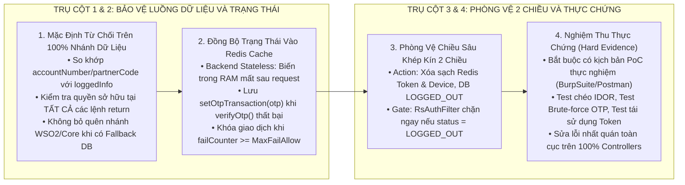

# QUY CHUẨN RÀ SOÁT BẢO MẬT, XÁC THỰC PHIÊN VÀ KIỂM THỬ AN NINH THỰC CHỨNG (SECURITY REVIEW & CALL-PATH VERIFICATION)

Tài liệu này quy định hệ thống 5 nguyên tắc bắt buộc áp dụng cho toàn bộ hoạt động lập trình, rà soát mã nguồn (Code Review), vá lỗ hổng Pentest và nghiệm thu an ninh hệ thống trong toàn bộ các dự án phần mềm.

---

## 1. MÔ HÌNH KIẾN TRÚC PHÒNG VỆ VÀ KIỂM SOÁT BẢO MẬT

---

## 2. NỘI DUNG 5 NGUYÊN TẮC CỐT LÕI

### 2.1. Nguyên Tắc "Mặc Định Từ Chối Trên 100% Luồng Dữ Liệu" (Default Deny & 100% Call-Path Verification)
* **Bản chất:** Chống lỗ hổng phân quyền và truy cập trái phép (IDOR).
* **Quy tắc thực thi:**
  * **Kiểm tra quyền sở hữu tại điểm trả dữ liệu cuối cùng:** Không bao giờ giả định dữ liệu lấy từ hệ thống ngoài (Core eWallet, WSO2, vi dịch vụ nội bộ) đã an toàn. Mọi dữ liệu trước khi đóng gói trả về cho Client đều bắt buộc phải so khớp với danh tính của người dùng đang đăng nhập (`loggedInfo`).
  * **Dò vết 100% các nhánh rẽ (`if/else/return`):** Khi rà soát mã nguồn, phải vẽ và đi hết tất cả các luồng dữ liệu (Data Flow). Tuyệt đối không kết luận một hàm đã an toàn chỉ vì thấy có đoạn kiểm tra bảo mật ở nhánh phụ (Fallback/DB) mà bỏ quên nhánh chính.
  * **Nguyên tắc:** Dữ liệu không chứng minh được thuộc quyền sở hữu của người gọi thì **từ chối ngay lập tức (`ERR_PARAMETERS_INVALID`)**.

### 2.2. Nguyên Tắc "Đồng Bộ Trạng Thái Trong Kiến Trúc Phi Trạng Thái" (Stateless Distributed Cache Persistence)
* **Bản chất:** Chống lỗi bỏ sót lưu biến đếm (`failCounter`), trạng thái khóa, mã OTP trong môi trường Web/API.
* **Quy tắc thực thi:**
  * **Biến trong RAM là vô nghĩa nếu không ghi lại xuống Cache:** Backend là Stateless, mỗi HTTP request là một luồng độc lập. Mọi thay đổi trạng thái đối tượng nghiệp vụ (như tăng số lần thử sai `failCounter++`, đổi trạng thái phiên, ghi nhận thời gian) bắt buộc phải được gọi lệnh ghi đè ngược lại Redis (`setOtpTransaction` / `RedisService.set`).
  * **Bảo toàn trạng thái tại mọi nhánh thoát lỗi (`Early Return / Catch`):** Kiểm tra xem khi hàm trả về lỗi (`return false`, `return ERR_OTP_ID_INVALID`) thì lệnh cập nhật Redis có được thực thi trước đó hay không.
  * **Kiểm soát vòng đời (TTL):** Đảm bảo việc cập nhật lại đối tượng vào Redis không vô tình làm mất thời gian hết hạn (TTL) ban đầu của giao dịch.

### 2.3. Nguyên Tắc "Phòng Vệ Chiều Sâu Khép Kín 2 Chiều" (Action-Gate Defense-in-Depth)
* **Bản chất:** Đảm bảo thu hồi phiên làm việc, Token và phân quyền tuyệt đối sau khi Đăng xuất / Đổi mật khẩu / Khóa tài khoản.
* **Quy tắc thực thi:**
  * **Chiều 1 — Phía Hành Động (Action Integrity):**
    * Tránh phụ thuộc vào các biến có nguy cơ bị `null` (như Header tự do). Luôn ưu tiên lấy định danh thực thể (`deviceId`, `userId`, `msisdn`) từ đối tượng phiên đã được hệ thống chứng thực (`loggedInfo.getAppDevice().getDeviceId()`).
    * Khi hủy phiên, phải xóa triệt để trên toàn bộ các tầng lưu trữ liên quan (Redis Login Cache, Redis Device Cache, cập nhật trạng thái DB thành `LOGGED_OUT`).
  * **Chiều 2 — Phía Cổng Chặn (Gate / Filter / Interceptor):**
    * Không thiết kế bộ lọc dựa trên duy nhất một điều kiện lỏng lẻo. Bộ lọc xác thực (`RsAuthFilter`) phải kiểm tra đa lớp:
      1. Khóa Token phiên có tồn tại trong Redis không?
      2. Token giải mã có khớp với Token phiên không?
      3. Trạng thái thiết bị trong DB/Cache có đang là `LOGGED_IN` không (từ chối ngay nếu là `LOGGED_OUT`)?

### 2.4. Nguyên Tắc "Bằng Chứng Thực Chứng — Hard Evidence or Zero" Trong Rà Soát & Nghiệm Thu
* **Bản chất:** Triệt tiêu hoàn toàn việc "tô hồng tiến độ" hoặc đánh giá cảm tính qua đọc mã nguồn bằng mắt.
* **Quy tắc thực thi:**
  * **Chỉ chấm "Hoàn thành / PASS" khi có kịch bản chạy thử nghiệm thực tế (Proof of Concept - PoC):**
    1. *Với IDOR:* Bắt buộc dùng tài khoản A gửi request với ID giao dịch của tài khoản B để chứng minh hệ thống chặn thành công.
    2. *Với Brute-force OTP:* Bắt buộc chạy công cụ gửi liên tiếp 5 mã OTP sai, sau đó gửi 1 mã đúng ở lần 6 để chứng minh hệ thống đã khóa và từ chối.
    3. *Với Logout Token:* Bắt buộc lấy lại chính Access Token cũ gửi request thứ hai sau khi logout để chứng minh nhận được HTTP `401 Unauthorized`.
  * **Không nghiệm thu hạ tầng "trên giấy tờ":** Các tính năng phụ thuộc vào hạ tầng (như Nginx Rate-Limiting, tường lửa WAF) chỉ được coi là hoàn tất khi đã triển khai thực tế trên Staging/Test và có kết quả đo kiểm chặn thành công mã lỗi `429 Too Many Requests`.

### 2.5. Nguyên Tắc "Sửa Lỗi Nhất Quán Toàn Cục" (Global Consistency over Local Patch)
* **Bản chất:** Tránh tình trạng sửa lỗi ở một màn hình/chức năng này nhưng để sót ở các chức năng tương tự khác.
* **Quy tắc thực thi:**
  * **Dò quét toàn bộ dự án khi phát hiện 1 lỗ hổng:** Khi phát hiện một lỗi logic (ví dụ: `ChangePinController` quên lưu `failCounter` vào Redis khi sai OTP), lập tức dùng công cụ tìm kiếm (`grep_search`) toàn bộ codebase để lập danh sách tất cả các Controller có xử lý tương tự (như 19 Controller có xác thực OTP khác) và cập nhật đồng bộ.
  * **Chuẩn hóa tầng dùng chung (Framework / Base Service):** Đưa các logic bảo mật cốt lõi (như xác thực OTP kèm cập nhật fail count, kiểm tra quyền sở hữu đối tượng) vào các lớp dùng chung hoặc Utility chuẩn để hạn chế việc từng lập trình viên phải tự viết lại thủ công ở từng Controller.

---

## 3. BẢNG CHECKLIST BẮT BUỘC DÀNH CHO DEVELOPER VÀ CODE REVIEWER

| STT | Trọng tâm kiểm tra | Câu hỏi tự đánh giá bắt buộc trước khi xác nhận nghiệm thu |
| :---: | :--- | :--- |
| **1** | **Chống IDOR** | Dữ liệu trả về từ hệ thống ngoài (Core WSO2) và dữ liệu từ Database nội bộ có được kiểm tra quyền sở hữu với `loggedInfo` ở **tất cả 100% các lệnh `return`** không? |
| **2** | **Thu hồi Token** | Khi gọi Logout, `deviceId` có được lấy từ `loggedInfo` không? Cả 2 DB Redis (`REDIS_DB_LOGIN_CACHED` và `REDIS_DB_DEVICE_CACHED`) có bị xóa không? `RsAuthFilter` có chặn được request dùng Token cũ không? |
| **3** | **OTP failCounter** | Khi người dùng nhập sai OTP, lệnh `setOtpTransaction(otp)` có được gọi trước khi trả lỗi không? Thử sai 5 lần rồi thử đúng lần 6 có bị khóa không? |
| **4** | **Tính Nhất Quán** | Khi sửa 1 Controller, đã dùng `grep_search` quét sạch toàn bộ các Controller tương tự khác trong toàn dự án để cập nhật đồng bộ chưa? |
| **5** | **Bằng Chứng Nghiệm Thu** | Đã chạy bài test thực nghiệm trên môi trường Staging/Test và lưu bằng chứng log/ảnh chụp xác nhận chặn thành công chưa? |
