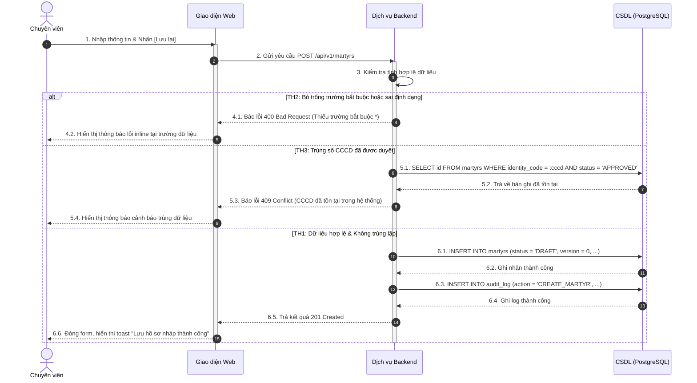
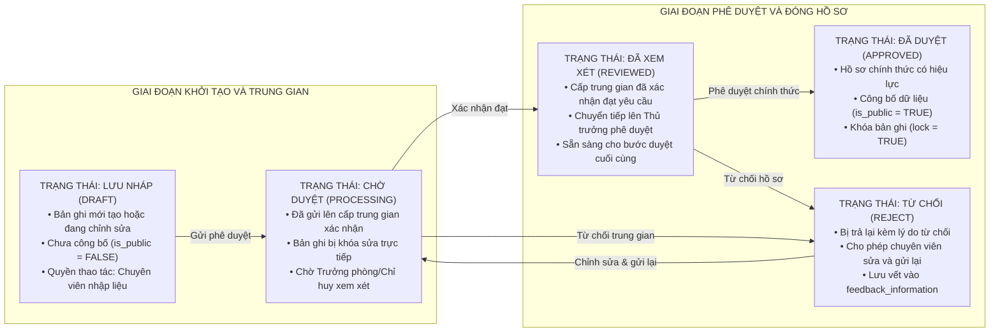

# QUY CHUẨN VÀ NGUYÊN TẮC VIẾT TÀI LIỆU YÊU CẦU PHẦN MỀM / THIẾT KẾ CHI TIẾT (SRS / TKCT)

Tài liệu này quy định hệ thống nguyên tắc, quy chuẩn cấu trúc, phương pháp phân tích và biểu diễn nội dung bắt buộc khi xây dựng Tài liệu Yêu cầu Phần mềm (SRS) và Tài liệu Thiết kế Chi tiết (TKCT).

---

## 1. NGUYÊN TẮC NGÔN NGỮ VÀ HÌNH THỨC TRÌNH BÀY

* **Ngôn ngữ kỹ thuật chuẩn mực:**
  * Toàn bộ tài liệu sử dụng tiếng Việt chuyên ngành, mạch lạc, chính xác và tường minh.
  * **Tuyệt đối không chèn tiếng Anh đệm hoặc dịch nghĩa song ngữ kèm theo không cần thiết** (không viết dạng mở ngoặc giải nghĩa như: *Lưu nháp (Draft)*, *Phê duyệt (Approve)*, *Từ chối (Reject)*, *Xóa (Delete)*, *Màn hình (Screen)*, *Người dùng (User)*).
  * **Bảo lưu tuyệt đối các thuật ngữ chuyên ngành chuẩn quốc tế khó thay thế** mà việc dịch sang tiếng Việt làm sai lệch ngữ nghĩa (ví dụ: `Engine` không dịch là "Động cơ", `FIFO`, `BOM`, `OEE`, `SPC`, `LOTO`, `WASM`, `PWA`, `SaaS`, `Buffer`, `Pipeline`, `Token`, `Payload`, `Webhook`, `Schema`, `Driver`, `Cluster`, `Vector Clocks`, `Exponential Backoff`, `RESTful API`, `Token AES-256`, `JSON`, `SQL`, `Redis`, `status = APPROVED`, `martyrs.identity_code`).
* **Trình bày kỹ thuật trang nhã:**
  * Tuyệt đối không chèn biểu tượng (icon / emoji) vào các tiêu đề đề mục, đầu dòng hay bảng biểu.
  * Sử dụng ký tự Unicode thuần túy (`→`, `×`, `≤`, `≥`, `•`) thay cho công thức LaTeX toán học chứa dấu `$`.

---

## 2. QUY CHUẨN CẤU TRÚC PHÂN CẤP TÀI LIỆU (DOCUMENT HIERARCHY)

Mọi tài liệu SRS / TKCT phải tuân thủ đúng phân cấp cấu trúc 4 tầng chuẩn:

```text
Trang bìa & Thông tin quản trị
Bảng ghi nhận thay đổi tài liệu (Bảng 7 cột chuẩn)
Trang ký duyệt (Người lập, Người xem xét, Người phê duyệt)
Mục lục tự động
Liên kết thiết kế Figma (URL tổng thể và liên kết khung màn hình)
└── Heading 1: THIẾT KẾ CHI TIẾT (hoặc TỔNG QUAN HỆ THỐNG / PHỤ LỤC)
    └── Heading 2: TÊN PHÂN HỆ / MODULE
        └── Heading 3: TÊN CHỨC NĂNG NGHIỆP VỤ (Use Case)
            ├── Heading 4: 1. Thông tin chung chức năng
            ├── Heading 4: 2. Màn hình
            ├── Heading 4: 3. Mô tả chi tiết các thành phần
            └── Heading 4: 4. Luồng nghiệp vụ
```

### 2.1. Bảng ghi nhận thay đổi tài liệu (Change Log)
Bắt buộc có bảng 7 cột ở phần đầu tài liệu:

| Ngày thay đổi | Vị trí thay đổi | A*, M, D | Nguồn gốc | Phiên bản cũ | Mô tả thay đổi | Phiên bản mới |
| :--- | :--- | :---: | :--- | :---: | :--- | :---: |
| 20/03/2026 | Toàn bộ tài liệu | A* | Đề xuất ban đầu | N/A | Tạo mới tài liệu thiết kế chi tiết | V1.0 |
| 24/03/2026 | Mục 2.3, 2.5 | M | Yêu cầu nghiệp vụ bổ sung | V1.0 | Bổ sung luồng duyệt phân cấp trung gian | V1.1 |

*Ghi chú ký hiệu thao tác:* `A*` – Tạo mới (Add), `M` – Sửa đổi (Modify), `D` – Xóa bỏ (Delete).

---

## 3. QUY CHUẨN 4 MỤC BẮT BUỘC TRONG MỖI CHỨC NĂNG (HEADING 4)

Mỗi chức năng nghiệp vụ (Heading 3) phải có đủ 4 mục Heading 4 độc lập và chi tiết:

### Mục 1: Thông tin chung chức năng
* **Mục đích chức năng:** Mô tả rõ chức năng cho phép ai thực hiện hành động gì trên đối tượng nào.
* **Điều kiện tiên quyết / Trạng thái áp dụng:** Nêu rõ các trạng thái hồ sơ cho phép thực hiện hành động (ví dụ: chỉ cho phép gửi duyệt khi bản ghi có `status = DRAFT` hoặc `status = REJECT`).
* **Đường dẫn thao tác (Navigation Breadcrumb):**
  * *Trường hợp 1 (Xử lý đơn lẻ):* Đăng nhập hệ thống → Truy cập Menu → Tab đối tượng → Dòng bản ghi → Nhấn nút/icon.
  * *Trường hợp 2 (Xử lý hàng loạt):* Đăng nhập hệ thống → Truy cập Menu → Tab đối tượng → Tích chọn nhiều bản ghi → Nhấn nút thao tác chung.
* **Quy định ghi nhật ký hệ thống (Audit Log):** Tham chiếu tài liệu dùng chung Common, nêu rõ các thông tin bắt buộc ghi vết (`user_id`, `action`, `ip_address`, `timestamp`, `old_value`, `new_value`).
* **Quy định phân quyền:** Tham chiếu ma trận phân quyền vai trò (RBAC) xác định vai trò nào được thao tác.

### Mục 2: Màn hình
* Chèn hình ảnh giao diện thiết kế (Mockup / Wireframe / Ảnh chụp từ Figma).
* Phải thể hiện đầy đủ các trạng thái giao diện:
  1. Màn hình ở trạng thái mặc định (Default state).
  2. Màn hình khi không có dữ liệu (Empty state).
  3. Hộp thoại xác nhận thao tác (Confirm Popup).
  4. Hộp thoại thông báo lỗi hoặc cảnh báo nghiệp vụ (Alert / Modal Dialog).
  5. Thông báo phản hồi góc màn hình (Toast notification).

### Mục 3: Mô tả chi tiết các thành phần (Bảng 6 cột chuẩn)
Bảng mô tả thành phần giao diện bắt buộc gồm 6 cột:

| STT | Tên | Kiểu dữ liệu [Độ dài dữ liệu] | Input/Output | Giá trị khởi tạo | Mô tả (Mapping với CSDL nếu có) |
| :---: | :--- | :--- | :---: | :---: | :--- |
| 1 | Số CCCD/CMND * | Textbox(20) | INPUT | Để trống | • Trường bắt buộc.<br/>• Chỉ cho phép nhập ký tự số.<br/>• Tự động gọi kiểm tra CSDL công dân `citizen.id_number` để điền tự động họ tên, ngày sinh.<br/>• Lưu vào `martyrs.identity_code`. |
| 2 | Ngày hy sinh * | Datepicker | INPUT | Để trống | • Định dạng `dd/MM/yyyy`.<br/>• Ràng buộc: `Ngày sinh < Ngày nhập ngũ ≤ Ngày hy sinh ≤ Ngày cấp bằng ≤ Ngày hiện tại`.<br/>• Lưu vào `martyrs.sacrifice_date`. |
| 3 | Cấp bậc * | Dropdown | INPUT | Để trống | • Lấy dữ liệu từ danh mục `DanhMucCapBac` (`status = Active`).<br/>• Chỉ chọn 1 giá trị.<br/>• Lưu vào `martyrs.rank_code`. |
| 4 | Lưu lại | Button | INPUT | N/A | • Nút thực hiện lưu dữ liệu.<br/>• Kích hoạt luồng kiểm tra tính hợp lệ dữ liệu. |

*Quy tắc trong Bảng mô tả thành phần:*
* Trường bắt buộc phải có dấu sao `*` sau tên.
* Kiểu dữ liệu phải định rõ loại control và kích thước tối đa: `Textbox(255)`, `Textarea(1000)`, `Dropdown`, `Datepicker`, `Number`, `Button`, `Checkbox`, `Radio`, `Link`, `Label`, `Icon`.
* Cột `Input/Output` nhận 1 trong 3 giá trị: `INPUT`, `OUTPUT`, `N/A`.
* Cột `Mô tả` phải nêu đầy đủ: Ràng buộc bắt buộc, Giới hạn độ dài (maxlength), Placeholder, Nguồn dữ liệu danh mục (API endpoint / `categoryGroupCode`), Quy tắc tự động điền (Auto-fill), Mapping chính xác `tên_bảng.tên_cột`, Điều kiện kích hoạt (Enable / Disable) và Thông báo lỗi tương ứng.

### Mục 4: Luồng nghiệp vụ
Trình bày logic xử lý có cấu trúc theo thứ tự bước và phân nhánh tình huống:
* **Các bước tuần tự (1..N):** Mô tả hành động của người dùng và phản hồi của hệ thống.
* **Phân nhánh tình huống:**
  * `TH1 (Dữ liệu hợp lệ / Có dữ liệu):` Hệ thống xử lý thành công, cập nhật CSDL và hiển thị thông báo.
  * `TH2 (Dữ liệu không hợp lệ / Thiếu trường bắt buộc / Không có dữ liệu):` Hệ thống dừng xử lý, hiển thị thông báo lỗi inline hoặc thông báo "Không có dữ liệu".
  * `TH3 (Trùng lặp dữ liệu / Vi phạm ràng buộc duy nhất):` Hệ thống cảnh báo trùng mã định danh và từ chối ghi nhận.
* **Xử lý hộp thoại xác nhận (Popup Confirmation):**
  * Nhấn `[Hủy bỏ]`: Đóng hộp thoại, giữ nguyên trạng thái màn hình, không tác động dữ liệu.
  * Nhấn `[Xác nhận] / [Đồng ý]`: Tiếp tục thực hiện luồng ghi nhận CSDL.
* **Chi tiết câu lệnh và quy tắc cập nhật CSDL:**
  * Nêu rõ bảng và các trường được ghi/sửa.
  * Thiết lập trạng thái: `status` chuyển thành `DRAFT`, `PROCESSING`, `REVIEWED`, `APPROVED` hoặc `REJECT`.
  * Cập nhật các trường kiểm toán và phiên bản: `version = version + 1`, `updated_by`, `updated_date`, `is_public = TRUE/FALSE`, `lock = TRUE/FALSE`.
* **Thông báo phản hồi giao diện:** Nêu rõ thông điệp hiển thị (ví dụ: toast "Thêm mới hồ sơ thành công", toast "Phê duyệt hồ sơ thành công").

---

## 4. QUY CHUẨN THIẾT KẾ SƠ ĐỒ MERMAID (SRS DIAGRAM STANDARD)

Toàn bộ sơ đồ trong tài liệu SRS phải tuân thủ nghiêm ngặt chuẩn tỷ lệ 4:3, dàn trải 2 cột song song và tối ưu hiệu năng:

### 4.1. Sơ đồ Luồng nghiệp vụ tương tác (Sequence Diagram Workflow)
* **Bắt buộc sử dụng `sequenceDiagram` cho mọi sơ đồ workflow:** Mô hình hóa toàn bộ luồng tương tác thời gian giữa Người dùng (Actor), Giao diện Frontend, Dịch vụ Backend API, Cơ sở dữ liệu (Database) và Dịch vụ ngoài.
* **Quy chuẩn hình khối và đường nét:**
  * Khai báo đối tượng tham gia rõ ràng: `actor` (Người dùng/Chuyên viên/Lãnh đạo), `participant` (Giao diện Frontend, Backend API, Dịch vụ ngoài), `database` (Cơ sở dữ liệu).
  * Hộp kích hoạt thực thi: Đánh dấu thời gian xử lý của từng đối tượng bằng `activate` / `deactivate` (hoặc cú pháp `+` / `-`).
  * Đường nét mũi tên chuẩn UML:
    * Mũi tên nét liền `->>`: Yêu cầu thao tác / Lệnh gọi API đồng bộ (Synchronous Call).
    * Mũi tên nét đứt `-->>`: Phản hồi kết quả / Trả dữ liệu (Return Response).
    * Mũi tên bất đồng bộ `-)`: Gửi thông báo / Sự kiện bất đồng bộ.
  * Phân nhánh điều kiện bằng khối chuẩn: `alt` / `else` (Phân nhánh TH1: Hợp lệ, TH2: Lỗi xác thực, TH3: Trùng dữ liệu hoặc xung đột phiên bản), `opt` (Tùy chọn), `critical` (Giao dịch CSDL nguyên tử).
  * **Tuyệt đối không sử dụng nét vẽ lượn cong tùy tiện:** Mọi đường nét trong sơ đồ phải dóng thẳng, trực giao chuẩn mực của Sequence Diagram, đảm bảo tính chính xác và mạch lạc kỹ thuật.




### 4.2. Sơ đồ Chu trình trạng thái thực thể (State Machine Diagram)
Minh họa toàn bộ các bước chuyển trạng thái trong vòng đời của bản ghi:



### 4.3. Sơ đồ Mô hình dữ liệu quan hệ (ERD Optimization)
* Khối Mermaid `erDiagram` chỉ biểu diễn các thực thể chính và liên kết quan hệ 1-N / N-N mức cao.
* Toàn bộ danh mục trường, kiểu dữ liệu, khóa chính (`PK`), khóa ngoại (`FK`) phải được trình bày chi tiết bằng Bảng Markdown tiêu chuẩn.

---

## 5. QUY CHUẨN QUẢN LÝ PHIÊN BẢN VÀ TOÀN VẸN DỮ LIỆU ĐỒNG THỜI

1. **Chiến lược quản lý phiên bản dữ liệu (Data Versioning):**
   * Mỗi đối tượng nghiệp vụ được cấp một mã định danh hồ sơ duy nhất không đổi (`profile_id` / `profile_code`).
   * Bản ghi tạo mới ban đầu có `version = 0`.
   * Khi người dùng thực hiện chỉnh sửa hồ sơ đã ở trạng thái `APPROVED`: Hệ thống **không ghi đè trực tiếp** lên bản ghi cũ mà tạo ra 01 bản ghi mới kế thừa `profile_id`, gán `version = version + 1`, trạng thái `DRAFT` hoặc `PROCESSING`. Bản ghi cũ được giữ nguyên trạng thái lịch sử phục vụ đối soát kiểm toán.
2. **Bẫy kiểm tra toàn vẹn và chống trùng lặp (Concurrency & Integrity Traps):**
   * *Bẫy trùng định danh:* Kiểm tra số CCCD/CMND không được trùng trên các bản ghi có trạng thái `APPROVED` đang hoạt động (`is_deleted = FALSE`).
   * *Bẫy tranh chấp trạng thái (Optimistic Locking):* Khi nhiều người cùng duyệt 1 hồ sơ, câu lệnh cập nhật cơ sở dữ liệu phải kèm điều kiện kiểm tra phiên bản hoặc trạng thái hiện tại (`WHERE id = :id AND version = :current_version AND status = 'PROCESSING'`). Nếu số dòng cập nhật bằng 0, hệ thống cảnh báo hồ sơ đã bị thay đổi bởi người dùng khác.
   * *Bẫy toàn vẹn liên kết:* Không được xóa vật lý các bản ghi đã có quan hệ nghiệp vụ, chỉ thực hiện xóa mềm (`is_deleted = TRUE`).
