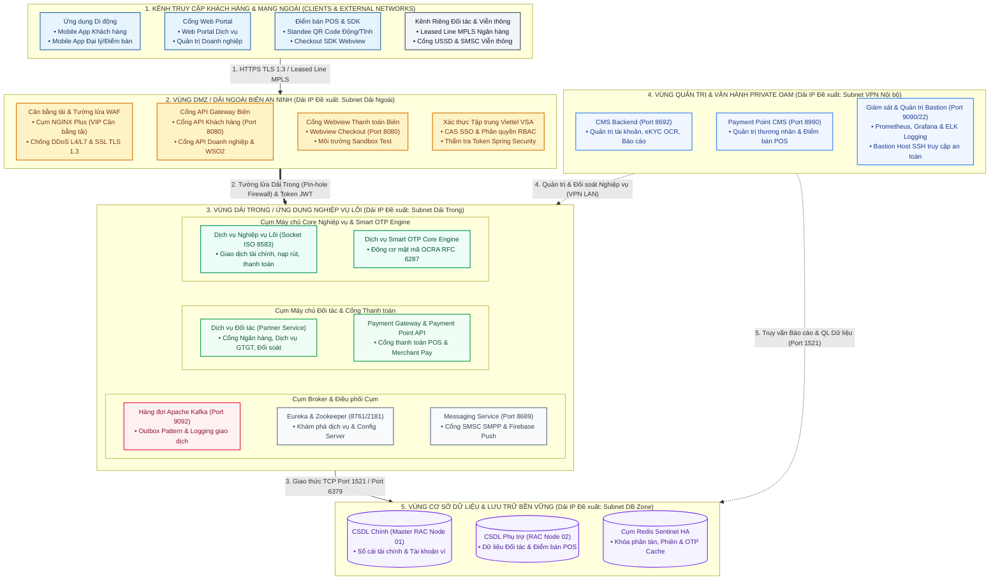
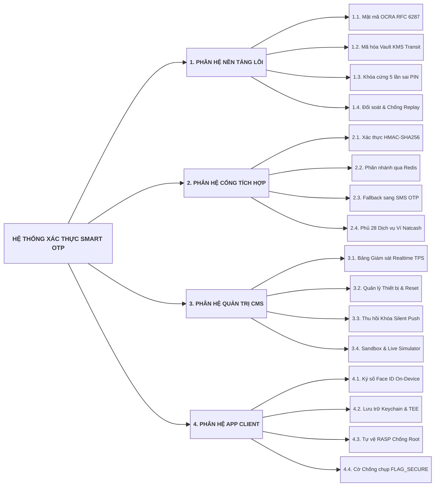
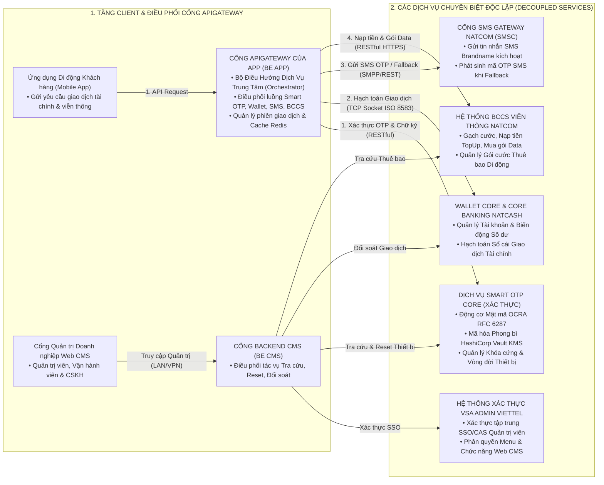
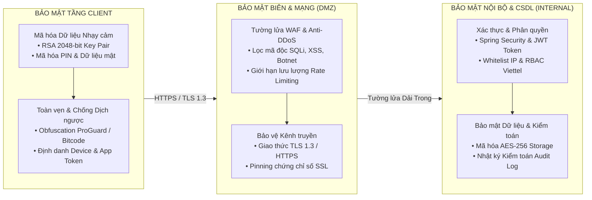
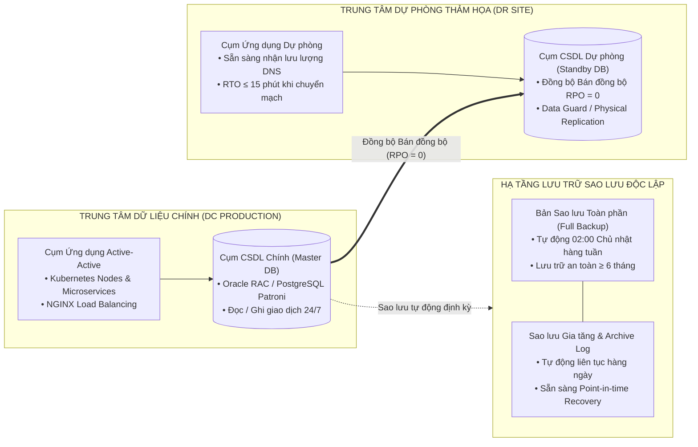

# QUY CHUẨN VÀ NGUYÊN TẮC VIẾT TÀI LIỆU THIẾT KẾ TỔNG THỂ (HLD / VIETTEL BM.02 STANDARD)

Tài liệu này quy định hệ thống nguyên tắc, cấu trúc 4 phần chuẩn mực theo quy trình phát triển phần mềm Tập đoàn Viettel (`BM.02.QT.00.CNTT.28` - Tài liệu Thiết kế Tổng thể / High-Level Design), bảng định cỡ tải hệ thống (Capacity Sizing), bảng cấu hình máy chủ (Server Hardware Sizing), mô hình kiến trúc Microservices 6 tầng và kiến trúc An toàn Thông tin (ATTT).

---

## 1. NGUYÊN TẮC CỐT LÕI KHI THIẾT KẾ TỔNG THỂ

* **Tuân thủ Chuẩn mực Biểu mẫu Viettel `BM.02.QT.00.CNTT.28`:**
  * Toàn bộ tài liệu Thiết kế Tổng thể (HLD) phải tuân theo cấu trúc 4 phần chặt chẽ: Phần I (Giới thiệu), Phần II (Các yêu cầu ảnh hưởng đến kiến trúc), Phần III (Kiến trúc ứng dụng, phân rã chức năng, tích hợp và định cỡ máy chủ), Phần IV (Các giải pháp kiến trúc khác: Bảo mật ATTT, Sao lưu phục hồi, Xử lý tải cao).
* **Tính sẵn sàng cao và Không điểm lỗi đơn lẻ (High Availability & Zero Single Point of Failure):**
  * Triển khai tối thiểu 2 nodes cho mọi dịch vụ cốt lõi, áp dụng mô hình phân tải (Load Balancing), gom cụm (Clustering) và tự động chuyển đổi dự phòng (Failover).
* **Phân vùng An ninh Mạng Dải Trong và Dải Ngoài (Network Zoning):**
  * Tách biệt rõ ràng giữa Dải Ngoài (Vùng DMZ: WAF, Load Balancer NGINX, Public API Gateway) và Dải Trong (Internal Zone: Microservices, Core Services, Database, Message Broker, Redis).
* **Định lượng Năng lực Tải & Cấu hình Phần cứng (Capacity & Server Sizing):**
  * Bắt buộc có bảng định lượng các chỉ số: Số lượng người dùng hoạt động (Active users), Tổng số giao dịch/ngày, Số người dùng đồng thời (Concurrent users), Thông lượng giao dịch/giây (TPS).
  * Lập bảng cấu hình phần cứng chi tiết (RAM, CPU Cores, SSD, OS) phân bổ theo từng node máy chủ dải trong và dải ngoài.
* **Nguyên tắc Trừu tượng Hóa Kiến trúc & Cấm Trình Bày Chi Tiết Mã Nguồn:**
  * Technical Solution / HLD là tài liệu thiết kế kiến trúc cấp cao, tập trung vào phân rã phân hệ/vi dịch vụ, giao thức kết nối, luồng tích hợp, sizing máy chủ và an toàn thông tin.
  * **Tuyệt đối KHÔNG trình bày chi tiết cấp mã nguồn (Code-level):** Cấm viết tên class, tên file controller (ví dụ: `SmartOtpController.java`, `AuthController`), tên service class, repository class. Hãy gọi tên theo dịch vụ nghiệp vụ logic (ví dụ: *Dịch vụ Smart OTP*, *Dịch vụ Xác thực IAM*).
  * **Tuyệt đối KHÔNG viết tên file màn hình giao diện Mobile/Web:** Cấm viết tên file mã nguồn như `SmartOtpScreen.tsx`, `OtpVerificationView.dart`, `LoginFragment.kt`, `AndroidManifest.xml`. Thay vào đó, mô tả theo chức năng kênh tương tác người dùng (ví dụ: *Ứng dụng Di động Khách hàng*, *Cổng thông tin Web Portal*, *Trang Quản trị Web CMS*).
  * Chi tiết cấu trúc bảng CSDL 8 cột, DTO request/response, schema validation hoặc pseudocode thuộc về tài liệu DBDD (`BM.03`), LLD (11 phần) hoặc SRS.
* **Quy chuẩn Trực quan hóa & Cấm đưa chỉ dẫn định dạng vào nội dung:**
  * **Chỉ trình bày duy nhất 1 sơ đồ phù hợp nhất** trực tiếp dưới mỗi tiêu đề kiến trúc (Khuyến nghị sơ đồ Mermaid `flowchart LR` 2 cột chuẩn 4:3 cho kiến trúc hoặc `flowchart LR` 3 tầng chuẩn mực cho phân rã chức năng).
  * **Tuyệt đối CẤM** đưa các câu chữ, nhãn tiêu đề chỉ dẫn định dạng (như *"Phương thức 1 / 2 / 3"*, *"Ký tự Unicode Chuẩn (Đảm bảo hiển thị trọn vẹn 100%...)"*, *"Theo quy chuẩn docsbase"*,...) vào văn bản tài liệu. Văn bản chỉ tập trung thuần túy vào giải pháp nghiệp vụ và kiến trúc kỹ thuật.

---

## 2. CẤU TRÚC 4 PHẦN CHUẨN VIETTEL HLD (`BM.02.QT.00.CNTT.28`)

```text
Tài liệu Thiết kế Tổng thể (High_Level_Design_Document.md)
├── Trang Bìa & Quản trị: Mã hiệu dự án, Mã tài liệu (BM.02.QT.00.CNTT.28), Bảng ký duyệt 3 cấp, Bảng thay đổi tài liệu
├── Phần I: GIỚI THIỆU
│   ├── 1.1. Mục đích
│   ├── 1.2. Phạm vi
│   ├── 1.3. Khái niệm, thuật ngữ và từ viết tắt
│   ├── 1.4. Tài liệu tham khảo
│   └── 1.5. Mô tả tài liệu (Bố cục chung)
├── Phần II: CÁC YÊU CẦU ẢNH HƯỞNG ĐẾN KIẾN TRÚC
│   ├── 2.1. Yêu cầu phi chức năng và Năng lực xử lý hệ thống
│   └── 2.2. Các ràng buộc về công nghệ, môi trường và pháp lý
├── Phần III: KIẾN TRÚC ỨNG DỤNG
│   ├── 3.1. Mô hình Kiến trúc Phân lớp và Phân vùng Hệ thống (Enterprise Multi-Zone Architecture)
│   ├── 3.2. Mô hình Phân rã Chức năng / Phân hệ (Decomposition)
│   │   ├── 3.2.1. Mô hình chức năng tổng thể
│   │   ├── 3.2.2. Phân hệ quản lý danh mục và dịch vụ dùng chung
│   │   ├── 3.2.3. Phân hệ xử lý nghiệp vụ cốt lõi (Giao dịch, Ví, Smart OTP)
│   │   ├── 3.2.4. Phân hệ báo cáo thống kê và đối soát
│   │   └── 3.2.5. Phân hệ quản trị hệ thống và phân quyền người dùng
│   ├── 3.3. Giao tiếp với các hệ thống khác (System Integration)
│   │   ├── 3.3.1. Giao tiếp với hệ thống xác thực tập trung (VSA Admin / Keycloak)
│   │   ├── 3.3.2. Giao tiếp với hệ thống tin nhắn viễn thông (SMS Gateway / Brandname)
│   │   └── 3.3.3. Giao tiếp với hệ thống Core (Core Banking / Core eWallet / BCCS)
│   ├── 3.4. Kiến trúc & Quy hoạch Mạng Tổng thể (Overall Network Topology & Zoning)
│   └── 3.5. Định cỡ Hệ thống & Bảng Giả thiết Thiết lập Địa chỉ IP Đề xuất (Capacity Sizing & Proposed IP Allocation)
└── Phần IV: CÁC GIẢI PHÁP KIẾN TRÚC KHÁC
    ├── 4.1. Kiến trúc Bảo mật Hệ thống - An toàn Thông tin (ATTT Viettel)
    │   ├── 4.1.1. Bảo mật tầng ứng dụng Client (Cross-platform, RSA, Obfuscation)
    │   └── 4.1.2. Bảo mật tầng Backend Server (WAF, Dải Trong/Ngoài, JWT, Filter)
    ├── 4.2. Kiến trúc Sao lưu và Phục hồi Dữ liệu (Backup & Disaster Recovery)
    └── 4.3. Giải pháp Xử lý Tải cao và Kết nối Đồng thời Lớn (High Concurrency)
```

---

## 3. CHI TIẾT CÁC BẢNG ĐỊNH CỠ VÀ BẢNG IP ĐỀ XUẤT CHUẨN VIETTEL

### 3.1. Bảng Định cỡ Tải Hệ Thống (Capacity Sizing Table - Mục 3.5.1)

| STT | Chỉ số năng lực hệ thống | Đơn vị tính | Số lượng định mức | Ghi chú & Diễn giải kỹ thuật |
| :---: | :--- | :---: | :---: | :--- |
| 1 | Người dùng hoạt động (Active users) | Người dùng | 2.000.000 | Tổng số thuê bao/người dùng có phát sinh giao dịch trong tháng |
| 2 | Tổng số giao dịch trong ngày | Giao dịch / Ngày | 1.000.000 | Dung lượng giao dịch xử lý hàng ngày |
| 3 | Người dùng đồng thời (Concurrent users) | Phiên kết nối | 10.000 | Số lượng kết nối đồng thời tại khung giờ cao điểm |
| 4 | Thông lượng giao dịch (Throughput TPS) | Giao dịch / Giây | 20 - 50 | Tốc độ xử lý giao dịch tức thời trung bình và đỉnh tải |
| 5 | Số lượng node triển khai tối thiểu | Node | ≥ 2 | Triển khai tối thiểu 2 nodes cho mỗi dịch vụ để đảm bảo HA |
| 6 | Cơ chế đảm bảo tính sẵn sàng cao | Chuẩn HA | Load Balancing, Cluster, Failover | Phân tải tự động, chịu lỗi và không gián đoạn dịch vụ |

### 3.2. Bảng Cấu hình Phần cứng Máy chủ & Giả thiết Thiết lập Địa chỉ IP Đề xuất (Mục 3.5.2)

| STT | Phân vùng mạng | Node máy chủ (Hostname) | Dịch vụ cài đặt | Cấu hình phần cứng tối thiểu | Địa chỉ IP Đề xuất (Giả định) * | VIP Cân bằng tải | Port mở | Trạng thái IP |
| :---: | :--- | :--- | :--- | :--- | :---: | :---: | :---: | :--- |
| 1 | **Dải Ngoài (DMZ)** | `gw-app-01` | Cổng API Gateway & NGINX Load Balancer 01 | 16 GB RAM, 4 Cores, 200 GB SSD, CentOS 7+ | `10.60.10.11` | `10.60.10.10` | 80, 443 | IP đề xuất (Cập nhật khi cấp IP thật) |
| 2 | **Dải Ngoài (DMZ)** | `gw-app-02` | Cổng API Gateway & NGINX Load Balancer 02 | 16 GB RAM, 4 Cores, 200 GB SSD, CentOS 7+ | `10.60.10.12` | `10.60.10.10` | 80, 443 | IP đề xuất (Cập nhật khi cấp IP thật) |
| 3 | **Dải Trong (Internal)** | `core-srv-01` | Cụm Vi dịch vụ Nghiệp vụ Backend Node 01 | 16 GB RAM, 4 Cores, 200 GB SSD, CentOS 7+ | `10.60.20.21` | - | 8080, 8443 | IP đề xuất (Cập nhật khi cấp IP thật) |
| 4 | **Dải Trong (Internal)** | `core-srv-02` | Cụm Vi dịch vụ Nghiệp vụ Backend Node 02 | 16 GB RAM, 4 Cores, 200 GB SSD, CentOS 7+ | `10.60.20.22` | - | 8080, 8443 | IP đề xuất (Cập nhật khi cấp IP thật) |
| 5 | **Dải Trong (Internal)** | `kafka-broker-01` | Hàng đợi Thông điệp Apache Kafka & Zookeeper | 16 GB RAM, 4 Cores, 300 GB SSD, CentOS 7+ | `10.60.20.25` | - | 9092, 2181 | IP đề xuất (Cập nhật khi cấp IP thật) |
| 6 | **Dải Trong (DB Zone)** | `db-master-01` | CSDL Quan hệ Chính (Master Database RAC/Patroni) | 32 GB RAM, 8 Cores, 500 GB NVMe, CentOS 7+ | `10.60.30.31` | `10.60.30.30` | 5432 / 1521 | IP đề xuất (Cập nhật khi cấp IP thật) |
| 7 | **Dải Trong (DB Zone)** | `db-standby-02` | CSDL Quan hệ Dự phòng (Standby Database HA) | 32 GB RAM, 8 Cores, 500 GB NVMe, CentOS 7+ | `10.60.30.32` | `10.60.30.30` | 5432 / 1521 | IP đề xuất (Cập nhật khi cấp IP thật) |
| 8 | **Dải Trong (DB Zone)** | `redis-cluster-01` | Bộ nhớ đệm phân tán Redis Cluster Node 01 | 16 GB RAM, 4 Cores, 100 GB SSD, CentOS 7+ | `10.60.30.35` | - | 6379 | IP đề xuất (Cập nhật khi cấp IP thật) |
| 9 | **Dải Trong (DB Zone)** | `redis-cluster-02` | Bộ nhớ đệm phân tán Redis Cluster Node 02 | 16 GB RAM, 4 Cores, 100 GB SSD, CentOS 7+ | `10.60.30.36` | - | 6379 | IP đề xuất (Cập nhật khi cấp IP thật) |
| 10 | **Vùng OAM (Quản trị)** | `oam-mon-01` | Bastion Host, Giám sát Prometheus & Log ELK | 16 GB RAM, 4 Cores, 300 GB SSD, CentOS 7+ | `10.60.40.41` | - | 22, 9090, 3000 | IP đề xuất (Cập nhật khi cấp IP thật) |

> **Lưu ý quan trọng (*):** Toàn bộ địa chỉ IP trong bảng trên là địa chỉ IP giả định được thiết lập theo quy hoạch mạng đề xuất phục vụ thiết kế kiến trúc tổng thể. Các địa chỉ này sẽ được đội ngũ triển khai cập nhật chính xác 100% sang dải IP thực tế ngay sau khi Trung tâm Hạ tầng / Ban CNTT phê duyệt và cấp phát chính thức trước khi bắt đầu cài đặt trên môi trường Staging/Production.

### 3.3. Khung An toàn Thông tin ATTT Chuẩn Viettel (Mục 4.1)
1. **Bảo mật Tầng Ứng dụng Client (Mobile App & Web):**
   * *Mã hóa dữ liệu nhạy cảm:* Sử dụng thuật toán bất đối xứng RSA với cặp khóa 2048-bit để mã hóa mật khẩu, mã PIN, dữ liệu sinh trắc học trước khi truyền qua mạng.
   * *Xác thực nguồn gọi:* Định danh client qua App Token và Device Token riêng biệt cho từng nền tảng iOS, Android.
   * *Chống dịch ngược mã nguồn (Obfuscation):* Sử dụng ProGuard / DexGuard cho Android và mã hóa bitcode cho iOS khi đóng gói ứng dụng.
   * *Xác thực đa yếu tố:* 100% các giao dịch tài chính bắt buộc có xác thực OTP / Smart OTP.
2. **Bảo mật Tầng Backend Server:**
   * *Phân vùng an ninh Dải Trong - Dải Ngoài:* Mọi kết nối từ Internet chỉ được dừng lại ở Dải Ngoài (DMZ), kết nối vào Dải Trong phải qua tường lửa chuyên dụng và Cổng API có xác thực.
   * *Bảo vệ kênh truyền:* Toàn bộ giao tiếp bắt buộc qua HTTPS (TLS 1.3).
   * *Bộ lọc xác thực phân quyền:* Sử dụng Spring Security Filter kiểm tra Token JWT, kiểm tra IP whitelist và Device ID trên từng request.
   * *Nhật ký kiểm toán (Audit Logging):* Ghi nhận đầy đủ nhật ký mọi thao tác thay đổi dữ liệu phục vụ đối soát và điều tra an ninh mạng.

---

## 4. MÔ HÌNH KIẾN TRÚC PHÂN LỚP VÀ PHÂN VÙNG HỆ THỐNG (ENTERPRISE MULTI-ZONE ARCHITECTURE)

Mục 3.1 của tài liệu Thiết kế Tổng thể bắt buộc phải sử dụng **Mô hình Kiến trúc Phân lớp và Phân vùng Hệ thống Chuẩn Viettel (`flowchart TD`)** bao gồm 5 phân vùng an ninh độc lập và bảng đặc tả 5 cột chi tiết:



#### Bảng Đặc tả Chi tiết Phân vùng Mạng, Cụm Máy chủ và Phân hệ Dịch vụ

| Phân vùng an ninh | Tên máy chủ (Hostname) | Cụm dịch vụ / Phân hệ cài đặt | Cổng dịch vụ & Giao thức | Chức năng cốt lõi & Cơ chế an ninh |
| :--- | :--- | :--- | :--- | :--- |
| **1. Kênh Truy cập & Mạng ngoài** | Thiết bị Client / Kênh Đối tác | • Ứng dụng Di động Khách hàng & Đại lý<br/>• Điểm bán POS (QR Code, Webview SDK)<br/>• Kênh Riêng Ngân hàng & Viễn thông | HTTPS / TLS 1.3 (Port 443), Leased Line MPLS, USSD MAP | Kênh tương tác người dùng và đối tác, mã hóa bất đối xứng RSA 2048-bit và chữ ký số HMAC. |
| **2. Vùng DMZ Dải Ngoài** | `dmz-gw-01`<br/>`dmz-gw-02`<br/>`dmz-pgw-fe-01` | • Cụm NGINX Plus Load Balancer (VIP Dải Ngoài)<br/>• Cổng API Gateway Khách hàng & WSO2 API<br/>• Cổng Webview Thanh toán Biên<br/>• Xác thực Tập trung Viettel VSA CAS SSO | Port 80, 443, 8080, 8243, 9443 (HTTPS RESTful) | Tiếp nhận lưu lượng Internet, bóc tách SSL Offloading, lọc DDoS L4/L7, kiểm soát Rate Limit và xác thực Token JWT. |
| **3. Vùng Dải Trong Nghiệp vụ** | `core-app-srv-01`<br/>`core-app-srv-02` | • Cụm Core App (Socket TCP ISO 8583)<br/>• Động cơ Mật mã Smart OTP Core Engine | Port 8080, 8443, 9000 (TCP Socket ISO 8583 / OCRA RFC 6287) | Xử lý các giao dịch tài chính lõi và sinh mã xác thực OTP theo cặp khóa bất đối xứng. |
| | `partner-srv-01` | • Cụm Dịch vụ Đối tác Partner Service | Port 8888 (RESTful API / SOAP XML) | Chuyển mạch thanh toán liên ngân hàng, kết nối dịch vụ GTGT và thực thi đối soát tự động. |
| | `payment-srv-01` | • Payment Gateway BE & Payment Point API | Port 8691, 8081 (JSON RESTful) | Cổng xử lý thanh toán cho thương nhân, tiếp nhận thanh toán mã QR tại điểm bán POS. |
| | `msg-broker-01` | • Cụm Hàng đợi Sự kiện Apache Kafka<br/>• Eureka Registry & Zookeeper Cluster<br/>• Dịch vụ Tin nhắn Viễn thông Messaging | Port 9092, 2181, 8761, 8689 (Kafka Protocol, SMPP) | Xử lý giao dịch bất đồng bộ theo Outbox Pattern, quản lý địa chỉ node động và gửi SMSC/Push. |
| **4. Vùng Quản trị Private OAM** | `oam-mgmt-01` | • CMS Backend Quản trị Hệ thống<br/>• Payment Point CMS Điểm bán POS<br/>• Giám sát APM Prometheus / Grafana & Bastion Host | Port 8692, 8990, 9090, 22 (Chỉ mở nội bộ VPN / LAN) | Phân vùng cô lập cho quản trị viên: Quản trị tài khoản, eKYC OCR, cấu hình hạn mức và giám sát 24/7. |
| **5. Vùng CSDL & Lưu trữ** | `db-rac-01`<br/>`db-rac-02`<br/>`redis-sentinel-01/02` | • CSDL Quan hệ Cụm RAC Master Node 01 & 02<br/>• Cụm Redis Sentinel HA (Node 01 & 02) | Port 1521 / 5432, Port 6379, 26379 (Redis Protocol) | Lưu trữ bền vững dữ liệu tài chính, tài khoản ví, thương nhân POS, bộ nhớ đệm phân tán và khóa chống tranh chấp số dư. |

---

## 4.5. MÔ HÌNH PHÂN RÃ CHỨC NĂNG DẠNG CÂY (FUNCTIONAL DECOMPOSITION TREE)

Mục 3.2 (Mô hình Phân rã Chức năng / Phân hệ) bắt buộc sử dụng **Sơ đồ Flowchart Dạng Cây Ngang 3 Tầng (`flowchart LR`)** đáp ứng các tiêu chuẩn kỹ thuật sau:

* **Bố cục 3 Tầng phân cấp độc lập:**
  * **Tầng 0:** Gốc hệ thống tổng thể (Cột 1 bên trái).
  * **Tầng 1:** 4 phân hệ cốt lõi (Cột 2 ở giữa). **Bắt buộc đồng bộ độ dài ký tự và không dùng thẻ ngắt dòng `<br/>`** để mép phải của 4 ô phân hệ có toạ độ X bằng nhau, giúp dóng thẳng tắp lề trái của toàn bộ cột chức năng con.
  * **Tầng 2:** 100% các chức năng con được tách riêng vào từng ô độc lập (Cột 3 bên phải).
* **Quy chuẩn thông số đồ thị và khoảng đệm (Balanced Padding):**
  * `rankSpacing: 140`: Mở rộng khoảng cách ngang giữa các tầng giúp sơ đồ thanh thoát, mũi tên dài và uốn cong tự nhiên.
  * `nodeSpacing: 8`: Thu hẹp khoảng cách dọc giúp sơ đồ vừa vặn trong 1 khung nhìn duy nhất.
  * `curve: 'basis'`: Đường nối uốn lượn mượt mà, chạm khít vào mép viền ô.
  * Khoảng đệm nội bộ: Cấp 0 (`padding: 6px 16px`), Cấp 1 (`padding: 5px 14px`), Cấp 2 (`padding: 4px 10px`).
* **Điều cấm kỵ:** Cấm dùng liên kết ẩn `~~~`, cấm set cố định CSS `width: ...px` trong classDef, cấm dùng khung bao `subgraph` viền nền vàng.



---

## 5. MÔ HÌNH GIAO TIẾP HỆ THỐNG NGOÀI (SYSTEM INTEGRATION FLOWCHART)

Mục 3.3 (Giao tiếp với các hệ thống khác) bắt buộc sử dụng **Sơ đồ Flowchart (`flowchart LR`)** thể hiện kiến trúc **Điều phối Trung tâm (API Gateway Orchestration)**: Kênh App/CMS gửi request đến Cổng BE Gateway, BE Gateway điều hướng tuần tự sang các dịch vụ chuyên biệt (Smart OTP Core, Wallet Core, SMS Gateway, BCCS); các dịch vụ này **hoàn toàn độc lập và không gọi trực tiếp chéo nhau**:



---

## 6. MÔ HÌNH KIẾN TRÚC AN TOÀN THÔNG TIN VÀ SAO LƯU DR (FLOWCHART)

Mục 4.1 (An toàn thông tin ATTT) và Mục 4.2 (Sao lưu và Phục hồi dữ liệu) bắt buộc sử dụng **Sơ đồ Flowchart (`flowchart LR`)**:

### Sơ đồ Kiến trúc Bảo mật ATTT Viettel (Mục 4.1):


### Sơ đồ Kiến trúc Sao lưu và Khôi phục Thảm họa (Mục 4.2):



