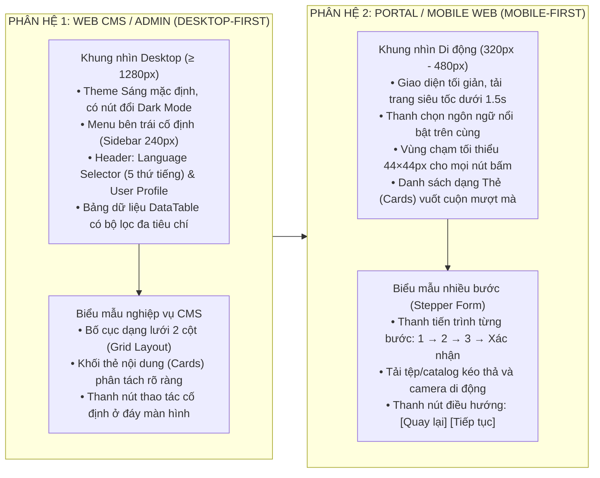

# QUY CHUẨN ĐẶC TẢ THIẾT KẾ GIAO DIỆN VÀ TRẢI NGHIỆM NGƯỜI DÙNG (UI/UX SPECIFICATION)

Tài liệu này quy định hệ thống nguyên tắc, quy chuẩn cấu trúc và phương pháp đặc tả giao diện người dùng (Frontend UI/UX) cho các ứng dụng Web Desktop (CMS/Admin), Web Portal và Mobile Web/App.

---

## 1. NGUYÊN TẮC THIẾT KẾ GIAO DIỆN CỐT LÕI

1. **Phong Cách Thiết Kế Mới Mẻ & Hiện Đại (Contemporary Modern UI Aesthetics):**
   * Trường hợp người dùng **không chỉ định một codebase hoặc UI template cụ thể**, mặc định **BẮT BUỘC áp dụng phong cách thiết kế mới mẻ, hiện đại, cao cấp** (Clean Contemporary Minimalist):
     * Bố cục thoáng đãng (Generous Whitespace), phân cấp thông tin rõ ràng.
     * Bo góc mềm mại hiện đại (`rounded-lg: 8px`, `rounded-xl: 12px`, `rounded-2xl: 16px`).
     * Đổ bóng phân tầng tinh tế (`shadow-sm`, `shadow-md`), hiệu ứng viền kính mờ nhẹ (Subtle Glassmorphism / Backdrop Filter) cho thanh điều hướng và modal.
     * Sử dụng phông chữ hiện đại (Inter, Plus Jakarta Sans, Outfit) với tỷ lệ phân cấp chữ mạch lạc.
     * Chuyển động vi mô (Micro-animations / Transitions) mượt mà 60 FPS (tối đa 200 - 300ms) trên các tương tác hover, bấm nút và mở drawer/modal.
2. **Mặc Định Theme Sáng (Default Light Theme) & Hỗ Trợ Đầy Đủ Light Mode / Dark Mode:**
   * Mặc định khởi tạo giao diện ở **Theme Sáng (Light Mode)** hiện đại, thanh lịch, độ tương phản chuẩn công thái học.
   * Mặc định đối với ứng dụng Web **BẮT BUỘC tích hợp sẵn Cơ chế Chuyển đổi Chủ đề (Theme Switcher / Toggle Button)** trên thanh điều hướng trên cùng:
     * Quản lý qua biến CSS Variables (`--bg-primary`, `--bg-secondary`, `--card-bg`, `--text-primary`, `--text-secondary`, `--border-color`, `--accent-color`).
     * Hỗ trợ 3 chế độ: `Light Mode` (Sáng), `Dark Mode` (Tối), và `System Default` (Theo hệ điều hành).
     * Bảng màu Semantic Tokens được ánh xạ 1-1 đối xứng, bảo đảm Dark Mode có độ tương phản êm dịu (`#0B132B`, `#0F172A`, `#1E293B`) không bị chói lóa, và Light Mode sáng sủa, sắc nét (`#FFFFFF`, `#F8FAFC`, `#F1F5F9`).
3. **Mặc Định Đa Ngôn Ngữ 5 Thứ Tiếng (Việt - Anh - Trung - Nhật - Hàn) Đồng Bộ Cả BE và FE:**
   * **Phía Frontend (FE):**
     * Mặc định **BẮT BUỘC có Bộ chọn chuyển đổi ngôn ngữ (Language Selector Dropdown)** trên Header/Navbar hiển thị icon cờ quốc gia và tên bản địa của ngôn ngữ.
     * Khai báo tập trung và đầy đủ 5 tệp từ điển ngôn ngữ JSON:
       1. `vi.json` (Tiếng Việt — Mặc định)
       2. `en.json` (Tiếng Anh — English)
       3. `zh.json` (Tiếng Trung giản thể — 中文)
       4. `ja.json` (Tiếng Nhật — 日本語)
       5. `ko.json` (Tiếng Hàn — 한국어)
     * **Nguyên tắc Zero-Hardcode Text:** 100% các chuỗi văn bản (tiêu đề, nhãn trường, placeholder, tiêu đề cột bảng DataTable, thông báo lỗi validation, popup xác nhận, toast thông báo) phải được gọi qua hàm `t('key')`. Tuyệt đối không hardcode chuỗi ký tự thô trong mã nguồn component.
   * **Phía Backend (BE):**
     * Mặc định tích hợp bộ giải quyết ngôn ngữ tự động (`LocaleResolver` / `Accept-HeaderLocaleResolver`) bắt tiêu đề `Accept-Language` từ HTTP Request.
     * Cấu hình `ResourceBundleMessageSource` với 5 tệp thông điệp bản địa hóa chuẩn:
       1. `messages_vi.properties` (Tiếng Việt — Mặc định)
       2. `messages_en.properties` (Tiếng Anh)
       3. `messages_zh.properties` (Tiếng Trung)
       4. `messages_ja.properties` (Tiếng Nhật)
       5. `messages_ko.properties` (Tiếng Hàn)
     * Tự động dịch mã lỗi ngoại lệ (`GlobalExceptionHandler`), thông điệp phản hồi API `ResultResponse<T>` và mẫu email thông báo theo đúng ngôn ngữ mà client gửi lên.
4. **Hệ thống Design Tokens chuẩn hóa:**
   * Mọi màu sắc, phông chữ, khoảng cách (spacing), bán kính bo góc (border radius) và độ đổ bóng (box shadow) **bắt buộc phải sử dụng biến CSS (CSS Variables)** hoặc Tailwind Theme Config.
   * Tuyệt đối **không hardcode mã màu Hex (`#FFFFFF`, `#E53535`) hoặc giá trị pixel cố định** trực tiếp trong component.
5. **Nguyên tắc Sắp xếp Cột Bảng Dữ liệu (DataTable Standard Column Ordering):**
   * Mọi bảng danh sách dữ liệu (DataTable) trên giao diện bắt buộc tuân thủ thứ tự sắp xếp cột từ trái sang phải:
     1. **Cột 1: Hộp chọn (Checkbox)** — Dùng để chọn nhiều bản ghi xử lý hàng loạt.
     2. **Cột 2: Số thứ tự (STT)** — Tự động tăng theo phân trang.
     3. **Cột 3: Thao tác / Hành động (Row Actions)** — Chứa các nút/icon thao tác nhanh cho từng dòng (Xem chi tiết, Chỉnh sửa, Xóa, Phê duyệt).
     4. **Cột 4 trở đi: Các cột dữ liệu nghiệp vụ** (Mã hồ sơ, Họ tên, Trạng thái, Số tiền, Ngày tạo,...).
   * **Tuyệt đối không đặt cột Thao tác ở cuối cùng bên phải** (tránh việc người dùng phải cuộn ngang màn hình để tìm nút thao tác).
6. **Kiểm tra tính hợp lệ dữ liệu toàn diện (Frontend Schema Validation):**
   * Mọi biểu mẫu (Form) bắt buộc phải có lược đồ kiểm tra tính hợp lệ bằng thư viện chuẩn (Zod / Yup) kết hợp React Hook Form.
   * Đảm bảo quy tắc kiểm tra phía Frontend khớp 100% với Backend (Độ dài, định dạng Regex, kiểm tra mốc thời gian logic, thông báo lỗi inline dưới từng ô nhập).

---

## 2. PHÂN HỆ VÀ MẪU BỐ CỤC (LAYOUT PATTERNS)



---

## 3. CẤU TRÚC ĐẶC TẢ THÀNH PHẦN THEO ATOMIC DESIGN & FSD

Mọi tính năng giao diện phải được quy hoạch theo kiến trúc phân tầng Feature-Sliced Design (FSD):

```text
frontend/
├── locales/              # 5 TẬP TIN TỪ ĐIỂN ĐA NGÔN NGỮ CHUẨN
│   ├── vi.json           # Tiếng Việt (Mặc định)
│   ├── en.json           # Tiếng Anh
│   ├── zh.json           # Tiếng Trung
│   ├── ja.json           # Tiếng Nhật
│   └── ko.json           # Tiếng Hàn
└── src/
    ├── app/              # App Router, Layouts, ThemeProvider (Light/Dark), LocaleProvider
    ├── widgets/          # Header (ThemeToggle + LangSelector), Sidebar, KanbanBoard, ComparisonMatrix
    ├── features/[name]/  # Component chuyên biệt tính năng (Form, Table, Modal, Hooks, API Service)
    ├── entities/[name]/  # Models, TypeScript Types & Data Hooks
    └── shared/           # UI Tokens, Atoms (Button, Input, Badge, DataTable, Dialog), Zod Schemas
```

---

## 4. BẢNG MÀU SEMANTIC THEK CHẾ ĐỘ SÁNG / TỐI (LIGHT / DARK THEME TOKENS)

| Semantic Token | Vai Trò Áp Dụng | Giá Trị Theme Sáng (Light Mode - Mặc định) | Giá Trị Theme Tối (Dark Mode) |
| :--- | :--- | :--- | :--- |
| `--bg-app` | Nền toàn trang ứng dụng | `#F8FAFC` (Slate 50) | `#0B132B` (Obsidian Deep) |
| `--bg-surface` | Nền Card, Panel, Modal | `#FFFFFF` (Pure White) | `#1E293B` (Slate 800) |
| `--bg-subtle` | Nền Sidebar, Table Header | `#F1F5F9` (Slate 100) | `#0F172A` (Slate 900) |
| `--text-primary`| Chữ tiêu đề, nội dung chính | `#0F172A` (Slate 900) | `#F8FAFC` (Slate 50) |
| `--text-secondary`| Chữ phụ, placeholder, mô tả | `#64748B` (Slate 500) | `#94A3B8` (Slate 400) |
| `--border-color`| Đường kẻ viền, border card | `#E2E8F0` (Slate 200) | `#334155` (Slate 700) |
| `--color-primary`| Màu thương hiệu hành động | `#2563EB` (Blue 600) | `#3B82F6` (Blue 500) |
| `--color-success`| Thành công, Đã duyệt | `#16A34A` (Green 600) | `#22C55E` (Green 500) |
| `--color-warning`| Cảnh báo, Chờ duyệt | `#D97706` (Amber 600) | `#F59E0B` (Amber 500) |
| `--color-danger` | Thất bại, Từ chối, Lỗi | `#DC2626` (Red 600) | `#EF4444` (Red 500) |

---

## 5. QUY CHUẨN MÀU SẮC TRẠNG THÁI (STATUS BADGES)

Mọi trạng thái nghiệp vụ phải được thể hiện bằng Badge chuẩn màu sắc ngữ nghĩa:

| Nhóm trạng thái | Màu chữ (Light / Dark) | Màu nền (Light / Dark) | Ví dụ trạng thái áp dụng |
| :--- | :--- | :--- | :--- |
| **Khởi tạo / Nháp** | `#475569` / `#CBD5E1` | `#F1F5F9` / `#334155` | `DRAFT`, `CANCELLED` |
| **Chờ xử lý / Đang thẩm định** | `#B45309` / `#FCD34D` | `#FEF3C7` / `#78350F` | `PENDING`, `PROCESSING`, `PAYMENT_PENDING` |
| **Đã xem xét / Chờ duyệt** | `#1D4ED8` / `#93C5FD` | `#EFF6FF` / `#1E3A8A` | `REVIEWED`, `WAITING_APPROVAL`, `SUBMITTED` |
| **Thành công / Đã phê duyệt** | `#15803D` / `#86EFAC` | `#DCFCE7` / `#14532D` | `APPROVED`, `COMPLETED`, `PAID` |
| **Từ chối / Thất bại** | `#B91C1C` / `#FCA5A5` | `#FEE2E2` / `#7F1D1D` | `REJECT`, `FAILED`, `EXPIRED` |

---

## 6. TIÊU CHUẨN TRUY CẬP VÀ TRẢI NGHIỆM NGƯỜI DÙNG (ACCESSIBILITY & UX)

* **Vùng chạm tối thiểu (Touch Targets):** Mọi nút bấm và control trên di động phải có kích thước tối thiểu `44×44px` với khoảng cách đệm `≥ 8px`.
* **Độ tương phản màu sắc (Color Contrast):** Độ tương phản giữa chữ và nền đạt tối thiểu `4.5:1` (chuẩn WCAG AA) trên cả Theme Sáng và Theme Tối.
* **Đầy đủ 4 trạng thái giao diện:**
  1. *Trạng thái đang tải (Loading State):* Dùng khung xương (Skeleton Loading) đồng điệu màu nền.
  2. *Trạng thái rỗng (Empty State):* Hiển thị hình minh họa vector phẳng và nút hướng dẫn tạo mới.
  3. *Trạng thái lỗi (Error State):* Thông báo lỗi rõ ràng, đặt cạnh ô nhập liệu bị lỗi, kèm nút thử lại.
  4. *Trạng thái thành công (Success State):* Thông báo phản hồi góc màn hình (Toast Notification) tự đóng sau 3 giây.

---

## 7. QUY CHUẨN THIẾT KẾ LOGO, BIỂU TƯỢNG ỨNG DỤNG VÀ FAVICON (BRANDING & ICON SPECIFICATION)

1. **Bộ Tiêu Chí Cốt Lõi (Core Branding Principles):**
   * **Sáng tạo - Độc đáo - Hiện đại - Đơn giản (Creative, Unique, Modern, Minimalist):** Logo và Icon phải mang dấu ấn nhận diện đặc trưng cho lĩnh vực nghiệp vụ của dự án, thiết kế theo ngôn ngữ Monoline hoặc Flat Vector tinh gọn, đường nét dứt khoát, thanh thoát.
2. **Quy Tắc Chống Rối Rắm & Bảo Đảm Nhận Diện Kích Thước Nhỏ (Favicon Scalability Rule):**
   * **Tuyệt đối không thiết kế hình ảnh rườm rà, chi tiết vụn vặt, 3D quá nhiều nếp gấp bóng mờ phức tạp** khiến hình ảnh bị nhòe, vỡ nét, biến dạng hoặc không thể nhận diện khi thu nhỏ về kích thước Favicon (16×16 px, 32×32 px, 48×48 px) trên thanh tiêu đề trình duyệt / thanh taskbar / icon ứng dụng di động.
   * **Nguyên tắc nét vẽ liền mạch hoặc hình khối đơn (Bold Monoline / Solid Shapes):** Sử dụng các khối hình học cơ bản hoặc nét vẽ dày chắc chắn, phân tách rõ ràng, độ tương phản cao giữa biểu tượng và nền.
3. **Quy Cách Đóng Gói Và Lưu Trữ Tài Sản Hình Ảnh:**
   * **Logo Thương hiệu (Brand Logo):** Tỷ lệ ngang 16:9 hoặc chữ nhật, chứa biểu trưng (Mark) và tên thương hiệu (Typography), lưu tại `docs/assets/<tên_dự_án>_logo_brand.*`.
   * **Biểu tượng Ứng dụng & Favicon (App Icon):** Tỷ lệ vuông 1:1, bo góc nhẹ (Squircle), chỉ chứa duy nhất biểu trưng hình học cốt lõi không có chữ nhỏ, lưu tại `docs/assets/<tên_dự_án>_app_icon.*`.
