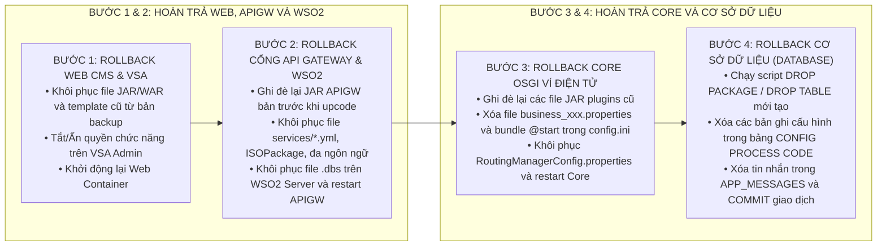

# QUY CHUẨN SOẠN THẢO TÀI LIỆU HƯỚNG DẪN UPCODE VÀ ĐÓNG GÓI PHIẾU YÊU CẦU (DEPLOYMENT RUNBOOK / VIETTEL HDUP)

Tài liệu này quy định hệ thống nguyên tắc, cấu trúc 6 phần chuẩn mực theo quy trình bàn giao và triển khai phần mềm Tập đoàn Viettel (`HDUP_<TÊN_TÍNH_NĂNG>_<MÃ_CR>_v1.0` - Hướng dẫn Triển khai Thay đổi Code / Deployment & Upcode Runbook Guide), bảng danh mục file thay đổi 5 cột dạng cây thư mục, quy trình cấu hình chi tiết cho từng phân hệ (Database, Core OSGi, API Gateway, Web CMS/Báo cáo, WSO2 Data Services, Phân quyền VSA), kịch bản kiểm tra sau upcode (Smoke Test) và kịch bản khôi phục thảm họa (Rollback Plan).

---

## 1. NGUYÊN TẮC CỐT LÕI KHI SOẠN THẢO TÀI LIỆU HƯỚNG DẪN UPCODE

* **Tính Khả Thi & Thực Chứng 100% (Reproducible & Verifiable):**
  * Mọi chỉ dẫn upcode, vị trí tệp tin, thông số cấu hình, script CSDL và câu lệnh quản trị bắt buộc phải tuyệt đối chính xác, không dùng placeholder mơ hồ. Cán bộ triển khai (DevOps/SysAdmin/NOC) có thể thực hiện tuần tự từ trên xuống dưới mà không cần suy đoán.
* **Quy Chuẩn Cây Thư Mục File Thay Đổi Có Gắn Nhãn Trạng Thái:**
  * Mọi tệp tin thay đổi trong Bảng Danh mục tệp tin phải được trình bày dưới dạng sơ đồ Cây thư mục ASCII (Directory Tree) và bắt buộc phải có nhãn trạng thái rõ ràng: `(CREATE)` đối với file thêm mới, `(UPDATE)` đối với file chỉnh sửa, `(DELETE)` đối với file bị loại bỏ.
* **Quy Chuẩn Đóng Gói Đồng Bộ Package Upcode:**
  * Song hành cùng tài liệu hướng dẫn upcode (`HDUP`), toàn bộ tệp tin nguồn (Scripts SQL, JAR plugins, YAML configs, Properties, XML, Excel templates, Icons) bắt buộc phải được đóng gói vào thư mục `upcode-package-<TÊN_TÍNH_NĂNG>-<MÃ_CR>` với cấu trúc phân cấp tương ứng 1:1 với hướng dẫn trong tài liệu.
* **Quy Chuẩn Đặt Tên Tệp Tin Ngắn Gọn & Không Trùng Lặp Ngữ Cảnh:**
  * Khi lưu trữ trong thư mục chuyên biệt đã chứa ngữ cảnh tính năng/dự án/nhiệm vụ (ví dụ `plan/pentest/`, `plan/<feature>/`, hoặc thư mục `upcode-package/`), **tên tệp tài liệu hướng dẫn upcode đặt ngắn gọn là `HDUC.md` (hoặc `HDUP.md`)**, tuyệt đối không lặp lại tên dự án hay tên tính năng dài dòng đã có trong đường dẫn thư mục cha.
  * Chỉ sử dụng định dạng tên đầy đủ dạng `HDUP_<TÊN_TÍNH_NĂNG>_<MÃ_CR>_v1.0.md` (hoặc `.docx`) khi xuất file độc lập bàn giao ra ngoài thư mục dự án (standalone deliverables / email / ticket attachment).
* **Quy Chuẩn 6 Phần Bắt Buộc Viettel `HDUP`:**
  * Phần 1: Kế hoạch tổng quan triển khai (Bảng phân hệ tác động, phương án upcode, mức độ downtime).
  * Phần 2: Danh mục chi tiết các tệp tin thay đổi (Bảng chuẩn 5 cột kèm cây thư mục ASCII).
  * Phần 3: Hướng dẫn triển khai & Cấu hình chi tiết từng phân hệ (DB, Core OSGi, APIGW, Web CMS, WSO2, VSA).
  * Phần 4: Kịch bản kiểm tra xác nhận sau upcode (Smoke Test & End-to-End Test).
  * Phần 5: Kịch bản hoàn trả phiên bản khi có sự cố (Rollback Plan & Procedure).
  * Phần 6: Hướng dẫn đóng gói và bàn giao bộ tệp tin nguồn.
* **Quy Chuẩn Ngôn Ngữ & Trực Quan:**
  * Sử dụng tiếng Việt kỹ thuật chuyên nghiệp, chuẩn mực, không chèn tiếng Anh đệm/dịch nghĩa thừa trong ngoặc đơn. Giữ nguyên định danh mã nguồn, câu lệnh shell, tên bảng CSDL, tên class và đường dẫn tệp tin.
  * Tuyệt đối không chèn biểu tượng (icon/emoji) vào tiêu đề chương mục, bảng biểu và nội dung văn bản.
  * Sử dụng ký tự Unicode thuần túy thay cho công thức LaTeX chứa dấu `$`.
  * Sơ đồ luồng triển khai và kịch bản phối hợp phải vẽ bằng `flowchart LR` 2 cột song song chuẩn tỷ lệ 4:3.

---

## 2. CẤU TRÚC 6 PHẦN CHUẨN VIETTEL HDUP

```text
Tài liệu Hướng dẫn Upcode (HDUC.md hoặc HDUP.md)
├── Trang Bìa & Quản trị: Tập đoàn, Công ty, Tên dự án/Hệ thống, Tên phiếu yêu cầu, Mã CR, Ngày tháng, Người tạo/duyệt
├── Phần 1: KẾ HOẠCH TỔNG QUAN TRIỂN KHAI
│   ├── 1.1. Bảng phân hệ tác động và Phương án upcode (DB, Core, APIGW, Web, WSO2, VSA)
│   ├── 1.2. Mức độ ảnh hưởng dịch vụ (Downtime / Zero-Downtime / Thời gian thực hiện)
│   └── 1.3. Thứ tự triển khai tổng thể giữa các phân hệ
├── Phần 2: DANH MỤC CHI TIẾT CÁC TỆP TIN THAY ĐỔI
│   └── Bảng 5 Cột Chuẩn: STT | Phân hệ / Tệp tin | Cấu trúc cây thư mục (CREATE/UPDATE/DELETE) | Mục đích & Mô tả | Ghi chú
├── Phần 3: HƯỚNG DẪN TRIỂN KHAI VÀ CẤU HÌNH CHI TIẾT TỪNG PHÂN HỆ
│   ├── 3.1. Phân hệ Cơ sở Dữ liệu (Database Scripts: DDL, Package/Procedure, Config Process Code, Config Messages, Alter Table)
│   ├── 3.2. Phân hệ Core Ví Điện Tử (OSGi Core: Plugins JAR, RoutingManagerConfig, config.ini, partner-config, business_xxx, hibernate)
│   ├── 3.3. Phân hệ Cổng API Gateway (End-User/Agent: JARs, services/*.yml, ISOPackage.xml, đa ngôn ngữ, menu app, icons)
│   ├── 3.4. Phân hệ Web Quản trị / Báo cáo (Web CMS: Backend JAR, UI Views/Logic, config.profile, Excel templates, XML operations, messages)
│   ├── 3.5. Phân hệ Tích hợp Dịch vụ Dữ liệu (WSO2 Data Services: File .dbs, queries, operations mapping)
│   └── 3.6. Cấu hình Phân quyền Hệ thống VSA (Viettel Single Authority: Menu Name, Code, Description, URL Class, Roles)
├── Phần 4: KỊCH BẢN KIỂM TRA VÀ NGHIỆM THU SAU UPCODE (SMOKE TEST)
│   ├── 4.1. Kiểm tra trạng thái tiến trình và kết nối dịch vụ
│   ├── 4.2. Kiểm tra giao dịch nghiệp vụ mẫu trên môi trường Staging/Production
│   └── 4.3. Tra soát dữ liệu hạch toán, biến động số dư và bảng ghi nhận nhật ký
├── Phần 5: KỊCH BẢN HOÀN TRẢ PHIÊN BẢN KHI CÓ SỰ CỐ (ROLLBACK PLAN)
│   ├── 5.1. Điều kiện kích hoạt Rollback khẩn cấp
│   ├── 5.2. Thứ tự hoàn trả các phân hệ (Web -> APIGW -> Core -> Database)
│   └── 5.3. Chi tiết các bước và script hoàn trả (Drop bảng, Revert configs/JARs, Restart services)
└── Phần 6: QUY CHUẨN ĐÓNG GÓI BỘ TỆP TIN NGUỒN UPCODE
    └── Sơ đồ cấu trúc cây thư mục Package bàn giao (DB, core, apigw, web, wso2, vsa)
```

---

## 3. CÁC BIỂU MẪU ĐẶC TẢ VÀ HƯỚNG DẪN CHI TIẾT

### 3.1. Bảng Kế Hoạch Tổng Quan Triển Khai (Phần 1)

| STT | Tên phân hệ / Dịch vụ | Tác động | Phương án Upcode | Mức độ gián đoạn | Yêu cầu kiểm soát | Ghi chú |
| :---: | :--- | :--- | :--- | :---: | :--- | :--- |
| 1 | **Cơ sở Dữ liệu (Database)** | Thêm bảng, Procedure, cấu hình hạch toán, tin nhắn | Chạy script SQL theo thứ tự chỉ định | Không gián đoạn | Kiểm tra log thực thi script, không có lỗi ORA | Chạy đầu tiên |
| 2 | **Core OSGi Ví Điện Tử** | Thêm Bundle Business, kết nối đối tác, hạch toán | Copy JAR vào `plugins/`, cập nhật `etc/`, restart bundle | Gián đoạn cụm Core (1-2 phút) | Kiểm tra trạng thái Bundle `ACTIVE`, log khởi động | Chạy thứ 2 |
| 3 | **Cổng API Gateway (End-User)**| Thêm Controller, Service, DTO, cấu hình dịch vụ | Ghi đè file JAR, cập nhật `etc/`, khởi động lại dịch vụ | Không gián đoạn (Rolling update) | Healthcheck endpoint HTTP 200, kiểm tra log | Chạy thứ 3 |
| 4 | **Web CMS / Báo Cáo** | Thêm màn hình báo cáo, logic kết xuất dữ liệu | Ghi đè file JAR/WAR, cập nhật `etc/`, khởi động lại | Gián đoạn Web (1 phút) | Đăng nhập Web CMS, mở thử màn hình báo cáo | Chạy thứ 4 |
| 5 | **WSO2 Data Services** | Thêm truy vấn gọi Package CSDL | Cập nhật file `.dbs` trên WSO2 Server | Không gián đoạn | Test thử Data Service Operation qua SOAP/REST | Chạy thứ 5 |
| 6 | **Phân Quyền VSA** | Khai báo Menu và phân quyền người dùng | Thêm mới chức năng trên giao diện VSA Admin | Không gián đoạn | Đăng nhập tài khoản test kiểm tra hiển thị menu | Chạy cuối cùng |

---

### 3.2. Bảng Danh Mục Chi Tiết Tệp Tin Thay Đổi (Phần 2)

Bắt buộc sử dụng cấu trúc cây thư mục ASCII kèm nhãn `(CREATE)`, `(UPDATE)` hoặc `(DELETE)` tại cột 3:

| STT | Phân hệ / Tệp tin | Cấu trúc vị trí tệp tin thay đổi | Mục đích & Mô tả thay đổi | Ghi chú |
| :---: | :--- | :--- | :--- | :--- |
| 1 | **Core Plugins** | `plugins/ErrorContent-1.1.jar`<br/>`├── com/`<br/>`│   └── viettel/`<br/>`│       └── msgcontent/`<br/>`│           └── utils/`<br/>`│               ├── Config.class (UPDATE)`<br/>`│               └── msg-error.xml (UPDATE)` | Bổ sung mã lỗi và thông điệp lỗi nghiệp vụ theo đa ngôn ngữ. | Ghi đè JAR |
| 2 | **Core Plugins** | `plugins/ewutils-1.1.jar`<br/>`├── com/`<br/>`│   └── viettel/`<br/>`│       └── ewallet/`<br/>`│           └── utils/`<br/>`│              └── config/`<br/>`│                  ├── Constants.class (UPDATE)`<br/>`│                  └── ProcessCode.class (UPDATE)` | Khai báo hằng số nghiệp vụ và mã tiến trình giao dịch mới. | Ghi đè JAR |
| 3 | **Core Plugins** | `plugins/EwalletDBUtils-1.1.jar`<br/>`├── com/`<br/>`│   └── viettel/`<br/>`│       └── ewallet/`<br/>`│           └── database/`<br/>`│              ├── entities/`<br/>`│              │   └── ReconcileReport.class (CREATE)`<br/>`│              └── query/`<br/>`│                  └── DBUtils.class (UPDATE)` | Thêm thực thể CSDL mới và cập nhật truy vấn báo cáo. | Ghi đè JAR |
| 4 | **Core Plugins** | `plugins/Business-578xxx-1.0.jar`<br/>`├── com/`<br/>`│   └── viettel/`<br/>`│       └── ewallet/`<br/>`│           └── core/`<br/>`│              └── business/`<br/>`│                 ├── pc578000/`<br/>`│                 │   └── TopupBusiness.java (CREATE)`<br/>`│                 ├── pc578001/`<br/>`│                 │   └── TopupOtherBusiness.java (CREATE)`<br/>`│                 └── pc578002/`<br/>`│                     └── RevertTopupBusiness.java (CREATE)` | Xử lý logic hạch toán nạp tiền chính chủ, nạp tiền hộ và hoàn tiền sự cố. | Thêm mới JAR |
| 5 | **Core Config** | `etc/`<br/>`├── RoutingManagerConfig.properties (UPDATE)`<br/>`├── config.ini (UPDATE)`<br/>`├── partner-config.properties (UPDATE)`<br/>`├── business_578xxx.properties (CREATE)`<br/>`└── hibernate.cfg.xml (UPDATE)` | Cập nhật routing process code, bundle khởi động và thông số kết nối đối tác. | Chỉnh sửa / Thêm mới |
| 6 | **API Gateway** | `mosan-apigw-enduser-1.0.jar`<br/>`├── java/`<br/>`│   └── tl/telemor/mosan/euapigw/`<br/>`│       ├── controller/TopupController.java (CREATE)`<br/>`│       ├── service/impl/TopupServiceImpl.java (CREATE)`<br/>`│       ├── dto/TopupRequest.java (CREATE)`<br/>`│       └── constants/Constants.java (UPDATE)` | Tiếp nhận và xử lý yêu cầu API từ ứng dụng khách hàng đầu cuối. | Ghi đè JAR |
| 7 | **API Gateway Config** | `etc/`<br/>`├── services/topup-service.yml (CREATE)`<br/>`├── ISOPackage.xml (UPDATE)`<br/>`├── message.en.properties (UPDATE)`<br/>`├── message.tet.properties (UPDATE)`<br/>`├── message.zh.properties (UPDATE)`<br/>`└── config-app-features.xml (UPDATE)`<br/>`assets/icons/topup_icon.png (CREATE)` | Cấu hình tham số dịch vụ đối tác, ISO-8583 fields, đa ngôn ngữ, menu và icon ứng dụng. | Chỉnh sửa / Thêm mới |
| 8 | **Web CMS Backend** | `ewallet2-backend-1.1.jar`<br/>`├── java/org/vaadin/ewallet2/model/`<br/>`│   └── report/`<br/>`│       ├── SummaryReport.java (CREATE)`<br/>`│       └── TransactionReport.java (CREATE)` | Khai báo DTO và mô hình dữ liệu kết xuất báo cáo. | Ghi đè JAR |
| 9 | **Web CMS Config** | `etc/`<br/>`├── config.profile (UPDATE)`<br/>`├── template/TEMPLATE_REPORT_SUMMARY.xlsx (CREATE)`<br/>`├── template/TEMPLATE_REPORT_TRANSACTION.xlsx (CREATE)`<br/>`└── xml/get_report_operation.xml (CREATE)` | Cấu hình đường dẫn operation XML và biểu mẫu template Excel báo cáo. | Thêm mới template |
| 10 | **Web CMS UI** | `ewallet2-ui-1.1.war`<br/>`├── org/vaadin/ewallet2/web/`<br/>`│   ├── MainScreen.java (UPDATE)`<br/>`│   └── report/ReportView.java (CREATE)`<br/>`└── resources/messages_vi.properties (UPDATE)` | Giao diện tra cứu báo cáo và tài nguyên đa ngôn ngữ trên Web CMS. | Cập nhật Webapp |
| 11 | **WSO2 Data Services** | `wso2/dataservices/`<br/>`└── MERCHANT_CORE_DataService.dbs (UPDATE)` | Khai báo query và operation SOAP/REST kết nối đến Oracle Package. | Cập nhật file .dbs |
| 12 | **Cơ sở Dữ liệu** | `DB/core/`<br/>`├── TABLE_RECONCILE_REPORT.sql (CREATE)`<br/>`├── PCK_REPORT.sql (CREATE)`<br/>`├── CONFIG_PROCESS_CODE.sql (CREATE)`<br/>`└── CONFIG_MESSAGES.sql (CREATE)` | Khởi tạo bảng dữ liệu, package, dữ liệu hạch toán và tin nhắn thông báo. | Chạy theo thứ tự |

---

### 3.3. Hướng Dẫn Chi Tiết Triển Khai Từng Phân Hệ (Phần 3)

#### 3.3.1. Hướng Dẫn Triển Khai Cơ Sở Dữ Liệu (Database)
1. **Thứ tự thực thi script trên Schema Core:**
   * Bước 1: Chạy `TABLE_RECONCILE_REPORT.sql` để tạo bảng mới, khóa chính và chỉ mục dữ liệu.
   * Bước 2: Chạy `PCK_REPORT.sql` để biên dịch Package Header và Package Body truy vấn báo cáo.
   * Bước 3: Chạy `CONFIG_PROCESS_CODE.sql` bằng khối PL/SQL ẩn danh (`DECLARE ... BEGIN ... END; /`) để khởi tạo: Master Account, Service Code Mapping, Account Right Default, Process Mapping (các bước 1, 2, -1), Trans State Config, Tariff Plan Mapping và Rule Condition cho từng Process Code (578000, 578001, 578002).
   * Bước 4: Chạy `CONFIG_MESSAGES.sql` để cấu hình nội dung tin nhắn SMS/Notification đa ngôn ngữ (`en_TL`, `en_us`, `te_TL`) trong bảng `APP_MESSAGES`.
2. **Thực thi script trên Schema API Gateway / Dịch vụ khác (nếu có):**
   * Chạy câu lệnh `ALTER TABLE TRANSACTION ADD REF_ID VARCHAR2(255);` (nếu có bổ sung trường dữ liệu).

#### 3.3.2. Hướng Dẫn Triển Khai Core OSGi Ví Điện Tử
1. **Copy các file Bundle JAR vào thư mục `plugins/`:**
   * Ghi đè: `ErrorContent-1.1.jar`, `ewutils-1.1.jar`, `EwalletDBUtils-1.1.jar`.
   * Thêm mới: `Business-578xxx-1.0.jar`, `EwGameTopup-1.1.jar`.
2. **Cập nhật cấu hình trong thư mục `etc/`:**
   * `RoutingManagerConfig.properties`: Bổ sung danh sách Process Code mới vào thread xử lý:
     ```properties
     routing.manager.thead.16.list.process.code=800001;...;578000;578001;578002
     ```
   * `config.ini`: Thêm bundle khởi động vào cuối file:
     ```ini
     plugins/EwGameTopup@start, \
     plugins/Business-578xxx@start,\
     ```
   * `partner-config.properties`: Khai báo endpoint, timeout và retry kết nối đối tác:
     ```properties
     gametopup.URL=https://topupgame.tls.tl:9443/
     gametopup.socketTimeout=60
     gametopup.retry.maxAttempts=3
     gametopup.retry.delayMs=2000
     ```
   * `business_578xxx.properties`: Khai báo ánh xạ class xử lý nghiệp vụ cho từng Process Code.
   * `hibernate.cfg.xml`: Bổ sung `<mapping class="com.viettel.ewallet.database.entities.ReconcileReportGameTopup"/>`.
3. **Thao tác Console OSGi:**
   * Kiểm tra trạng thái các bundle: `ss | grep -i Business-578xxx`
   * Cập nhật bundle: `update <bundle_id>` hoặc khởi động lại tiến trình Core.

#### 3.3.3. Hướng Dẫn Triển Khai API Gateway
1. **Ghi đè file JAR triển khai:** `mosan-apigw-enduser-1.0.jar`, `mosan-apigw-utils-1.0.jar`.
2. **Cập nhật cấu hình thư mục `etc/`:**
   * Tạo mới `etc/services/<service-name>.yml` (chứa URL, username, password, RSA public key, basic auth, service/partner code).
   * Cập nhật `etc/ISOPackage.xml` bổ sung các trường ISO mở rộng (ví dụ Field 129, 130).
   * Cập nhật tài nguyên đa ngôn ngữ: `message.en.properties`, `message.tet.properties`, `message.zh.properties`.
   * Cập nhật `config-app-features.xml` để hiển thị menu dịch vụ trên ứng dụng di động.
3. **Bổ sung Icon:** Copy file ảnh icon vào `assets/assets/icons/<icon-name>.png`.
4. **Khởi động lại dịch vụ API Gateway:** `systemctl restart mosan-apigw-enduser` hoặc lệnh khởi động tương ứng.

#### 3.3.4. Hướng Dẫn Triển Khai Web CMS / Báo Cáo (ewallet2)
1. **Cập nhật Backend:** Ghi đè `ewallet2-backend-1.1.jar` trong thư mục thư viện.
2. **Cập nhật Cấu hình & Mẫu Biểu:**
   * Cập nhật `etc/config.profile` khai báo đường dẫn operation XML và template Excel báo cáo.
   * Copy file template `TEMPLATE_REPORT_*.xlsx` vào thư mục `etc/template/`.
   * Copy file XML operation `get_*_operation.xml` vào thư mục `etc/xml/<feature_name>/`.
3. **Cập nhật Giao diện & Đa ngôn ngữ:**
   * Copy class giao diện và logic vào `webapps/ewallet/WEB-INF/classes/`.
   * Cập nhật các file `messages_*.properties` (vi, en, tl, ht) trong `WEB-INF/classes/`.
4. **Khởi động lại Web Container:** Khởi động lại Tomcat / Wildfly / WebLogic để áp dụng thay đổi.

#### 3.3.5. Hướng Dẫn Cấu Hình WSO2 Data Services
1. Mở file `dataservices/MERCHANT_CORE_DataService.dbs`.
2. Bổ sung các khối `<query>` gọi Package Oracle và `<operation>` tương ứng (mapping tham số IN/OUT, SQLType và Cursor result columns).
3. Triển khai file `.dbs` lên cụm máy chủ WSO2 Data Services Server.

#### 3.3.6. Hướng Dẫn Cấu Hình Phân Quyền VSA (Viettel Single Authority)
1. Đăng nhập hệ thống VSA Admin bằng tài khoản Quản trị viên.
2. Khai báo Menu và Chức năng mới:
   * **Tên chức năng (Name):** Ví dụ `Game Topup Report`
   * **Mã chức năng (Code):** Ví dụ `ewallet.GameTopupReportView`
   * **Mô tả (Description):** Ví dụ `Game Topup Transaction & Summary Report`
   * **Đường dẫn URL / Class:** Ví dụ `org.vaadin.ewallet2.web.gameTopupReport.GameTopupReportView`
3. Phân quyền chức năng cho các nhóm người dùng / vai trò (Roles) tương ứng: Kế toán, Chăm sóc khách hàng, Đối soát, Quản trị hệ thống.

---

### 3.4. Kịch Bản Kiểm Tra Xác Nhận Sau Upcode (Phần 4 - Smoke Test)

| Bước | Thành phần kiểm tra | Thao tác thực hiện | Kết quả mong đợi | Biện pháp xử lý khi lỗi |
| :---: | :--- | :--- | :--- | :--- |
| 1 | **Trạng thái Dịch vụ** | `ps -ef \| grep mosan`<br/>`ss -tulpn \| grep <PORT>` | Toàn bộ tiến trình Backend, Core, APIGW, Web CMS hoạt động bình thường, Port lắng nghe đúng. | Tra cứu log khởi động, kiểm tra quyền truy cập file |
| 2 | **Trạng thái Core Bundle** | Vào OSGi console chạy lệnh `ss` | Tất cả bundle trong danh mục upcode đều ở trạng thái `ACTIVE`. | Chạy `diag <id>` để tìm bundle thiếu package phụ thuộc |
| 3 | **Giao Dịch Nghiệp Vụ Mẫu**| Thực hiện 01 giao dịch nạp tiền qua App / API test | Giao dịch thành công, tài khoản khách hàng nhận được biến động, nhận SMS/Notification chuẩn ngôn ngữ. | Tra log Core/APIGW theo Transaction ID, kiểm tra cấu hình Process Code |
| 4 | **Báo Cáo Web CMS** | Đăng nhập Web CMS, chọn menu Báo cáo, lọc dữ liệu | Hiển thị đúng dữ liệu giao dịch vừa thực hiện, bấm Kết xuất Excel tải về thành công và đúng mẫu biểu. | Tra log Web CMS và WSO2 Data Services |

---

### 3.5. Kịch Bản Hoàn Trả Phiên Bản Khi Có Sự Cố (Phần 5 - Rollback Plan)



1. **Thứ tự thực hiện Rollback:** Bắt buộc tuân thủ thứ tự ngược chiều: **Web CMS / VSA → API Gateway / WSO2 → Core OSGi → Database**.
2. **Script hoàn trả CSDL mẫu (Rollback SQL):**
   ```sql
   -- 1. Xóa Package và Bảng mới tạo
   DROP PACKAGE PCK_GAME_TOPUP_REPORT;
   DROP TABLE RECONCILE_REPORT_GAME_TOPUP PURGE;

   -- 2. Xóa cấu hình Process Code
   DELETE FROM RULE_CONDITION WHERE PROCESS_CODE IN ('578000','578001','578002');
   DELETE FROM TARIFF WHERE PROCESS_CODE IN ('578000','578001','578002');
   DELETE FROM TRANS_STATE_CONFIG WHERE PROCESS_CODE IN ('578000','578001','578002');
   DELETE FROM PROCESS_MAPPING WHERE PROCESS_CODE IN ('578000','578001','578002');
   DELETE FROM ACCOUNT_RIGHT_DEFAULT WHERE PROCESS_CODE IN ('578000','578001','578002');
   DELETE FROM SERVICE_CODE_MAPPING WHERE PROCESS_CODE IN ('578000','578001','578002');
   DELETE FROM TRANS_PROCESS_CODE WHERE PROCESS_CODE IN ('578000','578001','578002');

   -- 3. Xóa tin nhắn cấu hình
   DELETE FROM APP_MESSAGES WHERE LOCALE_KEY IN ('TOPUP_GAME_STEP1_SEND_SMS','TOPUP_GAME_CONFIRM_SEND_SMS','TOPUP_GAME_CANCEL_SEND_SMS');
   COMMIT;
   ```

---

## 4. QUY CHUẨN ĐÓNG GÓI BỘ TỆP TIN NGUỒN UPCODE (PACKAGE LAYOUT)

Mọi phiếu yêu cầu upcode khi bàn giao bắt buộc phải chứa thư mục `upcode-package-<TÊN_TÍNH_NĂNG>-<MÃ_CR>` với cấu trúc phân cấp chuẩn sau:

```text
upcode-package-<TÊN_TÍNH_NĂNG>-<MÃ_CR>/
├── HDUP_<TÊN_TÍNH_NĂNG>_<MÃ_CR>.md (hoặc .docx)  # Tài liệu Hướng dẫn Upcode chính thức
├── VSA_<TÊN_TÍNH_NĂNG>.docx (hoặc .md)           # Tài liệu hướng dẫn phân quyền VSA
├── DB/                                           # Chứa 100% script CSDL
│   ├── core/
│   │   ├── 01_TABLE_*.sql                        # DDL Bảng mới
│   │   ├── 02_PCK_*.sql                          # DDL Package/Procedure
│   │   ├── 03_CONFIG_PROCESS_CODE.sql            # DML Cấu hình hạch toán
│   │   ├── 04_CONFIG_MESSAGES.sql                # DML Tin nhắn SMS/Notification
│   │   └── ROLLBACK_DB.sql                       # Script hoàn trả CSDL khi lỗi
│   └── apigw/
│       └── 01_ALTER_TABLE.sql                    # Script cập nhật bảng CSDL APIGW
├── core/                                         # Chứa các file upcode phân hệ Core OSGi
│   ├── plugins/                                  # Chứa các file *.jar cần copy vào Core/plugins
│   │   ├── Business-*.jar
│   │   ├── Ew*.jar
│   │   ├── ewutils-*.jar
│   │   ├── EwalletDBUtils-*.jar
│   │   └── ErrorContent-*.jar
│   └── etc/                                      # Chứa các file cấu hình Core
│       ├── business_*.properties
│       ├── partner-config.properties.sample
│       └── RoutingManagerConfig.properties.sample
├── mosan-apigw-enduser/                          # Chứa các file upcode API Gateway
│   ├── *.jar                                     # JAR API Gateway
│   ├── etc/
│   │   ├── services/
│   │   │   └── <service-name>.yml
│   │   ├── ISOPackage.xml
│   │   ├── message.*.properties
│   │   └── config-app-features.xml
│   └── assets/
│       └── assets/icons/
│           └── <icon-name>.png
├── web/                                          # Chứa các file upcode Web CMS
│   ├── webapps/ewallet/WEB-INF/                  # Classes, Views và lib JAR
│   └── etc/
│       ├── template/
│       │   └── TEMPLATE_REPORT_*.xlsx
│       └── xml/
│           └── <service_name>/
│               └── get_*_operation.xml
└── wso2/                                         # Chứa file cấu hình WSO2
    └── dataservices/
        └── MERCHANT_CORE_DataService.dbs
```
