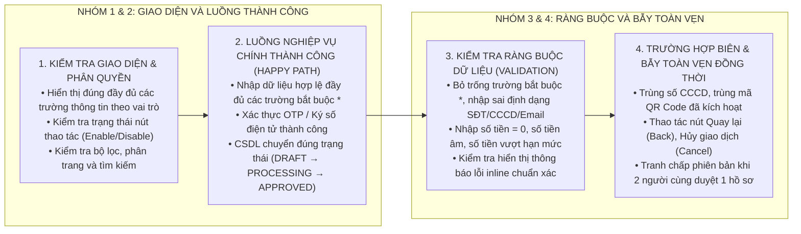

# QUY CHUẨN VÀ NGUYÊN TẮC VIẾT KỊCH BẢN VÀ BIÊN BẢN NGHIỆM THU UAT (VIETTEL UAT)

Tài liệu này quy định hệ thống nguyên tắc, quy chuẩn cấu trúc bảng tính kịch bản kiểm thử nghiệm thu người dùng (User Acceptance Testing - UAT), phương pháp bóc tách test cases và hệ thống công thức Excel động bắt buộc áp dụng cho các dự án của Tập đoàn Viettel.

---

## 1. NGUYÊN TẮC CỐT LÕI VÀ BẢO TOÀN CÔNG THỨC EXCEL

* **Nguyên tắc Bảo toàn 100% Công thức Động (Zero Hardcoded KPI Counts):**
  * Toàn bộ số lượng kịch bản đạt (`P`), không đạt (`F`), đang xem xét (`PE`), chưa kiểm thử, tổng số test cases và tỷ lệ phần trăm (`%P`, `%F`, `%Cover`) bắt buộc phải được tính toán tự động bằng công thức Excel (`COUNTIF`, `COUNTA`, `IF`, `SUM`).
  * **Tuyệt đối CẤM nhập số cứng (Hardcode) vào các ô thống kê KPI tổng hợp.** Khi thay đổi trạng thái kiểm thử tại bất kỳ dòng nào, toàn bộ khối KPI của Sheet và Dashboard Tổng hợp phải tự động nhảy số tức thì.
* **Mã Test Case tự động sinh và thích ứng cấu trúc (Dynamic TC Numbering):**
  * Bắt buộc sử dụng công thức tự động sinh mã `TC_01`, `TC_02` dựa trên dòng dữ liệu và trừ đi các dòng tiêu đề/dòng trống phân cách mục.
* **Quy chuẩn 4 trạng thái kiểm thử chuẩn Viettel:**
  * `P` (Pass): Kịch bản đạt yêu cầu, hoạt động đúng như thiết kế và mong muốn.
  * `F` (Fail): Kịch bản không đạt, phát sinh lỗi nghiệp vụ hoặc giao diện.
  * `PE` (Pending / Under Review): Kịch bản đang được xem xét, chờ làm rõ yêu cầu hoặc có thay đổi chưa thống nhất.
  * Để trống (Blank): Kịch bản chưa thực hiện kiểm thử.

---

## 2. CẤU TRÚC BẢNG TÍNH UAT VIETTEL (WORKBOOK STRUCTURE)

Một bộ tài liệu kịch bản và nghiệm thu UAT chuẩn Viettel bắt buộc bao gồm:

```text
Tập tin Bảng tính Kịch bản & Nghiệm thu UAT (Viettel_UAT_Testcases.xlsx)
├── Sheet 1: Tổng hợp (Dashboard Điều hành & Thống kê Tiến độ toàn dự án)
├── Sheet 2..N: Các Sheet Kịch bản Kiểm thử Chi tiết theo Module / Kênh:
│   ├── Sheet [App AM] (Kịch bản ứng dụng di động dành cho Đại lý / Nhân viên)
│   ├── Sheet [App EU] (Kịch bản ứng dụng di động dành cho Khách hàng cuối)
│   ├── Sheet [USSD] (Kịch bản giao dịch qua kênh USSD / SMS Gateway)
│   └── Sheet [CMS] (Kịch bản Hệ thống Quản trị Web Admin Back-Office)
```

---

## 3. CHI TIẾT SHEET `Tổng hợp` (DASHBOARD ĐIỀU HÀNH)

Sheet `Tổng hợp` là trung tâm điều hành kết quả nghiệm thu, tự động trích xuất số liệu từ các sheet module thành viên:

### 3.1. Bảng Tổng Hợp Kết Quả Nghiệm Thu (Khối Dòng 1 - 8)

| Ô | Tên cột / Chỉ số | Ý nghĩa nghiệp vụ | Công thức Excel bắt buộc |
| :---: | :--- | :--- | :--- |
| **A** | STT | Số thứ tự module | `1, 2, 3...` |
| **B** | Tên màn hình / chức năng | Tự động lấy tên chức năng từ Sheet con | `='App AM'!F2`, `='App EU'!F2`, `='CMS'!C2` |
| **C** | Số TC đạt (P) | Tự động lấy số lượng Pass từ Sheet con | `='App AM'!F4`, `='CMS'!C4` |
| **D** | Số TC không đạt (F) | Tự động lấy số lượng Fail từ Sheet con | `='App AM'!F5`, `='CMS'!C5` |
| **E** | Số TC đang xem xét (PE) | Tự động lấy số lượng Pending từ Sheet con | `='App AM'!F6`, `='CMS'!C6` |
| **F** | Số TC chưa thực hiện | Tự động lấy số lượng chưa test từ Sheet con | `='App AM'!F7`, `='CMS'!C7` |
| **G** | Tổng số test cases | Tự động lấy tổng số test cases từ Sheet con | `='App AM'!F8`, `='CMS'!C8` |
| **H** | Tỉ lệ TC đạt (%P) | Tỷ lệ kịch bản đạt trên tổng số kịch bản | `=IF(G3=0,0,C3/G3)` |
| **I** | Tỉ lệ TC không đạt (%F) | Tỷ lệ kịch bản lỗi trên tổng số kịch bản | `=IF(G3=0,0,D3/G3)` |
| **J** | Tỉ lệ đã thực hiện (%Cover) | Tỷ lệ kịch bản đã chạy test (Pass + Fail + PE) | `=IF(G3=0,0,(C3+D3+E3)/G3)` |
| **Total** | Dòng Tổng cộng Dự án | Tổng hợp toàn bộ các module và tỷ lệ chung | • Cột C..G: `=SUM(C3:C6)`<br/>• Cột H: `=IF(G7=0,0,C7/G7)`<br/>• Cột I: `=IF(G7=0,0,D7/G7)`<br/>• Cột J: `=IF(G7=0,0,(C7+D7+E7)/G7)` |

### 3.2. Bảng Môi Trường & Tài Khoản Kiểm Thử Nghiệm Thu (Khối Dòng 10+)

| Phân hệ / Kênh | Đường dẫn môi trường / Tệp cài đặt | Tài khoản kiểm thử | Mật khẩu / Mã PIN | Ghi chú vai trò |
| :--- | :--- | :--- | :--- | :--- |
| **CMS Admin** | `http://10.228.37.65:8990` | `admin` | `admin123` | Quyền Quản trị viên cấp cao |
| **App EU (Khách hàng)** | Link Google Drive tệp APK Android / TestFlight iOS | `50942416176` | `1111` / PIN `336699` | Tài khoản Merchant đã KYC |
| **App AM (Đại lý)** | Link Google Drive tệp APK Android / TestFlight iOS | `50940825132` | `12345aA@` | Tài khoản Nhân viên kinh doanh |
| **USSD Gateway** | `10.228.47.19:8204` | Cú pháp `*202*8*<Code>*<Amount>*<PIN>#` | `PIN: 1234` | Cổng USSD thanh toán |

---

## 4. CHI TIẾT CÁC SHEET KỊCH BẢN KIỂM THỬ MODULE

Mỗi sheet module (App AM, App EU, USSD, CMS) được chia làm 2 khối rõ ràng:

### 4.1. Khối Header Thống Kê KPI Tự Động (Dòng 1 đến 8)
* **Ô `E2/F2` (hoặc `B2/C2`):** `Tên màn hình/Tên chức năng` (ví dụ: `App AM - Đăng ký Shop`, `CMS Admin – Quản lý Merchant`).
* **Ô `E3/F3` (hoặc `B3/C3`):** `Mã testcase` (Tiền tố mặc định: `TC`).
* **Ô `F4` (hoặc `C4`):** `Số testcase đạt (P)`:
  * Công thức Mobile App: `=COUNTIF($N$13:$N$100,"P")`
  * Công thức Web CMS: `=COUNTIF(G11:G100, "P")`
* **Ô `F5` (hoặc `C5`):** `Số testcase không đạt (F)`:
  * Công thức Mobile App: `=COUNTIF($N$13:$N$100,"F")`
  * Công thức Web CMS: `=COUNTIF(G11:G100, "F")`
* **Ô `F6` (hoặc `C6`):** `Số testcase đang xem xét (PE)`:
  * Công thức Mobile App: `=COUNTIF($N$13:$N$100,"PE")`
  * Công thức Web CMS: `=COUNTIF(G11:G100, "PE")`
* **Ô `F7` (hoặc `C7`):** `Số testcase chưa test`:
  * Công thức: `=F8-F4-F5-F6` (hoặc `=C8-C4-C5-C6`)
* **Ô `F8` (hoặc `C8`):** `Tổng số testcase`:
  * Công thức Mobile App: `=COUNTA($F$13:$F$100)`
  * Công thức Web CMS: `=COUNTIF(A11:A100, "TC_*")`

### 4.2. Bảng Danh Sách Kịch Bản Kiểm Thử Chi Tiết

| Cột | Tên trường | Ý nghĩa nghiệp vụ & Quy chuẩn nội dung | Công thức Excel / Dữ liệu |
| :---: | :--- | :--- | :--- |
| **A** | Mã TC | Mã kịch bản kiểm thử duy nhất, tự động sinh | `=IF(AND(E13="",E13=""),"",$F$3&"_"&ROW()-12-COUNTBLANK($E$13:E13))` *(hoặc nhập TC_01, TC_02...)* |
| **B** | Mục đích kiểm thử | Tóm tắt hành động cần xác minh | Tiếng Việt rõ ràng (ví dụ: `Tạo mới Merchant cá nhân thành công`) |
| **C** | Trường hợp kiểm thử | Tiền điều kiện và trạng thái hệ thống trước test | Mô tả điều kiện đầu vào (ví dụ: `isOrganization=false, SĐT hợp lệ`) |
| **D** | Data test | Dữ liệu mẫu thực tế đưa vào kịch bản | Dữ liệu cụ thể (SĐT, Tên, Số tiền, OTP, File đính kèm) |
| **E** | Các bước thực hiện | Quy trình thao tác từng bước tuần tự | Định dạng rõ: `Step 1: ...`, `Step 2: ...`, `Step 3: ...` |
| **F** | Kết quả mong muốn | Phản hồi chính xác của giao diện, API và CSDL | Trạng thái hiển thị, thông báo toast, cập nhật DB, mã lỗi |
| **G..M** | Kiểm thử theo Nền tảng | Chia theo Android (Lần 1, 2, 3) và iOS (Lần 1, 2, 3) | Ghi nhận `P`, `F`, `PE` theo từng đợt chạy test |
| **N** | Kết quả hiện tại | Kết quả chốt đợt kiểm thử mới nhất | Nhận 1 trong các giá trị: `P`, `F`, `PE` hoặc để trống |
| **O** | Ghi chú | Diễn giải nguyên nhân lỗi, mã bug Jira, lưu ý | Ghi rõ nguyên nhân nếu `F` hoặc `PE` |

---

## 5. MA TRẬN BÓC TÁCH KỊCH BẢN UAT TỪ SRS VÀ TIÊU CHÍ NGHIỆM THU

Khi bóc tách kịch bản UAT từ tài liệu Thiết kế Chi tiết (SRS), mỗi chức năng nghiệp vụ bắt buộc phải có tối thiểu 4 nhóm kịch bản:


