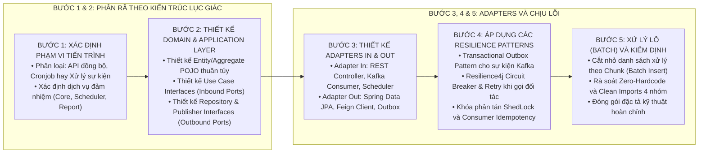

# KỸ NĂNG: ĐẶC TẢ KIẾN TRÚC BACKEND VÀ TIẾN TRÌNH HỆ THỐNG (BE-PROCESS-WRITER)

Kỹ năng này hướng dẫn quy trình chuẩn hóa để đặc tả và triển khai các thành phần xử lý Backend Java Spring Boot (Java 21 / Spring Boot 3.x), bảo đảm tính toàn vẹn giao dịch cơ sở dữ liệu, khả năng mở rộng và khả năng phục hồi lỗi phân tán.

---

## 1. QUY TRÌNH THIẾT KẾ BACKEND 5 BƯỚC



---

## 2. QUY CHUẨN CẤU TRÚC GÓI MÃ NGUỒN (HEXAGONAL ARCHITECTURE)

```text
com.mascom.system.[feature_name]/
├── domain/                  # TẦNG TRUNG TÂM (Độc lập Framework)
│   ├── model/               # Thực thể nghiệp vụ POJO
│   ├── exception/           # Ngoại lệ nghiệp vụ (Business Exceptions)
│   └── repository/          # Cổng giao tiếp xuất (Outbound Ports Interface)
├── application/             # TẦNG USE CASE (Logic điều phối)
│   ├── dto/                 # Request DTO, Response DTO
│   ├── port/in/             # Use Case Interfaces (Inbound Ports)
│   └── service/             # Cài đặt Use Case, quản lý @Transactional
└── adapter/                 # TẦNG GIAO TIẾP HẠ TẦNG
    ├── in/                  # Đầu vào
    │   ├── web/             # Spring @RestController
    │   ├── consumer/        # @KafkaListener (Idempotent)
    │   └── scheduler/       # @Scheduled (ShedLock)
    └── out/                 # Đầu ra
        ├── persistence/     # Spring Data JPA Repository & MapStruct
        ├── api/             # Feign Client tích hợp đối tác
        └── publisher/       # Outbox Table Publisher
```

---

## 3. CHECKLIST KIỂM ĐỊNH MÃ NGUỒN BACKEND

- [ ] **Phân tầng:** Tách biệt rõ ràng 3 lớp `domain`, `application`, `adapter`. Không để lộ JPA Entity ra RestController.
- [ ] **Transaction:** Quản lý `@Transactional` chính xác. Tác vụ đọc dùng `@Transactional(readOnly = true)`.
- [ ] **Xử lý bất đồng bộ:** Áp dụng Transactional Outbox Pattern khi vừa ghi CSDL vừa đẩy sự kiện Kafka.
- [ ] **Chống trùng lặp:** Mọi Kafka Consumer và Webhook Controller đều có bẫy Idempotency kiểm tra `event_id` / `request_id`.
- [ ] **Clean Code:** Không dùng Fully Qualified Names (FQN) trong thân code. Gom nhóm import chuẩn 4 nhóm.
- [ ] **Zero-Hardcode:** 100% mã trạng thái và tham số nghiệp vụ được định nghĩa bằng Domain Enums / Constants.
