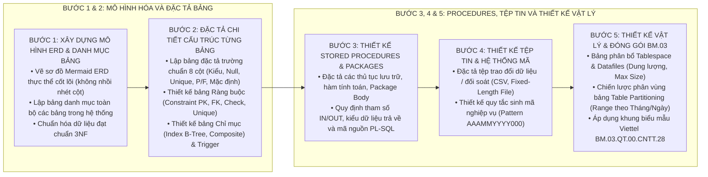

# KỸ NĂNG SOẠN THẢO TÀI LIỆU THIẾT KẾ CHI TIẾT DỮ LIỆU VIETTEL (DB-DESIGN-WRITER)

Kỹ năng này cung cấp quy trình tác nghiệp chuẩn 5 bước để phân tích mô hình quan hệ dữ liệu, đặc tả chi tiết cấu trúc bảng, thiết kế ràng buộc, chỉ mục, trigger, thủ tục lưu trữ, cấu trúc tệp tin giao tiếp và chiến lược phân vùng CSDL theo đúng tiêu chuẩn Tập đoàn Viettel (`BM.03.QT.00.CNTT.28`).

---

## 1. QUY TRÌNH 5 BƯỚC THIẾT KẾ CHI TIẾT DỮ LIỆU CHUẨN VIETTEL

---

## 2. HƯỚNG DẪN CHI TIẾT TỪNG BƯỚC THỰC HIỆN

### Bước 1: Xây dựng Mô hình ERD & Danh mục Bảng (Phần 2.1)
1. **Sơ đồ Thực thể Liên kết (ERD):**
   * Sử dụng sơ đồ Mermaid `erDiagram` tinh gọn chỉ thể hiện các thực thể chính và mối quan hệ liên kết (1-1, 1-N, N-N).
   * **Tuyệt đối không nhồi nhét tất cả các cột thuộc tính vào Mermaid ERD** để tránh làm treo trình duyệt.
2. **Lập Bảng Danh mục Bảng Dữ liệu:**
   * Liệt kê đầy đủ danh sách bảng: `STT | Tên bảng | Mô tả chức năng & Nghiệp vụ`.

### Bước 2: Đặc tả Chi tiết Cấu trúc Từng Bảng (Phần 2.2)
Đối với mỗi bảng trong hệ thống, bắt buộc phải có đầy đủ 4 tiểu mục:
1. **Bảng Đặc tả Cấu trúc Trường chuẩn 8 cột:**
   * Cột 1: `STT` (01, 02...).
   * Cột 2: `Tên trường` (Viết hoa: `ID`, `USER_CODE`, `STATUS`...).
   * Cột 3: `Kiểu dữ liệu và độ dài` (`NUMBER(19,0)`, `VARCHAR2(255)`, `TIMESTAMP`...).
   * Cột 4: `Nullable` (`Yes` hoặc `No`).
   * Cột 5: `Unique` (Đánh dấu `X` nếu là duy nhất).
   * Cột 6: `P/F Key` (`P` - Primary Key, `F` - Foreign Key, `PF` - Primary & Foreign Key).
   * Cột 7: `Mặc định` (Giá trị khởi tạo mặc định).
   * Cột 8: `Mô tả & Ràng buộc` (Ý nghĩa nghiệp vụ và logic ràng buộc).
2. **Tiểu mục 2.2.1. Ràng buộc (Constraint):** Bảng liệt kê `PK_`, `FK_`, `CHK_`, `UQ_` kèm cột áp dụng và bảng tham chiếu.
3. **Tiểu mục 2.2.2. Chỉ mục (Index):** Bảng liệt kê `IDX_` kèm kiểu index (B-Tree, Composite, Unique) và mục đích tối ưu hóa truy vấn.
4. **Tiểu mục 2.2.3. Trigger (Trigger):** Bảng liệt kê `TRG_` kèm sự kiện kích hoạt (`BEFORE/AFTER INSERT/UPDATE`) và logic xử lý nghiệp vụ.

### Bước 3: Thiết kế Stored Procedures, Functions & Packages (Phần 2.3 & 2.4)
1. **Stored Procedures & Functions:**
   * Tên thủ tục/hàm, mục đích nghiệp vụ.
   * Bảng tham số đầu vào (`IN`), tham số đầu ra (`OUT`), kiểu dữ liệu trả về (`RETURN`).
   * Đoạn mã nguồn SQL / PL-SQL mẫu hoặc pseudocode logic nghiệp vụ.
2. **Package Specification & Body:**
   * Gom nhóm các thủ tục liên quan vào cùng một Package nghiệp vụ (ví dụ: `PKG_TRANSACTION_PROCESSING`, `PKG_PARTNER_INTEGRATION`).

### Bước 4: Thiết kế Tệp tin Trao đổi & Hệ thống Mã (Phần 3 & Phần 4)
1. **Thiết kế Tệp tin (File Design):**
   * *Tệp CSV:* Đặc tả thứ tự cột, kiểu dữ liệu, ký tự phân cách (dấu phẩy `,` hoặc chấm phẩy `;`) và định dạng ngày tháng (`YYYY-MM-DD HH24:MI:SS`).
   * *Tệp Độ dài Cố định (Fixed-Length File):* Bảng đặc tả `STT | Tên trường | Định dạng | Vị trí Bắt đầu | Vị trí Kết thúc | Độ dài | Mô tả`.
2. **Thiết kế Hệ thống Mã (Code System Design):**
   * Danh mục các mã định danh: Mã giao dịch, Mã khách hàng, Mã merchant, Mã chi nhánh.
   * Quy tắc sinh mã (Pattern) chi tiết: Cấu trúc tiền tố, định dạng thời gian, số tự tăng và thuật toán kiểm tra (Check-digit).

### Bước 5: Thiết kế Vật lý & Đóng gói Hồ sơ BM.03 (Phần 5 & Phần 6)
1. **Bảng Phân bổ Tablespace & Datafiles (Mục 5.1):**
   * Phân bổ rõ `DATA_TS` (dữ liệu bảng), `INDEX_TS` (chỉ mục), `LOB_TS` (dữ liệu tệp lớn), dung lượng khởi tạo và Max Size.
2. **Chiến lược Phân vùng Bảng Lớn (Table Partitioning Strategy - Mục 5.2):**
   * Xác định các bảng lớn phát sinh trên 100.000 records/ngày.
   * Áp dụng `RANGE Partitioning` theo thời gian (`CREATE_TIME`), quy định chính sách lưu trữ trực tuyến và tự động dọn dẹp (Purge/Archive).
3. **Phụ lục Ký hiệu Khuôn dạng Dữ liệu (Phần 6):**
   * Bảng chuẩn ký hiệu (`#`, `A`, `9`, `0`, `C`, `&`, `?`, `Literal`).

---

## 3. CHECKLIST KIỂM SOÁT CHẤT LƯỢNG TÀI LIỆU CSDL (QUALITY GATE)

Trước khi nghiệm thu hoặc xuất bản tài liệu:
- [ ] Có đầy đủ 6 phần theo chuẩn Viettel `BM.03.QT.00.CNTT.28`.
- [ ] Bảng cấu hình trường có đủ 8 cột chuẩn mực.
- [ ] 100% các bảng đều có đủ tiểu mục Constraint, Index và Trigger.
- [ ] Có đầy đủ phần Thiết kế Tệp tin giao tiếp (nếu có) và Thiết kế Hệ thống Mã.
- [ ] Có Bảng phân bổ Tablespace và Chiến lược Table Partitioning cho các bảng tải lớn.
- [ ] 100% tiếng Việt chuẩn mực, không chèn tiếng Anh đệm trong ngoặc đơn.
- [ ] Không có icon/emoji trong tiêu đề đề mục.
- [ ] Ký tự Unicode thuần túy thay thế ký tự LaTeX `$`.

---

## 4. TÀI NGUYÊN BỔ TRỢ

* [Quy chuẩn soạn thảo Thiết kế Chi tiết Dữ liệu Viettel](file:///Users/micro/Source/chapisoft/mschool/.agents/rules/db_design_rules.md)
* [Biểu mẫu khung Thiết kế CSDL chuẩn Viettel BM.03](./resources/db_design_template.md)
