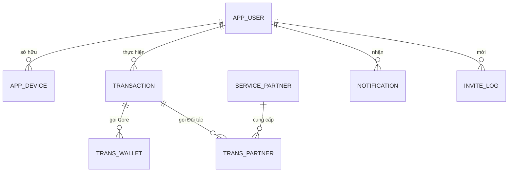

# TẬP ĐOÀN CÔNG NGHIỆP - VIỄN THÔNG QUÂN ĐỘI
## [TÊN ĐƠN VỊ THÀNH VIÊN / TRUNG TÂM PHÁT TRIỂN]

---

# [TÊN DỰ ÁN / HỆ THỐNG PHẦN MỀM]
# TÀI LIỆU THIẾT KẾ CHI TIẾT DỮ LIỆU

**Mã hiệu dự án:** [PROJECT_CODE]  
**Mã hiệu tài liệu:** BM.03_Thiết kế cơ sở dữ liệu (BM.03.QT.00.CNTT.28)  
**Địa danh & Thời gian:** Hanoi, [MM/YYYY]  

---

## BẢNG KÝ DUYỆT TÀI LIỆU

| Vai trò | Họ và tên | Chức danh / Đơn vị | Chữ ký | Ngày ký |
| :--- | :--- | :--- | :---: | :---: |
| **Người lập (The establishment)** | [Họ tên kỹ sư thiết kế] | Kỹ sư Cơ sở Dữ liệu (DBA / Data Architect) | | [DD/MM/YYYY] |
| **Người xem xét (Reviewer)** | [Họ tên chuyên gia thẩm định]| Trưởng nhóm Phát triển / Solution Architect | | [DD/MM/YYYY] |
| **Người phê duyệt (Approver)** | [Họ tên lãnh đạo phê duyệt] | Giám đốc Trung tâm / Trưởng phòng CNTT | | [DD/MM/YYYY] |

---

## BẢNG GHI NHẬN THAY ĐỔI TÀI LIỆU

*Ghi chú ký hiệu:* `A*` – Tạo mới (Add), `M` – Sửa đổi (Modify), `D` – Xóa bỏ (Delete).

| Ngày thay đổi | Vị trí thay đổi | A*, M, D | Nguồn gốc | Phiên bản cũ | Mô tả thay đổi | Phiên bản mới |
| :--- | :--- | :---: | :--- | :---: | :--- | :---: |
| [DD/MM/YYYY] | Toàn bộ tài liệu | A* | Khởi tạo ban đầu | N/A | Khởi tạo tài liệu Thiết kế Chi tiết Dữ liệu theo chuẩn BM.03 | V1.0 |

---

## PHẦN 1: GIỚI THIỆU

### 1.1. Mục tiêu Tài liệu
Tài liệu này đặc tả chi tiết toàn bộ mô hình cơ sở dữ liệu quan hệ, cấu trúc bảng, trường dữ liệu, ràng buộc toàn vẹn, chỉ mục tối ưu, thủ tục lưu trữ, cấu trúc tệp tin trao đổi dữ liệu, hệ thống mã nghiệp vụ và thiết kế vật lý cho dự án [Tên Dự án]. Tài liệu là căn cứ trực tiếp để đội ngũ phát triển khởi tạo lược đồ cơ sở dữ liệu (Database Schema), lập trình tầng truy cập dữ liệu (Data Access Layer) và làm cơ sở cho DBA quản trị, tối ưu hóa hạ tầng lưu trữ.

### 1.2. Định nghĩa Thuật ngữ và Các từ Viết tắt

| Thuật ngữ / Viết tắt | Định nghĩa / Diễn giải | Ghi chú |
| :--- | :--- | :--- |
| **DBDD** | Tài liệu Thiết kế Chi tiết Dữ liệu (Database Design Document). | Chuẩn Viettel BM.03 |
| **PK / FK** | Khóa chính (Primary Key) / Khóa ngoại (Foreign Key). | Ràng buộc quan hệ |
| **Index (IDX)** | Chỉ mục cơ sở dữ liệu phục vụ tăng tốc độ truy vấn. | B-Tree / Composite |
| **Trigger (TRG)** | Đoạn mã tự động thực thi khi xảy ra sự kiện trên bảng. | Before / After |
| **Tablespace** | Không gian lưu trữ logic của cơ sở dữ liệu trên đĩa cứng. | Datafile mapping |
| **Partitioning** | Kỹ thuật phân vùng bảng dữ liệu lớn theo khoảng giá trị. | Range / List / Hash |

### 1.3. Tài liệu Tham khảo
1. Tài liệu Thiết kế Tổng thể Hệ thống (HLD) phiên bản V1.0 (`BM.02.QT.00.CNTT.28`).
2. Tài liệu Đặc tả Yêu cầu Phần mềm (SRS) phiên bản V1.0.
3. Quy định Tiêu chuẩn Thiết kế Cơ sở Dữ liệu Tập đoàn Viettel.

### 1.4. Mô tả Chung
Tài liệu được bố cục thành 6 phần chính:
* **Phần 1 - Giới thiệu:** Trình bày mục tiêu, thuật ngữ và tài liệu tham khảo.
* **Phần 2 – Cơ sở dữ liệu:** Mô tả sơ đồ ERD, danh mục bảng, chi tiết cấu trúc từng bảng (8 cột), Constraint, Index, Trigger, Stored Procedure và Package.
* **Phần 3 – Thiết kế tệp tin:** Đặc tả cấu trúc các tệp tin trao đổi dữ liệu và đối soát (CSV / Fixed-Length).
* **Phần 4 – Thiết kế mã:** Đặc tả cấu trúc và thuật toán sinh mã nghiệp vụ.
* **Phần 5 – Thiết kế vật lý:** Đặc tả Tablespaces, Datafiles và chiến lược phân vùng bảng lớn (Partitioning).
* **Phần 6 – Phụ lục:** Bảng quy chuẩn khuôn dạng ký hiệu dữ liệu.

---

## PHẦN 2: CƠ SỞ DỮ LIỆU

### 2.1. Các Mô hình Quan hệ Dữ liệu

#### Sơ đồ Thực thể Liên kết Tổng thể (ERD Mức cao):



#### Bảng Danh mục Các Bảng Dữ liệu trong Hệ thống:

| STT | Tên bảng | Mô tả chức năng & Nghiệp vụ |
| :---: | :--- | :--- |
| 1 | `APP_USER` | Quản lý thông tin tài khoản người dùng ứng dụng di động |
| 2 | `APP_DEVICE` | Quản lý danh sách thiết bị đăng nhập và Device Token |
| 3 | `TRANSACTION` | Quản lý lịch sử và trạng thái các giao dịch tài chính |
| 4 | `TRANS_WALLET` | Chi tiết bản tin socket giao tiếp với hệ thống Core Ví |
| 5 | `TRANS_PARTNER` | Chi tiết bản tin gọi sang cổng API của đối tác bên ngoài |
| 6 | `SERVICE_PARTNER` | Quản lý thông tin cấu hình đối tác và dịch vụ liên kết |
| 7 | `NOTIFICATION` | Quản lý thông báo gửi đến người dùng ứng dụng |
| 8 | `API_LOG` | Ghi nhận nhật ký request/response của các lời gọi API |
| 9 | `MESSAGE_LOG` | Ghi nhận nhật ký tin nhắn SMS gửi qua SMS Gateway |

---

### 2.2. Chi Tiết Từng Bảng

#### 2.2.1. Bảng `APP_USER`
Bảng lưu trữ thông tin tài khoản và trạng thái người dùng ứng dụng.

##### Bảng Đặc tả Cấu trúc Trường:

| STT | Tên trường | Kiểu dữ liệu và độ dài | Nullable | Unique | P/F Key | Mặc định | Mô tả & Ràng buộc |
| :---: | :--- | :--- | :---: | :---: | :---: | :--- | :--- |
| 01 | `ID` | `NUMBER(19,0)` | No | X | P | Auto-increment | Khóa chính duy nhất của bản ghi |
| 02 | `USER_CODE` | `VARCHAR2(50)` | No | X | | | Mã định danh người dùng (theo quy tắc thiết kế mã) |
| 03 | `PHONE_NUMBER` | `VARCHAR2(20)` | No | X | | | Số điện thoại tài khoản (định dạng MSISDN quốc tế) |
| 04 | `FULL_NAME` | `VARCHAR2(255)` | Yes | | | | Họ và tên đầy đủ của người dùng |
| 05 | `STATUS` | `NUMBER(2,0)` | No | | | `1` | Trạng thái: 1-Hoạt động, 0-Khóa, 2-Chờ kích hoạt |
| 06 | `KYC_STATUS` | `NUMBER(2,0)` | No | | | `0` | Trạng thái eKYC: 0-Chưa KYC, 1-Chờ duyệt, 2-Đã duyệt |
| 07 | `PASSWORD_HASH`| `VARCHAR2(255)` | No | | | | Mật khẩu đăng nhập (Băm BCrypt kèm muối bảo mật) |
| 08 | `CREATE_TIME` | `TIMESTAMP` | No | | | `SYSTIMESTAMP` | Thời điểm khởi tạo tài khoản |
| 09 | `UPDATE_TIME` | `TIMESTAMP` | Yes | | | | Thời điểm cập nhật thông tin gần nhất |

##### Ràng buộc (Constraint):

| STT | Tên Constraint | Kiểu ràng buộc | Cột áp dụng | Bảng tham chiếu | Mô tả điều kiện |
| :---: | :--- | :--- | :--- | :--- | :--- |
| 1 | `PK_APP_USER` | Primary Key | `ID` | N/A | Khóa chính xác định bản ghi người dùng |
| 2 | `UQ_APP_USER_PHONE` | Unique Key | `PHONE_NUMBER` | N/A | Đảm bảo mỗi số điện thoại chỉ đăng ký 1 tài khoản |
| 3 | `UQ_APP_USER_CODE` | Unique Key | `USER_CODE` | N/A | Mã người dùng là duy nhất trên toàn hệ thống |
| 4 | `CHK_APP_USER_STATUS`| Check Constraint | `STATUS` | N/A | `STATUS IN (0, 1, 2, 3)` |

##### Chỉ mục (Index):

| STT | Tên Index | Kiểu Index | Bảng áp dụng | Danh sách cột lập chỉ mục | Mục đích & Ý nghĩa tối ưu |
| :---: | :--- | :--- | :--- | :--- | :--- |
| 1 | `IDX_APP_USER_PHONE` | B-Tree Index | `APP_USER` | `PHONE_NUMBER` | Tối ưu hóa truy vấn tìm kiếm người dùng khi đăng nhập |
| 2 | `IDX_APP_USER_STATUS`| B-Tree Index | `APP_USER` | `STATUS, CREATE_TIME DESC` | Tối ưu hóa truy vấn lọc danh sách người dùng trên CMS |

##### Trigger:

| STT | Tên Trigger | Sự kiện kích hoạt | Bảng áp dụng | Ý nghĩa & Logic xử lý |
| :---: | :--- | :--- | :--- | :--- |
| 1 | `TRG_APP_USER_AUDIT` | `BEFORE UPDATE` | `APP_USER` | Tự động gán `:NEW.UPDATE_TIME = SYSTIMESTAMP` trước khi cập nhật |

---

#### 2.2.2. Bảng `TRANSACTION`
Bảng lưu trữ thông tin chi tiết mọi giao dịch tài chính phát sinh trên hệ thống.

##### Bảng Đặc tả Cấu trúc Trường:

| STT | Tên trường | Kiểu dữ liệu và độ dài | Nullable | Unique | P/F Key | Mặc định | Mô tả & Ràng buộc |
| :---: | :--- | :--- | :---: | :---: | :---: | :--- | :--- |
| 01 | `ID` | `NUMBER(19,0)` | No | X | P | Auto-increment | Khóa chính duy nhất của giao dịch |
| 02 | `TRANS_CODE` | `VARCHAR2(64)` | No | X | | | Mã giao dịch duy nhất hệ thống (Idempotency Key) |
| 03 | `USER_ID` | `NUMBER(19,0)` | No | | F | | ID người dùng thực hiện giao dịch (`APP_USER.ID`) |
| 04 | `SERVICE_CODE`| `VARCHAR2(50)` | No | | | | Mã dịch vụ: TRANSFER, TOPUP, BILL_PAY, WITHDRAW |
| 05 | `AMOUNT` | `NUMBER(18,2)` | No | | | `0` | Số tiền giao dịch phát sinh (giá trị dương) |
| 06 | `FEE` | `NUMBER(18,2)` | No | | | `0` | Phí giao dịch thu từ người dùng |
| 07 | `STATUS` | `NUMBER(2,0)` | No | | | `0` | Trạng thái: 0-Đang xử lý, 1-Thành công, 2-Thất bại |
| 08 | `PARTNER_CODE`| `VARCHAR2(50)` | Yes | | | | Mã đối tác cung cấp dịch vụ liên kết |
| 09 | `RESPONSE_CODE`| `VARCHAR2(50)`| Yes | | | | Mã phản hồi kết quả từ Core Ví / Cổng thanh toán |
| 10 | `CREATE_TIME` | `TIMESTAMP` | No | | | `SYSTIMESTAMP` | Thời điểm khởi tạo giao dịch (Cột Partition) |
| 11 | `UPDATE_TIME` | `TIMESTAMP` | Yes | | | | Thời điểm cập nhật trạng thái cuối cùng |

##### Ràng buộc (Constraint):

| STT | Tên Constraint | Kiểu ràng buộc | Cột áp dụng | Bảng tham chiếu | Mô tả điều kiện |
| :---: | :--- | :--- | :--- | :--- | :--- |
| 1 | `PK_TRANSACTION` | Primary Key | `ID, CREATE_TIME` | N/A | Khóa chính phức hợp phục vụ Partition |
| 2 | `UQ_TRANS_CODE` | Unique Key | `TRANS_CODE, CREATE_TIME` | N/A | Đảm bảo mã giao dịch là duy nhất |
| 3 | `FK_TRANS_USER` | Foreign Key | `USER_ID` | `APP_USER(ID)` | Ràng buộc người dùng thực hiện |
| 4 | `CHK_TRANS_AMOUNT` | Check Constraint | `AMOUNT` | N/A | `AMOUNT > 0` |

##### Chỉ mục (Index):

| STT | Tên Index | Kiểu Index | Bảng áp dụng | Danh sách cột lập chỉ mục | Mục đích & Ý nghĩa tối ưu |
| :---: | :--- | :--- | :--- | :--- | :--- |
| 1 | `IDX_TRANS_USER_TIME`| Local Composite | `TRANSACTION` | `USER_ID, CREATE_TIME DESC`| Tối ưu truy vấn lịch sử giao dịch người dùng |
| 2 | `IDX_TRANS_CODE` | Local Unique | `TRANSACTION` | `TRANS_CODE` | Tối ưu tra cứu giao dịch và chống xử lý trùng (Idempotency) |

##### Trigger:

| STT | Tên Trigger | Sự kiện kích hoạt | Bảng áp dụng | Ý nghĩa & Logic xử lý |
| :---: | :--- | :--- | :--- | :--- |
| 1 | `TRG_TRANS_AUDIT` | `BEFORE UPDATE` | `TRANSACTION` | Tự động gán `:NEW.UPDATE_TIME = SYSTIMESTAMP` trước khi cập nhật |

---

### 2.3. Thủ Tục Lưu Trữ & Hàm (Stored Procedures / Functions)

#### 2.3.1. Thủ tục `PRC_FIND_AGENT_BY_DISTANCE`
* **Mục đích:** Tìm kiếm danh sách đại lý gần nhất theo tọa độ địa lý (kinh độ, vĩ độ) và bán kính tìm kiếm.
* **Tham số đầu vào / đầu ra:**

| Tên tham số | Hướng | Kiểu dữ liệu | Mô tả |
| :--- | :---: | :--- | :--- |
| `P_LAT` | IN | `NUMBER` | Vĩ độ của vị trí người dùng |
| `P_LON` | IN | `NUMBER` | Kinh độ của vị trí người dùng |
| `P_DISTANCE` | IN | `NUMBER` | Bán kính tìm kiếm (đơn vị: mét) |
| `P_RESULT_CURSOR`| OUT | `SYS_REFCURSOR` | Con trỏ trả về danh sách các điểm đại lý thỏa mãn |

* **Mã nguồn định nghĩa:**
```sql
CREATE OR REPLACE PROCEDURE PRC_FIND_AGENT_BY_DISTANCE (
    P_LAT           IN  NUMBER,
    P_LON           IN  NUMBER,
    P_DISTANCE      IN  NUMBER,
    P_RESULT_CURSOR OUT SYS_REFCURSOR
) AS
BEGIN
    OPEN P_RESULT_CURSOR FOR
        SELECT 
            AL.ID, AL.AGENT_NAME, AL.ADDRESS, AL.LATITUDE, AL.LONGITUDE,
            FN_CALCULATE_DISTANCE(P_LAT, P_LON, AL.LATITUDE, AL.LONGITUDE) AS DISTANCE_METERS
        FROM AGENT_LOCATION AL
        WHERE AL.STATUS = 1
          AND FN_CALCULATE_DISTANCE(P_LAT, P_LON, AL.LATITUDE, AL.LONGITUDE) <= P_DISTANCE
        ORDER BY DISTANCE_METERS ASC;
END PRC_FIND_AGENT_BY_DISTANCE;
/
```

#### 2.3.2. Hàm `FN_CALCULATE_DISTANCE`
* **Mục đích:** Tính khoảng cách theo đường chim bay giữa hai cặp tọa độ địa lý (Haversine Formula).
* **Tham số:** `LAT1 (NUMBER)`, `LON1 (NUMBER)`, `LAT2 (NUMBER)`, `LON2 (NUMBER)`. Trả về: `NUMBER` (mét).

---

### 2.4. Gói Lưu Trữ (Package Specification & Body)

#### Gói `PKG_TRANSACTION_ENGINE`:
* **Mô tả:** Đóng gói toàn bộ logic xử lý giao dịch tài chính, khóa bản ghi số dư, kiểm tra hạn mức và ghi nhận nhật ký kế toán trong một giao dịch cơ sở dữ liệu nguyên tử (ACID Transaction).

---

## PHẦN 3: THIẾT KẾ TỆP TIN (FILE INTERFACE DESIGN)

### 3.1. Danh Mục Các Tệp Tin Giao Tiếp & Đối Soát

| STT | Tên tệp tin | Kiểu tệp | Mục đích & Chiều trao đổi |
| :---: | :--- | :---: | :--- |
| 1 | `RECON_DAILY_YYYYMMDD.csv` | CSV | Tệp đối soát giao dịch hàng ngày giữa Hệ thống và Core Ví (Xuất cuối ngày) |
| 2 | `MERCHANT_SETTLE_YYYYMMDD.dat` | Fixed-Length | Tệp quyết toán doanh thu đại lý/merchant với Ngân hàng liên kết |

### 3.2. Cấu Trúc Chi Tiết Từng Tệp Tin

#### 3.2.1. Cấu trúc Tệp Đối Soát Hàng Ngày (`RECON_DAILY_YYYYMMDD.csv`)
* **Định dạng:** CSV, phân cách bằng dấu phẩy `,`, mã hóa UTF-8, có dòng Header.

| STT | Tên trường | Định dạng dữ liệu | Mô tả |
| :---: | :--- | :--- | :--- |
| 1 | `TRANS_ID` | `VARCHAR(64)` | Mã giao dịch hệ thống |
| 2 | `USER_PHONE` | `VARCHAR(20)` | Số điện thoại tài khoản |
| 3 | `AMOUNT` | `NUMBER(18,2)` | Số tiền giao dịch |
| 4 | `TRANS_TIME` | `YYYY-MM-DD HH24:MI:SS` | Thời gian ghi nhận giao dịch |
| 5 | `STATUS` | `NUMBER(1)` | Trạng thái: 1-Thành công, 2-Thất bại |

#### 3.2.2. Cấu trúc Tệp Độ Dài Cố Định (`MERCHANT_SETTLE_YYYYMMDD.dat`)

| STT | Tên trường | Format | Bắt đầu | Kết thúc | Độ dài | Mô tả |
| :---: | :--- | :---: | :---: | :---: | :---: | :--- |
| 1 | `RECORD_TYPE` | `A` | 1 | 2 | 2 | Kiểu bản ghi: `01`-Header, `02`-Detail, `09`-Trailer |
| 2 | `MERCHANT_CODE`| `A` | 3 | 22 | 20 | Mã định danh điểm kinh doanh (Căn trái, đệm trắng) |
| 3 | `TOTAL_AMOUNT` | `9` | 23 | 38 | 16 | Tổng tiền thanh toán (Đơn vị: VNĐ, đệm số 0 bên trái) |
| 4 | `SETTLE_DATE` | `YYYYMMDD` | 39 | 46 | 8 | Ngày quyết toán doanh thu |

---

## PHẦN 4: THIẾT KẾ HỆ THỐNG MÃ (CODE SYSTEM DESIGN)

### 4.1. Danh Mục Các Bộ Mã Định Danh

| STT | Bộ mã định danh | Ý nghĩa nghiệp vụ |
| :---: | :--- | :--- |
| 1 | **Mã Khách Hàng (Customer Code)** | Định danh duy nhất cho từng khách hàng đăng ký trên hệ thống |
| 2 | **Mã Giao Dịch (Transaction Code)** | Định danh duy nhất cho từng phiên giao dịch thanh toán |
| 3 | **Mã Điểm Giao Dịch (Agent Code)** | Định danh cho từng cửa hàng đại lý / merchant |

### 4.2. Cấu Trúc Chi Tiết & Quy Tắc Sinh Mã

#### Quy tắc Sinh Mã Khách Hàng (`CUSTOMER_CODE`):
* **Cấu trúc mẫu:** `[PROVINCE_3][REGISTER_MONTH_2][REGISTER_YEAR_4][SEQ_6]`
* **Quy cách thành phần:**
  * `PROVINCE_3`: 3 ký tự viết hoa mã tỉnh/thành phố đăng ký (ví dụ: `HAN`-Hà Nội, `HCM`-TP. Hồ Chí Minh, `DAN`-Đà Nẵng).
  * `REGISTER_MONTH_2`: 2 chữ số thể hiện tháng đăng ký (từ `01` đến `12`).
  * `REGISTER_YEAR_4`: 4 chữ số thể hiện năm đăng ký (ví dụ: `2026`).
  * `SEQ_6`: 6 chữ số tự tăng bắt đầu từ `000001` được quản lý bởi Sequence CSDL riêng theo từng tỉnh thành.
* **Ví dụ:** Khách hàng đăng ký tại Hà Nội vào tháng 08/2026 có mã: `HAN082026000001`.

---

## PHẦN 5: THIẾT KẾ VẬT LÝ (PHYSICAL DATABASE DESIGN)

### 5.1. Bảng Phân Bổ Tablespace & Datafiles

| STT | Tablespace | Data file path | Dung lượng ban đầu | Tự mở rộng | Max Size | Mô tả mục đích sử dụng |
| :---: | :--- | :--- | :---: | :---: | :---: | :--- |
| 1 | `APP_DATA_TS` | `/u01/app/oracle/oradata/PROD/app_data01.dbf` | 20 GB | YES | 64 GB | Lưu trữ dữ liệu các bảng ứng dụng chính |
| 2 | `APP_IDX_TS` | `/u01/app/oracle/oradata/PROD/app_idx01.dbf` | 10 GB | YES | 64 GB | Lưu trữ toàn bộ chỉ mục (Indexes) của hệ thống |
| 3 | `LOG_DATA_TS` | `/u01/app/oracle/oradata/PROD/log_data01.dbf` | 50 GB | YES | 128 GB | Lưu trữ các bảng nhật ký `API_LOG`, `MESSAGE_LOG` |

### 5.2. Phân Vùng Dữ Liệu Lớn (Table Partitioning Strategy)

| STT | Tên bảng | Tablespace | Kiểu phân vùng | Cột điều kiện Partition | Chính sách lưu trữ & Dọn dẹp |
| :---: | :--- | :--- | :--- | :--- | :--- |
| 1 | `TRANSACTION` | `APP_DATA_TS` | `RANGE` theo Tháng | `CREATE_TIME` | Phân vùng theo tháng (`PART_TRANS_YYYYMM`). Dữ liệu trực tuyến 2 năm, sau đó chuyển sang Archive Tablespace |
| 2 | `API_LOG` | `LOG_DATA_TS` | `RANGE` theo Ngày | `CREATE_TIME` | Phân vùng theo ngày (`PART_APILOG_YYYYMMDD`). Lưu trữ trực tuyến 90 ngày, sau đó tự động Purge dọn dẹp |
| 3 | `MESSAGE_LOG` | `LOG_DATA_TS` | `RANGE` theo Tháng | `CREATE_TIME` | Phân vùng theo tháng. Lưu trữ trực tuyến 180 ngày phục vụ tra cứu khiếu nại |

---

## PHẦN 6: PHỤ LỤC

### 6.1. Biểu Tượng Khuôn Dạng Dữ Liệu Chuẩn

| Ký hiệu | Ý nghĩa quy ước |
| :---: | :--- |
| `#` | Chữ số bất kỳ. |
| `.` | Ký tự phân cách phần thập phân. |
| `,` | Ký tự phân cách hàng nghìn. |
| `:` | Ký tự phân cách thời gian (Giờ:Phút:Giây). |
| `/` hoặc `-` | Ký tự phân cách ngày tháng năm. |
| `A` | Chữ cái bắt buộc phải có (`a - z`, `A - Z`). |
| `a` | Chữ cái tùy chọn (có thể có hoặc không). |
| `9` | Chữ số bắt buộc phải nhập (`0 - 9`). |
| `0` | Chữ số tùy chọn (`0 - 9`). |
| `C` | Ký tự hoặc dấu trống tùy chọn (mã ANSI từ 32-126). |
| `&` | Ký tự bắt buộc phải có. |
| `Literal`| Tất cả các ký tự khác được hiển thị chính xác theo ký tự thực tế. |
