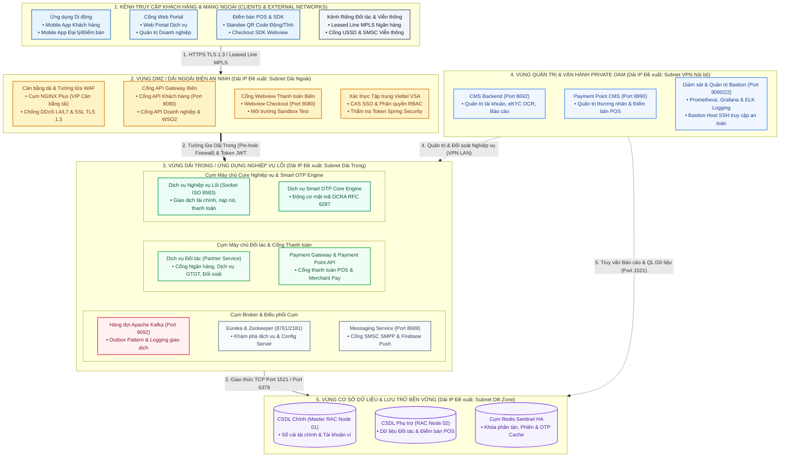
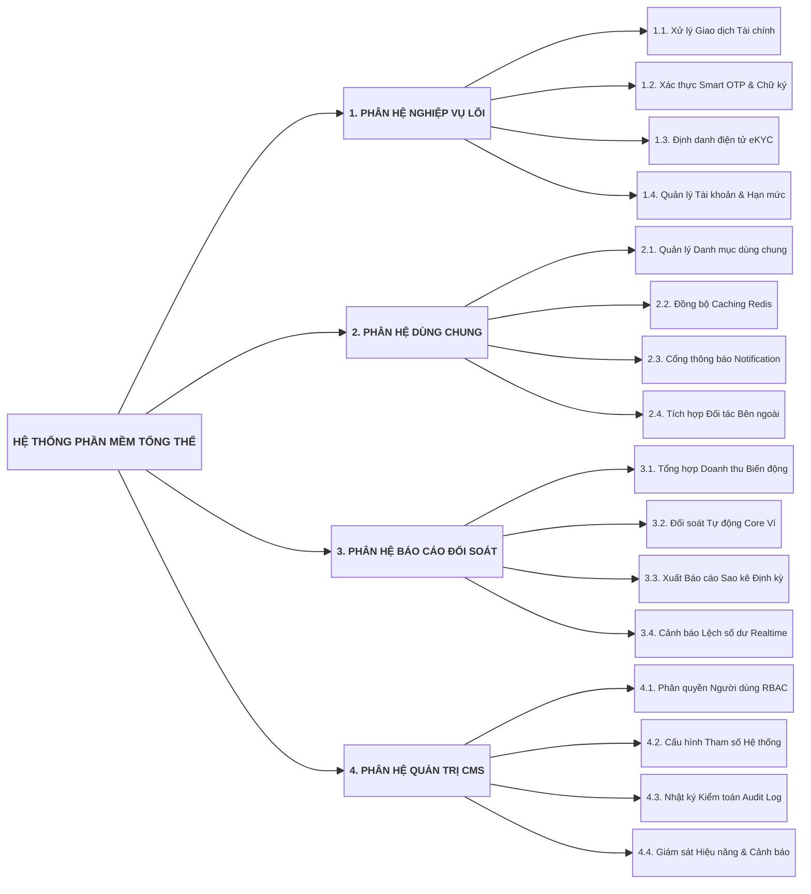
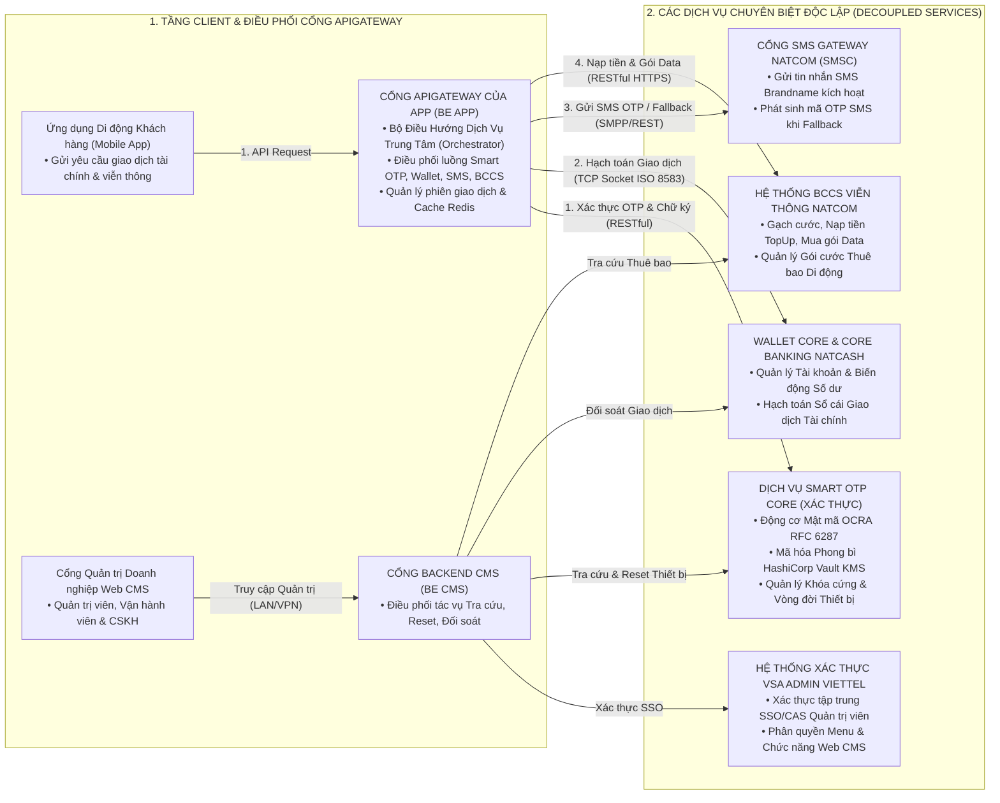
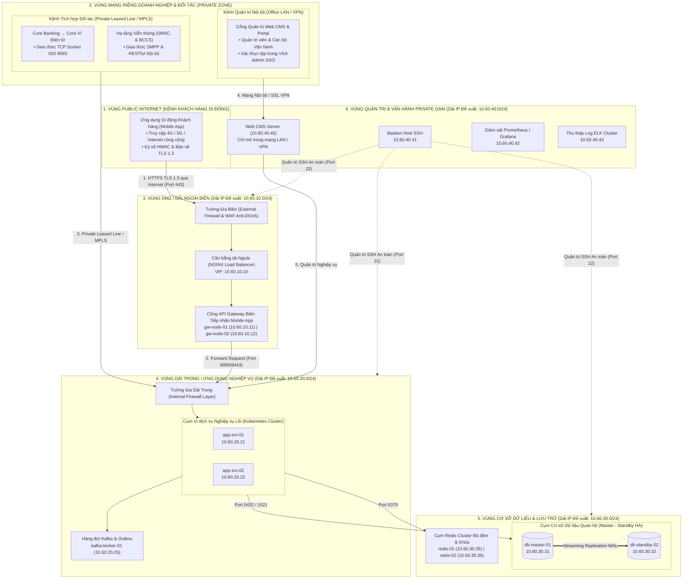
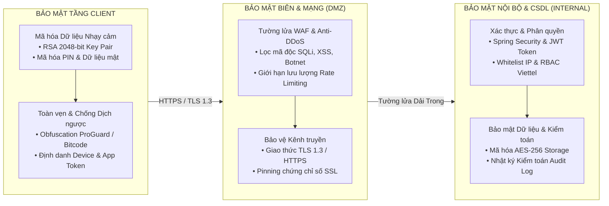
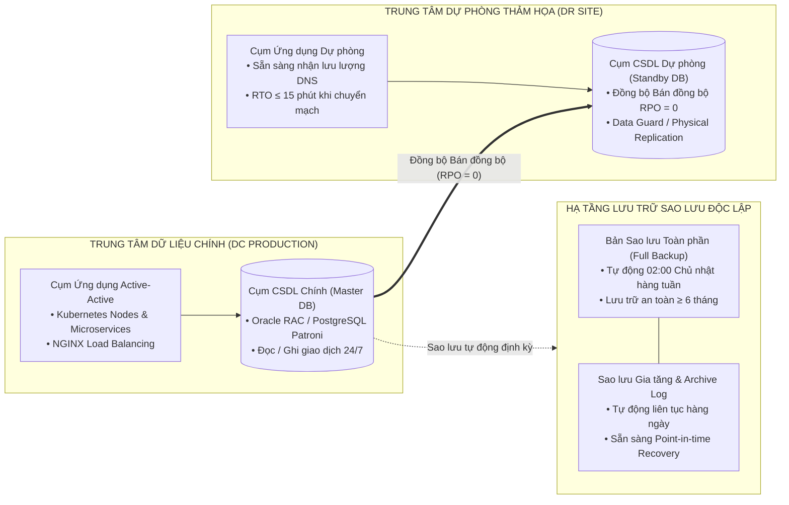

# TẬP ĐOÀN CÔNG NGHIỆP - VIỄN THÔNG QUÂN ĐỘI
## [TÊN ĐƠN VỊ THÀNH VIÊN / TRUNG TÂM PHÁT TRIỂN]

---

# [TÊN DỰ ÁN / HỆ THỐNG PHẦN MỀM]
# TÀI LIỆU THIẾT KẾ TỔNG THỂ

**Mã hiệu dự án:** [PROJECT_CODE]  
**Mã hiệu tài liệu:** BM.02_Thiết kế tổng thể (BM.02.QT.00.CNTT.28)  
**Địa danh & Thời gian:** Hanoi, [MM/YYYY]  

---

## BẢNG KÝ DUYỆT TÀI LIỆU

| Vai trò | Họ và tên | Chức danh / Đơn vị | Chữ ký | Ngày ký |
| :--- | :--- | :--- | :---: | :---: |
| **Người lập (The establishment)** | [Họ tên kỹ sư thiết kế] | Kỹ sư Kiến trúc Phần mềm | | [DD/MM/YYYY] |
| **Người thẩm tra (Auditor)** | [Họ tên chuyên gia thẩm định]| Trưởng phòng Kiến trúc Giải pháp | | [DD/MM/YYYY] |
| **Người phê duyệt (Approver)** | [Họ tên lãnh đạo phê duyệt] | Giám đốc Trung tâm / Khối CNTT | | [DD/MM/YYYY] |

---

## BẢNG GHI NHẬN THAY ĐỔI TÀI LIỆU

*Ghi chú ký hiệu:* `A*` – Tạo mới (Add), `M` – Sửa đổi (Modify), `D` – Xóa bỏ (Delete).

| Ngày thay đổi | Vị trí thay đổi | A*, M, D | Nguồn gốc | Phiên bản cũ | Mô tả thay đổi | Phiên bản mới |
| :--- | :--- | :---: | :--- | :---: | :--- | :---: |
| [DD/MM/YYYY] | Toàn bộ tài liệu | A* | Khởi tạo ban đầu | N/A | Khởi tạo tài liệu Thiết kế Tổng thể theo chuẩn BM.02 | V1.0 |

---

## PHẦN I: GIỚI THIỆU

### 1.1. Mục đích
Tài liệu này cung cấp một bức tranh toàn cảnh về kiến trúc hệ thống thông qua các mô hình kiến trúc đa tầng nhằm miêu tả hệ thống dưới nhiều góc nhìn khác nhau (Nghiệp vụ, Phân lớp Ứng dụng, Tích hợp, Định cỡ Hạ tầng và An toàn Thông tin). Tài liệu là căn cứ để thống nhất phạm vi phát triển, nghiệm thu kỹ thuật và làm đầu vào trực tiếp cho Tài liệu Thiết kế Chi tiết (TKCT / LLD) và Thiết kế Cơ sở Dữ liệu.

### 1.2. Phạm vi
Tài liệu áp dụng cho toàn bộ các phân hệ phần mềm của dự án [Tên Dự án], bao gồm ứng dụng di động đa nền tảng (Cross-platform App), Cổng thông tin & Hệ thống Quản trị Web CMS, Cổng API Gateway, các dịch vụ xử lý nghiệp vụ Backend, hàng đợi sự kiện bất đồng bộ và cơ sở dữ liệu.

### 1.3. Khái niệm, Thuật ngữ và Từ viết tắt

| Thuật ngữ / Viết tắt | Diễn giải ý nghĩa |
| :--- | :--- |
| **HLD** | Tài liệu Thiết kế Tổng thể (High-Level Design). |
| **ATTT** | An toàn Thông tin theo quy định của Tập đoàn Viettel. |
| **DDD** | Thiết kế Hướng miền nghiệp vụ (Domain-Driven Design). |
| **VSA** | Hệ thống Quản lý Phân quyền và Xác thực tập trung của Viettel (Viettel System Authentication). |
| **BCCS** | Hệ thống Tính cước và Chăm sóc Khách hàng Viễn thông của Viettel (Business & Customer Care System). |
| **TPS** | Số lượng giao dịch xử lý trên một giây (Transactions Per Second). |
| **HA / LB** | Tính sẵn sàng cao (High Availability) / Cân bằng tải (Load Balancing). |

### 1.4. Tài liệu Tham khảo
1. Tài liệu Đặc tả Yêu cầu Người dùng (URD / SRS) phiên bản V1.0.
2. Quy định An toàn Thông tin trong phát triển phần mềm Tập đoàn Viettel.
3. Quy trình phát triển phần mềm CNTT Viettel `BM.02.QT.00.CNTT.28`.

### 1.5. Mô tả Bố cục Tài liệu
* **Phần I - Giới thiệu:** Trình bày mục đích, phạm vi và bố cục chung của tài liệu.
* **Phần II – Các yêu cầu ảnh hưởng đến kiến trúc:** Mô tả các yêu cầu phi chức năng, thông số định cỡ tải và ràng buộc kỹ thuật.
* **Phần III – Kiến trúc ứng dụng:** Mô tả mô hình phân lớp, phân rã chức năng, giao tiếp tích hợp và bảng cấu hình phần cứng máy chủ.
* **Phần IV – Các giải pháp kiến trúc khác:** Mô tả kiến trúc an toàn thông tin ATTT, chính sách sao lưu phục hồi dữ liệu và giải pháp chịu tải cao.

---

## PHẦN II: CÁC YÊU CẦU ẢNH HƯỞNG ĐẾN KIẾN TRÚC

### 2.1. Yêu cầu Phi chức năng & Năng lực Xử lý
Hệ thống phải đáp ứng các chỉ số kỹ thuật định lượng nghiêm ngặt:
* **Khối lượng người dùng:** Phục vụ tối thiểu 2.000.000 người dùng hoạt động (Active users) hàng tháng.
* **Dung lượng giao dịch:** Năng lực tiếp nhận và xử lý tối thiểu 1.000.000 giao dịch/ngày.
* **Tải đồng thời:** Chịu tải đồng thời tối thiểu 10.000 kết nối đồng thời (Concurrent users) trong khung giờ cao điểm.
* **Thông lượng xử lý:** Đạt thông lượng trung bình 20 TPS và đỉnh tải 50 TPS.
* **Thời gian phản hồi:** Thời gian phản hồi API tại ngưỡng P95 < 200ms đối với các giao dịch thông thường và < 500ms đối với giao dịch tài chính liên kết cổng thanh toán ngoài.
* **Tính sẵn sàng:** Đảm bảo độ sẵn sàng dịch vụ tối thiểu `99.9%` (thời gian ngừng hoạt động không vượt quá 8.76 giờ/năm).

### 2.2. Các Ràng buộc về Công nghệ và Môi trường
* Triển khai tối thiểu 2 nodes cho mọi dịch vụ cốt lõi, bảo đảm tính sẵn sàng cao (HA), phân tải (Load Balancing) và tự động chuyển đổi khi có lỗi (Failover).
* Tuân thủ quy hoạch phân vùng an ninh mạng của Viettel: Phân tách rạch ròi giữa Dải Ngoài (Vùng DMZ tiếp nhận Internet) và Dải Trong (Internal Zone chứa Backend và Database).
* Mã hóa dữ liệu nhạy cảm bằng thuật toán bất đối xứng RSA cặp khóa 2048-bit trên toàn bộ luồng truyền thông mạng.

---

## PHẦN III: KIẾN TRÚC ỨNG DỤNG

### 3.1. Mô hình Kiến trúc Phân lớp và Phân vùng Hệ thống (Enterprise Multi-Zone Architecture)

Kiến trúc Hệ thống [Tên Dự án] được thiết kế theo mô hình Microservices phân lớp kết hợp quy hoạch phân vùng an ninh mạng đa tầng nghiêm ngặt của Tập đoàn Viettel. Toàn bộ các vi dịch vụ, cổng kết nối và cơ sở dữ liệu được phân tách độc lập theo từng phân vùng an ninh vật lý/logic và triển khai trên các cụm máy chủ chuyên dụng nhằm triệt tiêu điểm lỗi đơn lẻ (No Single Point of Failure) và ngăn chặn xâm nhập chéo:

#### Bảng Đặc tả Chi tiết Phân vùng Mạng, Cụm Máy chủ và Phân hệ Dịch vụ

| Phân vùng an ninh | Tên máy chủ (Hostname) | Cụm dịch vụ / Phân hệ cài đặt | Cổng dịch vụ & Giao thức | Chức năng cốt lõi & Cơ chế an ninh |
| :--- | :--- | :--- | :--- | :--- |
| **1. Kênh Truy cập & Mạng ngoài** | Thiết bị Client / Kênh Đối tác | • Ứng dụng Di động Khách hàng & Đại lý • Điểm bán POS (QR Code, Webview SDK) • Kênh Riêng Ngân hàng & Viễn thông | HTTPS / TLS 1.3 (Port 443), Leased Line MPLS, USSD MAP | Kênh tương tác người dùng và đối tác, mã hóa bất đối xứng RSA 2048-bit và chữ ký số HMAC. |
| **2. Vùng DMZ Dải Ngoài** | `dmz-gw-01` `dmz-gw-02` `dmz-pgw-fe-01` | • Cụm NGINX Plus Load Balancer (VIP Dải Ngoài) • Cổng API Gateway Khách hàng & WSO2 API • Cổng Webview Thanh toán Biên • Xác thực Tập trung Viettel VSA CAS SSO | Port 80, 443, 8080, 8243, 9443 (HTTPS RESTful) | Tiếp nhận lưu lượng Internet, bóc tách SSL Offloading, lọc DDoS L4/L7, kiểm soát Rate Limit và xác thực Token JWT. |
| **3. Vùng Dải Trong Nghiệp vụ** | `core-app-srv-01` `core-app-srv-02` | • Cụm Core App (Socket TCP ISO 8583) • Động cơ Mật mã Smart OTP Core Engine | Port 8080, 8443, 9000 (TCP Socket ISO 8583 / OCRA RFC 6287) | Xử lý các giao dịch tài chính lõi và sinh mã xác thực OTP theo cặp khóa bất đối xứng. |
| | `partner-srv-01` | • Cụm Dịch vụ Đối tác Partner Service | Port 8888 (RESTful API / SOAP XML) | Chuyển mạch thanh toán liên ngân hàng, kết nối dịch vụ GTGT và thực thi đối soát tự động. |
| | `payment-srv-01` | • Payment Gateway BE & Payment Point API | Port 8691, 8081 (JSON RESTful) | Cổng xử lý thanh toán cho thương nhân, tiếp nhận thanh toán mã QR tại điểm bán POS. |
| | `msg-broker-01` | • Cụm Hàng đợi Sự kiện Apache Kafka • Eureka Registry & Zookeeper Cluster • Dịch vụ Tin nhắn Viễn thông Messaging | Port 9092, 2181, 8761, 8689 (Kafka Protocol, SMPP) | Xử lý giao dịch bất đồng bộ theo Outbox Pattern, quản lý địa chỉ node động và gửi SMSC/Push. |
| **4. Vùng Quản trị Private OAM** | `oam-mgmt-01` | • CMS Backend Quản trị Hệ thống • Payment Point CMS Điểm bán POS • Giám sát APM Prometheus / Grafana & Bastion Host | Port 8692, 8990, 9090, 22 (Chỉ mở nội bộ VPN / LAN) | Phân vùng cô lập cho quản trị viên: Quản trị tài khoản, eKYC OCR, cấu hình hạn mức và giám sát 24/7. |
| **5. Vùng CSDL & Lưu trữ** | `db-rac-01` `db-rac-02` `redis-sentinel-01/02` | • CSDL Quan hệ Cụm RAC Master Node 01 & 02 • Cụm Redis Sentinel HA (Node 01 & 02) | Port 1521 / 5432, Port 6379, 26379 (Redis Protocol) | Lưu trữ bền vững dữ liệu tài chính, tài khoản ví, thương nhân POS, bộ nhớ đệm phân tán và khóa chống tranh chấp số dư. |

### 3.2. Mô hình Phân rã Chức năng / Phân hệ (Decomposition)

* **3.2.1. Phân hệ Quản lý Danh mục và Dịch vụ Dùng chung:**
  * Quản trị các bảng danh mục hành chính, danh mục ngân hàng, danh mục điểm giao dịch.
  * Đồng bộ danh mục sang bộ nhớ đệm phân tán Redis Cluster phục vụ truy vấn tốc độ cao.
* **3.2.2. Phân hệ Xử lý Nghiệp vụ Cốt lõi (Core Business Services):**
  * *Dịch vụ Xử lý Giao dịch:* Chuyển tiền, Nạp tiền, Rút tiền, Thanh toán hóa đơn, Quét mã QR Merchant.
  * *Dịch vụ Smart OTP:* Kích hoạt thiết bị, sinh mã OTP động theo chuẩn TOTP/OCRA và xác thực chữ ký giao dịch.
  * *Dịch vụ eKYC:* Tích hợp Google Cloud Vision / AI OCR nhận diện CCCD/Hộ chiếu và so khớp khuôn mặt.
* **3.2.3. Phân hệ Báo cáo Thống kê & Đối soát:**
  * Tổng hợp doanh thu, biến động số dư, đối soát số liệu tự động cuối ngày với Core Ví và Ngân hàng.
* **3.2.4. Phân hệ Quản trị Hệ thống & Phân quyền (CMS Admin):**
  * Tích hợp hệ thống phân quyền VSA Admin của Viettel, quản lý danh sách người dùng, vai trò (RBAC) và nhật ký thao tác (Audit Log).

### 3.3. Giao tiếp với Các Hệ thống Khác (System Integration)

* **3.3.1. Luồng Điều hướng Giao dịch từ BE App (App API Gateway):**
  * BE App tiếp nhận yêu cầu từ Mobile App và đóng vai trò điều phối trung tâm.
  * Gọi sang Smart OTP Core qua RESTful API để kiểm tra tính hợp lệ của chữ ký giao dịch và mã OTP.
  * Sau khi xác thực thành công, BE App gọi sang Wallet Core để hạch toán số dư tài chính hoặc gọi sang BCCS để nạp thẻ/gói cước viễn thông.
  * Khi cần gửi mã xác thực dự phòng, BE App gọi sang SMS Gateway để phát hành tin nhắn SMS Brandname.
* **3.3.2. Luồng Điều hướng Quản trị từ BE CMS:**
  * BE CMS kết nối với VSA Admin qua giao thức CAS/HTTPS để xác thực cán bộ quản trị.
  * BE CMS gửi lệnh tra cứu trạng thái, mở khóa hoặc Reset Smart OTP sang Smart OTP Core.
  * Kết nối trực tiếp với SMS Gateway của nhà mạng viễn thông qua giao thức SMPP / HTTP RESTful để gửi tin nhắn SMS Brandname và mã OTP SMS dự phòng.
* **3.3.3. Giao tiếp với Hệ thống Core eWallet & BCCS:**
  * Kết nối với Core Ví điện tử qua kênh Socket TCP chuyên dụng với định dạng bản tin tài chính chuẩn ISO 8583.
  * Kết nối với hệ thống BCCS Viễn thông qua RESTful API để thực hiện các nghiệp vụ Topup nạp tiền điện thoại, mua gói cước Data và thanh toán cước viễn thông.

### 3.4. Kiến trúc & Quy hoạch Mạng Tổng thể (Overall Network Topology & Architecture)

* **Chính sách Phân vùng An ninh Mạng:**
  * *Vùng Public Internet:* Phục vụ kênh ứng dụng di động người dùng cuối, toàn bộ lưu lượng được kiểm soát chặt chẽ qua WAF và TLS 1.3.
  * *Vùng Mạng Riêng Doanh nghiệp & Đối tác (Private Zone):* Dành riêng cho kênh quản trị Web CMS nội bộ (truy cập qua LAN/VPN) và các kết nối Core Banking, Core Ví, SMS Gateway, BCCS qua đường truyền riêng biệt chuyên dụng (Leased Line / MPLS).
  * *Vùng DMZ (Dải Ngoài):* Tiếp nhận và phân phối lưu lượng từ Mobile App qua Internet, tuyệt đối không lưu trữ dữ liệu nhạy cảm hay chạy giao diện quản trị.
  * *Vùng Dải Trong (Internal Zone):* Đặt các vi dịch vụ nghiệp vụ cốt lõi, hàng đợi thông điệp Kafka, chỉ giao tiếp qua tường lửa nội bộ.
  * *Vùng CSDL (DB Zone):* Lưu trữ dữ liệu tập trung, thiết lập chính sách kiểm soát truy cập nghiêm ngặt chỉ từ các node ứng dụng backend dải trong.
  * *Vùng Quản trị & Vận hành (Private OAM Zone):* Giám sát hệ thống 24/7 và truy cập quản trị qua kênh VPN/Bastion Host có xác thực đa yếu tố.

### 3.5. Định cỡ Hệ thống & Quy hoạch Giả thiết Thiết lập Địa chỉ IP Đề xuất

#### 3.5.1. Bảng Định cỡ Tải Hệ Thống (Capacity Sizing):

| STT | Nội dung chỉ số | Đơn vị | Số lượng định mức | Ghi chú |
| :---: | :--- | :---: | :---: | :--- |
| 1 | Người dùng hoạt động (Active users) | User | 2.000.000 | Định mức trong tháng |
| 2 | Tổng số giao dịch trong ngày | Transaction/Day | 1.000.000 | Dung lượng xử lý ngày |
| 3 | Người dùng đồng thời (Concurrent users) | Session | 10.000 | Khung giờ cao điểm |
| 4 | Thông lượng giao dịch (TPS) | TPS | 20 - 50 | Tốc độ tức thời |
| 5 | Số lượng node dịch vụ tối thiểu | Node | 2 | Triển khai mô hình HA |
| 6 | Cơ chế đảm bảo tính sẵn sàng | Chuẩn | HA, LB, Cluster, Failover | Chống điểm lỗi đơn lẻ |

#### 3.5.2. Bảng Cấu hình Phần cứng Máy chủ & Giả thiết Thiết lập Địa chỉ IP Đề xuất:

| STT | Phân vùng mạng | Node máy chủ (Hostname) | Dịch vụ cài đặt | Cấu hình phần cứng tối thiểu | Địa chỉ IP Đề xuất (Giả định) * | VIP Cân bằng tải | Port mở | Trạng thái IP |
| :---: | :--- | :--- | :--- | :--- | :---: | :---: | :---: | :--- |
| 1 | **Dải Ngoài (DMZ)** | `gw-app-01` | Cổng API Gateway & NGINX Load Balancer 01 | 16 GB RAM, 4 Cores, 200 GB SSD, CentOS 7+ | `10.60.10.11` | `10.60.10.10` | 80, 443 | IP đề xuất (Cập nhật khi cấp IP thật) |
| 2 | **Dải Ngoài (DMZ)** | `gw-app-02` | Cổng API Gateway & NGINX Load Balancer 02 | 16 GB RAM, 4 Cores, 200 GB SSD, CentOS 7+ | `10.60.10.12` | `10.60.10.10` | 80, 443 | IP đề xuất (Cập nhật khi cấp IP thật) |
| 3 | **Dải Trong (Internal)** | `core-srv-01` | Cụm Vi dịch vụ Nghiệp vụ Backend Node 01 | 16 GB RAM, 4 Cores, 200 GB SSD, CentOS 7+ | `10.60.20.21` | - | 8080, 8443 | IP đề xuất (Cập nhật khi cấp IP thật) |
| 4 | **Dải Trong (Internal)** | `core-srv-02` | Cụm Vi dịch vụ Nghiệp vụ Backend Node 02 | 16 GB RAM, 4 Cores, 200 GB SSD, CentOS 7+ | `10.60.20.22` | - | 8080, 8443 | IP đề xuất (Cập nhật khi cấp IP thật) |
| 5 | **Dải Trong (Internal)** | `kafka-broker-01` | Hàng đợi Thông điệp Apache Kafka & Zookeeper | 16 GB RAM, 4 Cores, 300 GB SSD, CentOS 7+ | `10.60.20.25` | - | 9092, 2181 | IP đề xuất (Cập nhật khi cấp IP thật) |
| 6 | **Dải Trong (DB Zone)** | `db-master-01` | CSDL Quan hệ Chính (Master Database RAC/Patroni) | 32 GB RAM, 8 Cores, 500 GB NVMe, CentOS 7+ | `10.60.30.31` | `10.60.30.30` | 5432 / 1521 | IP đề xuất (Cập nhật khi cấp IP thật) |
| 7 | **Dải Trong (DB Zone)** | `db-standby-02` | CSDL Quan hệ Dự phòng (Standby Database HA) | 32 GB RAM, 8 Cores, 500 GB NVMe, CentOS 7+ | `10.60.30.32` | `10.60.30.30` | 5432 / 1521 | IP đề xuất (Cập nhật khi cấp IP thật) |
| 8 | **Dải Trong (DB Zone)** | `redis-cluster-01` | Bộ nhớ đệm phân tán Redis Cluster Node 01 | 16 GB RAM, 4 Cores, 100 GB SSD, CentOS 7+ | `10.60.30.35` | - | 6379 | IP đề xuất (Cập nhật khi cấp IP thật) |
| 9 | **Dải Trong (DB Zone)** | `redis-cluster-02` | Bộ nhớ đệm phân tán Redis Cluster Node 02 | 16 GB RAM, 4 Cores, 100 GB SSD, CentOS 7+ | `10.60.30.36` | - | 6379 | IP đề xuất (Cập nhật khi cấp IP thật) |
| 10 | **Vùng OAM (Quản trị)** | `oam-mon-01` | Bastion Host, Giám sát Prometheus & Log ELK | 16 GB RAM, 4 Cores, 300 GB SSD, CentOS 7+ | `10.60.40.41` | - | 22, 9090, 3000 | IP đề xuất (Cập nhật khi cấp IP thật) |

> **Lưu ý quan trọng (*):** Toàn bộ địa chỉ IP trong bảng trên là địa chỉ IP giả định được thiết lập theo quy hoạch mạng đề xuất phục vụ thiết kế kiến trúc tổng thể. Các địa chỉ này sẽ được đội ngũ triển khai cập nhật chính xác 100% sang dải IP thực tế ngay sau khi Trung tâm Hạ tầng / Ban CNTT phê duyệt và cấp phát chính thức trước khi bắt đầu cài đặt trên môi trường Staging/Production.

---

## PHẦN IV: CÁC GIẢI PHÁP KIẾN TRÚC KHÁC

### 4.1. Kiến trúc Bảo mật Hệ thống - An toàn Thông tin (ATTT Viettel)

* **Bảo mật Tầng Ứng dụng Client (Mobile App):**
  * *Mã hóa dữ liệu nhạy cảm:* Áp dụng mã hóa bất đối xứng RSA 2048-bit mã hóa mật khẩu, mã PIN và dữ liệu cá nhân trước khi truyền qua mạng.
  * *Xác thực nguồn gọi:* Định danh nguồn gọi API bằng App Token và Device Token riêng biệt cho từng nền tảng iOS, Android.
  * *Chống dịch ngược mã nguồn:* Sử dụng công cụ Obfuscation khi đóng gói ứng dụng (ProGuard cho Android và mã hóa bitcode cho iOS).
  * *Xác thực đa yếu tố:* 100% các giao dịch tài chính bắt buộc xác thực qua mã OTP / Smart OTP.
* **Bảo mật Tầng Backend Server:**
  * *Phân vùng an ninh Dải Trong - Dải Ngoài:* Dịch vụ dải ngoài tiếp nhận Internet không được truy cập trực tiếp vào CSDL, mọi kết nối vào Dải Trong phải qua Cổng API Gateway có kiểm tra bảo mật.
  * *Mã hóa kênh truyền:* Bắt buộc sử dụng giao thức HTTPS với chứng chỉ SSL/TLS 1.3 hợp lệ.
  * *Kiểm soát xác thực & phân quyền:* Đặt các lớp Filter Spring Security kiểm tra tính hợp lệ của Token JWT, Device ID và IP client trên từng request.
  * *Nhật ký kiểm toán (Audit Logging):* Ghi nhận tập trung toàn bộ log giao dịch và thao tác của người dùng phục vụ điều tra an ninh.

### 4.2. Kiến trúc Sao lưu và Phục hồi Dữ liệu (Backup & Disaster Recovery)

* **Chính sách Sao lưu (Backup Policy):**
  * Tự động sao lưu toàn phần (Full Backup) định kỳ hàng tuần vào khung giờ thấp điểm (02:00 Chủ nhật).
  * Sao lưu gia tăng (Incremental Backup) và lưu trữ tệp nhật ký Archive Log hàng ngày.
  * Toàn bộ bản sao lưu được lưu trữ trên vùng nhớ an toàn độc lập tối thiểu 6 tháng.
* **Chỉ số Cam kết Phục hồi:**
  * `RTO ≤ 15 phút` (Thời gian chuyển đổi DNS sang hệ thống dự phòng khi xảy ra sự cố).
  * `RPO = 0` (Bảo đảm không mất mát dữ liệu giao dịch thông qua cơ chế đồng bộ CSDL bán đồng bộ).

### 4.3. Giải pháp Xử lý Tải cao và Kết nối Đồng thời Lớn
* **Kiến trúc Chịu lỗi Toàn diện:** Triển khai cụm phân tán HA, Load Balancing cho toàn bộ các thành phần (Gateway, Backend Services, Database, Cache).
* **Hàng đợi Thông điệp Xử lý Bất đồng bộ (In-Memory / Distributed Queue):** Các yêu cầu gửi SMS, gửi Push Notification và ghi log kiểm toán được đẩy vào hàng đợi Apache Kafka để các bộ xử lý chạy song song đa luồng tiêu thụ, không làm nghẽn luồng xử lý giao dịch chính.
* **Bộ nhớ đệm Phân tán (Distributed Cache):** Dữ liệu cấu hình hệ thống, phiên làm việc và danh mục được lưu trữ trên Redis Cluster để giải tỏa tải đọc cho cơ sở dữ liệu quan hệ.
