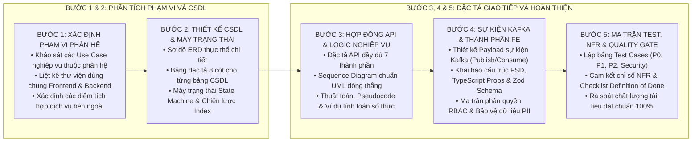

# KỸ NĂNG SOẠN THẢO TÀI LIỆU THIẾT KẾ CHI TIẾT CẤP THẤP (LLD-WRITER)

Kỹ năng này hướng dẫn quy trình tiêu chuẩn 5 bước để phân tích và sinh ra tài liệu Low-Level Design (LLD) 11 phần hoàn chỉnh, chính xác nghiệp vụ và có thể sử dụng trực tiếp để kỹ sư Backend/Frontend triển khai mã nguồn và kỹ sư QA viết kịch bản kiểm thử.

---

## 1. QUY TRÌNH 5 BƯỚC SOẠN THẢO TÀI LIỆU LLD

---

## 2. HƯỚNG DẪN CHI TIẾT CẤU TRÚC 11 PHẦN BẮT BUỘC

Tài liệu LLD đầu ra (`LLD_Domain_X_[TenPhanHe].md`) phải tuân thủ đúng khung cấu trúc:

### Section 0 — Thư viện dùng chung & Phụ thuộc kỹ thuật (Shared Dependencies)
* **Frontend Shared:** Bảng ánh xạ Component | File | Hàm/Hook | Mục đích sử dụng. Danh mục khóa i18n mới cho `vi.json`.
* **Backend Common:** Bảng Module | Class | Method | Mục đích. Danh mục Constants, ErrorCodes và KafkaTopics.

### Section 1 — Tổng quan & Phạm vi nghiệp vụ (Overview & Scope)
* Mục tiêu phân hệ, tài liệu tham chiếu, bảng danh mục màn hình và Use Cases, phạm vi In-Scope / Out-of-Scope.

### Section 2 — Quan hệ phụ thuộc & Điểm tích hợp (Dependencies & Integrations)
* Phụ thuộc các phân hệ nội bộ (Upstream/Downstream) và các dịch vụ bên ngoài (Ngân hàng, Cổng bảo hiểm, Ký số HSM, SMS/Email).

### Section 3 — Thiết kế Cơ sở dữ liệu chi tiết (Database Design)
* Sơ đồ Mermaid ERD chi tiết.
* Bảng mô tả chi tiết 8 cột cho từng bảng (`STT`, `Tên cột`, `Kiểu dữ liệu`, `Cho phép NULL`, `Giá trị mặc định`, `Ràng buộc`, `Bảo mật PII`, `Mô tả & Định dạng`).
* Danh mục Enum, Sơ đồ State Machine và Chiến lược đánh chỉ mục (Index Strategy).

### Section 4 — Hợp đồng giao tiếp API chi tiết (API Contracts)
* Với từng API phải có đủ 7 phần:
  1. Header bắt buộc (`Authorization`, `Content-Type`, `X-Request-ID`).
  2. Request Body JSON đầy đủ dữ liệu thực tế.
  3. Bảng quy tắc kiểm tra tính hợp lệ (Validation Rules).
  4. Response 200/201 JSON đầy đủ payload.
  5. Bảng mã lỗi và kịch bản phản hồi (Error Responses).
  6. Sequence Diagram chuẩn UML dóng thẳng trực giao, có khối `alt/else`.
  7. Chỉ số phi chức năng NFR của API (P95 Latency).

### Section 5 — Logic nghiệp vụ, Thuật toán & Tiến trình nền (Business Logic & Jobs)
* Sơ đồ tuần tự tổng thể Use Case.
* Quy tắc nghiệp vụ, mã giả Pseudocode và **Ví dụ tính toán số học cụ thể**.
* Cơ chế khóa phân tán Idempotency & Quản lý xung đột đồng thời.
* Đặc tả tiến trình chạy ngầm Cronjob (Cron expression, SQL Filter, logic xử lý).

### Section 6 — Sự kiện hàng đợi thông điệp (Kafka Events)
* Bảng danh mục sự kiện Publish và Consume.
* Mẫu Payload JSON chi tiết của từng sự kiện.

### Section 7 — Cấu trúc thành phần giao diện (Frontend Components)
* Cấu trúc thư mục FSD (`features/xxx/`).
* TypeScript Interfaces cho Component Props.
* Lược đồ kiểm tra form Zod Schema.
* Custom hooks quản lý truy vấn dữ liệu (TanStack Query / SWR).

### Section 8 — An toàn thông tin & Ma trận phân quyền (Security & RBAC)
* Ma trận RBAC phân quyền chi tiết.
* Phân quyền phạm vi dữ liệu theo phòng ban (Row-level Security).
* Danh mục cột dữ liệu cá nhân PII cần mã hóa và quy tắc masking.

### Section 9 — Ma trận kịch bản kiểm thử (Test Matrix)
* Bảng Test Cases bao phủ đầy đủ: Happy Path (P0), Negative Validation (P0), Business Rule (P0), Edge Cases (P1), Security (P1), Concurrency (P2).

### Section 10 — Yêu cầu phi chức năng (NFR)
* Bảng cam kết chỉ số: Response time, Throughput RPS, Tính toàn vẹn dữ liệu, Uptime.

### Section 11 — Danh mục tiêu chí hoàn tất (Definition of Done)
* Checklist nghiệm thu cho Backend, Frontend và QA/QC.

---

## 3. CHECKLIST KIỂM SOÁT CHẤT LƯỢNG TRƯỚC KHI BÀN GIAO (QUALITY GATE)

- [ ] **Độ chi tiết:** Không có câu thoái thác *"Xem thêm tài liệu BRD"*, *"Sẽ bổ sung sau"*.
- [ ] **CSDL:** Mỗi bảng có đủ 8 cột chuẩn, có đánh dấu cột PII và chiến lược Index.
- [ ] **API:** Đầy đủ Request/Response JSON mẫu với dữ liệu thực, không viết tóm tắt.
- [ ] **Sơ đồ:** Mọi luồng workflow được vẽ bằng **Sequence Diagram chuẩn UML dóng thẳng**, không dùng nét vẽ lượn cong.
- [ ] **Tính toán:** Mọi công thức đều có ví dụ số học thực tế minh họa từng bước.
- [ ] **Kiểm thử:** Có tối thiểu 15-20 Test Cases bao gồm cả nhóm Security và Concurrency.
