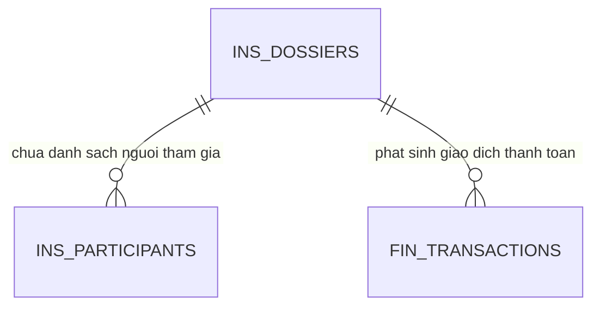
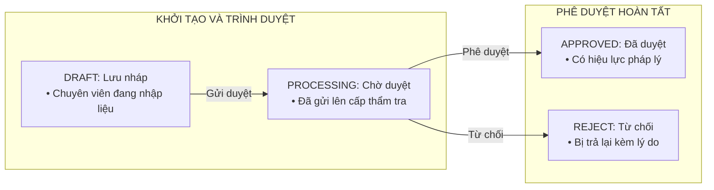
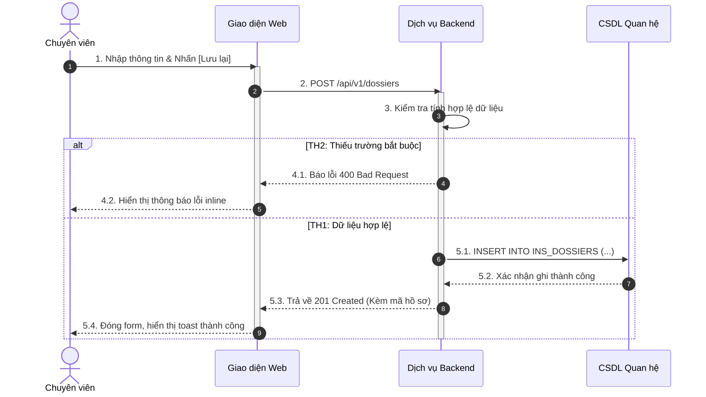

# TÀI LIỆU THIẾT KẾ CHI TIẾT CẤP THẤP (LOW-LEVEL DESIGN)
## PHÂN HỆ: [TÊN PHÂN HỆ NGHIỆP VỤ] (DOMAIN [N])

* Mã hiệu phân hệ: `DOMAIN_[N]_[TEN_VIET_TAT]`
* Tên hệ thống: `[TÊN HỆ THỐNG]`
* Phiên bản: `V1.0`
* Ngày cập nhật: `[DD/MM/YYYY]`

---

## SECTION 0 — THƯ VIỆN DÙNG CHUNG & PHỤ THUỘC KỸ THUẬT (SHARED DEPENDENCIES)

### 0.1. Frontend Shared Components & Hooks
| Thành phần | Đường dẫn tệp | Hàm / Hook sử dụng | Mục đích trong phân hệ |
| :--- | :--- | :--- | :--- |
| `DataTable` | `@/shared/components/ui/DataTable` | `DataTable` | Hiển thị danh sách hồ sơ có phân trang và chọn nhiều |
| `StatusBadge` | `@/shared/components/ui/StatusBadge` | `StatusBadge` | Hiển thị trạng thái hồ sơ theo chuẩn màu sắc |
| `Modal` | `@/shared/components/ui/Modal` | `Modal` | Hộp thoại xác nhận thao tác và xem chi tiết |

#### Danh mục khóa đa ngôn ngữ mới (`vi.json`)
```json
{
  "dossier": {
    "title": "Quản lý hồ sơ",
    "create_button": "Tạo mới hồ sơ",
    "msg_create_success": "Tạo mới hồ sơ thành công"
  }
}
```

### 0.2. Backend Common Components & Constants
| Mô-đun | Tên lớp (Class) | Phương thức (Method) | Mục đích sử dụng |
| :--- | :--- | :--- | :--- |
| `dip-common` | `SecurityUtils` | `getCurrentUserId()` | Lấy định danh người dùng từ Token JWT |
| `dip-common` | `AuditLogAspect` | `@AuditLog` | Tự động ghi vết nhật ký kiểm toán vào CSDL |

---

## SECTION 1 — TỔNG QUAN & PHẠM VI NGHIỆP VỤ (OVERVIEW & SCOPE)

### 1.1. Mục tiêu phân hệ
Mô tả rõ bài toán nghiệp vụ, giá trị mang lại và đối tượng người dùng thao tác.

### 1.2. Danh mục màn hình và Use Cases
| Mã màn hình | Tên màn hình tiếng Việt | Mã Use Case | Vai trò người dùng | Nền tảng |
| :--- | :--- | :--- | :--- | :--- |
| `CMS_DOS_01` | Danh sách hồ sơ | `UC_01` | Chuyên viên / Lãnh đạo | Web Desktop |
| `CMS_DOS_02` | Thêm mới hồ sơ | `UC_02` | Chuyên viên | Web Desktop |

### 1.3. Phạm vi In-Scope / Out-of-Scope
* **In-Scope:** [Liệt kê các chức năng thuộc phạm vi của phân hệ này]
* **Out-of-Scope:** [Liệt kê các chức năng bàn giao cho phân hệ khác xử lý]

---

## SECTION 2 — QUAN HỆ PHỤ THUỘC & ĐIỂM TÍCH HỢP (DEPENDENCIES & INTEGRATIONS)

### 2.1. Phụ thuộc các phân hệ nội bộ
| Phân hệ phụ thuộc | Dữ liệu / API cần lấy | Mục đích nghiệp vụ |
| :--- | :--- | :--- |
| `IAM Domain` | `GET /api/v1/users/profile` | Xác thực thông tin và phân quyền vai trò |

### 2.2. Tích hợp dịch vụ bên ngoài
| Dịch vụ đối tác | Giao thức / Endpoint | Cơ chế xác thực | Xử lý sự cố (Fallback) |
| :--- | :--- | :--- | :--- |
| `Cổng Thanh toán VietQR` | `POST /v1/qr/generate` | API Key & Secret | Báo lỗi và cho phép người dùng tạo lại mã QR |

---

## SECTION 3 — THIẾT KẾ CƠ SỞ DỮ LIỆU CHI TIẾT (DATABASE DESIGN)

### 3.1. Sơ đồ thực thể quan hệ (Mermaid ERD)


### 3.2. Bảng đặc tả chi tiết từng cột (`INS_DOSSIERS`)
| STT | Tên cột | Kiểu dữ liệu | Cho phép NULL | Giá trị mặc định | Ràng buộc | Bảo mật PII | Mô tả nghiệp vụ |
| :---: | :--- | :--- | :---: | :---: | :---: | :---: | :--- |
| 1 | `id` | BIGINT | Không | Tự tăng | PK | Không | Khóa chính bản ghi |
| 2 | `dossier_code` | VARCHAR(50) | Không | Tự sinh | UQ | Không | Mã hồ sơ duy nhất |
| 3 | `citizen_id` | VARCHAR(20) | Có | NULL | | Có | Số CCCD người kê khai (Mã hóa AES-256) |
| 4 | `total_amount` | NUMBER(15,2)| Không | 0 | | Không | Tổng số tiền phải thanh toán |
| 5 | `status` | VARCHAR(30) | Không | 'DRAFT' | | Không | Trạng thái vòng đời hồ sơ |
| 6 | `version` | INT | Không | 0 | | Không | Phiên bản phục vụ khóa lạc quan |

### 3.3. Danh mục Enum và Máy trạng thái


### 3.4. Chiến lược đánh chỉ mục (Index Strategy)
| Tên Index | Bảng | Danh sách cột | Loại Index | Mục đích tối ưu |
| :--- | :--- | :--- | :--- | :--- |
| `IDX_DOS_STATUS_DATE` | `INS_DOSSIERS` | `status, created_at` | B-Tree | Tối ưu truy vấn danh sách hồ sơ chờ duyệt |

---

## SECTION 4 — HỢP ĐỒNG GIAO TIẾP API CHI TIẾT (API CONTRACTS)

### 4.1. Bảng tổng hợp danh mục API
| Phương thức | Đường dẫn (URI) | Mô tả tóm tắt | Quyền truy cập | Cơ chế xác thực |
| :--- | :--- | :--- | :--- | :--- |
| `POST` | `/api/v1/dossiers` | Tạo mới một hồ sơ | `CTV`, `GDV` | Bearer Token JWT |

### 4.2. Chi tiết API: Tạo mới hồ sơ (`POST /api/v1/dossiers`)

#### A. Tiêu đề Header bắt buộc
```http
Authorization: Bearer <access_token>
Content-Type: application/json
X-Request-ID: <uuid-v4>
```

#### B. Request Body JSON mẫu
```json
{
  "dossier_type": "BHYT_NEW",
  "start_month": "2026-09",
  "duration_months": 12,
  "participants": [
    {
      "citizen_id": "001099012345",
      "full_name": "NGUYEN VAN A",
      "birth_date": "1990-05-15",
      "gender": "NAM"
    }
  ]
}
```

#### C. Bảng quy tắc kiểm tra tính hợp lệ (Validation Rules)
| Trường dữ liệu | Kiểu | Bắt buộc | Ràng buộc giá trị | Quy tắc nghiệp vụ & Thông báo lỗi |
| :--- | :--- | :---: | :--- | :--- |
| `dossier_type` | String | Có | `BHYT_NEW`, `BHYT_RENEW` | Loại hồ sơ phải thuộc danh mục cho phép |
| `duration_months` | Number | Có | `3`, `6`, `12` | Số tháng đóng chỉ nhận giá trị 3, 6 hoặc 12 |

#### D. Response Body JSON thành công (HTTP 201 Created)
```json
{
  "code": 201,
  "message": "Tạo mới hồ sơ thành công",
  "data": {
    "id": 100234,
    "dossier_code": "YTDK-260828-0001",
    "status": "DRAFT",
    "total_amount": 1263600.00,
    "created_at": "2026-08-28T08:00:00Z"
  }
}
```

#### E. Bảng mã lỗi và kịch bản xử lý lỗi
| Mã HTTP | Mã lỗi ứng dụng | Thông điệp hiển thị | Nguyên nhân | Hướng xử lý FE |
| :--- | :--- | :--- | :--- | :--- |
| `400` | `ERR_DOS_001` | Số tháng đóng không hợp lệ | Giá trị khác 3, 6, 12 | Hiển thị lỗi inline tại trường chọn số tháng |
| `409` | `ERR_DOS_002` | Người tham gia đã có hồ sơ đang xử lý | Trùng số CCCD đang active | Hiển thị cảnh báo trùng lặp hồ sơ |

#### F. Sơ đồ tuần tự (Sequence Diagram)


---

## SECTION 5 — LOGIC NGHIỆP VỤ, THUẬT TOÁN & TIẾN TRÌNH NỀN (BUSINESS LOGIC)

### 5.1. Thuật toán và Quy tắc tính toán
* **Mã quy tắc:** `BR_FEE_BHYT_01`
* **Công thức toán học:**
  $$\text{Tổng tiền} = \text{Mức lương cơ sở} \times 4.5\% \times \text{Số tháng} \times \sum_{i=1}^{N} \text{Tỷ lệ giảm trừ}_i$$
* **Ví dụ tính toán số thực:**
  * Mức lương cơ sở: `2.340.000 VNĐ`.
  * Đăng ký 12 tháng cho hộ gia đình 2 người:
    * Người thứ nhất (100%): `2.340.000 × 4.5% × 12 × 1.0 = 1.263.600 VNĐ`.
    * Người thứ hai (70%): `2.340.000 × 4.5% × 12 × 0.7 = 884.520 VNĐ`.
    * Tổng số tiền phải nộp: `1.263.600 + 884.520 = 2.148.120 VNĐ`.

### 5.2. Tiến trình chạy ngầm định kỳ (Background Job)
* **Tên tiến trình:** `ScanExpiredTransactionsJob`
* **Biểu thức kích hoạt:** `0 */5 * * * *` (Mỗi 5 phút một lần).
* **Điều kiện lọc dữ liệu:** `WHERE status = 'PAYMENT_PENDING' AND expired_at < NOW()`.
* **Hành động:** Chuyển trạng thái sang `EXPIRED`, giải phóng khóa hồ sơ.

---

## SECTION 6 — SỰ KIỆN HÀNG ĐỢI THÔNG ĐIỆP (KAFKA EVENTS)

### 6.1. Sự kiện phát đi (Publish)
* **Topic:** `dip.dossier.created`
* **Payload JSON mẫu:**
```json
{
  "event_id": "evt-550e8400-e29b-41d4-a716-446655440000",
  "event_type": "dossier.created",
  "occurred_at": "2026-08-28T08:00:00Z",
  "payload": {
    "dossier_id": 100234,
    "dossier_code": "YTDK-260828-0001",
    "total_amount": 2148120.00
  }
}
```

---

## SECTION 7 — CẤU TRÚC THÀNH PHẦN GIAO DIỆN (FRONTEND COMPONENTS)

### 7.1. Cấu trúc thư mục FSD
```text
features/dossier-management/
├── api/
│   └── dossierService.ts
├── components/
│   ├── DossierForm.tsx
│   └── DossierTable.tsx
├── types.ts
└── index.ts
```

---

## SECTION 8 — AN TOÀN THÔNG TIN & PHÂN QUYỀN (SECURITY & RBAC)

### 8.1. Ma trận phân quyền vai trò
| Chức năng / API | Chuyên viên (`CTV`) | Giao dịch viên (`GDV`) | Kiểm soát viên (`KSV`) | Quản trị viên (`ADMIN`) |
| :--- | :---: | :---: | :---: | :---: |
| Xem danh sách hồ sơ | Có | Có | Có | Có |
| Tạo mới hồ sơ | Có | Có | Không | Không |
| Phê duyệt hồ sơ | Không | Không | Có | Có |

---

## SECTION 9 — MA TRẬN KỊCH BẢN KIỂM THỬ (TEST MATRIX)

| Mã TC | Phân loại | Tiêu đề kịch bản | Điều kiện đầu vào (Given) | Hành động thực hiện (When) | Kết quả kỳ vọng (Then) | Ưu tiên |
| :--- | :--- | :--- | :--- | :--- | :--- | :---: |
| `TC_DOS_01` | Happy Path | Tạo mới hồ sơ BHYT 1 người | Dữ liệu hợp lệ, token đúng | Gửi POST /api/v1/dossiers | HTTP 201, sinh mã hồ sơ đúng chuẩn | `P0` |
| `TC_DOS_02` | Negative | Nhập sai định dạng số tháng | duration = 5 | Gửi POST /api/v1/dossiers | HTTP 400, báo lỗi mã ERR_DOS_001 | `P0` |
| `TC_DOS_03` | Security | Truy cập khi token hết hạn | Token JWT hết hạn | Gửi request | HTTP 401 Unauthorized | `P1` |
| `TC_DOS_04` | Concurrency | Gửi trùng request tạo hồ sơ | 2 request cùng Request-ID | Bắn đồng thời trong 10ms | Đúng 1 bản ghi được tạo, request 2 trả 409 | `P2` |

---

## SECTION 10 — YÊU CẦU PHI CHỨC NĂNG (NFR)

| Chỉ số kỹ thuật | Mục tiêu cam kết | Phương pháp đo kiểm |
| :--- | :--- | :--- |
| Thời gian phản hồi API tra cứu | P95 ≤ 500ms | Grafana APM Dashboard |
| Thời gian phản hồi API ghi nhận | P95 ≤ 800ms | Grafana APM Dashboard |
| Năng lực chịu tải đồng thời | ≥ 500 TPS | Kịch bản kiểm thử tải k6 |
| Tính toàn vẹn dữ liệu | 0% thất thoát | Đối soát tự động cuối ngày |

---

## SECTION 11 — DANH MỤC TIÊU CHÍ HOÀN TẤT (DEFINITION OF DONE)

- [ ] **Backend:** JPA Entity đầy đủ ràng buộc, Service có Unit Test bao phủ ≥ 80%, API có Swagger/OpenAPI, xử lý Transactional an toàn.
- [ ] **Frontend:** Zod Schema kiểm tra 100% trường, xử lý đủ 4 trạng thái màn hình (Loading, Empty, Error, Success), đa ngôn ngữ `vi.json`.
- [ ] **QA:** Pass 100% kịch bản kiểm thử P0 và P1.
