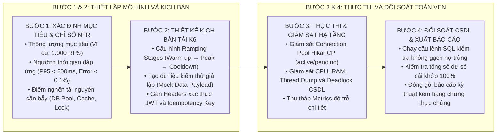

# KỸ NĂNG: THIẾT KẾ KỊCH BẢN ĐO KIỂM TẢI CAO VÀ BẪY TOÀN VẸN DỮ LIỆU (LOADTEST-CONCURRENCY-WRITER)

Kỹ năng này cung cấp phương pháp luận và các mẫu kịch bản đo kiểm tải cao trên công cụ **k6** và **JMeter**, tập trung cốt lõi vào việc phát hiện các lỗi tranh chấp dữ liệu đồng thời, nghẽn kết nối cơ sở dữ liệu và bảo đảm toàn vẹn số dư tài chính.

---

## 1. NGUYÊN TẮC BẮT BUỘC KHI KIỂM THỬ TẢI

1. **Khẳng định Toàn vẹn Dữ liệu (Data Integrity Assertion):**
   * Mọi bài đo kiểm tải không chỉ đo lường thời gian đáp ứng (Latency) và số lượng yêu cầu mỗi giây (RPS), mà **bắt buộc phải có câu lệnh SQL kiểm tra đối soát CSDL sau khi bài test kết thúc**.
   * Ví dụ: Bắn 100 Webhook thanh toán trùng mã giao dịch → CSDL bắt buộc chỉ có đúng 1 bản ghi được gạch nợ, 99 request sau bị từ chối an toàn.
2. **Nguyên tắc Bằng chứng Thực chứng:**
   * Mọi báo cáo tải phải đính kèm: (1) Tệp mã nguồn k6 (`.js`) hoặc JMeter (`.jmx`), (2) Cấu hình phần cứng môi trường đo kiểm, (3) Tệp nhật ký log đo kiểm thực tế.

---

## 2. QUY TRÌNH THIẾT KẾ BÀI TEST TẢI 4 BƯỚC

---

## 3. BỐN BÀI BẪY DỮ LIỆU ĐỒNG THỜI CHUẨN MỰC

1. **Bẫy 1: Gạch nợ trùng lặp (Duplicate Webhook Stress Test):**
   * Bắn 100 requests Webhook có cùng `transaction_code` trong 100ms từ 100 Virtual Users (VUs) song song.
   * Kiểm tra Khóa phân tán Redisson và Unique Constraint CSDL.
2. **Bẫy 2: Tranh chấp số dư tài chính (Balance Race Condition):**
   * 500 VUs đồng thời ghi nhận giao dịch và cập nhật số dư cho cùng một tài khoản.
   * Kiểm tra Pessimistic Lock (`SELECT ... FOR UPDATE`) và Isolation Level.
3. **Bẫy 3: Cạn kiệt Connection Pool (HikariCP Exhaustion):**
   * Bắn tải 1.000 RPS liên tục 15 phút với các câu truy vấn phức tạp.
   * Đảm bảo `pending connections = 0`, không phát sinh `ConnectionTimeoutException`.
4. **Bẫy 4: Đứt kết nối bất đồng bộ (Outbox Partition Stress Test):**
   * Giả lập ngắt kết nối dịch vụ ngoài 30 phút khi đang nhận tải lớn.
   * Đảm bảo sự kiện được lưu an toàn trong bảng `outbox_events` và tự động gửi bù khi kết nối trở lại.
