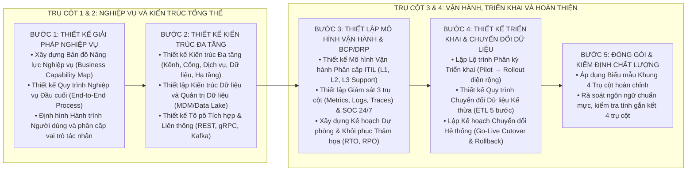

# KỸ NĂNG SOẠN THẢO TÀI LIỆU GIẢI PHÁP TỔNG THỂ (MASTER-SOLUTION-WRITER)

Kỹ năng này hướng dẫn quy trình tiêu chuẩn 5 bước để xây dựng Tài liệu Giải pháp Tổng thể (Master Solution Document) tích hợp toàn diện 4 trụ cột chiến lược: Nghiệp vụ – Kiến trúc – Vận hành – Triển khai cho các dự án quy mô lớn.

---

## 1. QUY TRÌNH 5 BƯỚC THIẾT KẾ GIẢI PHÁP TỔNG THỂ

---

## 2. HƯỚNG DẪN CHI TIẾT TỪNG BƯỚC THỰC HIỆN

### Bước 1: Thiết kế Giải pháp Nghiệp vụ Tổng thể (Trụ cột 1)
1. **Xây dựng Bản đồ Năng lực Nghiệp vụ (Business Capability Map):**
   * Phân rã 3 nhóm: Năng lực Chiến lược (Định hướng & Giám sát), Năng lực Cốt lõi (Xử lý hồ sơ, Thẩm định, Duyệt, Thanh toán) và Năng lực Hỗ trợ (Danh mục, Báo cáo, Kiểm toán).
2. **Thiết kế Khung Quy trình Đầu cuối (End-to-End Process Landscape):**
   * Vẽ sơ đồ luồng quy trình tổng thể bằng Mermaid Sequence Diagram trực giao chuẩn UML.
3. **Mô hình hóa Hành trình Người dùng (User Journey):**
   * Lập bảng phân tích điểm chạm, kênh tương tác và kỳ vọng trải nghiệm cho từng nhóm đối tượng.

### Bước 2: Thiết kế Kiến trúc Tổng thể Đa tầng (Trụ cột 2)
1. **Xây dựng Sơ đồ Kiến trúc Đa tầng (Layered Architecture):**
   * Tầng Kênh (Channel) → Tầng Cổng (API Gateway) → Tầng Nghiệp vụ (Microservices) → Tầng Dữ liệu (Persistence) → Tầng Hạ tầng (Kubernetes/Cloud).
   * Vẽ sơ đồ bằng Mermaid LR 2 cột chuẩn 4:3.
2. **Thiết kế Kiến trúc Dữ liệu (Data Architecture):**
   * Phân định rõ dữ liệu giao dịch OLTP, phân tích OLAP, danh mục dùng chung MDM và chính sách lưu trữ nóng/lạnh.
3. **Thiết kế Tô pô Tích hợp & Liên thông:**
   * Đồng bộ (REST/gRPC), Bất đồng bộ (Kafka Event-Driven), Truyền theo lô (Batch/SFTP).

### Bước 3: Thiết lập Mô hình Vận hành & Kế hoạch Khôi phục Thảm họa (Trụ cột 3)
1. **Mô hình Hỗ trợ Kỹ thuật ITIL 3 cấp:**
   * Cấp 1 (L1 Service Desk): Tiếp nhận 24/7, xử lý hướng dẫn cơ bản.
   * Cấp 2 (L2 App/Sys Ops): Xử lý lỗi cấu hình, khởi động lại dịch vụ, kiểm tra log trong 2-4 giờ.
   * Cấp 3 (L3 Core Engineering): Xử lý lỗi mã nguồn, vá nóng hệ thống.
2. **Giám sát toàn diện 3 trụ cột (Observability):**
   * Metrics (Prometheus/Grafana), Logs (ELK/OpenSearch), Traces (OpenTelemetry).
3. **Kế hoạch BCP & DRP:**
   * Triển khai DC/DR đa vùng đồng bộ thời gian thực, cam kết `RTO ≤ 15 phút`, `RPO = 0`.

### Bước 4: Thiết kế Chiến lược Triển khai & Chuyển đổi Dữ liệu (Trụ cột 4)
1. **Lộ trình Phân kỳ (Phasing Roadmap):**
   * Giai đoạn Chuẩn bị → Thí điểm (Pilot) → Triển khai diện rộng (Nationwide Rollout) → Bàn giao.
2. **Quy trình Chuyển đổi Dữ liệu Kế thừa (Legacy Migration):**
   * 5 bước: Khảo sát → Lược đồ Ánh xạ → Xây dựng ETL Pipeline → Chạy thử & Đối soát 100% → Chuyển đổi chính thức.
3. **Kế hoạch Chuyển đổi Hệ thống (Go-Live Cutover):**
   * Bảng phân bổ công việc từng mốc giờ (Cutover Checklist) kèm kịch bản quay lui (Rollback Plan).

### Bước 5: Đóng gói và Kiểm soát Chất lượng (Quality Gate Checklist)
1. Sử dụng biểu mẫu [master_solution_template.md](./resources/master_solution_template.md).
2. Rà soát chất lượng:
   - [ ] Đủ 4 trụ cột chiến lược độc lập và gắn kết chặt chẽ.
   - [ ] 100% tiếng Việt chuẩn mực, không chèn tiếng Anh đệm trong ngoặc đơn.
   - [ ] Không có icon/emoji trong tiêu đề đề mục.
   - [ ] Ký tự Unicode thuần túy thay thế ký tự LaTeX `$`.
   - [ ] Sơ đồ Khối Hộp Unicode chuẩn 90 ký tự, không bị lỗi lệch hàng cột.
   - [ ] Sơ đồ Mermaid LR 2 cột 4:3 và Sequence Diagram chuẩn UML dóng thẳng trực giao.

---

## 3. TÀI NGUYÊN BỔ TRỢ

* [Quy chuẩn soạn thảo Giải pháp Tổng thể](file:///Users/micro/Source/chapisoft/mschool/.agents/rules/master_solution_rules.md)
* [Biểu mẫu khung Tài liệu Giải pháp Tổng thể 4 Trụ cột hoàn chỉnh](./resources/master_solution_template.md)
