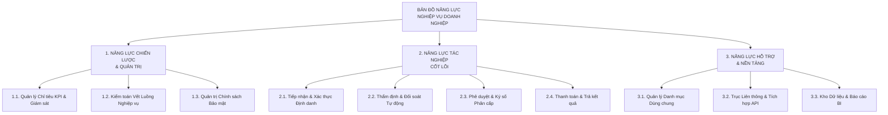
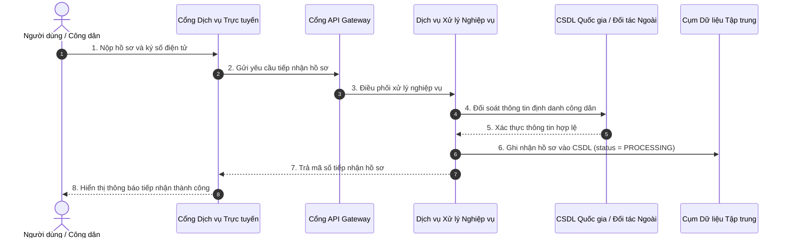
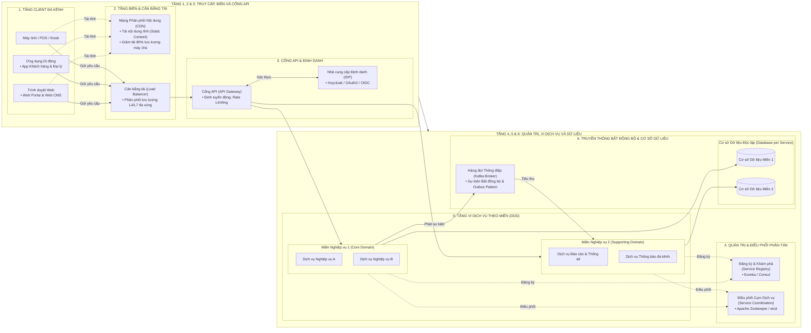
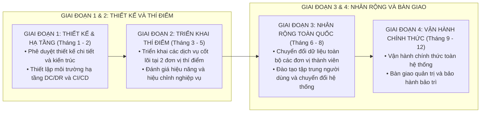

# TÀI LIỆU GIẢI PHÁP TỔNG THỂ HỆ THỐNG (MASTER SOLUTION ARCHITECTURE)

**DỰ ÁN:** [TÊN HỆ THỐNG / CHƯƠNG TRÌNH CHUYỂN ĐỔI SỐ]  
**CHỦ ĐẦU TƯ / ĐƠN VỊ THỤ HƯỞNG:** [TÊN ĐƠN VỊ]  
**ĐƠN VỊ TƯ VẤN KIẾN TRÚC:** [TÊN ĐƠN VỊ THIẾT KẾ]  
**PHIÊN BẢN:** V1.0  
**NGÀY PHÁT HÀNH:** [NGÀY/THÁNG/NĂM]  

---

## BẢNG GHI NHẬN THAY ĐỔI TÀI LIỆU

| Ngày thay đổi | Vị trí thay đổi | A*, M, D | Nguồn gốc | Phiên bản cũ | Mô tả thay đổi | Phiên bản mới |
| :--- | :--- | :---: | :--- | :---: | :--- | :---: |
| [DD/MM/YYYY] | Toàn bộ tài liệu | A* | Thiết kế ban đầu | N/A | Khởi tạo tài liệu Giải pháp Tổng thể 4 trụ cột | V1.0 |

*Ghi chú ký hiệu thao tác:* `A*` – Tạo mới (Add), `M` – Sửa đổi (Modify), `D` – Xóa bỏ (Delete).

---

## PHẦN 0: TỔNG QUAN ĐIỀU HÀNH & BỐI CẢNH CHIẾN LƯỢC

### 0.1. Bối cảnh và Tầm nhìn Chiến lược
[Mô tả bối cảnh ngành, định hướng phát triển tổng thể, yêu cầu cải cách hành chính và chuẩn hóa dữ liệu tập trung.]

### 0.2. Phạm vi và Đối tượng Thụ hưởng
[Nêu rõ phạm vi nghiệp vụ, các nhóm cơ quan/đơn vị tham gia và đối tượng thụ hưởng dịch vụ trực tiếp.]

---

## TRỤ CỘT 1: GIẢI PHÁP NGHIỆP VỤ TỔNG THỂ (BUSINESS SOLUTION)

### 1.1. Bản đồ Năng lực Nghiệp vụ (Business Capability Map)

### 1.2. Khung Quy trình Nghiệp vụ Đầu cuối (End-to-End Process Landscape)

### 1.3. Mô hình Hành trình Người dùng & Phân cấp Tác nhân

| Nhóm tác nhân | Điểm chạm (Touchpoints) | Hành trình tác nghiệp chính | Kỳ vọng trải nghiệm |
| :--- | :--- | :--- | :--- |
| **Công dân / Doanh nghiệp** | Web Portal, Ứng dụng Di động | Đăng nhập VNeID → Chọn thủ tục → Điền biểu mẫu thông minh → Ký số → Nộp hồ sơ → Tra cứu tiến độ | Đơn giản, tự động điền thông tin, xử lý dưới 5 phút |
| **Chuyên viên Xử lý** | Web Back-Office Nội bộ | Nhận thông báo hồ sơ mới → Thẩm tra hồ sơ → Đối soát tự động → Lập biên bản thẩm định → Trình duyệt | Giao diện tập trung, cảnh báo trùng lặp, gợi ý tự động |
| **Lãnh đạo Phê duyệt** | Web Back-Office / Mobile App | Xem tờ trình tổng hợp → Thẩm định hồ sơ đính kèm → Ký số phê duyệt (Cloud HSM) → Ban hành | Thao tác 1 chạm, hỗ trợ phê duyệt hàng loạt an toàn |

---

## TRỤ CỘT 2: GIẢI PHÁP KIẾN TRÚC TỔNG THỂ (ARCHITECTURE BLUEPRINT)

### 2.1. Kiến trúc Hệ thống Microservices Đa tầng 6 Khối Chuẩn Mực

### 2.2. Kiến trúc Dữ liệu & Quản trị Dữ liệu Doanh nghiệp
* **Dữ liệu Giao dịch Trực tuyến (OLTP):** Thiết kế chuẩn hóa quan hệ (3NF), sử dụng khóa ngoại chặt chẽ, tối ưu hóa chỉ mục B-Tree và phân vùng dữ liệu theo năm.
* **Dữ liệu Danh mục Dùng chung (Master Data Management - MDM):** Quản lý tập trung các bảng danh mục hành chính, danh mục chức danh, đồng bộ tự động tới các vi dịch vụ qua Kafka Topic.
* **Chính sách Vòng đời Dữ liệu (Data Lifecycle Management):** Dữ liệu hoạt động (0-2 năm) lưu trữ trên ổ đĩa tốc độ cao NVMe (Hot Storage); Dữ liệu lịch sử (> 2 năm) chuyển sang lưu trữ dài hạn (Cold Storage) để tối ưu chi phí.

### 2.3. Kiến trúc Tích hợp & Liên thông Hệ thống
* **Tích hợp Đồng bộ Tốc độ cao:** Giao thức gRPC Protobuf kết nối giữa các vi dịch vụ nội bộ (độ trễ < 5ms).
* **Tích hợp Bất đồng bộ Hướng sự kiện:** Apache Kafka phục vụ truyền thông điệp sự kiện nghiệp vụ và đồng bộ dữ liệu Outbox.
* **Tích hợp Trục Liên thông Quốc gia (NDXP / LGSP):** Xây dựng module kết nối chuẩn hóa, ký số thông điệp XML/JSON theo quy chuẩn kỹ thuật quốc gia.

---

## TRỤ CỘT 3: GIẢI PHÁP VẬN HÀNH & QUẢN TRỊ (OPERATIONS & GOVERNANCE)

### 3.1. Mô hình Vận hành & Hỗ trợ Kỹ thuật ITIL Phân cấp

| Cấp hỗ trợ | Đơn vị phụ trách | Trách nhiệm chính | Cam kết thời gian (SLA) |
| :--- | :--- | :--- | :--- |
| **Cấp 1 (L1 - Service Desk)** | Đội ngũ Hỗ trợ Vận hành | • Tiếp nhận yêu cầu/sự cố 24/7 qua Hotline/Portal • Hướng dẫn thao tác người dùng • Phân loại và chuyển tiếp sự cố đúng đầu mối | Tiếp nhận trong 5 phút, xử lý ngay trong 15 phút với yêu cầu phổ biến |
| **Cấp 2 (L2 - Application Ops)** | Đội ngũ Quản trị Ứng dụng & Hệ thống | • Kiểm tra log lỗi, truy vết sự cố phân tán • Khởi động lại dịch vụ hoặc điều chỉnh cấu hình • Khắc phục lỗi sai lệch dữ liệu nghiệp vụ | Phản hồi trong 15 phút, xử lý trong 2 - 4 giờ |
| **Cấp 3 (L3 - Core Engineering)** | Nhóm Chuyên gia & Kiến trúc sư | • Sửa lỗi mã nguồn (Source code fix) • Phát hành bản vá nóng (Hotfix release) • Tối ưu hiệu năng kiến trúc và cơ sở dữ liệu | Khắc phục trong 4 - 8 giờ đối với sự cố nghiêm trọng |

### 3.2. Giám sát Toàn diện & Trung tâm Điều hành An ninh (APM & SOC 24/7)
* **Số liệu Hệ thống (Metrics):** Prometheus thu thập tự động các chỉ số hạ tầng (CPU, RAM, Disk I/O) và chỉ số ứng dụng (RPS, Latency P95/P99, Error Rate), hiển thị trên Dashboard Grafana.
* **Nhật ký Tập trung (Centralized Logging):** Thu thập toàn bộ log ứng dụng về cụm Elasticsearch / OpenSearch, cấu hình cảnh báo tự động khi xuất hiện mẫu lỗi bất thường.
* **Truy vết Phân tán (Distributed Tracing):** Tích hợp OpenTelemetry gắn mã `trace_id` xuyên suốt từ Gateway qua các vi dịch vụ đến CSDL.

### 3.3. Kế hoạch Kinh doanh Liên tục & Khôi phục Thảm họa (BCP & DRP)
* **Mô hình Triển khai DC / DR:**
  * Trung tâm Dữ liệu Chính (Primary DC): Vận hành tải 100%.
  * Trung tâm Dữ liệu Dự phòng (DR Site): Cấu hình sẵn sàng nóng, đồng bộ dữ liệu liên tục qua mạng truyền dẫn chuyên dụng.
* **Chỉ số Mục tiêu Khôi phục:**
  * Thời gian Khôi phục Mục tiêu: `RTO ≤ 15 phút`.
  * Điểm Khôi phục Mục tiêu: `RPO = 0` (Bảo đảm không mất dữ liệu giao dịch đã ghi nhận).
* **Quy trình Chuyển đổi Khẩn cấp (Failover Procedure):** Tự động chuyển hướng DNS/BGP sang Trung tâm DR khi Trung tâm DC chính mất kết nối quá 3 phút.

---

## TRỤ CỘT 4: GIẢI PHÁP TRIỂN KHAI & CHUYỂN ĐỔI (DEPLOYMENT & MIGRATION)

### 4.1. Lộ trình Phân kỳ Triển khai Tổng thể (Phasing Roadmap)

### 4.2. Kế hoạch Chuyển đổi Dữ liệu Kế thừa (Legacy Data Migration)
1. **Bước 1 (Khảo sát & Trích xuất):** Khảo sát cấu trúc cơ sở dữ liệu cũ, trích xuất dữ liệu thô sang vùng lưu trữ tạm (Staging Area).
2. **Bước 2 (Làm sạch & Chuẩn hóa):** Loại bỏ bản ghi trùng lặp, chuẩn hóa định dạng số CCCD, ngày tháng, danh mục hành chính theo chuẩn mới.
3. **Bước 3 (Nạp & Ánh xạ Lược đồ):** Chạy chương trình ETL nạp dữ liệu vào cơ sở dữ liệu mới theo cấu trúc chuẩn.
4. **Bước 4 (Đối soát Chéo 100%):** Chạy script kiểm tra số học: `Tổng số bản ghi`, `Tổng số tiền`, `Tổng số hồ sơ theo trạng thái` giữa hệ thống cũ và mới phải khớp 100%.
5. **Bước 5 (Ký Biên bản Nghiệm thu Dữ liệu):** Các bên liên quan ký xác nhận tính chính xác của dữ liệu đã chuyển đổi.

### 4.3. Kế hoạch Chuyển đổi Hệ thống (Go-Live Cutover Plan)
* **Khung giờ Chuyển đổi (Cutover Window):** Thực hiện từ 22h00 tối Thứ Sáu đến 06h00 sáng Thứ Hai để không ảnh hưởng hoạt động nghiệp vụ thường nhật.
* **Kịch bản Quay lui (Rollback Plan):** Nếu phát sinh sự cố nghiêm trọng không thể khắc phục trước 04h00 sáng Thứ Hai, Ban Chỉ đạo sẽ ra quyết định phục hồi nguyên trạng hệ thống cũ từ bản sao lưu trước giờ Cutover.
