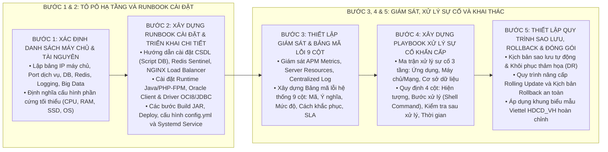

# KỸ NĂNG SOẠN THẢO TÀI LIỆU HƯỚNG DẪN CÀI ĐẶT VÀ VẬN HÀNH VIETTEL (OPERATIONS-GUIDE-WRITER)

Kỹ năng này cung cấp quy trình tác nghiệp chuẩn 5 bước để xây dựng một bộ **Tài liệu Hướng dẫn Cài đặt, Vận hành và Khai thác Hệ thống (Operations Runbook)** hoàn chỉnh, chi tiết đến từng dòng lệnh Shell, bảng mã lỗi và kịch bản ứng cứu sự cố theo tiêu chuẩn Tập đoàn Viettel (`HDCD_VH_<TÊN_DỰ_ÁN>_v1.0`).

---

## 1. QUY TRÌNH 5 BƯỚC SOẠN THẢO TÀI LIỆU VẬN HÀNH CHUẨN VIETTEL

---

## 2. HƯỚNG DẪN CHI TIẾT TỪNG BƯỚC THỰC HIỆN

### Bước 1: Xác định Danh sách Máy chủ & Tài nguyên Hạ tầng (Phần 2)
1. **Lập Bảng Danh sách Máy chủ và Thành phần Triển khai (Mục 2.1):**
   * Liệt kê đầy đủ: Tên thành phần, Địa chỉ IP, Port lắng nghe, Database Name, User/Password schema, Mục đích và vai trò.
2. **Yêu cầu Tài nguyên Phần cứng & Hệ điều hành (Mục 2.2):**
   * Quy định cấu hình: Hệ điều hành (CentOS 7.x / RHEL 8.x), RAM, CPU Cores, SSD và các thư mục lưu trữ chuẩn (`/u01/...`).

### Bước 2: Xây dựng Runbook Cài đặt & Triển khai Chi tiết (Phần 3)
1. **Cài đặt & Thiết lập Cơ sở Dữ liệu (Mục 3.1):**
   * Hướng dẫn chạy các tệp script khởi tạo bảng dữ liệu, constraints, indexes, triggers.
2. **Cài đặt & Cấu hình Redis Cache & Sentinel (Mục 3.2):**
   * Từng dòng lệnh `yum install`, `tar -xvzf`, `make`, cấu hình `redis.conf`, `sentinel.conf` và lệnh kiểm tra `redis-cli`.
3. **Cài đặt NGINX Load Balancer (Mục 3.3):**
   * Lệnh biên dịch NGINX kèm các modules cần thiết (`--with-http_ssl_module`, `--with-http_v2_module`), cấu hình `nginx.conf`, file virtual host và script start/reload.
4. **Cài đặt Môi trường Runtime & Oracle Client (Mục 3.4):**
   * Cài đặt Java OpenJDK / PHP-FPM, Oracle Instant Client RPM, OCI8 / JDBC driver.
5. **Hướng dẫn Build & Deploy từng Vi dịch vụ Backend (Mục 3.5 & 3.6):**
   * Lệnh đóng gói `mvn clean package`, copy file JAR sang thư mục triển khai, chỉnh sửa `config.yml` (IP, Port, DB, Secret key) và lệnh khởi động qua Systemd hoặc Java Service Wrapper (`./service start/stop/restart`).
6. **Hướng dẫn Triển khai Web CMS / Frontend (Mục 3.7):**
   * Đóng gói mã nguồn, thiết lập Virtual Host trên NGINX và phân quyền thư mục.

### Bước 3: Thiết lập Giám sát & Xây dựng Bảng Mã Lỗi (Phần 4)
1. **Hướng dẫn Giám sát Hệ thống (Mục 4.1):**
   * Giám sát tài nguyên máy chủ (CPU, RAM, Disk I/O, Network Throughput).
   * Giám sát APM (Prometheus Metrics, Grafana Dashboards) và Centralized Logging (OpenSearch / ELK).
2. **Xây dựng Bảng Mã Lỗi Hệ Thống Chuẩn 9 Cột (Mục 4.2):**
   * `STT | Loại lỗi | Tên module | Mã lỗi | Ý nghĩa mã lỗi | Mức độ ảnh hưởng (Critical/Major/Minor) | Nguyên nhân gốc rễ | Cách khắc phục chi tiết | SLA MTTR`.

### Bước 4: Xây dựng Playbook Xử lý Sự cố Khẩn cấp (Phần 5)
Phân tách rõ ràng ma trận xử lý sự cố thành 3 tầng:
1. **Sự cố Tầng Ứng dụng (Application Incidents):**
   * Lỗi không gửi được SMS Brandname, lỗi kết nối Core Ví/Core Banking, lỗi gọi sang cổng đối tác ngoài.
2. **Sự cố Tầng Máy chủ & Mạng (Server & Network Incidents):**
   * Ứng dụng bị chậm (High Latency), ứng dụng bị treo/chết (Out of Memory, CPU 100%), cạn kiệt Connection Pool.
3. **Sự cố Tầng Cơ sở Dữ liệu (Database Incidents):**
   * Khóa chết (Deadlock), treo truy vấn (Long running query), đầy ổ đĩa lưu trữ Archive Log / Tablespace.
* Mọi sự cố đều phải có đủ 4 thông tin: **Hiện tượng nhận biết**, **Các bước xử lý dòng lệnh (Runbook Steps)**, **Cách kiểm tra sau xử lý** và **Thời gian xử lý**.

### Bước 5: Thiết lập Quy trình Sao lưu, Rollback & Khai thác (Phần 6 & Phần 7)
1. **Quy trình Sao lưu & Khôi phục Thảm họa (Mục 6.1):**
   * Đoạn mã Shell script tự động sao lưu CSDL và tệp cấu hình, thiết lập Cronjob định kỳ hàng ngày, kịch bản khôi phục Disaster Recovery.
2. **Quy trình Triển khai Không Gián đoạn (Zero-Downtime Rolling Update & Rollback - Mục 6.2):**
   * Quy trình cập nhật từng node qua NGINX Upstream, kịch bản Rollback phiên bản cũ khi bản phát hành mới gặp lỗi nghiêm trọng.
3. **Hướng dẫn Khai thác Hệ thống (Phần 7):**
   * Bảng ma trận phân quyền tài liệu Hướng dẫn sử dụng cho từng module và đối tượng người dùng.

---

## 3. CHECKLIST KIỂM SOÁT CHẤT LƯỢNG TÀI LIỆU VẬN HÀNH (QUALITY GATE)

Trước khi nghiệm thu hoặc bàn giao tài liệu cho đội ngũ vận hành:
- [ ] Đủ 7 phần bắt buộc theo chuẩn Viettel `HDCD_VH_<TÊN_DỰ_ÁN>_v1.0`.
- [ ] Mọi bước cài đặt và triển khai đều có câu lệnh Shell chính xác, đường dẫn thư mục tuyệt đối và kết quả mẫu.
- [ ] Có Bảng danh sách Máy chủ đầy đủ IP, Port, DB và vai trò.
- [ ] Có Bảng Mã lỗi Hệ thống chuẩn 9 cột với đầy đủ SLA MTTR.
- [ ] Có Ma trận Xử lý Sự cố 3 tầng (Ứng dụng, Máy chủ, CSDL) với các bước lệnh chi tiết.
- [ ] Có Quy trình Sao lưu (Backup Shell Script), Khôi phục DR và Kịch bản Rollback.
- [ ] 100% tiếng Việt chuẩn mực, không chèn tiếng Anh đệm trong ngoặc đơn.
- [ ] Không có icon/emoji trong tiêu đề đề mục.

---

## 4. TÀI NGUYÊN BỔ TRỢ

* [Quy chuẩn soạn thảo Tài liệu Vận hành Viettel](file:///Users/micro/Source/chapisoft/mschool/.agents/rules/operations_guide_rules.md)
* [Biểu mẫu khung Sổ tay Vận hành chuẩn Viettel HDCD_VH](./resources/operations_guide_template.md)
