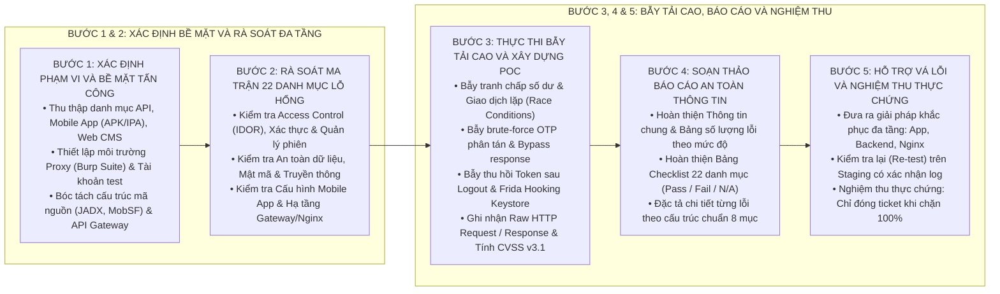

# KỸ NĂNG RÀ SOÁT, ĐÁNH GIÁ VÀ SOẠN THẢO BÁO CÁO PENTEST (PENTEST-ASSESSMENT-WRITER)

Kỹ năng này hướng dẫn quy trình tiêu chuẩn 5 bước để xác định bề mặt tấn công, rà soát ma trận 22 nhóm lỗ hổng theo chuẩn OWASP/MASVS/NIST, thực thi các kịch bản bẫy an ninh hệ thống tải cao phân tán, xây dựng kịch bản tái hiện thực nghiệm (PoC) và soạn thảo Báo cáo An toàn Thông tin chuẩn mực theo đúng định dạng báo cáo kiểm thử xâm nhập thực tế.

---

## 1. QUY TRÌNH 5 BƯỚC TÁC NGHIỆP PENTEST

---

## 2. HƯỚNG DẪN CHI TIẾT TỪNG BƯỚC TÁC NGHIỆP

### Bước 1: Xác Định Phạm Vi Đánh Giá Và Bề Mặt Tấn Công (Attack Surface)
1. **Thu thập thông tin hệ thống:**
   * Định danh rõ: Tên hệ thống, loại ứng dụng (Mobile Android/iOS, Web Portal, API Gateway, Microservices), đường dẫn truy cập (Base URL, Package Name).
   * Hình thức đánh giá: Graybox (được cung cấp tài khoản kiểm thử và tài liệu API), Blackbox (đánh giá từ góc độ kẻ tấn công ngoài) hoặc Whitebox (rà soát kèm mã nguồn).
2. **Thiết lập công cụ kiểm thử:**
   * **Proxy Chặn bắt:** Cấu hình Burp Suite Professional hoặc OWASP ZAP, thiết lập chứng chỉ CA trên máy trạm và thiết bị thử nghiệm.
   * **Phân tích Mobile Tĩnh (Static Analysis):** Sử dụng `JADX-GUI`, `apktool`, `MobSF` để giải mã file APK/IPA, quét tìm các chuỗi bí mật (API Keys, OAuth Secrets, URL máy chủ nội bộ) được khai báo cứng trong mã nguồn.
   * **Phân tích Mobile Động (Dynamic Analysis):** Thiết lập thiết bị thật hoặc máy ảo (Android 11+, iOS đã jailbreak), khởi động `frida-server` để chuẩn bị kiểm tra cơ chế chống can thiệp.
3. **Chuẩn bị dữ liệu và tài khoản thử nghiệm:**
   * Tối thiểu 02 tài khoản người dùng thông thường (Tài khoản A và Tài khoản B) để kiểm thử phân quyền ngang (IDOR).
   * 01 tài khoản có đặc quyền cao hơn (Đại lý, Nhân viên, Quản trị viên) để kiểm thử leo thang đặc quyền dọc (Privilege Escalation).

### Bước 2: Rà Soát Ma Trận 22 Nhóm Lỗ Hổng Tiêu Chuẩn
Rà soát toàn diện theo danh mục chuẩn được quy định tại [pentest_assessment_rules.md](file:///Users/micro/Source/chapisoft/mschool/.agents/rules/pentest_assessment_rules.md):
1. **Kiểm soát truy cập (Broken Access Control & IDOR):**
   * Chặn bắt tất cả API có chứa tham số định danh: `transactionId`, `orderId`, `accountNumber`, `userId`, `refId`.
   * Sử dụng Token của Tài khoản A, thay đổi tham số sang dữ liệu của Tài khoản B. Nếu máy chủ trả về thông tin của Tài khoản B → Xác nhận tồn tại lỗi **IDOR (Mức độ CAO)**.
2. **Xác thực và Quản lý phiên (Authentication & Session):**
   * **Token không hết hạn sau đăng xuất:** Đăng nhập, lưu lại Access Token, thực hiện Đăng xuất trong ứng dụng, sau đó dùng công cụ gửi lại request cũ kèm Token đó. Nếu máy chủ vẫn xử lý (HTTP 200) → Xác nhận lỗi **Token còn hiệu lực sau Logout (Mức độ THẤP/TRUNG BÌNH)**.
   * **Username Enumeration:** Thử đăng nhập hoặc quên mật khẩu với số điện thoại tồn tại và không tồn tại. Nếu thông báo lỗi hoặc thời gian xử lý khác nhau → Xác nhận lỗi **Dò quét tài khoản**.
3. **Bảo mật Dữ liệu và Mật mã (Data & Crypto):**
   * **Lộ dữ liệu nhạy cảm trong phản hồi HTTP:** Kiểm tra các API thông báo (`/notification/messages`), tìm kiếm các trường chứa mã OTP, số thẻ đầy đủ, số dư tài khoản của người khác.
   * **Lưu trữ cục bộ không an toàn:** Dùng lệnh `adb shell` truy cập `/data/data/<package_name>/databases/` hoặc Shared Preferences. Kiểm tra xem Access Token, mã PIN có bị lưu dưới dạng văn bản thô (Plaintext) hay không.
4. **Bảo mật Mobile App (Mobile Misconfiguration):**
   * **Kiểm tra Root/Jailbreak/Emulator:** Cài đặt ứng dụng trên thiết bị đã root hoặc máy ảo Android. Nếu ứng dụng không cảnh báo hoặc không chặn → Xác nhận lỗi.
   * **Kiểm tra SSL Pinning:** Cấu hình Proxy Burp Suite nhưng không cài CA vào hệ thống thiết bị. Nếu Proxy vẫn chặn bắt được toàn bộ gói tin HTTPS mà ứng dụng không ngắt kết nối → Xác nhận thiếu **SSL Pinning**.
   * **Kiểm tra làm mờ màn hình đa nhiệm:** Mở ứng dụng, chuyển sang chế độ đa nhiệm (App Switcher). Nếu nội dung ứng dụng vẫn hiển thị rõ nét, không bị làm mờ hoặc che đen → Xác nhận thiếu **FLAG_SECURE**.

### Bước 3: Thực Thi Các Bài Bẫy An Ninh Tải Cao & Bóc Tách PoC
Áp dụng các kịch bản chuyên sâu cho hệ thống nhiều người dùng:
1. **Bẫy Tranh chấp Số dư & Giao dịch Lặp (Race Conditions):**
   * Sử dụng tính năng Turbo Intruder trong Burp Suite hoặc kịch bản Python đa luồng (HTTP/2 Single-Packet Attack).
   * Gửi đồng thời 20 yêu cầu rút tiền/chuyển tiền/nạp thẻ với cùng một mã giao dịch trong khoảng thời gian 50ms.
   * Nếu số dư bị trừ âm hoặc giao dịch thành công nhiều lần từ cùng một số dư → Ghi nhận lỗ hổng **Race Condition Double Spending (Mức độ CAO/NGHIÊM TRỌNG)**.
2. **Bẫy Vét cạn OTP Phân tán (Distributed Brute-Force):**
   * Sử dụng Burp Intruder gửi liên tiếp 300 mã OTP sai tới API xác thực (ví dụ `/changePin/verify` hoặc `/auth/first-login-otp`).
   * Nếu sau 300 lần thử sai, gửi mã OTP đúng hệ thống vẫn chấp nhận đổi PIN/đăng nhập thành công → Xác nhận **Thiếu Rate-Limiting cho phép Brute-force OTP**.
3. **Bẫy Vượt qua OTP Bằng Sửa Phản Hồi (OTP Bypass via Response Tampering):**
   * Nhập sai mã OTP, sử dụng Burp Suite chặn bắt HTTP Response (`Do Intercept > Response to this request`).
   * Sửa phản hồi từ mã lỗi (`ERR_OTP_ID_INVALID`, `status: 3`) thành thành công (`MSG_SUCCESS`, `status: 0`).
   * Nếu ứng dụng Client cho phép đi tiếp vào màn hình tiếp theo và gọi thành công API phía sau mà Backend không từ chối → Xác nhận lỗi **Bypass OTP (Mức độ CAO)**.
4. **Bẫy Vượt qua Sinh Trắc Học Bằng Frida Hooking:**
   * Sử dụng script Frida hook trực tiếp vào `onAuthenticationSucceeded(AuthenticationResult result)`.
   * Ép trả về kết quả với `CryptoObject = null`. Nếu ứng dụng đăng nhập thành công vào trang chính mà không cần quét vân tay → Xác nhận lỗi **Tích hợp Biometric chưa an toàn**.
5. **Tính toán điểm số và chuỗi Vector CVSS v3.1:**
   * Sử dụng máy tính CVSS v3.1 chính thức của FIRST để xác định Base Score và Vector chuẩn.

### Bước 4: Soạn Thảo Báo Cáo An Toàn Thông Tin Chuẩn Mực
Sử dụng biểu mẫu khung tại [pentest_report_template.md](./resources/pentest_report_template.md) để xuất bản báo cáo:
1. **Thông tin chung:** Điền đầy đủ thông tin hệ thống, loại ứng dụng, thời gian kiểm thử, hình thức đánh giá (Graybox/Blackbox).
2. **Bảng số lượng lỗi:** Thống kê chính xác số lượng lỗi theo 5 mức độ: Khuyến nghị, Thấp, Trung bình, Cao, Nghiêm trọng.
3. **Bảng danh mục lỗ hổng:** Tích chọn trạng thái `Pass` hoặc `Fail` cho 22 nhóm danh mục chuẩn.
4. **Bảng ma trận danh sách lỗi:** Liệt kê đầy đủ các mã lỗi (BUG-XXXXX), tên lỗ hổng, phân loại chuẩn và mức độ nguy hiểm.
5. **Đặc tả chi tiết từng lỗi:** Tuân thủ cấu trúc 8 mục bắt buộc:
   * Mã & Tên lỗi
   * Phân loại chuẩn (OWASP / CWE)
   * Tổng quan về lỗ hổng
   * Ảnh hưởng kinh doanh
   * Tài liệu tham khảo
   * Mô tả kỹ thuật & Điểm CVSS v3.1
   * Ảnh hưởng kỹ thuật
   * Các bước tái hiện lỗi (PoC đầy đủ: Chuẩn bị, Các bước, Raw HTTP Request & Response, Kết quả quan sát)
   * Cách khắc phục triệt để (Backend, Frontend, Hạ tầng Nginx/WAF).

### Bước 5: Hỗ Trợ Khắc Phục, Đo Kiểm Lại (Re-Test) Và Nghiệm Thu
1. **Tư vấn giải pháp kỹ thuật theo nguyên tắc Zero-Hardcode:**
   * Hướng dẫn đội ngũ phát triển vá lỗi ở cả 2 đầu: Client-side và Server-side.
   * Yêu cầu Backend xử lý kiểm tra quyền sở hữu đối tượng tại 100% các nhánh dữ liệu.
2. **Đo kiểm lại (Re-test Verification):**
   * Sau khi đội ngũ phát triển bàn giao bản vá trên môi trường Staging/Test, người đánh giá chạy lại chính xác kịch bản PoC đã nêu trong báo cáo.
   * Nếu hệ thống từ chối yêu cầu tấn công (HTTP 401 Unauthorized, HTTP 403 Forbidden, HTTP 429 Too Many Requests) và ghi nhận log an ninh đầy đủ → Cập nhật trạng thái thành **Đạt / Đã khắc phục**.
   * Nếu vẫn tái hiện được hành vi tấn công hoặc chỉ vá cục bộ ở một endpoint → Giữ nguyên trạng thái **Chưa đạt**.

---

## 3. TÀI NGUYÊN BỔ TRỢ

* [Quy chuẩn Đánh giá và Soạn thảo Báo cáo Pentest](file:///Users/micro/Source/chapisoft/mschool/.agents/rules/pentest_assessment_rules.md)
* [Quy chuẩn Rà soát Bảo mật, Xác thực Phiên và Nghiệm thu Thực chứng](file:///Users/micro/Source/chapisoft/mschool/.agents/rules/security_review_rules.md)
* [Biểu mẫu Khung Báo cáo An toàn Thông tin Hoàn chỉnh](./resources/pentest_report_template.md)
