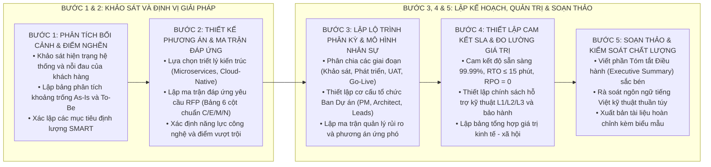

# KỸ NĂNG SOẠN THẢO HỒ SƠ ĐỀ XUẤT GIẢI PHÁP (PROPOSAL-WRITER)

Kỹ năng này hướng dẫn quy trình tiêu chuẩn 5 bước để khảo sát bối cảnh, định vị bài toán, xây dựng phương án kỹ thuật và soạn thảo bộ Hồ sơ Đề xuất Giải pháp (Proposal) hoàn chỉnh, có tính thuyết phục cao và chuẩn hóa theo quy định của các dự án lớn.

---

## 1. QUY TRÌNH 5 BƯỚC SOẠN THẢO PROPOSAL

---

## 2. HƯỚNG DẪN CHI TIẾT TỪNG BƯỚC THỰC HIỆN

### Bước 1: Khảo sát hiện trạng và xác định mục tiêu định lượng
1. Rà soát tài liệu yêu cầu (RFP / TOR / Biên bản làm việc) để bóc tách:
   * Hiện trạng công nghệ và điểm nghẽn nghiệp vụ cần tháo gỡ.
   * Các yêu cầu bắt buộc về an toàn thông tin, bảo mật dữ liệu và hạ tầng.
2. Lập bảng phân tích hiện trạng và khoảng trống (Gap Analysis).
3. Thiết lập các chỉ số mục tiêu định lượng (SMART Goals):
   * Tăng trưởng quy mô phục vụ (ví dụ: sẵn sàng phục vụ 10 triệu người dùng, xử lý 5.000 TPS).
   * Giảm thời gian xử lý nghiệp vụ (ví dụ: từ 3 ngày xuống dưới 5 phút).
   * Tiết kiệm chi phí vận hành (ví dụ: giảm 35% chi phí bảo trì hàng năm).

### Bước 2: Thiết kế phương án kiến trúc và Lập ma trận đáp ứng (Compliance Matrix)
1. Xây dựng sơ đồ kiến trúc giải pháp tổng thể:
   * **Chọn DUY NHẤT 1 sơ đồ phù hợp nhất** trực tiếp dưới tiêu đề (Khuyến nghị sơ đồ Mermaid Flowchart LR 2 cột 4:3 với các block nodes vuông vắn).
   * **Tuyệt đối cấm** đưa các câu chữ, nhãn phương thức hoặc lời giải thích kỹ thuật định dạng vào tài liệu.
2. Lập bảng ma trận đáp ứng yêu cầu (Compliance Matrix) chi tiết 6 cột theo [proposal_authoring_rules.md](file:///Users/micro/Source/chapisoft/mschool/.agents/rules/proposal_authoring_rules.md):
   * `Mã yêu cầu | Hạng mục yêu cầu | Mức độ đáp ứng (C/E/M/N) | Phương án giải pháp | Bằng chứng / Module | Ghi chú`.
3. Làm nổi bật các điểm sáng kỹ thuật vượt trội (Unique Selling Points).

### Bước 3: Lập kế hoạch phân kỳ, cơ cấu nhân sự và ma trận rủi ro
1. Xây dựng lộ trình phân kỳ 4 giai đoạn rõ ràng:
   * Giai đoạn 1: Khảo sát chi tiết, phân tích & thiết kế (SRS, TKCT, LLD).
   * Giai đoạn 2: Phát triển chức năng, tích hợp đối tác & Unit Test.
   * Giai đoạn 3: Kiểm thử tải cao (k6), Pentest an ninh & Nghiệm thu UAT.
   * Giai đoạn 4: Chuyển đổi dữ liệu kế thừa, Đào tạo & Go-Live chính thức.
2. Thiết lập sơ đồ tổ chức ban quản trị dự án, xác định rõ vai trò và trách nhiệm.
3. Lập ma trận rủi ro dự án kèm phương án phòng ngừa chủ động và kế hoạch ứng phó khẩn cấp.

### Bước 4: Thiết lập cam kết SLA và Định lượng hóa giá trị mang lại
1. Thiết lập các chỉ số kỹ thuật cam kết:
   * Uptime hàng năm ≥ `99.99%`.
   * Thời gian khôi phục thảm họa `RTO ≤ 15 phút`, Điểm khôi phục mục tiêu `RPO = 0`.
   * Thời gian phản hồi API P95 < 300ms.
2. Thiết lập quy trình hỗ trợ đa cấp ITIL (L1/L2/L3) và thời gian cam kết xử lý sự cố.
3. Tổng hợp bảng giá trị mang lại (Value Proposition) chứng minh hiệu quả đầu tư.

### Bước 5: Soạn thảo hoàn chỉnh theo Biểu mẫu chuẩn và Rà soát chất lượng
1. Sử dụng biểu mẫu khung [proposal_template.md](./resources/proposal_template.md) để soạn thảo toàn văn.
2. Viết phần Tóm tắt Điều hành (Executive Summary) cô đọng, sắc bén, cuốn hút dành riêng cho Lãnh đạo cấp cao.
3. Rà soát chất lượng theo Quality Gate:
   - [ ] 100% tiếng Việt chuẩn mực, không chèn tiếng Anh đệm trong ngoặc đơn.
   - [ ] Không có icon/emoji trong tiêu đề và bảng biểu.
   - [ ] Ký tự Unicode thuần túy thay thế ký tự LaTeX `$`.
   - [ ] Chỉ có duy nhất 1 sơ đồ kiến trúc phù hợp, không đưa câu chữ chỉ dẫn định dạng vào nội dung.
   - [ ] Sơ đồ Mermaid LR 2 cột 4:3 hiển thị trọn vẹn trong 1 khung nhìn.
   - [ ] Bảng Ma trận đáp ứng yêu cầu và Ma trận rủi ro đầy đủ, chặt chẽ.

---

## 3. TÀI NGUYÊN BỔ TRỢ

* [Quy chuẩn soạn thảo Proposal](file:///Users/micro/Source/chapisoft/mschool/.agents/rules/proposal_authoring_rules.md)
* [Biểu mẫu khung Hồ sơ Đề xuất Giải pháp hoàn chỉnh](./resources/proposal_template.md)
