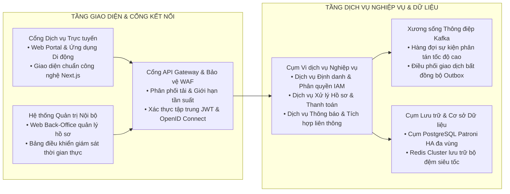

# HỒ SƠ ĐỀ XUẤT GIẢI PHÁP TỔNG THỂ VÀ KẾ HOẠCH TRIỂN KHAI

**DỰ ÁN:** [TÊN HỆ THỐNG / DỰ ÁN ĐỀ XUẤT]  
**ĐƠN VỊ YÊU CẦU / CHỦ ĐẦU TƯ:** [TÊN CƠ QUAN / DOANH NGHIỆP ĐỐI TÁC]  
**ĐƠN VỊ TƯ VẤN & THỰC HIỆN:** [TÊN ĐƠN VỊ ĐỀ XUẤT]  
**PHIÊN BẢN TÀI LIỆU:** V1.0  
**NGÀY PHÁT HÀNH:** [NGÀY/THÁNG/NĂM]  

---

## BẢNG GHI NHẬN THAY ĐỔI TÀI LIỆU

| Ngày thay đổi | Vị trí thay đổi | A*, M, D | Nguồn gốc | Phiên bản cũ | Mô tả thay đổi | Phiên bản mới |
| :--- | :--- | :---: | :--- | :---: | :--- | :---: |
| [DD/MM/YYYY] | Toàn bộ tài liệu | A* | Đề xuất ban đầu | N/A | Khởi tạo hồ sơ đề xuất giải pháp kỹ thuật | V1.0 |

*Ghi chú ký hiệu thao tác:* `A*` – Tạo mới (Add), `M` – Sửa đổi (Modify), `D` – Xóa bỏ (Delete).

---

## PHẦN 1: TÓM TẮT ĐỀ XUẤT ĐIỀU HÀNH (EXECUTIVE SUMMARY)

### 1.1. Thấu hiểu bài toán và Thách thức chiến lược
[Mô tả ngắn gọn bối cảnh và thách thức cốt lõi mà Khách hàng đang đối mặt. Nêu rõ các rào cản về công nghệ cũ, chi phí vận hành gia tăng và áp lực mở rộng quy mô phục vụ.]

### 1.2. Giải pháp đề xuất đột phá
[Trình bày ngắn gọn phương án giải pháp đề xuất. Nêu rõ triết lý kiến trúc hiện đại, khả năng mở rộng không giới hạn và tính sẵn sàng cao.]

### 1.3. Các giá trị cốt lõi mang lại
1. **Tối ưu hóa hiệu năng và năng lực phục vụ:** Đáp ứng xử lý [Số lượng TPS] giao dịch đồng thời với độ trễ P95 < [Số ms].
2. **Tự động hóa và Rút ngắn thời gian xử lý:** Giảm thiểu [Số %] thời gian luân chuyển hồ sơ/nghiệp vụ.
3. **An toàn thông tin cấp độ cao:** Bảo vệ dữ liệu cá nhân theo Nghị định số 13/2023/NĐ-CP, phòng thủ đa lớp theo mô hình Zero Trust.
4. **Cam kết dịch vụ vượt trội:** Độ sẵn sàng hệ thống đạt 99.99%, thời gian khôi phục thảm họa RTO ≤ 15 phút, RPO = 0.

---

## PHẦN 2: BỐI CẢNH, PHÂN TÍCH HIỆN TRẠNG & MỤC TIÊU DỰ ÁN

### 2.1. Phân tích hiện trạng và Khoảng trống năng lực (Gap Analysis)

| Lĩnh vực | Hiện trạng vận hành (As-Is) | Hạn chế & Rủi ro chính | Kỳ vọng mục tiêu (To-Be) |
| :--- | :--- | :--- | :--- |
| **Quy trình nghiệp vụ** | Thao tác thủ công, luân chuyển giấy tờ | Thời gian xử lý kéo dài, nguy cơ thất lạc | Tự động hóa 100% quy trình điện tử |
| **Kiến trúc hệ thống** | Ứng dụng nguyên khối (Monolith) cũ | Khó mở rộng, bảo trì tốn kém, rủi ro sập toàn bộ | Kiến trúc Microservices phân tán, tự phục hồi |
| **Cơ sở dữ liệu** | Đơn lẻ, chưa có phân vùng và dự phòng nóng | Hiệu năng chậm khi dữ liệu lớn, nguy cơ mất dữ liệu | Cụm PostgreSQL Patroni HA, phân vùng và mã hóa |
| **Tích hợp liên thông** | Kết nối thủ công hoặc giao thức cũ | Thiếu chuẩn hóa, không có cơ chế bù trừ lỗi | Cổng API Gateway tập trung, Kafka Event-Driven |

### 2.2. Mục tiêu cụ thể của dự án (SMART Goals)
* **Mục tiêu Nghiệp vụ:** [Chi tiết mục tiêu phục vụ người dùng, chuyển đổi số quy trình].
* **Mục tiêu Kỹ thuật & Hiệu năng:** [Chi tiết mục tiêu tải, độ trễ, khả năng mở rộng].
* **Mục tiêu An toàn Thông tin:** [Chi tiết tiêu chuẩn bảo mật, mã hóa dữ liệu].

---

## PHẦN 3: PHƯƠNG ÁN GIẢI PHÁP ĐỀ XUẤT TỔNG THỂ

### 3.1. Triết lý thiết kế và Nguyên tắc kiến trúc
* **Kiến trúc hướng dịch vụ/vi dịch vụ (Microservices Architecture):** Module hóa độc lập, dễ dàng nâng cấp từng thành phần mà không làm gián đoạn toàn bộ hệ thống.
* **Hướng sự kiện (Event-Driven Architecture):** Sử dụng Apache Kafka làm xương sống truyền thông điệp bất đồng bộ tốc độ cao.
* **Phòng thủ đa tầng (Defense-in-Depth & Zero Trust):** Mã hóa toàn diện dữ liệu lưu trữ (Data-at-Rest) và dữ liệu truyền trên mạng (Data-in-Transit qua mTLS).

### 3.2. Sơ đồ Kiến trúc Giải pháp Tổng thể

### 3.3. Sơ đồ phân rã chức năng và bóc tách phân hệ

```mermaid
flowchart TD
    %% TẦNG GỐC: HỆ THỐNG TỔNG THỂ
    ROOT["HỆ THỐNG GIẢI PHÁP ĐỀ XUẤT TỔNG THỂ"]

    %% TẦNG 1: CÁC PHÂN HỆ CỐT LÕI
    ROOT --> MOD_PORTAL["1. PHÂN HỆ CỔNG DỊCH VỤ<br/>(PORTAL & MOBILE APP)"]
    ROOT --> MOD_OPS["2. PHÂN HỆ TÁC NGHIỆP<br/>(BACK-OFFICE CORE)"]
    ROOT --> MOD_INT["3. PHÂN HỆ TRỤC LIÊN THÔNG<br/>(INTEGRATION HUB)"]
    ROOT --> MOD_BI["4. PHÂN HỆ BÁO CÁO & BI<br/>(DATA ANALYTICS)"]

    %% TẦNG 2: CÁC CHỨC NĂNG CON PHÂN RÃ
    MOD_PORTAL --> P1["1.1. Dịch vụ Công Trực tuyến"]
    MOD_PORTAL --> P2["1.2. Tra cứu Hồ sơ & Tiến độ"]
    MOD_PORTAL --> P3["1.3. Thanh toán Phí/Lệ phí"]

    MOD_OPS --> O1["2.1. Tiếp nhận & Thẩm định Hồ sơ"]
    MOD_OPS --> O2["2.2. Quy trình Phê duyệt Phân cấp"]
    MOD_OPS --> O3["2.3. Ban hành & Ký số Văn bản"]

    MOD_INT --> I1["3.1. Tích hợp Định danh VNeID"]
    MOD_INT --> I2["3.2. Kết nối Cổng Dịch vụ công QG"]
    MOD_INT --> I3["3.3. Tích hợp Thanh toán Ngân hàng"]

    MOD_BI --> B1["4.1. Thu thập & Chuẩn hóa Dữ liệu"]
    MOD_BI --> B2["4.2. Dashboard Giám sát Thời gian thực"]
    MOD_BI --> B3["4.3. Báo cáo Thống kê Định kỳ"]
```

1. **Phân hệ Cổng thông tin & Trải nghiệm Người dùng:** Cung cấp dịch vụ công trực tuyến, tra cứu hồ sơ và thanh toán điện tử.
2. **Phân hệ Quản trị Tác nghiệp Nội bộ:** Tiếp nhận, xử lý, thẩm định, phê duyệt và ban hành hồ sơ.
3. **Phân hệ Tích hợp & Trục chia sẻ Dữ liệu:** Kết nối Trục liên thông quốc gia, Cổng thanh toán ngân hàng và Dịch vụ xác thực VNeID.
4. **Phân hệ Quản trị Dữ liệu & Báo cáo Thông minh:** Thu thập dữ liệu tập trung, phân tích số liệu và xuất báo cáo quản trị.

---

## PHẦN 4: MA TRẬN ĐÁP ỨNG YÊU CẦU KỸ THUẬT & NGHIỆP VỤ (COMPLIANCE MATRIX)

| Mã yêu cầu | Yêu cầu kỹ thuật & nghiệp vụ | Mức độ đáp ứng | Phương án giải pháp thực hiện | Bằng chứng / Module thực thi | Ghi chú |
| :---: | :--- | :---: | :--- | :--- | :--- |
| REQ-01 | Hỗ trợ xác thực đa yếu tố (MFA / Sinh trắc học) | C | Tích hợp giao thức OpenID Connect và xác thực sinh trắc học FIDO2 | Dịch vụ `auth-service`, Module IAM | Chuẩn bảo mật cấp cao |
| REQ-02 | Năng lực chịu tải tối thiểu 5.000 TPS | E | Cụm Microservices trên Kubernetes kết hợp Redis Cluster và Kafka | Bài kiểm thử tải k6 phân tán đạt 8.500 TPS | Vượt yêu cầu |
| REQ-03 | Tích hợp Trục liên thông dữ liệu quốc gia | C | Xây dựng bộ chuyển đổi giao thức chuẩn hóa (SOAP/REST Adapter) | Dịch vụ `integration-hub` | Sẵn sàng kết nối |
| REQ-04 | Khôi phục thảm họa RTO ≤ 15 phút, RPO = 0 | C | Cấu hình 2 Trung tâm dữ liệu DC/DR đồng bộ bán đồng bộ | Mô hình triển khai HA đa vùng | Cam kết trong SLA |

*Quy ước:* `C` - Đáp ứng hoàn toàn; `E` - Vượt yêu cầu; `M` - Tùy biến cấu hình; `N` - Chưa đáp ứng.

---

## PHẦN 5: KẾ HOẠCH TRIỂN KHAI, LỘ TRÌNH PHÂN KỲ & CHUYỂN GIAO

### 5.1. Phương pháp luận triển khai
Áp dụng mô hình kết hợp Agile/Scrum (phát triển các chặng tính năng 2 tuần/Sprint) và kiểm soát chất lượng theo cổng nghiệm thu Waterfall (Quality Gates) cho các mốc bàn giao lớn.

### 5.2. Lộ trình phân kỳ triển khai chi tiết

| Giai đoạn | Thời gian | Hạng mục công việc chính | Sản phẩm bàn giao (Deliverables) | Tiêu chí nghiệm thu |
| :---: | :---: | :--- | :--- | :--- |
| **Giai đoạn 1** | Tuần 1 - 4 | Khảo sát chi tiết, phân tích yêu cầu và thiết kế kỹ thuật | • Tài liệu SRS / TKCT • Tài liệu LLD 11 phần • Tài liệu Kiến trúc Hệ thống | Được Hội đồng Kỹ thuật và Chủ đầu tư phê duyệt |
| **Giai đoạn 2** | Tuần 5 - 14 | Phát triển mã nguồn, xây dựng cơ sở dữ liệu và tích hợp API | • Bộ mã nguồn hệ thống • Kết quả kiểm thử Unit Test 100% Pass • Biên bản tích hợp đối tác | Hoàn tất tích hợp cổng ngoài và chạy thông suốt nội bộ |
| **Giai đoạn 3** | Tuần 15 - 18 | Kiểm thử tải cao, Pentest an ninh mạng và Nghiệm thu UAT | • Báo cáo kiểm thử tải k6 • Báo cáo Pentest an ninh • Biên bản nghiệm thu UAT | Đạt chỉ số TPS/SLA và không còn lỗi bảo mật mức High/Critical |
| **Giai đoạn 4** | Tuần 19 - 22 | Chuyển đổi dữ liệu, Đào tạo chuyển giao và Go-Live chính thức | • Dữ liệu đã chuyển đổi 100% • Tài liệu hướng dẫn sử dụng • Biên bản Go-Live hệ thống | Hệ thống vận hành chính thức ổn định trên Production |

---

## PHẦN 6: MÔ HÌNH TỔ CHỨC NHÂN SỰ, QUẢN TRỊ DỰ ÁN & QUẢN LÝ RỦI RO

### 6.1. Cơ cấu tổ chức Ban Quản trị Dự án
* **Ban Chỉ đạo Dự án (Project Steering Committee):** Định hướng chiến lược, giải quyết các vướng mắc về cơ chế và ngân sách.
* **Giám đốc Dự án (Project Manager):** Chịu trách nhiệm toàn diện về tiến độ, chất lượng, chi phí và giao tiếp với Chủ đầu tư.
* **Kiến trúc sư Trưởng (Chief Solution Architect):** Chịu trách nhiệm về thiết kế kỹ thuật, chuẩn công nghệ và bảo đảm tính toàn vẹn hệ thống.
* **Trưởng nhóm Nghiệp vụ (BA Lead):** Chịu trách nhiệm đặc tả yêu cầu chi tiết (SRS) và nghiệm thu chức năng nghiệp vụ.
* **Trưởng nhóm Phát triển (Dev Lead):** Điều phối đội ngũ kỹ sư Backend, Frontend, DevOps xây dựng mã nguồn.
* **Trưởng nhóm Đảm bảo Chất lượng (QA/QC Lead):** Xây dựng kịch bản kiểm thử, thực thi kiểm thử chức năng, kiểm thử tải và nghiệm thu.

### 6.2. Ma trận quản lý rủi ro dự án

| Mã rủi ro | Mô tả rủi ro | Mức độ | Xác suất | Biện pháp phòng ngừa chủ động | Phương án ứng phó khẩn cấp |
| :---: | :--- | :---: | :---: | :--- | :--- |
| R-01 | Thay đổi yêu cầu nghiệp vụ trong quá trình phát triển | Trung bình | Cao | Áp dụng quy trình Quản lý Thay đổi (Change Request) chặt chẽ | Đánh giá tác động tiến độ/chi phí trước khi phê duyệt thay đổi |
| R-02 | Trục trặc hoặc quá tải kết nối với API dịch vụ ngoài | Cao | Trung bình | Thiết kế bộ đệm Redis và Circuit Breaker tự ngắt an toàn | Kích hoạt hàng đợi Retry và ghi nhận log phục vụ đối soát |
| R-03 | Sai lệch dữ liệu khi chuyển đổi từ hệ thống cũ | Cao | Cao | Chạy thử nghiệm ETL và đối soát chéo số học 100% | Giữ nguyên bản sao lưu (Backup snapshot) để quay lui khi cần |

---

## PHẦN 7: CAM KẾT CHẤT LƯỢNG DỊCH VỤ (SLA) & GIÁ TRỊ MANG LẠI

### 7.1. Cam kết Mức độ Sẵn sàng & Chỉ số Kỹ thuật (SLA)
* **Độ sẵn sàng dịch vụ (Service Uptime):** Cam kết tối thiểu `99.99%` trong suốt thời gian vận hành.
* **Thời gian khôi phục thảm họa (Disaster Recovery):** `RTO ≤ 15 phút`, `RPO = 0` (Zero Data Loss).
* **Thời gian phản hồi kỹ thuật:**
  * Sự cố Cấp 1 (Hệ thống ngừng hoạt động hoàn toàn): Phản hồi trong 15 phút, giải quyết tạm thời trong 1 giờ, khắc phục triệt để trong 2 giờ.
  * Sự cố Cấp 2 (Ảnh hưởng chức năng quan trọng nhưng hệ thống vẫn chạy): Phản hồi trong 30 phút, khắc phục trong 4 giờ.
  * Sự cố Cấp 3 (Lỗi nhỏ không ảnh hưởng vận hành cốt lõi): Khắc phục trong vòng 24 giờ.

### 7.2. Tổng kết Giá trị và Hiệu quả Đầu tư
[Tổng hợp ngắn gọn các giá trị chiến lược, xã hội và hiệu quả tài chính mà dự án mang lại cho tổ chức, khẳng định sự sẵn sàng và cam kết đồng hành lâu dài của Đơn vị thực hiện.]
