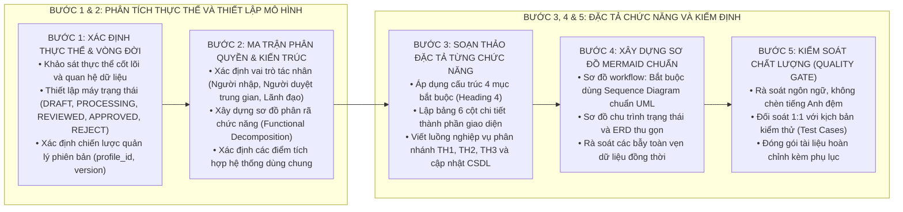

# KỸ NĂNG SOẠN THẢO TÀI LIỆU SRS VÀ THIẾT KẾ CHI TIẾT (SRS-AUTHORING)

Kỹ năng này hướng dẫn quy trình tiêu chuẩn 5 bước để phân tích yêu cầu, mô hình hóa nghiệp vụ và xây dựng tài liệu SRS / TKCT hoàn chỉnh, chuẩn hóa 100% theo phương pháp luận từ tài liệu mẫu chuẩn.

---

## 1. QUY TRÌNH 5 BƯỚC SOẠN THẢO TÀI LIỆU SRS

---

## 2. HƯỚNG DẪN CHI TIẾT TỪNG BƯỚC THỰC HIỆN

### Bước 1: Phân tích thực thể cốt lõi và máy trạng thái (State Machine)
1. Xác định đối tượng trung tâm của phân hệ (ví dụ: hồ sơ Liệt sĩ, hợp đồng, giao dịch thanh toán).
2. Thiết lập chu trình chuyển trạng thái của đối tượng:
   * Trạng thái khởi tạo: `DRAFT` (Lưu nháp).
   * Trạng thái trình duyệt: `PROCESSING` (Chờ duyệt trung gian).
   * Trạng thái đã xem xét: `REVIEWED` (Đã xác nhận cấp phòng ban).
   * Trạng thái có hiệu lực: `APPROVED` (Đã duyệt chính thức).
   * Trạng thái từ chối: `REJECT` (Từ chối).
3. Xác định cơ chế khóa (`lock = TRUE/FALSE`) và cờ công bố (`is_public = TRUE/FALSE`).
4. Thiết lập quy tắc phiên bản: Khi chỉnh sửa hồ sơ đã duyệt, không ghi đè mà tạo bản ghi mới kế thừa `profile_id` với `version = version + 1`.

### Bước 2: Xây dựng ma trận phân quyền và sơ đồ phân rã
1. Lập danh sách các tác nhân (Actors): Chuyên viên lập hồ sơ, Cán bộ thẩm tra trung gian, Thủ trưởng phê duyệt, Quản trị viên hệ thống.
2. Xây dựng cây phân rã chức năng theo chu trình sống hoàn chỉnh:
   * Nhóm tra cứu & hiển thị: Xem danh sách mặc định, Xem theo Tab, Tìm kiếm nhanh, Tìm kiếm nâng cao, Xem chi tiết.
   * Nhóm nhập liệu & cập nhật: Thêm mới hồ sơ, Chỉnh sửa hồ sơ, Xóa hồ sơ.
   * Nhóm trao đổi dữ liệu: Nhập dữ liệu từ Excel (Import), Xuất dữ liệu ra Excel (Export).
   * Nhóm quy trình phê duyệt: Gửi phê duyệt (đơn lẻ / hàng loạt), Từ chối duyệt (cấp trung gian / lãnh đạo), Phê duyệt (cấp trung gian / lãnh đạo), Phản hồi hồ sơ.
   * Nhóm quản trị: Khóa / Mở khóa hồ sơ.

### Bước 3: Soạn thảo chi tiết từng chức năng theo Mẫu 4 mục
Áp dụng mẫu chuẩn [function_template.md](./resources/function_template.md) cho từng chức năng (Heading 3):
1. **Thông tin chung chức năng (Heading 4):** Nêu mục đích, trạng thái hồ sơ cho phép thao tác, đường dẫn thao tác (trường hợp đơn lẻ và hàng loạt), quy định ghi log và phân quyền.
2. **Màn hình (Heading 4):** Nêu hình ảnh giao diện, các trạng thái mặc định, trống dữ liệu, popup xác nhận, toast thông báo.
3. **Mô tả chi tiết các thành phần (Heading 4):** Lập bảng 6 cột chuẩn: `STT | Tên * | Kiểu dữ liệu [Độ dài] | Input/Output | Giá trị khởi tạo | Mô tả (Mapping CSDL, Validate, Behavior)`.
4. **Luồng nghiệp vụ (Heading 4):** Trình bày các bước 1..N, các nhánh `TH1: Hợp lệ/Có dữ liệu`, `TH2: Không hợp lệ/Lỗi nhập liệu`, `TH3: Trùng định danh/Bẫy dữ liệu`, tương tác nút trong popup, chi tiết cập nhật trường CSDL, toast phản hồi và **Sơ đồ tuần tự (Sequence Diagram)** chuẩn UML mô hình hóa chi tiết tương tác Người dùng - FE - BE - CSDL.

### Bước 4: Tích hợp sơ đồ Mermaid đạt chuẩn toàn cục
Tham khảo kho mẫu [diagram_templates.md](./references/diagram_templates.md):
* **Sơ đồ Phân rã Chức năng (Functional Decomposition):** Bắt buộc dùng **Mô hình Dạng Cây Ngang 3 Tầng (`flowchart LR`)**. Tên hệ thống gốc ở Cột 1 bên trái, rẽ nhánh sang các nhóm chức năng cấp 1 ở Cột 2 (bắt buộc đồng bộ độ dài ký tự và không dùng ` ` để dóng thẳng hàng lề trái), tiếp tục rẽ nhánh sang các ô chức năng con độc lập ở Cột 3 với `rankSpacing: 140`, `nodeSpacing: 8` và `curve: 'basis'`. Tuyệt đối không dùng `~~~` hay cố định CSS `width`.
* **Sơ đồ Máy trạng thái (State Machine):** Dùng `flowchart LR` với 2 cột `subgraph` song song (`direction TB`), tỷ lệ 4:3.
* **Sơ đồ ERD:** Chỉ vẽ quan hệ thực thể mức cao; danh mục trường chi tiết trình bày bằng Bảng Markdown tiêu chuẩn.

### Bước 5: Kiểm soát chất lượng tài liệu (Quality Gate Checklist)
Trước khi bàn giao tài liệu, thực hiện kiểm tra chéo các tiêu chí:
- [ ] **Ngôn ngữ:** 100% tiếng Việt chuyên nghiệp, không có từ tiếng Anh đệm trong ngoặc đơn.
- [ ] **Biểu tượng:** Không có icon/emoji rác trong các tiêu đề đề mục và bảng.
- [ ] **Toán học & Ký tự:** Sử dụng ký tự Unicode thuần túy (`→`, `×`, `≤`, `≥`), không có dấu `$`.
- [ ] **Bảng thành phần:** Đủ 6 cột chuẩn, có dấu `*` ở các trường bắt buộc, có mapping CSDL `table.column`.
- [ ] **Luồng nghiệp vụ & Sơ đồ Workflow:** Có sơ đồ **Sequence Diagram chuẩn mực** với đường nét dóng thẳng, khối `alt/else`, hộp `activate/deactivate`, không dùng nét vẽ cong tùy tiện. Đủ các trường hợp `TH1`, `TH2`, `TH3`, mô tả rõ popup hủy bỏ/xác nhận và câu lệnh cập nhật CSDL.
- [ ] **Bẫy toàn vẹn dữ liệu:** Có kiểm tra trùng lặp khóa duy nhất (CCCD/CMND), bẫy tranh chấp phiên bản khi duyệt đồng thời.
- [ ] **Khả năng bóc tách kiểm thử:** Đảm bảo đội ngũ QA/QC có thể đọc tài liệu và viết ngay kịch bản kiểm thử 1:1 (như cấu trúc trong `Testcse_demo.xlsx`).

---

## 3. DANH MỤC TÀI LIỆU THAM KHẢO VÀ TÀI NGUYÊN BỔ TRỢ

* [Cấu trúc khung tài liệu SRS chuẩn](./references/document_structure.md)
* [Thư viện mẫu sơ đồ Mermaid 4:3 LR 2 cột](./references/diagram_templates.md)
* [Biểu mẫu 4 mục cho một chức năng](./resources/function_template.md)
* [Khung sườn tài liệu SRS hoàn chỉnh](./resources/srs_full_template.md)
* [Ví dụ đặc tả chức năng mẫu hoàn chỉnh](./examples/sample_function_spec.md)
