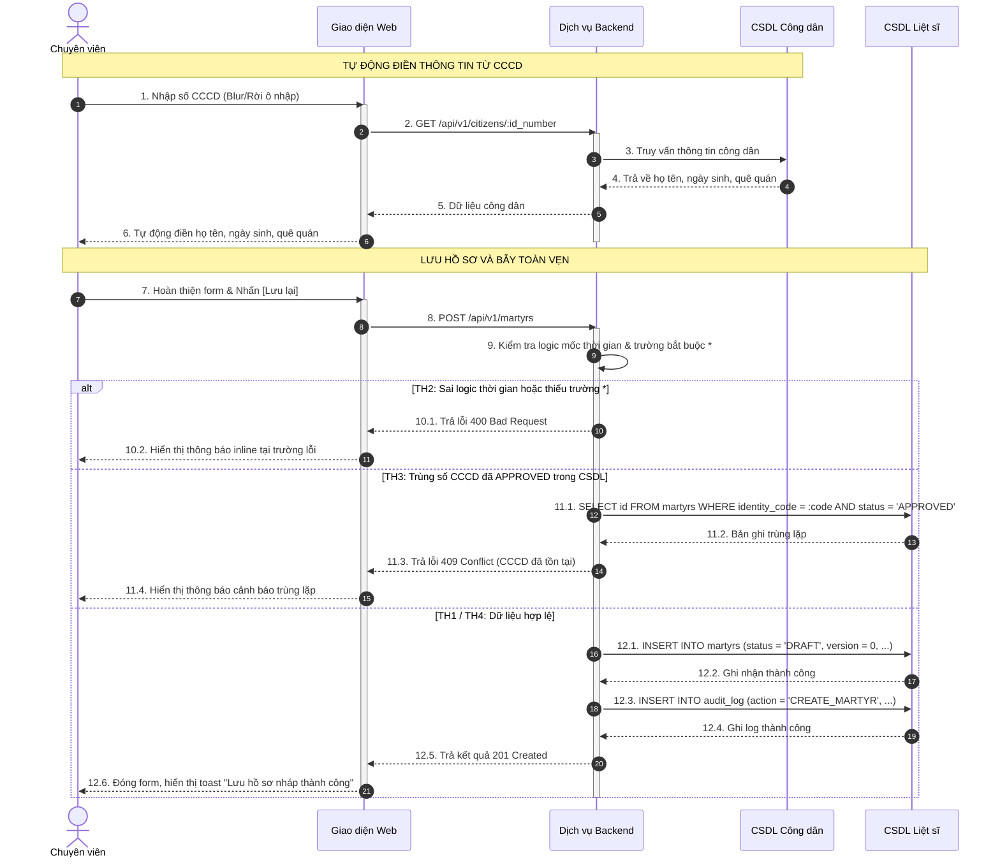
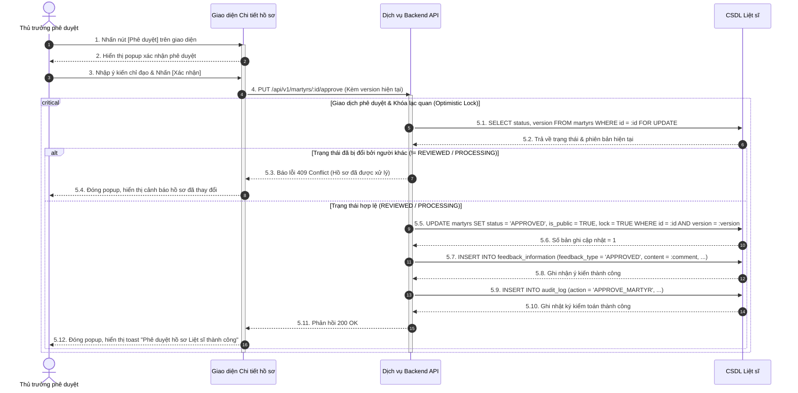

# VÍ DỤ ĐẶC TẢ CHỨC NĂNG MẪU HOÀN CHỈNH (SAMPLE FUNCTION SPECIFICATION)

Tài liệu này cung cấp 2 ví dụ đặc tả hoàn chỉnh cho 2 chức năng nghiệp vụ then chốt: **"Thêm mới thông tin Liệt sĩ"** và **"Phê duyệt thông tin Liệt sĩ"**, được xây dựng chuẩn mực theo đúng quy cách thiết kế chi tiết thực tế.

---

## VÍ DỤ 1: ĐẶC TẢ CHỨC NĂNG THÊM MỚI HỒ SƠ

### Heading 3: Thêm mới thông tin Liệt sĩ

#### Thông tin chung chức năng
* **Mục đích chức năng:** Chức năng này cho phép người dùng có vai trò Chuyên viên / Trợ lý tạo mới một hồ sơ Liệt sĩ vào hệ thống.
* **Điều kiện tiên quyết / Trạng thái áp dụng:** Người dùng đã đăng nhập hệ thống và được cấp quyền tạo mới hồ sơ.
* **Đường dẫn thao tác:**
  * Đăng nhập hệ thống → Truy cập menu "Liệt sĩ" → Danh sách thông tin Liệt sĩ → Nhấn nút [[Thêm mới]].
* **Ghi log:** Tham khảo mục Quy định về ghi nhật ký hệ thống trong Tài liệu Common (ghi nhận `action = 'CREATE_MARTYR'`, `user_id`, `created_date = NOW()`, `ip_address`).
* **Phân quyền:** Tham chiếu ma trận phân quyền trong tài liệu Phân quyền chức năng (vai trò Chuyên viên nghiệp vụ, Quản trị viên).

#### Màn hình
* **Màn hình Thêm mới thông tin Liệt sĩ:**
  *(Chèn hình ảnh giao diện form nhập liệu từ Figma: bao gồm các khối Thông tin nhân thân, Quê quán, Quá trình công tác, Mốc hy sinh, Tệp đính kèm và nhóm nút thao tác)*
* **Hộp thoại xác nhận gửi phê duyệt:**
  *(Chèn ảnh popup xác nhận có danh sách dropdown chọn Cán bộ phê duyệt trung gian)*

#### Mô tả chi tiết các thành phần
| STT | Tên | Kiểu dữ liệu [Độ dài dữ liệu] | Input/Output | Giá trị khởi tạo | Mô tả (Mapping với CSDL nếu có) |
| :---: | :--- | :--- | :---: | :---: | :--- |
| 1 | Số CMND/CCCD * | Textbox(20) | INPUT | Để trống | • Trường bắt buộc. • Chỉ cho phép nhập ký tự số từ 9 đến 12 chữ số. • Khi nhập xong hoặc rời khỏi ô nhập (blur), tự động gọi CSDL công dân `citizen` theo `citizen.id_number`. Nếu tìm thấy, tự động điền các trường: Họ và tên, Ngày sinh, Giới tính, Quê quán, Nơi thường trú. • Lưu vào `martyrs.identity_code`. |
| 2 | Họ và tên * | Textbox(255) | INPUT | Để trống | • Trường bắt buộc. • Nhập họ và tên đầy đủ, tự động chuẩn hóa viết hoa chữ cái đầu. • Lưu vào `martyrs.full_name`. |
| 3 | Giới tính * | Dropdown | INPUT | Để trống | • Trường bắt buộc. • Giá trị: Nam, Nữ. • Lưu vào `martyrs.gender`. |
| 4 | Ngày sinh * | Datepicker | INPUT | Để trống | • Trường bắt buộc. • Định dạng: `dd/MM/yyyy`. • Ràng buộc: `Ngày sinh < Ngày nhập ngũ ≤ Ngày hy sinh ≤ Ngày cấp bằng ≤ Ngày hiện tại`. • Lưu vào `martyrs.birth_date`. |
| 5 | Ngày nhập ngũ * | Datepicker | INPUT | Để trống | • Trường bắt buộc. • Định dạng: `dd/MM/yyyy`. • Ràng buộc logic mốc thời gian như trên. • Lưu vào `martyrs.enlistment_date`. |
| 6 | Ngày hy sinh * | Datepicker | INPUT | Để trống | • Trường bắt buộc. • Định dạng: `dd/MM/yyyy`. • Ràng buộc logic mốc thời gian như trên. • Lưu vào `martyrs.sacrifice_date`. |
| 7 | Cấp bậc khi hy sinh * | Dropdown | INPUT | Để trống | • Trường bắt buộc. • Dữ liệu lấy từ danh mục `DanhMucCapBac` (`status = Active`) qua API `/api/category-data/dropdown?categoryGroupCode=DanhMucCapBac`. • Chỉ chọn 1 giá trị. • Lưu vào `martyrs.rank_code`. |
| 8 | Chức vụ khi hy sinh * | Dropdown | INPUT | Để trống | • Trường bắt buộc. • Dữ liệu lấy từ danh mục `DanhMucChucVu` (`status = Active`). • Lưu vào `martyrs.position_code`. |
| 9 | Quê quán (Tỉnh/TP) * | Dropdown | INPUT | Để trống | • Trường bắt buộc. • Lấy từ `DanhMucHanhChinh` cấp Tỉnh/Thành phố. • Khi thay đổi giá trị, tự động tải lại danh sách Xã/Phường tương ứng. • Lưu vào `martyrs.hometown_province_code`. |
| 10 | Quê quán (Xã/Phường) * | Dropdown | INPUT | Để trống | • Trường bắt buộc. • Lấy theo `parent_id` của Tỉnh/TP đã chọn. • Lưu vào `martyrs.hometown_ward_code`. |
| 11 | Tệp đính kèm | Upload file | INPUT | Để trống | • Định dạng cho phép: `.pdf`, `.png`, `.jpg`, `.docx`. Dung lượng tối đa: 20MB/tệp. • Lưu thông tin tệp vào bảng `attachment_files`. |
| 12 | Hủy bỏ | Button | INPUT | N/A | • Khi click: Hiển thị popup xác nhận hủy thao tác. Nếu người dùng chọn Đồng ý → Đóng form và quay về màn hình danh sách. |
| 13 | Lưu lại | Button | INPUT | N/A | • Kích hoạt luồng kiểm tra dữ liệu và lưu hồ sơ ở trạng thái Lưu nháp (`status = DRAFT`). |
| 14 | Gửi phê duyệt | Button | INPUT | N/A | • Kích hoạt luồng kiểm tra dữ liệu và mở popup chọn cán bộ duyệt trung gian, chuyển trạng thái sang `status = PROCESSING`. |

#### Luồng nghiệp vụ
1. Người dùng đăng nhập hệ thống → Truy cập menu "Liệt sĩ" → Nhấn button `[Thêm mới]`.
2. Hệ thống hiển thị giao diện màn hình Thêm mới thông tin Liệt sĩ với các trường ở trạng thái rỗng ban đầu, con trỏ chuột tự động focus vào trường "Số CMND/CCCD".
3. Người dùng nhập số định danh CCCD:
   * Hệ thống truy vấn CSDL công dân `citizen`: Nếu tồn tại bản ghi khớp `citizen.id_number`, hệ thống tự động trích xuất và hiển thị dữ liệu Họ và tên, Ngày sinh, Giới tính, Quê quán.
4. Người dùng tiếp tục nhập/chọn các trường thông tin còn lại theo biểu mẫu.
5. **Trường hợp người dùng nhấn button [Lưu lại]:**
   * Hệ thống thực hiện kiểm tra tính hợp lệ của dữ liệu:
     * `TH1 (Bỏ trống trường bắt buộc):` Hệ thống dừng thực hiện, đánh dấu viền đỏ trường lỗi và hiển thị thông báo inline: *"Đồng chí chưa nhập đầy đủ các trường thông tin bắt buộc có dấu \*"*.
     * `TH2 (Sai quy tắc logic mốc thời gian):` Nếu vi phạm thứ tự `Ngày sinh < Ngày nhập ngũ ≤ Ngày hy sinh ≤ Ngày cấp giấy chứng nhận ≤ Ngày cấp bằng ≤ Ngày hiện tại`, hiển thị thông báo inline: *"Đồng chí nhập sai thứ tự các mốc thời gian. Đề nghị kiểm tra lại theo quy định"*.
     * `TH3 (Trùng số CCCD đã được duyệt):` Hệ thống truy vấn bảng `martyrs`: nếu đã tồn tại bản ghi có `martyrs.identity_code` trùng khớp và `martyrs.status = APPROVED` (với `is_deleted = FALSE`), hệ thống từ chối lưu và hiển thị thông báo: *"Liệt sĩ với số CMND/CCCD [Số_CCCD] đã tồn tại trong hệ thống"*.
     * `TH4 (Dữ liệu hợp lệ):` Hệ thống tạo mới 01 bản ghi trong bảng `martyrs` với các giá trị:
       * `profile_id`: Sinh mã định danh hồ sơ duy nhất (UUID).
       * `version`: 0.
       * `status`: `'DRAFT'`.
       * `is_public`: `FALSE`.
       * `lock`: `FALSE`.
       * `is_deleted`: `FALSE`.
       * `created_by`: Tài khoản của chuyên viên đang thao tác.
       * `created_date`: `NOW()`.
     * Ghi nhật ký hệ thống vào bảng `audit_log`.
     * Hiển thị thông báo toast: *"Lưu hồ sơ nháp thành công"*, chuyển hướng về màn hình Danh sách Liệt sĩ.
6. **Trường hợp người dùng nhấn button [Gửi phê duyệt]:**
   * Hệ thống thực hiện kiểm tra tính hợp lệ dữ liệu như Bước 5.
   * Nếu dữ liệu hợp lệ, hệ thống hiển thị popup "Gửi phê duyệt thông tin Liệt sĩ" yêu cầu chọn "Cán bộ duyệt trung gian" và nhập "Ý kiến đề nghị" (nếu có).
   * Người dùng chọn Cán bộ duyệt trung gian và nhấn `[Xác nhận]`:
     * Tạo mới 01 bản ghi trong bảng `martyrs` với: `status = 'PROCESSING'`, `version = 0`, `is_public = FALSE`, `lock = FALSE`, lưu định danh người duyệt vào `intmdt_approver`.
     * Ghi nhật ký vào `audit_log`.
     * Hiển thị toast thông báo: *"Gửi phê duyệt hồ sơ thành công"*, đẩy thông báo thông tin đến tài khoản người duyệt trung gian.

##### Sơ đồ tuần tự chức năng Thêm mới thông tin Liệt sĩ

---

## VÍ DỤ 2: ĐẶC TẢ CHỨC NĂNG PHÊ DUYỆT HỒ SƠ

### Heading 3: Phê duyệt thông tin Liệt sĩ

#### Thông tin chung chức năng
* **Mục đích chức năng:** Chức năng này cho phép người dùng có thẩm quyền Lãnh đạo / Chỉ huy thực hiện phê duyệt chính thức hồ sơ Liệt sĩ để công bố dữ liệu và xác lập giá trị pháp lý trên hệ thống.
* **Điều kiện tiên quyết / Trạng thái áp dụng:** Hồ sơ phải ở trạng thái Đã xem xét (`martyrs.status = REVIEWED`) đối với quy trình 2 cấp duyệt, hoặc Chờ duyệt (`martyrs.status = PROCESSING`) đối với quy trình 1 cấp duyệt.
* **Đường dẫn thao tác:**
  * *Trường hợp 1 (Phê duyệt đơn lẻ):* Đăng nhập hệ thống → Menu "Phê duyệt hồ sơ" (hoặc menu "Liệt sĩ") → Mở chi tiết hồ sơ → Nhấn button [[Phê duyệt]].
  * *Trường hợp 2 (Phê duyệt hàng loạt):* Đăng nhập hệ thống → Menu "Phê duyệt hồ sơ" → Tích chọn nhiều hồ sơ có trạng thái hợp lệ → Nhấn button [[Phê duyệt]] phía trên bảng danh sách.
* **Ghi log:** Tham khảo mục Quy định ghi log trong Tài liệu Common (ghi nhận `action = 'APPROVE_MARTYR'`, `user_id`, `created_date = NOW()`, `ip_address`).
* **Phân quyền:** Tham chiếu ma trận phân quyền (chỉ dành cho vai trò Thủ trưởng / Lãnh đạo cấp cao).

#### Màn hình
* **Màn hình Phê duyệt hồ sơ chi tiết:**
  *(Chèn ảnh giao diện chi tiết hồ sơ, hiển thị đầy đủ lịch sử thẩm tra của cấp trung gian và nút [Phê duyệt], [Từ chối])*
* **Hộp thoại xác nhận Phê duyệt:**
  *(Chèn ảnh popup xác nhận hành động phê duyệt có ô nhập ý kiến chỉ đạo)*

#### Mô tả chi tiết các thành phần
| STT | Tên | Kiểu dữ liệu [Độ dài dữ liệu] | Input/Output | Giá trị khởi tạo | Mô tả (Mapping với CSDL nếu có) |
| :---: | :--- | :--- | :---: | :---: | :--- |
| 1 | Thông tin hồ sơ | Form view | OUTPUT | N/A | • Hiển thị toàn bộ thông tin chi tiết của liệt sĩ từ bảng `martyrs`. • Toàn bộ các trường ở chế độ chỉ đọc (Read-only). |
| 2 | Lịch sử thẩm tra | Table | OUTPUT | N/A | • Hiển thị ý kiến và thời gian xác nhận của Cán bộ duyệt trung gian từ bảng `feedback_information`. |
| 3 | Ý kiến phê duyệt | Textarea(500) | INPUT | Để trống | • Trường không bắt buộc trong popup xác nhận. • Nhập ý kiến kết luận của thủ trưởng. • Lưu vào `feedback_information.content`. |
| 4 | Từ chối | Button | INPUT | N/A | • Nhấn nút: Mở popup yêu cầu nhập Lý do từ chối (bắt buộc), chuyển trạng thái hồ sơ về `status = REJECT`. |
| 5 | Phê duyệt | Button | INPUT | N/A | • Nhấn nút: Mở popup xác nhận phê duyệt hồ sơ chính thức. |

#### Luồng nghiệp vụ
1. Người dùng (Thủ trưởng) đăng nhập hệ thống → Truy cập menu "Phê duyệt hồ sơ".
2. Hệ thống hiển thị danh sách các hồ sơ đang chờ phê duyệt:
   * *TH1 (Có bản ghi chờ duyệt):* Hiển thị danh sách các hồ sơ có `status = REVIEWED` (hoặc `status = PROCESSING`).
   * *TH2 (Không có bản ghi):* Hiển thị thông báo "Không có hồ sơ chờ phê duyệt".
3. Thủ trưởng chọn xem chi tiết một hồ sơ, kiểm tra toàn bộ thông tin và lịch sử thẩm định.
4. Thủ trưởng nhấn button `[Phê duyệt]`:
5. Hệ thống hiển thị popup xác nhận: *"Đồng chí có chắc chắn muốn phê duyệt hồ sơ Liệt sĩ [Họ và tên] (Số định danh: [Số CCCD])?"*:
   * *Nhấn button [Hủy bỏ]:* Đóng popup, không thực hiện thay đổi dữ liệu.
   * *Nhấn button [Xác nhận]:*
     * Hệ thống thực hiện kiểm tra khóa phân tán / bẫy xung đột dữ liệu đồng thời:
       * Kiểm tra trạng thái hiện tại trong CSDL: `SELECT status, version FROM martyrs WHERE id = :id FOR UPDATE`.
       * Nếu trạng thái bản ghi đã bị thay đổi trước đó (không còn là `REVIEWED` / `PROCESSING`), hệ thống dừng luồng và báo lỗi: *"Hồ sơ đã được xử lý bởi người dùng khác hoặc không còn ở trạng thái chờ duyệt"*.
     * **Đối với hồ sơ tạo mới (version = 0):**
       * Cập nhật bản ghi trong bảng `martyrs`:
         * `status = 'APPROVED'`
         * `is_public = TRUE` (chính thức công bố dữ liệu toàn hệ thống)
         * `lock = TRUE` (khóa chỉnh sửa trực tiếp)
         * `approved_by = [user_hien_tai]`
         * `approved_date = NOW()`
         * `updated_by = [user_hien_tai]`
         * `updated_date = NOW()`
     * **Đối với hồ sơ chỉnh sửa (version > 0):**
       * Cập nhật bản ghi mới: `status = 'APPROVED'`, `is_public = TRUE`, `lock = TRUE`, `approved_by = [user_hien_tai]`, `approved_date = NOW()`.
       * Cập nhật bản ghi phiên bản liền trước (`version = version_moi - 1` có cùng `profile_id`): `is_public = FALSE` (để chỉ hiển thị bản ghi mới nhất trên các màn hình tra cứu công khai).
     * Ghi nhận lịch sử phê duyệt vào bảng `feedback_information` với `feedback_type = 'APPROVED'`.
     * Ghi nhật ký kiểm toán vào bảng `audit_log`.
6. Hệ thống đóng popup, hiển thị toast thông báo: *"Phê duyệt hồ sơ Liệt sĩ thành công"*, làm mới danh sách hồ sơ chờ duyệt.

##### Sơ đồ tuần tự chức năng Phê duyệt thông tin Liệt sĩ

