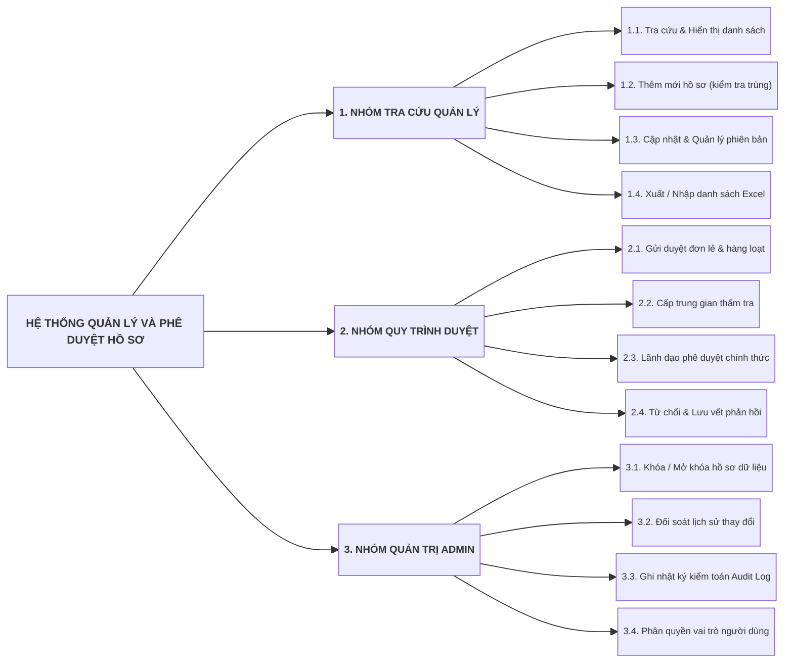
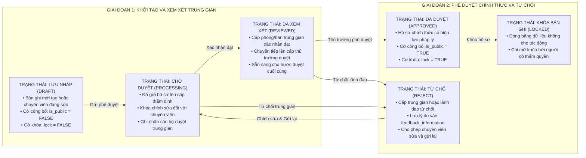
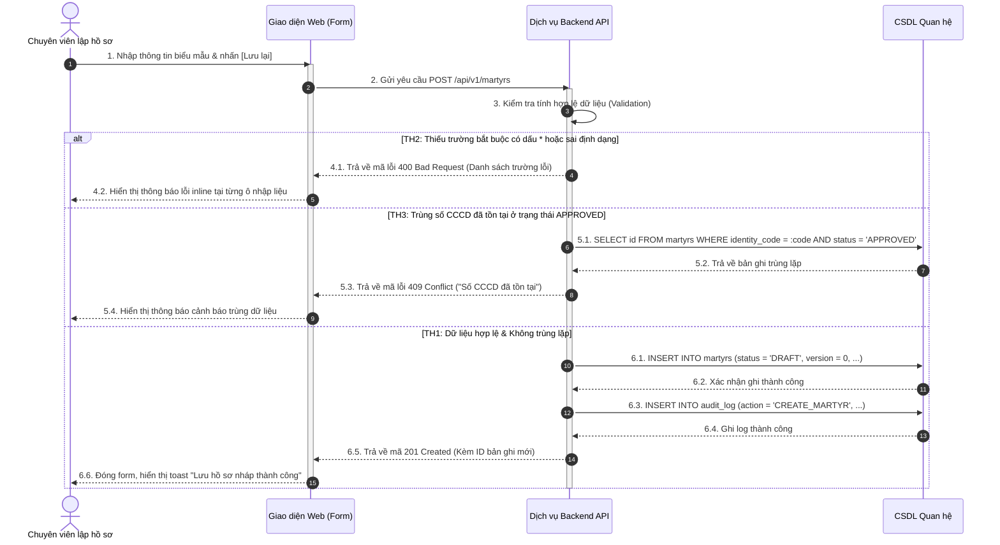
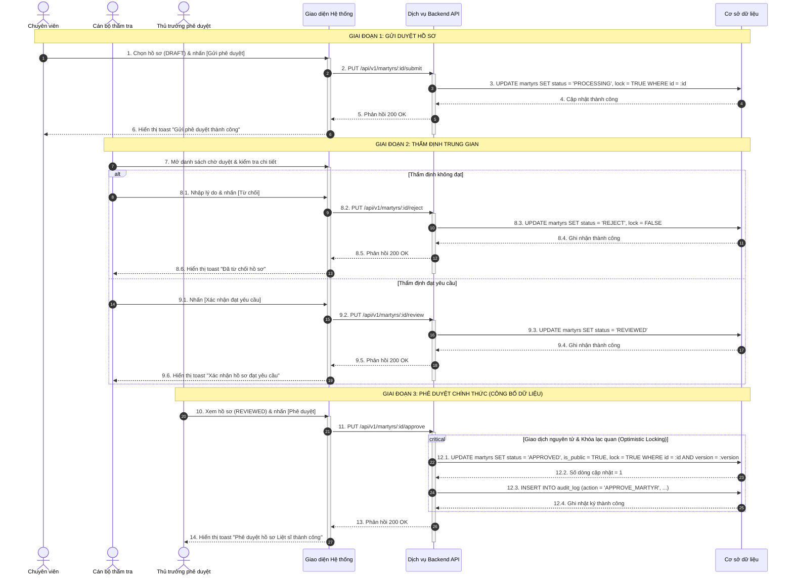
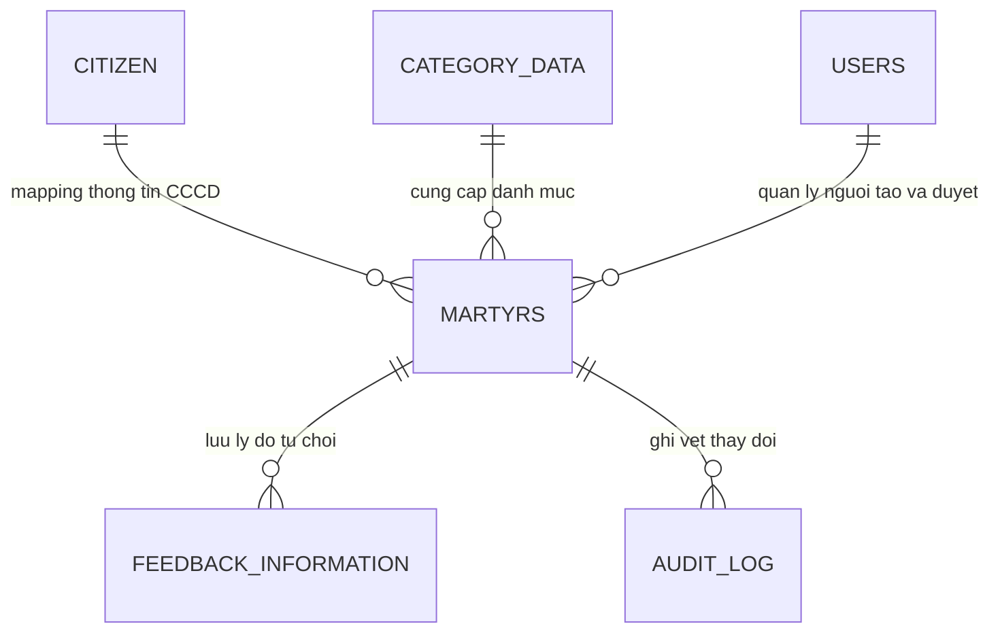
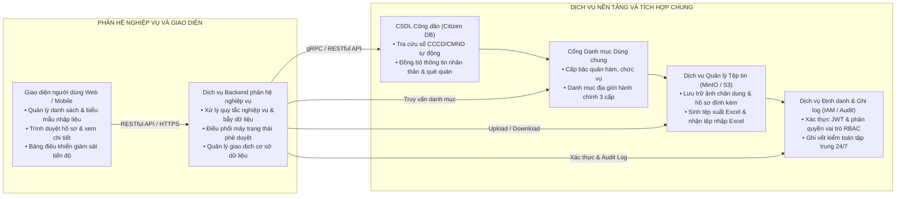

# THƯ VIỆN MẪU SƠ ĐỒ MERMAID CHUẨN CHO TÀI LIỆU SRS

Tài liệu này cung cấp các mẫu sơ đồ Mermaid chuẩn mực đã được tối ưu hóa hiển thị theo tỷ lệ 4:3, dàn trải 2 cột song song bằng `flowchart LR`, nút dạng khối hộp vuông vắn, chống tràn trang và không làm treo công cụ xem trước Markdown Preview.

---

## 1. MẪU SƠ ĐỒ PHÂN RÃ CHỨC NĂNG DẠNG CÂY (FUNCTIONAL DECOMPOSITION TREE)

Dùng ở phần Tổng quan hệ thống hoặc đầu mỗi phân hệ để thể hiện cấu trúc cây chức năng phân cấp 3 tầng ngang (`flowchart LR`), các ô ôm sát chữ với khoảng đệm cân đối, dóng thẳng tắp lề trái:

---

## 2. MẪU SƠ ĐỒ CHU TRÌNH TRẠNG THÁI DỮ LIỆU (STATE MACHINE DIAGRAM)

Dùng để mô hình hóa vòng đời của đối tượng từ khi khởi tạo đến khi phê duyệt hoặc khóa:

---

## 3. MẪU SƠ ĐỒ WORKFLOW CHUẨN MỰC (SEQUENCE DIAGRAM)

Mọi quy trình nghiệp vụ, luồng xử lý tương tác giữa các tác nhân và hệ thống trong tài liệu SRS **bắt buộc phải sử dụng `sequenceDiagram`**. Sơ đồ phải sử dụng các đường nét dóng thẳng trực giao chuẩn mực của Sequence Diagram, tuyệt đối **không sử dụng các nét vẽ lượn cong tùy tiện**.

### 3.1. Sơ đồ Tuần tự cho Chức năng Nhập liệu và Thêm mới (Create / Update Workflow)

### 3.2. Sơ đồ Tuần tự cho Quy trình Phê duyệt Phân cấp Đa tác nhân (Approval Workflow)

---

## 4. MẪU SƠ ĐỒ MÔ HÌNH DỮ LIỆU QUAN HỆ MỨC CAO (HIGH-LEVEL ERD)

Khối Mermaid `erDiagram` chỉ hiển thị các thực thể chính và mối quan hệ; các trường chi tiết được trình bày bằng Bảng Markdown tiêu chuẩn bên dưới:

### Bảng Từ điển Dữ liệu Thực thể Cốt lõi (`martyrs`)

| Tên trường | Kiểu dữ liệu | Khóa | Bắt buộc | Giá trị mặc định | Mô tả nghiệp vụ |
| :--- | :--- | :---: | :---: | :---: | :--- |
| `id` | BIGINT | PK | Có | Tự tăng | Khóa chính bản ghi |
| `profile_id` | VARCHAR(50) | | Có | Tự sinh | Mã định danh hồ sơ không đổi qua các phiên bản |
| `identity_code` | VARCHAR(20) | | Không | NULL | Số CCCD/CMND của đối tượng |
| `full_name` | VARCHAR(255) | | Có | NULL | Họ và tên đầy đủ |
| `gender` | VARCHAR(10) | | Có | NULL | Giới tính (NAM, NU) |
| `birth_date` | DATE | | Có | NULL | Ngày tháng năm sinh |
| `enlistment_date` | DATE | | Có | NULL | Ngày nhập ngũ |
| `sacrifice_date` | DATE | | Có | NULL | Ngày hy sinh |
| `rank_code` | VARCHAR(50) | FK | Có | NULL | Mã cấp bậc khi hy sinh (DanhMucCapBac) |
| `position_code` | VARCHAR(50) | FK | Có | NULL | Mã chức vụ khi hy sinh (DanhMucChucVu) |
| `status` | VARCHAR(20) | | Có | 'DRAFT' | Trạng thái (DRAFT, PROCESSING, REVIEWED, APPROVED, REJECT) |
| `version` | INT | | Có | 0 | Phiên bản bản ghi phục vụ quản lý lịch sử |
| `is_public` | BOOLEAN | | Có | FALSE | Cờ công bố hồ sơ cho toàn hệ thống |
| `is_deleted` | BOOLEAN | | Có | FALSE | Cờ xóa mềm bản ghi |
| `created_by` | VARCHAR(50) | | Có | NULL | Tên tài khoản người tạo |
| `created_date` | TIMESTAMP | | Có | NOW() | Thời điểm tạo bản ghi |
| `updated_by` | VARCHAR(50) | | Không | NULL | Tên tài khoản người cập nhật gần nhất |
| `updated_date` | TIMESTAMP | | Không | NULL | Thời điểm cập nhật gần nhất |

---

## 5. MẪU SƠ ĐỒ KIẾN TRÚC TÍCH HỢP HỆ THỐNG (SYSTEM INTEGRATION)

Minh họa kết nối giữa Phân hệ nghiệp vụ với các dịch vụ nền tảng:

