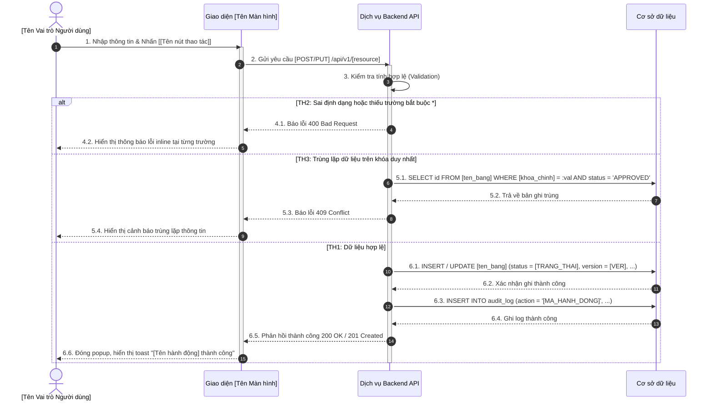

# BIỂU MẪU ĐẶC TẢ CHỨC NĂNG CHUẨN (FUNCTION SPECIFICATION TEMPLATE)

Sử dụng khung mẫu này cho mỗi chức năng nghiệp vụ (Heading 3) trong tài liệu SRS / TKCT.

---

### [Tên Chức Năng Cụ Thể, ví dụ: Thêm mới thông tin Liệt sĩ]

#### Thông tin chung chức năng
* **Mục đích chức năng:** Chức năng này cho phép [Người dùng có vai trò gì] thực hiện [Hành động gì] đối với [Đối tượng gì].
* **Điều kiện tiên quyết / Trạng thái áp dụng:** Các bản ghi được phép thao tác phải ở trạng thái [`status = DRAFT` hoặc `status = REJECT`] (hoặc không yêu cầu đối với chức năng thêm mới).
* **Đường dẫn thao tác:**
  * *Trường hợp 1 (Xử lý đơn lẻ):* Đăng nhập hệ thống → Truy cập menu [Tên Menu] → [Tên Tab / Màn hình] → Nhấn nút/icon [[Tên nút]].
  * *Trường hợp 2 (Xử lý hàng loạt - nếu có):* Đăng nhập hệ thống → Truy cập menu [Tên Menu] → [Tên Tab] → Tích chọn các bản ghi cần xử lý → Nhấn nút [[Tên nút hàng loạt]].
* **Quy định ghi nhật ký hệ thống:** Tham khảo mục Quy định về ghi nhật ký hệ thống trong Tài liệu dùng chung Common (ghi vết `action`, `user_id`, `created_date`, `ip_address`, `old_value`, `new_value`).
* **Quy định phân quyền:** Tham chiếu ma trận phân quyền trong tài liệu Phân quyền chức năng.

#### Màn hình
* **Hình ảnh giao diện chính:** (Chèn ảnh mockup / bản vẽ từ Figma).
* **Hình ảnh giao diện phụ / Hộp thoại xác nhận:** (Chèn ảnh popup xác nhận, thông báo lỗi nếu có).

#### Mô tả chi tiết các thành phần
| STT | Tên | Kiểu dữ liệu [Độ dài dữ liệu] | Input/Output | Giá trị khởi tạo | Mô tả (Mapping với CSDL nếu có) |
| :---: | :--- | :--- | :---: | :---: | :--- |
| 1 | [Tên trường 1] * | Textbox(255) | INPUT | Để trống | • Trường bắt buộc. • Mô tả quy tắc nhập liệu, giới hạn ký tự. • Lưu vào `[ten_bang].[ten_cot]`. |
| 2 | [Tên trường 2] * | Dropdown | INPUT | Để trống | • Trường bắt buộc. • Dữ liệu lấy từ danh mục `[TenDanhMuc]` (`status = Active`). • Chỉ chọn 1 giá trị. • Lưu vào `[ten_bang].[ten_cot]`. |
| 3 | [Tên trường ngày] * | Datepicker | INPUT | Để trống | • Định dạng `dd/MM/yyyy`. • Ràng buộc logic thời gian. • Lưu vào `[ten_bang].[ten_cot]`. |
| 4 | [Tên nút thao tác] | Button | INPUT | N/A | • Nút thực hiện lưu dữ liệu. • Mô tả hành vi khi nhấn nút. |

#### Luồng nghiệp vụ
1. Người dùng đăng nhập hệ thống → Truy cập menu [Tên Menu] → Mở màn hình chức năng.
2. Hệ thống hiển thị giao diện ở trạng thái mặc định:
   * *TH1 (Có dữ liệu):* Hệ thống hiển thị dữ liệu tương ứng từ CSDL.
   * *TH2 (Không có dữ liệu):* Hệ thống hiển thị thông báo "Không có dữ liệu".
3. Người dùng nhập / chọn các trường thông tin theo yêu cầu, sau đó nhấn nút [[Tên nút lưu/gửi]].
4. Hệ thống thực hiện kiểm tra tính hợp lệ của dữ liệu đầu vào:
   * *TH1 (Bỏ trống trường bắt buộc có dấu \*):* Hệ thống dừng xử lý, đặt tiêu điểm (focus) vào trường lỗi đầu tiên và hiển thị thông báo lỗi inline tương ứng.
   * *TH2 (Sai định dạng hoặc vi phạm thứ tự logic):* Hệ thống hiển thị thông báo lỗi cảnh báo người dùng chỉnh sửa.
   * *TH3 (Dữ liệu bị trùng lặp trên khóa duy nhất):* Hệ thống kiểm tra trong CSDL bảng `[ten_bang]`, nếu đã tồn tại bản ghi ở trạng thái `APPROVED` → Hiển thị thông báo "Thông tin [Tên đối tượng] đã tồn tại trong hệ thống".
5. Trường hợp dữ liệu hợp lệ, hệ thống hiển thị hộp thoại xác nhận thao tác:
   * *Nhấn nút [Hủy bỏ]:* Đóng hộp thoại xác nhận, giữ nguyên dữ liệu trên form, không thực hiện thay đổi CSDL.
   * *Nhấn nút [Xác nhận]:* Hệ thống thực hiện ghi nhận vào CSDL:
     * Tạo mới bản ghi trong bảng `[ten_bang]` với các giá trị: `profile_id` tự sinh, `version = 0`, `status = [TRANG_THAI_KHOI_TAO]`, `is_public = FALSE`, `lock = FALSE`, `created_by = [user_hien_tai]`, `created_date = NOW()`.
     * Ghi nhật ký kiểm toán vào bảng `audit_log`.
6. Hệ thống đóng hộp thoại, chuyển hướng về màn hình danh sách và hiển thị thông báo toast "[Tên hành động] thành công".

##### Sơ đồ tuần tự (Sequence Diagram)
*(Bắt buộc sử dụng các đường nét dóng thẳng trực giao chuẩn mực của Sequence Diagram, tuyệt đối không dùng nét vẽ lượn cong tùy tiện)*

