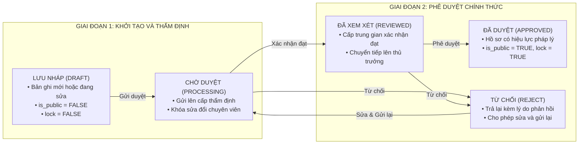

# [TÊN ĐƠN VỊ CHỦ QUẢN CẤP TRÊN]
## [TÊN ĐƠN VỊ THỰC HIỆN DỰ ÁN]

---

# TÀI LIỆU THIẾT KẾ CHI TIẾT
## HỆ THỐNG: [TÊN HỆ THỐNG PHẦN MỀM]
### PHÂN HỆ: [TÊN PHÂN HỆ CHUYÊN TRÁCH]

* Mã hiệu dự án: `[MA_DU_AN]`
* Mã hiệu tài liệu: `[MA_TAI_LIEU]`
* Địa điểm & Năm: `[DiaDiem]`, 2026

---

## BẢNG GHI NHẬN THAY ĐỔI TÀI LIỆU

| Ngày thay đổi | Vị trí thay đổi | A*, M, D | Nguồn gốc | Phiên bản cũ | Mô tả thay đổi | Phiên bản mới |
| :--- | :--- | :---: | :--- | :---: | :--- | :---: |
| 20/03/2026 | Toàn bộ tài liệu | A* | Đề xuất ban đầu | N/A | Tạo mới tài liệu thiết kế chi tiết | V1.0 |

*\*Ghi chú: A\* – Tạo mới, M – Sửa đổi, D – Xóa bỏ.*

---

## TRANG KÝ DUYỆT

| Trách nhiệm | Họ và tên | Chức vụ / Đơn vị | Chữ ký | Ngày ký |
| :--- | :--- | :--- | :--- | :--- |
| **Người lập** | [Họ và tên BA] | Kỹ sư Phân tích nghiệp vụ | | .../.../2026 |
| **Người xem xét** | [Họ và tên SA] | Kiến trúc sư Giải pháp | | .../.../2026 |
| **Người phê duyệt** | [Họ và tên PM] | Giám đốc Dự án | | .../.../2026 |

---

## MỤC LỤC

1. [THIẾT KẾ CHI TIẾT](#heading-1-thiet-ke-chi-tiet)
   1.1. [TỔNG QUAN PHÂN HỆ](#heading-2-tong-quan-phan-he)
   1.2. [QUẢN LÝ [TÊN ĐỐI TƯỢNG]](#heading-2-quan-ly-ten-doi-tuong)
2. [PHỤ LỤC](#heading-1-phu-luc)

---

# HEADING 1: THIẾT KẾ CHI TIẾT

* **Liên kết bản vẽ thiết kế Figma:** `[https://www.figma.com/design/...]`

---

## HEADING 2: TỔNG QUAN PHÂN HỆ

### Sơ đồ phân rã chức năng phân hệ (Dạng Cây Phân Cấp)

```mermaid
flowchart TD
    %% TẦNG GỐC: PHÂN HỆ TỔNG THỂ
    ROOT["PHÂN HỆ QUẢN LÝ VÀ PHÊ DUYỆT HỒ SƠ"]

    %% TẦNG 1: CÁC NHÓM CHỨC NĂNG CHÍNH
    ROOT --> G1["1. NHÓM TRA CỨU & QUẢN LÝ"]
    ROOT --> G2["2. NHÓM QUY TRÌNH PHÊ DUYỆT"]
    ROOT --> G3["3. NHÓM QUẢN TRỊ & HỆ THỐNG"]

    %% TẦNG 2: CÁC CHỨC NĂNG CON PHÂN RÃ
    G1 --> F1_1["1.1. Tra cứu & Hiển thị danh sách"]
    G1 --> F1_2["1.2. Thêm mới hồ sơ (kiểm tra trùng)"]
    G1 --> F1_3["1.3. Cập nhật hồ sơ & Quản lý phiên bản"]
    G1 --> F1_4["1.4. Xuất / Nhập danh sách Excel"]

    G2 --> F2_1["2.1. Gửi phê duyệt (đơn lẻ & hàng loạt)"]
    G2 --> F2_2["2.2. Cấp trung gian thẩm tra"]
    G2 --> F2_3["2.3. Lãnh đạo phê duyệt chính thức"]
    G2 --> F2_4["2.4. Từ chối hồ sơ & Lưu vết phản hồi"]

    G3 --> F3_1["3.1. Khóa / Mở khóa hồ sơ dữ liệu"]
    G3 --> F3_2["3.2. Đối soát lịch sử thay đổi"]
    G3 --> F3_3["3.3. Ghi nhật ký kiểm toán (Audit Log)"]
    G3 --> F3_4["3.4. Phân quyền vai trò người dùng (RBAC)"]
```

### Sơ đồ chu trình chuyển trạng thái dữ liệu

---

## HEADING 2: QUẢN LÝ [TÊN ĐỐI TƯỢNG]

### Heading 3: Xem danh sách [Tên đối tượng]
#### Thông tin chung chức năng
* **Mục đích chức năng:** Cho phép người dùng xem danh sách [Tên đối tượng] trong hệ thống.
* **Đường dẫn thao tác:** Đăng nhập hệ thống → Truy cập menu "[Tên Phân hệ]" → Danh sách [Tên đối tượng].
* **Ghi log:** Tham khảo mục Quy định về ghi nhật ký hệ thống trong Tài liệu Common.
* **Phân quyền:** Tham chiếu ma trận phân quyền chức năng.

#### Màn hình
*(Chèn hình ảnh giao diện danh sách)*

#### Mô tả chi tiết các thành phần
| STT | Tên | Kiểu dữ liệu [Độ dài dữ liệu] | Input/Output | Giá trị khởi tạo | Mô tả (Mapping với CSDL nếu có) |
| :---: | :--- | :--- | :---: | :---: | :--- |
| 1 | Tìm kiếm nhanh | Textbox(255) | INPUT | Để trống | • Placeholder: "Nhập từ khóa tìm kiếm...". • Tìm kiếm theo họ tên hoặc mã định danh. |
| 2 | Lọc nâng cao | Button | INPUT | N/A | • Mở rộng vùng điều kiện tìm kiếm nâng cao. |
| 3 | Thêm mới | Button | INPUT | N/A | • Chuyển hướng tới màn hình Thêm mới. |
| 4 | Bảng danh sách | Table | OUTPUT | N/A | • Hiển thị dữ liệu từ bảng `[ten_bang]` (`is_deleted = FALSE`). |

#### Luồng nghiệp vụ
1. Người dùng đăng nhập hệ thống → Truy cập menu [Tên Phân hệ].
2. Hệ thống hiển thị màn hình danh sách:
   * *TH1 (Có dữ liệu):* Hiển thị danh sách bản ghi tương ứng từ CSDL, phân trang mặc định 10 bản ghi/trang.
   * *TH2 (Không có dữ liệu):* Hiển thị bảng trống kèm thông báo "Không có dữ liệu".
3. Người dùng có thể thực hiện: Xem chi tiết dòng, Tìm kiếm, Lọc, Thêm mới, Sửa, Xóa hoặc Gửi phê duyệt tùy theo phân quyền.

---

### Heading 3: Thêm mới [Tên đối tượng]
*(Áp dụng mẫu chi tiết theo function_template.md)*

---

### Heading 3: Chỉnh sửa [Tên đối tượng]
*(Áp dụng mẫu chi tiết theo function_template.md)*

---

### Heading 3: Phê duyệt [Tên đối tượng]
*(Áp dụng mẫu chi tiết theo function_template.md)*

---

# HEADING 1: PHỤ LỤC

| Tên tài liệu | Mã hiệu / Phiên bản | Ngày phát hành | Ghi chú |
| :--- | :---: | :---: | :--- |
| Tài liệu Phân tích yêu cầu (PTYC) | PTYC-V1.0 | 15/02/2026 | Yêu cầu nghiệp vụ đầu vào |
| Tài liệu Thiết kế Cơ sở dữ liệu | DB-V1.0 | 01/03/2026 | Chi tiết lược đồ cơ sở dữ liệu |
| Tài liệu Phân quyền chức năng | RBAC-V1.0 | 05/03/2026 | Ma trận vai trò người dùng |
| Quy định dùng chung (Common) | COMMON-V1.0 | 10/03/2026 | Quy định log, toast, bảng biểu |
