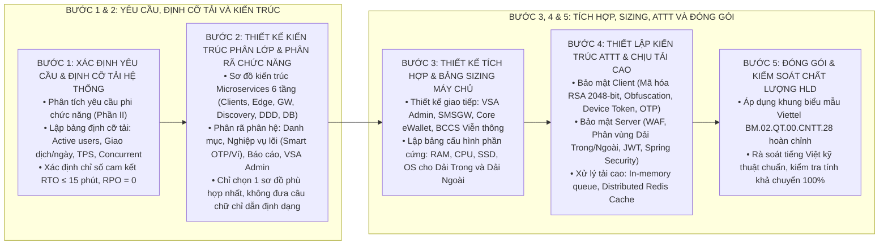

# KỸ NĂNG SOẠN THẢO TÀI LIỆU THIẾT KẾ TỔNG THỂ (TECHNICAL-SOLUTION-WRITER)

Kỹ năng này hướng dẫn quy trình tiêu chuẩn 5 bước để thiết kế kỹ thuật cấp cao, xây dựng kiến trúc hệ thống phân tán, lập bảng định cỡ tải và cấu hình máy chủ, phân rã vi dịch vụ và thiết kế khung an toàn thông tin theo đúng chuẩn mực Tập đoàn Viettel (`BM.02.QT.00.CNTT.28`).

---

## 1. QUY TRÌNH 5 BƯỚC THIẾT KẾ TỔNG THỂ CHUẨN VIETTEL

---

## 2. HƯỚNG DẪN CHI TIẾT TỪNG BƯỚC THỰC HIỆN

### Bước 1: Xác định Yêu cầu & Lập Bảng Định cỡ Tải (Phần II)
1. **Phân tích yêu cầu phi chức năng:**
   * Năng lực phục vụ người dùng, lưu lượng giao dịch và tính sẵn sàng cao (High Availability).
2. **Lập Bảng Định cỡ Tải Hệ thống (Capacity Sizing Table):**
   * Người dùng hoạt động (Active users): ví dụ 2.000.000 users.
   * Tổng giao dịch trong ngày: ví dụ 1.000.000 transactions/day.
   * Người dùng đồng thời (Concurrent users): ví dụ 10.000 concurrent sessions.
   * Thông lượng giao dịch (TPS): ví dụ 20 - 50 TPS.
   * Số lượng node triển khai tối thiểu: ≥ 2 nodes cho mỗi dịch vụ.
   * Cơ chế đảm bảo tính sẵn sàng: Load Balancing, Clustering, Failover.

### Bước 2: Thiết kế Kiến trúc Phân lớp và Phân vùng Hệ thống & Phân rã Chức năng (Phần III.1 & III.2)
1. **Mô hình Kiến trúc Phân lớp và Phân vùng Hệ thống (Enterprise Multi-Zone Architecture):**
   * Bắt buộc vẽ theo **Sơ đồ Flowchart Phân vùng An ninh (`flowchart TD`)** bao gồm 5 phân vùng chuyên biệt, có định danh dải IP đề xuất (Subnet /24) và cổng dịch vụ:
     * *Vùng 1: Kênh Truy cập Khách hàng & Mạng ngoài (`ZONE_ACCESS`):* App Mobile (End-User, Merchant/Agent), Web Portal, POS QR/SDK, Leased Line MPLS Ngân hàng, USSD *202# & SMSC (`direction LR`).
     * *Vùng 2: Vùng DMZ Dải Ngoài Biên An Ninh (`ZONE_DMZ`):* Load Balancer NGINX Plus (VIP), Cổng API Gateway Biên (Customer & WSO2 API), Webview Thanh toán Biên, Xác thực Tập trung Viettel VSA CAS SSO & RBAC (`direction LR`).
     * *Vùng 3: Vùng Dải Trong / Ứng Dụng Nghiệp Vụ Lõi (`ZONE_INT`):* Cụm Máy chủ Core & Smart OTP Engine (OSGi Socket ISO 8583, OCRA RFC 6287), Cụm Đối tác & Payment Gateway (Partner Service, Merchant Pay, QR POS API), Cụm Broker & Điều phối Cụm (Kafka Event-Driven, Eureka Discovery, Zookeeper, Messaging SMSC/Push) (`direction TB`).
     * *Vùng 4: Vùng Quản trị & Vận hành Private OAM (`ZONE_OAM`):* CMS Backend (`am-cms-be`), Payment Point CMS (`ppt-cms`), Giám sát APM (Prometheus, Grafana, ELK Logging) và Bastion Host SSH Port 22 (`direction LR`).
     * *Vùng 5: Vùng Cơ sở Dữ liệu & Lưu trữ Bền vững (`ZONE_DB`):* CSDL Quan hệ Cụm RAC / Patroni, Cụm Redis Sentinel HA Distributed Cache & Locks (`direction LR`).
   * *Luồng truyền thông liên phân vùng:* Giao thức mã hóa TLS 1.3, Tường lửa Dải Trong (Pin-hole Firewall) & Token JWT, TCP Socket CSDL và Kênh quản trị VPN LAN.
   * *Bảng Đặc tả Phân vùng Mạng, Cụm Máy chủ và Phân hệ Dịch vụ (Bắt buộc đi kèm):* Bảng 5 cột (`Phân vùng an ninh | Tên máy chủ (Hostname) | Cụm dịch vụ / Phân hệ cài đặt | Cổng dịch vụ & Giao thức | Chức năng cốt lõi & Cơ chế an ninh`).
2. **Mô hình Phân rã Chức năng / Phân hệ (Decomposition):**
   * Bắt buộc vẽ dưới **Dạng Cây Phân Cấp Ngang 3 Tầng (`flowchart LR`)**: Tên hệ thống gốc ở Cột 1 bên trái, rẽ nhánh sang 4 phân hệ cấp 1 ở Cột 2 (bắt buộc đồng bộ độ dài ký tự và không dùng ` ` để dóng thẳng hàng lề trái), tiếp tục rẽ nhánh sang các ô chức năng con độc lập ở Cột 3 với `rankSpacing: 140`, `nodeSpacing: 8` và `curve: 'basis'`. Tuyệt đối không dùng `~~~` hay cố định CSS `width`.
   * Phân hệ Danh mục dùng chung (Master Data).
   * Phân hệ Nghiệp vụ cốt lõi (Giao dịch, Thanh toán, Ví, Smart OTP).
   * Phân hệ Báo cáo thống kê và đối soát.
   * Phân hệ Quản trị hệ thống và phân quyền người dùng (VSA Admin).

### Bước 3: Thiết kế Giao tiếp Tích hợp, Quy hoạch Mạng & Sizing Máy chủ (Phần III.3, III.4 & III.5)
1. **Giao tiếp với các hệ thống khác (System Integration - III.3):**
   * **Bắt buộc sử dụng Sơ đồ Flowchart (`flowchart LR`):** Thể hiện Cổng tích hợp nội bộ (Integration Hub / Adapter) kết nối trực tiếp sang các hệ thống đối tác bên ngoài kèm nhãn giao thức cụ thể trên từng đường liên kết (HTTPS SSO, SMPP, TCP Socket ISO 8583, RESTful API).
2. **Kiến trúc & Quy hoạch Mạng Tổng thể (Network Topology - III.4):**
   * **Bắt buộc sử dụng Sơ đồ Flowchart (`flowchart TD`):** Thể hiện 4 phân vùng an ninh (Public Internet → DMZ Dải Ngoài → Dải Trong Internal Services → Dải Trong DB Zone & Vùng OAM Quản trị).
3. **Lập Bảng Cấu hình Phần cứng Máy chủ & Giả thiết Thiết lập Địa chỉ IP Đề xuất (III.5):**
   * Phân chia rõ ràng giữa **Dải Ngoài (DMZ)**: Máy chủ Ứng dụng biên (Frontend, API Gateway, NGINX Load Balancer) và **Dải Trong (Internal Zone)**: Máy chủ Backend Microservices, Cơ sở dữ liệu và Redis Cache.
   * Lập bảng đầy đủ các cột: `STT | Phân vùng mạng | Node máy chủ | Dịch vụ cài đặt | Cấu hình phần cứng | IP Đề xuất (Giả định) | VIP Cân bằng tải | Port mở | Trạng thái IP`.
   * **Bắt buộc kèm Ghi chú (*):** Toàn bộ địa chỉ IP là IP giả định theo quy hoạch, sẽ được cập nhật chính xác 100% sang IP thực tế sau khi Trung tâm Hạ tầng / Ban CNTT cấp phát dải IP chính thức.

### Bước 4: Thiết lập Kiến trúc ATTT & Chịu tải cao (Phần IV)
1. **Kiến trúc An toàn Thông tin ATTT Viettel:**
   * **Bắt buộc sử dụng Sơ đồ Flowchart (`flowchart LR`):** Thể hiện 3 lớp bảo vệ (Client RSA/Obfuscation → DMZ WAF/TLS 1.3 → Internal Spring Security/AES-256 Storage & Audit Log).
   * *Bảo mật Client:* Sử dụng mã hóa bất đối xứng RSA với cặp khóa 2048-bit mã hóa dữ liệu nhạy cảm (mật khẩu, PIN), xác thực Device Token / App Token, mã hóa và obfuscate source code, bắt buộc xác thực OTP cho mọi giao dịch.
   * *Bảo mật Backend Server:* Tường lửa WAF chống DDoS, phân vùng mạng Dải Trong - Dải Ngoài, toàn bộ kết nối qua HTTPS/TLS, bọc các lớp Filter Spring Security kiểm tra JWT Token.
2. **Kiến trúc Sao lưu & Phục hồi Dữ liệu:**
   * **Bắt buộc sử dụng Sơ đồ Flowchart (`flowchart LR`):** Thể hiện Trung tâm dữ liệu chính (DC Production Master DB) đồng bộ bán đồng bộ sang Trung tâm dự phòng thảm họa (DR Site Standby DB) và khối Backup Storage độc lập.
   * Cam kết `RTO ≤ 15 phút`, `RPO = 0`, chính sách sao lưu tự động hàng ngày, lưu trữ backup tối thiểu 6 tháng.
3. **Giải pháp Xử lý Tải cao & Concurrent Lớn:**
   * Áp dụng In-memory Queue, Bộ nhớ đệm phân tán Redis Cluster và cơ chế xử lý song song đa luồng.

### Bước 5: Đóng gói và Kiểm soát Chất lượng HLD
1. Áp dụng biểu mẫu chuẩn Viettel tại [technical_solution_template.md](./resources/technical_solution_template.md).
2. Kiểm tra chất lượng:
   - [ ] Đủ 4 phần bắt buộc theo chuẩn Viettel `BM.02.QT.00.CNTT.28`.
   - [ ] Có sơ đồ Flowchart Quy hoạch Mạng tổng thể (Mục 3.4) phân vùng an ninh 4 lớp.
   - [ ] Có đầy đủ Bảng Định cỡ Tải và Bảng Cấu hình Phần cứng Máy chủ kèm Địa chỉ IP Đề xuất (Mục 3.5).
   - [ ] Có ghi chú rõ ràng về việc cập nhật sang IP thật sau khi được cấp phát.
   - [ ] 100% tiếng Việt chuẩn mực, không chèn tiếng Anh đệm trong ngoặc đơn.
   - [ ] Không có icon/emoji trong tiêu đề đề mục.
   - [ ] Ký tự Unicode thuần túy thay thế ký tự LaTeX `$`.
   - [ ] Chỉ có DUY NHẤT 1 sơ đồ kiến trúc phù hợp, tuyệt đối không đưa câu chữ chỉ dẫn định dạng vào nội dung.
   - [ ] **Không chi tiết code:** Tuyệt đối không trình bày tên class, tên controller (ví dụ `SmartOtpController`), tên file màn hình giao diện mobile/web (ví dụ `SmartOtpScreen.tsx`), DTO schema chi tiết hay SQL query trong HLD. Chỉ mô tả mức dịch vụ logic và kênh tương tác.

---

## 3. TÀI NGUYÊN BỔ TRỢ

* [Quy chuẩn soạn thảo Thiết kế Tổng thể Viettel](file:///Users/micro/Source/chapisoft/mschool/.agents/rules/technical_solution_rules.md)
* [Biểu mẫu khung HLD chuẩn Viettel BM.02](./resources/technical_solution_template.md)
