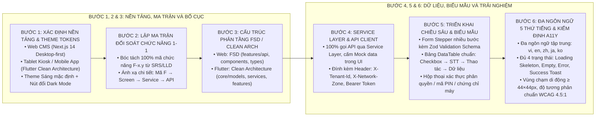

# KỸ NĂNG: ĐẶC TẢ VÀ TRIỂN KHAI GIAO DIỆN NGƯỜI DÙNG ĐA NỀN TẢNG (UI-WRITER)

Kỹ năng này cung cấp phương pháp luận và các biểu mẫu chuẩn mực để thiết kế, đặc tả và triển khai toàn diện các màn hình giao diện người dùng (Frontend UI/UX) trên đa nền tảng (Web Next.js 14, Tablet Kiosk Flutter, Mobile App Flutter) đảm bảo tính nhất quán tuyệt đối với tài liệu thiết kế (HLD, SRS, LLD), không cắt xén nghiệp vụ, kết nối API Backend thực tế, đa ngôn ngữ 5 thứ tiếng và trải nghiệm tối ưu.

---

## 1. NGUYÊN TẮC THIẾT KẾ GIAO DIỆN CỐT LÕI

1. **Phong Cách Thiết Kế Mới Mẻ & Hiện Đại (Contemporary Modern UI Aesthetics):**
   * Nếu người dùng **không chỉ định một codebase hoặc UI template cụ thể**, mặc định **BẮT BUỘC áp dụng phong cách thiết kế mới mẻ, hiện đại, cao cấp** (Clean Contemporary Minimalist):
     * Bố cục thoáng đãng (Generous Whitespace), phân cấp thông tin mạch lạc.
     * Bo góc mềm mại hiện đại (`rounded-lg: 8px`, `rounded-xl: 12px`, `rounded-2xl: 16px`).
     * Đổ bóng phân tầng tinh tế (`shadow-sm`, `shadow-md`), hiệu ứng viền kính mờ nhẹ (Subtle Glassmorphism / Backdrop Filter) cho thanh điều hướng và modal.
     * Sử dụng phông chữ hiện đại (Inter, Plus Jakarta Sans, Outfit) với tỷ lệ phân cấp chữ rõ ràng.
     * Chuyển động vi mô (Micro-animations / Transitions) mượt mà 60 FPS (tối đa 200 - 300ms) trên các tương tác hover, bấm nút và mở drawer/modal.
2. **Mặc Định Theme Sáng (Default Light Theme) & Hỗ Trợ Đầy Đủ Light Mode / Dark Mode:**
   * Giao diện khởi tạo mặc định ở **Theme Sáng (Light Mode)** hiện đại, thanh lịch, độ tương phản chuẩn công thái học.
   * Ứng dụng Web **BẮT BUỘC tích hợp sẵn Cơ chế Chuyển đổi Chủ đề (Theme Switcher / Toggle Button)** trên thanh điều hướng trên cùng:
     * Quản lý qua biến CSS Variables (`--bg-primary`, `--bg-secondary`, `--card-bg`, `--text-primary`, `--text-secondary`, `--border-color`, `--accent-color`).
     * Hỗ trợ 3 chế độ: `Light Mode` (Sáng), `Dark Mode` (Tối), và `System Default` (Theo hệ điều hành).
     * Bảng màu Semantic Tokens được ánh xạ 1-1 đối xứng, bảo đảm Dark Mode có độ tương phản êm dịu (`#0B132B`, `#0F172A`, `#1E293B`) không bị chói lóa, và Light Mode sáng sủa, sắc nét (`#FFFFFF`, `#F8FAFC`, `#F1F5F9`).
3. **Mặc Định Đa Ngôn Ngữ 5 Thứ Tiếng (Việt - Anh - Trung - Nhật - Hàn) Đồng Bộ Cả BE và FE:**
   * **Phía Frontend (FE):**
     * Mặc định **BẮT BUỘC có Bộ chọn chuyển đổi ngôn ngữ (Language Selector Dropdown)** trên Header/Navbar hiển thị icon cờ quốc gia và tên bản địa của ngôn ngữ.
     * Khai báo tập trung và đầy đủ 5 tệp từ điển ngôn ngữ JSON:
       1. `vi.json` (Tiếng Việt — Mặc định)
       2. `en.json` (Tiếng Anh — English)
       3. `zh.json` (Tiếng Trung giản thể — 中文)
       4. `ja.json` (Tiếng Nhật — 日本語)
       5. `ko.json` (Tiếng Hàn — 한국어)
     * **Nguyên tắc Zero-Hardcode Text:** 100% các chuỗi văn bản (tiêu đề, nhãn trường, placeholder, tiêu đề cột bảng DataTable, thông báo lỗi validation, popup xác nhận, toast thông báo) phải được gọi qua hàm `t('key')`. Tuyệt đối không hardcode chuỗi ký tự thô trong mã nguồn component.
   * **Phía Backend (BE):**
     * Mặc định tích hợp bộ giải quyết ngôn ngữ tự động (`LocaleResolver` / `Accept-HeaderLocaleResolver`) bắt tiêu đề `Accept-Language` từ HTTP Request.
     * Cấu hình `ResourceBundleMessageSource` với 5 tệp thông điệp bản địa hóa chuẩn: `messages_vi.properties`, `messages_en.properties`, `messages_zh.properties`, `messages_ja.properties`, `messages_ko.properties`.
     * Tự động dịch mã lỗi ngoại lệ (`GlobalExceptionHandler`), thông điệp phản hồi API `ResultResponse<T>` và mẫu email/SMS thông báo theo đúng ngôn ngữ client gửi lên.
4. **Hệ Thống Design Tokens Chuẩn Hóa:**
   * 100% màu sắc, khoảng cách, bán kính bo góc và độ đổ bóng **bắt buộc sử dụng biến CSS (CSS Variables)** hoặc theme token tập trung. Tuyệt đối không hardcode mã Hex (`#FFFFFF`) hay giá trị pixel cố định trong component.
5. **Nguyên Tắc Sắp Xếp Cột Bảng Dữ Liệu (DataTable Standard Column Ordering):**
   * Thứ tự cột chuẩn từ trái sang phải: `Checkbox` (chọn nhiều bản ghi) → `STT` (số thứ tự) → `Thao tác / Hành động` (xem chi tiết, sửa, xóa, duyệt) → `Các cột dữ liệu nghiệp vụ`.
   * **Tuyệt đối không đặt cột Thao tác ở cuối cùng bên phải** (tránh việc người dùng phải cuộn ngang màn hình để tìm nút thao tác).
6. **Kiểm Tra Tính Hợp Lệ Dữ Liệu Toàn Diện (Schema Validation):**
   * Mọi biểu mẫu (Form) bắt buộc phải có lược đồ kiểm tra hợp lệ bằng thư viện chuẩn (Zod / Yup) kết hợp React Hook Form hoặc Formik.
   * Đảm bảo quy tắc kiểm tra phía Frontend khớp 100% với Backend, có thông báo lỗi inline dưới từng ô nhập liệu.

---

## 2. QUY TRÌNH THIẾT KẾ VÀ TRIỂN KHAI GIAO DIỆN 6 BƯỚC



---

## 3. QUY CHUẨN MÃ NGUỒN THEO TỪNG NỀN TẢNG

### 3.1. Nền Tảng Web Next.js 14 (Feature-Sliced Design):
```text
frontend/
├── locales/                  # 5 TẬP TIN TỪ ĐIỂN ĐA NGÔN NGỮ CHUẨN
│   ├── vi.json               # Tiếng Việt (Mặc định)
│   ├── en.json               # Tiếng Anh
│   ├── zh.json               # Tiếng Trung
│   ├── ja.json               # Tiếng Nhật
│   └── ko.json               # Tiếng Hàn
└── src/
    ├── app/                  # App Router, Layouts, ThemeProvider (Light/Dark), LocaleProvider
    ├── widgets/              # Header (ThemeToggle + LangSelector), Sidebar, KanbanBoard
    ├── features/[ten_tinh_nang]/
    │   ├── api/              # Tầng giao tiếp dữ liệu (Repository Pattern / featureService.ts)
    │   ├── components/       # Component chuyên biệt (FeatureForm.tsx, FeatureTable.tsx, FeatureDetail.tsx)
    │   ├── hooks/            # Custom hooks quản lý server-state (useFeatureData.ts)
    │   ├── types.ts          # TypeScript Interfaces & Enums
    │   └── index.ts          # Public API xuất khẩu của feature
    ├── entities/[ten_thuc_the]/ # Domain Models & Data Transformers
    └── shared/               # UI Tokens, Atoms (Button, Input, Badge, DataTable, Dialog), Zod Schemas
```

### 3.2. Nền Tảng Tablet Kiosk & Mobile (Flutter Clean Architecture):
```text
lib/
├── core/
│   ├── auth/                 # AuthProvider, RoleGuard, NetworkGuard (Intranet/Dual)
│   ├── constants/            # AppColors, Design Tokens
│   ├── i18n/                 # AppTranslations (đa ngôn ngữ 5 thứ tiếng)
│   ├── models/               # Domain Models & Enums DTOs
│   ├── network/              # ApiClient (HTTP Client tự động đính kèm Header)
│   └── services/             # Service Layer gọi REST API backend
├── features/                 # Từng module chức năng độc lập
│   └── [feature_name]/
│       ├── screens/          # Màn hình giao diện hoàn chỉnh
│       └── widgets/          # Components con tái sử dụng
└── main.dart                 # Entrypoint khởi tạo MultiProvider
```

---

## 4. BẢNG MÀU SEMANTIC THEO CHẾ ĐỘ SÁNG / TỐI (LIGHT / DARK THEME TOKENS)

| Semantic Token | Vai Trò Áp Dụng | Giá Trị Theme Sáng (Light Mode - Mặc định) | Giá Trị Theme Tối (Dark Mode) |
| :--- | :--- | :--- | :--- |
| `--bg-app` | Nền toàn trang ứng dụng | `#F8FAFC` (Slate 50) | `#0B132B` (Obsidian Deep) |
| `--bg-surface` | Nền Card, Panel, Modal | `#FFFFFF` (Pure White) | `#1E293B` (Slate 800) |
| `--bg-subtle` | Nền Sidebar, Table Header | `#F1F5F9` (Slate 100) | `#0F172A` (Slate 900) |
| `--text-primary`| Chữ tiêu đề, nội dung chính | `#0F172A` (Slate 900) | `#F8FAFC` (Slate 50) |
| `--text-secondary`| Chữ phụ, placeholder, mô tả | `#64748B` (Slate 500) | `#94A3B8` (Slate 400) |
| `--border-color`| Đường kẻ viền, border card | `#E2E8F0` (Slate 200) | `#334155` (Slate 700) |
| `--color-primary`| Màu thương hiệu hành động | `#2563EB` (Blue 600) | `#3B82F6` (Blue 500) |
| `--color-success`| Thành công, Đã duyệt | `#16A34A` (Green 600) | `#22C55E` (Green 500) |
| `--color-warning`| Cảnh báo, Chờ duyệt | `#D97706` (Amber 600) | `#F59E0B` (Amber 500) |
| `--color-danger` | Thất bại, Từ chối, Lỗi | `#DC2626` (Red 600) | `#EF4444` (Red 500) |

---

## 5. QUY CHUẨN THIẾT KẾ LOGO, BIỂU TƯỢNG ỨNG DỤNG VÀ FAVICON

1. **Bộ Tiêu Chí Cốt Lõi:**
   * **Sáng tạo - Độc đáo - Hiện đại - Đơn giản (Creative, Unique, Modern, Minimalist):** Logo và Icon mang dấu ấn nhận diện đặc trưng cho lĩnh vực nghiệp vụ, thiết kế theo ngôn ngữ Monoline hoặc Flat Vector tinh gọn, đường nét dứt khoát, thanh thoát.
2. **Quy Tắc Chống Rối Rắm & Hiển Thị Kích Thước Nhỏ (Favicon Scalability):**
   * **Tuyệt đối không thiết kế hình ảnh rườm rà, chi tiết vụn vặt, 3D quá nhiều nếp gấp bóng mờ phức tạp** khiến hình ảnh bị nhòe, vỡ nét khi thu nhỏ về kích thước Favicon (16×16 px, 32×32 px, 48×48 px) trên tab trình duyệt hoặc icon ứng dụng di động.
   * **Nét vẽ liền mạch hoặc hình khối đơn (Bold Monoline / Solid Shapes):** Sử dụng các khối hình học cơ bản hoặc nét vẽ dày chắc chắn, phân tách rõ ràng, độ tương phản cao.
3. **Quy Cách Đóng Gói:**
   * **Logo Thương hiệu (Brand Logo):** Tỷ lệ ngang 16:9 hoặc chữ nhật, lưu tại `docs/assets/<tên_dự_án>_logo_brand.*`.
   * **Biểu tượng & Favicon (App Icon):** Tỷ lệ vuông 1:1, bo góc nhẹ (Squircle), chỉ chứa duy nhất biểu trưng hình học cốt lõi không có chữ nhỏ, lưu tại `docs/assets/<tên_dự_án>_app_icon.*`.

---

## 6. CHECKLIST KIỂM ĐỊNH TRƯỚC KHI BÀN GIAO MÃ NGUỒN FRONTEND

- [ ] **Đúng Nền Tảng Công Nghệ:** Đã dùng đúng Web Next.js cho CMS/Portal, Flutter cho Tablet Kiosk và Mobile App. Tuyệt đối không gộp chung vào Web giả lập.
- [ ] **Ma Trận Đối Soát 1-1:** Đã phủ kín 100% các mã chức năng `F-x.y` từ SRS/LLD, không bỏ sót bất kỳ tính năng hỗ trợ nào.
- [ ] **Không Mock Data trong UI:** Toàn bộ component UI gọi dữ liệu qua Service Layer và ApiClient.
- [ ] **Phong Cách Thiết Kế:** Hiện đại, mới mẻ, bo góc tinh tế (`rounded-xl`), đổ bóng phân tầng nhẹ nhàng, bố cục thoáng đãng.
- [ ] **Theme Sáng Mặc Định & Dark Mode:** Theme Sáng mặc định, có nút chuyển đổi Light/Dark Mode hoạt động trơn tru qua biến CSS.
- [ ] **Đa Ngôn Ngữ 5 Thứ Tiếng:** Khai báo đủ 5 tệp ngôn ngữ (`vi.json`, `en.json`, `zh.json`, `ja.json`, `ko.json`) phía FE và 5 tệp `messages_*.properties` phía BE. Có dropdown chọn ngôn ngữ trên Header. 100% văn bản gọi qua `t('key')`.
- [ ] **Design Tokens:** 100% màu sắc và khoảng cách sử dụng biến `var(--color-*)`, `var(--font-*)`, `var(--radius-*)`. Không hardcode mã Hex.
- [ ] **Biểu Mẫu (Form):** Có Zod Schema validate đầy đủ, có thông báo lỗi inline tại từng trường khi nhập sai. Form nhiều bước (Stepper) trên Mobile.
- [ ] **DataTable Chuẩn Hóa:** Cột Thao tác đặt ngay sau cột STT (`Checkbox` → `STT` → `Thao tác` → `Dữ liệu`).
- [ ] **Bảo Mật Quyền & Vùng Mạng:** Tích hợp đầy đủ `RoleGuard` và `NetworkGuard` (INTRANET/DUAL).
- [ ] **Trạng Thái Giao Diện:** Đầy đủ Skeleton Loading, Empty State, Error Alert và Success Toast.
- [ ] **Khả Năng Tiếp Cận (A11y):** Đạt chuẩn tương phản 4.5:1, vùng chạm di động `≥ 44×44px`.
- [ ] **Logo & Favicon:** Thiết kế sáng tạo, độc đáo, tối giản (Flat Vector nét đậm), hiển thị sắc nét ở 16×16 / 32×32 px.
