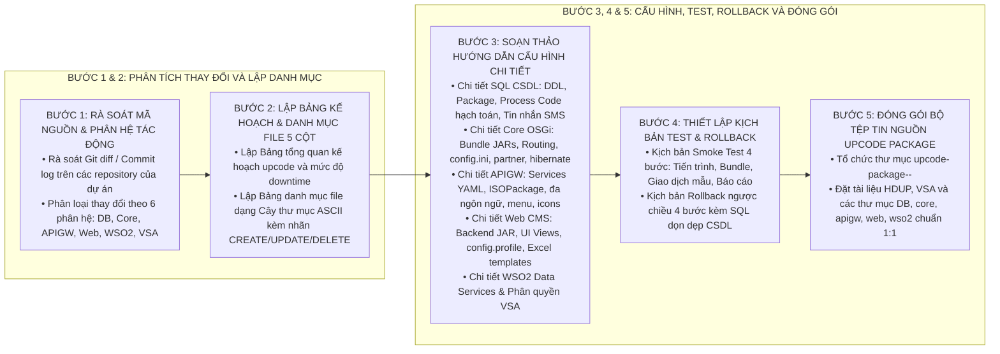

# KỸ NĂNG SOẠN THẢO TÀI LIỆU HƯỚNG DẪN UPCODE VÀ ĐÓNG GÓI PHIẾU YÊU CẦU (UPCODE-GUIDE-WRITER)

Kỹ năng này cung cấp quy trình tác nghiệp chuẩn 5 bước để phân tích các thay đổi mã nguồn từ một Phiếu yêu cầu (Change Request / CR / Ticket), biên soạn một bộ **Tài liệu Hướng dẫn Triển khai Thay đổi Code (Upcode Runbook)** hoàn chỉnh theo chuẩn Tập đoàn Viettel (`HDUP_<TÊN_TÍNH_NĂNG>_<MÃ_CR>_v1.0`), đồng thời chuẩn bị và đóng gói trọn vẹn bộ tệp tin nguồn bàn giao tương ứng.

---

## 1. QUY TRÌNH 5 BƯỚC SOẠN THẢO TÀI LIỆU UPCODE VÀ ĐÓNG GÓI PACKAGE



---

## 2. HƯỚNG DẪN CHI TIẾT TỪNG BƯỚC THỰC HIỆN

### Bước 1: Rà Soát Mã Nguồn & Xác Định Phân Hệ Tác Động
1. **Kiểm tra các tệp tin đã chỉnh sửa / thêm mới trong Workspace:**
   * Sử dụng lệnh `git status`, `git diff --name-status` hoặc kiểm tra các bundle trong từng phân hệ:
     * **Cơ sở dữ liệu (Database):** Các script DDL tạo bảng/cột, DDL Package/Procedure/Trigger, DML cấu hình Process Code (bảng `SERVICE_CODE_MAPPING`, `ACCOUNT_RIGHT_DEFAULT`, `PROCESS_MAPPING`, `TRANS_STATE_CONFIG`, `TARIFF`, `TARIFF_PLAN_MAPPING`, `RULE_CONDITION`, `TRANS_PROCESS_CODE`), DML tin nhắn `APP_MESSAGES`.
     * **Core OSGi Ví Điện Tử:** Các bundle JAR plugins (`Business-*.jar`, `Ew*.jar`, `ewutils-*.jar`, `EwalletDBUtils-*.jar`, `ErrorContent-*.jar`), file cấu hình `etc/` (`RoutingManagerConfig.properties`, `config.ini`, `partner-config.properties`, `business_*.properties`, `hibernate.cfg.xml`).
     * **Cổng API Gateway:** File JAR (`mosan-apigw-enduser-*.jar`, `mosan-apigw-utils-*.jar`), file cấu hình `etc/services/*.yml`, `etc/ISOPackage.xml`, các file đa ngôn ngữ `etc/message.<lang>.properties`, cấu hình menu `config-app-features.xml`, file icon ứng dụng `assets/icons/*.png`.
     * **Web CMS / Báo Cáo:** File JAR `ewallet2-backend-*.jar`, webapp UI `ewallet2-ui` (class Views/Logic, `MainScreen.java`, `WebServiceURL.java`), cấu hình `etc/config.profile`, file template Excel `etc/template/TEMPLATE_REPORT_*.xlsx`, file XML operation `etc/xml/<service>/*.xml`, tài nguyên đa ngôn ngữ `messages_*.properties`.
     * **WSO2 Data Services:** File `.dbs` (`dataservices/MERCHANT_CORE_DataService.dbs`).
     * **Phân quyền VSA:** Cấu hình menu quản trị, URL class, chức năng và nhóm quyền.

---

### Bước 2: Xây Dựng Kế Hoạch Tổng Quan & Lập Bảng Danh Mục File 5 Cột

#### 1. Lập Bảng Kế Hoạch Tổng Quan Triển Khai (Phần 1)
* Trình bày bảng 7 cột: `STT | Tên phân hệ / Dịch vụ | Tác động | Phương án Upcode | Mức độ gián đoạn | Yêu cầu kiểm soát | Ghi chú`.
* Xác định rõ thứ tự triển khai: **Database → Core OSGi → API Gateway → Web CMS → WSO2 → VSA**.

#### 2. Lập Bảng Danh Mục Chi Tiết Tệp Tin Thay Đổi (Phần 2)
* Bắt buộc sử dụng cấu trúc cây thư mục ASCII với nhãn `(CREATE)`, `(UPDATE)` hoặc `(DELETE)` tại cột 3:

| STT | Phân hệ / Tệp tin | Cấu trúc vị trí tệp tin thay đổi | Mục đích & Mô tả thay đổi | Ghi chú |
| :---: | :--- | :--- | :--- | :--- |
| 1 | **Core Plugins** | `plugins/ErrorContent-1.1.jar`<br/>`├── com/`<br/>`│   └── viettel/`<br/>`│       └── msgcontent/`<br/>`│           └── utils/`<br/>`│               ├── Config.class (UPDATE)`<br/>`│               └── msg-error.xml (UPDATE)` | Bổ sung mã lỗi nghiệp vụ và mô tả lỗi đa ngôn ngữ. | Ghi đè JAR |
| 2 | **Core Plugins** | `plugins/ewutils-1.1.jar`<br/>`├── com/`<br/>`│   └── viettel/`<br/>`│       └── ewallet/`<br/>`│           └── utils/`<br/>`│              └── config/`<br/>`│                  ├── Constants.class (UPDATE)`<br/>`│                  └── ProcessCode.class (UPDATE)` | Khai báo hằng số và mã tiến trình nghiệp vụ mới. | Ghi đè JAR |
| 3 | **Core Plugins** | `plugins/Business-578xxx-1.0.jar`<br/>`├── com/`<br/>`│   └── viettel/`<br/>`│       └── ewallet/`<br/>`│           └── core/`<br/>`│              └── business/`<br/>`│                 ├── pc578000/TopupBusiness.java (CREATE)`<br/>`│                 ├── pc578001/TopupOtherBusiness.java (CREATE)`<br/>`│                 └── pc578002/RevertTopupBusiness.java (CREATE)` | Nghiệp vụ nạp tiền chính chủ, nạp hộ và hoàn tiền lỗi. | Thêm mới JAR |
| 4 | **Core Config** | `etc/`<br/>`├── RoutingManagerConfig.properties (UPDATE)`<br/>`├── config.ini (UPDATE)`<br/>`├── partner-config.properties (UPDATE)`<br/>`└── business_578xxx.properties (CREATE)` | Cấu hình routing thread, bundle khởi động và đối tác. | Cập nhật file |
| 5 | **API Gateway** | `mosan-apigw-enduser-1.0.jar`<br/>`├── java/tl/telemor/mosan/euapigw/`<br/>`│   ├── controller/TopupController.java (CREATE)`<br/>`│   └── service/impl/TopupServiceImpl.java (CREATE)` | Xử lý API nạp tiền từ ứng dụng khách hàng. | Ghi đè JAR |
| 6 | **API Gateway Config** | `etc/`<br/>`├── services/topup-service.yml (CREATE)`<br/>`├── ISOPackage.xml (UPDATE)`<br/>`├── message.en.properties (UPDATE)`<br/>`└── config-app-features.xml (UPDATE)` | Cấu hình tham số dịch vụ, ISO fields, ngôn ngữ và menu app. | Cập nhật file |
| 7 | **Web CMS** | `ewallet2-ui-1.1.war`<br/>`├── org/vaadin/ewallet2/web/report/ReportView.java (CREATE)`<br/>`└── etc/template/TEMPLATE_REPORT.xlsx (CREATE)` | Màn hình tra cứu và mẫu biểu kết xuất báo cáo giao dịch. | Ghi đè WAR |
| 8 | **Database** | `DB/core/`<br/>`├── TABLE_REPORT.sql (CREATE)`<br/>`├── PCK_REPORT.sql (CREATE)`<br/>`├── CONFIG_PROCESS_CODE.sql (CREATE)`<br/>`└── CONFIG_MESSAGES.sql (CREATE)` | Khởi tạo bảng dữ liệu, package, cấu hình hạch toán và SMS. | Chạy theo thứ tự |

---

### Bước 3: Soạn Thảo Hướng Dẫn Cấu Hình Chi Tiết Từng Phân Hệ

1. **Cơ sở Dữ liệu (Mục 3.1):**
   * Liệt kê chính xác tên file SQL, thứ tự chạy, schema tác động và các khối lệnh PL/SQL.
2. **Core OSGi (Mục 3.2):**
   * Liệt kê các file JAR copy vào `plugins/`.
   * Trích dẫn chính xác nội dung thay đổi trong `RoutingManagerConfig.properties`, `config.ini`, `partner-config.properties`, `business_xxx.properties`, `hibernate.cfg.xml`.
   * Hướng dẫn lệnh kiểm tra trên console OSGi (`ss`, `update`, `diag`).
3. **API Gateway (Mục 3.3):**
   * Liệt kê file JAR triển khai.
   * Cấu hình nội dung `etc/services/<service>.yml` (endpoint, auth, public key).
   * Cấu hình `ISOPackage.xml`, đa ngôn ngữ (`message.en.properties`, `message.tet.properties`, `message.zh.properties`), menu `config-app-features.xml` và file icon.
4. **Web CMS / Báo Cáo (Mục 3.4):**
   * Cấu hình `config.profile`, file template Excel `TEMPLATE_REPORT_*.xlsx`, file XML operation `get_*_operation.xml`, classes giao diện và `messages_*.properties`.
5. **WSO2 Data Services (Mục 3.5):**
   * Nội dung trích dẫn cấu hình `<query>` và `<operation>` trong file `.dbs`.
6. **Phân Quyền VSA (Mục 3.6):**
   * Bảng thông tin khai báo chức năng VSA: Tên (Name), Mã (Code), Mô tả (Description), Đường dẫn URL/Class và Phân quyền nhóm Role.

---

### Bước 4: Thiết Lập Kịch Bản Kiểm Tra (Smoke Test) & Kịch Bản Rollback

1. **Kịch Bản Kiểm Tra Xác Nhận Sau Upcode (Phần 4):**
   * Bước 1: Kiểm tra trạng thái tiến trình và port dịch vụ (`ps -ef`, `ss -tulpn`).
   * Bước 2: Kiểm tra trạng thái OSGi Bundle (`ss | grep ...` trạng thái `ACTIVE`).
   * Bước 3: Thực hiện giao dịch nghiệp vụ mẫu trên Staging/Production và tra soát log.
   * Bước 4: Đăng nhập Web CMS kiểm tra hiển thị menu, lọc dữ liệu và xuất báo cáo Excel.
2. **Kịch Bản Hoàn Trả Khi Có Sự Cố (Phần 5 - Rollback Plan):**
   * Điều kiện kích hoạt Rollback khi phát sinh lỗi nghiêm trọng.
   * Thứ tự hoàn trả 4 bước: **Web CMS/VSA → API Gateway/WSO2 → Core OSGi → Database**.
   * Đoạn mã SQL hoàn trả CSDL (Drop Package/Table, Delete cấu hình Process Code & Messages).

---

### Bước 5: Đóng Gói Bộ Tệp Tin Nguồn Upcode (Package Layout)

Tạo thư mục package chuẩn theo cấu trúc phân cấp:

```text
upcode-package-<TÊN_TÍNH_NĂNG>-<MÃ_CR>/
├── HDUC.md (hoặc HDUP.md)
├── VSA_<TÊN_TÍNH_NĂNG>.docx (hoặc .md)
├── DB/
│   ├── core/
│   │   ├── 01_TABLE_*.sql
│   │   ├── 02_PCK_*.sql
│   │   ├── 03_CONFIG_PROCESS_CODE.sql
│   │   ├── 04_CONFIG_MESSAGES.sql
│   │   └── ROLLBACK_DB.sql
│   └── apigw/
├── core/
│   ├── plugins/ (*.jar)
│   └── etc/ (business_*.properties, partner-config.sample, RoutingManager.sample)
├── mosan-apigw-enduser/
│   ├── *.jar
│   ├── etc/ (services/*.yml, ISOPackage.xml, message.*.properties, config-app-features.xml)
│   └── assets/assets/icons/*.png
├── web/
│   ├── webapps/ewallet/WEB-INF/
│   └── etc/ (template/*.xlsx, xml/<service>/*.xml)
└── wso2/
    └── dataservices/*.dbs
```

---

## 3. CHECKLIST KIỂM SOÁT CHẤT LƯỢNG TÀI LIỆU UPCODE (QUALITY GATE)

Trước khi bàn giao tài liệu và package cho đội ngũ triển khai:
- [ ] Đủ 6 phần bắt buộc theo chuẩn Viettel `HDUP_<TÊN_TÍNH_NĂNG>_<MÃ_CR>_v1.0`.
- [ ] Bảng Kế hoạch Tổng quan (Phần 1) có đầy đủ các phân hệ tác động và mức độ downtime.
- [ ] Bảng Danh mục tệp tin thay đổi (Phần 2) dùng cấu trúc cây thư mục ASCII và 100% tệp tin có gắn nhãn `(CREATE)`, `(UPDATE)` hoặc `(DELETE)`.
- [ ] Phần Database có đầy đủ DDL bảng/package, DML Process Code hạch toán và DML tin nhắn.
- [ ] Phần Core OSGi có đầy đủ danh sách JAR plugins và cấu hình `RoutingManagerConfig`, `config.ini`, `partner-config`, `business_xxx`, `hibernate`.
- [ ] Phần API Gateway có đầy đủ JAR, `services/*.yml`, `ISOPackage.xml`, đa ngôn ngữ, menu app và icons.
- [ ] Phần Web CMS có đầy đủ backend JAR, UI view, `config.profile`, template Excel, XML operations và đa ngôn ngữ.
- [ ] Phần WSO2 Data Services có trích dẫn query/operation trong file `.dbs`.
- [ ] Có hướng dẫn khai báo phân quyền VSA (Name, Code, Description, URL, Roles).
- [ ] Có Kịch bản Smoke Test 4 bước và Kịch bản Rollback kèm đoạn mã SQL dọn dẹp.
- [ ] Thư mục Package nguồn được đóng gói đầy đủ tệp tin theo đúng cấu trúc phân cấp.
- [ ] 100% tiếng Việt kỹ thuật chuẩn mực, không chèn tiếng Anh đệm trong ngoặc đơn, không icon/emoji ở tiêu đề đề mục.
