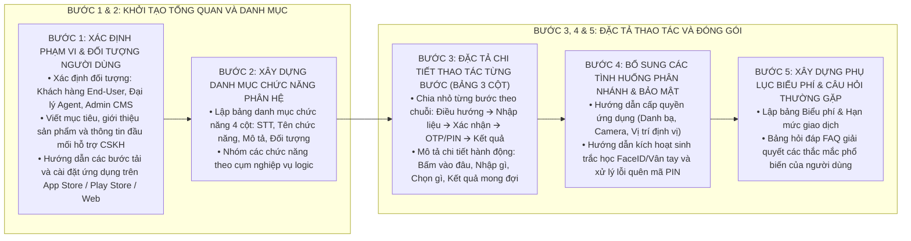

# KỸ NĂNG SOẠN THẢO TÀI LIỆU HƯỚNG DẪN SỬ DỤNG VIETTEL (USER-GUIDE-WRITER)

Kỹ năng này cung cấp quy trình tác nghiệp chuẩn 5 bước để xây dựng một bộ **Tài liệu Hướng dẫn Sử dụng (User Guide Document)** hoàn chỉnh, trực quan, thân thiện với người dùng theo tiêu chuẩn Tập đoàn Viettel (`HDSD_<TÊN_DỰ_ÁN>_v1.0`).

---

## 1. QUY TRÌNH 5 BƯỚC SOẠN THẢO TÀI LIỆU HƯỚNG DẪN SỬ DỤNG

---

## 2. HƯỚNG DẪN CHI TIẾT TỪNG BƯỚC THỰC HIỆN

### Bước 1: Khởi tạo Trang Bìa, Giới Thiệu & Tổng Quan Sản Phẩm (Phần 1 & Phần 2)
1. **Thiết lập Trang bìa & Quản trị tài liệu:**
   * Mã hiệu tài liệu: `HDSD_<TÊN_DỰ_ÁN>_v1.0`.
   * Bảng ký duyệt 3 tầng (Người lập, Người xem xét, Người phê duyệt) và Bảng ghi nhận thay đổi tài liệu.
2. **Soạn thảo Giới thiệu & Tổng quan sản phẩm:**
   * Mục đích tài liệu và phạm vi đối tượng người dùng (Khách hàng cá nhân, Đại lý, Quản trị viên).
   * Thông tin đầu mối hỗ trợ (Số Hotline 24/7, Email hỗ trợ, Địa chỉ trung tâm CSKH).
   * Các bước tải và cài đặt ứng dụng: Tìm kiếm từ khóa trên App Store / Google Play Store, các bước tải về và cấp quyền khởi chạy đầu tiên.

### Bước 2: Xây Dựng Danh Mục Chức Năng Hệ Thống (Phần 3)
* Lập bảng danh mục toàn bộ các tính năng được hướng dẫn trong tài liệu:
  `STT | Tên chức năng | Mô tả tóm tắt nghiệp vụ | Đối tượng sử dụng`.
* Phân nhóm theo luồng trải nghiệm: Tài khoản & Bảo mật, Giao dịch tài chính, Thanh toán dịch vụ, Quản trị & Tiện ích.

### Bước 3: Đặc Tả Chi Tiết Thao Tác Từng Bước Bằng Bảng 3 Cột (Phần 4)
* Mỗi chức năng nghiệp vụ (Heading 2 / Heading 3) bắt buộc phải có bảng hướng dẫn thao tác gồm 3 cột:
  `Bước | Giao diện hiển thị (Mockup / Screenshot) | Thao tác thực hiện & Mô tả chi tiết`.
* Quy chuẩn các bước tương tác:
  * **Bước 1 (Truy cập):** Hướng dẫn vị trí bấm biểu tượng/menu trên Màn hình chính hoặc thanh công cụ.
  * **Bước 2 (Nhập liệu):** Liệt kê các trường cần nhập, quy tắc định dạng (ví dụ: Số tiền tối thiểu, định dạng số điện thoại), cách chọn từ danh bạ hoặc quét mã.
  * **Bước 3 (Xác nhận):** Hướng dẫn kiểm tra lại thông tin trên Popup hoặc Màn hình Xác nhận giao dịch.
  * **Bước 4 (Xác thực bảo mật):** Hướng dẫn nhập mã PIN 6 số, mã xác thực OTP gửi qua tin nhắn SMS hoặc quét khuôn mặt/vân tay.
  * **Bước 5 (Kết quả):** Mô tả màn hình Biên lai giao dịch thành công (Mã giao dịch, Thời gian, Số dư cập nhật) và hướng dẫn lưu/chia sẻ biên lai.

### Bước 4: Bổ Sung Hướng Dẫn Cấp Quyền & Các Chức Năng Phụ Trợ
* **Cấp quyền hệ thống:** Hướng dẫn cách người dùng cấp quyền truy cập Danh bạ (chuyển tiền nhanh), Camera (quét mã QR) và Vị trí định vị (tìm điểm đại lý xung quanh).
* **Quản trị bảo mật:** Hướng dẫn Đổi mã PIN, Bật/Tắt đăng nhập bằng FaceID/Vân tay, Đổi ngôn ngữ hiển thị và Đăng xuất an toàn.

### Bước 5: Xây Dựng Phụ Lục Biểu Phí, Hạn Mức & FAQ (Phần 5)
* **Bảng Biểu phí & Hạn mức:** Liệt kê hạn mức tối thiểu/tối đa mỗi lần giao dịch, hạn mức ngày và mức phí áp dụng cho từng loại dịch vụ.
* **Bảng Câu hỏi Thường gặp (FAQ):** Tổng hợp 5 - 10 tình huống thường gặp nhất (ví dụ: *Quên mã PIN thì làm thế nào?*, *Nhập sai mã PIN quá 5 lần bị khóa tài khoản phải làm sao?*, *Chuyển tiền nhầm số điện thoại xử lý thế nào?*) kèm hướng dẫn khắc phục cụ thể.

---

## 3. CHECKLIST KIỂM SOÁT CHẤT LƯỢNG TÀI LIỆU HƯỚNG DẪN SỬ DỤNG (QUALITY GATE)

Trước khi nghiệm thu hoặc xuất bản tài liệu HDSD:
- [ ] Đủ 5 phần chuẩn mực theo quy cách Viettel `HDSD_<TÊN_DỰ_ÁN>_v1.0`.
- [ ] Bảng danh mục chức năng đầy đủ và ánh xạ đúng với tài liệu SRS/TKCT.
- [ ] Toàn bộ các chức năng trong Phần 4 đều được trình bày theo bảng 3 cột chuẩn (`Bước | Giao diện hiển thị | Thao tác thực hiện`).
- [ ] Ngôn ngữ diễn đạt tự nhiên, thuần Việt, không chèn tiếng Anh đệm/dịch nghĩa thừa.
- [ ] Không có icon/emoji trong tiêu đề đề mục.
- [ ] Có đầy đủ thông tin đầu mối CSKH hỗ trợ và Bảng biểu phí/hạn mức trong Phụ lục.

---

## 4. TÀI NGUYÊN BỔ TRỢ

* [Quy chuẩn soạn thảo Tài liệu Hướng dẫn Sử dụng Viettel](file:///Users/micro/Source/chapisoft/mschool/.agents/rules/user_guide_rules.md)
* [Biểu mẫu khung Tài liệu Hướng dẫn Sử dụng chuẩn Viettel HDSD](./resources/user_guide_template.md)
