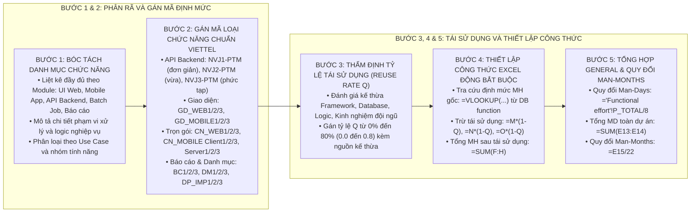

# KỸ NĂNG ƯỚC LƯỢNG NỖ LỰC DỰ ÁN VIETTEL (VIETTEL-ESTIMATION-WRITER)

Kỹ năng này hướng dẫn quy trình tiêu chuẩn 5 bước để phân rã chức năng nghiệp vụ, tra cứu mã định mức Viettel, tính toán tỷ lệ tái sử dụng và thiết lập bảng tính ước lượng nỗ lực (Effort Estimation) hoàn chỉnh, **bảo toàn 100% các công thức Excel động**.

---

## 1. QUY TRÌNH 5 BƯỚC ƯỚC LƯỢNG NỖ LỰC VIETTEL

---

## 2. HƯỚNG DẪN CHI TIẾT TỪNG BƯỚC THỰC HIỆN

### Bước 1: Bóc tách danh mục chức năng từ tài liệu yêu cầu (SRS/BRD)
1. Liệt kê toàn bộ các hạng mục cần triển khai chia theo Module:
   * Module Quản trị Web CMS: Màn hình danh sách, Màn hình chi tiết, Form thêm mới/sửa, Modal duyệt/xóa.
   * Module Ứng dụng Di động (App EU / App AM): Màn hình Home, OnBoarding, Quét QR, Giao dịch, Rút tiền, Lịch sử.
   * Module Dịch vụ Backend (Core Services): API tra cứu, API xử lý giao dịch, API tích hợp đối tác ngoài, Batch job đối soát.
   * Module Báo cáo & Danh mục: Báo cáo doanh thu, Báo cáo đối soát, Danh mục hành chính.
2. Ghi rõ cột `Function name` (Phân hệ), `Type` (Nhóm nghiệp vụ), `Function List` (Tên chức năng), `Function description` (Mô tả chi tiết).

### Bước 2: Gán mã loại chức năng chuẩn Viettel (`Function code`)
Tra cứu bảng định mức chuẩn tại [viettel_estimation_rules.md](file:///Users/micro/Source/chapisoft/mschool/.agents/rules/viettel_estimation_rules.md) hoặc [estimation_template_reference.md](./resources/estimation_template_reference.md):
* **API Backend (Java):**
  * `NVJ1-PTM`: Logic đơn giản < 5 bước, bảng đơn lẻ (Solution 4 MH, Dev 16 MH, Test 8 MH = **28 MH**).
  * `NVJ2-PTM`: Logic trung bình 5 - 10 bước, tích hợp 1-2 bảng (Solution 7 MH, Dev 23 MH, Test 14 MH = **44 MH**).
  * `NVJ3-PTM`: Logic phức tạp > 10 bước, xử lý tài chính, đối soát, tích hợp cổng (Solution 12 MH, Dev 30 MH, Test 23 MH = **65 MH**).
* **Giao diện Web:** `GD_WEB1` (26 MH), `GD_WEB2` (39 MH), `GD_WEB3` (53 MH).
* **Giao diện Di động:** `GD_MOBILE1` (9.75 MH), `GD_MOBILE2` (23.5 MH), `GD_MOBILE3` (45.5 MH).
* **Chức năng Di động Client:** `CN_MOBILE Client1` (16 MH), `CN_MOBILE Client2` (36 MH), `CN_MOBILE Client3` (56.8 MH).

### Bước 3: Thẩm định tỷ lệ tái sử dụng phần mềm (`Q`)
* Áp dụng quy tắc 5 tiêu chí:
  * Không tái sử dụng: `Q = 0`.
  * Kế thừa Framework, Module tương tự: `Q = 0.2` hoặc `0.3`.
  * Tái sử dụng nội bộ các chức năng tương đồng trong cùng hệ thống: `Q = 0.5` đến `0.7`.
  * Mức tối đa cho phép: `Q ≤ 0.8`.

### Bước 4: Thiết lập hệ thống công thức Excel động 100%
Tại sheet `Functional effort`, thiết lập các công thức chuẩn:
1. Tự động lấy tên loại chức năng (Cột L):
   `=VLOOKUP(K8,'Defines the type of function'!$B$5:$C$75,2,FALSE)`
2. Tự động lấy định mức MH gốc (Cột M, N, O):
   * Solution (Cột M): `=VLOOKUP(K8&$M$7,'DB function'!$D$6:$E$180,2,FALSE)` *(với $M$7="Solution")*
   * Develop (Cột N): `=VLOOKUP(K8&$N$7,'DB function'!$D$6:$E$180,2,FALSE)` *(với $N$7="Develop")*
   * Testing (Cột O): `=VLOOKUP(K8&$O$7,'DB function'!$D$6:$E$180,2,FALSE)` *(với $O$7="Testing")*
3. Tổng MH gốc chưa trừ tái sử dụng (Cột P): `=SUM(M8:O8)`
4. Tính MH thực tế sau khi trừ tái sử dụng (Cột F, G, H):
   * Solution thực tế: `=M8*(1-Q8)`
   * Develop thực tế: `=N8*(1-Q8)`
   * Testing thực tế: `=O8*(1-Q8)`
5. Tổng MH thực tế sau tái sử dụng (Cột I): `=SUM(F8:H8)`

### Bước 5: Thiết lập bảng tổng hợp `General` và quy đổi nỗ lực
Tại sheet `General`:
* Nỗ lực chức năng chưa tái sử dụng (MD): `='Functional effort'!P_TOTAL/8`
* Nỗ lực chức năng sau tái sử dụng (MD): `='Functional effort'!I_TOTAL/8`
* Nỗ lực phi chức năng (MD): `='Non-functional effort'!D_TOTAL/8`
* Tổng nỗ lực toàn dự án (MD): `=SUM(E13:E14)`
* Tổng nỗ lực quy đổi Man-Months (MM): `=E15/22`

---

## 3. TÀI NGUYÊN BỔ TRỢ

* [Quy chuẩn Ước lượng Nỗ lực Viettel](file:///Users/micro/Source/chapisoft/mschool/.agents/rules/viettel_estimation_rules.md)
* [Bảng tra cứu định mức và mẫu công thức chi tiết](./resources/estimation_template_reference.md)
