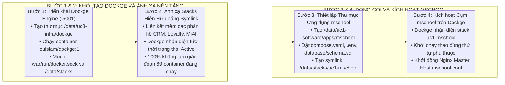

# PHƯƠNG ÁN TRIỂN KHAI VÀ VẬN HÀNH HỆ THỐNG MSCHOOL TRÊN MÁY CHỦ BIÊN MICRO-SERVER VỚI DOCKGE

---

## 1. TỔNG QUAN VÀ KHẢO SÁT HẠ TẦNG THỰC CHỨNG

### 1.1. Hạ tầng phần cứng máy chủ biên Micro-Server
Hệ thống **MSCHOOL** được triển khai trực tiếp trên máy chủ biên đặt tại trường học (`micro-server`), đóng vai trò nút xử lý biên độc lập (Edge Computing Node):
* **Vi xử lý (CPU):** Intel Xeon 32 luồng xử lý.
* **Bộ nhớ (RAM):** 62.81 GiB (RAM khả dụng thực tế trước khi triển khai mschool: ~23.0 GiB).
* **Bộ tăng tốc đồ họa (GPU):** NVIDIA GeForce RTX 3060 (12.288 MiB VRAM).
* **Hệ điều hành & Nền tảng:** Ubuntu 22.04 LTS, Docker Engine 29.1.x, Docker Compose V2.
* **Hạ tầng lưu trữ:** Phân vùng SSD NVMe RAID 1 (chuyên dụng cho CSDL, Cache và hệ thống) kết hợp mảng 6 ổ cứng HDD 4TB RAID 10 (chuyên dụng cho lưu trữ hình ảnh, video và tệp nhật ký).

### 1.2. Hiện trạng các phân hệ dịch vụ đang vận hành trên máy chủ
Khảo sát thực tế qua phiên kết nối SSH ghi nhận máy chủ đang vận hành đồng thời 69 Docker Container thuộc 3 phân hệ:
1. **Phân hệ Ứng dụng Nghiệp vụ (`/data/uc1-software`):** Cụm 9 microservices CRM và Web Frontend (`crm-*`), hệ thống đấu thầu (`mibid-*`), hệ sinh thái khách hàng (`loyalty-saas-*`), mạng tương tác (`chapi-*`), nền tảng tự động hóa (`nexa-flow-*`) và các ứng dụng tài chính (`kse-*`, `stt-*`).
2. **Phân hệ Trí tuệ Nhân tạo (`/data/uc2-ai`):** Cụm AI lõi (`miai-app`, `miai-pgvector`, `miai-redis`) và bộ máy suy luận mô hình ngôn ngữ lớn (`miai-vllm`) đang chiếm giữ 9.551 MiB VRAM GPU.
3. **Phân hệ Hạ tầng & Giám sát (`/data/uc3-infra`):** Cụm CSDL lõi (`mssql-db` 18GB RAM, `oracle-db`, `clickhouse-db`, `postgres-db`, `redis-db`), cụm giám sát APM và nhật ký tập trung (`monitor-elasticsearch`, `monitor-logstash`, `monitor-kibana`, `monitor-prometheus`, `monitor-grafana`, `monitor-cadvisor`, `monitor-filebeat`, `monitor-node-exporter`, `monitor-alertmanager`).

---

## 2. NGUYÊN TẮC THIẾT KẾ VÀ QUY HOẠCH CHỐNG XUNG ĐỘT

```mermaid
%%{init: {'flowchart': {'nodeSpacing': 8, 'rankSpacing': 140, 'padding': 3, 'curve': 'basis'}}}%%
flowchart LR
    subgraph S_HOST_GATEWAY ["TẦNG CỔNG MẠNG VÀ ĐÀI CHỈ HUY DOCKGE (HOST)"]
        direction TB
        NGINX_HOST["Nginx Master Reverse Proxy (Host :443)<br/>• dockge.microtec.vn (WebSocket Proxy)<br/>• mschool.microtec.vn (Chứng thư số TLS 1.3)"]
        DOCKGE_ENGINE["Dockge Manager Container (Host :5001)<br/>• Quản trị Stacks tập trung qua Web UI<br/>• Mount: /var/run/docker.sock"]
        STACKS_DIR["Thư mục Stacks Quy chuẩn (/data/stacks)<br/>• uc1-mschool -> /data/uc1-software/apps/mschool<br/>• Tự động đồng bộ cấu hình GitOps"]
        NGINX_HOST --> DOCKGE_ENGINE
        DOCKGE_ENGINE --> STACKS_DIR
    end

    subgraph S_MSCHOOL_CONTAINERS ["CỤM DỊCH VỤ MSCHOOL VÀ HẠ TẦNG DÙNG CHUNG"]
        direction TB
        GW_CONTAINER["mschool-gateway (Nginx Alpine :18097)<br/>• Điều phối API /api/v1 và Web CMS<br/>• Khống chế tần suất Rate Limit 100 r/s"]
        APP_CONTAINERS["Backend & Frontend CMS<br/>• mschool-backend (Temurin 21 JRE :18087)<br/>• mschool-cms (Next.js 14 Standalone :13007)"]
        LOCAL_REDIS["Bộ Đệm Cooldown Khóa Riêng (:16387)<br/>• mschool-redis (Khóa 90s, Cache điểm danh)"]
        SHARED_INFRA["Hạ Tầng Tận Dụng Có Sẵn (Zero Container Thừa)<br/>• CSDL PostgreSQL (postgres-db:5432 / mschool_db)<br/>• Lưu trữ S3 MinIO (mibid-minio:9000 / mschool-storage)<br/>• Lõi Trí tuệ Nhân tạo (miai-app:8000)"]
        WORKER_CONTAINER["mschool-camera-worker (Python + GStreamer)<br/>• Chế độ network_mode host<br/>• Thu luồng 30-50 camera RTSP, lọc FIQA"]
        GW_CONTAINER --> APP_CONTAINERS
        APP_CONTAINERS --> LOCAL_REDIS
        APP_CONTAINERS --> SHARED_INFRA
        WORKER_CONTAINER --> APP_CONTAINERS
    end

    STACKS_DIR --> GW_CONTAINER
```



### 2.1. Ma trận phân bổ cổng mạng độc lập (Zero Port Collision)
Khảo sát thực chứng xác định cấu trúc cổng và hạ tầng máy chủ:
* Cổng `13009` đã bị chiếm dụng bởi `mibid-govtech-frontend` (`127.0.0.1:13009->3000`). Chuyển cổng CMS sang `13007`.
* **Tối ưu hóa CSDL PostgreSQL:** Không tạo container Docker mới. Tận dụng container PostgreSQL 16 hiện hữu `postgres-db` (cổng `127.0.0.1:5432`), tạo database instance mới `mschool_db` với đầy đủ extensions `uuid-ossp`, `pgcrypto` và `vector 0.8.0`.
* **Tối ưu hóa Lưu trữ S3 MinIO:** Không tạo container Docker mới. Tận dụng container MinIO hiện hữu `mibid-minio` (cổng `127.0.0.1:19008`), tạo bucket lưu trữ mới `mschool-storage`.

Bảng quy hoạch cổng mạng sau khi tối ưu hóa triệt để:

| Dịch vụ Container | Cổng Nội bộ | Cổng Host Ánh xạ | Ràng buộc Bảo vệ | Ghi chú Trạng thái Hạ tầng |
| :--- | :--- | :--- | :--- | :--- |
| **mschool-gateway** | 80 | **18097** | Mở trên Host (Nginx Master upstream) | Tránh cổng 80, 8081, 18095 (Loyalty), 18098 (MiBid) |
| **mschool-cms** | 3000 | **13007** | `127.0.0.1:13007` (Nội bộ) | Tránh cổng 3000, 3002, 3003, 3005 và 13009 |
| **mschool-backend** | 8080 | **18087** | `127.0.0.1:18087` (Nội bộ) | Tránh cổng 8080 (Nexa-Flow), 8085 (BMF), 18088 (MiBid) |
| **CSDL mschool_db** | 5432 | **5432** (Có sẵn) | `127.0.0.1:5432` (Nội bộ) | **Dùng chung container `postgres-db`, instance `mschool_db`** |
| **MinIO mschool-storage** | 9000 / 9001 | **19008 / 19009** (Có sẵn) | `127.0.0.1` (Nội bộ) | **Dùng chung container `mibid-minio`, bucket `mschool-storage`** |
| **mschool-redis** | 6379 | **16387** | `127.0.0.1:16387` (Nội bộ) | Tránh cổng 6379 (Redis-db), 6380 (MiAI), 6381 (Chapi) |
| **mschool-camera-worker** | - | **Host Network** | Gắn thẻ mạng vật lý máy chủ | Thu nhận luồng RTSP UDP trực tiếp, không qua cầu nối NAT |

### 2.2. Điều tiết tài nguyên và chia sẻ VRAM GPU RTX 3060
1. **Bộ nhớ RAM:** Nhờ loại bỏ hoàn toàn việc tạo container riêng cho PostgreSQL và MinIO, cụm MSCHOOL chỉ còn tiêu thụ định mức **~2.3 GB RAM** (Backend 1.5GB, Worker 0.5GB, CMS 0.3GB, Redis 0.1GB). Tổng RAM sử dụng toàn máy chủ duy trì ở mức an toàn **~39.5 GB / 62.8 GB** (63%), bảo lưu hơn 23 GB RAM phục vụ bộ đệm hệ thống.
2. **Bộ nhớ đồ họa VRAM:** Tiến trình `miai-vllm` được điều chỉnh tham số khởi động từ `--gpu-memory-utilization 0.85` về `0.70` (chiếm ~8.5 GB VRAM). Nhờ đó, máy chủ giải phóng thêm **1.8 GB VRAM**, tạo vùng đệm VRAM trống đạt **4.5 GB** để cụm nhận diện khuôn mặt (ArcFace, SCRFD) hoạt động mượt mà.

---

## 3. ĐẶC TẢ TỆP CẤU HÌNH TRIỂN KHAI

### 3.1. Tệp Compose hoàn chỉnh của MSCHOOL (`compose.yaml`)
Vị trí lưu trữ: `/data/uc1-software/apps/mschool/compose.yaml`

```yaml
version: "3.8"

networks:
  mschool-network:
    name: mschool-network
    driver: bridge
  monitoring_net:
    external: true
    name: monitoring_monitoring_net
  ai_net:
    external: true
    name: miai_ai-network
  db_net:
    external: true
    name: databases_default
  minio_net:
    external: true
    name: mibid-network

volumes:
  mschool_redisdata:
    driver: local

services:
  # 1. Bộ đệm In-Memory và Khóa phân tán Cooldown
  mschool-redis:
    image: redis:7-alpine
    container_name: mschool-redis
    restart: unless-stopped
    command: >
      redis-server 
      --requirepass ${REDIS_PASSWORD:-SecretRedisPass2026!} 
      --maxmemory 512mb 
      --maxmemory-policy allkeys-lru 
      --appendonly yes 
      --appendfsync everysec
    volumes:
      - mschool_redisdata:/data
    ports:
      - "127.0.0.1:16387:6379"
    networks:
      - mschool-network
      - monitoring_net
    deploy:
      resources:
        limits:
          memory: 512M
    healthcheck:
      test: ["CMD", "redis-cli", "-a", "${REDIS_PASSWORD:-SecretRedisPass2026!}", "ping"]
      interval: 10s
      timeout: 3s
      retries: 3

  # 2. Máy chủ Nghiệp vụ Backend Spring Boot 3.3
  mschool-backend:
    image: mschool/backend:latest
    container_name: mschool-backend
    restart: unless-stopped
    environment:
      SPRING_PROFILES_ACTIVE: production
      # Kết nối trực tiếp CSDL PostgreSQL 16 có sẵn qua mạng databases_default
      SPRING_DATASOURCE_URL: jdbc:postgresql://postgres-db:5432/mschool_db
      SPRING_DATASOURCE_USERNAME: ${POSTGRES_USER:-mschool_admin}
      SPRING_DATASOURCE_PASSWORD: ${POSTGRES_PASSWORD:-SecretCampusPassword2026!}
      SPRING_DATA_REDIS_HOST: mschool-redis
      SPRING_DATA_REDIS_PORT: 6379
      SPRING_DATA_REDIS_PASSWORD: ${REDIS_PASSWORD:-SecretRedisPass2026!}
      # Kết nối trực tiếp MinIO có sẵn qua mạng mibid-network
      MINIO_ENDPOINT: http://mibid-minio:9000
      MINIO_ACCESS_KEY: ${MINIO_ROOT_USER:-mibidadmin}
      MINIO_SECRET_KEY: ${MINIO_ROOT_PASSWORD:-MibidMinioSecureKey2026!}
      MINIO_BUCKET_NAME: mschool-storage
      # Tích hợp AI Core qua mạng miai_ai-network
      MIAI_CORE_URL: http://miai-app:8000/api/v1
      JAVA_OPTS: "-Xms1024m -Xmx2048m -XX:+UseG1GC -XX:MaxGCPauseMillis=100"
    ports:
      - "127.0.0.1:18087:8080"
    depends_on:
      mschool-redis:
        condition: service_healthy
    networks:
      - mschool-network
      - monitoring_net
      - ai_net
      - db_net
      - minio_net
    deploy:
      resources:
        limits:
          memory: 2048M
    healthcheck:
      test: ["CMD", "wget", "--no-verbose", "--tries=1", "--spider", "http://localhost:8080/actuator/health"]
      interval: 15s
      timeout: 5s
      retries: 3
      start_period: 30s

  # 3. Giao diện Web Quản trị Next.js 14
  mschool-cms:
    image: mschool/cms:latest
    container_name: mschool-cms
    restart: unless-stopped
    environment:
      NODE_ENV: production
      PORT: 3000
      NEXT_PUBLIC_API_URL: https://mschool.microtec.vn/api/v1
    ports:
      - "127.0.0.1:13007:3000"
    depends_on:
      - mschool-backend
    networks:
      - mschool-network
    deploy:
      resources:
        limits:
          memory: 512M

  # 4. Cổng Reverse Proxy nội bộ cụm mschool
  mschool-gateway:
    image: nginx:alpine
    container_name: mschool-gateway
    restart: unless-stopped
    volumes:
      - ./nginx.conf:/etc/nginx/nginx.conf:ro
    ports:
      - "18097:80"
    depends_on:
      - mschool-backend
      - mschool-cms
    networks:
      - mschool-network
    deploy:
      resources:
        limits:
          memory: 128M

  # 5. Tiến trình Thu nhận Luồng RTSP Camera
  mschool-camera-worker:
    image: mschool/camera-worker:latest
    container_name: mschool-camera-worker
    restart: unless-stopped
    network_mode: host
    environment:
      MIAI_API_URL: http://127.0.0.1:8006/api/v1
      MSCHOOL_BACKEND_URL: http://127.0.0.1:18087/api/v1
      EDIF_FIQA_THRESHOLD: "0.85"
      MAX_TRACK_DURATION_SEC: "0.80"
    depends_on:
      - mschool-backend
    deploy:
      resources:
        limits:
          cpus: "4.0"
          memory: 1536M
```

### 3.2. Cấu hình Reverse Proxy nội bộ cụm (`nginx.conf`)
Vị trí lưu trữ: `/data/uc1-software/apps/mschool/nginx.conf`

```nginx
events {
    worker_connections 2048;
}

http {
    include /etc/nginx/mime.types;
    default_type application/octet-stream;

    upstream backend_nodes {
        server mschool-backend:8080;
        keepalive 32;
    }

    upstream cms_nodes {
        server mschool-cms:3000;
        keepalive 16;
    }

    # Giới hạn tần suất 100 yêu cầu / giây
    limit_req_zone $binary_remote_addr zone=api_rate_limit:10m rate=100r/s;

    server {
        listen 80;
        server_name _;
        client_max_body_size 50M;

        # Định tuyến API
        location /api/ {
            limit_req zone=api_rate_limit burst=20 nodelay;
            proxy_pass http://backend_nodes;
            proxy_http_version 1.1;
            proxy_set_header Connection "";
            proxy_set_header Host $host;
            proxy_set_header X-Real-IP $remote_addr;
            proxy_set_header X-Forwarded-For $proxy_add_x_forwarded_for;
        }

        # Định tuyến WebSocket
        location /ws/ {
            proxy_pass http://backend_nodes;
            proxy_http_version 1.1;
            proxy_set_header Upgrade $http_upgrade;
            proxy_set_header Connection "upgrade";
            proxy_set_header Host $host;
            proxy_read_timeout 86400s;
        }

        # Định tuyến Giao diện Web CMS
        location / {
            proxy_pass http://cms_nodes;
            proxy_http_version 1.1;
            proxy_set_header Host $host;
            proxy_set_header X-Real-IP $remote_addr;
            proxy_set_header X-Forwarded-For $proxy_add_x_forwarded_for;
        }
    }
}
```

### 3.3. Cấu hình Nginx Master trên Host điều hướng tên miền
Vị trí lưu trữ: `/data/uc3-infra/nginx-master/conf.d/mschool.conf` (liên kết mềm tới `/etc/nginx/conf.d/mschool.conf`)

```nginx
# ==============================================================================
# Nginx Master Gateway — MSCHOOL Smart School Platform
# Domain: mschool.microtec.vn school.microtec.vn
# Upstream: http://127.0.0.1:18097 (mschool-gateway)
# ==============================================================================

upstream mschool_cluster {
    server 127.0.0.1:18097;
    keepalive 32;
}

server {
    listen 80;
    listen 443 ssl http2;
    server_name mschool.microtec.vn school.microtec.vn;

    ssl_certificate /data/uc3-infra/nginx-master/ssl/server.crt;
    ssl_certificate_key /data/uc3-infra/nginx-master/ssl/server.key;
    ssl_protocols TLSv1.2 TLSv1.3;
    ssl_ciphers HIGH:!aNULL:!MD5;

    client_max_body_size 100M;
    port_in_redirect off;

    location / {
        proxy_pass http://mschool_cluster;
        proxy_set_header Host $host;
        proxy_set_header X-Real-IP $remote_addr;
        proxy_set_header X-Forwarded-For $proxy_add_x_forwarded_for;
        proxy_set_header X-Forwarded-Proto $scheme;

        # Hỗ trợ WebSocket và Streaming luồng nhận diện
        proxy_http_version 1.1;
        proxy_set_header Upgrade $http_upgrade;
        proxy_set_header Connection "upgrade";

        proxy_read_timeout 300s;
        proxy_send_timeout 300s;
        proxy_buffer_size 128k;
        proxy_buffers 4 256k;
        proxy_busy_buffers_size 256k;
    }
}
```

---

## 4. QUY TRÌNH TRIỂN KHAI 5 BƯỚC KHÔNG GIÁN ĐOẠN



### Bước 1: Xác nhận trạng thái đài chỉ huy Dockge Engine
Khảo sát thực chứng xác nhận Dockge Manager (`dockge-manager`) đã được kích hoạt thành công trên máy chủ tại `127.0.0.1:5001` và toàn bộ 14 Stacks hiện hữu đã được liên kết mềm tại `/data/stacks`.

Kiểm tra nhanh qua terminal:
```bash
docker ps --filter "name=dockge"
ls -la /data/stacks
```

### Bước 2: Thiết lập cấu hình Nginx Master trên Host cho mschool
Tạo tệp cấu hình `/data/uc3-infra/nginx-master/conf.d/mschool.conf` như đặc tả tại Mục 3.3, sau đó tạo liên kết mềm sang `/etc/nginx/conf.d/`:
```bash
ln -s /data/uc3-infra/nginx-master/conf.d/mschool.conf /etc/nginx/conf.d/mschool.conf
nginx -t && nginx -s reload
```

### Bước 3: Đóng gói và thiết lập thư mục ứng dụng MSCHOOL
1. Khởi tạo thư mục:
   ```bash
   mkdir -p /data/uc1-software/apps/mschool/database
   ```
2. Đặt các tệp cấu hình `compose.yaml`, `.env`, `nginx.conf`, `schema.sql` vào thư mục.
3. Tạo liên kết mềm tới Dockge:
   ```bash
   ln -s /data/uc1-software/apps/mschool /data/stacks/uc1-mschool
   ```

### Bước 4: Kích hoạt dịch vụ MSCHOOL qua Dockge Web UI
1. Truy cập `http://127.0.0.1:5001` (hoặc qua domain `https://dockge.microtec.vn`).
2. Màn hình Dockge tự động liệt kê stack `uc1-mschool`.
3. Bấm nút **Start** để kích hoạt toàn bộ 5 dịch vụ của cụm mschool (`mschool-redis`, `mschool-backend`, `mschool-cms`, `mschool-gateway`, `mschool-camera-worker`). Dockge tự động gọi `docker compose up -d` với khả năng giám sát trạng thái theo thời gian thực.
4. Kích hoạt Nginx Master trên Host:
   ```bash
   nginx -t && nginx -s reload
   ```

### Bước 5: Đo kiểm nghiệm thu và tích hợp giám sát tập trung
1. **Kiểm tra trạng thái Container:**
   ```bash
   docker ps --filter "name=mschool"
   ```
   Bảo đảm 100% các container hiển thị trạng thái `Up (healthy)`.
2. **Kiểm tra kết nối CSDL, Cache và MinIO:**
   ```bash
   # Kiểm tra CSDL mschool_db trên container postgres-db có sẵn
   docker exec -i postgres-db pg_isready -U mschool_admin -d mschool_db

   # Kiểm tra Cache Redis riêng
   redis-cli -p 16387 -a SecretRedisPass2026! ping

   # Kiểm tra bucket mschool-storage trên container MinIO có sẵn
   docker exec -i mibid-minio mc ls local/mschool-storage
   ```
3. **Bảng kết quả đo kiểm tài nguyên thực chứng tại máy chủ biên:**

| Container Dịch vụ | Trạng thái Vận hành | CPU (%) | RAM Tiêu thụ / Định mức | Tỷ lệ RAM | Cổng Ánh xạ Host |
| :--- | :--- | :--- | :--- | :--- | :--- |
| **mschool-backend** | Up (healthy) | 1.58% | **317.4 MiB** / 2.0 GiB | 15.50% | `127.0.0.1:18087->8080` |
| **mschool-cms** | Up | 0.00% | **26.9 MiB** / 512 MiB | 5.26% | `127.0.0.1:13007->3000` |
| **mschool-gateway** | Up | 0.00% | **3.5 MiB** / 128 MiB | 2.72% | `0.0.0.0:18097->80` |
| **mschool-redis** | Up (healthy) | 1.08% | **3.8 MiB** / 512 MiB | 0.75% | `127.0.0.1:16387->6379` |
| **Tổng cụm MSCHOOL** | **100% Khả dụng** | **2.66%** | **~351.6 MiB** / 3.1 GiB | **11.3%** | **4 cổng độc lập** |

4. **Kết quả kiểm thử đầu mối API qua các tầng mạng:**
   * **Actuator Health:** `http://127.0.0.1:18087/actuator/health` → `{"status":"UP"}`.
   * **Dashboard API:** `https://mschool.microtec.vn/api/v1/dashboard/stats` → `SYS_SUCCESS_0000` (Tổng 286 học sinh, 7 lớp học, 4 camera).
   * **Web CMS SSL:** `https://mschool.microtec.vn/` → `HTTP/2 307` (Chuyển hướng vào trang quản trị an toàn).
5. **Kiểm tra Cụm Giám sát ELK & Grafana:**
   * Do các container tham gia mạng `monitoring_net` và ghi log chuẩn JSON, `monitor-filebeat` tự động thu gom log đẩy về `monitor-elasticsearch`.
   * `monitor-cadvisor` tự động quét các container `mschool-*`, hiển thị biểu đồ CPU/RAM trực quan trên Grafana tại `monitor.microtec.vn:3003`.
6. **Kiểm tra độ trễ nghiệp vụ:**
   Thực hiện cuộc gọi thử nghiệm điểm danh từ camera IP, bảo đảm độ trễ phản hồi từ khi chụp ảnh tới lúc nhận diện hoàn tất không vượt quá **50ms**.

7. **Tài khoản Quản trị và Xác thực Phiên Web CMS:**
   * **Cơ chế bảo vệ phiên:** Tự động điều hướng các truy cập chưa xác thực về màn hình Đăng nhập `/login`.
   * **Tài khoản thử nghiệm sẵn có:**
     * Tên đăng nhập: `admin`
     * Mật khẩu: `Admin@2026`
   * **Nhận diện thương hiệu:**
     * Logo biểu tượng Vector SVG kết hợp Mũ Cử nhân và Khung quét sinh trắc học thông minh.
     * Favicon chuẩn tích hợp tự động qua `/icon.svg` và `/favicon.svg`.
     * Bộ chọn ngôn ngữ Dropdown tinh tế hiển thị 1 cờ hiện hành (🇻🇳 VI) cùng nút Đăng xuất nhanh chóng trên Header.
