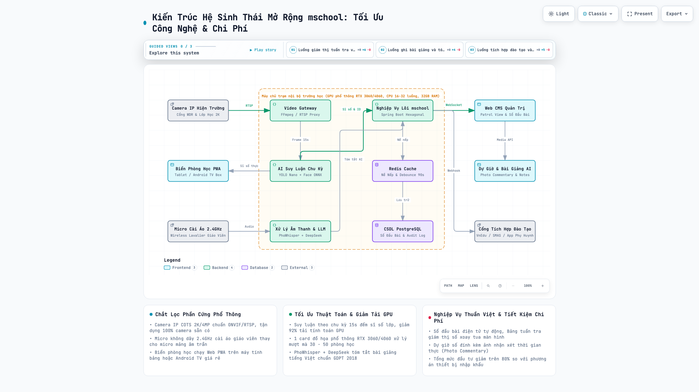
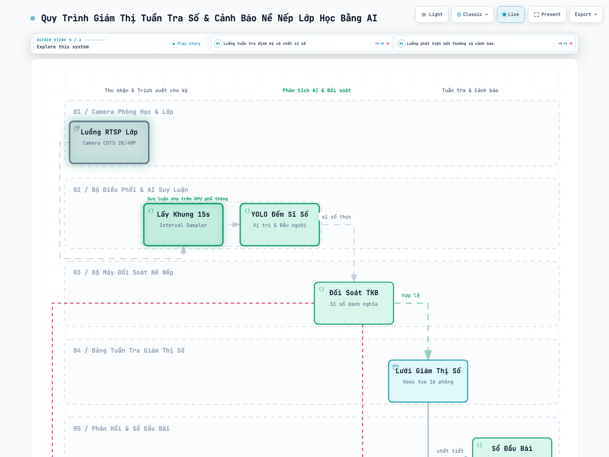
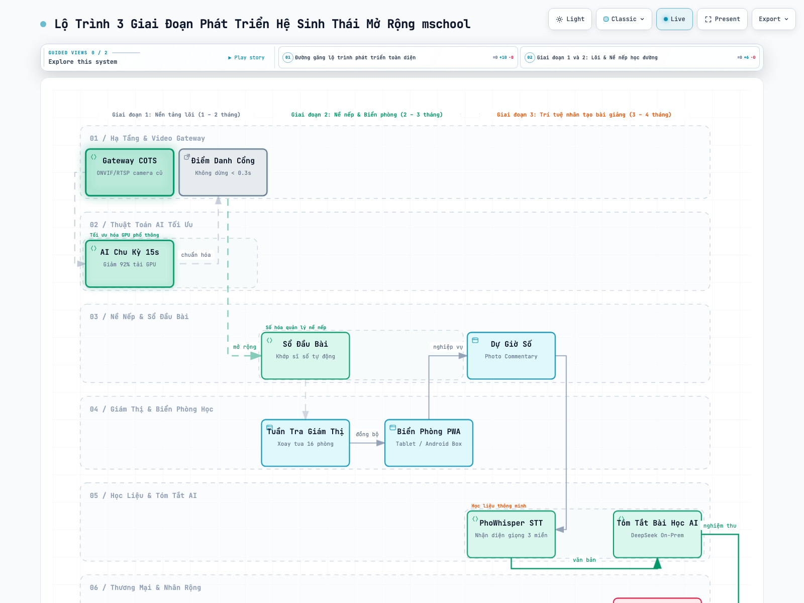

# ĐỀ ÁN CHIẾN LƯỢC MỞ RỘNG HỆ SINH THÁI MSCHOOL
## ĐỊNH HƯỚNG TỐI ƯU CÔNG NGHỆ – CHI PHÍ HỢP LÝ – CHẮT LỌC THIẾT BỊ PHỔ THÔNG VÀ TỰ CHỦ PHẦN MỀM TẠI THỊ TRƯỜNG VIỆT NAM

---

## 1. TÔN CHỈ VÀ TỔNG QUAN ĐỊNH HƯỚNG CHIẾN LƯỢC

### 1.1. Bối cảnh thực tiễn của ngành giáo dục Việt Nam
Qua nghiên cứu chuyên sâu hồ sơ giải pháp của đối tác **Suzhou Seacraft Technology Co., Ltd.** (đơn vị đã triển khai hơn 30.000 phòng học thông minh tại các trường đại học hàng đầu Trung Quốc), có thể thấy giải pháp của đối tác đạt độ hoàn thiện cao về mặt tính năng. Tuy nhiên, mô hình của đối tác phụ thuộc nặng nề vào **hệ sinh thái phần cứng chuyên dụng nguyên khối, độc quyền và giá thành rất cao** (như máy chủ phiến mật độ cao, thiết bị ghi hình tương tác chuyên dụng 4K, micro mảng âm trần chuẩn AES67, camera zoom quang học 18x gamma đặc thù, máy chủ tích hợp mô hình ngôn ngữ lớn nội địa).

Tại thị trường Việt Nam, điều kiện triển khai có những đặc thù mang tính quyết định:
* **Khả năng chi trả hạn chế:** Đa số các trường phổ thông công lập và các trường đại học hoạt động theo cơ chế tự chủ tài chính có ngân sách đầu tư công nghệ thông tin định mức chặt chẽ. Việc đề xuất các gói thiết bị phần cứng chuyên dụng lên đến hàng trăm triệu hoặc hàng tỷ đồng cho mỗi cụm phòng học sẽ dẫn đến bế tắc ngay từ khâu phê duyệt dự toán hoặc không thể nhân rộng đại trà.
* **Hạ tầng hiện hữu đa dạng:** Hầu hết các trường học đã được đầu tư rải rác hệ thống camera an ninh thông thường (sử dụng các thương hiệu phổ biến như Hikvision, Dahua, Uniview, Tiandy...). Một giải pháp bắt buộc thay mới toàn bộ camera sẽ bị các nhà trường từ chối do lãng phí tài sản công.
* **Đặc thù nghiệp vụ sư phạm bản địa:** Chương trình Giáo dục phổ thông 2018, quy định quản lý sổ sách điện tử (Sổ đầu bài, Sổ điểm danh, Học bạ số), quy chuẩn liên lạc nhà trường - phụ huynh và cơ sở dữ liệu ngành của Bộ Giáo dục và Đào tạo đòi hỏi phần mềm phải bám sát tuyệt đối quy trình nghiệp vụ Việt Nam, điều mà các bộ phần mềm đóng gói sẵn từ nước ngoài không thể đáp ứng.

### 1.2. Công thức chiến lược của mschool
Để giải pháp có thể thâm nhập sâu rộng, thương mại hóa thành công và chiếm lĩnh thị trường giáo dục Việt Nam, mschool xác định công thức cốt lõi:

> **CÔNG THỨC CHIẾN LƯỢC MSCHOOL:**  
> **[Thiết Bị Phần Cứng Phổ Thông, Sẵn Có, Dễ Triển Khai, Tận Dụng Cũ]**  
> **+ [Phần Mềm & Trí Tuệ Nhân Tạo Tự Thiết Kế 100%, Bản Địa Hóa, Tối Ưu Cao]**  
> **= [Hệ Sinh Thái Học Đường Toàn Diện, Hiệu Năng Vượt Trội, Chi Phí Giảm Trên 80%]**  

Chiến lược này bảo đảm:
1. **Chi phí đầu tư ban đầu (Capex) giảm từ 60% đến 75%** so với các giải pháp nhập khẩu nguyên khối.
2. **Chi phí vận hành hàng năm (Opex) tiệm cận mức tối thiểu** do không phải trả phí bản quyền phần mềm cho đối tác nước ngoài.
3. **Triển khai cực kỳ nhanh chóng** trên hạ tầng mạng và camera sẵn có của các trường học Việt Nam.
4. **Làm chủ 100% công nghệ**, bảo đảm chủ quyền dữ liệu học đường theo đúng Nghị định 13/2023/NĐ-CP.

---

## 2. ĐÁNH GIÁ VÀ PHÂN TẦNG HẠ TẦNG ĐỐI TÁC PHÙ HỢP TRIỂN KHAI TẠI VIỆT NAM

Qua nghiên cứu toàn diện hồ sơ kỹ thuật của **Suzhou Seacraft Technology Co., Ltd.**, hệ thống hạ tầng phần cứng và thiết bị của đối tác được thiết kế rất hoàn chỉnh cho các dự án đại học quy mô lớn tại Trung Quốc. Tuy nhiên, khi đối chiếu với bài toán thực tế tại Việt Nam (ngân sách đầu tư, khả năng bảo trì, chuỗi cung ứng linh kiện và sự đa dạng của hạ tầng sẵn có), chúng ta cần thực hiện **chắt lọc phân tầng** thành 3 nhóm rõ rệt:

### 2.1. Ma trận phân tầng hạ tầng đối tác cho thị trường Việt Nam

| Nhóm phân loại | Định nghĩa & Tiêu chí áp dụng | Danh mục hạng mục hạ tầng của đối tác | Định hướng triển khai của mschool |
| :--- | :--- | :--- | :--- |
| **Nhóm 1: Rất phù hợp** | Thiết bị chuẩn hóa cao, mang lại giá trị thực tế ngay lập tức, tương thích giao thức mở quốc tế, dễ triển khai đại trà. | • Thiết bị AI hội tụ biên (AI Convergence Terminal) • Camera IP cố định góc siêu rộng True WDR ≥ 120dB • Kiến trúc Video Middle Platform trên Docker & K8s | Nhập khẩu / OEM thiết bị biên cho phòng mẫu; tích hợp 100% camera sẵn có qua chuẩn ONVIF/RTSP; áp dụng kiến trúc phần mềm trung gian. |
| **Nhóm 2: Phù hợp có điều kiện** | Thiết bị chất lượng cao nhưng chi phí lớn, lắp đặt phức tạp. Chỉ phù hợp với phân khúc cao cấp (giảng đường lớn, studio). | • Camera PTZ theo dõi giáo viên (Zoom quang 18x) • Hệ thống Micro mảng âm trần (Network Array Mic AES67) • Bộ ghi hình bài giảng tương tác 4K chuyên dụng | Đưa vào cấu hình lựa chọn thêm (Optional) cho các trường đại học lớn hoặc phòng hội thảo quốc tế (chiếm khoảng 5% – 10% số phòng). |
| **Nhóm 3: Hoàn toàn không nên dùng** | Thiết bị độc quyền nguyên khối, chi phí đầu tư và bảo trì cực kỳ đắt đỏ, phụ thuộc chuỗi cung ứng nước ngoài. | • Tủ máy chủ phiến (High-Density Blade Servers) • Tủ đĩa lưu trữ chuyên dụng KRAT / Cloud Storage độc quyền • Máy chủ AI nguyên khối tích hợp chip nội địa Trung Quốc • Màn hình Kiosk phòng học chuyên dụng của hãng | **Loại bỏ 100%**. Thay thế bằng máy tính trạm tiêu chuẩn trang bị GPU phổ thông (NVIDIA RTX), ổ cứng tiêu chuẩn và tablet/Android TV giá rẻ chạy Web PWA. |

---

### 2.2. Chi tiết các hạng mục hạ tầng rất phù hợp để triển khai (Nhóm 1)

1. **Thiết bị đầu cuối AI hội tụ biên (AI Convergence Terminal / Edge AI Box):**
   * *Đặc tính kỹ thuật:* Thiết bị phần cứng nhỏ gọn lắp đặt tại lớp học, tích hợp nhiều cổng kết nối âm thanh và hình ảnh, hỗ trợ AoIP, chia sẻ màn hình không dây đa giao thức và có vi xử lý AI tại biên.
   * *Giá trị thực tế:* Giải phóng việc phải kéo quá nhiều dây cáp phức tạp từ lớp học về phòng máy chủ trung tâm. Thiết bị biên xử lý nén luồng video và xử lý âm thanh tại chỗ, chỉ gửi dữ liệu nhẹ (metadata) về máy chủ mschool, giúp mạng nội bộ trường không bị nghẽn băng thông.
   * *Định hướng:* Hợp tác nhập khẩu hoặc OEM dòng thiết bị biên này của đối tác để đóng gói thành giải pháp "mschool Smart Box" lắp tại các phòng học mẫu hoặc phòng hội đồng.

2. **Dòng Camera IP cố định góc siêu rộng chống ngược sáng (True WDR ≥ 120dB):**
   * *Đặc tính kỹ thuật:* Cảm biến độ nét cao (2K/4MP), dải tương phản động rộng WDR 120dB, hỗ trợ chuẩn ONVIF, RTSP và góc nhìn siêu rộng bao quát toàn bộ không gian phòng học.
   * *Giá trị thực tế:* Các phòng học tại Việt Nam thường có cửa sổ đón ánh sáng tự nhiên rất mạnh, dễ gây ngược sáng làm tối mặt học sinh. Dòng camera có WDR ≥ 120dB giúp khuôn mặt học sinh luôn rõ nét để thuật toán mschool nhận diện chính xác.
   * *Định hướng:* Thiết bị hỗ trợ giao thức mở quốc tế RTSP/ONVIF nên phần mềm mschool có thể kết nối thu luồng trực tiếp mà không bị khóa phần cứng (Zero Vendor Lock-in).

3. **Mô hình hạ tầng Phần mềm trung gian Video hội tụ (Video Middle Platform trên Docker & K8s):**
   * *Đặc tính kỹ thuật:* Triển khai Private Cloud dạng cụm Microservices trên Docker và Kubernetes, phân tách rõ các dịch vụ: Thu nhận luồng (Media Ingestion), Phân phối luồng (Media Distribution), Điều phối lưu trữ và Quản lý thiết bị.
   * *Định hướng:* mschool áp dụng nguyên lý kiến trúc phân tầng này vào hệ thống của mình, đóng gói toàn bộ dịch vụ Backend thành Docker containers, cho phép triển khai linh hoạt từ 1 máy chủ đơn lẻ đến cụm máy chủ nhiều node chịu tải cao cho các trường quy mô từ 3.000 đến 5.000 học sinh.

---

### 2.3. Các hạng mục hạ tầng phù hợp có điều kiện cho phân khúc cao cấp (Nhóm 2)

* **Camera PTZ theo dõi giáo viên (Zoom quang 18x):**
  * *Đặc tính kỹ thuật:* Tự động bám vết giáo viên di chuyển trên bục giảng, chống lóa máy chiếu qua Gamma thích ứng.
  * *Điều kiện phù hợp tại Việt Nam:* Phù hợp với **Giảng đường đại học quy mô lớn** (chiều dài phòng từ 15m – 30m, sức chứa 100 – 300 sinh viên) hoặc Hội trường lớn.
  * *Hạn chế:* Không phù hợp cho lớp học K-12 phổ thông (chiều dài phòng chỉ 7m – 9m, giáo viên chủ yếu đứng bục giảng hoặc bảng viết). Đắt tiền và chi tiết cơ học quay quét dễ hao mòn sau 2 – 3 năm.
* **Hệ thống Micro mảng âm trần (Network Array Mic AES67):**
  * *Đặc tính kỹ thuật:* Thu âm búp sóng định hướng Beamforming, gắn âm trần, bán kính thu 9m, truyền tín hiệu POE qua cáp mạng.
  * *Điều kiện phù hợp tại Việt Nam:* Phù hợp với **Phòng họp giao ban, Phòng hội thảo đa điểm, Studio ghi hình chuyên nghiệp** của trường đại học hoặc trường quốc tế.
  * *Hạn chế:* Chi phí rất cao (từ 20 – 40 triệu đồng/bộ). Trong lớp học phổ thông, học sinh hiếu động dễ gây ồn ào khiến micro mảng trần thu lẫn nhiều tạp âm; việc thi công trần thạch cao phức tạp.
* **Bộ ghi hình bài giảng tương tác 4K chuyên dụng:**
  * *Đặc tính kỹ thuật:* Khung vỏ nhôm tản nhiệt tĩnh, tích hợp codec phần cứng, thu nhận 2 luồng 4K đồng thời, cổng UVC kép.
  * *Điều kiện phù hợp tại Việt Nam:* Phù hợp cho **Trung tâm đào tạo từ xa (E-Learning Studio)** của trường đại học cần sản xuất bài giảng chuẩn MOOCs chất lượng 4K.
  * *Hạn chế:* Với lớp học thông thường tại Việt Nam, nhu cầu chỉ cần video độ phân giải Full HD / 2K, hoàn toàn có thể dùng phần mềm mschool thu luồng trực tiếp mà không cần thiết bị ghi hình phần cứng riêng.

---

### 2.4. Các hạng mục hạ tầng loại trừ và giải pháp thay thế tối ưu (Nhóm 3)

1. **Tủ máy chủ phiến (High-Density Blade Servers) và Tủ đĩa lưu trữ chuyên dụng KRAT:**
   * *Lý do loại trừ:* Giá thành lên tới hàng trăm triệu đến cả tỷ đồng; linh kiện nguồn, quạt, mô-đun lưu trữ độc quyền; khi xảy ra sự cố hỏng hóc tại các tỉnh thành ở Việt Nam rất khó tìm kiếm linh kiện thay thế, thời gian chờ bảo hành nhập khẩu kéo dài gây gián đoạn hoạt động của trường.
   * *Phương án thay thế tối ưu của mschool:* Sử dụng **Máy chủ tiêu chuẩn dạng Rack 1U/2U (Dell PowerEdge, HPE ProLiant)** hoặc **Máy tính trạm công nghiệp (Industrial Workstation)** phổ biến. Dễ dàng nâng cấp RAM, thay thế ổ cứng tiêu chuẩn tại bất kỳ đại lý máy tính nào tại Việt Nam trong vòng vài giờ.
2. **Máy chủ AI nguyên khối tích hợp chip nội địa Trung Quốc (Domestic Large Model All-in-One):**
   * *Lý do loại trừ:* Sử dụng chip tăng tốc AI nội địa Trung Quốc (như Ascend, Kunlun...), thiếu hệ sinh thái phần mềm mở, khó tương thích với framework AI toàn cầu và không có kênh bảo hành phần cứng chính thức tại Việt Nam.
   * *Phương án thay thế tối ưu của mschool:* Sử dụng máy chủ trang bị **Card đồ họa GPU thương mại phổ thông của NVIDIA (RTX 3060 12GB, RTX 4060 Ti 16GB hoặc NVIDIA A2/L4)**. Tận dụng hệ sinh thái CUDA, TensorRT và ONNX Runtime toàn cầu giúp thuật toán mschool vận hành ổn định, tốc độ suy luận cực nhanh và chi phí chỉ bằng **1/5** so với máy chủ nguyên khối của đối tác.
3. **Thiết bị hiển thị màn hình phòng học chuyên dụng nguyên khối:**
   * *Lý do loại trừ:* Màn hình Kiosk chuyên dụng của hãng có giá từ 10 đến 15 triệu đồng/chiếc, đòi hỏi hạ tầng dây dẫn nguồn và tín hiệu đặc thù, rất khó thuyết phục nhà trường đầu tư cho toàn bộ 30 – 50 phòng học.
   * *Phương án thay thế tối ưu của mschool:* Sử dụng **Máy tính bảng Android phổ thông (8 – 10 inch) hoặc Màn hình máy tính/TV gắn kèm Android TV Box (giá chỉ 700k – 2 triệu đồng/phòng)** chạy ứng dụng **mschool Signage dạng Web PWA** qua mạng Wi-Fi trường. Thiết bị phổ thông, dễ lau chùi, hỏng hóc có thể đổi mới ngay lập tức.

---

### 2.5. Bảng cấu hình hạ tầng chuẩn hóa khuyến nghị cho dự án mschool tại Việt Nam

| Khối hạ tầng | Hạng mục thiết bị đề xuất | Xuất xứ / Nguồn cung tối ưu | Vai trò trong hệ sinh thái mschool | Mức chi phí ước tính |
| :--- | :--- | :--- | :--- | :--- |
| **Cổng trường** | 2 Camera IP Thân trụ WDR ≥ 120dB, 4MP, chuẩn ONVIF/RTSP | Camera phổ thông (Hikvision / Dahua / Uniview / Seacraft COTS) | Điểm danh không dừng, nhận diện bước đi khi học sinh qua cổng. | ~10 – 15 triệu đ / cổng |
| **Lớp học tiêu chuẩn** *(Mỗi phòng)* | 1 Camera IP Góc rộng 2K/4MP + 1 Micro không dây cài áo giáo viên 2.4GHz | Thiết bị thương mại phổ thông sẵn có tại Việt Nam | Điểm danh tự động, đếm sĩ số, tuần tra giám thị số, thu âm bài giảng. | ~3.5 – 5 triệu đ / phòng |
| **Biển phòng học** *(Mỗi phòng)* | Máy tính bảng Android 8-10 inch hoặc Android TV Box + Màn hình | Thiết bị phổ thông trên thị trường | Hiển thị biển phòng học thông minh, đồng bộ thời khóa biểu và sĩ số thực. | ~1.5 – 2.5 triệu đ / phòng |
| **Lớp học tương tác / Hội trường** *(Tuỳ chọn)* | 1 Thiết bị AI hội tụ biên + 1 Camera PTZ bám giáo viên + Micro mảng | Nhập khẩu từ Seacraft (Hợp tác thiết bị chuyên dụng) | Phục vụ giảng dạy trực tuyến chất lượng cao, hội thảo quốc tế, studio. | ~45 – 70 triệu đ / phòng |
| **Phòng máy chủ trung tâm** | 1 Máy tính trạm AI / Server Rack (Intel/AMD 16-32 luồng, 32-64GB RAM, GPU NVIDIA RTX 4060 Ti 16GB, SSD NVMe + HDD) | Phân phối chính hãng tại Việt Nam (Dell / HP / Asus / Supermicro) | Vận hành toàn bộ hệ thống mschool: Video Gateway, AI Engine, Database, Web CMS. | ~60 – 85 triệu đ / toàn trường |

---

### 2.6. Nguyên tắc "Tận dụng hạ tầng hiện hữu" (Brownfield Deployment)
* **Tương thích hoàn toàn thiết bị cũ:** Bất kỳ camera nào đang hoạt động tại trường (Hikvision, Dahua, Uniview, Tiandy, Kbvision, Ezviz, Imou...) chỉ cần phát được luồng chuẩn RTSP hoặc ONVIF đều được mschool tích hợp ngay lập tức.
* **Tự động dò tìm camera IP chưa khai báo (Zero-Touch Auto-Discovery):** Thay vì yêu cầu kỹ thuật viên phải tra cứu và nhập tay thủ công từng địa chỉ IP, cổng RTSP của hàng chục hoặc hàng trăm camera phân tán, mschool tích hợp bộ công cụ tự động quét mạng nội bộ (chuẩn ONVIF WS-Discovery và Subnet/Port Scan). Hệ thống tự động phát hiện mọi camera trong mạng switch trường học, phân loại rõ ràng camera đã quản lý và camera mới chưa khai báo, cho phép tiếp nhận 1 chạm (1-Click Onboard) cực kỳ nhanh gọn.
* **Triển khai từng phần:** Nhà trường không cần giải ngân một lần cho toàn bộ các phòng học. Có thể triển khai trước cổng trường và 5 – 10 phòng học trọng điểm, sau đó mở rộng dần theo ngân sách hàng năm.

---

## 3. KIẾN TRÚC PHẦN MỀM VÀ TRÍ TUỆ NHÂN TẠO TỰ THIẾT KẾ (MSCHOOL IN-HOUSE TECH STACK)

Để bù đắp việc không sử dụng phần cứng đắt tiền, mschool tập trung sức mạnh vào **tự thiết kế và tối ưu hóa sâu phần mềm cùng các mô hình trí tuệ nhân tạo**. Toàn bộ mã nguồn do đội ngũ kỹ sư mschool làm chủ 100%, không sử dụng các giải pháp đóng kín từ bên thứ ba.

  

### 3.1. Bộ điều phối Video Gateway siêu nhẹ (Lightweight Video Ingestion Engine)
* **Cơ chế hoạt động:** mschool tự xây dựng module Gateway xử lý luồng video bằng ngôn ngữ hiệu năng cao kết hợp thư viện FFmpeg và GStreamer. Gateway đóng vai trò làm cầu nối:
  1. Nhận luồng RTSP từ mọi camera hiện trường (độ phân giải từ HD đến 4K).
  2. Tự động chuyển đổi định dạng và phân phối luồng nhẹ qua giao thức WebRTC hoặc HLS trực tiếp lên trình duyệt Web CMS, độ trễ dưới 0.5 giây.
  3. Cắt trích xuất khung hình định kỳ gửi sang dịch vụ AI để phân tích mà không làm gián đoạn luồng xem trực tiếp của người dùng.
* **Giá trị thực tiễn:** Người dùng quản trị chỉ cần mở trình duyệt web (Chrome, Edge, Safari) trên máy tính hoặc điện thoại là có thể giám sát toàn bộ phòng học mà không cần cài đặt phần mềm máy trạm cồng kềnh.

### 3.2. Đột phá thuật toán AI: Cơ chế suy luận theo chu kỳ (Interval Inference on Demand)
Điểm yếu chí mạng của việc phân tích video thông thường là cố gắng chạy thuật toán AI trên từng khung hình (30 khung hình/giây), gây quá tải phần cứng và đòi hỏi máy chủ hàng trăm triệu đồng. 

mschool tự thiết kế giải pháp **Suy luận theo chu kỳ thông minh**:
* **Tại Cổng trường (Cần thời gian thực):** Chạy nhận diện liên tục theo chuyển động khi có người bước qua, tốc độ nhận diện dưới 300ms, độ chính xác đạt trên 98.5%.
* **Tại Phòng học (Không cần chạy 30 FPS liên tục):**
  * Trong một tiết học 45 phút, học sinh ngồi cố định tại bàn. Hệ thống **chỉ trích xuất 1 khung hình duy nhất mỗi 10 – 30 giây** để đưa vào mô hình AI.
  * Sử dụng mô hình **YOLO Nano / Small** đã được tối ưu hóa đặc thù cho bài toán lớp học để đếm chính xác sĩ số và định vị vị trí ngồi của học sinh.
  * Khi phát hiện có học sinh mới vào lớp hoặc thay đổi vị trí, hệ thống mới kích hoạt module trích xuất đặc trưng khuôn mặt (InsightFace đã được lượng tử hóa FP16/INT8 qua TensorRT) để xác thực danh tính.
* **Hiệu quả kinh tế vượt trội:** Nhờ cơ chế này, tải tính toán của GPU giảm tới **92%**. **Một card đồ họa phổ thông (NVIDIA RTX 3060 12GB giá khoảng 8 triệu đồng) có thể xử lý đồng thời từ 30 đến 50 phòng học**, giải quyết triệt để bài toán chi phí máy chủ tại Việt Nam.

### 3.3. Tối ưu hóa xử lý âm thanh và văn bản tiếng Việt
* **Xử lý âm thanh:** Thay vì bộ xử lý phần cứng 5A đắt tiền, mschool sử dụng thuật toán lọc tạp âm WebRTC ANS (Automatic Noise Suppression) và AGC (Automatic Gain Control) trực tiếp trên luồng âm thanh từ micro giáo viên.
* **Chuyển đổi giọng nói tiếng Việt (Speech-to-Text):** Ứng dụng mô hình mã nguồn mở được tinh chỉnh chuyên sâu cho ngữ âm tiếng Việt (như PhoWhisper hoặc Whisper fine-tuned), hỗ trợ nhận diện chuẩn xác giọng nói 3 miền Bắc – Trung – Nam, chuyển đổi toàn bộ bài giảng của giáo viên thành văn bản tiếng Việt có dấu.
* **Tóm tắt bài học tự động:** Sử dụng mô hình ngôn ngữ lớn (như DeepSeek hoặc Qwen triển khai On-Premise hoặc kết nối API nội bộ) với bộ prompt được thiết kế theo đúng cấu trúc bài học của chương trình Giáo dục phổ thông 2018 (Mục tiêu bài học, Kiến thức trọng tâm, Thuật ngữ quan trọng, Câu hỏi củng cố).

### 3.4. Động cơ Tự động dò quét và Tiếp nhận Camera IP (Network Auto-Discovery & Zero-Touch Onboarding Engine)
* **Thách thức thực tiễn:** Tại các trường học Việt Nam, hệ thống camera thường do nhiều đơn vị thi công qua các năm, danh sách địa chỉ IP bị thất lạc, định dạng luồng RTSP không đồng nhất (Hikvision dùng cổng 8000/554 với mẫu `/Streaming/Channels/101`, Dahua dùng `/cam/realmonitor`, Uniview dùng `/media/video1`, Tiandy dùng `/live/ch0`). Việc cấu hình thủ công từng thiết bị cho 50 phòng học mất nhiều ngày và tiềm ẩn sai sót lớn.
* **Giải pháp tự thiết kế của mschool:**
  1. **Đa giao thức dò quét (Multi-Protocol Discovery):** 
     * Gửi gói tin thăm dò UDP Multicast (`239.255.255.250:3702`) theo chuẩn **ONVIF WS-Discovery** để phát hiện tức thời toàn bộ camera hỗ trợ Profile S/T trong mạng LAN.
     * Quét song song dải mạng Subnet/VLAN (ARP & TCP Port Probe các cổng 554, 80, 8000, 37777) đối với các camera đời cũ không bật tính năng ONVIF.
     * Nhận diện nhà sản xuất (Vendor Fingerprinting) dựa trên mã nhận dạng MAC OUI của thiết bị.
  2. **Bộ lọc thông minh & Phân loại đối chiếu CSDL:**
     * Tự động so khớp địa chỉ IP và MAC với danh mục trong cơ sở dữ liệu `device_cameras`.
     * Tách biệt trực quan 2 nhóm:
       * **Nhóm 1 — Camera đã quản lý (Declared):** Hiển thị trạng thái hoạt động và vị trí lớp học/cổng trường đang đảm nhiệm.
       * **Nhóm 2 — Camera chưa khai báo (Undeclared - Mới phát hiện):** Được làm nổi bật màu cam, hiển thị đầy đủ Vendor, Model, Địa chỉ MAC, IP, Độ phân giải, FPS và chuỗi RTSP URL được chuẩn hóa tự động theo từng hãng.
  3. **Tiếp nhận 1 chạm (1-Click Zero-Touch Onboarding):**
     * Quản trị viên chỉ cần chọn vị trí phân bổ (ví dụ: *"Phòng học 11B2"*) và nhấn **[Tiếp nhận vào hệ thống]**.
     * Hệ thống tự động kiểm tra luồng video (RTSP Probe), đo lường độ trễ mạng thực tế, lưu bản ghi thiết bị và kích hoạt thu nhận luồng tức thời mà không cần gõ tay bất kỳ tham số kết nối phức tạp nào.
  4. **Cảnh báo an ninh mạng (Rogue Camera Detection):**
     * Đóng vai trò như cảm biến an ninh mạng nội bộ, tự động phát hiện và cảnh báo khi có camera lạ hoặc thiết bị can thiệp trái phép cố tình kết nối vào dải VLAN camera của nhà trường.

---

## 4. CHI TIẾT 5 PHÂN HỆ PHẦN MỀM MỞ RỘNG TỰ THIẾT KẾ CHO MSCHOOL

Toàn bộ 5 phân hệ dưới đây được tích hợp trực tiếp vào hệ thống **mschool Web CMS** hiện hữu, chia sẻ chung cơ sở dữ liệu PostgreSQL, cơ chế xác thực phân quyền RBAC và hệ thống ghi nhật ký Audit Log.

### 4.1. Phân hệ 1: Bảng điều hành giám thị tuần tra số (AI Digital Patrol View)

  

* **Bài toán thực tiễn:** Giám thị trường phổ thông tại Việt Nam mất rất nhiều công sức đi tuần cơ học giữa các tầng nhà, khó bao quát khi trường có từ 30 đến 60 lớp học.
* **Chức năng tự thiết kế:**
  * Giao diện Web hiển thị lưới luân phiên (chia 4, 9 hoặc 16 ô lớp học).
  * Cơ chế tự động chuyển cụm phòng theo lịch trình cài đặt trước (ví dụ: mỗi 15 giây đổi sang dãy phòng tiếp theo).
  * Thuật toán AI tự động quét và gắn cờ cảnh báo viền đỏ trên màn hình giám thị khi phát hiện:
    * Lớp học đã quá giờ vào tiết 5 phút nhưng bục giảng chưa có giáo viên.
    * Sĩ số phòng học sụt giảm bất thường so với tiết trước (nghi vấn học sinh bỏ tiết).
    * Lớp học có tình trạng học sinh đứng lên tụ tập lộn xộn trong giờ học.
  * Giám thị có thể bấm nút gửi tin nhắn nhắc nhở tức thì đến ứng dụng di động hoặc màn hình của giáo viên bộ môn.

### 4.2. Phân hệ 2: Dự giờ và Đánh giá chất lượng giảng dạy số
* **Bài toán thực tiễn:** Công tác thanh tra chuyên môn, dự giờ chéo giữa các giáo viên và đánh giá giờ dạy hiện nay phải ghi chép sổ tay, lập biên bản giấy cồng kềnh, thiếu tính trực quan và minh chứng cụ thể.
* **Chức năng tự thiết kế:**
  * Cho phép Hiệu trưởng, Phó Hiệu trưởng chuyên môn hoặc Tổ trưởng bộ môn dự giờ trực tuyến từ xa qua luồng phát trực tiếp, hoặc xem lại video bài dạy theo thời khóa biểu.
  * **Công cụ Chụp ảnh đính kèm nhận xét (Photo Commentary):** Trong khi xem, người dự giờ chỉ cần bấm nút chụp ảnh khung hình tại thời điểm tâm đắc (hoặc thời điểm cần góp ý), nhập nhận xét sư phạm trực tiếp. Nhận xét sẽ được gắn liền với ảnh chụp và mốc thời gian chính xác của video.
  * Tự động kết xuất Phiếu đánh giá tiết dạy điện tử theo đúng mẫu quy định của Bộ Giáo dục và Đào tạo, gửi phản hồi riêng tư cho giáo viên để hoàn thiện chuyên môn.

### 4.3. Phân hệ 3: Điểm danh nề nếp và Sổ đầu bài điện tử tự động
* **Bài toán thực tiễn:** Giáo viên bộ môn mất từ 5 đến 10 phút đầu mỗi tiết để điểm danh miệng; học sinh trốn tiết hoặc ngồi nhầm lớp rất khó phát hiện kịp thời.
* **Chức năng tự thiết kế:**
  * Camera góc rộng cuối lớp tự động chụp toàn cảnh lớp học vào phút thứ 5 và phút thứ 20 của mỗi tiết học.
  * Hệ thống tự động so khớp danh sách học sinh có mặt với danh sách lớp theo thời khóa biểu của mschool:
    * Tự động điền sĩ số và danh sách vắng mặt vào **Sổ đầu bài điện tử**.
    * Phát hiện trường hợp học sinh đã điểm danh qua Cổng trường lúc sáng nhưng vắng mặt tại lớp học (bỏ tiết), tự động phát cảnh báo cho Giáo viên chủ nhiệm và Giám thị.
    * Phát hiện học sinh ngồi nhầm phòng học.
  * Giáo viên bộ môn chỉ cần nhìn vào màn hình để xác nhận nhanh trong 5 giây, tiết kiệm trọn vẹn thời gian để giảng dạy chuyên môn.

### 4.4. Phân hệ 4: Ghi hình và Tóm tắt bài học AI chi phí thấp (Smart Lecture Notes)
* **Bài toán thực tiễn:** Nhu cầu lưu trữ bài giảng mẫu, bài giảng ôn thi và cung cấp tài liệu tự học cho học sinh nghỉ ốm có phép hoặc học sinh cần ôn tập trước kỳ thi kiểm tra học kỳ.
* **Chức năng tự thiết kế:**
  * Giáo viên có thể chủ động kích hoạt ghi hình tiết dạy trên giao diện Web CMS của mình bằng một nút bấm.
  * Thu nhận âm thanh trực tiếp từ Micro không dây cài áo của giáo viên (chất lượng âm thanh trong trẻo, không lẫn tạp âm).
  * Bộ máy AI tự động:
    1. Trích xuất hình ảnh bảng viết và slide bài giảng.
    2. Chuyển đổi giọng nói thành văn bản tiếng Việt có dấu.
    3. Tóm tắt nội dung bài học thành đề cương ngắn gọn (Key Notes) và tạo danh mục câu hỏi ôn tập.
  * **Cơ chế lưu trữ tiết kiệm tối đa dung lượng:** Video bài giảng thông thường chỉ lưu trữ trong vòng 15 đến 30 ngày rồi tự động xóa. Hệ thống chỉ lưu trữ vĩnh viễn tệp tóm tắt bài học (văn bản) và các bài giảng xuất sắc được tổ bộ môn gắn cờ, giúp nhà trường không phải đầu tư hệ thống ổ cứng lưu trữ khổng lồ.

### 4.5. Phân hệ 5: Biển phòng học thông minh chi phí siêu rẻ (Classroom Smart Signage)
* **Bài toán thực tiễn:** Các loại bảng tên phòng học điện tử chuyên dụng có giá từ 10 đến 20 triệu đồng/chiếc, quá đắt để lắp đặt cho hàng chục phòng học.
* **Chức năng tự thiết kế:**
  * Phát triển giao diện Web PWA (Progressive Web App) siêu nhẹ, chạy mượt mà trên bất kỳ máy tính bảng Android giá rẻ (từ 2 triệu đồng) hoặc màn hình máy tính cũ gắn kèm Android TV Box (giá 700k đồng) kết nối Wi-Fi.
  * Đồng bộ tự động theo thời gian thực từ máy chủ mschool:
    * Hiển thị tên phòng học, tên lớp học hiện tại, tên môn học và tên giáo viên bộ môn.
    * Hiển thị sĩ số thực tế đang có mặt trong lớp (dữ liệu từ camera lớp học).
    * Chuyển sang giao diện cảnh báo đặc biệt khi lớp đang làm bài kiểm tra hoặc phòng đang phục vụ thi cử ("PHÒNG ĐANG THI - MIỄN VÀO").
    * Hiển thị các thông báo khẩn cấp hoặc tin tức tuyên truyền từ Ban Giám hiệu.

---

## 5. BÀI TOÁN KINH TẾ VÀ SO SÁNH HIỆU QUẢ ĐẦU TƯ (CAPEX & OPEX)

Để chứng minh tính khả thi thương mại vượt trội tại thị trường Việt Nam, dưới đây là bảng tính toán dự toán kinh phí cho một trường học quy mô tiêu chuẩn: **1 Cổng chính + 30 Phòng học tiêu chuẩn**:

### 5.1. Bảng so sánh chi phí đầu tư ban đầu (Capex)

| Hạng mục triển khai | Phương án sử dụng thiết bị chuyên dụng nhập khẩu (như Seacraft) | Phương án tối ưu chi phí mschool (Phần cứng phổ thông + Phần mềm tự chủ) | Mức tiết kiệm ngân sách |
| :--- | :---: | :---: | :---: |
| **Thiết bị tại Cổng trường** | 2 Camera chuyên dụng + Bộ điều khiển độc quyền: **120.000.000 đ** | 2 Camera IP chống ngược sáng WDR + Bốt bảo vệ mschool: **25.000.000 đ** | Tiết kiệm **79%** |
| **Thiết bị tại 30 Phòng học** *(Camera, Micro, Thu hình)* | 30 bộ Camera kép + Micro mảng trần AES67 + Host ghi hình: **1.200.000.000 đ** *(~40 triệu/phòng)* | Tận dụng camera sẵn có + Bổ sung camera IP & Micro không dây phổ thông: **150.000.000 đ** *(~5 triệu/phòng)* | Tiết kiệm **87%** |
| **Biển phòng học thông minh** *(30 phòng)* | 30 màn hình chuyên dụng của hãng: **360.000.000 đ** *(~12 triệu/chiếc)* | 30 màn hình/tablet Android phổ thông chạy Web PWA: **60.000.000 đ** *(~2 triệu/chiếc)* | Tiết kiệm **83%** |
| **Hạ tầng máy chủ trung tâm & AI** | Cụm máy chủ Blade + Tủ lưu trữ SAN + Máy chủ AI nguyên khối: **650.000.000 đ** | 1 Máy tính trạm AI trang bị GPU NVIDIA RTX 4060 Ti 16GB + Ổ cứng lưu trữ: **65.000.000 đ** | Tiết kiệm **90%** |
| **Phí bản quyền phần mềm ban đầu** | Bản quyền phần mềm đóng gói nước ngoài: **250.000.000 đ** | Phần mềm mschool trọn gói (do đơn vị tự chủ phát triển): **Chi phí nội địa hợp lý** | Tối ưu linh hoạt |
| **TỔNG MỨC ĐẦU TƯ DỰ TOÁN** | **KHOẢNG 2,58 TỶ ĐỒNG** | **KHOẢNG 350 – 450 TRIỆU ĐỒNG** | **TIẾT KIỆM TRÊN 80%** |

### 5.2. Đánh giá chi phí vận hành hàng năm (Opex)
* **Phương án nhập khẩu:** Phụ thuộc vào phí duy trì bản quyền phần mềm hàng năm của hãng nước ngoài (thường từ 15% đến 20% giá trị phần mềm), chi phí thay thế linh kiện chuyên dụng rất đắt đỏ và thời gian chờ đợi nhập khẩu linh kiện kéo dài.
* **Phương án mschool:** Chi phí bảo trì hàng năm rất thấp, linh kiện phần cứng thương mại phổ thông có sẵn tại mọi tỉnh thành tại Việt Nam (thay thế trong ngày), đội ngũ kỹ thuật trong nước hỗ trợ trực tiếp 24/7.

---

## 6. LỘ TRÌNH TRIỂN KHAI VÀ LÀM CHỦ CÔNG NGHỆ CỦA MSCHOOL

  

### Giai đoạn 1: Chuẩn hóa nền tảng lõi và Thuật toán AI tối ưu (1 – 2 tháng)
* Hoàn thiện module Video Gateway thu luồng RTSP/ONVIF từ mọi camera phổ thông.
* Tối ưu hóa mô hình AI đếm sĩ số và nhận diện khuôn mặt theo cơ chế suy luận ngắt quãng (Interval Inference), chứng minh năng lực 1 GPU phổ thông kéo mượt mà 30 – 50 camera lớp học.
* Củng cố giải pháp điểm danh không dừng tại Cổng chính trường học.

### Giai đoạn 2: Hiện đại hóa nề nếp và Quản trị phòng học (2 – 3 tháng tiếp theo)
* Phát triển phân hệ **Sổ đầu bài điện tử tự động** đối soát sĩ số lớp học.
* Xây dựng giao diện **Bảng điều hành giám thị tuần tra số (Patrol View)** trên Web CMS mschool.
* Phát hành ứng dụng **Biển phòng học thông minh (Classroom Signage)** chạy trên nền tảng Android giá rẻ.

### Giai đoạn 3: Hỗ trợ chuyên môn sư phạm và Trí tuệ nhân tạo bài giảng (3 – 4 tháng tiếp theo)
* Phát triển phân hệ **Dự giờ và Đánh giá giảng dạy số** với công cụ Chụp ảnh đính kèm nhận xét (Photo Commentary).
* Tích hợp bộ giải pháp **Ghi hình bài giảng, Chuyển giọng nói tiếng Việt thành văn bản và Tóm tắt bài học tự động bằng mô hình ngôn ngữ lớn**.
* Cài đặt cơ chế tự động dọn dẹp và lưu trữ phân tầng thông minh để tối ưu hóa dung lượng ổ cứng.

---

## 7. KẾT LUẬN

Hướng đi **"Tối ưu công nghệ – Chi phí hợp lý – Chắt lọc thiết bị phổ thông kết hợp tự chủ phần mềm"** là con đường duy nhất đúng đắn để đưa giải pháp trường học thông minh mschool thâm nhập sâu rộng vào các trường học tại Việt Nam.

mschool không cạnh tranh bằng cách nhập khẩu các thiết bị đắt tiền, mà cạnh tranh bằng:
1. **Sự thấu hiểu sâu sắc nghiệp vụ giáo dục Việt Nam** (bám sát chương trình GDPT 2018, Sổ đầu bài điện tử, quy định của Bộ Giáo dục và Đào tạo).
2. **Khả năng làm chủ 100% công nghệ phần mềm và thuật toán AI**, tối ưu hóa để vận hành xuất sắc trên các dòng phần cứng phổ thông giá rẻ.
3. **Mức tổng chi phí đầu tư và vận hành thấp hơn đến 80%** so với các giải pháp nước ngoài, giúp mọi trường học từ công lập đến tư thục đều có thể tiếp cận và thụ hưởng thành quả của chuyển đổi số.
