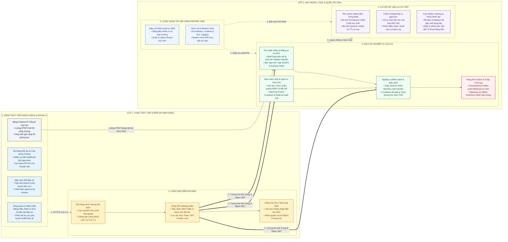
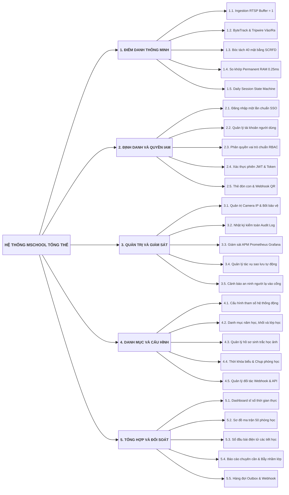
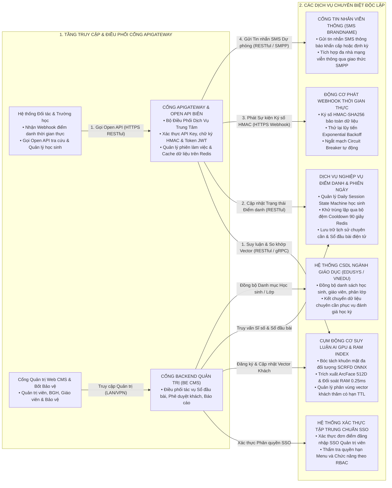
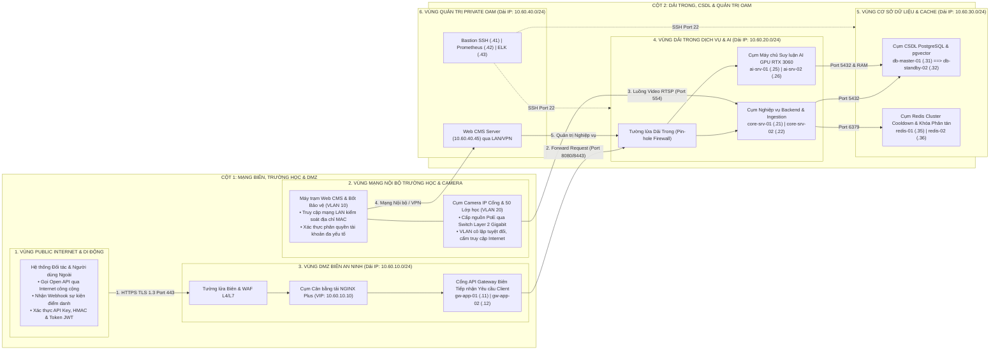
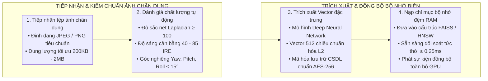
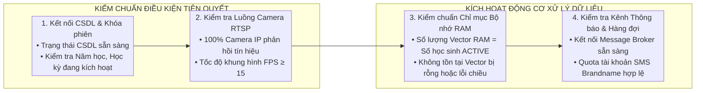
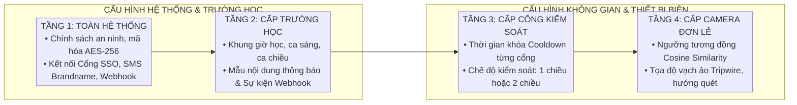
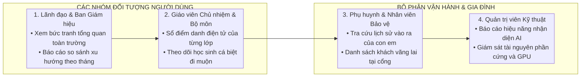
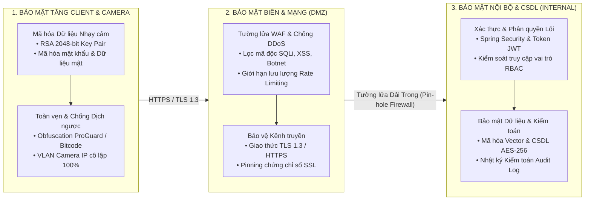
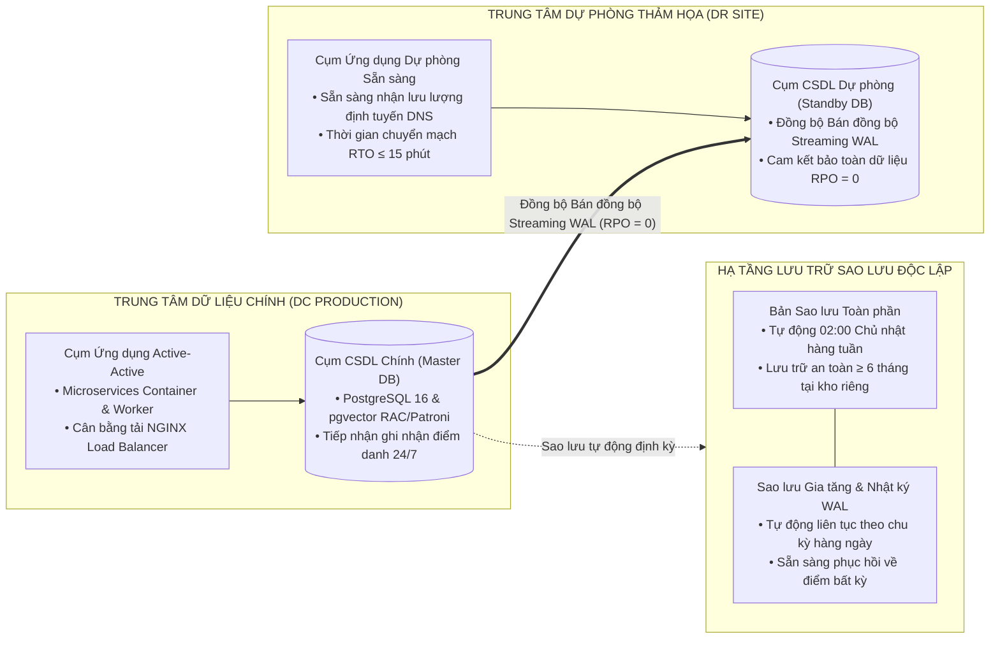

# HỆ THỐNG GIẢI PHÁP TRƯỜNG HỌC THÔNG MINH
## KHỐI CÔNG NGHỆ VÀ TRÍ TUỆ NHÂN TẠO MSCHOOL

---

# HỆ THỐNG TRƯỜNG HỌC THÔNG MINH MSCHOOL
# TÀI LIỆU THIẾT KẾ TỔNG THỂ

**Mã hiệu dự án:** MSCHOOL  
**Mã hiệu tài liệu:** MSCHOOL-HLD-V1.0 (Tài liệu Thiết kế Tổng thể Hệ thống)  
**Địa danh & Thời gian:** Hanoi, 09/2026  

---

## BẢNG KÝ DUYỆT TÀI LIỆU

| Vai trò | Họ và tên | Chức danh / Đơn vị | Chữ ký | Ngày ký |
| :--- | :--- | :--- | :---: | :---: |
| **Người lập** | Kỹ sư Thiết kế Hệ thống | Kỹ sư Kiến trúc Phần mềm | | 22/09/2026 |
| **Người thẩm tra** | Chuyên gia Giải pháp | Trưởng phòng Kiến trúc Giải pháp | | 22/09/2026 |
| **Người phê duyệt** | Lãnh đạo Khối CNTT | Giám đốc Trung tâm Giải pháp Giáo dục | | 22/09/2026 |

---

## BẢNG GHI NHẬN THAY ĐỔI TÀI LIỆU

*Ghi chú ký hiệu:* `A*` – Tạo mới (Add), `M` – Sửa đổi (Modify), `D` – Xóa bỏ (Delete).

| Ngày thay đổi | Vị trí thay đổi | A*, M, D | Nguồn gốc | Phiên bản cũ | Mô tả thay đổi | Phiên bản mới |
| :--- | :--- | :---: | :--- | :---: | :--- | :---: |
| 22/09/2026 | Toàn bộ tài liệu | A* | Khởi tạo ban đầu | N/A | Khởi tạo Tài liệu Thiết kế Tổng thể theo Tiêu chuẩn Kiến trúc Hệ thống Phần mềm Doanh nghiệp | V1.0 |

---

## PHẦN I: GIỚI THIỆU

### 1.1. Mục đích
Tài liệu Thiết kế Tổng thể này cung cấp bức tranh toàn cảnh về kiến trúc hệ thống Trường học Thông minh mschool (Smart School Management & Non-cooperative Facial Recognition Attendance System). Tài liệu đặc tả các mô hình kiến trúc đa tầng dưới nhiều góc nhìn: Nghiệp vụ học đường, Kiến trúc phân lớp ứng dụng, Phân vùng an ninh mạng, Giao tiếp tích hợp hệ sinh thái giáo dục và viễn thông, Bảng định cỡ tải hạ tầng và Khung an toàn thông tin theo Tiêu chuẩn Quốc gia và Doanh nghiệp cấp độ 3.

Tài liệu là căn cứ pháp lý và kỹ thuật phục vụ:
* Thống nhất giải pháp kiến trúc tổng thể giữa Ban quản trị dự án, đơn vị thụ hưởng và đội ngũ kỹ thuật.
* Làm cơ sở nghiệm thu thiết kế kỹ thuật kiến trúc toàn diện.
* Cung cấp đầu vào trực tiếp cho việc xây dựng Tài liệu Thiết kế Chi tiết và Thiết kế Cơ sở Dữ liệu.

### 1.2. Phạm vi
Tài liệu áp dụng cho toàn bộ các thành phần phần mềm, phần cứng biên và hạ tầng lưu trữ thuộc giải pháp mschool, bao gồm:
* Hệ thống thu nhận luồng video RTSP thời gian thực và thuật toán bám vết đối tượng tại cổng trường và hành lang.
* Động cơ suy luận thị giác máy tính và phân vùng đối soát nhận diện khuôn mặt tức thời trong bộ nhớ RAM máy chủ biên.
* Máy chủ nghiệp vụ quản lý quy trình chuyên cần, bộ máy trạng thái phiên học sinh trong ngày, phân hệ khách thăm trường và điều phối chụp ảnh lớp học theo thời khóa biểu.
* Cổng thông tin Web quản trị trường học (Web CMS) tích hợp bảng điều khiển sĩ số thời gian thực, Sổ đầu bài điện tử cho giáo viên, bàn làm việc tiếp đón khách tại bốt bảo vệ và phân hệ Cổng tra cứu Web dành cho phụ huynh.
* Hệ thống CSDL quan hệ kết hợp chỉ mục vector và cơ chế bộ nhớ đệm phân tán.
* Tầng Cổng Tích hợp Mở API & Webhook Đa Nền tảng kết nối thông suốt với hệ sinh thái học đường (SIS, vnEdu, EduSys), ứng dụng nhà trường, cổng tin nhắn viễn thông SMS Brandname và hệ thống xác thực tập trung SSO.

### 1.3. Khái niệm, Thuật ngữ và Từ viết tắt

| Thuật ngữ / Viết tắt | Diễn giải ý nghĩa |
| :--- | :--- |
| **HLD** | Tài liệu Thiết kế Tổng thể theo Tiêu chuẩn Kiến trúc Hệ thống Doanh nghiệp. |
| **ATTT** | An toàn Thông tin theo tiêu chuẩn bảo đảm an toàn hệ thống cấp độ 3. |
| **IAM** | Phân hệ Quản lý Định danh và Quyền truy cập người dùng trong hệ thống. |
| **SSO** | Cơ chế Đăng nhập Một lần tập trung cho toàn bộ ứng dụng người dùng. |
| **RBAC** | Mô hình kiểm soát truy cập dựa trên vai trò người dùng trong hệ thống. |
| **Master Data** | Dữ liệu danh mục dùng chung của toàn hệ sinh thái học đường. |
| **Audit Log** | Nhật ký kiểm toán ghi nhận bất biến mọi tác vụ truy cập và chỉnh sửa dữ liệu. |
| **RTSP** | Giao thức truyền phát luồng dữ liệu thời gian thực từ Camera IP. |
| **Tripwire** | Vạch ảo không gian được định nghĩa trong luồng xử lý ảnh để xác định hướng di chuyển Vào hoặc Ra. |
| **Cosine Similarity** | Độ đo độ tương đồng góc giữa hai vector đặc trưng khuôn mặt trong không gian đa chiều. |
| **TTL** | Thời gian sống có hiệu lực của bản ghi hoặc phiên trong bộ nhớ đệm hoặc CSDL. |
| **Webhook** | Cơ chế phát sự kiện thời gian thực kèm chữ ký số HMAC-SHA256 đến hệ thống đối tác. |
| **TPS** | Số lượng giao dịch tiếp nhận và xử lý trong một giây. |
| **HA / LB** | Tính sẵn sàng cao và cơ chế cân bằng tải hệ thống. |
| **RTO / RPO** | Thời gian phục hồi mục tiêu và Điểm phục hồi mục tiêu khi xảy ra thảm họa. |

### 1.4. Tài liệu Tham khảo
1. Tài liệu Đề án Triển khai Trường học Thông minh mschool phiên bản V1.0.
2. Tài liệu Thiết kế Kỹ thuật và Kế hoạch Triển khai mschool phiên bản V1.0.
3. Tiêu chuẩn Quốc gia TCVN 11930:2017 về Yêu cầu cơ bản về an toàn hệ thống thông tin theo cấp độ.
4. Nghị định 85/2016/NĐ-CP về Bảo đảm an toàn hệ thống thông tin theo cấp độ.
5. Nghị định 13/2023/NĐ-CP của Chính phủ về Bảo vệ Dữ liệu Cá nhân.

### 1.5. Mô tả Bố cục Tài liệu
* **Phần I - Giới thiệu:** Trình bày mục đích, phạm vi, thuật ngữ, tài liệu tham khảo và bố cục tổng thể.
* **Phần II – Các yêu cầu ảnh hưởng đến kiến trúc:** Đặc tả các yêu cầu phi chức năng, năng lực xử lý định lượng, ràng buộc môi trường và pháp lý.
* **Phần III – Kiến trúc ứng dụng:** Trình bày mô hình kiến trúc phân lớp và phân vùng an ninh 5 lớp, sơ đồ phân rã chức năng 3 tầng bao gồm 5 phân hệ cốt lõi, các cơ chế vận hành cốt lõi và xử lý ngoại lệ biên, kiến trúc tích hợp hệ thống ngoài, quy hoạch mạng tổng thể, bảng định cỡ máy chủ, kiến trúc dữ liệu đầu vào & kiểm chuẩn Pre-flight, động cơ cấu hình động đa tầng Zero-Downtime và hệ thống 8 mẫu báo cáo thống kê chuyên sâu.
* **Phần IV – Các giải pháp kiến trúc khác:** Trình bày kiến trúc an toàn thông tin ATTT 3 lớp, kiến trúc sao lưu phục hồi thảm họa và giải pháp chịu tải cao.

---

## PHẦN II: CÁC YÊU CẦU ẢNH HƯỞNG ĐẾN KIẾN TRÚC

### 2.1. Yêu cầu Phi chức năng & Năng lực Xử lý
Kiến trúc hệ thống mschool được thiết kế nhằm đáp ứng các chỉ tiêu chất lượng dịch vụ định lượng khắt khe phục vụ môi trường học đường số:
* **Quy mô phục vụ:** Phục vụ từ 2.000 đến 3.000 học sinh, cán bộ giáo viên và 50 phòng học tiêu chuẩn trên mỗi điểm trường, sẵn sàng mở rộng hỗ trợ mô hình đa trường học tập trung.
* **Thời gian nhận diện không dừng:** Thời gian xử lý từ lúc khuôn mặt lọt vào tầm quét camera đến khi trích xuất vector và đối soát trong bộ nhớ RAM không vượt quá 300ms, bảo đảm người đi bộ qua cổng trường với tốc độ tự nhiên 1.0 đến 1.5 m/s không phải dừng bước.
* **Thời gian phát thông báo phụ huynh & Bắn sự kiện Webhook:** Tổng độ trễ từ khi phát hiện học sinh qua cổng đến khi hệ thống phát sự kiện Webhook kèm ảnh đối soát và gửi thông báo đến phụ huynh qua kênh liên lạc nhà trường không vượt quá 2.0 giây.
* **Độ chính xác nhận diện:** Đạt tỷ lệ nhận diện đúng từ 98.5% trở lên trong điều kiện ánh sáng tự nhiên tại khu vực cổng trường và trong lớp học.
* **Xử lý lưu lượng dồn dập:** Hệ thống có năng lực tiếp nhận đỉnh tải 80% lưu lượng học sinh đến trường tập trung trong 30 phút đầu giờ sáng (07h00 đến 07h30) mà không phát sinh hiện tượng nghẽn luồng hay mất khung hình.
* **Tính sẵn sàng của dịch vụ:** Đảm bảo độ sẵn sàng dịch vụ tối thiểu 99.9%, tương ứng thời gian gián đoạn ngoài kế hoạch không vượt quá 8.76 giờ trong một năm.
* **Chỉ số phục hồi dữ liệu:** Thời gian chuyển đổi dự phòng RTO ≤ 15 phút và bảo đảm tính toàn vẹn dữ liệu giao dịch RPO = 0.

### 2.2. Các Ràng buộc về Công nghệ, Môi trường và Pháp lý
* **Bảo vệ dữ liệu cá nhân theo Nghị định 13/2023/NĐ-CP:** Toàn bộ dữ liệu sinh trắc học khuôn mặt và thông tin cá nhân của học sinh, giáo viên phải được mã hóa theo tiêu chuẩn AES-256 khi lưu trữ bền vững và chỉ vận hành trong vùng mạng nội bộ của trường học hoặc trung tâm dữ liệu đạt chuẩn An toàn Thông tin Cấp độ 3.
* **Phân vùng an ninh mạng Dải Trong và Dải Ngoài:** Hệ thống áp dụng quy chuẩn phân vùng an toàn thông tin đa tầng, phân lập tuyệt đối giữa các luồng dữ liệu công cộng từ Internet/Cổng Web & API và các vùng ứng dụng xử lý nghiệp vụ lõi, camera và cơ sở dữ liệu.
* **Tính toán suy luận AI tại biên:** Nhằm triệt tiêu độ trễ đường truyền Internet và bảo mật hình ảnh video học sinh, toàn bộ tác vụ giải mã RTSP và suy luận AI được thực thi trực tiếp trên máy chủ biên trang bị bộ xử lý đồ họa GPU tại trường học.
* **Triển khai kiến trúc dự phòng:** Toàn bộ các dịch vụ phần mềm được đóng gói dưới dạng container độc lập, thiết lập cơ chế tự phục hồi, cân bằng tải và dự phòng chuyển mạch khi có sự cố phần cứng.

---

## PHẦN III: KIẾN TRÚC ỨNG DỤNG

### 3.1. Mô hình Kiến trúc Phân lớp và Phân vùng Hệ thống

Kiến trúc Hệ thống mschool được phân tách thành 5 phân vùng an ninh logic và vật lý độc lập theo chuẩn bảo mật phòng vệ chiều sâu đa tầng. Mọi giao tiếp giữa các phân vùng đều đi qua tường lửa kiểm soát luồng dữ liệu, áp dụng mã hóa kênh truyền và cơ chế xác thực phiên nghiêm ngặt nhằm triệt tiêu điểm lỗi đơn lẻ và ngăn chặn tấn công leo thang:

#### Bảng Đặc tả Chi tiết Phân vùng Mạng, Cụm Máy chủ và Phân hệ Dịch vụ

| Phân vùng an ninh | Tên máy chủ (Hostname) | Cụm dịch vụ / Phân hệ cài đặt | Cổng dịch vụ & Giao thức | Chức năng cốt lõi & Cơ chế an ninh |
| :--- | :--- | :--- | :--- | :--- |
| **1. Kênh Truy cập & Mạng ngoài** | Người dùng Web / Hệ thống Tích hợp / Camera IP | • Cổng Quản trị Web CMS (Ban Giám hiệu, Giáo viên, Bốt bảo vệ, Tra cứu Phụ huynh) • Hệ thống Đối tác & Ứng dụng Trường (Nhận Webhook, gọi Open API) • Camera IP Cổng và 50 Phòng học | HTTPS (Port 443), WSS (Port 443), RTSP (Port 554) | Kênh tương tác quản trị web, phát sự kiện Webhook thời gian thực và thu nhận video; xác thực phiên Token JWT, chữ ký số HMAC-SHA256 và truyền hình ảnh qua VLAN bảo vệ. |
| **2. Vùng DMZ Dải Ngoài** | `dmz-gw-01` `dmz-gw-02` | • Cụm NGINX Plus Load Balancer (VIP Dải Ngoài) • Cổng API Gateway Biên Tiếp nhận Web Traffic & Open API Đối tác • Cổng Xác thực Tập trung Đăng nhập Một lần SSO | Port 80, 443, 8080 (HTTPS RESTful) | Tiếp nhận truy cập từ Internet, thực hiện bóc tách SSL Offloading, ngăn chặn DDoS L4/L7, kiểm tra Token JWT và điều phối phân tải. |
| **3. Vùng Dải Trong Nghiệp vụ** | `ai-srv-01` `ai-srv-02` | • Tiến trình Thu nhận Video Ingestion Worker • Động cơ Suy luận AI GPU (SCRFD, ArcFace) | Port 8000, 50051 (RESTful / gRPC) | Giải mã RTSP không đệm, bám vết đa đối tượng, phân chia ROI phòng học và trích xuất vector khuôn mặt 512 chiều. |
| | `core-srv-01` `core-srv-02` | • Phân hệ Định danh & Phân quyền IAM (SSO, RBAC) • Phân hệ Quản trị Cấu hình & Danh mục Master Data • Dịch vụ Điểm danh & Bộ máy Trạng thái Phiên Ngày • Dịch vụ Điều phối Phòng học & Khách thăm TTL • Động cơ Webhook Ký số & Open API Chuẩn CSDL Ngành | Port 8080, 8443 (JSON RESTful) | Xác thực SSO, phân quyền RBAC, chốt Giờ Đến/Về, khử trùng lặp qua bộ đệm Cooldown 90 giây, đối soát danh sách lớp, phát sự kiện Webhook thời gian thực kèm ảnh đối soát và gửi tin nhắn SMS viễn thông. |
| **4. Vùng Quản trị Private OAM** | `oam-mgmt-01` | • Máy chủ Web Quản trị CMS • Quản trị Cấu hình Tham số, Camera IP & Danh mục • Giám sát Hiệu năng Prometheus / Grafana • Quản trị Truy cập An toàn Bastion Host SSH | Port 3000, 9090, 22 (Chỉ mở nội bộ VPN / LAN) | Bảng điều khiển sĩ số trực quan, quản trị tài khoản người dùng, cấu hình tham số hệ thống, sơ đồ ma trận 50 phòng học, quản lý thời khóa biểu và giám sát 24/7. |
| **5. Vùng CSDL & Lưu trữ** | `db-master-01` `db-standby-02` `redis-cluster-01/02` | • Kho Vector Nhận diện Trong RAM Bộ nhớ Đệm • CSDL PostgreSQL 16 & Tiện ích mở rộng pgvector • Cụm Redis Cluster Lưu trữ Cooldown & Phiên | Port 5432, 6379 (PostgreSQL Protocol, Redis Protocol) | Lưu trữ hồ sơ sinh trắc học mã hóa AES-256, lịch sử điểm danh, dữ liệu danh mục Master Data, nhật ký Audit Log, bộ đệm khử trùng lặp và khóa phân tán. |

---

### 3.2. Mô hình Phân rã Chức năng và Phân hệ

Hệ thống mschool được tổ chức thành 5 phân hệ chức năng độc lập theo chuẩn mô hình phân rã dạng cây 3 tầng dóng thẳng hàng lề trái tuyệt đối, bao phủ toàn diện từ tầng thu nhận AI biên, quản lý định danh truy cập IAM, quản trị hệ thống và giám sát, quản lý danh mục và cấu hình tham số, đến tổng hợp báo cáo chuyên cần học đường:

#### 3.2.1. Phân hệ Điểm danh Thông minh và Trí tuệ Nhân tạo Biên
* **Thu nhận luồng RTSP không đệm:** Tiến trình nền tiếp nhận luồng video chuẩn H.264/H.265 từ Camera IP qua cổng mạng Gigabit, thiết lập kích thước bộ đệm ở mức tối thiểu 1 khung hình để triệt tiêu hoàn toàn độ trễ tích lũy.
* **Bám vết đối tượng đa mục tiêu:** Áp dụng thuật toán ByteTrack theo dõi chuyển động liên tục của từng đối tượng qua cổng, cấp phát định danh bám vết duy nhất cho mỗi học sinh khi bước vào tầm quét.
* **Vạch ảo không gian hai chiều:** Tự động tính toán biến thiên tọa độ trọng tâm qua vạch ảo không gian được cấu hình tại khu vực cổng trường để xác định chính xác chiều di chuyển Vào trường (IN) hoặc Ra về (OUT).
* **Bóc tách đồng thời nhiều khuôn mặt:** Ứng dụng mô hình mạng nơ-ron phát hiện khuôn mặt SCRFD tối ưu hóa tăng tốc trên GPU, bóc tách đồng thời trên 40 khuôn mặt trong ảnh toàn cảnh phòng học với thời gian dưới 25ms.
* **So khớp tức thời trong bộ nhớ RAM:** Duy trì kho vector học sinh và giáo viên thường trực trong bộ nhớ RAM máy chủ, thực hiện phép nhân ma trận tích vô hướng độ tương đồng Cosine đạt tốc độ đối soát 1:N dưới 0.25ms cho quy mô toàn trường; hỗ trợ vùng nhớ khách thăm trường có thời hạn TTL tự hủy.
* **Bộ máy trạng thái phiên học sinh trong ngày:** Quản lý Daily Session State Machine tự động chốt mốc Giờ Đến trong phiên sáng, Giờ Về trong phiên chiều, tự động bỏ qua các lượt di chuyển ra ngoài trong thời gian ngắn dưới 5 phút và khử trùng lặp qua bộ đệm Cooldown 90 giây Redis.

#### 3.2.2. Phân hệ Định danh và Quản lý Truy cập (IAM)
* **Đăng nhập một lần tập trung chuẩn SSO:** Tích hợp trực tiếp với hệ thống xác thực tập trung SSO (OpenID Connect / OAuth 2.0), cung cấp cơ chế đăng nhập đơn điểm cho cán bộ quản lý giáo dục, hiệu trưởng và nhân viên nhà trường, loại bỏ hoàn toàn việc duy trì tài khoản phân tán.
* **Quản lý tài khoản người dùng đa vai trò:** Quản lý vòng đời tài khoản người dùng của toàn trường (học sinh, phụ huynh, giáo viên bộ môn, giáo viên chủ nhiệm, cán bộ quản trị và nhân viên bảo vệ), hỗ trợ khóa tài khoản tự động khi phát sinh đăng nhập bất thường.
* **Phân quyền vai trò người dùng chuẩn RBAC:** Thiết lập ma trận phân quyền chi tiết đến từng chức năng, màn hình và quyền thao tác (Xem, Thêm, Sửa, Xóa, Phê duyệt, Xuất báo cáo), bảo đảm nguyên tắc đặc quyền tối thiểu.
* **Xác thực phiên làm việc và bảo mật Token:** Quản lý phiên làm việc tập trung qua Token JWT có gắn mã định danh thiết bị Device Token, mã hóa thông tin nhạy cảm trước khi truyền mạng bằng thuật toán bất đối xứng RSA 2048-bit.
* **Quản lý Thẻ đón con điện tử và Mã QR:** Cấp phát mã định danh phụ huynh đón con dạng mã QR động có gắn thời hạn hiệu lực qua Cổng thông tin Web tra cứu hoặc phát sự kiện Webhook sang hệ thống đối tác; nhân viên bảo vệ quét mã tại bốt kiểm soát cổng để xác minh danh tính và mở làn đón học sinh.

#### 3.2.3. Phân hệ Quản trị Hệ thống và Giám sát
* **Quản trị thiết bị Camera IP và Bốt bảo vệ:** Quản lý danh sách thiết bị camera IP lắp đặt tại cổng trường và 50 phòng học (địa chỉ IP, luồng RTSP, trạng thái kết nối mạng PoE, độ phân giải); thiết lập tọa độ vạch ảo Tripwire và liên kết camera với màn hình bốt bảo vệ.
* **Nhật ký kiểm toán tập trung Audit Log:** Tự động ghi nhận tệp nhật ký kiểm toán bất biến đối với 100% các hành vi trong hệ thống (đăng nhập, chỉnh sửa sĩ số, cập nhật thời khóa biểu, xuất dữ liệu học sinh, can thiệp tham số); lưu vết đầy đủ người thực hiện, thời gian, IP và dữ liệu trước/sau thay đổi.
* **Giám sát hiệu năng và APM:** Thu thập tự động các chỉ số vận hành hệ thống (tải CPU, bộ nhớ RAM, nhiệt độ GPU RTX 3060, thông lượng mạng, dung lượng ổ đĩa) qua Prometheus và hiển thị bảng điều khiển Grafana thời gian thực.
* **Quản lý tác vụ sao lưu và bảo trì tự động:** Thiết lập và kiểm soát tiến trình sao lưu định kỳ toàn phần vào Chủ nhật và sao lưu gia tăng nhật ký WAL hàng ngày; kích hoạt kiểm tra tính toàn vẹn của tệp sao lưu tự động.
* **Cảnh báo an ninh người lạ vào cổng trường:** Khi camera cổng phát hiện đối tượng không khớp với hồ sơ học sinh, giáo viên hay khách đăng ký, hệ thống tự động phát tín hiệu cảnh báo viền đỏ và âm thanh đến máy trạm bốt bảo vệ để kịp thời kiểm tra, ngăn chặn.

#### 3.2.4. Phân hệ Quản lý Danh mục và Cấu hình Hệ thống
* **Cấu hình tham số hệ thống động:** Cho phép quản trị viên tùy biến các tham số nghiệp vụ mà không cần khởi động lại dịch vụ: Ngưỡng Cosine nhận diện khuôn mặt (mặc định 0.85), cửa sổ thời gian khử trùng lặp Cooldown (mặc định 90 giây), thời gian sống của khách thăm trường TTL (mặc định 120 phút), ngưỡng thời gian vào muộn và khung giờ các tiết học.
* **Quản lý danh mục học đường cốt lõi Master Data:** Quản lý phân cấp danh mục năm học, học kỳ, tuần học, danh sách khối 10, 11, 12, danh sách phòng học tiêu chuẩn và phòng chức năng; quản lý thông tin lớp học và phân công giáo viên chủ nhiệm.
* **Quản lý hồ sơ sinh trắc học học sinh và giáo viên:** Quản lý kho ảnh chân dung chuẩn, tự động kiểm định chất lượng ảnh đầu vào bằng thuật toán eDifFIQA (độ sắc nét, góc quay, độ mở mắt); trích xuất và đồng bộ vector 512 chiều sang bộ nhớ RAM của máy chủ biên.
* **Quản lý thời khóa biểu và lịch quét phòng học:** Cập nhật thời khóa biểu theo từng tuần học; tự động sinh lịch trình kích hoạt bộ lập lịch Quartz Scheduler chụp ảnh tại 50 phòng học vào đúng phút thứ 5 đầu mỗi tiết học.
* **Quản lý cấu hình đối tác và Webhook:** Quản trị các điểm cuối Webhook tích hợp với hệ thống bên ngoài, cấu hình mã khóa bí mật tạo chữ ký HMAC-SHA256, thiết lập chính sách thử lại tự động theo thuật toán Exponential Backoff và cơ chế ngắt mạch Circuit Breaker khi đối tác mất kết nối.

#### 3.2.5. Phân hệ Tổng hợp Báo cáo và Đối soát Chuyên cần
* **Bảng điều khiển sĩ số toàn trường thời gian thực:** Kết xuất biểu đồ chuyên cần trực quan, cập nhật biến động quân số đến/về qua kết nối WebSocket thời gian thực, hiển thị trực tiếp luồng video camera cổng trường và danh sách học sinh vừa quét qua cổng.
* **Sơ đồ ma trận 50 phòng học trực quan:** Hiển thị trực quan trạng thái điểm danh của 50 phòng học phân chia theo khối 10, 11, 12; hỗ trợ giáo viên và ban giám hiệu xem chi tiết phân vùng bục giảng giáo viên và dãy bàn học sinh.
* **Sổ đầu bài điện tử các tiết học:** Tự động ghi nhận sĩ số học sinh có mặt, vắng mặt có phép/không phép và giáo viên đứng lớp/dạy thay theo từng tiết học; hỗ trợ giáo viên bộ môn ký duyệt sổ đầu bài điện tử bằng một chạm.
* **Báo cáo chuyên cần và phát hiện ngồi nhầm lớp:** Tự động so sánh danh sách nhận diện thực tế tại phòng học với danh sách học sinh chính thức của lớp, phát hiện học sinh vắng mặt, cảnh báo trường hợp học sinh ngồi nhầm phòng học và xuất báo cáo chuyên cần định kỳ sang định dạng Excel/PDF.
* **Hàng đợi Outbox và đẩy sự kiện tức thời:** Áp dụng mô hình Transactional Outbox Pattern quét định kỳ mỗi 1 giây, phát sự kiện Webhook thời gian thực có ký số HMAC-SHA256 đến cổng tích hợp đối tác và gửi tin nhắn viễn thông SMS Brandname chuyên dụng đến số điện thoại phụ huynh trong thời gian dưới 2 giây.

#### 3.2.6. Các Cơ chế Vận hành Cốt lõi và Xử lý Ngoại lệ Biên
Để duy trì vận hành ổn định trong các điều kiện thực tế khắc nghiệt (mất kết nối mạng Internet, ánh sáng thay đổi, học sinh chạy nhảy qua cổng dồn dập), hệ thống tích hợp đầy đủ 5 cơ chế vận hành tự quản:
* **Tiến trình khởi động, tự kiểm tra và làm nóng bộ nhớ đệm (Bootstrap & Pre-warming):**
  * *Khởi động theo thứ tự phụ thuộc nghiêm ngặt:* Kết nối CSDL Core -> Kết nối Redis Cluster -> Nạp danh mục Master Data vào RAM -> Tải toàn bộ Vector đặc trưng học sinh vào FAISS Index -> Khởi động tiến trình giải mã RTSP và suy luận GPU.
  * *Làm nóng chỉ mục bộ nhớ đệm (Pre-warming):* Đảm bảo trước khi học sinh đầu tiên bước qua cổng lúc sáng sớm, toàn bộ dữ liệu đối soát đã thường trực trong bộ nhớ RAM máy chủ biên với thời gian phản hồi microsecond, triệt tiêu hoàn toàn tình trạng trễ lạnh (Cold-start latency).
* **Quản trị luồng video và tự phục hồi tín hiệu biên (RTSP Watchdog & Auto-reconnect):**
  * *Giám sát nhịp tim tín hiệu luồng (Heartbeat Watchdog):* Luồng RTSP từ mỗi camera được theo dõi liên tục. Nếu khung hình không được cập nhật quá 5 giây hoặc tốc độ khung hình giảm xuống dưới 10 FPS, hệ thống tự động ghi nhận cảnh báo suy hao tín hiệu.
  * *Cơ chế tự kết nối lại có kiểm soát (Exponential Backoff):* Hệ thống tự động thiết lập lại kết nối tới camera sau các khoảng thời gian tăng dần (1s, 2s, 4s, 8s... tối đa 30s) mà không làm sập hoặc treo tiến trình chính.
  * *Cảnh báo suy giảm chất lượng hình ảnh:* Tự động phát hiện hiện tượng ống kính camera bị mờ, rung lắc, lóa sáng quá mức hoặc mất góc quét để cảnh báo cho đội ngũ kỹ thuật nhà trường xử lý kịp thời.
* **Bộ máy xử lý ngoại lệ biên và tình huống học đường bất thường:**

| Tình huống ngoại lệ | Mô tả hiện tượng thực tế | Cơ chế xử lý kỹ thuật của hệ thống |
| :--- | :--- | :--- |
| **Khuôn mặt lạ (Unknown Visitor)** | Người qua cổng không khớp với bất kỳ vector nào trong danh mục học sinh hoặc giáo viên (độ tương đồng < ngưỡng quy định). | Tự động crop ảnh khuôn mặt, gán mã định danh khách vãng lai, ghi nhật ký kèm mốc thời gian và gửi cảnh báo dạng Pop-up tức thời về màn hình Bốt bảo vệ để kiểm tra. |
| **Học sinh đứng lâu tại cổng (Spam Trigger)** | Học sinh đứng trò chuyện hoặc đứng chờ bạn tại khu vực quét của camera, gây kích hoạt nhận diện liên tục. | **Cơ chế Khóa Cooldown phân tán:** Sử dụng Redis Key dạng `cooldown:{student_id}:{gate_id}:{direction}` với thời gian sống TTL 90 giây. Trong khoảng thời gian này, các lượt quét trùng lặp chỉ được ghi log nội bộ, không phát sinh giao dịch mới và không phát thêm sự kiện Webhook/SMS. |
| **Học sinh đi ngược chiều** | Học sinh đã vào trường nhưng quay trở ra cổng lấy đồ rồi lại đi vào trong vòng vài phút. | Hệ thống sử dụng Bộ máy Trạng thái Hữu hạn (Daily Session State Machine) theo dõi lịch sử phiên học sinh: Ghi nhận sự kiện Ra, cập nhật trạng thái tạm thời, sau đó ghi nhận sự kiện Vào lần hai và phát sự kiện cập nhật kèm ghi chú rõ ràng. |
| **Mất kết nối mạng Internet (WAN Outage)** | Trường học bị đứt cáp quang Internet ra ngoài, không thể kết nối tới máy chủ trung tâm hoặc Cổng gửi thông báo. | **Cơ chế Đệm Ngoại tuyến (Offline Local Buffer):** Máy chủ biên tại trường vẫn thực hiện nhận diện và ghi nhận chuyên cần bình thường vào CSDL nội bộ. Các sự kiện Webhook/SMS được lưu vào hàng đợi Outbox. Khi kết nối Internet được phục hồi, tiến trình nền tự động đồng bộ bù dữ liệu lên hệ thống trung tâm. |

* **Động cơ phân phối sự kiện qua Transactional Outbox Webhook Gateway:**
  * Toàn bộ sự kiện điểm danh thành công được ghi đồng thời vào bảng hàng đợi Outbox trong cùng một giao dịch CSDL bền vững với độ trễ ghi < 5ms.
  * Động cơ Webhook quét hàng đợi Outbox theo chu kỳ 1 giây, thực hiện ký số HMAC-SHA256 và chuyển tiếp tức thời đến các hệ thống đối tác qua giao thức HTTPS.
  * Tích hợp kênh tin nhắn SMS Brandname đóng vai trò gửi thông báo khẩn cấp hoặc gửi trực tiếp đến số điện thoại phụ huynh học sinh.
* **Quy trình điều chỉnh điểm danh và phê duyệt thủ công (Manual Override & Maker-Checker):**
  * Cho phép Giáo viên chủ nhiệm hoặc Ban giám hiệu điều chỉnh trạng thái điểm danh trong các trường hợp đặc biệt (học sinh xin nghỉ ốm có đơn phép, học sinh đi vào qua cổng phụ không có camera, học sinh tham gia hoạt động ngoại khóa).
  * Toàn bộ các thao tác can thiệp thủ công bắt buộc phải nhập lý do giải trình, ghi nhận người thực hiện và lưu vết vào Audit Log bất biến, không thể bị xóa hay sửa đè.

---

### 3.3. Giao tiếp với Các Hệ thống Khác

Kiến trúc tích hợp của hệ thống mschool được xây dựng theo mô hình **Điều Phối Cổng API Gateway Trung Tâm**. Mọi yêu cầu từ người dùng Web CMS, máy trạm bốt bảo vệ và các hệ thống đối tác bên ngoài đều tập trung tại Cổng API Gateway nội bộ để xác thực chữ ký số, kiểm soát quyền hạn và điều phối độc lập sang các dịch vụ chuyên biệt, tuyệt đối không cho phép các dịch vụ gọi chéo trực tiếp lẫn nhau:

#### 3.3.1. Giao tiếp với Cụm Động cơ Trí tuệ Nhân tạo Biên
* Giao tiếp giữa Cổng Backend và Động cơ AI được thực hiện qua giao thức mạng nội bộ tốc độ cao gRPC hoặc HTTP RESTful với dữ liệu định dạng JSON / Multipart.
* Cổng Backend gửi yêu cầu đăng ký hồ sơ khuôn mặt mới kèm ảnh chụp chất lượng cao; Động cơ AI thực hiện kiểm định chất lượng, trích xuất vector 512 chiều và ghi nhận đồng thời vào phân vùng bộ nhớ RAM để sẵn sàng so khớp ngay lập tức.
* Khi tiếp nhận thông tin khách đăng ký đến trường, Cổng Backend gửi yêu cầu nạp vector vào phân vùng động kèm siêu dữ liệu mốc thời gian hiệu lực TTL.

#### 3.3.2. Giao tiếp với Hệ thống Xác thực Tập trung SSO
* Cổng Backend CMS tích hợp với hệ thống xác thực tập trung SSO qua giao thức chuẩn OpenID Connect / OAuth 2.0 phục vụ cơ chế đăng nhập một lần cho cán bộ quản lý giáo dục, hiệu trưởng và nhân viên nhà trường.
* Sau khi người dùng xác thực thành công tại cổng SSO, hệ thống nhận về mã định danh truy cập, thực hiện thẩm tra tính hợp lệ và ánh xạ danh sách quyền hạn và vai trò theo cấu hình phân quyền RBAC để phân quyền hiển thị chức năng trên giao diện Web CMS.

#### 3.3.3. Giao tiếp với Động cơ Webhook Tích hợp Thời gian thực
* Toàn bộ sự kiện điểm danh qua cổng và phòng học được truyền phát theo thời gian thực tới các hệ thống bên ngoài (hệ thống quản lý nhà trường SIS, cổng thông tin phụ huynh, ứng dụng trường học đối tác) thông qua giao thức HTTPS Webhook chuẩn công nghiệp.
* Mỗi gói tin Webhook được ký số bằng mã băm HMAC-SHA256 (đặt trong HTTP Header `X-Hub-Signature-256`) sử dụng khóa bí mật riêng biệt cấp cho từng đối tác, bảo đảm 100% tính toàn vẹn dữ liệu và chống giả mạo nguồn phát.
* Động cơ Webhook áp dụng cơ chế Transactional Outbox Pattern quét định kỳ mỗi 1 giây từ CSDL, tích hợp thuật toán thử lại lũy tiến Exponential Backoff (1s, 2s, 4s, 8s... tối đa 60s) và bộ ngắt mạch Circuit Breaker tự động cô lập điểm cuối mất kết nối, cam kết không làm nghẽn luồng xử lý chính.

#### 3.3.4. Giao tiếp với Cổng Tin nhắn Viễn thông SMS Brandname
* Kết nối trực tiếp với Cổng tin nhắn thương hiệu SMS Brandname thông qua giao thức kết nối chuyên dụng SMPP hoặc Web Service HTTPS có mã hóa kênh truyền tới các nhà mạng viễn thông.
* Được sử dụng cho các kịch bản gửi tin nhắn trực tiếp đến số điện thoại phụ huynh thông báo chuyên cần, gửi thông báo khẩn cấp từ ban giám hiệu nhà trường khi có tình huống bất thường (nghỉ học đột xuất do thời tiết, cảnh báo y tế) hoặc làm kênh dự phòng tin cậy.

#### 3.3.5. Giao tiếp với Hệ thống CSDL Ngành Giáo dục (EduSys / vnEdu / MOET)
* Tích hợp qua Cổng Open REST API chuẩn OpenAPI và cơ chế Webhook hai chiều.
* Đồng bộ danh mục năm học, khối lớp, danh sách học sinh, giáo viên chủ nhiệm và thời khóa biểu giảng dạy định kỳ từ hệ thống quản lý học sinh ngành giáo dục về cơ sở dữ liệu mschool; đồng thời tự động xuất kết quả điểm danh chuyên cần cuối tháng để tích hợp vào học bạ điện tử.

---

### 3.4. Kiến trúc và Quy hoạch Mạng Tổng thể

Hạ tầng mạng của hệ thống mschool được quy hoạch thành 4 phân vùng an ninh độc lập, áp dụng các chính sách định tuyến và tường lửa nghiêm ngặt nhằm bảo vệ toàn diện hệ thống:

* **Chính sách Phân vùng An ninh Mạng:**
  * *Vùng Public Internet:* Tiếp nhận lưu lượng từ hệ thống đối tác bên ngoài, các bên tích hợp Open API và các phiên truy cập Web CMS từ xa; toàn bộ các gói tin phải đi qua hệ thống tường lửa chống DDoS và giải mã SSL/TLS 1.3 tại tầng biên.
  * *Vùng Mạng Nội bộ Trường học (Campus Private Zone):* Phân tách thành các VLAN riêng biệt; trong đó VLAN 20 dành riêng cho luồng RTSP từ Camera IP cổng và phòng học, bị cô lập hoàn toàn không có đường truy cập ra Internet nhằm ngăn chặn rò rỉ hình ảnh học sinh.
  * *Vùng DMZ (Dải Ngoài):* Đặt các máy chủ cân bằng tải NGINX Plus và Cổng API Gateway tiếp nhận lưu lượng mạng công cộng, tuyệt đối không chứa dữ liệu hồ sơ học sinh hay cơ sở dữ liệu bền vững.
  * *Vùng Dải Trong (Internal Zone):* Đặt các máy chủ xử lý nghiệp vụ backend và máy chủ suy luận AI GPU, chỉ chấp nhận kết nối được điều hướng từ Cổng API Gateway và máy chủ quản trị CMS qua các cổng dịch vụ được mở giới hạn.
  * *Vùng CSDL (DB Zone):* Lưu trữ dữ liệu quan hệ, chỉ mục vector và bộ nhớ đệm phân tán, chỉ cho phép truy cập từ dải IP của máy chủ nghiệp vụ và AI dải trong qua cổng chuyên dụng.
  * *Vùng Quản trị & Vận hành (Private OAM Zone):* Giám sát hệ sinh thái 24/7, thu thập tập trung tệp nhật ký kiểm toán và chỉ cho phép quản trị viên truy cập qua máy chủ chuyển tiếp Bastion Host có xác thực khóa công khai và VPN nội bộ.

---

### 3.5. Định cỡ Hệ thống & Bảng Giả thiết Thiết lập Địa chỉ IP Đề xuất

#### 3.5.1. Bảng Định cỡ Tải Hệ Thống

| STT | Chỉ số năng lực hệ thống | Đơn vị tính | Số lượng định mức | Ghi chú & Diễn giải kỹ thuật |
| :---: | :--- | :---: | :---: | :--- |
| 1 | Người dùng hoạt động thường xuyên | Người dùng | 3.000 | Học sinh, phụ huynh và giáo viên có phát sinh tương tác hàng ngày trên mỗi trường |
| 2 | Tổng số lượt quét nhận diện trong ngày | Lượt quét / Ngày | 15.000 | Bao gồm quét cổng đến/về và quét 3 khung hình đầu mỗi tiết tại 50 phòng học |
| 3 | Phiên kết nối Web CMS & Tích hợp đồng thời | Phiên kết nối | 1.000 | Lượng truy cập Web CMS và các kết nối tích hợp Webhook/API thời gian thực trong khung giờ cao điểm đón con |
| 4 | Thông lượng giao dịch tức thời (TPS) | Giao dịch / Giây | 30 - 60 | Thông lượng xử lý đối soát nhận diện và đẩy thông báo tại thời điểm tan học |
| 5 | Số lượng luồng video camera xử lý | Luồng RTSP | 2 - 4 luồng cổng | Luồng video Full HD 1080p phân tích bám vết liên tục 25 khung hình/giây |
| 6 | Số lượng camera chụp ảnh phòng học | Điểm chụp ảnh | 50 phòng học | Camera kích hoạt chụp 3 ảnh góc rộng độ phân giải cao tại phút thứ 5 đầu mỗi tiết học |
| 7 | Số lượng node triển khai tối thiểu | Node | ≥ 2 | Triển khai tối thiểu 2 nodes cho mọi dịch vụ cốt lõi bảo đảm tính sẵn sàng cao |
| 8 | Cơ chế đảm bảo tính sẵn sàng cao | Chuẩn HA | Load Balancing, Cluster, Failover | Tự động phân tải, chịu lỗi phần cứng và không gián đoạn dịch vụ điểm danh |

#### 3.5.2. Bảng Cấu hình Phần cứng Máy chủ & Giả thiết Thiết lập Địa chỉ IP Đề xuất

| STT | Phân vùng mạng | Node máy chủ (Hostname) | Dịch vụ cài đặt | Cấu hình phần cứng tối thiểu | Địa chỉ IP Đề xuất (Giả định) * | VIP Cân bằng tải | Port mở | Trạng thái IP |
| :---: | :--- | :--- | :--- | :--- | :---: | :---: | :---: | :--- |
| 1 | **Dải Ngoài (DMZ)** | `gw-app-01` | Cổng API Gateway & NGINX Load Balancer 01 | 16 GB RAM, 4 Cores, 200 GB SSD, CentOS 7+ | `10.60.10.11` | `10.60.10.10` | 80, 443 | IP đề xuất (Cập nhật khi cấp IP thật) |
| 2 | **Dải Ngoài (DMZ)** | `gw-app-02` | Cổng API Gateway & NGINX Load Balancer 02 | 16 GB RAM, 4 Cores, 200 GB SSD, CentOS 7+ | `10.60.10.12` | `10.60.10.10` | 80, 443 | IP đề xuất (Cập nhật khi cấp IP thật) |
| 3 | **Dải Trong (Internal)** | `core-srv-01` | Cụm Backend Điểm danh, IAM, Quản trị Cấu hình & Danh mục Node 01 | 16 GB RAM, 8 Cores, 200 GB SSD, CentOS 7+ | `10.60.20.21` | - | 8080, 8443 | IP đề xuất (Cập nhật khi cấp IP thật) |
| 4 | **Dải Trong (Internal)** | `core-srv-02` | Cụm Backend Điểm danh, IAM, Quản trị Cấu hình & Danh mục Node 02 | 16 GB RAM, 8 Cores, 200 GB SSD, CentOS 7+ | `10.60.20.22` | - | 8080, 8443 | IP đề xuất (Cập nhật khi cấp IP thật) |
| 5 | **Dải Trong (AI Zone)** | `ai-srv-01` | Cụm Động cơ AI GPU & Ingestion Worker 01 | 32 GB RAM, 16 Cores, GPU RTX 3060 12GB, 500 GB NVMe | `10.60.20.25` | - | 8000, 50051 | IP đề xuất (Cập nhật khi cấp IP thật) |
| 6 | **Dải Trong (AI Zone)** | `ai-srv-02` | Cụm Động cơ AI GPU & Ingestion Worker 02 | 32 GB RAM, 16 Cores, GPU RTX 3060 12GB, 500 GB NVMe | `10.60.20.26` | - | 8000, 50051 | IP đề xuất (Cập nhật khi cấp IP thật) |
| 7 | **Dải Trong (DB Zone)** | `db-master-01` | CSDL PostgreSQL 16 & pgvector Master | 32 GB RAM, 8 Cores, 500 GB NVMe RAID 1, CentOS 7+ | `10.60.30.31` | `10.60.30.30` | 5432 | IP đề xuất (Cập nhật khi cấp IP thật) |
| 8 | **Dải Trong (DB Zone)** | `db-standby-02` | CSDL PostgreSQL 16 & pgvector Standby HA | 32 GB RAM, 8 Cores, 500 GB NVMe RAID 1, CentOS 7+ | `10.60.30.32` | `10.60.30.30` | 5432 | IP đề xuất (Cập nhật khi cấp IP thật) |
| 9 | **Dải Trong (DB Zone)** | `redis-cluster-01` | Bộ nhớ đệm phân tán Redis Cluster Node 01 | 16 GB RAM, 4 Cores, 100 GB SSD, CentOS 7+ | `10.60.30.35` | - | 6379 | IP đề xuất (Cập nhật khi cấp IP thật) |
| 10 | **Dải Trong (DB Zone)** | `redis-cluster-02` | Bộ nhớ đệm phân tán Redis Cluster Node 02 | 16 GB RAM, 4 Cores, 100 GB SSD, CentOS 7+ | `10.60.30.36` | - | 6379 | IP đề xuất (Cập nhật khi cấp IP thật) |
| 11 | **Vùng OAM (Quản trị)**| `oam-mgmt-01` | Máy chủ Web CMS Quản trị, Bastion Host & Giám sát ELK | 16 GB RAM, 4 Cores, 500 GB SSD, CentOS 7+ | `10.60.40.41` | - | 22, 3000, 9090 | IP đề xuất (Cập nhật khi cấp IP thật) |

> **Lưu ý quan trọng (*):** Toàn bộ địa chỉ IP trong bảng trên là địa chỉ IP giả định được thiết lập theo quy hoạch mạng đề xuất phục vụ thiết kế kiến trúc tổng thể. Các địa chỉ này sẽ được đội ngũ triển khai cập nhật chính xác 100% sang dải IP thực tế ngay sau khi Trung tâm Hạ tầng / Ban CNTT phê duyệt và cấp phát chính thức trước khi bắt đầu cài đặt trên môi trường Staging/Production.

---

### 3.6. Kiến trúc Dữ liệu Đầu vào, Chuẩn hóa Sinh trắc học và Ràng buộc Toàn vẹn

#### 3.6.1. Tiêu chuẩn Kỹ thuật của Dữ liệu Ảnh Mẫu và Vector Đặc trưng Khuôn mặt
Nhận diện khuôn mặt không dừng tại cổng trường là tác vụ suy luận thị giác máy tính với đối tượng chuyển động tự nhiên. Do đó, chất lượng của tập dữ liệu khuôn mặt mẫu ban đầu quyết định trực tiếp tới tỷ lệ nhận diện chính xác của toàn hệ thống:

* **Tiêu chuẩn Kỹ thuật của Dữ liệu Ảnh Mẫu:**
  * *Độ phân giải và vùng chứa khuôn mặt:* Ảnh chân dung có độ phân giải tối thiểu 300 × 300 pixel, trong đó khoảng cách giữa hai đồng tử mắt tối thiểu đạt 60 pixel.
  * *Góc quay khuôn mặt (Head Pose):* Góc nghiêng ngang (Yaw) không quá 15 độ, góc cúi/ngửa (Pitch) không quá 10 độ, góc nghiêng vai (Roll) không quá 10 độ.
  * *Chỉ số chiếu sáng và độ sắc nét:* Độ sắc nét tính theo phương sai toán tử Laplacian đạt giá trị từ 100 trở lên; độ sáng trung bình nằm trong khoảng 40 đến 85 IRE, không bị hiện tượng ngược sáng mạnh hoặc lóa sáng cục bộ.
  * *Trạng thái đối tượng:* Khuôn mặt lộ rõ ngũ quan, không đội mũ trùm đầu, không đeo kính râm hoặc khẩu trang y tế tại thời điểm đăng ký mẫu.
  * *Số lượng mẫu ảnh tối ưu:* Mỗi học sinh và cán bộ giáo viên cần được đăng ký từ 3 đến 5 ảnh mẫu chụp tại các góc độ ánh sáng tự nhiên khác nhau nhằm tạo ra vector đặc trưng đại diện bền vững nhất.
* **Tiêu chuẩn của Vector Đặc trưng Khuôn mặt:**
  * *Cấu trúc dữ liệu:* Vector 512 chiều kiểu số thực `FLOAT32`, được chuẩn hóa độ dài hình học L2 bằng 1.0 để tối ưu hóa phép tính tích vô hướng (Cosine Similarity).
  * *Bảo vệ và phân vùng lưu trữ:* Chuỗi vector được mã hóa bằng thuật toán AES-256 khi ghi xuống CSDL bền vững và chỉ được giải mã đưa vào bộ nhớ RAM máy chủ biên phục vụ truy vấn đối soát.

#### 3.6.2. Cấu trúc Mô hình Thực thể Dữ liệu Học đường Cốt lõi
Để kết quả nhận diện khuôn mặt được ánh xạ chính xác thành sự kiện chuyên cần của một cá nhân cụ thể, cơ sở dữ liệu phải thỏa mãn cấu trúc quan hệ phân cấp chặt chẽ:

| Thực thể nghiệp vụ | Các trường dữ liệu cốt lõi | Ràng buộc nghiệp vụ và Điều kiện toàn vẹn |
| :--- | :--- | :--- |
| **Năm học & Học kỳ** | `academic_year_id`, `name`, `start_date`, `end_date`, `is_active` | Tại một thời điểm chỉ có duy nhất 1 Năm học và 1 Học kỳ mang trạng thái `is_active = true`. |
| **Khối & Lớp học** | `class_id`, `grade_level`, `class_name`, `homeroom_teacher_id` | Tên lớp không trùng lặp trong cùng một năm học; Mỗi lớp bắt buộc gắn với đúng 1 Giáo viên chủ nhiệm còn hiệu lực công tác. |
| **Phòng học vật lý** | `room_id`, `room_name`, `building`, `floor`, `assigned_class_id` | Định danh phòng học duy nhất; Phòng học văn hóa có thể gắn với 1 lớp cố định hoặc dùng chung theo thời khóa biểu. |
| **Học sinh** | `student_id`, `student_code`, `full_name`, `dob`, `gender`, `status` | `student_code` là mã định danh duy nhất toàn hệ thống; Trạng thái học sinh gồm: `ACTIVE` (đang học), `SUSPENDED` (tạm nghỉ), `TRANSFERRED` (chuyển trường), `GRADUATED` (tốt nghiệp). Chỉ tài khoản `ACTIVE` mới được nạp vào chỉ mục RAM nhận diện. |
| **Phụ huynh & Liên lạc** | `parent_id`, `phone_number`, `full_name`, `notification_channel`, `is_verified` | Số điện thoại duy nhất, chuẩn hóa 10 chữ số quốc gia; 1 phụ huynh có thể liên kết với nhiều học sinh (con cái); Cấu hình kênh nhận tin ưu tiên Webhook hoặc SMS viễn thông. |
| **Quan hệ Phụ huynh - Học sinh** | `relation_id`, `parent_id`, `student_id`, `relation_type`, `is_primary` | Phân loại quan hệ (`FATHER`, `MOTHER`, `GUARDIAN`); Mỗi học sinh phải có tối thiểu 1 người đại diện nhận thông báo chính (`is_primary = true`). |
| **Thời khóa biểu** | `schedule_id`, `class_id`, `subject_name`, `day_of_week`, `period_id` | Xác định vị trí phòng học và khung giờ học chính khóa để điều phối chụp ảnh tự động trong lớp học. |

#### 3.6.3. Quy hoạch và Cấu hình Hạ tầng Vật lý Camera IP & Vạch ảo Tripwire
Dữ liệu phần cứng phải được ánh xạ chính xác tới không gian kiểm soát thực địa:
* **Camera IP:** Địa chỉ IP tĩnh, cổng RTSP, tài khoản kết nối đã được mã hóa an toàn, phân loại luồng (Main Stream độ phân giải cao cho xử lý AI, Sub Stream độ phân giải thấp cho giao diện giám sát).
* **Khu vực và Điểm kiểm soát (Gates & Zones):** Phân vùng địa lý cụ thể (Cổng chính 1, Cổng phụ 2, Nhà xe, Cửa phòng học A101).
* **Vạch ranh giới ảo Tripwire:** Cặp tọa độ đoạn thẳng `(x1, y1)` và `(x2, y2)` trên khung hình camera, kèm vector chỉ hướng xác định chiều Vào (Inbound) hoặc chiều Ra (Outbound).

#### 3.6.4. Ma trận Ràng buộc Toàn vẹn Dữ liệu và Kiểm chuẩn Khởi chạy Pre-flight
Hệ thống chỉ kích hoạt chế độ điểm danh tự động khi vượt qua 100% các điều kiện kiểm chuẩn tại thời điểm khởi động:

---

### 3.7. Động cơ Quản lý Cấu hình Động Đa Tầng (Dynamic Multi-Tier Configuration Engine)

#### 3.7.1. Mô hình Phân cấp Cấu hình 4 Tầng
Để đáp ứng linh hoạt từ mô hình trường học đơn lẻ đến chuỗi trường liên cấp đa điểm, cấu hình hệ thống được tổ chức theo cấu trúc kế thừa phân cấp từ trên xuống dưới:

* **Nguyên tắc ưu tiên:** Cấu hình ở tầng thấp hơn (ví dụ tầng Camera) sẽ ghi đè có chọn lọc lên cấu hình kế thừa từ tầng cao hơn (tầng Trường học).

#### 3.7.2. Cơ chế Cập nhật Cấu hình Nóng Không Gián đoạn Dịch vụ (Zero-Downtime Hot-Reload)
Mọi thay đổi cài đặt từ màn hình quản trị Web được áp dụng ngay lập tức mà không yêu cầu khởi động lại ứng dụng hay tiến trình AI biên:
1. Quản trị viên thay đổi tham số (ví dụ: điều chỉnh thời gian Cooldown từ 90s xuống 60s) trên giao diện Web CMS.
2. Dữ liệu mới được kiểm chuẩn và ghi nhận xuống CSDL Core kèm bản ghi Audit Log bất biến.
3. Cổng quản trị phát một thông điệp cập nhật lên kênh Redis Pub/Sub chuyên dụng (`mschool:config:event`).
4. Toàn bộ các máy chủ nghiệp vụ và GPU Worker đang lắng nghe kênh này sẽ lập tức nạp lại giá trị tham số mới vào bộ nhớ RAM trong thời gian dưới 100ms.

#### 3.7.3. Bảng Ma trận Tham số Cấu hình Hệ thống Linh hoạt

| Nhóm cấu hình | Mã định danh tham số | Kiểu dữ liệu | Giá trị mặc định | Khoảng cho phép | Ý nghĩa nghiệp vụ và Tác động vận hành |
| :--- | :--- | :---: | :---: | :---: | :--- |
| **Thuật toán AI** | `ai.face.cosine_threshold` | Float | `0.72` | `0.60 - 0.85` | Ngưỡng tương đồng tối thiểu để công nhận nhận diện đúng học sinh. Tăng lên giúp giảm tỷ lệ nhận diện nhầm nhưng có thể gây sót; Giảm xuống giúp bắt nhạy hơn trong điều kiện sáng yếu. |
| **Thuật toán AI** | `ai.face.min_crop_size` | Integer | `80` | `50 - 150` | Kích thước tối thiểu của khuôn mặt (pixel) để đưa vào trích xuất vector. Loại bỏ các khuôn mặt quá xa gây sai số. |
| **Thuật toán AI** | `ai.face.max_pose_yaw` | Integer | `25` | `10 - 45` | Góc quay đầu tối đa cho phép (độ). Lọc các góc quay quá nghiêng khiến vector đặc trưng bị biến dạng. |
| **Quy tắc Nghiệp vụ** | `biz.attendance.cooldown_seconds`| Integer | `90` | `30 - 300` | Thời gian giãn cách giữa hai lần ghi nhận liên tiếp của cùng một học sinh tại một cổng để chống bắn lặp sự kiện. |
| **Quy tắc Nghiệp vụ** | `biz.time.morning_gate_open` | Time | `06:30` | `05:30 - 08:00` | Thời điểm bắt đầu mở luồng điểm danh ca sáng tại cổng trường. |
| **Quy tắc Nghiệp vụ** | `biz.time.morning_late_cutoff` | Time | `07:15` | `06:45 - 08:30` | Mốc thời gian chốt đi muộn. Học sinh qua cổng sau thời điểm này sẽ tự động bị gắn cờ trạng thái Đi muộn (TARDY). |
| **Quy tắc Nghiệp vụ** | `biz.time.afternoon_gate_open` | Time | `16:30` | `15:30 - 18:00` | Mốc thời gian kích hoạt luồng kiểm soát học sinh ra về buổi chiều. |
| **Thông báo & Tích hợp**| `notify.sms.fallback_enabled` | Boolean | `true` | `true / false` | Bật hoặc tắt tính năng tự động gửi SMS Brandname khi phát sự kiện Webhook không thành công. |
| **Thông báo & Tích hợp**| `notify.sms.daily_quota_per_student`| Integer | `2` | `1 - 5` | Hạn mức số tin nhắn SMS tối đa được phép gửi cho một học sinh trong 1 ngày làm việc. |
| **Thông báo & Tích hợp**| `notify.batching.window_seconds`| Integer | `120` | `0 - 300` | Thời gian gom sự kiện cho phụ huynh có nhiều con cùng vào trường gần thời điểm. |
| **Lưu trữ & Bảo mật** | `system.retention.snapshot_days` | Integer | `30` | `7 - 90` | Số ngày lưu trữ ảnh snapshot cắt từ video camera trước khi tiến trình tự động dọn dẹp để giải phóng dung lượng đĩa cứng. |
| **Lưu trữ & Bảo mật** | `system.retention.audit_log_days` | Integer | `730` | `365 - 1825` | Số ngày lưu trữ nhật ký kiểm toán hệ thống phục vụ công tác thanh tra và tuân thủ an toàn thông tin (tối thiểu 2 năm). |

---

### 3.8. Phân hệ Báo cáo Thống kê Chuyên sâu và Đối soát Đa Tầng

#### 3.8.1. Ma trận Phân cấp Đối tượng Thụ hưởng Báo cáo
Nhằm chuyển hóa dữ liệu điểm danh thô thành các báo cáo quản trị có giá trị thực tiễn, hệ thống cung cấp bộ công cụ thống kê trực quan, phân quyền chặt chẽ theo từng vai trò nghiệp vụ trong môi trường giáo dục:

#### 3.8.2. Danh mục Chi tiết Các Mẫu Báo cáo Thống kê Cốt lõi

* **Mẫu 1: Bảng Điều khiển Giám sát Chuyên cần Thời gian Thực (Real-time Live Attendance Dashboard)**
  * *Đối tượng phục vụ:* Ban giám hiệu, Giám thị, Nhân viên quản trị hệ thống.
  * *Nội dung và Chỉ số hiển thị:* Đồng hồ đếm tổng số học sinh toàn trường đã vào lớp, số học sinh đi muộn, số học sinh chưa có mặt tính đến thời điểm hiện tại; Tỷ lệ chuyên cần phần trăm (%) tổng quan toàn trường và phân rã chi tiết theo từng Khối và từng Lớp học; Luồng dữ liệu động (Live Feed) hiển thị thẻ thông tin 20 học sinh vừa bước qua cổng gần nhất (gồm: Ảnh chụp đối soát, Họ tên, Lớp, Cổng, Thời gian chính xác đến từng giây); Biểu đồ đường phân bố lưu lượng học sinh qua cổng theo từng khoảng thời gian 5 phút từ 06h30 đến 08h00.
* **Mẫu 2: Báo cáo Tổng hợp Chuyên cần Định kỳ (Daily / Weekly / Monthly Attendance Summary)**
  * *Đối tượng phục vụ:* Ban giám hiệu, Phòng Đào tạo, Giáo viên chủ nhiệm.
  * *Cấu trúc dữ liệu báo cáo:* Thống kê theo cấp Khối và Lớp: Sĩ số danh bộ, Số lượt có mặt đúng giờ, Số lượt đi muộn, Số buổi nghỉ học có phép, Số buổi nghỉ học không phép, Tỷ lệ chuyên cần trung bình; Đánh giá xếp hạng thi đua nề nếp giữa các lớp học trong tuần hoặc trong tháng; Hỗ trợ xuất dữ liệu ra file Excel theo mẫu chuẩn của Bộ Giáo dục và Đào tạo.
* **Mẫu 3: Báo cáo Học sinh Đi muộn và Bất thường (Tardiness & Anomaly Tracking Report)**
  * *Đối tượng phục vụ:* Ban giám hiệu, Đội cờ đỏ, Giáo viên chủ nhiệm.
  * *Cấu trúc dữ liệu báo cáo:* Danh sách chi tiết các học sinh đến trường sau mốc giờ quy định, bao gồm: Mã học sinh, Họ tên, Lớp, Giờ quét tại cổng, Số phút đi muộn, Vị trí cổng vào; Bộ lọc phát hiện học sinh vi phạm lặp lại: Tự động tổng hợp và đánh dấu các học sinh có số lần đi muộn từ 3 lần trở lên trong một tháng phục vụ công tác phối hợp giáo dục giữa nhà trường và gia đình.
* **Mẫu 4: Sổ Điểm danh Điện tử Theo Lớp (Digital Classroom Attendance Register)**
  * *Đối tượng phục vụ:* Giáo viên chủ nhiệm, Giáo viên bộ môn.
  * *Cấu trúc dữ liệu báo cáo:* Mô phỏng trực quan định dạng sổ gọi tên và ghi điểm truyền thống theo quy chuẩn Thông tư 22/2021/TT-BGDĐT; Ma trận 31 ngày trong tháng: Mỗi ngày chia thành các ký hiệu chuẩn (`P` - Có mặt, `M` - Đi muộn, `CP` - Nghỉ có phép, `KP` - Nghỉ không phép); Cho phép giáo viên xác nhận chữ ký điện tử cuối tháng và kết xuất trực tiếp vào hệ thống quản lý học sinh ngành giáo dục (EduSys / vnEdu).
* **Mẫu 5: Báo cáo Mật độ Lưu lượng và Tải Trọng Cổng Trường (Gate Flow & Peak Traffic Analysis)**
  * *Đối tượng phục vụ:* Đội ngũ Bảo vệ, Ban Quản lý Cơ sở Vật chất, Đơn vị vận hành hệ thống.
  * *Cấu trúc dữ liệu báo cáo:* Thống kê số lượt lưu thông theo từng cổng trong các khung giờ cao điểm (06h45 - 07h30 sáng và 16h30 - 17h30 chiều); Xác định thời điểm xảy ra hiện tượng thắt cổ chai để nhà trường chủ động điều phối phân luồng học sinh hoặc mở thêm cổng phụ.
* **Mẫu 6: Báo cáo Kiểm soát Khách Thăm và Đối tượng Lạ (Visitor & Unknown Face Log)**
  * *Đối tượng phục vụ:* Ban chỉ huy Bảo vệ, Ban giám hiệu phụ trách an ninh học đường.
  * *Cấu trúc dữ liệu báo cáo:* Toàn bộ lịch sử các khuôn mặt không xác định được camera ghi nhận tại các cổng trường; Thông tin bao gồm: Mốc thời gian, Ảnh chụp khuôn mặt sắc nét, Vị trí camera, Trạng thái xử lý của bảo vệ (Đã kiểm tra / Cho vào thăm / Đã từ chối tiếp cận).
* **Mẫu 7: Báo cáo Nhật ký Tương tác và Sản lượng Tin nhắn (Notification & SMS Delivery Audit)**
  * *Đối tượng phục vụ:* Bộ phận Kế toán - Tài chính nhà trường, Quản trị viên hệ thống.
  * *Cấu trúc dữ liệu báo cáo:* Tổng hợp số lượng sự kiện đã phát sinh: Tỷ lệ phát thành công qua Webhook so với tỷ lệ chuyển hướng qua SMS Brandname; Bảng kê chi tiết cước phí tin nhắn SMS phát sinh theo từng ngày, từng khối lớp để phục vụ đối soát chi phí viễn thông định kỳ.
* **Mẫu 8: Báo cáo Hiệu năng Nhận diện AI và Giám sát Phần cứng (AI Accuracy & System Health Metrics)**
  * *Đối tượng phục vụ:* Đội ngũ Kỹ sư Kiến trúc và Vận hành Hệ thống mschool.
  * *Cấu trúc dữ liệu báo cáo:* Tỷ lệ nhận diện thành công trên tổng số lượt khuôn mặt lọt vào tầm quét (đảm bảo cam kết ≥ 98.5%); Độ trễ trung bình của chuỗi xử lý nhận diện (Detection, Alignment, Feature Extraction, Matching) đạt mức cam kết < 300ms; Biểu đồ theo dõi mức tiêu thụ tài nguyên phần cứng: Tỷ lệ tải GPU VRAM, nhiệt độ GPU, dung lượng RAM sử dụng và trạng thái kết nối mạng của toàn bộ hệ thống camera.

#### 3.8.3. Năng lực Kết xuất Dữ liệu và Tích hợp Báo cáo Hiệu năng Cao
* **Cơ chế xuất Excel Streaming dung lượng lớn:** Ứng dụng công nghệ Apache POI với cấu hình bộ nhớ đệm `SXSSFWorkbook`, giới hạn bộ nhớ RAM thường trực 500 dòng và tự động ghi tràn xuống đĩa đệm tạm thời, cho phép kết xuất tệp báo cáo hàng trăm ngàn dòng dữ liệu mà không gây tràn bộ nhớ máy chủ.
* **Kết xuất PDF định dạng in ấn chuẩn:** Tạo báo cáo định dạng A4/A3 có sẵn tiêu đề, quốc hiệu, khung chữ ký của Hiệu trưởng và Giáo viên chủ nhiệm, tích hợp mã QR xác thực tính toàn vẹn của báo cáo.
* **Đồng bộ tự động qua API tới các hệ thống ngành giáo dục:** Cung cấp sẵn các dịch vụ Webhook và API định kỳ đẩy số liệu chuyên cần đã chốt sang các hệ thống CSDL ngành giáo dục (EduSys, vnEdu) theo chuẩn dữ liệu JSON RESTful.
---

## PHẦN IV: CÁC GIẢI PHÁP KIẾN TRÚC KHÁC

### 4.1. Kiến trúc Bảo mật Hệ thống và An toàn Thông tin

Hệ thống mschool tuân thủ quy chuẩn bảo mật phòng vệ chiều sâu khép kín theo mô hình 3 lớp chuyên sâu, bảo đảm an toàn dữ liệu từ thiết bị đầu cuối đến tầng lưu trữ bền vững:

#### 4.1.1. Bảo mật Tầng Web CMS, Cổng API Tích hợp và Kênh Thu Nhận Video
* **Mã hóa dữ liệu nhạy cảm đầu cuối:** Mật khẩu đăng nhập quản trị và thông tin định danh cá nhân trên cổng Web CMS được mã hóa bất đối xứng sử dụng cặp khóa RSA 2048-bit trước khi truyền qua mạng.
* **Định danh nguồn gọi API & Xác thực Đối tác:** Phân biệt và xác thực nguồn gọi thông qua API Key định danh, kết hợp chữ ký số HMAC-SHA256 trên từng payload Webhook và Token JWT gắn liền với phiên làm việc đã xác thực SSO; từ chối xử lý khi phát hiện token hoặc chữ ký bị giả mạo.
* **Phòng vệ an ninh ứng dụng Web CMS:** Thiết lập các tiêu chuẩn bảo mật trình duyệt nâng cao gồm Content Security Policy (CSP), CORS giới hạn tên miền tin cậy, kích hoạt cờ `HttpOnly`, `SameSite=Strict`, `Secure` cho cookie phiên, chống tấn công giả mạo yêu cầu CSRF và tiêm mã độc XSS.
* **Cô lập vùng mạng Camera IP:** Toàn bộ Camera IP truyền luồng RTSP trong dải mạng VLAN cô lập, tuyệt đối không có cổng kết nối ra mạng Internet công cộng để triệt tiêu nguy cơ rò rỉ luồng hình ảnh học sinh.

#### 4.1.2. Bảo mật Tầng Backend Server và Cơ sở Dữ liệu
* **Phân vùng an ninh Dải Trong - Dải Ngoài:** Toàn bộ lưu lượng Internet từ bên ngoài chỉ được tiếp nhận tại vùng DMZ qua Cổng API Gateway; Cổng API Gateway đóng vai trò chốt chặn kiểm tra tính hợp lệ trước khi chuyển tiếp vào Dải Trong.
* **Mã hóa kênh truyền mạng:** Bắt buộc sử dụng giao thức HTTPS với chứng chỉ số SSL đạt chuẩn mã hóa an toàn TLS 1.3 trên toàn bộ các kênh kết nối bên ngoài.
* **Kiểm soát định danh và phân quyền truy cập IAM:** Tích hợp sâu cổng xác thực tập trung SSO kết hợp bộ lọc bảo mật Spring Security Filter; thẩm tra chữ ký số của Token JWT, so khớp địa chỉ IP trong danh sách địa chỉ IP tin cậy và kiểm soát chặt chẽ quyền hạn vai trò người dùng chuẩn RBAC trên từng nhánh API endpoint.
* **Bảo vệ an toàn cấu hình hệ thống và khóa bí mật:** Toàn bộ các tham số cấu hình nhạy cảm, khóa bí mật ký Webhook HMAC-SHA256 và thông tin kết nối CSDL được quản lý tập trung, mã hóa bảo vệ và cô lập, chỉ cho phép cán bộ quản trị cấp cao can thiệp thông qua mạng quản trị chuyên biệt OAM.
* **Mã hóa dữ liệu sinh trắc học AES-256:** Hồ sơ vector đặc trưng khuôn mặt 512 chiều và thông tin cá nhân của học sinh, giáo viên được mã hóa bằng thuật toán đối xứng AES-256 trước khi ghi xuống CSDL bền vững.
* **Nhật ký kiểm toán tập trung (Audit Log):** Toàn bộ các thao tác thêm, sửa, xóa, truy xuất hồ sơ sinh trắc học, thay đổi quyền hạn người dùng và can thiệp cấu hình hệ thống đều được tự động ghi nhận vào tệp nhật ký kiểm toán bất biến phục vụ công tác thanh tra và điều tra an toàn thông tin.

---

### 4.2. Kiến trúc Sao lưu và Phục hồi Dữ liệu

Nhằm cam kết mục tiêu thời gian phục hồi RTO ≤ 15 phút và bảo toàn trọn vẹn dữ liệu điểm danh RPO = 0, kiến trúc sao lưu và dự phòng thảm họa của hệ thống mschool được thiết kế theo mô hình trung tâm dữ liệu chính kết hợp trung tâm dự phòng thảm họa và hạ tầng lưu trữ độc lập:

* **Chính sách Sao lưu Định kỳ:**
  * *Sao lưu toàn phần:* Thực hiện tự động vào khung giờ thấp điểm lúc 02:00 Chủ nhật hàng tuần đối với toàn bộ cơ sở dữ liệu PostgreSQL, hồ sơ sinh trắc học và tệp tin cấu hình. Bản sao lưu được nén, mã hóa và chuyển sang hệ thống lưu trữ độc lập, lưu giữ tối thiểu 6 tháng.
  * *Sao lưu gia tăng:* Tự động lưu trữ nhật ký ghi trước Write-Ahead Logging (WAL) liên tục hàng ngày, cho phép khôi phục hệ thống về bất kỳ mốc thời gian chính xác nào trong quá khứ.
* **Cơ chế Chuyển đổi Dự phòng Thảm họa:**
  * Giữa Cụm CSDL Chính và Cụm CSDL Dự phòng thiết lập cơ chế nhân bản bán đồng bộ Streaming Replication, bảo đảm mọi giao dịch ghi nhận điểm danh đã xác nhận thành công tại cụm chính đều hiện diện tại cụm dự phòng trước khi phản hồi về người dùng (cam kết RPO = 0).
  * Khi trung tâm dữ liệu chính xảy ra sự cố nghiêm trọng không thể khắc phục trong thời gian ngắn, hệ thống tự động kích hoạt quy trình chuyển mạch khẩn cấp thông qua cập nhật bản ghi định tuyến DNS sang Cụm ứng dụng dự phòng, bảo đảm toàn bộ hệ sinh thái khôi phục hoạt động bình thường trong thời gian dưới 15 phút (cam kết RTO ≤ 15 phút).

---

### 4.3. Giải pháp Xử lý Tải cao và Kết nối Đồng thời Lớn

Hệ thống mschool ứng dụng đồng bộ 4 giải pháp công nghệ tiên tiến nhằm triệt tiêu hiện tượng thắt cổ chai, duy trì tính ổn định và tốc độ phản hồi tức thời ngay cả trong khung giờ cao điểm dồn dập:

1. **Chỉ mục Vector trong Bộ nhớ RAM:**
   * Thay vì thực hiện truy vấn quét dữ liệu vector trực tiếp trên ổ cứng cơ sở dữ liệu cho từng khuôn mặt đi qua cổng, hệ thống tải sẵn toàn bộ vector đặc trưng của học sinh và giáo viên lên bộ nhớ RAM của máy chủ biên.
   * Sử dụng thuật toán tính toán ma trận tối ưu phần cứng OpenBLAS, thực hiện phép so khớp tích vô hướng 1:N với hàng nghìn đối tượng chỉ trong 0.25ms, giải tỏa hoàn toàn tải đọc cho CSDL quan hệ.

2. **Bộ đệm Khử trùng lặp Phân tán:**
   * Sử dụng cụm Redis Cluster tốc độ cao để quản lý cửa sổ Cooldown 90 giây cho từng mã định danh học sinh.
   * Khi một học sinh di chuyển lọt vào khung hình camera nhiều lần liên tiếp, hệ thống kiểm tra nhanh trên bộ đệm Redis và chặn ngay từ tầng biên các yêu cầu xử lý trùng lặp, triệt tiêu 70% áp lực tính toán không cần thiết đối với tầng nghiệp vụ lõi.

3. **Mô hình Xử lý Bất đồng bộ Transactional Outbox:**
   * Tách biệt rạch ròi giữa luồng ghi nhận điểm danh chính và luồng phát sự kiện ra bên ngoài (Webhook, SMS Brandname).
   * Sự kiện điểm danh thành công được ghi đồng thời vào bảng hàng đợi Outbox trong cùng một phiên giao dịch CSDL; các tiến trình xử lý ngầm đọc dữ liệu theo lô và đẩy bất đồng bộ sang Cổng Webhook và Cổng SMS Brandname. Nhờ đó, luồng điểm danh tại cổng không bao giờ bị nghẽn mạng do phụ thuộc vào độ trễ của các dịch vụ bên thứ ba.

4. **Kiến trúc Gom cụm Phân tán và Cân bằng tải Đa tầng:**
   * Triển khai tối thiểu 2 nodes cho toàn bộ các thành phần: Cổng API Gateway NGINX Plus, Cụm Backend Spring Boot, Cụm Động cơ AI GPU và Cụm Cơ sở dữ liệu.
   * Áp dụng thuật toán cân bằng tải Least Connections và Round Robin kết hợp kiểm tra trạng thái sẵn sàng của dịch vụ liên tục, tự động cô lập các node suy giảm hiệu năng và phân bổ đều lưu lượng, bảo đảm hệ thống vận hành thông suốt 24/7.

