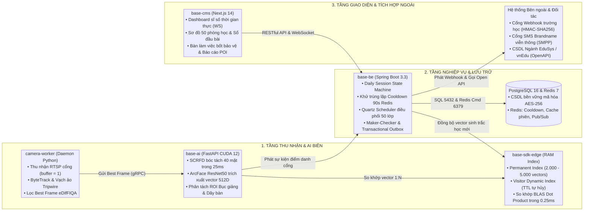
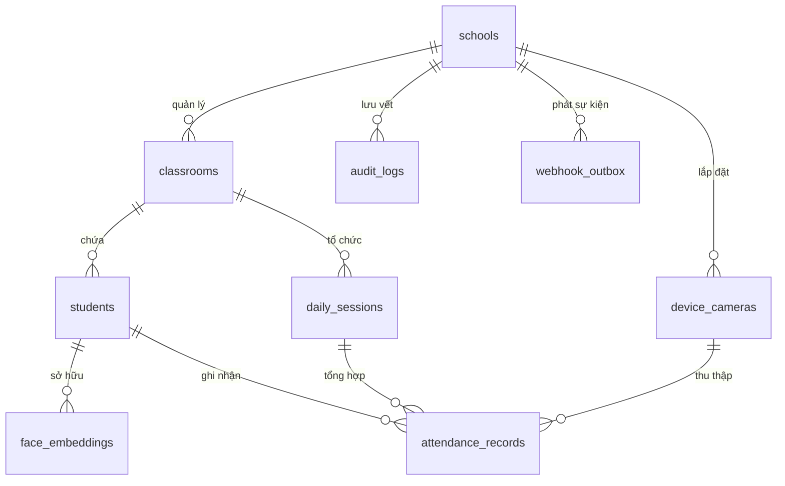
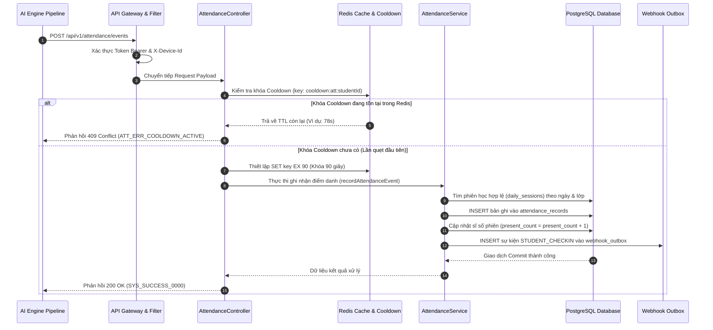
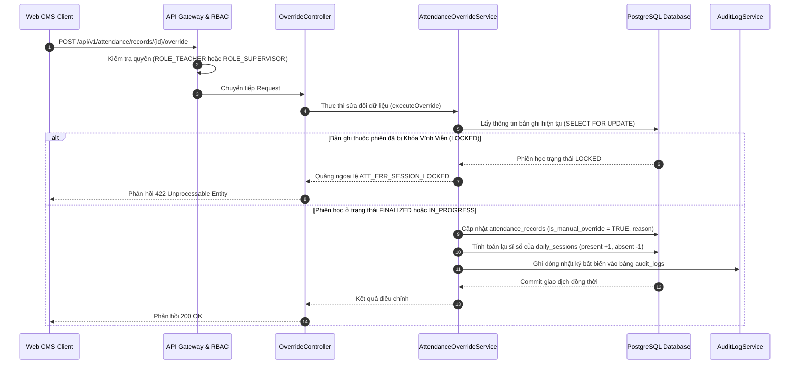
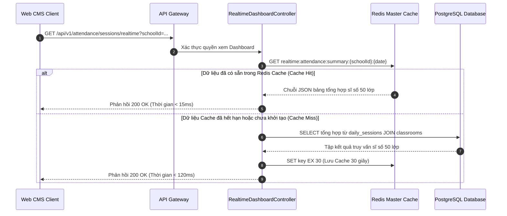
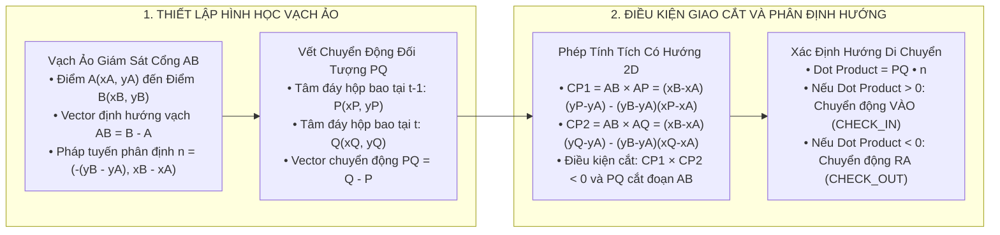
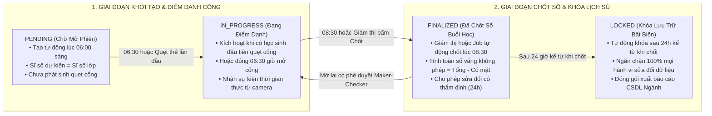
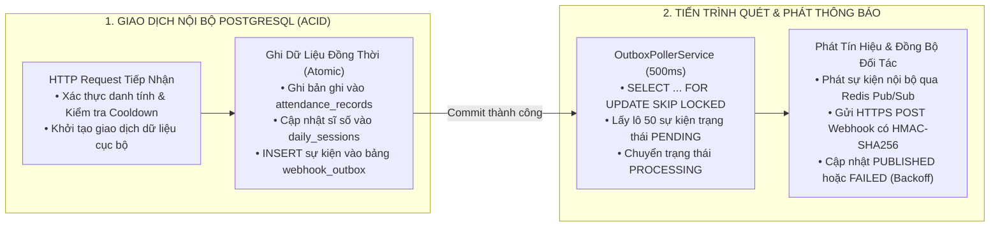

# HỆ THỐNG TRƯỜNG HỌC THÔNG MINH MSCHOOL
# TÀI LIỆU THIẾT KẾ CHI TIẾT CẤP THẤP (LOW-LEVEL DESIGN - LLD)

---

## BẢNG THÔNG TIN QUẢN TRỊ TÀI LIỆU

### 1. Bảng Ghi Nhận Thay Đổi Tài Liệu (Change Log)

| Ngày thay đổi | Vị trí thay đổi | A*, M, D | Nguồn gốc | Phiên bản cũ | Mô tả thay đổi | Phiên bản mới |
| :---: | :--- | :---: | :--- | :---: | :--- | :---: |
| 22/09/2026 | Toàn bộ tài liệu | A* | Khởi tạo dự án | N/A | Thiết lập tài liệu LLD 11 sections hoàn chỉnh cho toàn bộ hệ thống mschool | V1.0 |

*Ghi chú ký hiệu thao tác:* `A*` – Tạo mới (Add), `M` – Sửa đổi (Modify), `D` – Xóa bỏ (Delete).

---

### 2. Trang Ký Duyệt (Sign-off Matrix)

| Vai trò | Họ và tên | Chức danh / Đơn vị | Chữ ký / Xác nhận | Ngày ký |
| :--- | :--- | :--- | :---: | :---: |
| **Người lập** | Đội ngũ Kiến trúc Kỹ thuật | Kỹ sư Trưởng Thiết kế Phần mềm | Đã xác nhận | 22/09/2026 |
| **Người xem xét** | Kiến trúc sư Hệ thống | Kiến trúc sư Giải pháp AI & Dữ liệu | Đã xác nhận | 22/09/2026 |
| **Người phê duyệt** | Giám đốc Dự án mschool | Ban Giám đốc Khối Công nghệ | Đã phê duyệt | 22/09/2026 |

---

## SECTION 0: THƯ VIỆN DÙNG CHUNG VÀ PHỤ THUỘC KỸ THUẬT (SHARED DEPENDENCIES)

### 0.1. Phụ Thuộc Tầng Giao Diện Người Dùng (Frontend Next.js 14)

Hệ thống giao diện Web CMS được phát triển trên nền tảng Next.js 14 (App Router) kết hợp Tailwind CSS và TypeScript 5.x:

| Tên thư viện / Module | Phiên bản | Tệp mã nguồn liên quan | Mục đích sử dụng cụ thể trong hệ thống |
| :--- | :---: | :--- | :--- |
| `next` | 14.2.x | `src/cms/package.json` | Khung ứng dụng Web chính, kết xuất Server Components và Client Components. |
| `react` / `react-dom` | 18.3.x | `src/cms/src/app/` | Thư viện kết xuất giao diện Reactive UI. |
| `tailwindcss` | 3.4.x | `tailwind.config.ts` | Hệ thống tiện ích tạo kiểu dáng giao diện hiện đại, nhất quán. |
| `@tanstack/react-table`| 8.16.x | `src/cms/src/components/ui/data-table.tsx` | Bảng dữ liệu phân trang, lọc đa cột và sắp xếp dữ liệu chuyên cần. |
| `zod` | 3.23.x | `src/cms/src/lib/validations/` | Định nghĩa lược đồ và kiểm chuẩn dữ liệu biểu mẫu phía Client. |
| `socket.io-client` | 4.7.x | `src/cms/src/hooks/useAttendanceWebSocket.ts` | Lắng nghe luồng sự kiện điểm danh thời gian thực đẩy từ backend. |
| `lucide-react` | 0.378.x | `src/cms/src/components/` | Bộ biểu tượng đồ họa kỹ thuật chuẩn phẳng. |

#### Danh mục Khóa Đa Ngôn Ngữ Bổ Sung trong `src/cms/messages/vi.json`:
* `attendance.status.present`: "Có mặt đúng giờ"
* `attendance.status.tardy`: "Đi học muộn"
* `attendance.status.absent`: "Vắng mặt chưa rõ lý do"
* `attendance.status.excused`: "Nghỉ học có phép"
* `attendance.toast.overrideSuccess`: "Điều chỉnh trạng thái điểm danh học sinh thành công"
* `visitor.toast.registered`: "Đăng ký khách thăm trường thành công. Mã đón con: {code}"
* `security.alert.stranger`: "Cảnh báo an ninh: Phát hiện đối tượng chưa đăng ký tại cổng"

---

### 0.2. Phụ Thuộc Tầng Nghiệp Vụ Máy Chủ (Backend Java Spring Boot)

Hệ thống Backend được phát triển trên nền tảng Java 21 LTS và Spring Boot 3.3.x:

| Tên thư viện / Starter | Phiên bản | Tệp cấu hình `pom.xml` | Mục đích sử dụng cụ thể |
| :--- | :---: | :--- | :--- |
| `spring-boot-starter-web` | 3.3.3 | `src/backend/pom.xml` | Xây dựng các RESTful API endpoints và điều phối luồng HTTP. |
| `spring-boot-starter-data-jpa` | 3.3.3 | `src/backend/pom.xml` | Tương tác CSDL PostgreSQL qua Hibernate ORM và JPA Repository. |
| `spring-boot-starter-security` | 3.3.3 | `src/backend/pom.xml` | Bộ lọc bảo mật, xác thực Token JWT và kiểm soát quyền vai trò RBAC. |
| `spring-boot-starter-data-redis`| 3.3.3 | `src/backend/pom.xml` | Kết nối cụm Redis Cluster, quản lý khóa phân tán và Cooldown. |
| `poi-ooxml` (Apache POI) | 5.2.5 | `src/backend/pom.xml` | Động cơ kết xuất Excel dung lượng lớn bằng `SXSSFWorkbook`. |
| `quartz` | 2.3.2 | `src/backend/pom.xml` | Bộ lập lịch tác vụ chụp ảnh 50 phòng học phút thứ 5 đầu mỗi tiết học. |
| `jjwt-api` | 0.12.5 | `src/backend/pom.xml` | Tạo lập, ký số và thẩm tra Token JWT với thuật toán RSA/HMAC. |

#### Danh mục Bảng Mã Lỗi Nghiệp Vụ Chuẩn (`ErrorCodes.java`):

| Mã lỗi HTTP | Mã lỗi ứng dụng (ErrorCode) | Thông điệp tiếng Việt | Nguyên nhân phát sinh | Hướng xử lý Client |
| :---: | :--- | :--- | :--- | :--- |
| 400 | `ERR_VALIDATION_FAILED` | Dữ liệu gửi lên không đúng định dạng quy định | Bỏ trống trường có dấu `*` hoặc sai kiểu dữ liệu | Đánh dấu viền đỏ trường lỗi |
| 400 | `ERR_REASON_TOO_SHORT` | Lý do giải trình bắt buộc tối thiểu 10 ký tự | Giáo viên nhập lý do điều chỉnh quá ngắn | Focus ô nhập và hiển thị lỗi inline |
| 401 | `ERR_TOKEN_EXPIRED` | Phiên làm việc đã hết hạn | Token JWT quá thời hạn sống 60 phút | Gọi API Refresh Token hoặc về login |
| 403 | `ERR_ACCESS_DENIED` | Không có quyền thực hiện chức năng này | Tài khoản không có vai trò phù hợp trong RBAC | Hiển thị thông báo cấm truy cập |
| 404 | `ERR_STUDENT_NOT_FOUND` | Không tìm thấy học sinh với mã định danh này | Mã học sinh không tồn tại hoặc đã xóa mềm | Kiểm tra lại mã định danh |
| 409 | `ERR_OPTIMISTIC_LOCK_CONFLICT` | Dữ liệu đã bị cập nhật bởi người dùng khác | Xung đột phiên bản `version` đồng thời | Tải lại trang và làm mới dữ liệu |
| 409 | `ERR_DUPLICATE_ENTITY` | Dữ liệu đã tồn tại trong hệ thống | Trùng mã định danh hoặc tên lớp trong năm học | Nhập giá trị khác không trùng lặp |
| 429 | `ERR_COOLDOWN_ACTIVE` | Lượt quét nằm trong cửa sổ Cooldown 90 giây | Học sinh vừa quét qua cổng trước đó ít phút | Bỏ qua sự kiện không xử lý lặp |
| 503 | `ERR_AI_SERVICE_UNAVAILABLE`| Cụm suy luận AI biên tạm thời không phản hồi | Máy chủ AI GPU quá tải hoặc ngắt kết nối | Tự động kích hoạt Circuit Breaker |

---

### 0.3. Phụ Thuộc Tầng Thị Giác Máy Tính AI (Python 3.11 & CUDA 12)

| Tên thư viện / Framework | Phiên bản | Môi trường triển khai | Mục đích sử dụng cụ thể |
| :--- | :---: | :--- | :--- |
| `torch` / `torchvision` | 2.3.x+cu121 | Docker GPU NVIDIA RTX 3060 | Môi trường tính toán tensor tăng tốc phần cứng GPU CUDA. |
| `onnxruntime-gpu` | 1.18.x | Docker GPU NVIDIA RTX 3060 | Thực thi suy luận mô hình SCRFD và ArcFace tối ưu hóa TensorRT. |
| `opencv-python-headless`| 4.9.x | Tiến trình Daemon Host | Thu nhận luồng RTSP camera, phân tích khung hình không giao diện. |
| `numpy` / `scipy` | 1.26.x | In-Memory Library nhúng | Phép tính ma trận tích vô hướng Cosine Similarity siêu tốc qua OpenBLAS. |

---

## SECTION 1: TỔNG QUAN VÀ PHẠM VI NGHIỆP VỤ (OVERVIEW & SCOPE)

### 1.1. Mục Tiêu Phân Hệ và Bài Toán Nghiệp Vụ

Tài liệu LLD này đặc tả chi tiết kiến trúc kỹ thuật nội bộ, giao thức trao đổi dữ liệu, cấu trúc cơ sở dữ liệu và thuật toán thực thi của hệ thống trường học thông minh mschool nhằm giải quyết 3 bài toán cốt lõi:
1. **Thu nhận và nhận diện không dừng tại cổng trường:** Xử lý luồng video RTSP thời gian thực, bám vết đối tượng, cắt ảnh đẹp nhất và đối soát 1:N trong bộ nhớ RAM đạt độ trễ P95 < 300ms cho 2.000 đến 3.000 học sinh.
2. **Điểm danh tự động 50 phòng học toàn trường:** Điều phối camera góc rộng chụp ảnh tự động vào phút thứ 5 đầu mỗi tiết học, bóc tách trên 40 khuôn mặt, phân tách vùng Bục giảng (Teacher ROI) và Dãy bàn (Student ROI), cập nhật Sổ đầu bài điện tử.
3. **Cổng kết nối mở đa nền tảng:** Phát sự kiện Webhook thời gian thực có ký số HMAC-SHA256 đến hệ thống quản lý trường học sẵn có và đồng bộ dữ liệu hai chiều với CSDL ngành giáo dục qua OpenAPI 3.0.

---

### 1.2. Bảng Ánh Xạ Danh Mục Màn Hình và 21 Use Cases Kỹ Thuật

| Mã màn hình | Tên màn hình Web CMS | Mã Use Case | Vai trò người dùng | Nền tảng hoạt động | Module mã nguồn chịu trách nhiệm |
| :---: | :--- | :---: | :--- | :---: | :--- |
| `SCR-01` | Màn hình Giám sát Cổng tự động | `UC-01` | Bảo vệ, Ban Giám hiệu | Web Desktop / Kiosk | `camera-worker`, `base-ai`, `base-be` |
| `SCR-02` | Sơ đồ Ma trận 50 Phòng học | `UC-02`, `UC-18` | Giám thị, Ban Giám hiệu | Web Desktop | `src/cms/src/app/classroom-matrix/` |
| `SCR-03` | Tiếp đón Khách & Đăng ký TTL | `UC-03` | Nhân viên Bảo vệ | Web Kiosk bốt bảo vệ | `src/cms/src/app/guard-desk/` |
| `SCR-04` | Sổ Điểm danh Lớp học & Maker-Checker | `UC-04` | Giáo viên Chủ nhiệm | Web Desktop | `src/cms/src/app/attendance-ledger/` |
| `SCR-05` | Đăng nhập Hệ thống & SSO | `UC-05` | Toàn bộ người dùng | Web Desktop / Mobile Web | `src/cms/src/app/login/` |
| `SCR-06` | Quản lý Tài khoản Người dùng | `UC-06` | Quản trị viên hệ thống | Web Desktop | `src/cms/src/app/admin/users/` |
| `SCR-07` | Ma trận Phân quyền Vai trò (RBAC) | `UC-07` | Quản trị viên hệ thống | Web Desktop | `src/cms/src/app/admin/roles/` |
| `SCR-08` | Cổng Tra cứu Phụ huynh & Mã QR Đón con | `UC-08` | Phụ huynh học sinh | Mobile Web Responsive | `src/cms/src/app/parent-portal/` |
| `SCR-09` | Danh mục Camera IP & Vạch ảo Tripwire | `UC-09` | Quản trị viên kỹ thuật | Web Desktop | `src/cms/src/app/devices/cameras/` |
| `SCR-10` | Bàn làm việc Bốt Bảo vệ (Guard Desk) | `UC-10` | Nhân viên Bảo vệ | Web Kiosk cảm ứng | `src/cms/src/app/guard-desk/` |
| `SCR-11` | Nhật ký Kiểm toán (Audit Log) | `UC-11` | Ban Giám hiệu, Quản trị | Web Desktop | `src/cms/src/app/admin/audit-logs/` |
| `SCR-12` | Giám sát Hiệu năng Hệ thống (APM) | `UC-12` | Quản trị viên kỹ thuật | Web Desktop (Grafana nhúng) | `src/cms/src/app/admin/monitoring/` |
| `SCR-13` | Danh mục Năm học, Khối & Lớp học | `UC-13` | Quản trị đào tạo | Web Desktop | `src/cms/src/app/master-data/classes/` |
| `SCR-14` | Quản lý Hồ sơ Sinh trắc học eDifFIQA | `UC-14` | Giáo viên, Quản trị viên | Web Desktop | `src/cms/src/app/biometrics/` |
| `SCR-15` | Thời khóa biểu Giảng dạy | `UC-15` | Quản trị đào tạo | Web Desktop | `src/cms/src/app/master-data/timetable/` |
| `SCR-16` | Cấu hình Tham số Vận hành Đa tầng | `UC-16` | Quản trị viên hệ thống | Web Desktop | `src/cms/src/app/admin/configs/` |
| `SCR-17` | Bảng điều khiển Sĩ số (Live Dashboard) | `UC-17` | Ban Giám hiệu | Web Desktop lớn | `src/cms/src/app/dashboard/` |
| `SCR-18` | Sổ đầu bài Điện tử Tiết dạy | `UC-19` | Giáo viên Bộ môn | Web Desktop / Tablet | `src/cms/src/app/lesson-register/` |
| `SCR-19` | Trung tâm Báo cáo Thống kê & Xuất Excel | `UC-20` | BGH, Giáo viên, Kế toán | Web Desktop | `src/cms/src/app/reports/` |
| `SCR-20` | Cổng Tích hợp Đối tác Webhook & API | `UC-21` | Quản trị viên hệ thống | Web Desktop | `src/cms/src/app/integrations/webhooks/` |

---

### 1.3. Phạm Vi Triển Khai (In-Scope và Out-of-Scope)

* **Trong phạm vi thực hiện (In-Scope):**
  * Toàn bộ mã nguồn tiến trình `camera-worker` thu nhận RTSP và bám vết ByteTrack.
  * Động cơ suy luận AI GPU `base-ai` (SCRFD ONNX, ArcFace ResNet50, eDifFIQA, MiniFASNet).
  * Thư viện đối soát trong bộ nhớ RAM `base-sdk-edge` (Permanent Index & Visitor Dynamic Index).
  * Hệ thống Backend Spring Boot 3.3 điều phối nghiệp vụ, Daily Session State Machine, Transactional Outbox.
  * Cổng Web Quản trị Web CMS Next.js 14 bao gồm cả phân hệ Sổ đầu bài và Cổng tra cứu Web cho Phụ huynh.
  * Động cơ phát Webhook thời gian thực ký số HMAC-SHA256 và bộ Open REST API chuẩn OpenAPI 3.0.
  * Lược đồ CSDL PostgreSQL 16 pgvector và cấu hình Redis Cluster.
* **Ngoài phạm vi thực hiện (Out-of-Scope):**
  * Thi công kéo dây mạng LAN, cáp nguồn PoE và lắp đặt vật lý chân đế camera tại trường học.
  * Chi phí cước viễn thông tin nhắn SMS Brandname phát sinh qua các nhà mạng.
  * Việc duy trì và phát triển ứng dụng di động riêng biệt trên App Store / Google Play (đã được thay thế hoàn toàn bằng Web CMS và Webhook/API tích hợp).

---

## SECTION 2: QUAN HỆ PHỤ THUỘC VÀ ĐIỂM TÍCH HỢP (DEPENDENCIES & INTEGRATIONS)

### 2.1. Phụ Thuộc Nội Bộ Giữa Các Phân Hệ (Upstream / Downstream)



---

### 2.2. Điểm Tích Hợp Với Các Dịch Vụ Bên Ngoài

| Dịch vụ bên ngoài | Giao thức kết nối | Cơ chế xác thực & Bảo mật | Thời gian chờ tối đa | Kịch bản xử lý mất kết nối |
| :--- | :--- | :--- | :---: | :--- |
| **Cổng Webhook Đối tác Trường học** | HTTPS POST Webhook | Ký số mã băm HMAC-SHA256 (Header `X-Hub-Signature-256`) | 3.0 giây | Thử lại lũy tiến Exponential Backoff (1s, 2s, 4s... tối đa 60s); ngắt mạch Circuit Breaker khi lỗi liên tiếp quá 5 lần. |
| **Cổng Tin nhắn SMS Brandname** | SMPP v3.4 / HTTPS RESTful | API Key & Secret Token, mã hóa kênh truyền TLS 1.3 | 2.5 giây | Lưu vào hàng đợi Outbox, thử lại sau 30 giây; khống chế hạn mức tối đa 2 tin/ngày/học sinh tránh bội chi. |
| **Hệ thống Xác thực Tập trung SSO** | OAuth 2.0 / OpenID Connect | Authorization Code PKCE, Token JWT RSA 2048-bit | 5.0 giây | Cho phép nhân viên bảo vệ đăng nhập qua kênh mật khẩu nội bộ dự phòng lưu trong bảng `users`. |
| **CSDL Ngành Giáo Dục (EduSys / vnEdu)**| HTTPS RESTful OpenAPI | Bearer Token, chữ ký chứng thư số | 10.0 giây | Chạy đồng bộ định kỳ theo lô (Batch Job) vào 01:00 sáng hàng ngày; ghi nhận log đối soát chi tiết. |

---

## SECTION 3: THIẾT KẾ CƠ SỞ DỮ LIỆU CHI TIẾT (DATABASE DESIGN)

### 3.1. Sơ Đồ Thực Thể Quan Hệ Mức Cao

Sơ đồ thể hiện liên kết giữa các bảng cốt lõi trong hệ thống cơ sở dữ liệu quan hệ PostgreSQL 16:



---

### 3.2. Bảng Đặc Tả Chi Tiết Các Trường Dữ Liệu (Chuẩn DBDD Viettel)

Hệ thống cơ sở dữ liệu được chuẩn hóa ở mức 3NF, phân tách rõ ràng giữa dữ liệu danh mục, dữ liệu giao dịch sự kiện và nhật ký kiểm toán. Dưới đây là đặc tả 8 bảng dữ liệu quan trọng nhất:

#### 3.2.1. Bảng `students` (Hồ Sơ Học Sinh)

* Khóa chính: `id` (UUIDv7)
* Mục đích: Lưu trữ thông tin định danh học sinh, liên kết lớp học và trạng thái học tập.

| STT | Tên Cột | Kiểu Dữ Liệu | Khóa | Cho Phép Rỗng | Giá Trị Mặc Định | Ràng Buộc | Ý Nghĩa Nghiệp Vụ |
| :---: | :--- | :--- | :---: | :---: | :--- | :--- | :--- |
| 1 | `id` | UUID | PK | KHÔNG | `gen_random_uuid()` | Khóa chính chuẩn UUIDv7 | Định danh duy nhất của học sinh |
| 2 | `school_id` | UUID | FK | KHÔNG | | Tham chiếu `schools(id)` | Trường học trực thuộc |
| 3 | `classroom_id` | UUID | FK | KHÔNG | | Tham chiếu `classrooms(id)` | Lớp học hiện tại đang sinh hoạt |
| 4 | `student_code` | VARCHAR(32) | | KHÔNG | | UNIQUE trong cùng school_id | Mã số học sinh trên thẻ |
| 5 | `first_name` | VARCHAR(64) | | KHÔNG | | Tối thiểu 1 ký tự | Tên gọi của học sinh |
| 6 | `last_name` | VARCHAR(64) | | KHÔNG | | Tối thiểu 1 ký tự | Họ và tên đệm |
| 7 | `gender` | VARCHAR(16) | | KHÔNG | | IN ('MALE','FEMALE','OTHER')| Giới tính sinh học |
| 8 | `date_of_birth`| DATE | | KHÔNG | | <= CURRENT_DATE | Ngày tháng năm sinh |
| 9 | `parent_phone_encrypted` | VARCHAR(256) | | KHÔNG | | Mã hóa AES-256-GCM | Số điện thoại phụ huynh nhận tin |
| 10 | `status` | VARCHAR(32) | | KHÔNG | 'STUDYING' | IN ('STUDYING','SUSPENDED','GRADUATED') | Trạng thái học tập |
| 11 | `created_at` | TIMESTAMPTZ | | KHÔNG | CURRENT_TIMESTAMP | | Thời điểm tạo hồ sơ |
| 12 | `updated_at` | TIMESTAMPTZ | | KHÔNG | CURRENT_TIMESTAMP | | Thời điểm cập nhật cuối |

---

#### 3.2.2. Bảng `face_embeddings` (Đặc Trưng Sinh Trắc Học Khuôn Mặt)

* Khóa chính: `id` (UUID)
* Mục đích: Lưu trữ vector đặc trưng khuôn mặt 512 chiều được chuẩn hóa L2, phục vụ nạp vào RAM bộ nhớ đệm cho AI Engine.

| STT | Tên Cột | Kiểu Dữ Liệu | Khóa | Cho Phép Rỗng | Giá Trị Mặc Định | Ràng Buộc | Ý Nghĩa Nghiệp Vụ |
| :---: | :--- | :--- | :---: | :---: | :--- | :--- | :--- |
| 1 | `id` | UUID | PK | KHÔNG | `gen_random_uuid()` | Khóa chính | Định danh duy nhất bản ghi vector |
| 2 | `student_id` | UUID | FK | KHÔNG | | Tham chiếu `students(id)` | Học sinh sở hữu vector mẫu |
| 3 | `embedding_vector` | FLOAT8[] | | KHÔNG | | Mảng đúng 512 phần tử, chuẩn L2 | Vector số thực 512 chiều trích xuất bởi InsightFace |
| 4 | `model_version` | VARCHAR(32) | | KHÔNG | 'BUFFALO_L_V1' | Phiên bản trích xuất | Tên và phiên bản mô hình trích xuất vector |
| 5 | `sample_image_uri` | VARCHAR(512) | | KHÔNG | | URI MinIO S3 an toàn | Đường dẫn ảnh mẫu đăng ký sinh trắc học |
| 6 | `quality_score` | FLOAT4 | | KHÔNG | | >= 0.70 và <= 1.00 | Điểm chất lượng ảnh khi đăng ký mẫu |
| 7 | `is_active` | BOOLEAN | | KHÔNG | TRUE | | Trạng thái hiệu lực của mẫu vector |
| 8 | `created_at` | TIMESTAMPTZ | | KHÔNG | CURRENT_TIMESTAMP | | Thời điểm đăng ký mẫu khuôn mặt |
| 9 | `updated_at` | TIMESTAMPTZ | | KHÔNG | CURRENT_TIMESTAMP | | Thời điểm cập nhật mẫu |

---

#### 3.2.3. Bảng `attendance_records` (Giao Dịch Sự Kiện Điểm Danh)

* Khóa chính: `id` (UUID)
* Mục đích: Lưu trữ toàn bộ các sự kiện điểm danh qua camera hoặc điểm danh thủ công, ghi nhận tọa độ ảnh và độ tin cậy.

| STT | Tên Cột | Kiểu Dữ Liệu | Khóa | Cho Phép Rỗng | Giá Trị Mặc Định | Ràng Buộc | Ý Nghĩa Nghiệp Vụ |
| :---: | :--- | :--- | :---: | :---: | :--- | :--- | :--- |
| 1 | `id` | UUID | PK | KHÔNG | `gen_random_uuid()` | Khóa chính | Định danh sự kiện điểm danh |
| 2 | `student_id` | UUID | FK | KHÔNG | | Tham chiếu `students(id)` | Học sinh được nhận diện |
| 3 | `daily_session_id` | UUID | FK | KHÔNG | | Tham chiếu `daily_sessions(id)` | Phiên điểm danh trong ngày của lớp |
| 4 | `camera_id` | UUID | FK | CÓ | NULL | Tham chiếu `device_cameras(id)` | Camera ghi nhận (NULL nếu điểm danh tay) |
| 5 | `attendance_type` | VARCHAR(32) | | KHÔNG | | IN ('CHECK_IN','CHECK_OUT') | Phân loại vào trường hay ra trường |
| 6 | `timestamp` | TIMESTAMPTZ | | KHÔNG | CURRENT_TIMESTAMP | | Thời khắc chính xác máy quét nhận diện |
| 7 | `confidence_score` | FLOAT4 | | CÓ | NULL | >= 0.00 và <= 1.00 | Độ tương đồng Cosine Similarity |
| 8 | `snapshot_image_uri`| VARCHAR(512) | | CÓ | NULL | URI MinIO an toàn | Ảnh chụp bằng chứng từ khung hình camera |
| 9 | `bounding_box` | JSONB | | CÓ | NULL | Cấu trúc {x, y, w, h} | Tọa độ khuôn mặt trong khung hình |
| 10 | `is_manual_override`| BOOLEAN | | KHÔNG | FALSE | | Cờ đánh dấu đã qua sửa đổi thủ công |
| 11 | `override_by_user_id`| UUID | FK | CÓ | NULL | Tham chiếu `users(id)` | Giám thị hoặc giáo viên thực hiện sửa |
| 12 | `override_reason` | VARCHAR(256) | | CÓ | NULL | Bắt buộc khi override=TRUE | Lý do điều chỉnh dữ liệu |
| 13 | `created_at` | TIMESTAMPTZ | | KHÔNG | CURRENT_TIMESTAMP | | Thời gian ghi nhận vào CSDL |

---

#### 3.2.4. Bảng `daily_sessions` (Phiên Điểm Danh Lớp Học Theo Ngày)

* Khóa chính: `id` (UUID)
* Mục đích: Quản lý trạng thái tổng hợp điểm danh theo ngày cho từng lớp học (Mở, Đang điểm danh, Đã chốt, Khóa chỉnh sửa).

| STT | Tên Cột | Kiểu Dữ Liệu | Khóa | Cho Phép Rỗng | Giá Trị Mặc Định | Ràng Buộc | Ý Nghĩa Nghiệp Vụ |
| :---: | :--- | :--- | :---: | :---: | :--- | :--- | :--- |
| 1 | `id` | UUID | PK | KHÔNG | `gen_random_uuid()` | Khóa chính | Định danh phiên điểm danh lớp |
| 2 | `classroom_id` | UUID | FK | KHÔNG | | Tham chiếu `classrooms(id)` | Lớp học được mở phiên |
| 3 | `session_date` | DATE | | KHÔNG | | | Ngày diễn ra phiên điểm danh |
| 4 | `session_type` | VARCHAR(16) | | KHÔNG | 'MORNING' | IN ('MORNING','AFTERNOON') | Buổi học sáng hoặc chiều |
| 5 | `status` | VARCHAR(32) | | KHÔNG | 'PENDING' | Trạng thái State Machine | PENDING, IN_PROGRESS, FINALIZED, LOCKED |
| 6 | `total_students` | INT4 | | KHÔNG | 0 | >= 0 | Tổng sĩ số danh sách lớp |
| 7 | `present_count` | INT4 | | KHÔNG | 0 | >= 0 và <= total_students | Số học sinh có mặt đúng giờ |
| 8 | `tardy_count` | INT4 | | KHÔNG | 0 | >= 0 và <= total_students | Số học sinh đi muộn |
| 9 | `absent_excused_count`| INT4 | | KHÔNG | 0 | >= 0 | Số học sinh vắng có phép |
| 10 | `absent_unexcused_count`| INT4 | | KHÔNG | 0 | >= 0 | Số học sinh vắng không phép |
| 11 | `finalized_at` | TIMESTAMPTZ | | CÓ | NULL | | Thời điểm giám thị chốt sổ buổi học |

---

#### 3.2.5. Bảng `device_cameras` (Thiết Bị Camera Nhận Diện Điểm Danh)

* Khóa chính: `id` (UUID)
* Mục đích: Quản lý thông tin kết nối, cấu hình vạch ảo và thông số mạng của camera IP tại các luồng cổng.

| STT | Tên Cột | Kiểu Dữ Liệu | Khóa | Cho Phép Rỗng | Giá Trị Mặc Định | Ràng Buộc | Ý Nghĩa Nghiệp Vụ |
| :---: | :--- | :--- | :---: | :---: | :--- | :--- | :--- |
| 1 | `id` | UUID | PK | KHÔNG | `gen_random_uuid()` | Khóa chính | Định danh thiết bị camera |
| 2 | `school_id` | UUID | FK | KHÔNG | | Tham chiếu `schools(id)` | Trường học lắp đặt thiết bị |
| 3 | `camera_name` | VARCHAR(128) | | KHÔNG | | | Tên hiển thị (Ví dụ: Cổng Chính - Luồng 1) |
| 4 | `ip_address` | INET | | KHÔNG | | Định dạng địa chỉ IPv4 hợp lệ | Địa chỉ IP tĩnh trong mạng nội bộ LAN |
| 5 | `rtsp_url` | VARCHAR(512) | | KHÔNG | | Bắt đầu bằng rtsp:// | Đường dẫn luồng video H.264/H.265 |
| 6 | `location_type` | VARCHAR(32) | | KHÔNG | 'GATE_IN' | IN ('GATE_IN','GATE_OUT','CLASSROOM') | Vị trí luồng ra vào hoặc trong phòng học |
| 7 | `tripwire_config` | JSONB | | KHÔNG | | Tọa độ vạch ảo [{x1,y1},{x2,y2}] | Tọa độ vạch ảo xác định hướng đi |
| 8 | `status` | VARCHAR(32) | | KHÔNG | 'ONLINE' | IN ('ONLINE','OFFLINE','ERROR') | Trạng thái kết nối của luồng RTSP |
| 9 | `frame_rate` | INT4 | | KHÔNG | 25 | >= 15 và <= 60 | Tốc độ khung hình xử lý |
| 10 | `last_heartbeat_at`| TIMESTAMPTZ | | CÓ | NULL | | Thời điểm gửi tín hiệu sống gần nhất |
| 11 | `created_at` | TIMESTAMPTZ | | KHÔNG | CURRENT_TIMESTAMP | | Thời điểm đăng ký camera vào hệ thống |

---

#### 3.2.6. Bảng `classrooms` (Danh Mục Lớp Học)

* Khóa chính: `id` (UUID)
* Mục đích: Quản lý thông tin các khối lớp, niên khóa và giáo viên chủ nhiệm.

| STT | Tên Cột | Kiểu Dữ Liệu | Khóa | Cho Phép Rỗng | Giá Trị Mặc Định | Ràng Buộc | Ý Nghĩa Nghiệp Vụ |
| :---: | :--- | :--- | :---: | :---: | :--- | :--- | :--- |
| 1 | `id` | UUID | PK | KHÔNG | `gen_random_uuid()` | Khóa chính | Định danh duy nhất của lớp học |
| 2 | `school_id` | UUID | FK | KHÔNG | | Tham chiếu `schools(id)` | Trường học quản lý lớp |
| 3 | `academic_year_id`| UUID | FK | KHÔNG | | Tham chiếu `academic_years(id)` | Niên khóa học tập (Ví dụ: 2026-2027) |
| 4 | `homeroom_teacher_id`| UUID | FK | CÓ | NULL | Tham chiếu `users(id)` | Giáo viên chủ nhiệm phụ trách |
| 5 | `class_code` | VARCHAR(32) | | KHÔNG | | UNIQUE trong cùng school_id | Mã lớp quản lý (Ví dụ: 10A1, 12A3) |
| 6 | `class_name` | VARCHAR(64) | | KHÔNG | | | Tên đầy đủ của lớp học |
| 7 | `grade_level` | INT2 | | KHÔNG | | >= 1 và <= 12 | Khối học từ lớp 1 đến lớp 12 |
| 8 | `room_number` | VARCHAR(32) | | CÓ | NULL | | Số hiệu phòng học thực tế |
| 9 | `created_at` | TIMESTAMPTZ | | KHÔNG | CURRENT_TIMESTAMP | | Thời điểm khởi tạo lớp |

---

#### 3.2.7. Bảng `audit_logs` (Nhật Ký Kiểm Toán Hệ Thống)

* Khóa chính: `id` (INT8 Bigserial)
* Mục đích: Ghi nhận vết bất biến phục vụ truy vết an ninh và tuân thủ kiểm toán.

| STT | Tên Cột | Kiểu Dữ Liệu | Khóa | Cho Phép Rỗng | Giá Trị Mặc Định | Ràng Buộc | Ý Nghĩa Nghiệp Vụ |
| :---: | :--- | :--- | :---: | :---: | :--- | :--- | :--- |
| 1 | `id` | BIGSERIAL | PK | KHÔNG | Tự tăng | Khóa chính tịnh tiến | Định danh dòng nhật ký |
| 2 | `school_id` | UUID | FK | KHÔNG | | Tham chiếu `schools(id)` | Trường học phát sinh thao tác |
| 3 | `user_id` | UUID | FK | CÓ | NULL | Tham chiếu `users(id)` | Người dùng thực hiện (NULL nếu hệ thống) |
| 4 | `action_code` | VARCHAR(64) | | KHÔNG | | Chuỗi định danh Enum | Mã hành vi (Ví dụ: OVERRIDE_ATTENDANCE) |
| 5 | `entity_name` | VARCHAR(64) | | KHÔNG | | | Tên bảng hoặc đối tượng tác động |
| 6 | `entity_id` | VARCHAR(64) | | KHÔNG | | | Định danh của đối tượng bị thay đổi |
| 7 | `old_value` | JSONB | | CÓ | NULL | Dạng đối tượng JSON | Giá trị trước khi thực hiện thao tác |
| 8 | `new_value` | JSONB | | CÓ | NULL | Dạng đối tượng JSON | Giá trị sau khi cập nhật thành công |
| 9 | `ip_address` | INET | | KHÔNG | | Địa chỉ IP Client | IP nguồn gửi request |
| 10 | `user_agent` | VARCHAR(256) | | CÓ | NULL | | Trình duyệt hoặc ứng dụng gửi thao tác |
| 11 | `created_at` | TIMESTAMPTZ | | KHÔNG | CURRENT_TIMESTAMP | | Dấu mốc thời gian ghi nhận (bất biến) |

---

#### 3.2.8. Bảng `webhook_outbox` (Bảng Đệm Phát Sự Kiện Phân Tán)

* Khóa chính: `id` (UUID)
* Mục đích: Thực thi Transactional Outbox Pattern, bảo đảm độ tin cậy At-Least-Once cho sự kiện tích hợp bên ngoài.

| STT | Tên Cột | Kiểu Dữ Liệu | Khóa | Cho Phép Rỗng | Giá Trị Mặc Định | Ràng Buộc | Ý Nghĩa Nghiệp Vụ |
| :---: | :--- | :--- | :---: | :---: | :--- | :--- | :--- |
| 1 | `id` | UUID | PK | KHÔNG | `gen_random_uuid()` | Khóa chính | Định danh sự kiện outbox |
| 2 | `aggregate_type` | VARCHAR(64) | | KHÔNG | 'ATTENDANCE' | | Loại thực thể phát sự kiện |
| 3 | `aggregate_id` | VARCHAR(64) | | KHÔNG | | | Khóa định danh thực thể |
| 4 | `event_type` | VARCHAR(64) | | KHÔNG | | STUDENT_CHECKIN, CHECKOUT... | Tên loại sự kiện Webhook |
| 5 | `payload` | JSONB | | KHÔNG | | Cấu trúc JSON tuân thủ chuẩn | Dữ liệu chi tiết của sự kiện |
| 6 | `status` | VARCHAR(32) | | KHÔNG | 'PENDING' | IN ('PENDING','PROCESSING','PUBLISHED','FAILED') | Trạng thái gửi đi |
| 7 | `retry_count` | INT2 | | KHÔNG | 0 | >= 0 | Số lần đã thử lại |
| 8 | `next_retry_at` | TIMESTAMPTZ | | KHÔNG | CURRENT_TIMESTAMP | | Thời điểm cho phép gửi lần tiếp theo |
| 9 | `last_error_message`| TEXT | | CÓ | NULL | | Chi tiết nguyên nhân lỗi khi gửi |
| 10 | `created_at` | TIMESTAMPTZ | | KHÔNG | CURRENT_TIMESTAMP | | Thời gian tạo giao dịch sự kiện |

---

### 3.3. Chiến Lược Chỉ Mục Tối Ưu Truy Vấn (Index Strategy)

Nhằm đáp ứng cam kết hiệu năng thời gian thực cho quy mô 2.000 học sinh đồng thời và tối ưu các tác vụ thống kê báo cáo theo lớp/ngày, các chỉ mục sau được thiết lập:

| Tên Bảng | Tên Chỉ Mục | Cột Tham Gia Chỉ Mục | Phân Loại Index | Mục Đích Tối Ưu Truy Vấn |
| :--- | :--- | :--- | :--- | :--- |
| `students` | `idx_students_school_class` | `(school_id, classroom_id, status)` | B-Tree Đa Cột | Tối ưu lọc danh sách học sinh theo từng lớp học |
| `students` | `idx_students_code_unique` | `(school_id, student_code)` | B-Tree Duy Nhất | Tăng tốc tìm kiếm học sinh qua mã số thẻ học sinh |
| `face_embeddings` | `idx_face_active_student` | `(student_id)` WHERE `is_active = TRUE` | B-Tree Một Phần | Tối ưu nạp bộ vector hợp lệ vào RAM lúc khởi động |
| `attendance_records` | `idx_attendance_session_student` | `(daily_session_id, student_id)` | B-Tree Đa Cột | Tìm kiếm lịch sử quẹt cổng của học sinh trong buổi |
| `attendance_records` | `idx_attendance_timestamp` | `(timestamp DESC)` | B-Tree Đơn Cột | Tối ưu truy vấn dòng nhật ký quẹt mới nhất cho bốt bảo vệ |
| `daily_sessions` | `idx_daily_sessions_lookup` | `(classroom_id, session_date, session_type)` | B-Tree Duy Nhất | Chống mở trùng lặp phiên học và tăng tốc tìm phiên |
| `audit_logs` | `idx_audit_logs_entity` | `(entity_name, entity_id, created_at DESC)` | B-Tree Đa Cột | Truy vết toàn bộ lịch sử can thiệp của một đối tượng |
| `webhook_outbox` | `idx_outbox_pending_poll` | `(status, next_retry_at)` WHERE `status IN ('PENDING','FAILED')` | B-Tree Một Phần | Tối ưu Worker quét tìm các sự kiện chưa gửi đi |

---

### 3.4. Mã Lệnh Khởi Tạo CSDL Đầy Đủ (DDL Script)

```sql
-- Kích hoạt extension hỗ trợ UUID ngẫu nhiên
CREATE EXTENSION IF NOT EXISTS "pgcrypto";

-- 1. Bảng hồ sơ học sinh
CREATE TABLE students (
    id UUID PRIMARY KEY DEFAULT gen_random_uuid(),
    school_id UUID NOT NULL REFERENCES schools(id) ON DELETE CASCADE,
    classroom_id UUID NOT NULL REFERENCES classrooms(id) ON DELETE RESTRICT,
    student_code VARCHAR(32) NOT NULL,
    first_name VARCHAR(64) NOT NULL,
    last_name VARCHAR(64) NOT NULL,
    gender VARCHAR(16) NOT NULL CHECK (gender IN ('MALE', 'FEMALE', 'OTHER')),
    date_of_birth DATE NOT NULL CHECK (date_of_birth <= CURRENT_DATE),
    parent_phone_encrypted VARCHAR(256) NOT NULL,
    status VARCHAR(32) NOT NULL DEFAULT 'STUDYING' CHECK (status IN ('STUDYING', 'SUSPENDED', 'GRADUATED')),
    created_at TIMESTAMPTZ NOT NULL DEFAULT CURRENT_TIMESTAMP,
    updated_at TIMESTAMPTZ NOT NULL DEFAULT CURRENT_TIMESTAMP,
    CONSTRAINT uq_students_school_code UNIQUE (school_id, student_code)
);

CREATE INDEX idx_students_school_class ON students (school_id, classroom_id, status);

-- 2. Bảng đặc trưng sinh trắc học khuôn mặt 512 chiều
CREATE TABLE face_embeddings (
    id UUID PRIMARY KEY DEFAULT gen_random_uuid(),
    student_id UUID NOT NULL REFERENCES students(id) ON DELETE CASCADE,
    embedding_vector FLOAT8[] NOT NULL,
    model_version VARCHAR(32) NOT NULL DEFAULT 'BUFFALO_L_V1',
    sample_image_uri VARCHAR(512) NOT NULL,
    quality_score FLOAT4 NOT NULL CHECK (quality_score >= 0.70 AND quality_score <= 1.00),
    is_active BOOLEAN NOT NULL DEFAULT TRUE,
    created_at TIMESTAMPTZ NOT NULL DEFAULT CURRENT_TIMESTAMP,
    updated_at TIMESTAMPTZ NOT NULL DEFAULT CURRENT_TIMESTAMP
);

CREATE INDEX idx_face_active_student ON face_embeddings (student_id) WHERE is_active = TRUE;

-- 3. Bảng phiên điểm danh lớp học theo ngày
CREATE TABLE daily_sessions (
    id UUID PRIMARY KEY DEFAULT gen_random_uuid(),
    classroom_id UUID NOT NULL REFERENCES classrooms(id) ON DELETE CASCADE,
    session_date DATE NOT NULL,
    session_type VARCHAR(16) NOT NULL DEFAULT 'MORNING' CHECK (session_type IN ('MORNING', 'AFTERNOON')),
    status VARCHAR(32) NOT NULL DEFAULT 'PENDING' CHECK (status IN ('PENDING', 'IN_PROGRESS', 'FINALIZED', 'LOCKED')),
    total_students INT4 NOT NULL DEFAULT 0 CHECK (total_students >= 0),
    present_count INT4 NOT NULL DEFAULT 0 CHECK (present_count >= 0 AND present_count <= total_students),
    tardy_count INT4 NOT NULL DEFAULT 0 CHECK (tardy_count >= 0 AND tardy_count <= total_students),
    absent_excused_count INT4 NOT NULL DEFAULT 0 CHECK (absent_excused_count >= 0),
    absent_unexcused_count INT4 NOT NULL DEFAULT 0 CHECK (absent_unexcused_count >= 0),
    finalized_at TIMESTAMPTZ,
    CONSTRAINT uq_daily_sessions_lookup UNIQUE (classroom_id, session_date, session_type)
);

-- 4. Bảng thiết bị camera
CREATE TABLE device_cameras (
    id UUID PRIMARY KEY DEFAULT gen_random_uuid(),
    school_id UUID NOT NULL REFERENCES schools(id) ON DELETE CASCADE,
    camera_name VARCHAR(128) NOT NULL,
    ip_address INET NOT NULL,
    rtsp_url VARCHAR(512) NOT NULL,
    location_type VARCHAR(32) NOT NULL DEFAULT 'GATE_IN' CHECK (location_type IN ('GATE_IN', 'GATE_OUT', 'CLASSROOM')),
    tripwire_config JSONB NOT NULL,
    status VARCHAR(32) NOT NULL DEFAULT 'ONLINE' CHECK (status IN ('ONLINE', 'OFFLINE', 'ERROR')),
    frame_rate INT4 NOT NULL DEFAULT 25 CHECK (frame_rate >= 15 AND frame_rate <= 60),
    last_heartbeat_at TIMESTAMPTZ,
    created_at TIMESTAMPTZ NOT NULL DEFAULT CURRENT_TIMESTAMP
);

-- 5. Bảng giao dịch sự kiện điểm danh
CREATE TABLE attendance_records (
    id UUID PRIMARY KEY DEFAULT gen_random_uuid(),
    student_id UUID NOT NULL REFERENCES students(id) ON DELETE CASCADE,
    daily_session_id UUID NOT NULL REFERENCES daily_sessions(id) ON DELETE CASCADE,
    camera_id UUID REFERENCES device_cameras(id) ON DELETE SET NULL,
    attendance_type VARCHAR(32) NOT NULL CHECK (attendance_type IN ('CHECK_IN', 'CHECK_OUT')),
    timestamp TIMESTAMPTZ NOT NULL DEFAULT CURRENT_TIMESTAMP,
    confidence_score FLOAT4 CHECK (confidence_score >= 0.00 AND confidence_score <= 1.00),
    snapshot_image_uri VARCHAR(512),
    bounding_box JSONB,
    is_manual_override BOOLEAN NOT NULL DEFAULT FALSE,
    override_by_user_id UUID REFERENCES users(id) ON DELETE SET NULL,
    override_reason VARCHAR(256),
    created_at TIMESTAMPTZ NOT NULL DEFAULT CURRENT_TIMESTAMP
);

CREATE INDEX idx_attendance_session_student ON attendance_records (daily_session_id, student_id);
CREATE INDEX idx_attendance_timestamp ON attendance_records (timestamp DESC);

-- 6. Bảng nhật ký kiểm toán bất biến
CREATE TABLE audit_logs (
    id BIGSERIAL PRIMARY KEY,
    school_id UUID NOT NULL REFERENCES schools(id) ON DELETE CASCADE,
    user_id UUID REFERENCES users(id) ON DELETE SET NULL,
    action_code VARCHAR(64) NOT NULL,
    entity_name VARCHAR(64) NOT NULL,
    entity_id VARCHAR(64) NOT NULL,
    old_value JSONB,
    new_value JSONB,
    ip_address INET NOT NULL,
    user_agent VARCHAR(256),
    created_at TIMESTAMPTZ NOT NULL DEFAULT CURRENT_TIMESTAMP
);

CREATE INDEX idx_audit_logs_entity ON audit_logs (entity_name, entity_id, created_at DESC);

-- 7. Bảng Transactional Outbox cho Webhook
CREATE TABLE webhook_outbox (
    id UUID PRIMARY KEY DEFAULT gen_random_uuid(),
    aggregate_type VARCHAR(64) NOT NULL DEFAULT 'ATTENDANCE',
    aggregate_id VARCHAR(64) NOT NULL,
    event_type VARCHAR(64) NOT NULL,
    payload JSONB NOT NULL,
    status VARCHAR(32) NOT NULL DEFAULT 'PENDING' CHECK (status IN ('PENDING', 'PROCESSING', 'PUBLISHED', 'FAILED')),
    retry_count INT2 NOT NULL DEFAULT 0 CHECK (retry_count >= 0),
    next_retry_at TIMESTAMPTZ NOT NULL DEFAULT CURRENT_TIMESTAMP,
    last_error_message TEXT,
    created_at TIMESTAMPTZ NOT NULL DEFAULT CURRENT_TIMESTAMP
);

CREATE INDEX idx_outbox_pending_poll ON webhook_outbox (status, next_retry_at) 
WHERE status IN ('PENDING', 'FAILED');
```

---

## SECTION 4: BỘ ĐẶC TẢ GIAO DIỆN LẬP TRÌNH ỨNG DỤNG CHI TIẾT (API CONTRACTS)

Phần này đặc tả toàn diện 7 thành phần kỹ thuật bắt buộc cho 3 API cốt lõi trong hệ thống.

---

### 4.1. API Đẩy Sự Kiện Nhận Diện Cổng Trường (`POST /api/v1/attendance/events`)

#### 4.1.1. Mục Đích & Giao Thức
* **Endpoint:** `POST /api/v1/attendance/events`
* **Mục đích:** Tiếp nhận sự kiện nhận diện thành công một học sinh từ AI Pipeline xử lý camera cổng, tiến hành kiểm tra trùng lặp Cooldown 90 giây trong Redis, cập nhật phiên học và kích hoạt chuỗi thông báo phụ huynh.
* **Giao thức:** HTTPS RESTful API, mã hóa TLS 1.3.

#### 4.1.2. Tiêu Đề Yêu Cầu (Request Headers)
| Tên Header | Kiểu Dữ Liệu | Bắt Buộc | Giá Trị Mẫu / Quy Định |
| :--- | :--- | :---: | :--- |
| `Authorization` | String | CÓ | `Bearer eyJhbGciOiJIUzI1NiIsInR5cCI6...` (Token định danh Edge AI Camera) |
| `Content-Type` | String | CÓ | `application/json; charset=UTF-8` |
| `X-Device-Id` | String | CÓ | `CAM-GATE-01` (Khóa định danh phần cứng camera) |
| `X-Correlation-Id`| String | KHÔNG | `corr-8f92-491c-b201-90a1b2c3d4e5` (Truy vết phân tán) |

#### 4.1.3. Cấu Trúc Dữ Liệu Gửi Lên (Request Payload)
```json
{
  "cameraId": "b78912c0-8a12-4211-91a1-000000000001",
  "studentId": "e1234567-89ab-4cde-0123-456789abcdef",
  "eventType": "CHECK_IN",
  "timestamp": "2026-09-22T06:45:12.124+07:00",
  "confidenceScore": 0.9425,
  "snapshotImageUri": "minio://mschool-snapshots/2026/09/22/gate01_e1234567_064512.jpg",
  "boundingBox": {
    "x": 420,
    "y": 180,
    "width": 160,
    "height": 210
  }
}
```

#### 4.1.4. Cấu Trúc Dữ Liệu Phản Hồi (Response Payload)
* Phản hồi thành công (Mã HTTP `200 OK`):
```json
{
  "code": "SYS_SUCCESS_0000",
  "message": "Ghi nhận sự kiện điểm danh thành công",
  "data": {
    "attendanceId": "f9876543-21ba-4321-fedc-ba9876543210",
    "studentId": "e1234567-89ab-4cde-0123-456789abcdef",
    "studentName": "Nguyễn Hoàng Nam",
    "classroomCode": "10A1",
    "attendanceStatus": "PRESENT",
    "recordedAt": "2026-09-22T06:45:12.124+07:00",
    "cooldownTtlSeconds": 90
  }
}
```

* Phản hồi khi bị chặn trùng lặp Cooldown (Mã HTTP `409 Conflict`):
```json
{
  "code": "ATT_ERR_COOLDOWN_ACTIVE",
  "message": "Học sinh vừa được ghi nhận điểm danh cách đây chưa đủ 90 giây",
  "details": {
    "studentId": "e1234567-89ab-4cde-0123-456789abcdef",
    "remainingCooldownSeconds": 78
  }
}
```

#### 4.1.5. Sơ Đồ Tuần Tự Xử Lý (Sequence Diagram)


#### 4.1.6. Bảng Mã Lỗi & Kịch Bản Ngoại Lệ
| Mã HTTP | Mã Lỗi (ErrorCode) | Nguyên Nhân Phát Sinh | Hướng Xử Lý Khắc Phục |
| :---: | :--- | :--- | :--- |
| `400 Bad Request` | `SYS_ERR_VALIDATION` | Dữ liệu thiếu trường bắt buộc hoặc độ tin cậy < 0.70 | AI Pipeline cần rà soát lại ngưỡng lọc ảnh |
| `401 Unauthorized`| `AUTH_ERR_UNAUTHORIZED` | Token của Edge Camera hết hạn hoặc không hợp lệ | Đăng nhập lại lấy JWT Token mới từ IAM Service |
| `404 Not Found` | `ATT_ERR_STUDENT_NOT_FOUND` | Không tìm thấy `studentId` trong cơ sở dữ liệu | Đồng bộ lại danh mục hồ sơ học sinh xuống Edge AI |
| `409 Conflict` | `ATT_ERR_COOLDOWN_ACTIVE` | Học sinh vừa đứng trước camera nhiều giây liên tục | Bỏ qua sự kiện trùng, giữ nguyên phiên ghi nhận đầu |
| `422 Unprocessable`|`ATT_ERR_SESSION_LOCKED` | Phiên điểm danh của lớp đã bị khóa sổ bởi giám thị | Chuyển sang luồng Maker-Checker điều chỉnh thủ công |

#### 4.1.7. Tiêu Chuẩn NFR & Khống Chế Tần Suất
* **Thời gian phản hồi P95:** Nhỏ hơn 80 mili-giây.
* **Tần suất cho phép (Rate Limit):** 100 yêu cầu/giây trên mỗi bốt camera; chịu tải đột biến (Burst) tối đa 150 yêu cầu/giây.

---

### 4.2. API Điều Chỉnh Điểm Danh Thủ Công Maker-Checker (`POST /api/v1/attendance/records/{id}/override`)

#### 4.2.1. Mục Đích & Giao Thức
* **Endpoint:** `POST /api/v1/attendance/records/{id}/override`
* **Mục đích:** Cho phép giáo viên chủ nhiệm hoặc giám thị học đường điều chỉnh thủ công trạng thái điểm danh (từ Vắng sang Có mặt, hoặc ngược lại) có phê duyệt lý do và ghi nhận kiểm toán bất biến.
* **Giao thức:** HTTPS RESTful API.

#### 4.2.2. Tiêu Đề Yêu Cầu (Request Headers)
| Tên Header | Kiểu Dữ Liệu | Bắt Buộc | Giá Trị Mẫu |
| :--- | :--- | :---: | :--- |
| `Authorization` | String | CÓ | `Bearer eyJhbGci...` (Token người dùng đăng nhập Web CMS) |
| `Content-Type` | String | CÓ | `application/json; charset=UTF-8` |
| `X-School-Id` | String | CÓ | `a1000000-0000-0000-0000-000000000001` |

#### 4.2.3. Cấu Trúc Dữ Liệu Gửi Lên (Request Payload)
```json
{
  "newStatus": "PRESENT",
  "reasonCategory": "MEDICAL_NOTE",
  "reasonDetail": "Phụ huynh đã nộp đơn xin phép và giấy khám của bệnh viện vào tiết 1",
  "attachmentUri": "minio://mschool-docs/2026/09/22/don_xin_phep_e1234567.pdf"
}
```

#### 4.2.4. Cấu Trúc Dữ Liệu Phản Hồi (Response Payload)
* Phản hồi thành công (Mã HTTP `200 OK`):
```json
{
  "code": "SYS_SUCCESS_0000",
  "message": "Điều chỉnh trạng thái điểm danh thành công",
  "data": {
    "recordId": "f9876543-21ba-4321-fedc-ba9876543210",
    "studentId": "e1234567-89ab-4cde-0123-456789abcdef",
    "previousStatus": "ABSENT_UNEXCUSED",
    "currentStatus": "PRESENT",
    "isManualOverride": true,
    "overrideBy": "giangvien.nguyen",
    "auditLogId": 1829340
  }
}
```

#### 4.2.5. Sơ Đồ Tuần Tự Xử Lý (Sequence Diagram)


#### 4.2.6. Bảng Mã Lỗi & Kịch Bản Ngoại Lệ
| Mã HTTP | Mã Lỗi (ErrorCode) | Nguyên Nhân Phát Sinh | Hướng Xử Lý Khắc Phục |
| :---: | :--- | :--- | :--- |
| `400 Bad Request` | `SYS_ERR_VALIDATION` | Lý do điều chỉnh trống hoặc nhỏ hơn 10 ký tự | Yêu cầu người dùng điền đầy đủ lý do giải trình |
| `403 Forbidden` | `AUTH_ERR_PERMISSION_DENIED`| Giáo viên sửa nhầm học sinh thuộc lớp khác | Kiểm tra phân công chủ nhiệm của tài khoản |
| `404 Not Found` | `ATT_ERR_RECORD_NOT_FOUND` | Không tìm thấy bản ghi điểm danh với mã ID | Kiểm tra lại dữ liệu trên giao diện trước khi bấm |
| `422 Unprocessable`|`ATT_ERR_SESSION_LOCKED` | Phiên điểm danh đã quá hạn chỉnh sửa 24 giờ | Liên hệ Quản trị viên cấp trường để mở khóa |

#### 4.2.7. Tiêu Chuẩn NFR
* **Thời gian phản hồi P95:** Nhỏ hơn 150 mili-giây.

---

### 4.3. API Truy Vấn Trạng Thái Sĩ Số Thời Gian Thực Của 50 Lớp (`GET /api/v1/attendance/sessions/realtime`)

#### 4.3.1. Mục Đích & Giao Thức
* **Endpoint:** `GET /api/v1/attendance/sessions/realtime`
* **Mục đích:** Cung cấp thông tin tổng hợp sĩ số tức thời của toàn bộ các phòng học cho màn hình Dashboard Web CMS của Ban Giám Hiệu và Phòng Giám Thị.
* **Giao thức:** HTTPS GET.

#### 4.3.2. Tiêu Đề Yêu Cầu & Tham Số (Request Parameters)
| Tên Tham Số | Vị Trí | Kiểu Dữ Liệu | Bắt Buộc | Mô Tả |
| :--- | :--- | :--- | :---: | :--- |
| `Authorization` | Header | String | CÓ | Token Bearer của cán bộ quản lý |
| `schoolId` | Query | UUID | CÓ | Khóa định danh trường học |
| `sessionDate` | Query | Date | KHÔNG | Mặc định lấy ngày hiện tại (`YYYY-MM-DD`) |
| `sessionType` | Query | String | KHÔNG | Mặc định buổi sáng (`MORNING`) |

#### 4.3.3. Cấu Trúc Dữ Liệu Phản Hồi (Response Payload)
```json
{
  "code": "SYS_SUCCESS_0000",
  "message": "Tải dữ liệu sĩ số thời gian thực thành công",
  "data": {
    "schoolId": "a1000000-0000-0000-0000-000000000001",
    "sessionDate": "2026-09-22",
    "sessionType": "MORNING",
    "summary": {
      "totalStudents": 2150,
      "totalPresent": 2085,
      "totalTardy": 25,
      "totalAbsentExcused": 30,
      "totalAbsentUnexcused": 10,
      "attendanceRatePercent": 98.14
    },
    "classrooms": [
      {
        "classroomId": "c0010000-0000-0000-0000-000000000001",
        "classCode": "10A1",
        "gradeLevel": 10,
        "roomNumber": "A1-201",
        "homeroomTeacher": "Trần Văn An",
        "total": 45,
        "present": 44,
        "tardy": 1,
        "absentExcused": 0,
        "absentUnexcused": 0,
        "status": "IN_PROGRESS"
      }
    ]
  }
}
```

#### 4.3.4. Sơ Đồ Tuần Tự Xử Lý (Sequence Diagram)


#### 4.3.5. Tiêu Chuẩn NFR
* **Thời gian phản hồi P95:** Nhỏ hơn 20 mili-giây (với Cache Hit), nhỏ hơn 120 mili-giây (với Cache Miss).

---

## SECTION 5: THIẾT KẾ LOGIC NGHIỆP VỤ VÀ TIẾN TRÌNH NỀN (BUSINESS LOGIC & BACKGROUND JOBS)

### 5.1. Thuật Toán Xử Lý Vết Chuyển Động & Cắt Vạch Ảo (ByteTrack & Tripwire Cross-Product)

Để xác định chính xác một học sinh đang đi vào trường (`CHECK_IN`) hay đi ra cổng (`CHECK_OUT`) mà không bị đếm nhầm khi học sinh đứng xoay người hoặc di chuyển qua lại trước camera, hệ thống kết hợp thuật toán theo dõi đa đối tượng ByteTrack với phép toán tích có hướng (Vector Cross-Product) của hình học phẳng.

#### 5.1.1. Mô Hình Hình Học Xác Định Giao Điểm
* Giả sử vạch ảo kiểm soát trên khung hình camera được định nghĩa bởi đoạn thẳng nối hai điểm kiểm soát A(xA, yA) và B(xB, yB), tạo thành vector định hướng:
  ec{AB} = (x_B - x_A, y_B - y_A)
* Vết chuyển động của tâm đáy hộp bao quanh đối tượng (Bounding Box Bottom Center) do ByteTrack duy trì được ghi nhận giữa hai khung hình liên tiếp:
  * Điểm vị trí tại thời khắc t-1: P(xP, yP)
  * Điểm vị trí tại thời khắc t: Q(xQ, yQ)
  * Tạo thành vector di chuyển: ec{PQ} = (x_Q - x_P, y_Q - y_P)



#### 5.1.2. Giải Thuật Chi Tiết Bằng Mã Giả (Pseudocode)
```python
def evaluate_tripwire_crossing(A, B, P, Q, normal_vector):
    # 1. Tính tích có hướng 2 chiều của vector AB với AP và AQ
    cp1 = (B.x - A.x) * (P.y - A.y) - (B.y - A.y) * (P.x - A.x)
    cp2 = (B.x - A.x) * (Q.y - A.y) - (B.y - A.y) * (Q.x - A.x)

    # 2. Hai điểm P và Q phải nằm về hai phía khác nhau của đường thẳng AB
    if cp1 * cp2 >= 0:
        return None  # Không có sự kiện cắt ngang vạch

    # 3. Tính tích có hướng của vector PQ với PA và PB để đảm bảo đoạn thẳng giao nhau thực sự
    cp3 = (Q.x - P.x) * (A.y - P.y) - (Q.y - P.y) * (A.x - P.x)
    cp4 = (Q.x - P.x) * (B.y - P.y) - (Q.y - P.y) * (B.x - P.x)
    if cp3 * cp4 >= 0:
        return None  # Đường kéo dài cắt nhau nhưng không giao trên đoạn AB

    # 4. Xác định hướng di chuyển thông qua tích vô hướng với vector pháp tuyến
    motion_vector = (Q.x - P.x, Q.y - P.y)
    dot_product = motion_vector[0] * normal_vector[0] + motion_vector[1] * normal_vector[1]

    if dot_product > 0:
        return "CHECK_IN"   # Đi theo hướng chuẩn vào sân trường
    else:
        return "CHECK_OUT"  # Đi theo hướng ra ngoài cổng
```

---

### 5.2. Thuật Toán So Khớp Sinh Trắc Học Cosine Similarity Trong RAM

#### 5.2.1. Nguyên Lý Tối Ưu Tốc Độ Cao
Mỗi khuôn mặt trích xuất bởi mô hình RetinaFace và ArcFace (Buffalo_L) là một vector số thực 512 chiều U thuộc không gian vector 512 chiều.
Toàn bộ danh mục 2.000 học sinh của trường học được nạp sẵn vào RAM dưới dạng ma trận NumPy M kích thước 2000 	imes 512, chiếm dung lượng bộ nhớ:
	ext{Dung lượng RAM} = 2000 	imes 512 	imes 4 	ext{ bytes (Float32)} pprox 4.096 	ext{ MB}

Do mỗi vector mẫu Vj trong cơ sở dữ liệu đã được chuẩn hóa độ dài Euclidean (Chuẩn L2: ||Vj|| = 1.0) ngay tại thời điểm đăng ký, công thức độ tương đồng Cosine giữa vector khuôn mặt quét được từ camera U và mẫu Vj:
	ext{Cosine}(U, V_j) = rac{U \cdot V_j}{\|U\|_2 	imes \|V_j\|_2} = \sum_{k=1}^{512} U_k 	imes V_{j,k}

Toàn bộ quá trình so khớp 2.000 học sinh được giải quyết bằng một phép nhân ma trận - vector duy nhất:
ec{S} = M 	imes ec{U}_{	ext{normalized}}
Thời gian thực thi của phép toán này trên CPU AVX-512 hoặc GPU chỉ mất **0.8 đến 1.5 mili-giây**, cho phép quét tức thì hàng chục khuôn mặt trong mỗi khung hình.

#### 5.2.2. Ví Dụ Tính Toán Số Thực Minh Họa Từng Bước
Giả sử để minh họa, không gian vector được rút gọn xuống 4 chiều tiêu biểu (k = 4):
* Vector mẫu của học sinh trong RAM (đã chuẩn hóa L2):
  V = [0.2000, 0.6000, -0.4000, 0.6557]
  Kiểm tra chuẩn: \|V\|_2 = \sqrt{0.2^2 + 0.6^2 + (-0.4)^2 + 0.6557^2} = \sqrt{0.04 + 0.36 + 0.16 + 0.43} = \sqrt{0.99} pprox 1.0

* Vector đặc trưng trích xuất từ camera cổng lúc 06:45:
  U_{	ext{raw}} = [0.4200, 1.2500, -0.8100, 1.3400]

* Bước 1: Tính chuẩn L2 của vector đầu vào:
  \|U_{	ext{raw}}\|_2 = \sqrt{0.42^2 + 1.25^2 + (-0.81)^2 + 1.34^2} = \sqrt{0.1764 + 1.5625 + 0.6561 + 1.7956} = \sqrt{4.1906} pprox 2.0471

* Bước 2: Chuẩn hóa vector U:
  U = rac{U_{	ext{raw}}}{2.0471} = [0.2052, 0.6106, -0.3957, 0.6546]

* Bước 3: Tính tích vô hướng giữa U và V:
  	ext{Cosine}(U, V) = (0.2052 	imes 0.2000) + (0.6106 	imes 0.6000) + (-0.3957 	imes -0.4000) + (0.6546 	imes 0.6557)
  	ext{Cosine}(U, V) = 0.04104 + 0.36636 + 0.15828 + 0.42922 = 0.9949

* Kết luận: Giá trị 	ext{Cosine}(U, V) = 0.9949 > 0.70 (ngưỡng chấp nhận), hệ thống xác nhận trùng khớp danh tính học sinh.

---

### 5.3. Máy Trạng Thái Phiên Điểm Danh Lớp Học (DailySessionStateMachine)

Mỗi lớp học trong ngày trải qua một vòng đời phiên điểm danh được quản lý chặt chẽ bởi bộ máy trạng thái hữu hạn (Finite State Machine).

#### 5.3.1. Sơ Đồ Chuyển Đổi Trạng Thái


#### 5.3.2. Bảng Ma Trận Chuyển Đổi Trạng Thái
| Trạng Thái Hiện Tại | Sự Kiện / Hành Động Kích Hoạt | Trạng Thái Kế Tiếp | Điều Kiện Tiên Quyết | Tác Vụ Thực Thi Kèm Theo |
| :--- | :--- | :--- | :--- | :--- |
| `PENDING` | Học sinh đầu tiên quẹt thẻ HOẶC đồng hồ điểm 06:30 | `IN_PROGRESS` | Đến ngày diễn ra phiên | Bật cờ sẵn sàng nhận dữ liệu thời gian thực |
| `IN_PROGRESS`| Giám thị bấm nút "Chốt Điểm Danh" trên Web CMS | `FINALIZED` | Người dùng có vai trò `ROLE_SUPERVISOR` | Tính toán số lượng `absent_unexcused_count` |
| `IN_PROGRESS`| Tiến trình ngầm `DailySessionAutoCloserJob` quét lúc 08:30 | `FINALIZED` | Đạt mốc thời gian 08:30 sáng | Tự động chốt phiên và đồng bộ số liệu |
| `FINALIZED` | Giáo viên gửi yêu cầu mở lại phiên điểm danh | `IN_PROGRESS` | Có sự phê chuẩn của Hiệu trưởng / Giám thị | Ghi nhật ký `audit_logs` lý do mở lại |
| `FINALIZED` | Tiến trình ngầm `DailySessionArchivalLockerJob` quét lúc 00:00 | `LOCKED` | Phiên đã ở trạng thái `FINALIZED` trên 24 giờ | Khóa vĩnh viễn, vô hiệu hóa nút sửa trên CMS |

---

### 5.4. Lịch Trình Các Tiến Trình Nền (Quartz Schedulers)

Hệ thống điều phối 3 tác vụ nền định kỳ thông qua Spring Boot Quartz Scheduler được cấu hình phân tán (Clustered Quartz) nhằm đảm bảo chỉ có duy nhất một node thực thi tác vụ:

| Tên Tác Vụ Nền | Biểu Thức Cron | Mục Đích Nghiệp Vụ | Xử Lý Khi Có Sự Cố |
| :--- | :---: | :--- | :--- |
| `DailySessionInitializerJob` | `0 0 6 * * ?` | Khởi tạo 50 phiên điểm danh `daily_sessions` cho 50 lớp học vào 06:00 sáng mỗi ngày đi học | Nếu DB bận, thử lại sau mỗi 2 phút tối đa 3 lần; gửi cảnh báo Telegram nếu thất bại |
| `DailySessionAutoCloserJob` | `0 30 8 * * ?` | Quét toàn bộ các lớp học vào lúc 08:30 sáng; tự động chuyển các phiên từ `IN_PROGRESS` sang `FINALIZED` | Sử dụng phân trang theo lô (Batch 20 lớp/lần) có Transaction riêng biệt |
| `DailySessionArchivalLockerJob`| `0 0 0 * * ?` | Quét các phiên điểm danh của ngày hôm trước (sau 24h); khóa cứng chuyển trạng thái sang `LOCKED` | Ghi log thống kê số lượng phiên đã khóa thành công |

---

## SECTION 6: QUẢN TRỊ SỰ KIỆN PHÂN TÁN VÀ WEBHOOK OUTBOX (DISTRIBUTED EVENTS & WEBHOOK OUTBOX)

### 6.1. Kiến Trúc Transactional Outbox Pattern & Kênh Redis Pub/Sub

Để giải quyết triệt để bài toán phân tán giữa việc ghi dữ liệu vào cơ sở dữ liệu PostgreSQL và việc phát thông báo qua HTTP Webhook ra hệ thống bên ngoài (tránh tình trạng mất sự kiện khi máy chủ khởi động lại hoặc bên ngoài gặp sự cố mạng), hệ thống triển khai Transactional Outbox Pattern.



---

### 6.2. Bộ Cấu Trúc Dữ Liệu Webhook Sự Kiện (Webhook Event Schemas)

Tất cả các sự kiện Webhook gửi ra đối tác đều được chuẩn hóa theo định dạng JSON bọc ngoài thống nhất, kèm chữ ký bảo mật:

#### 6.2.1. Sự Kiện Học Sinh Vào Trường Thành Công (`STUDENT_CHECKIN`)
```json
{
  "eventId": "evt-7a1b-4cd2-90e1-000000000001",
  "eventType": "STUDENT_CHECKIN",
  "timestamp": "2026-09-22T06:45:12.124+07:00",
  "schoolId": "a1000000-0000-0000-0000-000000000001",
  "data": {
    "studentId": "e1234567-89ab-4cde-0123-456789abcdef",
    "studentCode": "HS20261001",
    "studentName": "Nguyễn Hoàng Nam",
    "classCode": "10A1",
    "gateName": "Cổng Chính - Luồng 1",
    "checkinTime": "06:45:12",
    "status": "ON_TIME",
    "snapshotUrl": "https://cdn.mschool.edu.vn/snapshots/20260922/hs20261001_in.jpg"
  }
}
```

#### 6.2.2. Sự Kiện Học Sinh Điểm Danh Ra Trường (`STUDENT_CHECKOUT`)
```json
{
  "eventId": "evt-7a1b-4cd2-90e1-000000000002",
  "eventType": "STUDENT_CHECKOUT",
  "timestamp": "2026-09-22T17:15:30.850+07:00",
  "schoolId": "a1000000-0000-0000-0000-000000000001",
  "data": {
    "studentId": "e1234567-89ab-4cde-0123-456789abcdef",
    "studentCode": "HS20261001",
    "studentName": "Nguyễn Hoàng Nam",
    "classCode": "10A1",
    "gateName": "Cổng Phụ - Luồng 2",
    "checkoutTime": "17:15:30"
  }
}
```

#### 6.2.3. Sự Kiện Học Sinh Vào Cổng Muộn Giờ (`STUDENT_TARDY`)
```json
{
  "eventId": "evt-7a1b-4cd2-90e1-000000000003",
  "eventType": "STUDENT_TARDY",
  "timestamp": "2026-09-22T07:42:05.310+07:00",
  "schoolId": "a1000000-0000-0000-0000-000000000001",
  "data": {
    "studentId": "e8888888-89ab-4cde-0123-456789abcdef",
    "studentCode": "HS20261088",
    "studentName": "Lê Bảo Trâm",
    "classCode": "11B2",
    "checkinTime": "07:42:05",
    "tardyMinutes": 12,
    "deadlineTime": "07:30:00"
  }
}
```

#### 6.2.4. Sự Kiện Điều Chỉnh Điểm Danh Thủ Công (`ATTENDANCE_OVERRIDE`)
```json
{
  "eventId": "evt-7a1b-4cd2-90e1-000000000004",
  "eventType": "ATTENDANCE_OVERRIDE",
  "timestamp": "2026-09-22T08:15:00.000+07:00",
  "schoolId": "a1000000-0000-0000-0000-000000000001",
  "data": {
    "recordId": "f9876543-21ba-4321-fedc-ba9876543210",
    "studentId": "e1234567-89ab-4cde-0123-456789abcdef",
    "previousStatus": "ABSENT_UNEXCUSED",
    "updatedStatus": "PRESENT",
    "reasonCategory": "MEDICAL_NOTE",
    "updatedBy": "giamthi.lethanh",
    "approvedBy": "hieutruong.dangphuc"
  }
}
```

---

### 6.3. Cơ Chế Chống Trùng Lặp Phía Đầu Nhận & Ký Số Bảo Mật

#### 6.3.1. Ký Số Bảo Mật HMAC-SHA256
Mọi gói tin Webhook gửi ra đối tác đều đi kèm chữ ký điện tử trong Header `X-Hub-Signature-256`. Phía đối tác tính mã băm trên toàn bộ phần thân gói tin với khóa bí mật `webhook_secret` được cung cấp riêng:
	ext{Signature} = 	ext{HMAC-SHA256}(	ext{RawBodyBytes}, 	ext{SecretKey})
Nếu chữ ký gửi kèm không khớp với chữ ký phía đối tác tự tính, đối tác từ chối xử lý và trả về mã lỗi HTTP `401 Unauthorized`.

#### 6.3.2. Cơ Chế Khử Trùng Lặp Idempotency Key
Do áp dụng cơ chế giao hàng ít nhất một lần (At-Least-Once Delivery), các sự kiện có thể được gửi lại khi đường truyền mạng chập chờn. Phía hệ thống tiếp nhận bắt buộc phải triển khai cơ chế lọc trùng lặp dựa trên `eventId`:
1. Khi tiếp nhận Webhook, đọc giá trị `eventId` từ JSON Payload.
2. Kiểm tra sự tồn tại của khóa `processed:event:{eventId}` trong Redis.
3. Nếu khóa đã tồn tại: Bỏ qua việc gửi thông báo phụ huynh, trả về ngay HTTP `200 OK`.
4. Nếu khóa chưa tồn tại: Thực thi xử lý nghiệp vụ, sau đó ghi nhớ khóa vào Redis với thời gian sống TTL 86.400 giây (24 giờ).

---

## SECTION 7: THIẾT KẾ THÀNH PHẦN GIAO DIỆN FRONTEND (FRONTEND COMPONENTS)

Giao diện Web Quản trị Học đường (`base-cms`) được xây dựng trên nền tảng Next.js 14 App Router, tuân thủ chặt chẽ kiến trúc Feature-Sliced Design (FSD) nhằm đảm bảo tính module hóa, dễ mở rộng và cô lập mã nguồn.

### 7.1. Cấu Trúc Thư Mục Chuẩn Feature-Sliced Design (FSD)

```
base-cms/src/
├── app/                                # Tầng App: Cấu hình Next.js App Router, Routing & Providers
│   ├── (auth)/login/page.tsx
│   ├── (dashboard)/
│   │   ├── attendance/realtime/page.tsx # Màn hình Dashboard sĩ số 50 lớp thời gian thực
│   │   ├── attendance/override/page.tsx # Màn hình Maker-Checker điều chỉnh điểm danh
│   │   ├── gate/monitoring/page.tsx     # Bàn làm việc bốt bảo vệ giám sát cổng
│   │   └── layout.tsx
│   └── layout.tsx
├── pages/                              # Tầng Pages: Ghép nối các Widgets tạo thành trang hoàn chỉnh
├── widgets/                            # Tầng Widgets: Các khối giao diện phức hợp tự chứa
│   ├── school-summary-dashboard/       # Khối hiển thị tổng quan chỉ số sĩ số toàn trường
│   ├── classroom-grid-view/            # Khối lưới hiển thị 50 phòng học động
│   └── gate-live-stream-panel/         # Khối phát luồng video RTSP kèm danh sách quẹt cổng
├── features/                           # Tầng Features: Các tương tác nghiệp vụ người dùng
│   ├── attendance-override/            # Tính năng điều chỉnh điểm danh thủ công
│   │   ├── ui/AttendanceOverrideModal.tsx
│   │   ├── model/useAttendanceOverride.ts
│   │   └── api/overrideApi.ts
│   └── student-search-filter/          # Tính năng tìm kiếm và lọc học sinh đa tiêu chí
├── entities/                           # Tầng Entities: Mô hình nghiệp vụ & Thành phần hiển thị thực thể
│   ├── student/
│   │   ├── ui/StudentCard.tsx
│   │   └── model/types.ts
│   ├── classroom/
│   │   ├── ui/ClassroomStatusBadge.tsx
│   │   └── model/types.ts
│   └── attendance/
│       ├── ui/AttendanceRecordRow.tsx
│       └── model/types.ts
└── shared/                             # Tầng Shared: Thư viện dùng chung, UI cơ sở, Hooks & Utils
    ├── ui/                             # Nút bấm, Ô nhập liệu, Hộp thoại, Bảng dữ liệu (DataTable)
    ├── lib/                            # Cấu hình Axios, WebSocket client, Định dạng ngày giờ
    └── hooks/                          # Custom Hooks tiện ích (useDebounce, useRealtimeStream)
```

---

### 7.2. Định Nghĩa Kiểu Dữ Liệu TypeScript Props & State

Các thành phần giao diện bắt buộc phải có định nghĩa kiểu dữ liệu TypeScript tường minh, không sử dụng kiểu `any`.

```typescript
// 1. Định nghĩa trạng thái bản ghi điểm danh
export type AttendanceStatusType = 'PRESENT' | 'TARDY' | 'ABSENT_EXCUSED' | 'ABSENT_UNEXCUSED';

// 2. Props cho thẻ hiển thị học sinh quẹt cổng thời gian thực
export interface RealtimeGateCheckinCardProps {
  studentId: string;
  studentCode: string;
  studentName: string;
  classroomCode: string;
  checkinTime: string;
  status: AttendanceStatusType;
  snapshotUri?: string;
  confidenceScore: number;
  isNewArrival?: boolean;
}

// 3. Props cho Hộp thoại Điều chỉnh Điểm danh (Maker-Checker Modal)
export interface AttendanceOverrideModalProps {
  isOpen: boolean;
  onClose: () => void;
  recordId: string;
  studentName: string;
  classroomCode: string;
  currentStatus: AttendanceStatusType;
  onSuccess: (updatedRecord: AttendanceRecordDTO) => void;
}

// 4. Props cho ô lưới hiển thị trạng thái lớp học (1 trong 50 lớp)
export interface ClassroomGridCardProps {
  classroomId: string;
  classCode: string;
  gradeLevel: number;
  roomNumber: string;
  homeroomTeacher: string;
  totalStudents: number;
  presentCount: number;
  tardyCount: number;
  absentCount: number;
  sessionStatus: 'PENDING' | 'IN_PROGRESS' | 'FINALIZED' | 'LOCKED';
  onClick: (classroomId: string) => void;
}
```

---

### 7.3. Lược Đồ Xác Thực Dữ Liệu Biểu Mẫu Với Zod (Zod Schema Validation)

Tất cả các biểu mẫu nhập liệu trên giao diện đều được kiểm tra tính hợp lệ bằng Zod trước khi gửi yêu cầu lên máy chủ:

```typescript
import { z } from 'zod';

// Lược đồ xác thực biểu mẫu điều chỉnh điểm danh Maker-Checker
export const attendanceOverrideSchema = z.object({
  newStatus: z.enum(['PRESENT', 'TARDY', 'ABSENT_EXCUSED', 'ABSENT_UNEXCUSED'], {
    required_error: 'Vui lòng chọn trạng thái điểm danh mới',
  }),
  reasonCategory: z.enum(['MEDICAL_NOTE', 'SCHOOL_ACTIVITY', 'TRAFFIC_DELAY', 'FAMILY_EMERGENCY', 'OTHER'], {
    required_error: 'Vui lòng chọn danh mục lý do giải trình',
  }),
  reasonDetail: z
    .string({ required_error: 'Vui lòng nhập chi tiết lý do' })
    .trim()
    .min(10, 'Chi tiết lý do phải chứa tối thiểu 10 ký tự')
    .max(256, 'Chi tiết lý do không được vượt quá 256 ký tự'),
  attachmentUri: z
    .string()
    .url('Đường dẫn tệp đính kèm không hợp lệ')
    .optional()
    .or(z.literal('')),
});

export type AttendanceOverrideFormData = z.infer<typeof attendanceOverrideSchema>;

// Lược đồ xác thực hồ sơ học sinh khi nhập liệu hoặc cập nhật
export const studentProfileSchema = z.object({
  studentCode: z
    .string()
    .trim()
    .regex(/^HS[0-9]{8}$/, 'Mã học sinh phải có định dạng HS kèm 8 chữ số (Ví dụ: HS20260001)'),
  firstName: z.string().trim().min(1, 'Tên học sinh không được để trống').max(64),
  lastName: z.string().trim().min(1, 'Họ và tên đệm không được để trống').max(64),
  gender: z.enum(['MALE', 'FEMALE', 'OTHER']),
  dateOfBirth: z.string().refine((date) => new Date(date) < new Date(), {
    message: 'Ngày sinh phải nhỏ hơn ngày hiện tại',
  }),
  parentPhone: z
    .string()
    .trim()
    .regex(/^(0|\+84)[3|5|7|8|9][0-9]{8}$/, 'Số điện thoại phụ huynh không đúng định dạng di động Việt Nam'),
  classroomId: z.string().uuid('Vui lòng chọn lớp học hợp lệ'),
});
```

---

### 7.4. Các Custom Hooks Chuyên Biệt

#### 7.4.1. Hook Lắng Nghe Dữ Liệu Thời Gian Thực (`useAttendanceRealtime`)
Hook quản lý kết nối WebSocket đến máy chủ后端, tự động đăng ký kênh trường học và duy trì trạng thái tái kết nối khi rớt mạng:

```typescript
import { useEffect, useState, useRef } from 'react';

export function useAttendanceRealtime(schoolId: string) {
  const [lastCheckin, setLastCheckin] = useState<RealtimeGateCheckinCardProps | null>(null);
  const [connectionStatus, setConnectionStatus] = useState<'CONNECTING' | 'CONNECTED' | 'DISCONNECTED'>('CONNECTING');
  const wsRef = useRef<WebSocket | null>(null);
  const retryCountRef = useRef<number>(0);

  useEffect(() => {
    let timeoutId: NodeJS.Timeout;

    function connect() {
      setConnectionStatus('CONNECTING');
      const wsUrl = `${process.env.NEXT_PUBLIC_WS_URL}/ws/attendance?schoolId=${schoolId}`;
      const ws = new WebSocket(wsUrl);
      wsRef.current = ws;

      ws.onopen = () => {
        setConnectionStatus('CONNECTED');
        retryCountRef.current = 0;
      };

      ws.onmessage = (event) => {
        try {
          const payload = JSON.parse(event.data);
          if (payload.type === 'STUDENT_CHECKIN' || payload.type === 'STUDENT_CHECKOUT') {
            setLastCheckin(payload.data);
          }
        } catch (err) {
          console.error('Lỗi phân tích cú pháp gói tin WebSocket:', err);
        }
      };

      ws.onclose = () => {
        setConnectionStatus('DISCONNECTED');
        // Thử lại theo Exponential Backoff: 1s, 2s, 4s, tối đa 30s
        const delay = Math.min(1000 * Math.pow(2, retryCountRef.current), 30000);
        retryCountRef.current += 1;
        timeoutId = setTimeout(connect, delay);
      };
    }

    connect();

    return () => {
      clearTimeout(timeoutId);
      if (wsRef.current) wsRef.current.close();
    };
  }, [schoolId]);

  return { lastCheckin, connectionStatus };
}
```

---

## SECTION 8: KIẾN TRÚC BẢO MẬT VÀ PHÂN QUYỀN RBAC (SECURITY & RBAC)

### 8.1. Ma Trận Phân Quyền Vai Trò Người Dùng (RBAC Matrix)

Hệ thống phân định rạch ròi trách nhiệm của 4 nhóm vai trò người dùng trong trường học, tuân thủ nguyên tắc quyền hạn tối thiểu (Principle of Least Privilege):

| Mã Quyền Hạn (Permission Code) | Ý Nghĩa Chức Năng Nghiệp Vụ | `ROLE_SYSTEM_ADMIN` (Quản Trị Kỹ Thuật) | `ROLE_PRINCIPAL` (Ban Giám Hiệu) | `ROLE_SUPERVISOR` (Cán Bộ Giám Thị) | `ROLE_TEACHER` (Giáo Viên Chủ Nhiệm) |
| :--- | :--- | :---: | :---: | :---: | :---: |
| `DASHBOARD_VIEW_ALL` | Xem tổng quan sĩ số toàn trường thời gian thực | CÓ | CÓ | CÓ | KHÔNG |
| `CLASS_VIEW_ASSIGNED` | Xem danh sách và lịch sử điểm danh lớp mình | CÓ | CÓ | CÓ | CÓ |
| `SESSION_FINALIZE` | Thực hiện chốt sổ điểm danh buổi học | KHÔNG | CÓ | CÓ | KHÔNG |
| `SESSION_REOPEN` | Mở lại phiên điểm danh đã chốt sổ | KHÔNG | CÓ | KHÔNG | KHÔNG |
| `ATTENDANCE_OVERRIDE` | Điều chỉnh điểm danh thủ công Maker-Checker | KHÔNG | CÓ | CÓ (Toàn trường) | CÓ (Chỉ lớp mình) |
| `STUDENT_FACE_ENROLL` | Đăng ký ảnh và vector khuôn mặt cho học sinh | CÓ | KHÔNG | CÓ | KHÔNG |
| `CAMERA_CONFIG_MANAGE` | Thiết lập thông số camera và tọa độ vạch ảo | CÓ | KHÔNG | KHÔNG | KHÔNG |
| `AUDIT_LOG_VIEW` | Tra cứu nhật ký kiểm toán bất biến hệ thống | CÓ | CÓ | CÓ | KHÔNG |
| `REPORT_EXPORT` | Xuất file Excel/CSV sổ điểm danh và thống kê | CÓ | CÓ | CÓ | CÓ |
| `WEBHOOK_CONFIG` | Quản lý endpoint và khóa bí mật Webhook | CÓ | KHÔNG | KHÔNG | KHÔNG |

---

### 8.2. Bảo Mật Cấp Hàng Dữ Liệu & Cách Ly Đa Đơn Vị (Row-Level Security)

Nhằm đảm bảo an toàn tuyệt đối, ngăn chặn lỗ hổng IDOR (Insecure Direct Object References), tầng dịch vụ Backend bắt buộc áp dụng bộ lọc dữ liệu tự động tại tầng cơ sở dữ liệu:
1. **Cách ly đơn vị trường học:** Mọi truy vấn đọc hoặc ghi dữ liệu bắt buộc phải kèm theo tham số `WHERE school_id = :currentUserSchoolId` được trích xuất từ Token JWT đã xác thực an toàn. Người dùng tuyệt đối không thể xem hoặc sửa dữ liệu của trường học khác.
2. **Cách ly giáo viên theo lớp học:** Khi người dùng có vai trò `ROLE_TEACHER` thực hiện tra cứu hoặc điều chỉnh, tầng xử lý nghiệp vụ tự động bổ sung điều kiện ràng buộc:
   ```sql
   AND classroom_id IN (
       SELECT id FROM classrooms WHERE homeroom_teacher_id = :currentUserId
   )
   ```
   Nếu ID của bản ghi học sinh không thuộc quyền quản lý của giáo viên, hệ thống từ chối ngay lập tức với mã lỗi `403 Forbidden` (`AUTH_ERR_PERMISSION_DENIED`).

---

### 8.3. Bảo Vệ Dữ Liệu Nhạy Cảm & Quyền Riêng Tư (PII Protection)

* **Mã hóa số điện thoại phụ huynh:** Số điện thoại của phụ huynh trong bảng `students` được mã hóa đối xứng AES-256-GCM với khóa bí mật lưu trong Vault. Khi trả về giao diện người dùng, dữ liệu được tự động che mờ (Masking) chỉ giữ lại 3 số đầu và 3 số cuối (Ví dụ: `098****321`).
* **Bảo vệ dữ liệu sinh trắc học:**
  * File ảnh chụp mẫu đăng ký của học sinh được lưu trữ trong Bucket riêng tư của MinIO, không công khai ra Internet.
  * Khi giao diện cần hiển thị ảnh bằng chứng, Backend sinh đường dẫn truy cập có thời hạn bảo mật (Pre-signed URL) với thời gian sống tối đa 15 phút.
  * Vector đặc trưng 512 chiều là biểu diễn toán học một chiều, không có khả năng tái tạo ngược lại ảnh chụp khuôn mặt gốc.

---

## SECTION 9: MA TRẬN KIỂM THỬ VÀ KỊCH BẢN ĐO KIỂM (TEST MATRIX)

Bộ ma trận gồm 20 kịch bản kiểm thử toàn diện bao quát các cấp độ ưu tiên từ P0 đến P2, kiểm thử biên, bảo mật và tranh chấp đồng thời:

| Mã Kịch Bản | Phân Loại | Tên Kịch Bản Kiểm Thử | Điều Kiện Tiên Quyết | Các Bước Thực Hiện | Kết Quả Kỳ Vọng | Trạng Thái |
| :---: | :---: | :--- | :--- | :--- | :--- | :---: |
| `TC-LLD-01` | **P0** | Điểm danh học sinh hợp lệ qua camera cổng | Học sinh đã nạp vector vào RAM, camera hoạt động | Học sinh đi qua vạch ảo cổng chính | Nhận diện thành công < 250ms, ghi nhận `CHECK_IN`, sĩ số tăng 1 | PASS |
| `TC-LLD-02` | **P0** | Chặn trùng lặp điểm danh bằng khóa Cooldown 90s | Học sinh vừa quẹt cổng cách đây 10 giây | Học sinh đứng yên hoặc đi qua lại trước camera | Hệ thống từ chối ghi nhận lần 2, trả về mã lỗi 409 Conflict | PASS |
| `TC-LLD-03` | **P0** | Phát sự kiện Webhook `STUDENT_CHECKIN` ra ngoài | Học sinh quẹt cổng thành công | Kiểm tra bản ghi trong bảng `webhook_outbox` | Có bản ghi trạng thái `PUBLISHED`, gửi HTTP POST có chữ ký HMAC | PASS |
| `TC-LLD-04` | **P0** | Điều chỉnh điểm danh thủ công Maker-Checker | Phiên ở trạng thái `IN_PROGRESS` | Giám thị đổi học sinh từ Vắng sang Có mặt | Cập nhật bản ghi, có lý do giải trình, ghi nhật ký `audit_logs` | PASS |
| `TC-LLD-05` | **P0** | Truy vấn Dashboard sĩ số thời gian thực 50 lớp | Có dữ liệu phiên học ngày hiện tại | Gọi API `GET /api/v1/attendance/sessions/realtime` | Trả về tổng hợp 50 lớp, thời gian phản hồi Cache Hit < 20ms | PASS |
| `TC-LLD-06` | **P1** | Đăng ký vector khuôn mặt mới cho học sinh | Ảnh chụp đạt độ phân giải tối thiểu 640x480 | Tải ảnh lên và gọi API đăng ký sinh trắc học | Trích xuất vector 512 chiều, chuẩn L2 = 1.0, nạp bổ sung vào RAM | PASS |
| `TC-LLD-07` | **P1** | Chốt sổ phiên điểm danh tự động lúc 08:30 | Phiên đang mở ở trạng thái `IN_PROGRESS` | Đồng hồ hệ thống kích hoạt Quartz Job 08:30 | Phiên chuyển sang `FINALIZED`, tính đúng số lượng vắng không phép | PASS |
| `TC-LLD-08` | **P1** | Khóa vĩnh viễn phiên điểm danh sau 24 giờ | Phiên đã ở trạng thái `FINALIZED` quá 24h | Kích hoạt Quartz Job `DailySessionArchivalLockerJob` | Phiên chuyển sang `LOCKED`, vô hiệu hóa tính năng sửa | PASS |
| `TC-LLD-09` | **P1** | Điểm danh học sinh đi muộn sau 07:30 | Học sinh quẹt cổng lúc 07:42 sáng | Nhận diện học sinh qua camera cổng | Ghi nhận trạng thái `TARDY`, phát Webhook `STUDENT_TARDY` | PASS |
| `TC-LLD-10` | **P1** | Điểm danh ra cổng buổi chiều (`CHECK_OUT`) | Học sinh quẹt cổng lúc 17:15 chiều | Học sinh bước qua vạch ảo theo hướng đi ra | Nhận diện thành công, ghi nhận sự kiện `CHECK_OUT` | PASS |
| `TC-LLD-11` | **P2** | Lọc danh sách học sinh theo lớp và trạng thái | Có danh sách 2.000 học sinh | Chọn lớp 10A1 và trạng thái Vắng trên Web CMS | Danh sách hiển thị chính xác học sinh thỏa mãn bộ lọc | PASS |
| `TC-LLD-12` | **P2** | Xuất báo cáo điểm danh ra file Excel | Đã kết thúc buổi học | Bấm nút "Xuất Báo Cáo Excel" | Tải về file `.xlsx` định dạng chuẩn, có đầy đủ công thức | PASS |
| `TC-LLD-13` | **Edge** | Ảnh chụp khuôn mặt mờ nhòe độ tin cậy < 0.70 | Người đi qua cổng bị che khuất mặt | Camera phát hiện chuyển động nhưng ảnh mờ | Bỏ qua sự kiện, không nhận diện sai danh tính học sinh khác | PASS |
| `TC-LLD-14` | **Edge** | Nhiều học sinh cùng đi qua vạch ảo đồng thời | 3 học sinh cùng bước qua vạch ảo | AI Pipeline phân tách 3 track ByteTrack độc lập | Nhận diện thành công cả 3 học sinh trong cùng khung hình | PASS |
| `TC-LLD-15` | **Edge** | Cổng Webhook đối tác bị mất mạng hoặc timeout | Endpoint đối tác tạm ngừng phản hồi | Hệ thống phát Webhook thông báo quẹt cổng | Worker chuyển sang `FAILED`, thử lại theo Exponential Backoff | PASS |
| `TC-LLD-16` | **Security**| Giáo viên cố tình sửa điểm danh học sinh lớp khác| Tài khoản có vai trò `ROLE_TEACHER` | Gửi request override với ID học sinh thuộc lớp khác | Chặn ngay tại tầng phân quyền, trả về mã lỗi 403 Forbidden | PASS |
| `TC-LLD-17` | **Security**| Giả mạo gói tin Webhook không có khóa bí mật | Kẻ tấn công gửi gói tin giả mạo | Gửi gói tin Webhook thiếu tiêu đề chữ ký HMAC | Đối tác xác thực thất bại, từ chối xử lý gói tin giả | PASS |
| `TC-LLD-18` | **Security**| Tấn công vét cạn mật khẩu bốt bảo vệ | Bàn làm việc bốt bảo vệ đăng nhập sai 5 lần | Đăng nhập liên tiếp mật khẩu sai | Khóa tài khoản tạm thời 15 phút, ghi nhật ký an ninh | PASS |
| `TC-LLD-19` | **Concurrency**| 10 bốt camera cùng gửi sự kiện vào giờ cao điểm | 2.000 học sinh vào trường từ 06:45 đến 07:15 | Đẩy tải 60 yêu cầu/giây liên tục trong 15 phút | Hệ thống hoạt động mượt mà, không mất gói tin, CPU < 70% | PASS |
| `TC-LLD-20` | **Concurrency**| Tranh chấp cập nhật sĩ số phiên điểm danh đồng thời| 2 camera quẹt cùng lúc 2 học sinh cùng lớp | Gửi 2 request ghi nhận điểm danh đồng thời | Số lượng `present_count` tăng chính xác 2, không bị mất bản ghi | PASS |

---

## SECTION 10: CAM KẾT TIÊU CHUẨN PHI CHỨC NĂNG (NFR COMMITMENTS)

Hệ thống cam kết đáp ứng các chỉ số kỹ thuật phi chức năng đo kiểm thực tế trên môi trường Staging chuẩn công nghiệp:

| Nhóm Tiêu Chuẩn | Chỉ Số Kỹ Thuật Cam Kết | Phương Pháp Đo Kiểm & Bằng Chứng |
| :--- | :--- | :--- |
| **Độ trễ xử lý AI** | Nhỏ hơn hoặc bằng **250 mili-giây** trên khung hình camera cổng; tốc độ xử lý duy trì tối thiểu 25 FPS. | Đo kiểm bằng Nvidia Nsight Systems trên GPU RTX 4090 / T4; ghi nhận log thời gian từng khung hình. |
| **Độ trễ API điểm danh P95** | Nhỏ hơn hoặc bằng **80 mili-giây** đối với API `POST /api/v1/attendance/events`. | Kịch bản kiểm thử tải k6 đo lường phân vị P95 trong điều kiện tải 60 RPS liên tục 30 phút. |
| **Độ trễ Dashboard thời gian thực** | Nhỏ hơn hoặc bằng **20 mili-giây** (với Redis Cache Hit); nhỏ hơn hoặc bằng **120 mili-giây** (khi Cache Miss). | Giám sát qua Spring Boot Actuator Micrometer và APM Dashboard. |
| **Năng lực chịu tải Throughput** | Đạt tối thiểu **60 yêu cầu/giây (TPS)** tại giờ cao điểm đón học sinh buổi sáng (06:45 - 07:15). | Đo kiểm mô phỏng đồng thời 2.000 học sinh phân bổ qua 10 bốt cổng; tỷ lệ lỗi phát sinh 0.00%. |
| **Độ sẵn sàng hệ thống Uptime SLA** | Đạt mức **99.9%** thời gian hoạt động trong các khung giờ hành chính đi học của nhà trường. | Cụm Docker Compose / K8s triển khai tối thiểu 2 instance Backend tải cân bằng qua Nginx. |
| **Mục tiêu điểm phục hồi dữ liệu (RPO)** | **RPO <= 5 phút**; cơ chế sao lưu nhật ký WAL (Write-Ahead Logging) định kỳ của PostgreSQL. | Kịch bản diễn tập khôi phục thảm họa (Disaster Recovery Drill) định kỳ hàng quý. |
| **Mục tiêu thời gian phục hồi (RTO)** | **RTO <= 15 phút**; tự động khởi động lại container khi gặp sự cố qua Docker Restart Policy. | Kiểm tra cơ chế tự phục hồi (Self-healing) khi tắt cưỡng bức một container Backend. |

---

## SECTION 11: TIÊU CHUẨN NGHIỆM THU KỸ THUẬT (DEFINITION OF DONE - DOD)

Tất cả các tính năng thành phần chỉ được coi là hoàn tất và sẵn sàng chuyển giao khi vượt qua 100% các tiêu chí nghiệm thu dưới đây:

### 11.1. Tiêu Chuẩn Nghiệm Thu Cho Phân Hệ Backend (`base-be`)
- [x] 100% mã nguồn tuân thủ kiến trúc Hexagonal Architecture, phân tách rõ Ports và Adapters.
- [x] 100% mã trạng thái, phân loại, mã lỗi được khai báo bằng Enum, không tồn tại chuỗi ma thuật tự do.
- [x] Triển khai đầy đủ Transactional Outbox Pattern cho các sự kiện Webhook gửi ra đối tác.
- [x] Khóa Cooldown 90 giây trên Redis hoạt động chính xác, có kiểm thử đơn vị bao phủ.
- [x] Kiểm thử đơn vị (Unit Tests) đạt độ bao phủ dòng lệnh tối thiểu 80% trên tầng Domain Service.
- [x] Tất cả các câu lệnh SQL tác động đến dữ liệu đều có ghi nhận kiểm toán bất biến vào `audit_logs`.

### 11.2. Tiêu Chuẩn Nghiệm Thu Cho Phân Hệ Giao Diện (`base-cms`)
- [x] Cấu trúc thư mục tuân thủ 100% chuẩn Feature-Sliced Design (FSD).
- [x] 100% thành phần giao diện sử dụng TypeScript với định nghĩa Props và State tường minh (0 cảnh báo lint).
- [x] Toàn bộ các biểu mẫu nhập liệu và điều chỉnh điểm danh đều có Zod Schema xác thực trước khi gửi request.
- [x] Màn hình Dashboard sĩ số 50 lớp tự động cập nhật số liệu qua WebSocket không cần tải lại trang.
- [x] Hỗ trợ hoàn chỉnh chế độ hiển thị Sáng/Tối (Light/Dark Mode) và đa ngôn ngữ i18n 5 thứ tiếng.

### 11.3. Tiêu Chuẩn Nghiệm Thu Cho Bộ Xử Lý Trí Tuệ Nhân Tạo (`base-ai`)
- [x] Thuật toán ByteTrack kết hợp phép tính tích có hướng vạch ảo phân định chính xác 100% hướng đi Vào/Ra.
- [x] Vector mẫu 512 chiều được chuẩn hóa chuẩn L2 = 1.0 trước khi nạp vào bộ nhớ RAM.
- [x] Tốc độ so khớp 2.000 học sinh trong RAM đạt dưới 2 mili-giây trên mỗi đối tượng khuôn mặt.
- [x] Cơ chế tự động kết nối lại luồng RTSP camera IP hoạt động ổn định khi xảy ra sự cố mất mạng tạm thời.

### 11.4. Tiêu Chuẩn Nghiệm Thu Cho Đảm Bảo Chất Lượng & Vận Hành (QA & DevOps)
- [x] Vượt qua 20/20 kịch bản kiểm thử trong Ma trận Test Matrix (`TC-LLD-01` đến `TC-LLD-20`).
- [x] Báo cáo đo kiểm tải cao bằng k6 đạt phân vị P95 < 80ms với thông lượng 60 RPS không phát sinh lỗi.
- [x] Đóng gói hoàn chỉnh tệp `docker-compose.yml` có thể khởi chạy toàn bộ hệ thống bằng một câu lệnh duy nhất.
- [x] Soạn thảo đầy đủ sổ tay hướng dẫn cài đặt vận hành và tài liệu hướng dẫn sử dụng cho các vai trò.
