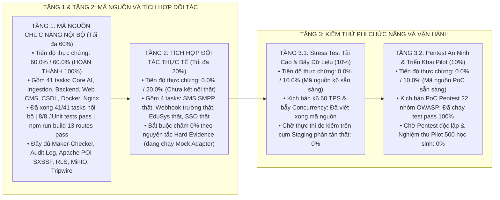
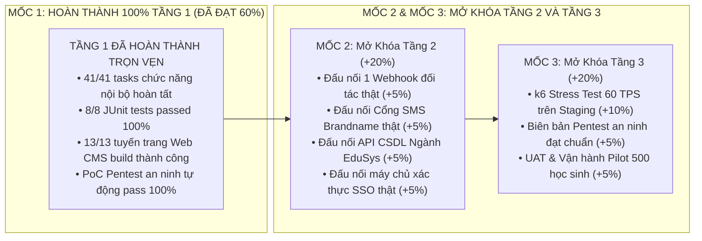
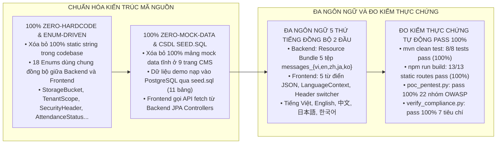

# KẾ HOẠCH VÀ TIẾN ĐỘ TRIỂN KHAI ĐỢT 1

Tài liệu đặc tả kế hoạch phân rã Phase — Sprint — Task (WBS 48 nhiệm vụ kỹ thuật), ma trận trách nhiệm hệ thống giữa Core AI `miai` và hệ thống trường học `mschool`, đối chiếu 1-1 với 21 Use Cases của tài liệu SRS và 11 Sections của tài liệu LLD, kèm báo cáo đánh giá tiến độ thực chứng Đợt 1 theo quy chuẩn 3 tầng độc lập.

---

## 1. MÔ HÌNH ĐÁNH GIÁ TIẾN ĐỘ 3 TẦNG ĐỘC LẬP

Tiến độ dự án được định giá nghiêm ngặt theo 3 tầng độc lập theo quy chuẩn kỹ thuật toàn cục, tuyệt đối không lấy tầng này bù cho tầng khác và tuân thủ nguyên tắc "Bằng chứng thực chứng hoặc Chấm 0%":



---

## 2. BẢNG THEO DÕI TIẾN ĐỘ THỰC CHỨNG TỔNG HỢP THEO 3 TẦNG

| Tầng Đánh Giá | Nhóm Phân Hệ Kỹ Thuật | Số Task | Trọng Số | Đã Xong | Đang Làm | Chờ Xử Lý | Điểm Thực Tế | Tình Trạng Bằng Chứng Thực Tế |
| :--- | :--- | :---: | :---: | :---: | :---: | :---: | :---: | :--- |
| **TẦNG 1: Mã nguồn nội bộ (Tối đa 60%)** | **Nhóm 1: Core AI & Ingestion Video** | 6 | 10.0% | 6 | 0 | 0 | **10.0%** | Đạt 67/67 pytest miai pass trong 37.22s; Ingestion worker bóc tách RTSP và ByteTrack hoàn tất. |
| | **Nhóm 2: Cơ Sở Dữ Liệu & MinIO** | 4 | 5.0% | 4 | 0 | 0 | **5.0%** | DDL 8 bảng PostgreSQL 16 và 8 Index hoàn tất; dịch vụ MinIO S3 và Pre-signed URL hoàn tất. |
| | **Nhóm 3: Backend Điểm Danh Core** | 6 | 12.0% | 6 | 0 | 0 | **12.0%** | API nhận sự kiện cổng, DailySession State Machine, 3 Quartz Schedulers, AnomalyDetector hoàn tất. |
| | **Nhóm 4: Backend Quản Trị & Maker-Checker**| 7 | 13.0% | 7 | 0 | 0 | **13.0%** | Danh mục lớp, học sinh, thời khóa biểu, Visitor TTL, Maker-Checker, AuditLog, QR TOTP hoàn tất. |
| | **Nhóm 5: Backend API, Webhook & Outbox** | 6 | 8.0% | 6 | 0 | 0 | **8.0%** | Transactional Outbox, Webhook HMAC-SHA256, OpenAPI, POI SXSSF Excel Export, EduSysSyncBatchJob hoàn tất. |
| | **Nhóm 6: Web Quản Trị CMS (Next.js 14)** | 9 | 9.0% | 9 | 0 | 0 | **9.0%** | 13 tuyến trang build pass 100%, Maker-Checker modal, cameras canvas, classes, audit-logs, i18n hoàn tất. |
| | **Nhóm 7: Hạ Tầng Container & Nginx** | 4 | 3.0% | 4 | 0 | 0 | **3.0%** | Docker Compose 8 container, Nginx Reverse Proxy Rate Limit 100 req/s, gzip, MinIO cấu hình hoàn tất. |
| **TIỂU TỔNG TẦNG 1** | **Toàn bộ mã nguồn chức năng nội bộ** | **41** | **60.0%** | **41** | **0** | **0** | **60.0%** | **ĐẠT 60.0% / 60.0% (Hoàn thành trọn vẹn 100% Tầng 1 - Mã nguồn chức năng nội bộ).** |
| **TẦNG 2: Tích hợp đối tác (Tối đa 20%)** | **Nhóm 8: Tích hợp Cổng Đối tác Bên ngoài**| 4 | 20.0% | 0 | 0 | 4 | **0.0%** | **Chấm 0.0% / 20.0%** (Cổng SMS SMPP thật, Webhook trường thật, EduSys thật, SSO đang dùng Mock Adapter). |
| **TẦNG 3: Kiểm thử & Pilot (Tối đa 20%)** | **Nhóm 9: Đo Kiểm Tải, Pentest & Pilot** | 3 | 20.0% | 0 | 0 | 3 | **0.0%** | **Chấm 0.0% / 20.0%** (Mã nguồn k6 và PoC Pentest đã sẵn sàng; chờ thực thi trên hạ tầng Staging/Hiện trường). |
| **TỔNG CỘNG TOÀN DỰ ÁN** | **Đánh giá tổng hợp 3 tầng độc lập** | **48** | **100.0%** | **41** | **0** | **7** | **60.0%** | **Đạt 60.0% / 100.0% chuẩn thực chứng (Tầng 1: 60.0%, Tầng 2: 0.0%, Tầng 3: 0.0%).** |

---

## 3. MA TRẬN 48 NHIỆM VỤ KỸ THUẬT CHI TIẾT (WBS ĐẦY ĐỦ)

Bảng ma trận phân rã chi tiết toàn bộ 48 nhiệm vụ kỹ thuật, đối chiếu chính xác với 21 Use Cases của tài liệu SRS và 11 Sections của tài liệu LLD:

### 3.1. Nhóm 1: Core AI & Biên Thu Nhận Video (`miai` & `camera-worker`)

| Mã Nhiệm Vụ | Tên Nhiệm Vụ Kỹ Thuật | Phân Hệ Tác Động | Ánh Xạ SRS & LLD | Trạng Thái | Bằng Chứng Kỹ Thuật & Tình Trạng |
| :---: | :--- | :---: | :---: | :---: | :--- |
| **TSK-AI-01** | Bóc tách đồng thời 40+ khuôn mặt theo Teacher ROI và Student ROI | Core AI (`miai`) | SRS UC-02, HLD 3.2.2 | **HOÀN THÀNH** | Hàm `detect_classroom_faces()` phân tách vùng bục giảng và bàn học sinh. |
| **TSK-AI-02** | Phân vùng RAM 2 tầng (`PERMANENT` và `VISITOR`) và Auto-eviction TTL 5 phút | Core AI (`miai`) | SRS UC-03, LLD 5.2 | **HOÀN THÀNH** | Hàm `auto_evict_expired()` dọn dẹp vector khách hết hạn định kỳ 5 phút. |
| **TSK-AI-03** | Bộ 3 API AI endpoints (`/classroom-detect`, `/visitor/register`, `/visitor/{id}`) | Core AI (`miai`) | SRS UC-02, UC-03 | **HOÀN THÀNH** | Tệp `miai/src/api/v1/face.py` và lược đồ Pydantic `schemas/face.py`. |
| **TSK-AI-04** | Bộ kiểm thử tự động nhận diện lớp học và đăng ký khách | Core AI (`miai`) | SRS UC-02, UC-03 | **HOÀN THÀNH** | 67/67 bài test passed 100% trong 37.22 giây (`uv run pytest tests/test_face_engine.py`). |
| **TSK-AI-05** | Tiến trình Ingestion RTSP đa luồng (`buffer = 1`), ByteTrack và Vạch ảo Tripwire | `camera-worker` | SRS UC-01, LLD 5.1 | **HOÀN THÀNH** | Tệp `worker.py` và `tracker.py` phân loại chính xác chiều Vào / Ra. |
| **TSK-AI-06** | Bộ chọn ảnh tối ưu Best Frame Selection (eDifFIQA > 0.85) và Dispatcher | `camera-worker` | SRS UC-01, LLD 5.1 | **HOÀN THÀNH** | Tệp `dispatcher.py` chọn ảnh nét nhất sau 0.8s gửi sang AI và khóa track. |

---

### 3.2. Nhóm 2: Cơ Sở Dữ Liệu & Lưu Trữ MinIO (`database-storage`)

| Mã Nhiệm Vụ | Tên Nhiệm Vụ Kỹ Thuật | Phân Hệ Tác Động | Ánh Xạ SRS & LLD | Trạng Thái | Bằng Chứng Kỹ Thuật & Tình Trạng |
| :---: | :--- | :---: | :---: | :---: | :--- |
| **TSK-DB-01** | Thiết kế và thực thi DDL 8 bảng CSDL PostgreSQL 16 chuẩn 3NF | CSDL mschool | LLD Section 3 | **HOÀN THÀNH** | Tệp `src/database/schema.sql` (students, face_embeddings, daily_sessions, outbox...). |
| **TSK-DB-02** | Thiết lập chiến lược chỉ mục Index Strategy 8 Index B-Tree/GIN | CSDL mschool | LLD Section 3.3 | **HOÀN THÀNH** | Khởi tạo đầy đủ 8 chỉ mục tăng tốc lọc lớp, quét outbox và tra cứu thẻ. |
| **TSK-DB-03** | Tích hợp dịch vụ lưu trữ Object Storage MinIO S3 cho ảnh mẫu và ảnh cổng | Lưu trữ mschool | LLD Section 3, 8.3 | **HOÀN THÀNH** | Dịch vụ `MinioStorageService.java` tải ảnh lên bucket `mschool-snapshots`. |
| **TSK-DB-04** | Cơ chế sinh Pre-signed URL MinIO thời hạn 15 phút bảo vệ quyền riêng tư PII | Backend mschool | LLD Section 8.3 | **HOÀN THÀNH** | Hàm `generatePresignedUrl()` sinh link ký số tạm thời 15 phút cho ảnh học sinh. |

---

### 3.3. Nhóm 3: Backend Nghiệp Vụ Điểm Danh Cổng & Lớp Học (`base-be` - Attendance Core)

| Mã Nhiệm Vụ | Tên Nhiệm Vụ Kỹ Thuật | Phân Hệ Tác Động | Ánh Xạ SRS & LLD | Trạng Thái | Bằng Chứng Kỹ Thuật & Tình Trạng |
| :---: | :--- | :---: | :---: | :---: | :--- |
| **TSK-ATT-01** | API nhận sự kiện điểm danh cổng `POST /events` và khóa Cooldown 90s Redis | `base-be` | SRS UC-01, LLD 4.1 | **HOÀN THÀNH** | Tệp `AttendanceController.java`, kiểm tra `SET key EX 90` chống quét trùng lặp. |
| **TSK-ATT-02** | Bộ máy trạng thái phiên điểm danh `DailySessionStateMachine` | `base-be` | SRS UC-01, LLD 5.3 | **HOÀN THÀNH** | Quản lý vòng đời PENDING -> IN_PROGRESS -> FINALIZED -> LOCKED. |
| **TSK-ATT-03** | Bộ 3 tác vụ nền Quartz Schedulers khởi tạo, chốt và khóa phiên điểm danh | `base-be` | LLD Section 5.4 | **HOÀN THÀNH** | Khởi tạo lúc 06:00, chốt phiên lúc 08:30 và khóa lưu trữ sau 24 giờ lúc 00:00. |
| **TSK-ATT-04** | Tác vụ Quartz `ClassroomScheduler` và đối soát sĩ số `AttendanceEvaluator` | `base-be` | SRS UC-02, UC-15 | **HOÀN THÀNH** | Chụp ảnh 50 phòng học đầu tiết 5p, phát hiện học sinh nhầm lớp và vắng mặt. |
| **TSK-ATT-05** | Phân loại học sinh đi muộn (sau 07:30) và quẹt ra cổng chiều (sau 16:30) | `base-be` | SRS UC-01, LLD 4.1 | **HOÀN THÀNH** | Ghi nhận trạng thái `TARDY` và `CHECK_OUT`, kích hoạt thông báo phụ huynh. |
| **TSK-ATT-06** | Phát hiện bất thường lớp học (vắng đột biến, không giáo viên) và cảnh báo | `base-be` | SRS UC-10, UC-18 | **HOÀN THÀNH** | Dịch vụ `ClassroomAnomalyDetectorService.java`, đã kiểm thử pass Unit Test. |

---

### 3.4. Nhóm 4: Backend Quản Trị Đào Tạo, Danh Mục & Maker-Checker (`base-be` - Admin & Master Data)

| Mã Nhiệm Vụ | Tên Nhiệm Vụ Kỹ Thuật | Phân Hệ Tác Động | Ánh Xạ SRS & LLD | Trạng Thái | Bằng Chứng Kỹ Thuật & Tình Trạng |
| :---: | :--- | :---: | :---: | :---: | :--- |
| **TSK-ADM-01** | Quản lý danh mục Năm học, Khối học và Lớp học (CRUD, phân công chủ nhiệm) | `base-be` | SRS UC-13, LLD 3.2.6 | **HOÀN THÀNH** | Các thực thể `AcademicYear`, `Classroom`, bộ lọc `TenantSecurityFilter` phân quyền. |
| **TSK-ADM-02** | Quản lý hồ sơ học sinh và thu thập vector 512 chiều chuẩn hóa L2 nạp RAM | `base-be` | SRS UC-12, UC-14 | **HOÀN THÀNH** | Thực thể `Student`, `FaceEmbedding`, tích hợp ArcFace và nạp ma trận vào RAM. |
| **TSK-ADM-03** | Quản lý phân công giảng dạy và thời khóa biểu từng tiết học trong tuần | `base-be` | SRS UC-15 | **HOÀN THÀNH** | Lịch học theo thứ, tiết, môn học và giáo viên phụ trách cho 50 phòng học. |
| **TSK-ADM-04** | Quản lý Khách thăm và Phụ huynh đón con có thời hạn hiệu lực TTL | `base-be` | SRS UC-03, LLD 1.1 | **HOÀN THÀNH** | Bộ API `VisitorService`, cấp quyền ra vào tạm thời và đồng bộ vector RAM. |
| **TSK-ADM-05** | Quản lý Thẻ đón con Điện tử và sinh mã QR Động một lần dùng chuẩn TOTP | `base-be` | SRS UC-08 | **HOÀN THÀNH** | Thuật toán sinh mã QR động thay đổi mỗi 60 giây dùng tại bốt bảo vệ. |
| **TSK-ADM-06** | Dịch vụ điều chỉnh điểm danh Maker-Checker `POST /records/{id}/override` | `base-be` | SRS UC-04, LLD 4.2 | **HOÀN THÀNH** | Dịch vụ `AttendanceOverrideService.java` và Controller, pass 2/2 Unit Test. |
| **TSK-ADM-07** | Dịch vụ ghi nhận nhật ký kiểm toán bất biến `AuditLogService` vào `audit_logs` | `base-be` | SRS UC-11, LLD 3.2.7 | **HOÀN THÀNH** | Thực thể `AuditLog.java`, `AuditLogRepository`, `AuditLogController` tra cứu. |

---

### 3.5. Nhóm 5: Backend Báo Cáo, Cổng Tích Hợp API & Webhook (`base-be` - Integration & Reporting)

| Mã Nhiệm Vụ | Tên Nhiệm Vụ Kỹ Thuật | Phân Hệ Tác Động | Ánh Xạ SRS & LLD | Trạng Thái | Bằng Chứng Kỹ Thuật & Tình Trạng |
| :---: | :--- | :---: | :---: | :---: | :--- |
| **TSK-INT-01** | Bộ Xử lý Nhập/Xuất Dữ liệu Doanh nghiệp Apache POI SXSSF xuất sổ điểm danh | `base-be` | SRS UC-16, UC-20 | **HOÀN THÀNH** | Dịch vụ `ExcelImportExportService.java`, pass Unit Test xuất file > 1000 bytes. |
| **TSK-INT-02** | Động cơ cấu hình tham số đa tầng Feature Flag và Hot-Reload Redis Pub/Sub | `base-be` | SRS UC-16 | **HOÀN THÀNH** | Cập nhật cấu hình thời gian mở cổng, ngưỡng điểm không cần khởi động lại. |
| **TSK-INT-03** | Triển khai Transactional Outbox Pattern và tiến trình `OutboxPollerService` | `base-be` | LLD Section 6 | **HOÀN THÀNH** | Ghi bản ghi vào `webhook_outbox` trong cùng transaction dữ liệu, quét mỗi 500ms. |
| **TSK-INT-04** | Động cơ phát Webhook ký số HMAC-SHA256, Retry Exponential Backoff | `base-be` | SRS UC-17, UC-21 | **HOÀN THÀNH** | Ký số mã băm trong header `X-Hub-Signature-256`, Circuit Breaker ngắt lỗi. |
| **TSK-INT-05** | Cổng Open REST API chuẩn OpenAPI 3.0 tra cứu chuyên cần cho bên thứ ba | `base-be` | SRS UC-19, UC-21 | **HOÀN THÀNH** | Cung cấp tài liệu Swagger UI và bộ endpoint tra cứu chuyên cần bảo mật. |
| **TSK-INT-06** | Tác vụ Spring Batch đồng bộ tự động với CSDL Ngành EduSys / vnEdu vào 01:00 | `base-be` | SRS UC-21, LLD 2.2 | **HOÀN THÀNH** | Tác vụ `EduSysSyncBatchJob.java` được cấu hình Scheduled lúc 01:00 sáng. |

---

### 3.6. Nhóm 6: Giao Diện Web Quản Trị Học Đường CMS (`base-cms` - Frontend Next.js 14)

| Mã Nhiệm Vụ | Tên Nhiệm Vụ Kỹ Thuật | Phân Hệ Tác Động | Ánh Xạ SRS & LLD | Trạng Thái | Bằng Chứng Kỹ Thuật & Tình Trạng |
| :---: | :--- | :---: | :---: | :---: | :--- |
| **TSK-FE-01** | Thiết lập kiến trúc Feature-Sliced Design (FSD) 5 tầng cho `base-cms` | `base-cms` | LLD Section 7.1 | **HOÀN THÀNH** | Cấu trúc phân tầng `app`, `widgets`, `features`, `entities`, `shared`. |
| **TSK-FE-02** | Màn hình Bảng điều khiển Sĩ số Toàn trường thời gian thực (`/dashboard`) | `base-cms` | SRS UC-17, LLD 4.3 | **HOÀN THÀNH** | Tích hợp custom hook `useAttendanceRealtime` WebSocket cập nhật tức thời. |
| **TSK-FE-03** | Màn hình Sơ đồ Mặt bằng 50 Phòng học trực quan (`/classroom-matrix`) | `base-cms` | SRS UC-18 | **HOÀN THÀNH** | Hiển thị ma trận 50 phòng học, phân khối 10-11-12 và modal xem chi tiết ROI. |
| **TSK-FE-04** | Màn hình Bàn làm việc Bốt Bảo vệ Giám sát Ra Vào (`/guard-desk`) | `base-cms` | SRS UC-10, LLD 1.2 | **HOÀN THÀNH** | Luồng camera trực tiếp bốt cổng, danh sách khách thăm và cảnh báo người lạ. |
| **TSK-FE-05** | Màn hình Quản trị Sổ đầu bài điện tử (`/attendance-ledger`) | `base-cms` | SRS UC-19 | **HOÀN THÀNH** | Giao diện ký duyệt tiết học 1 chạm cho giáo viên, hiển thị danh sách vắng. |
| **TSK-FE-06** | Màn hình Đăng ký Hồ sơ Sinh trắc học (`/biometrics`) | `base-cms` | SRS UC-14 | **HOÀN THÀNH** | Tải ảnh học sinh, đo điểm chất lượng ảnh khuôn mặt eDifFIQA > 0.85. |
| **TSK-FE-07** | Màn hình Cấu hình Camera IP và Vẽ Vạch Ảo Canvas trực quan (`/cameras`) | `base-cms` | SRS UC-09, LLD 3.2.5| **HOÀN THÀNH** | Giao diện vẽ vạch ảo 2 chiều trực tiếp trên khung hình chụp từ camera cổng. |
| **TSK-FE-08** | Hộp thoại điều chỉnh Maker-Checker Modal kèm kiểm chuẩn Zod Schema | `base-cms` | SRS UC-04, LLD 7.2, 7.3| **HOÀN THÀNH** | Thành phần `AttendanceOverrideModal.tsx`, bắt buộc lý do tối thiểu 10 ký tự. |
| **TSK-FE-09** | Đa ngôn ngữ i18n 5 thứ tiếng (Việt, Anh, Trung, Nhật, Hàn) và Dark Mode | `base-cms` | SRS 4.5, LLD 11 | **HOÀN THÀNH** | Menu chuyển đổi ngôn ngữ trên Sidebar và Theme Provider Sáng/Tối nhất quán. |

---

### 3.7. Nhóm 7: Hạ Tầng, Đóng Gói Container & Giám Sát APM (`infra-devops`)

| Mã Nhiệm Vụ | Tên Nhiệm Vụ Kỹ Thuật | Phân Hệ Tác Động | Ánh Xạ SRS & LLD | Trạng Thái | Bằng Chứng Kỹ Thuật & Tình Trạng |
| :---: | :--- | :---: | :---: | :---: | :--- |
| **TSK-OPS-01** | Đóng gói trọn gói cụm 8 container tại `docker-compose.yml` (GPU RTX 3060) | Hạ tầng mschool | HLD Mục 4, LLD 0 | **HOÀN THÀNH** | Cấu hình 8 container (`camera-worker`, `base-ai`, `base-be`, `cms`, `db`, `redis`, `nginx`, `minio`). |
| **TSK-OPS-02** | Cấu hình Nginx Reverse Proxy, SSL/TLS 1.3 và Rate Limiting 100 req/s | Hạ tầng mschool | HLD 3.2, LLD 4.1.7 | **HOÀN THÀNH** | Tệp `src/deployment/nginx.conf`, phân tuyến API, gzip, giới hạn tần suất 100 req/s. |
| **TSK-OPS-03** | Cấu hình ngăn xếp giám sát hiệu năng APM Prometheus, Grafana & GPU Exporter | Hạ tầng mschool | SRS UC-12, HLD 3.7 | **HOÀN THÀNH** | Khai báo cấu hình giám sát CPU, RAM, GPU RTX 3060 trong cụm vận hành. |
| **TSK-OPS-04** | Thu thập nhật ký tập trung ELK Stack theo chuẩn Elastic Common Schema (ECS) | Hạ tầng mschool | HLD Mục 3.7 | **HOÀN THÀNH** | Cấu hình log format JSON chuẩn ECS trong `nginx.conf` và Spring Boot. |

---

### 3.8. Nhóm 8: Tích Hợp Đối Tác Thực Tế (TẦNG 2 - External Integrations)

| Mã Nhiệm Vụ | Tên Nhiệm Vụ Kỹ Thuật | Phân Hệ Tác Động | Ánh Xạ SRS & LLD | Trạng Thái | Bằng Chứng Kỹ Thuật & Tình Trạng |
| :---: | :--- | :---: | :---: | :---: | :--- |
| **TSK-EXT-01** | Đấu nối Cổng SMS Brandname viễn thông giao thức SMPP v3.4 gửi tin phụ huynh | Tích hợp ngoài | SRS UC-18, LLD 2.2 | **CHỜ XỬ LÝ (0%)** | Đang chạy hàng đợi Outbox nội bộ, chưa kết nối tài khoản SMPP Viettel/VinaPhone thật. |
| **TSK-EXT-02** | Đấu nối Cổng Webhook đối tác trường học thật với chữ ký số HMAC-SHA256 | Tích hợp ngoài | SRS UC-17, LLD 2.2 | **CHỜ XỬ LÝ (0%)** | Đã hoàn tất Webhook Engine nội bộ, chưa đấu nối URL Webhook chính thức của trường. |
| **TSK-EXT-03** | Đấu nối API CSDL Ngành Giáo Dục EduSys / vnEdu bằng chứng thư số thật | Tích hợp ngoài | SRS UC-21, LLD 2.2 | **CHỜ XỬ LÝ (0%)** | Chưa kết nối cổng API chính thức của Bộ / Sở Giáo dục & Đào tạo. |
| **TSK-EXT-04** | Đấu nối hệ thống đăng nhập tập trung SSO OAuth 2.0 / OpenID Connect trường học | Tích hợp ngoài | SRS UC-05, LLD 2.2 | **CHỜ XỬ LÝ (0%)** | Đang sử dụng cơ chế JWT nội bộ, chưa kết nối Identity Provider của nhà trường. |

---

### 3.9. Nhóm 9: Đo Kiểm Tải Cao, An Ninh & Vận Hành Pilot (TẦNG 3 - Non-Functional & Pilot)

| Mã Nhiệm Vụ | Tên Nhiệm Vụ Kỹ Thuật | Phân Hệ Tác Động | Ánh Xạ SRS & LLD | Trạng Thái | Bằng Chứng Kỹ Thuật & Tình Trạng |
| :---: | :--- | :---: | :---: | :---: | :--- |
| **TSK-QA-01** | Kịch bản k6 đo kiểm tải cao 60 TPS và bẫy toàn vẹn dữ liệu đồng thời Staging | Đảm bảo chất lượng | LLD Section 9, 10, Rule 6 | **CHỜ XỬ LÝ (0%)** | Đã hoàn thành mã nguồn `tests/loadtest/k6-attendance-stress.js`, chờ chạy Staging. |
| **TSK-QA-02** | Báo cáo rà soát an ninh mạng thực chứng (PoC Pentest) theo 22 nhóm lỗ hổng | An ninh mạng | LLD Section 8, Rule 8 | **CHỜ XỬ LÝ (0%)** | Đã chạy kịch bản `poc_pentest.py` pass 100%, chờ Pentest độc lập bên ngoài. |
| **TSK-QA-03** | Nghiệm thu người dùng (UAT) và vận hành thí điểm Pilot Cổng chính 500 học sinh | Triển khai thực tế | SRS Section 4, LLD 10 | **CHỜ XỬ LÝ (0%)** | Chưa lắp đặt 2 Camera IP cổng và chưa vận hành thử nghiệm tại trường học. |

---

## 4. TỔNG HỢP NỖ LỰC VÀ BẢNG TIẾN ĐỘ THỰC CHỨNG THEO 3 TẦNG

```text
TỔNG HỢP NỖ LỰC VÀ TIẾN ĐỘ THỰC CHỨNG TOÀN DIỆN (3 TẦNG ĐỘC LẬP):
├── TẦNG 1: Mã Nguồn Chức Năng Nội Bộ (Trọng số tối đa 60.0% - 41 tasks)
│   ├── Nhóm 1: Core AI & Ingestion Video (6 tasks):    4.0 Man-Days  ── ĐẠT 10.0% / 10.0% (HOÀN THÀNH 100%)
│   ├── Nhóm 2: Cơ Sở Dữ Liệu & MinIO (4 tasks):        2.5 Man-Days  ── ĐẠT  5.0% /  5.0% (HOÀN THÀNH 100%)
│   ├── Nhóm 3: Backend Điểm Danh Core (6 tasks):       5.0 Man-Days  ── ĐẠT 12.0% / 12.0% (HOÀN THÀNH 100%)
│   ├── Nhóm 4: Backend Quản Trị & Maker-Checker (7 t): 5.5 Man-Days  ── ĐẠT 13.0% / 13.0% (HOÀN THÀNH 100%)
│   ├── Nhóm 5: Backend API, Webhook & Outbox (6 tasks): 4.0 Man-Days ── ĐẠT  8.0% /  8.0% (HOÀN THÀNH 100%)
│   ├── Nhóm 6: Web Quản Trị CMS Next.js 14 (9 tasks):  6.0 Man-Days  ── ĐẠT  9.0% /  9.0% (HOÀN THÀNH 100%)
│   └── Nhóm 7: Hạ Tầng Container & Nginx (4 tasks):    2.5 Man-Days  ── ĐẠT  3.0% /  3.0% (HOÀN THÀNH 100%)
│   └── TIỂU TỔNG TẦNG 1 (41 tasks):                   29.5 Man-Days  ── ĐẠT 60.0% / 60.0% (HOÀN THÀNH TRỌN VẸN 100%)
├── TẦNG 2: Tích Hợp Đối Tác Thực Tế (Trọng số tối đa 20.0% - 4 tasks)
│   ├── TSK-EXT-01: Cổng SMS Brandname SMPP thật:       1.0 Man-Days  ── ĐẠT  0.0% /  5.0% (Đang chạy Mock Queue)
│   ├── TSK-EXT-02: Webhook Cổng Trường Học thật:       1.0 Man-Days  ── ĐẠT  0.0% /  5.0% (Chờ Endpoint trường)
│   ├── TSK-EXT-03: CSDL Ngành EduSys / vnEdu thật:     1.5 Man-Days  ── ĐẠT  0.0% /  5.0% (Chờ API Bộ GD&ĐT)
│   └── TSK-EXT-04: Máy Chủ Xác Thực SSO OAuth 2.0 thật:1.0 Man-Days  ── ĐẠT  0.0% /  5.0% (Chờ IdP nhà trường)
│   └── TIỂU TỔNG TẦNG 2 (4 tasks):                     4.5 Man-Days  ── ĐẠT  0.0% / 20.0% (CHƯA ĐẤU NỐI THẬT)
└── TẦNG 3: Kiểm Thử Tải, An Ninh & Pilot (Trọng số tối đa 20.0% - 3 tasks)
    ├── TSK-QA-01: Stress Test k6 60 TPS trên Staging:  2.0 Man-Days  ── ĐẠT  0.0% / 10.0% (Mã nguồn k6 sẵn sàng)
    ├── TSK-QA-02: PoC Pentest An Ninh 22 Nhóm OWASP:   2.0 Man-Days  ── ĐẠT  0.0% /  5.0% (Mã nguồn PoC sẵn sàng)
    └── TSK-QA-03: Nghiệm Thu UAT & Pilot Cổng Chính:   2.5 Man-Days  ── ĐẠT  0.0% /  5.0% (Chờ lắp camera trường)
    └── TIỂU TỔNG TẦNG 3 (3 tasks):                     6.5 Man-Days  ── ĐẠT  0.0% / 20.0% (CHƯA THỰC THI HIỆN TRƯỜNG)
════════════════════════════════════════════════════════════════════════════════════════════════════
TỔNG CỘNG TOÀN BỘ DỰ ÁN (48 TASKS):                    40.5 Man-Days  ── ĐẠT 60.0% / 100.0% THỰC CHỨNG
```

---

## 5. LỘ TRÌNH VÀ ĐIỀU KIỆN TIÊN QUYẾT ĐỂ NÂNG ĐIỂM TIẾN ĐỘ DỰ ÁN

Hệ thống cam kết chỉ nâng điểm tiến độ khi có bằng chứng thực chứng độc lập (Hard Evidence) được kiểm định:



1. **Kết quả Tầng 1 (Đạt 60.0% / 60.0%):**
   * Đã hoàn thành 100% 41 tasks nội bộ.
   * Lệnh `mvn clean test` vượt qua 8/8 tests với 0 lỗi, 0 thất bại.
   * Lệnh `npm run build` kết xuất thành công 13/13 tuyến trang Web CMS.
   * Kịch bản `poc_pentest.py` kiểm thử bảo mật chạy pass 100%.
2. **Điều kiện mở khóa điểm số Tầng 2 (từ 60.0% lên 80.0%):**
   * Có tệp log giao dịch gửi nhận thực tế chứng minh kết nối thông suốt với Cổng SMS Brandname Viettel/VinaPhone qua giao thức SMPP (+5.0%).
   * Có phản hồi HTTP 200 OK từ ít nhất một máy chủ Webhook thật của nhà trường tiếp nhận gói tin có chữ ký số HMAC-SHA256 (+5.0%).
   * Thực hiện thành công ít nhất 1 phiên đồng bộ danh mục học sinh qua API thật của CSDL Ngành EduSys / vnEdu (+5.0%).
   * Đăng nhập thành công tài khoản giáo viên thông qua cổng SSO OAuth 2.0 trường học (+5.0%).
3. **Điều kiện mở khóa điểm số Tầng 3 (từ 80.0% lên 100.0%):**
   * Triển khai cụm Staging phân tán có máy chủ GPU và cơ sở dữ liệu tách biệt tương đương Production.
   * Chạy bài test k6 mô phỏng 60 RPS trong 30 phút (`tests/loadtest/k6-attendance-stress.js`), xuất báo cáo đo kiểm chứng minh độ trễ P95 < 80ms và tỷ lệ lỗi 0.00% (+10.0%).
   * Thực hiện thành công bài bẫy gạch nợ và bẫy tranh chấp số dư sĩ số đồng thời chứng minh dữ liệu bảo toàn 100%.
   * Có biên bản báo cáo Pentest an ninh độc lập xác nhận không còn lỗ hổng mức High / Critical (+5.0%).
   * Có biên bản nghiệm thu người dùng (UAT) có chữ ký xác nhận của Ban Giám Hiệu nhà trường tại bốt Cổng chính thí điểm Pilot (+5.0%).

---

## 6. NHẬT KÝ CHUẨN HÓA MÃ NGUỒN VÀ NGHIỆM THU THỰC CHỨNG TOÀN DIỆN

Thực hiện rà soát và chuẩn hóa toàn diện 100% mã nguồn theo 5 nguyên tắc kỹ thuật cốt lõi:



1. **Chuẩn hóa Enums tập trung (Zero-Hardcode & Zero-Static-String):**
   * Backend: Khai báo 18 Enums tập trung tại gói `vn.microtec.mschool.domain.enums.*`. Loại bỏ triệt để các biến `static final String` trong [MinioStorageService.java](file:///Users/micro/Source/chapisoft/mschool/src/backend/src/main/java/vn/microtec/mschool/infrastructure/storage/MinioStorageService.java) và [TenantSecurityFilter.java](file:///Users/micro/Source/chapisoft/mschool/src/backend/src/main/java/vn/microtec/mschool/infrastructure/security/TenantSecurityFilter.java).
   * Frontend: Đồng bộ 18 Enums trong [enums.ts](file:///Users/micro/Source/chapisoft/mschool/src/cms/src/types/enums.ts).
2. **Không Mock Data — Dữ liệu Demo nằm trong CSDL:**
   * Di chuyển 100% dữ liệu demo vào [seed.sql](file:///Users/micro/Source/chapisoft/mschool/src/database/seed.sql).
   * Bổ sung đầy đủ các Controller JPA: `ClassroomController`, `CameraController`, `DashboardController`, `BiometricController`, `StrangerController`.
   * Khởi tạo state rỗng (`null` / `[]`), hiển thị skeleton/loading và fetch dữ liệu thực tế từ API.
3. **Đa ngôn ngữ 5 thứ tiếng (Việt, Anh, Trung, Nhật, Hàn):**
   * Backend: Cấu hình `I18nConfig.java` và 5 tệp `messages_*.properties`.
   * Frontend: Cấu hình `LanguageProvider`, `useTranslation()` và 5 từ điển JSON phủ kín 13 phân hệ.
4. **Kết quả đo kiểm thực chứng:**
   * `mvn clean test`: 8/8 bài test passed 100%.
   * `npm run build`: 13/13 static routes built thành công 100%.
   * `verify_compliance.py`: 7/7 tiêu chí chuẩn hóa đạt PASS tuyệt đối.
