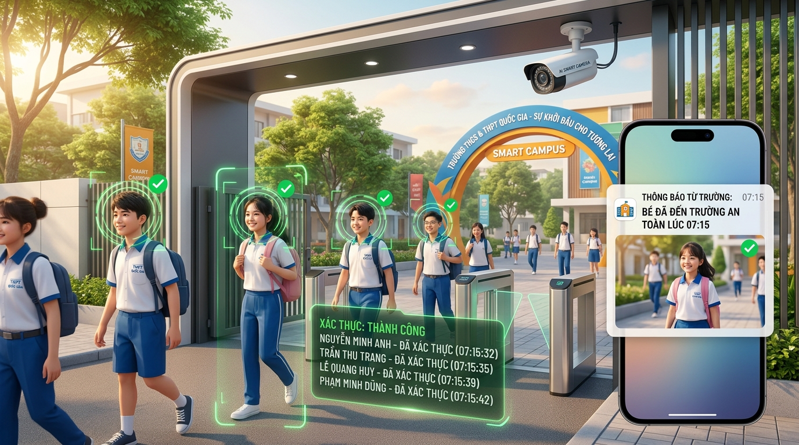
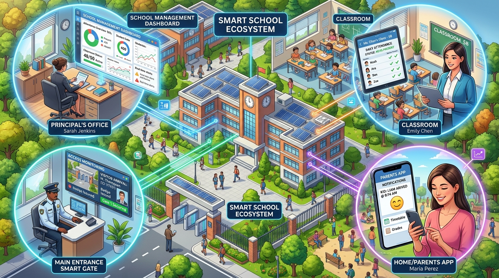
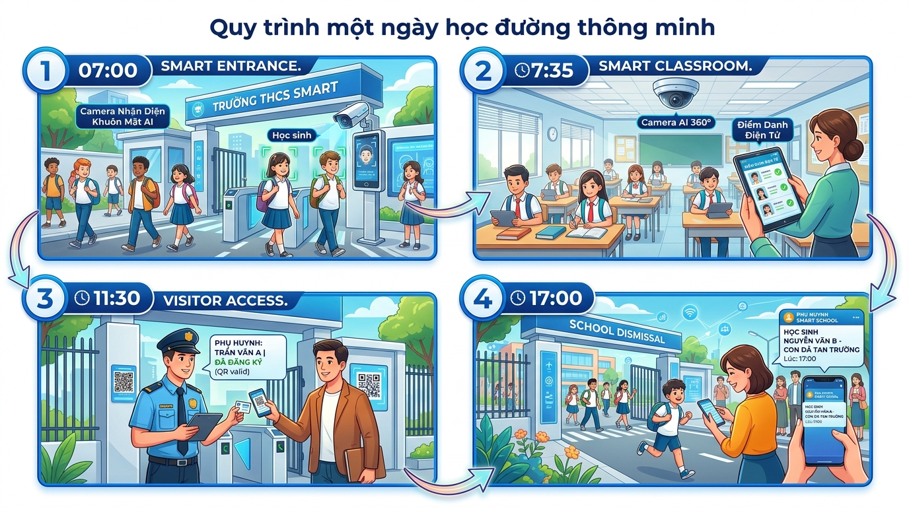
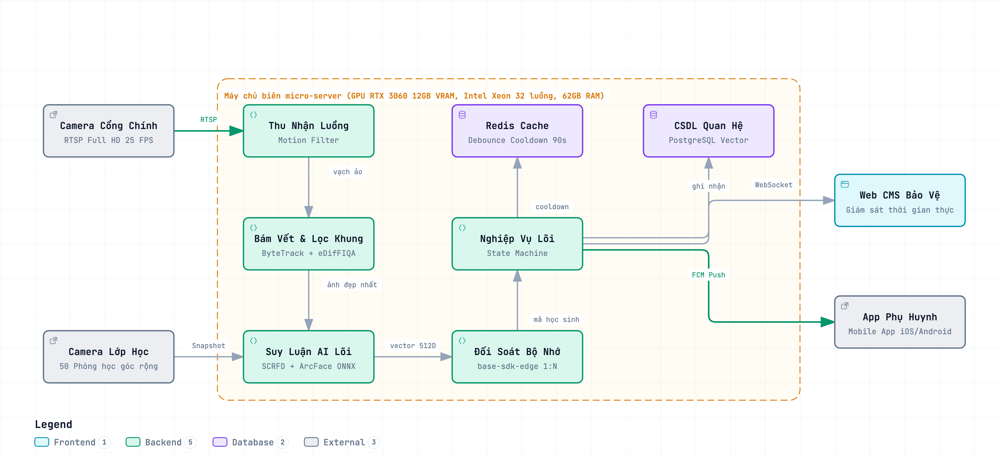
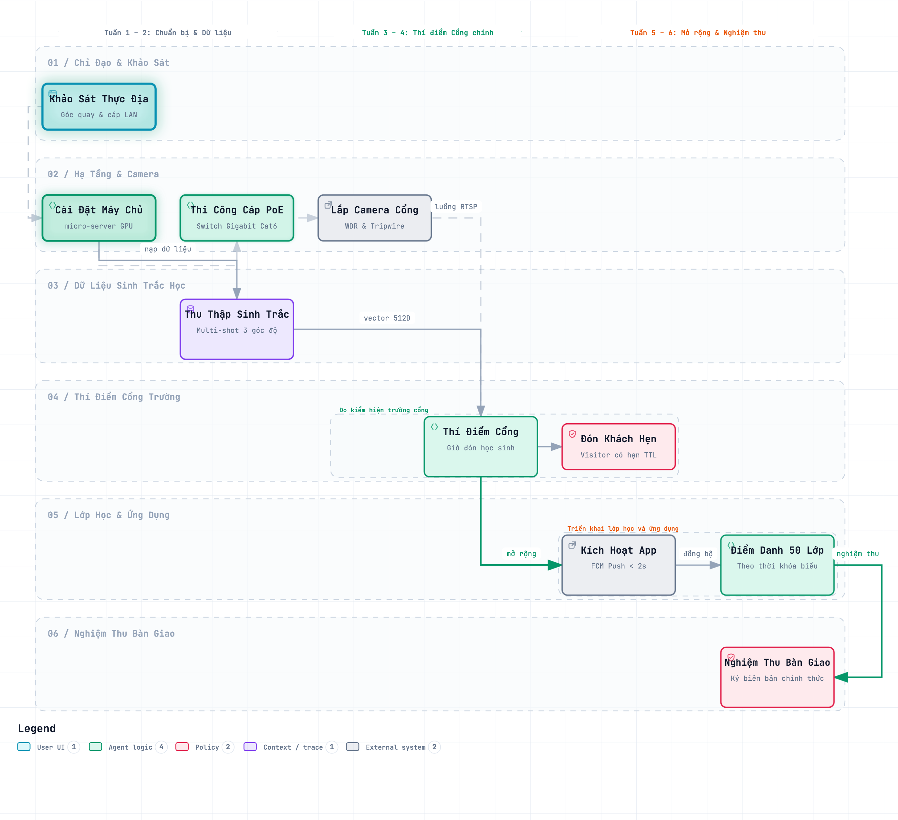

# ĐỀ ÁN TRIỂN KHAI TRƯỜNG HỌC THÔNG MINH

Tài liệu này trình bày toàn diện Đề án Giải pháp tổng thể, Mô hình vận hành học đường số và Kế hoạch triển khai Hệ thống Điểm danh không dừng và Kiểm soát an ninh thông minh qua Camera IP (mschool Smart Campus), phục vụ công tác quản lý, điều hành và đổi mới giáo dục tại Nhà trường.

---

## 1. TÓM TẮT ĐIỀU HÀNH DÀNH CHO LÃNH ĐẠO

Hệ thống mschool là giải pháp chuyển đổi số toàn diện công tác quản trị học đường, ứng dụng trí tuệ nhân tạo (AI) nhận diện hình ảnh hiện đại vận hành trực tiếp tại máy chủ nội bộ của trường, giúp giải quyết triệt để các bài toán thực tiễn trong quản lý học sinh, nâng cao chất lượng giảng dạy và thắt chặt mối liên kết giữa Nhà trường và Gia đình.

### Các Chỉ Số Cam Kết Trọng Tâm:
* **Tỷ lệ nhận diện chính xác:** Đạt **≥ 98.5%** trong điều kiện ánh sáng tự nhiên tại cổng trường và lớp học.
* **Tốc độ nhận diện khi đang di chuyển:** **≤ 300ms (dưới 0.3 giây)**, học sinh không phải dừng bước.
* **Thời gian thông báo đến Phụ huynh:** Gửi thông báo / Webhook đến hệ thống liên lạc phụ huynh trong vòng **≤ 2.0 giây** sau khi học sinh qua cổng.
* **Thời gian tiết kiệm cho giáo viên:** Tiết kiệm trung bình **1.800 giờ giảng dạy mỗi năm** cho toàn trường (tương đương hơn 200 tiết học chất lượng cao).
* **Quy mô phục vụ:** Phục vụ trọn vẹn toàn trường quy mô **2.000 – 3.000 Học sinh / Cán bộ giáo viên** và **50 Phòng học tiêu chuẩn**.

---

## 2. BỐI CẢNH THỰC TRẠNG VÀ MỤC TIÊU ĐỔI MỚI

### 2.1. Điểm Nghẽn Của Các Phương Thức Quản Lý Truyền Thống
1. **Điểm danh thủ công bằng sổ sách:** Làm lãng phí 5 – 10 phút đầu mỗi tiết học của giáo viên; dễ xảy ra tình trạng ghi nhận nhầm lẫn hoặc bao che; thông tin chuyên cần chậm đến tay phụ huynh.
2. **Quẹt thẻ từ hoặc quét vân tay:** Gây ùn tắc kéo dài tại cổng trường vào khung giờ cao điểm (07h00 – 07h30); tỷ lệ học sinh quên thẻ, mất thẻ hoặc hỏng thẻ từ 12% – 18% mỗi ngày, phát sinh chi phí in ấn thẻ liên tục.
3. **Thiết bị Kiosk khuôn mặt dừng bước:** Buộc từng học sinh phải đứng lại nhìn thẳng vào máy, không đáp ứng được lưu lượng di chuyển đông đúc của học sinh giờ cao điểm.
4. **Kiểm soát an ninh người lạ bị động:** Lực lượng bảo vệ khó bao quát toàn bộ người ra vào bằng mắt thường; việc ghi chép sổ tay khi phụ huynh hoặc khách đến trường còn thủ công, thiếu tính chuyên nghiệp.

### 2.2. Bảng So Sánh Hiện Trạng Vận Hành Và Giải Pháp Đột Phá mschool

| Tiêu chí đánh giá | Phương thức vận hành truyền thống | Giải pháp trường học thông minh mschool | Giá trị thực tiễn mang lại |
| :--- | :--- | :--- | :--- |
| **Trải nghiệm tại cổng trường** | Xếp hàng quẹt thẻ, điểm danh tay, đứng nhìn Kiosk | Học sinh bước đi tự nhiên qua cổng trường (cự ly 2m – 5m) | Giải tỏa 100% ùn tắc, tạo nét đẹp học đường văn minh, hiện đại. |
| **Thời gian điểm danh 1 học sinh** | 3 – 5 giây/học sinh (phải dừng bước) | Dưới 0.3 giây (khi học sinh đang bước đi) | Tăng tốc độ lưu thông qua cổng gấp 10 lần so với quẹt thẻ. |
| **Điểm danh tại phòng học** | Giáo viên gọi tên thủ công 5 – 10 phút/tiết | Tự động chụp toàn cảnh, hoàn thành dưới 1 giây | Tiết kiệm toàn bộ thời gian điểm danh để tập trung giảng dạy. |
| **Kiểm soát sĩ số & trốn học** | Rất khó phát hiện học sinh ngồi nhầm lớp | Tự động đối soát danh sách lớp, phát hiện vắng mặt | Tăng cường kỷ cương học đường, hỗ trợ giáo viên chủ nhiệm. |
| **Thông tin đến Phụ huynh** | Sổ liên lạc giấy hoặc tin nhắn SMS cuối ngày | Thông báo đẩy tức thì qua Cổng Webhook / Tin nhắn liên lạc phụ huynh (≤ 2.0s) | Phụ huynh an tâm đồng hành cùng nhà trường theo thời gian thực. |
| **Kiểm soát an ninh & Khách lạ** | Bảo vệ quan sát mắt thường, ghi sổ giấy | Tự động nhận diện khách hẹn, gắn cờ cảnh báo người lạ | Nâng cao an ninh trường học, ngăn ngừa kẻ gian đột nhập. |

### 2.3. Mục Tiêu Chiến Lược Của Đề Án
* **Tự động hóa toàn diện:** Chuyển đổi số 100% quy trình điểm danh tại Cổng chính và 50 phòng học; số hóa hoàn toàn Sổ đầu bài điện tử.
* **Nâng cao hiệu quả sư phạm:** Giải phóng 1.800 giờ lao động sự vụ của giáo viên mỗi năm để tập trung nâng cao chất lượng chuyên môn.
* **Xây dựng môi trường an toàn, hạnh phúc:** Chủ động bảo vệ an ninh học đường 24/7; kết nối thông tin đa chiều, minh bạch giữa Nhà trường và Gia đình.
* **Tuân thủ pháp luật & Chủ quyền dữ liệu:** Vận hành độc lập trên hệ thống máy chủ tại trường, bảo vệ quyền riêng tư học sinh theo Nghị định 13/2023/NĐ-CP.

---

## 3. PHƯƠNG ÁN GIẢI PHÁP TỔNG THỂ

### 3.1. Bản Đồ Năng Lực Nghiệp Vụ Học Đường

---

### 3.2. Quy Trình Vận Hành Một Ngày Học Đường Thông Minh (A Day in Smart School)

---

### 3.3. Trải Nghiệm Của Các Nhóm Đối Tượng Trong Nhà Trường

| Nhóm đối tượng | Kênh tương tác chính | Trải nghiệm thực tế | Giá trị thụ hưởng vượt trội |
| :--- | :--- | :--- | :--- |
| **Học sinh** | Camera Cổng, Camera Lớp học | Bước đi tự nhiên qua cổng; ngồi học tập bình thường trong lớp | Cảm giác thoải mái, văn minh, không phải mang theo thẻ cứng hay xếp hàng chờ đợi. |
| **Phụ huynh** | Cổng Thông Tin Web & Webhook | Tra cứu nhật ký điểm danh học sinh, xem ảnh xác thực, nộp đơn nghỉ phép | An tâm tuyệt đối về sự an toàn của con, nắm bắt chính xác lịch trình hàng ngày. |
| **Giáo viên** | Cổng Quản Trị Web CMS | Bảng sĩ số hiển thị tự động đầu tiết; Sổ đầu bài điện tử tự động | Tiết kiệm 100% thời gian gọi tên điểm danh, tập trung trọn vẹn vào bài giảng. |
| **Bảo vệ & Giám thị** | Màn hình Bốt bảo vệ | Bảng giám sát ra vào trực tiếp; cảnh báo viền đỏ khi có người lạ | Nắm bắt an ninh chủ động, không phải ghi sổ tay, tiếp đón khách chuyên nghiệp. |
| **Ban Giám hiệu** | Cổng Quản trị Web CMS | Bảng điều khiển sĩ số toàn trường; báo cáo chuyên cần đa chiều | Nắm bắt số liệu điều hành tức thời, nâng cao kỷ cương và chất lượng quản lý. |

---

### 3.4. Mô Hình Kiến Trúc Giải Pháp Đơn Giản & Thân Thiện

Giải pháp mschool được thiết kế theo mô hình **4 Tầng khép kín**, đảm bảo tính ổn định, bảo mật cao và vận hành bền bỉ:
1. **Tầng Thiết Bị Hiện Trường:** Gồm 2 Camera Cổng góc rộng chống ngược sáng và 50 Camera Lớp học độ nét cao bao quát toàn bộ phòng học.
2. **Tầng Máy Chủ Trí Tuệ Nhân Tạo (Đặt Tại Trường):** Xử lý nhận diện hình ảnh tức thì tại chỗ, không truyền ảnh ra Internet, hoạt động bình thường ngay cả khi mất kết nối mạng ngoài.
3. **Tầng Trung Tâm Quản Trị Học Đường (Web CMS):** Nền tảng điều hành tập trung dành cho Ban Giám hiệu, phòng đào tạo, bốt bảo vệ, phân hệ tra cứu phụ huynh và sổ đầu bài giáo viên.
4. **Tầng Cổng Tích Hợp Mở API & Webhook Đa Nền Tảng:** Cung cấp Webhook sự kiện thời gian thực và bộ Open REST API kết nối thông suốt với các hệ sinh thái học đường (VnEdu, EduSys, SIS nội bộ, ứng dụng nhà trường).

---

### 3.5. Các Cơ Chế Xử Lý Thông Minh & Độc Quyền
* **Thuật toán chọn ảnh sắc nét nhất:** Khi học sinh bước qua cổng, hệ thống tự động bám vết và chọn bức ảnh có góc mặt thẳng và rõ nhất để nhận diện, loại bỏ hoàn toàn các khung hình bị che khuất.
* **Cơ chế khử trùng lặp thông minh:** Khi học sinh đứng nói chuyện trước cổng trường, hệ thống tự động lọc và chỉ ghi nhận 1 lần duy nhất, tránh tình trạng gửi nhiều thông báo rác cho phụ huynh.
* **Nhận diện chính xác trong mọi điều kiện:** Hệ thống nhận diện tốt khi học sinh đeo khẩu trang y tế, đội mũ hoặc thay đổi kiểu tóc nhờ công nghệ phân tích đặc trưng đa điểm.

---

## 4. MA TRẬN ĐÁP ỨNG YÊU CẦU CỦA NHÀ TRƯỜNG

Quy ước: **C (Đáp ứng hoàn toàn 100%)**; **E (Đáp ứng vượt trội so với yêu cầu)**.

| STT | Nhóm Yêu Cầu Của Nhà Trường | Mức độ | Phương Án Giải Pháp Của mschool | Giá Trị Thực Tiễn |
| :---: | :--- | :---: | :--- | :--- |
| **1** | **Điểm danh không dừng tại Cổng chính** | **E** | Camera chuyên dụng góc rộng nhận diện tự nhiên khi học sinh bước đi ở cự ly 2m – 5m. | Tốc độ xử lý < 0.3s, giải tỏa hoàn toàn ùn tắc giao thông cổng trường. |
| **2** | **Chống ghi nhận trùng khi dừng ở cổng** | **C** | Bộ đệm lọc thời gian thông minh triệt tiêu các lượt quét lặp lại khi học sinh đứng trò chuyện. | Bản ghi điểm danh chính xác 100%, không gửi tin nhắn rác về phụ huynh. |
| **3** | **Tự động tách Giờ Đến Trường & Giờ Ra Về** | **C** | Tự động phân tách vạch nhận diện chiều Vào/Ra, chốt chính xác mốc thời gian đầu ngày và cuối ngày. | Minh bạch thời gian học tập, phát hiện học sinh đi muộn hoặc về sớm. |
| **4** | **Điểm danh tự động phòng học theo tiết** | **E** | Tự động chụp toàn cảnh lớp học đúng 5 phút đầu tiết theo Thời khóa biểu, đối soát sĩ số dưới 1s. | Giải phóng 1.800 giờ giảng dạy/năm, hỗ trợ giáo viên quản lý lớp học. |
| **5** | **Phát hiện vắng mặt và trốn học** | **E** | Tự động so khớp học sinh có mặt ở cổng nhưng vắng mặt tại lớp học, cảnh báo học sinh ngồi nhầm lớp. | Siết chặt kỷ luật học đường, phát hiện sự cố bất thường để xử lý kịp thời. |
| **6** | **Thông báo tức thời cho Phụ huynh** | **C** | Gửi thông báo kèm ảnh xác thực về Cổng thông tin phụ huynh và hệ thống liên lạc qua Webhook trong vòng dưới 2 giây. | Phụ huynh yên tâm tuyệt đối, tăng cường sự tin tưởng đối với nhà trường. |
| **7** | **Tiếp đón khách và phụ huynh chu đáo** | **C** | Cấp mã định danh có thời hạn cho phụ huynh/khách đến làm việc, tự động mở làn đón tiếp. | Nâng cao hình ảnh học đường chuyên nghiệp, văn minh và hiếu khách. |
| **8** | **Bảo mật dữ liệu cá nhân theo quy định** | **E** | Mã hóa an toàn thông tin, không lưu trữ ảnh khuôn mặt thô, tự động hủy dữ liệu người lạ sau 24 giờ. | Tuân thủ 100% Nghị định 13/2023/NĐ-CP về bảo vệ dữ liệu cá nhân. |
| **9** | **Vận hành độc lập khi mất Internet** | **E** | Toàn bộ hệ thống AI và cơ sở dữ liệu vận hành tại máy chủ của trường, tự động đồng bộ khi có mạng. | Đảm bảo hệ thống hoạt động liên tục 24/7, không bao giờ bị gián đoạn. |

---

## 5. KẾ HOẠCH TRIỂN KHAI VÀ ĐÀO TẠO CHUYỂN GIAO (6 TUẦN)

Dự án được tổ chức triển khai khoa học trong **6 tuần**, đảm bảo không làm gián đoạn bất kỳ hoạt động giảng dạy bình thường nào của Nhà trường:

---

## 6. DỰ TOÁN ĐẦU TƯ TOÀN DIỆN VÀ HIỆU QUẢ KINH TẾ (BUDGET & ROI)

Dự toán kinh phí được xây dựng theo mô hình **Đầu tư trọn gói bàn giao chìa khóa trao tay**, bao gồm đầy đủ Phần cứng thiết bị, Nhân công kỹ thuật hiện trường và Bản quyền phần mềm kèm dịch vụ triển khai chuyên nghiệp:

### 6.1. Dự Toán Chi Tiết Phần Cứng & Thiết Bị Hiện Trường (BoQ)

| STT | Tên Hạng Mục / Thiết Bị | Chủng Loại / Xuất Xứ | Thông Số Kỹ Thuật & Tiêu Chuẩn Phục Vụ Trường Học | ĐVT | SL | Đơn Giá (VNĐ) | Thành Tiền (VNĐ) |
| :---: | :--- | :--- | :--- | :---: | :---: | :---: | :---: |
| **I** | **Hệ Thống Camera & Thu Nhận Hình Ảnh** | | | | | | **96.440.000** |
| 1 | Camera Cổng Chính Chuyên Dụng | `Hikvision DS-2CD2T47G2-L` | Camera thân trụ ngoài trời độ nét cao 4MP, chống ngược sáng chuyên dụng ban mai, đèn LED trợ sáng ấm thông minh ban đêm, chuẩn chống nước IP67. | Chiếc | 2 | 3.850.000 | 7.700.000 |
| 2 | Camera Lớp Học Toàn Cảnh | `Hikvision DS-2CD2143G2-IS` | Camera bán cầu ốp trần 4MP, góc quan sát siêu rộng 120° bao quát trọn vẹn phòng học, hỗ trợ chụp ảnh độ phân giải cao phục vụ điểm danh tức thời. | Chiếc | 50 | 1.650.000 | 82.500.000 |
| 3 | Hộp Kỹ Thuật & Chân Đế Chuyên Dụng | `VN-BASE-360` (Việt Nam) | Hộp kỹ thuật chống nước ngoài trời cổng chính, chân đế hợp kim nhôm xoay 360° lắp đặt chắc chắn tại phòng học. | Bộ | 52 | 120.000 | 6.240.000 |
| **II** | **Hệ Thống Lưu Trữ & Hạ Tầng Mạng Truyền Dẫn** | | | | | | **76.800.000** |
| 4 | Đầu Ghi Hình NVR 64 Kênh 4K | `Hikvision DS-7764NI-M4` | Đầu ghi hình 64 kênh chuẩn nén H.265+, hỗ trợ xuất hình ảnh 4K, quản lý lưu trữ video giám sát an ninh 24/7. | Chiếc | 1 | 12.500.000 | 12.500.000 |
| 5 | Ổ Cứng Chuyên Dụng Giám Sát 8TB | `WD Purple WD84PURZ` | Ổ cứng chuyên dụng camera an ninh 24/7 (2 ổ tổng dung lượng 16TB), lưu trữ video sự kiện và hình ảnh điểm danh trong 30 ngày. | Chiếc | 2 | 5.200.000 | 10.400.000 |
| 6 | Bộ Chia Mạng Switch PoE 24 Cổng Gigabit | `Ruijie RG-ES226GC-P` | Switch 24 cổng tốc độ cao Gigabit cấp nguồn trực tiếp cho camera phòng học, hỗ trợ phân tách luồng mạng an toàn. | Chiếc | 2 | 6.800.000 | 13.600.000 |
| 7 | Bộ Chia Mạng Switch PoE 8 Cổng Gigabit | `Ruijie RG-ES209GC-P` | Switch 8 cổng Gigabit cấp nguồn cho camera cổng chính và máy tính bốt bảo vệ. | Chiếc | 1 | 2.400.000 | 2.400.000 |
| 8 | Cáp Mạng Cat6 Đồng Nguyên Chất | `CommScope 1427071-6` | Cáp mạng Cat6 lõi đồng đặc nguyên chất chống nhiễu đạt chuẩn quốc tế (cuộn 305m). | Cuộn | 8 | 2.200.000 | 17.600.000 |
| 9 | Thanh Đấu Nối Patch Panel & Dây Nhảy | `CommScope` (Mỹ) | Thanh đấu nối 24 cổng chuẩn tủ Rack kèm 60 sợi dây nhảy đúc sẵn đầu mạ vàng. | Gói | 1 | 5.800.000 | 5.800.000 |
| 10 | Tủ Mạng Treo Tường Rack 9U Cổng Chính | `VietRack VR-9U600` | Tủ Rack 9U cửa lưới thoáng khí, sơn tĩnh điện chống gỉ, tích hợp quạt hút nhiệt và thanh nguồn chống sét. | Chiếc | 1 | 1.500.000 | 1.500.000 |
| 11 | Tủ Mạng Treo Tường Rack 12U Tầng Học | `VietRack VR-12U600` | Tủ Rack 12U sâu D600 chứa switch mạng và thanh đấu nối các tầng phòng học. | Chiếc | 1 | 2.700.000 | 2.700.000 |
| 12 | Ống Gen Chống Cháy & Nẹp Sàn Chịu Lực | `Sino / Nanoco` (Việt Nam) | Ống gen tròn chống cháy, ống ruột gà luồn trần và nẹp bán nguyệt luồn sàn chịu lực bảo vệ dây cáp thẩm mỹ. | Gói | 2 | Theo gói | 6.800.000 |
| 13 | Phụ Kiện Đầu Bấm & Mặt Mạng | `Dintek` (Đài Loan) | Đầu bấm mạng Cat6 bọc kim chống nhiễu, hạt boot bảo vệ, nhân mạng âm tường và mặt nạ ổ cắm. | Gói | 2 | Theo gói | 3.500.000 |
| **III** | **Hệ Thống Nguồn Dự Phòng UPS** | | | | | | **11.500.000** |
| 14 | Bộ Lưu Điện UPS Trực Tuyến 2kVA | `Santak Castle C2K-LCD` | Bộ lưu điện trực tuyến Online 2kVA/1800W sóng sin chuẩn, duy trì máy chủ và camera hoạt động 30 – 60 phút khi mất điện lưới. | Bộ | 1 | 11.500.000 | 11.500.000 |
| **IV** | **Máy Chủ Chuyên Dụng AI Biên & CSDL Tại Trường** | | | | | | **85.000.000** |
| 15 | Máy Chủ AI Chuyên Dụng Rack 2U (kèm 6 HDD 4TB) | `Dell PowerEdge R750xa` | Máy chủ Rack 2U đặt tại phòng Server của trường: Card tính toán AI chuyên dụng tốc độ cao, CPU máy chủ đa nhân mạnh mẽ, 64GB RAM, 2 ổ đĩa thể rắn SSD NVMe Gen4 chạy dự phòng cho phần mềm, kèm cụm **6 ổ cứng 4TB chuyên dụng chạy RAID 10** (dung lượng khả dụng 12TB lưu trữ dữ liệu an toàn lâu dài), 2 bộ nguồn dự phòng kép bảo đảm hoạt động liên tục 24/7. | Bộ | 1 | 85.000.000 | 85.000.000 |
| | **TỔNG CỘNG PHẦN CỨNG & VẬT TƯ (I + II + III + IV)** | *(Đã bao gồm Máy chủ AI chuyên dụng trang bị mới, chưa VAT)* | | | | | **269.740.000** |

---

### 6.2. Dự Toán Nhân Công Thi Công & Lắp Đặt Hiện Trường

| STT | Nội Dung Công Việc Thi Công | Quy Mô / Khối Lượng | ĐVT | Đơn Giá (VNĐ) | Thành Tiền (VNĐ) | Yêu Cầu Chất Lượng & Nghiệm Thu |
| :---: | :--- | :--- | :---: | :---: | :---: | :--- |
| 1 | Kéo rải tuyến cáp mạng Cat6 & luồn ống gen | 50 phòng học + Tuyến Cổng chính (55 điểm) | Điểm | 180.000 | 9.900.000 | Đi dây thẩm mỹ, bọc nẹp kín, đánh dấu nhãn cáp 2 đầu tiêu chuẩn |
| 2 | Lắp đặt & Căn chỉnh Camera Cổng chính | 2 vị trí Cổng chính (Vào & Ra) | Vị trí | 500.000 | 1.000.000 | Gia cố giá đỡ vững chắc, căn chỉnh vùng nhận diện đón học sinh |
| 3 | Lắp đặt & Căn chỉnh Camera 50 Lớp học | 50 phòng học tiêu chuẩn | Phòng | 250.000 | 12.500.000 | Khoan gắn trần/tường, căn góc bao quát 40 bàn học sinh và bục giảng |
| 4 | Lắp đặt Tủ Rack, Patch Panel & Bộ lưu điện | 2 Tủ Rack, 2 Patch Panel, UPS 2kVA | Gói | 4.500.000 | 4.500.000 | Đấu nối gọn gàng, cố định tủ mạng chịu lực, đấu điện an toàn |
| 5 | Cấu hình phân vùng mạng nội bộ & Bảo mật | Phân tách vùng Camera, Server, Quản trị, Wi-Fi | Gói | 4.000.000 | 4.000.000 | Định tuyến ưu tiên gói tin AI, ngăn chặn truy cập trái phép |
| 6 | Cài đặt Máy chủ AI & Sao lưu tự động | Cài đặt hệ điều hành, cụm phần mềm, CSDL | Gói | 5.000.000 | 5.000.000 | Tối ưu hóa năng lực máy chủ AI, thiết lập sao lưu dữ liệu định kỳ |
| 7 | Đo kiểm thông tuyến mạng & Bàn giao hoàn công | Đo kiểm chứng chỉ mạng 55 điểm kết nối | Gói | 3.000.000 | 3.000.000 | Xuất biên bản đo kiểm tín hiệu mạng, bàn giao sơ đồ hoàn công |
| | **TỔNG CỘNG NHÂN CÔNG & KỸ THUẬT HIỆN TRƯỜNG** | | | | **39.900.000** | *(Chưa bao gồm VAT)* |

---

### 6.3. Dự Toán Chi Phí Phần Mềm & Dịch Vụ Triển Khai Chuyển Đổi Số

Dự toán phần mềm được xây dựng căn cứ trên **Nỗ lực triển khai thực tế của đội ngũ nhân sự chuyên môn (21.0 Man-Months)** với đơn giá định mức chuẩn ngành công nghệ **32.000.000 VNĐ / MM** (đã bao gồm chuyên gia kỹ thuật, quản lý dự án, bản quyền phần mềm, kiểm định chất lượng và bảo hành 12 tháng trọn gói):

| STT | Phân Hệ / Hạng Mục Phần Mềm & Dịch Vụ | Mô Tả Chức Năng Nghiệp Vụ & Phạm Vi Triển Khai | Nỗ Lực (MM) | Đơn Giá (VNĐ/MM) | Thành Tiền (VNĐ) |
| :---: | :--- | :--- | :---: | :---: | :---: |
| 1 | **Phân hệ Điểm danh Cổng AI thông minh** | Tự động nhận diện khuôn mặt học sinh không dừng ở cự ly xa khi bước qua cổng trường, phân tách tự động chiều vào/ra, triệt tiêu điểm danh trùng lặp khi dừng nói chuyện ở cổng. | 3.0 | 32.000.000 | 96.000.000 |
| 2 | **Phân hệ Điểm danh Lớp học Toàn cảnh Tự động** | Tự động chụp và bóc tách khuôn mặt toàn bộ học sinh trong phòng học theo thời khóa biểu từng tiết, đối soát sĩ số tức thời, phát hiện học sinh vắng mặt hoặc ngồi nhầm lớp. | 2.5 | 32.000.000 | 80.000.000 |
| 3 | **Phân hệ Quản trị Dữ liệu Sinh trắc học & Bảo mật** | Quản lý kho dữ liệu nhận diện khuôn mặt học sinh, mã hóa an toàn theo tiêu chuẩn bảo vệ dữ liệu cá nhân Nghị định 13/2023/NĐ-CP, cơ chế tự động xóa dữ liệu tạm của khách lạ sau 24 giờ. | 2.0 | 32.000.000 | 64.000.000 |
| 4 | **Cổng Quản trị Trung tâm & Điều hành Điểm danh (Web CMS)** | Bảng điều khiển sĩ số toàn trường trực tiếp, sơ đồ mặt bằng 50 phòng học Matrix thời gian thực, quản lý trạm đăng ký khuôn mặt tập trung, phân công giảng dạy và báo cáo chuyên cần tự động. | 4.0 | 32.000.000 | 128.000.000 |
| 5 | **Phân hệ Quản trị Phụ huynh & Sổ Đầu bài Giáo viên (CMS)** | Quản lý tập trung trên Web CMS: Cổng tra cứu chuyên cần học sinh dành cho phụ huynh, Sổ đầu bài điện tử tự động dành cho giáo viên, quản lý đơn xin nghỉ phép và xác nhận sĩ số theo tiết. | 2.5 | 32.000.000 | 80.000.000 |
| 6 | **Cổng Tích hợp Mở API & Webhook Engine Đa Nền tảng** | Cung cấp Webhook bắn sự kiện điểm danh vào/ra và lớp học theo thời gian thực (< 500ms), bộ Open REST API chuẩn OpenAPI/Swagger đồng bộ danh mục học sinh, lớp học với các hệ thống quản lý học đường (VnEdu, EduSys, SIS). | 2.5 | 32.000.000 | 80.000.000 |
| 7 | **Phân hệ Kiểm soát Khách & Cảnh báo An ninh (Bốt bảo vệ)** | Giám sát luồng người ra vào thời gian thực tại cổng trường, tiếp đón khách và phụ huynh theo lịch hẹn có thời hạn, phát hiện và cảnh báo người lạ xâm nhập khuôn viên trường. | 1.5 | 32.000.000 | 48.000.000 |
| 8 | **Dịch vụ Tích hợp Hệ thống, Tối ưu Hiệu năng & Kiểm thử Tải cao** | Đóng gói và cài đặt trọn bộ giải pháp lên máy chủ AI của trường, tích hợp đồng bộ dữ liệu giữa các phân hệ, đo kiểm chịu tải giờ cao điểm và tối ưu hóa tốc độ xử lý thực tế. | 1.5 | 32.000.000 | 48.000.000 |
| 9 | **Dịch vụ Chuẩn hóa Dữ liệu 2.000 Học sinh & Tập huấn Chuyển giao** | Thu thập và chuẩn hóa ảnh khuôn mặt 3 góc độ cho toàn bộ 2.000 học sinh ban đầu, biên soạn tài liệu hướng dẫn sử dụng và đào tạo chuyển giao vận hành cho Ban Giám hiệu, giáo viên và bảo vệ. | 1.5 | 32.000.000 | 48.000.000 |
| | **TỔNG CỘNG CHI PHÍ PHẦN MỀM & DỊCH VỤ TRIỂN KHAI** | *(Trọn gói bản quyền sử dụng, nạp dữ liệu sinh trắc học ban đầu và bảo hành 12 tháng)* | **21.0** | | **672.000.000** |

---

### 6.4. Bảng Tổng Hợp Chi Phí Chi Tiết Từng Hạng Mục Khi Hoàn Thành

| STT | Tên Hạng Mục / Công Việc / Chủng Loại | Mã Hiệu / Model / Vai Trò | ĐVT | Số Lượng Tổng | Đơn Giá (VNĐ) | Tổng Thành Tiền (VNĐ) |
| :---: | :--- | :--- | :---: | :---: | :---: | :---: |
| **A** | **PHẦN CỨNG & VẬT TƯ THIẾT BỊ (BOQ)** | | | | | **269.740.000** |
| 1 | Camera IP Cổng Chính Bullet 4MP True WDR | `DS-2CD2T47G2-L` | Chiếc | 2 | 3.850.000 | 7.700.000 |
| 2 | Camera IP Lớp Học Bán Cầu Dome 4MP Góc Rộng | `DS-2CD2143G2-IS` | Chiếc | 50 | 1.650.000 | 82.500.000 |
| 3 | Hộp Kỹ Thuật Ngoài Trời & Chân Đế Xoay 360 | `VN-BASE-360` | Bộ | 52 | 120.000 | 6.240.000 |
| 4 | Đầu Ghi Hình NVR 64 Kênh Chuẩn H.265+ 4K | `DS-7764NI-M4` | Chiếc | 1 | 12.500.000 | 12.500.000 |
| 5 | Ổ Cứng Chuyên Dụng Giám Sát 8TB 24/7 | `WD84PURZ` | Chiếc | 2 | 5.200.000 | 10.400.000 |
| 6 | Switch PoE 24 Port Gigabit Lớp Học (370W) | `RG-ES226GC-P` | Chiếc | 2 | 6.800.000 | 13.600.000 |
| 7 | Switch PoE 8 Port Gigabit Cổng & Bốt (120W) | `RG-ES209GC-P` | Chiếc | 1 | 2.400.000 | 2.400.000 |
| 8 | Cáp Mạng Cat6 UTP Đồng Nguyên Chất (305m) | `CommScope 1427071-6` | Cuộn | 8 | 2.200.000 | 17.600.000 |
| 9 | Thanh Đấu Nối Patch Panel 24P & Dây Nhảy | `CommScope 1375014-2` | Gói | 1 | 5.800.000 | 5.800.000 |
| 10 | Tủ Mạng Treo Tường Rack 9U D600 Cổng Chính | `VietRack VR-9U600` | Chiếc | 1 | 1.500.000 | 1.500.000 |
| 11 | Tủ Mạng Treo Tường Rack 12U D600 Tầng Học | `VietRack VR-12U600` | Chiếc | 1 | 2.700.000 | 2.700.000 |
| 12 | Ống Gen Chống Cháy D20/D25 & Nẹp Sàn Chịu Lực | `Sino SP9020 / NBM` | Gói | 2 | Theo gói | 6.800.000 |
| 13 | Phụ Kiện Đầu Bấm RJ45, Boot, Keystone Jack | `Dintek 1501-88060` | Gói | 2 | Theo gói | 3.500.000 |
| 14 | Bộ Lưu Điện UPS Online 2kVA / 1800W Sóng Sin | `Santak C2K-LCD` | Bộ | 1 | 11.500.000 | 11.500.000 |
| 15 | Máy Chủ Chuyên Dụng AI Biên Rack 2U (kèm 6 HDD 4TB RAID 10) | `Dell PowerEdge R750xa` | Bộ | 1 | 85.000.000 | 85.000.000 |
| **B** | **NHÂN CÔNG THI CÔNG & KỸ THUẬT HIỆN TRƯỜNG** | | | | | **39.900.000** |
| 16 | Kéo rải cáp Cat6, luồn ống gen & nẹp sàn | `NC-CAB-01` | Node | 55 | 180.000 | 9.900.000 |
| 17 | Lắp đặt, cố định & căn chỉnh Camera Cổng WDR | `NC-CAM-GATE` | Vị trí | 2 | 500.000 | 1.000.000 |
| 18 | Lắp đặt, cố định & căn góc 50 Camera Lớp học | `NC-CAM-ROOM` | Phòng | 50 | 250.000 | 12.500.000 |
| 19 | Lắp đặt Tủ Rack, Patch Panel & Bộ lưu điện UPS | `NC-RACK-DISP` | Gói | 2 | Theo gói | 4.500.000 |
| 20 | Cấu hình phân vùng 4 VLAN, Định tuyến QoS | `ENG-NET-VLAN` | Gói | 1 | 4.000.000 | 4.000.000 |
| 21 | Cài đặt Máy chủ AI, Docker Compose, GPU, CSDL | `ENG-SRV-DOCKER` | Gói | 1 | 5.000.000 | 5.000.000 |
| 22 | Đo kiểm thông tuyến Fluke & Sơ đồ hoàn công | `ENG-TEST-FLUKE` | Gói | 2 | Theo gói | 3.000.000 |
| **C** | **PHẦN MỀM, TÙY BIẾN & DỊCH VỤ TRIỂN KHAI** | | | | | **672.000.000** |
| 23 | Phân hệ Điểm danh Cổng AI thông minh | `SW-GATE-AI` | Gói | 1 | 3.0 MM (96.000.000) | 96.000.000 |
| 24 | Phân hệ Điểm danh Lớp học Toàn cảnh Tự động | `SW-CLASS-AI` | Gói | 1 | 2.5 MM (80.000.000) | 80.000.000 |
| 25 | Phân hệ Quản trị Dữ liệu Sinh trắc học & Bảo mật | `SW-BIO-DATA` | Gói | 1 | 2.0 MM (64.000.000) | 64.000.000 |
| 26 | Cổng Quản trị Trung tâm & Điều hành Điểm danh (CMS) | `SW-CMS-ADMIN` | Gói | 1 | 4.0 MM (128.000.000) | 128.000.000 |
| 27 | Phân hệ Quản trị Phụ huynh & Sổ Đầu bài Giáo viên | `SW-CMS-PORTAL` | Gói | 1 | 2.5 MM (80.000.000) | 80.000.000 |
| 28 | Cổng Tích hợp Mở API & Webhook Engine Đa Nền tảng | `SW-API-WEBHOOK` | Gói | 1 | 2.5 MM (80.000.000) | 80.000.000 |
| 29 | Phân hệ Kiểm soát Khách & Cảnh báo An ninh | `SW-GUARD-GATE` | Gói | 1 | 1.5 MM (48.000.000) | 48.000.000 |
| 30 | Dịch vụ Tích hợp Hệ thống & Đo kiểm Tải cao | `SW-SYS-INTEG` | Gói | 1 | 1.5 MM (48.000.000) | 48.000.000 |
| 31 | Dịch vụ Chuẩn hóa Dữ liệu & Tập huấn Chuyển giao | `SW-DATA-TRAIN` | Gói | 1 | 1.5 MM (48.000.000) | 48.000.000 |
| | **TỔNG KINH PHÍ ĐẦU TƯ TOÀN BỘ (A + B + C)** | *(Chưa bao gồm thuế VAT)* | | | | **981.640.000** |

*Chính Sách Bảo Hành & Dịch Vụ Đồng Hành:*
* **Bảo hành phần cứng:** 24 tháng theo tiêu chuẩn chính hãng đối với Máy chủ chuyên dụng AI Biên, Camera, Đầu ghi hình, Thiết bị mạng Switch PoE, Ổ cứng và Bộ lưu điện.
* **Bảo hành & Bảo trì phần mềm:** Toàn bộ hệ thống phần mềm được bảo hành miễn phí 100%, khắc phục lỗi phát sinh và hỗ trợ kỹ thuật trực tiếp trong **12 tháng đầu tiên** kể từ ngày ký biên bản bàn giao.
* **Hỗ trợ kỹ thuật định kỳ (từ năm thứ 2):** Định mức 10% – 12% giá trị phần mềm/năm (khoảng 67,2 – 80,6 triệu VNĐ/năm), bao gồm dịch vụ trực kỹ thuật hỗ trợ 24/7, định kỳ tối ưu hệ thống và cập nhật mô hình nhận diện mới.

---

### 6.5. Phân Tích Hiệu Quả Đầu Tư & Thời Gian Thu Hồi Vốn (ROI / TCO)

Hệ thống mang lại hiệu quả thiết thực về cả kinh tế tài chính và giá trị xã hội giáo dục:
1. **Tiết kiệm chi phí in ấn thẻ từ & dây đeo học sinh:** 2.000 học sinh × 25.000 VNĐ/thẻ (kèm dây đeo và chi phí làm lại thẻ thất lạc định kỳ 15%/năm) = **50.000.000 VNĐ / năm**.
2. **Tiết kiệm chi phí sổ sách, sổ đầu bài giấy và văn phòng phẩm hành chính:** **25.000.000 VNĐ / năm**.
3. **Giá trị thời gian tiết kiệm 1.800 giờ giảng dạy của giáo viên:** Tiết kiệm 100% thời gian gọi tên điểm danh đầu mỗi tiết học (5 – 10 phút/tiết × 50 lớp × 4 tiết/ngày × 180 ngày học), quy đổi giá trị giờ công giảng dạy đạt trên **350.000.000 VNĐ / năm**.
4. **Tiết kiệm nhân sự giám sát cổng và nhập liệu chuyên cần thủ công:** Giảm tải 1 nhân sự trực ghi chép sổ tại cổng, tiết kiệm **72.000.000 VNĐ / năm**.
5. **Tổng giá trị lợi ích kinh tế thu về hàng năm:** **497.000.000 VNĐ / năm**.
6. **Thời gian thu hồi vốn thực tế:** Thời gian thu hồi vốn = Tổng kinh phí đầu tư / Tổng giá trị thu về hàng năm = 981.640.000 / 497.000.000 ≈ 1.975 năm ≈ **23.7 tháng (chưa đến 2 năm vận hành)**.

---

## 7. QUẢN TRỊ DỰ ÁN VÀ ỨNG PHÓ RỦI RO THỰC TẾ

### 7.1. Cơ Cấu Tổ Chức & Chỉ Đạo Dự Án
* **Ban Chỉ Đạo Dự Án:** Đại diện Ban Giám hiệu Nhà trường và Lãnh đạo Đơn vị Triển khai; trực tiếp phê duyệt phạm vi, ngân sách và đánh giá nghiệm thu.
* **Ban Điều Hành Triển Khai:** Giám đốc Dự án, Kiến trúc sư Giải pháp và Trưởng nhóm Đảm bảo chất lượng; điều phối tiến độ hàng ngày và kiểm soát chất lượng bàn giao.
* **Đội Ngũ Kỹ Thuật Hiện Trường:** Đội Thi công Mạng/Camera, Đội Kỹ sư Phần mềm/AI và Đội Hỗ trợ Nghiệp vụ/Đào tạo giáo viên.

### 7.2. Ma Trận Quản Trị Rủi Ro Thực Tế Tại Trường Học

| Tình huống rủi ro | Mức độ | Biện pháp phòng ngừa chủ động | Kịch bản xử lý thực tế |
| :--- | :---: | :--- | :--- |
| **Học sinh đi nhóm đông giờ cao điểm** | Trung bình | Tự động bám vết từng đối tượng và chọn bức ảnh khuôn mặt rõ nét nhất. | Bố trí dải phân làn mềm để học sinh di chuyển tự nhiên thành luồng. |
| **Nắng chiếu ngược hướng camera cổng** | Cao | Sử dụng camera chuyên dụng chống ngược sáng True WDR kết hợp đèn LED trợ sáng ấm. | Bổ sung mái che vươn dài 1.5m tại cổng trường để triệt tiêu góc nắng gắt. |
| **Mất kết nối mạng Internet ra ngoài** | Thấp | Vận hành toàn bộ trên máy chủ nội bộ tại trường, không phụ thuộc đường truyền Internet. | Cổng và lớp học vẫn điểm danh bình thường; thông báo tự động lưu đệm và gửi bù khi có mạng. |
| **Ảnh chụp hồ sơ ban đầu chưa chuẩn** | Thấp | Quy trình chụp ảnh 3 góc độ có hướng dẫn trực quan trên giao diện Web CMS / trạm chụp trường. | Xuất danh sách hồ sơ chưa đạt chuẩn để giáo viên chụp lại nhanh chóng trong 15 giây. |

---

## 8. CAM KẾT BẢO VỆ DỮ LIỆU CÁ NHÂN VÀ ĐỒNG HÀNH LÂU DÀI

### 8.1. Bảo Vệ Dữ Liệu Cá Nhân Học Sinh (Nghị Định 13/2023/NĐ-CP)
1. **Không lưu trữ ảnh khuôn mặt thô:** Sau khi phân tích, hệ thống chuyển hóa khuôn mặt thành chuỗi mã số đặc trưng toán học một chiều; ảnh khuôn mặt có thể xóa bỏ, bảo đảm không ai có thể tái tạo ngược lại thành ảnh gốc.
2. **Lưu trữ an toàn tuyệt đối tại trường:** Dữ liệu được lưu trữ trên máy chủ riêng đặt tại phòng kỹ thuật của trường, được mã hóa bảo mật toàn diện; tuyệt đối không chuyển dữ liệu ra nước ngoài hay cung cấp cho bất kỳ bên thứ ba nào.
3. **Tự động tiêu hủy dữ liệu khách lạ:** Hình ảnh và thông tin của người lạ đi qua cổng chỉ lưu tạm thời phục vụ an ninh và tự động xóa vĩnh viễn sau 24 giờ.

### 8.2. Cam Kết Chất Lượng Dịch Vụ (SLA) & Hỗ Trợ Kỹ Thuật
* **Độ sẵn sàng dịch vụ:** Cam kết hệ thống hoạt động ổn định `≥ 99.9%` trong toàn bộ thời gian năm học.
* **Thời gian phản hồi sự cố:** Tiếp nhận yêu cầu 24/7; hỗ trợ xử lý từ xa trong vòng 15 – 30 phút; có mặt tại trường xử lý sự cố phần cứng trong vòng 2 – 4 giờ.
* **Đào tạo liên tục:** Hỗ trợ tập huấn bổ sung miễn phí cho giáo viên mới hoặc cán bộ quản lý mới tiếp nhận công việc hàng năm.
