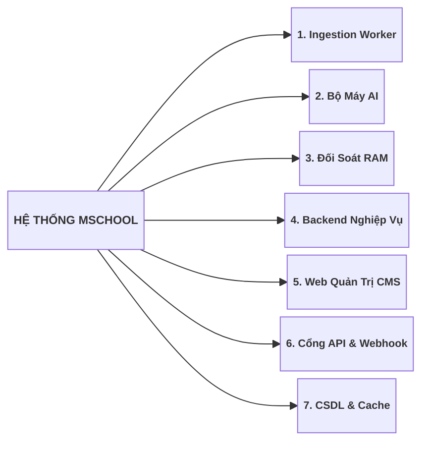
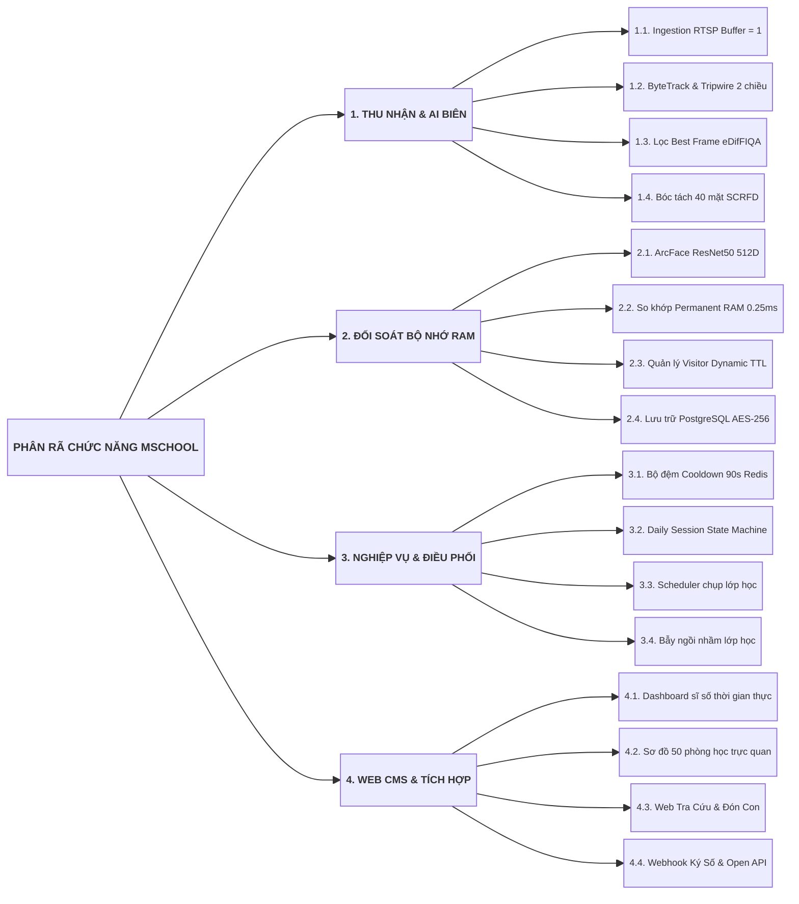
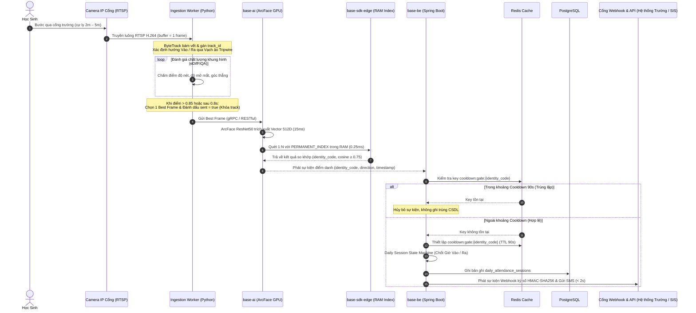
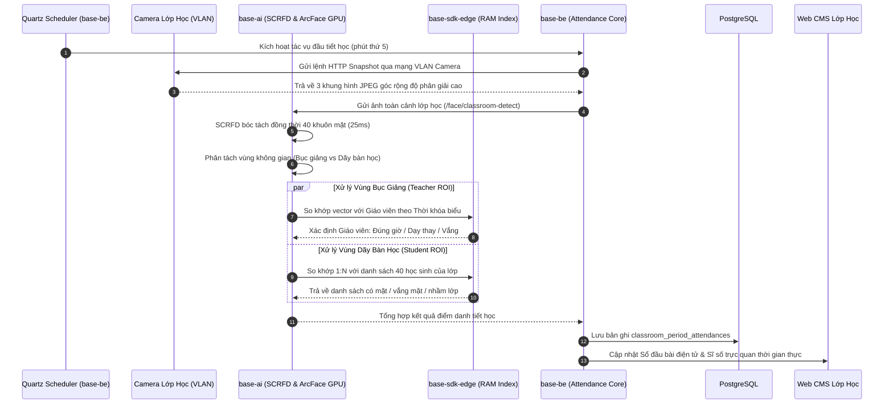

# THIẾT KẾ KỸ THUẬT VÀ KẾ HOẠCH TRIỂN KHAI MSCHOOL

Tài liệu này đặc tả toàn diện kiến trúc kỹ thuật hệ thống, danh mục các dịch vụ và ứng dụng cấu thành, phân rã chức năng chi tiết, thuật toán xử lý thị giác máy tính và cơ sở dữ liệu, ma trận kế thừa hệ sinh thái codebase nội bộ (`base-ai`, `base-be`, `base-cms`, `base-sdk`) và kế hoạch triển khai 16 task (WBS) trên máy chủ `micro-server` (GPU NVIDIA RTX 3060 12GB VRAM, CPU Intel Xeon 32 luồng, 62GB RAM).

---

## 1. TỔNG QUAN KỸ THUẬT VÀ ĐẶC THÙ NGHIỆP VỤ

Hệ thống Điểm danh không dừng qua Camera IP mschool vận hành trong môi trường trường học thông minh với 4 đặc thù kỹ thuật trọng yếu:
1. **Nhận diện không dừng (On-The-Fly / Non-cooperative):** Học sinh bước đi tự nhiên qua cổng (cự ly 2m – 5m, tốc độ 1.0 – 1.5 m/s), không dừng lại nhìn camera, góc nhìn nghiêng chúc từ trên cao (góc chúc 15° – 25°).
2. **Lưu lượng dồn dập giờ cao điểm (Burst Traffic):** 80% lưu lượng tập trung trong 30 phút đầu giờ sáng (07h00 – 07h30), học sinh đi theo nhóm đông dàn hàng ngang che khuất một phần khuôn mặt nhau.
3. **Hành vi lọt camera nhiều lần trong ngày:** Học sinh và phụ huynh di chuyển qua lại khu vực cổng nhiều lần (đứng nói chuyện, mua đồ, phụ huynh đưa con tới cổng rồi quay về).
4. **Phân biệt 3 nhóm đối tượng truy cập:** 
   * Thành viên chính thức (học sinh, giáo viên, cán bộ nhân viên).
   * Khách / Phụ huynh hợp lệ có thời hạn hiệu lực (Visitor TTL).
   * Người lạ chưa đăng ký (cảnh báo an ninh bốt bảo vệ).

---

## 2. KIẾN TRÚC TỔNG THỂ VÀ PHÂN VÙNG MẠNG

### 2.1. Kiến Trúc 4 Tầng Phân Lập


Hệ thống được tổ chức thành 4 tầng phân lập theo chuẩn Microservices:
1. **Tầng Thu nhận Biên (Edge Ingestion Layer):** Tiếp nhận luồng RTSP Full HD từ Camera IP Cổng và kích hoạt chụp ảnh góc rộng độ phân giải cao tại 50 phòng học.
2. **Tầng Suy luận AI (AI Inference Layer):** Vận hành `base-ai` trên GPU RTX 3060 với mô hình SCRFD phát hiện 40 khuôn mặt trong 25ms, eDifFIQA đánh giá chất lượng ảnh và ArcFace trích xuất vector 512D trong 15ms.
3. **Tầng Nghiệp vụ Lõi & State Machine (Business Core Layer):** Vận hành `base-be` (Spring Boot 3.3) quản lý Daily Session State Machine, bộ đệm Cooldown 90s trên Redis, phân hệ Visitor TTL và điều phối chụp ảnh theo Thời khóa biểu.
4. **Tầng Bộ đệm RAM & Lưu trữ Bền vững (Memory & Persistence Layer):** `base-sdk-edge` duy trì chỉ mục vector 2 vùng trong RAM cho tốc độ quét 1:N đạt 0.25ms; PostgreSQL 16 (pgvector) lưu trữ hồ sơ và lịch sử điểm danh bền vững.

---

### 2.2. Phân Vùng Mạng và Dải IP (Network Topology)

| STT | Phân vùng mạng | Thiết bị / Node | Dịch vụ đảm nhiệm | Giao thức & Port | Cơ chế bảo vệ |
| :---: | :--- | :--- | :--- | :--- | :--- |
| 1 | **VLAN Camera** | `cam-gate-01/02`<br/>`cam-class-01..50` | Camera IP Cổng và Camera Lớp học | RTSP (Port 554), HTTP Snapshot (Port 80) | VLAN cô lập, không ra Internet, cấp nguồn qua Switch PoE Gigabit. |
| 2 | **VLAN Quản Trị & Bốt Bảo Vệ** | `pc-admin-01`<br/>`pc-guard-01` | Máy tính Web CMS & Máy trạm bốt bảo vệ | HTTPS (Port 443), WebSocket | Mạng LAN nội bộ, xác thực qua JWT Token và phân quyền RBAC. |
| 3 | **Máy Chủ Nghiệp Vụ** | `micro-server` (Host) | Ingestion Worker, `base-ai`, `base-be` | HTTP RESTful (8080), gRPC | Đặt tại phòng kỹ thuật, bảo vệ bằng tường lửa UFW. |
| 4 | **Lưu Trữ & Cache** | `micro-server` (Docker) | PostgreSQL 16 (pgvector), Redis | TCP Port 5432, Port 6379 | Cô lập trong Docker Bridge, phân tầng lưu trữ SSD NVMe RAID 1 (DB) & cụm 6× HDD 4TB RAID 10 (Media/Logs), mã hóa AES-256. |

---

## 3. DANH MỤC DỊCH VỤ VÀ ỨNG DỤNG

Hệ thống mschool bao gồm **7 dịch vụ và ứng dụng** độc lập:



### Bảng Tổng Hợp Dịch Vụ / Ứng Dụng Và Chức Năng:

| STT | Dịch Vụ / Ứng Dụng | Nền tảng & Môi trường | Chức Năng Phân Rã Chi Tiết | Giao thức & Dữ liệu I/O | Kế thừa Codebase |
| :---: | :--- | :--- | :--- | :--- | :---: |
| **1** | **Ingestion Worker**<br/>`camera-worker` | Python 3.11, OpenCV, GStreamer, ByteTrack<br/>*Daemon Host Network* | • Tiếp nhận luồng RTSP Full HD H.264/H.265 (buffer = 1 frame).<br/>• Bám vết ByteTrack đa đối tượng, cấp phát `track_id` duy nhất.<br/>• Vạch ảo Spatial Tripwire 2 chiều xác định hướng Vào / Ra.<br/>• Lọc Best Frame eDifFIQA (độ nét, mở mắt, góc nhìn).<br/>• Đẩy ảnh sang AI và đánh dấu `sent = true` khóa track. | **Input:** RTSP (Port 554)<br/>**Output:** gRPC / REST sang `base-ai` | **40%**<br/>*(Kế thừa ByteTrack từ `base-ai`)* |
| **2** | **Bộ Máy AI**<br/>`base-ai` | FastAPI, PyTorch, ONNX Runtime, CUDA 12<br/>*Docker (GPU RTX 3060)* | • Bóc tách 40 khuôn mặt / ảnh bằng SCRFD ONNX (25ms).<br/>• Trích xuất vector 512D bằng ArcFace ResNet50 (15ms).<br/>• Kiểm định chất lượng ảnh khuôn mặt eDifFIQA.<br/>• Chống giả mạo ảnh in và màn hình MiniFASNet (18ms).<br/>• Phân tách không gian ROI: Bục giảng vs Dãy bàn học.<br/>• API suy luận: `/face/extract`, `/face/classroom-detect`. | **Input:** Base64 / Multipart<br/>**Output:** JSON Vector 512D & ROI | **90%**<br/>*(Kế thừa trọn vẹn `base-ai`)* |
| **3** | **Đối Soát RAM**<br/>`base-sdk-edge` | C++17, Python C-Extension, OpenBLAS<br/>*In-Memory Library nhúng trong AI* | • Phân vùng `PERMANENT_INDEX` (2.000–5.000 vectors).<br/>• So khớp tích vô hướng Cosine BLAS 1:N trong RAM (0.25ms).<br/>• Phân vùng `VISITOR_DYNAMIC_INDEX` kèm metadata TTL.<br/>• Tiến trình dọn dẹp (auto-eviction) xóa vector hết hạn mỗi 5p.<br/>• Đối soát 3 tầng: Thành viên → Khách hợp lệ → Người lạ. | **Input:** Vector 512D<br/>**Output:** `identity_code`, `cosine_score` | **85%**<br/>*(Kế thừa `base-sdk-edge`)* |
| **4** | **Backend Nghiệp Vụ**<br/>`base-be` | Java 21, Spring Boot 3.3, Quartz<br/>*Docker (Port 8080)* | • Quản lý cửa sổ Cooldown 90s trên Redis triệt tiêu trùng lặp.<br/>• `DailySessionStateMachine`: Chốt Giờ Đến/Về, lọc ra ngoài < 5p.<br/>• Quartz Scheduler điều phối chụp 3 ảnh tại 50 lớp đầu tiết.<br/>• Đối soát danh sách lớp, phát hiện vắng mặt, ngồi nhầm lớp.<br/>• Quản lý CRUD Khách/Phụ huynh, cấp mã TTL mở làn.<br/>• Hàng đợi Outbox & Đẩy thông báo FCM về Mobile App < 2s.<br/>• Bảo mật sinh trắc học AES-256 và phân quyền RBAC. | **Input:** REST / Event<br/>**Output:** PostgreSQL, Redis, FCM, WS | **80%**<br/>*(Kế thừa `base-be/modules`)* |
| **5** | **Web Quản Trị CMS**<br/>`base-cms` | TypeScript, Next.js 14, Tailwind CSS<br/>*Docker (Port 3000)* | • Bảng điều khiển sĩ số toàn trường thời gian thực (WebSocket).<br/>• Sơ đồ mặt bằng 50 phòng học, cảnh báo viền đỏ học sinh lạ.<br/>• Portal Bốt bảo vệ: Giám sát người lạ, duyệt khách hẹn trước.<br/>• Quản lý Thời khóa biểu, phân công giảng dạy, danh sách lớp.<br/>• Quản lý hồ sơ khuôn mặt, Import/Export Excel, báo cáo. | **Input:** HTTPS / WebSocket<br/>**Output:** Reactive UI & Excel | **80%**<br/>*(Kế thừa `base-cms/src`)* |
| **6** | **Cổng API & Webhook**<br/>`base-api-gateway` | Java 21, Spring Boot 3.3, HMAC-SHA256<br/>*Docker (Port 8080/8443)* | • Động cơ phát Webhook thời gian thực có ký số HMAC-SHA256.<br/>• Cơ chế thử lại Exponential Backoff và Circuit Breaker tự động.<br/>• Cổng Open REST API chuẩn OpenAPI kết nối CSDL ngành (EduSys).<br/>• Hàng đợi Outbox & Gửi tin nhắn viễn thông SMS Brandname. | **Input:** Sự kiện từ `base-be`<br/>**Output:** HTTPS Webhook, OpenAPI, SMS | **90%**<br/>*(Kế thừa `base-be/modules`)* |
| **7** | **CSDL & Cache**<br/>`postgres-redis` | PostgreSQL 16 (pgvector), Redis 7<br/>*Docker (Port 5432, 6379)* | • `face_biometric_profiles`: Hồ sơ vector 512D mã hóa AES-256.<br/>• `visitor_registrations`: Khách đăng ký có thời hạn TTL.<br/>• `daily_attendance_sessions`: Phiên điểm danh ngày và mốc giờ.<br/>• `classroom_period_attendances`: Sổ đầu bài điện tử tiết học.<br/>• `stranger_access_logs`: Nhật ký người lạ (tự hủy sau 24h).<br/>• Redis: Bộ đệm Cooldown 90s, khóa phân tán, session token. | **Input:** SQL Queries / Redis Cmd<br/>**Output:** CSDL bền vững & Cache RAM | **95%**<br/>*(Kế thừa Docker pgvector & Redis)* |

---

## 4. PHÂN RÃ CHỨC NĂNG CHI TIẾT



---

### 4.1. Ingestion Worker (`camera-worker`)
* **Mục đích:** Chạy ngầm thu nhận RTSP camera cổng, bám vết, phân loại chiều và chọn 1 ảnh đẹp nhất gửi AI.
* **Thành phần chức năng:**
  1. `RTSPStreamIngestion`: Giải mã H.264/H.265 qua GStreamer, duy trì `buffer = 1` triệt tiêu trễ tích lũy.
  2. `ByteTrackTracker`: Theo dõi đa đối tượng liên tục, cấp phát `track_id` duy nhất.
  3. `SpatialTripwire`: Đo biến thiên tọa độ trọng tâm (X, Y) cắt vạch ảo xác định chiều **Vào (IN)** hay **Ra (OUT)**.
  4. `eDifFIQAEvaluator`: Đánh giá độ nét, độ mở mắt, góc nghiêng; chọn ảnh điểm cao nhất khi > 0.85 hoặc sau 0.8s.
  5. `DispatcherClient`: Gửi Best Frame sang AI, đánh dấu `sent = true` khóa track và hủy các frame sau.

---

### 4.2. Bộ Máy AI (`base-ai`)
* **Mục đích:** Xử lý suy luận thị giác máy tính chuyên sâu trên GPU NVIDIA RTX 3060.
* **Thành phần chức năng:**
  1. `CrowdFaceDetector` (`engines/face/detector.py`): SCRFD ONNX bóc tách 40 khuôn mặt / ảnh trong 25ms.
  2. `FeatureExtractor` (`engines/face/recognizer.py`): ArcFace ResNet50 trích xuất vector 512D chuẩn hóa L2 trong 15ms.
  3. `ClassroomROISplitter`: Tự động phân tách Vùng Bục giảng (Teacher ROI) và Vùng Dãy bàn học (Student ROI).
  4. `AntiSpoofingValidator` (`engines/face/liveness.py`): MiniFASNet chống giả mạo ảnh in/màn hình trong 18ms.
  5. `InferenceAPIFacade`: API RESTful `/face/extract`, `/face/classroom-detect`, `/face/verify-quality`.

---

### 4.3. Đối Soát RAM (`base-sdk-edge`)
* **Mục đích:** Duy trì kho vector trong bộ nhớ RAM máy chủ `micro-server` để đạt tốc độ so khớp < 0.25ms.
* **Thành phần chức năng:**
  1. `PermanentIndexPartition`: Lưu 2.000–5.000 vector học sinh/giáo viên, tính tích vô hướng Cosine BLAS 1:N trong 0.25ms.
  2. `VisitorDynamicIndexPartition`: Lưu 50–200 vector khách/phụ huynh kèm siêu dữ liệu TTL (`valid_from/to`).
  3. `TTLAutoEvictionEngine`: Tiến trình định kỳ 5 phút quét và giải phóng vector khách hết hạn khỏi RAM.
  4. `IndexSyncReceiver`: Nhận sự kiện đồng bộ từ Backend khi có biến động hồ sơ sinh trắc học.

---

### 4.4. Backend Nghiệp Vụ (`base-be`)
* **Mục đích:** Trung tâm điều phối nghiệp vụ, quản lý phiên điểm danh, thời khóa biểu và giao tiếp đa kênh.
* **Thành phần chức năng:**
  1. `RedisCooldownManager`: Cửa sổ Cooldown 90s (`cooldown:gate:{id}`) triệt tiêu trùng lặp ở cổng.
  2. `DailySessionStateMachine`: Tự động chốt Giờ Đến sáng, Giờ Về chiều, bỏ qua lượt ra ngoài ngắn < 5p.
  3. `QuartzClassroomScheduler`: Lập lịch kích hoạt chụp ảnh 50 phòng học tại phút thứ 5 đầu mỗi tiết học.
  4. `ClassroomPeriodEvaluator`: Đối soát danh sách lớp, phát hiện vắng mặt, ngồi nhầm lớp, giáo viên dạy thay.
  5. `VisitorTTLService`: API CRUD khách, cấp mã truy cập có thời hạn và đồng bộ sang RAM Index.
  6. `WebhookOutboxDispatcher`: Transactional Outbox Pattern quét định kỳ mỗi 1 giây, phát sự kiện Webhook thời gian thực có ký số HMAC-SHA256 đến hệ thống đối tác và gửi tin nhắn SMS Brandname < 2s.
  7. `SecurityAndAuditModule`: Mã hóa AES-256 dữ liệu sinh trắc học, quản lý RBAC và Audit Log.

---

### 4.5. Web Quản Trị CMS (`base-cms`)
* **Mục đích:** Giao diện trực quan Web phục vụ Ban Giám hiệu, Phòng Đào tạo và Bốt Bảo vệ.
* **Thành phần chức năng:**
  1. `CampusLiveDashboard`: Bảng điều khiển sĩ số toàn trường thời gian thực qua WebSocket.
  2. `ClassroomMatrixView`: Sơ đồ mặt bằng 50 phòng học, hiển thị ảnh chụp mẫu và cảnh báo viền đỏ.
  3. `GuardDeskPortal`: Giao diện bốt bảo vệ tiếp đón khách, duyệt khách hẹn trước, danh sách đón con.
  4. `TimetableManager`: Quản lý thời khóa biểu, phân công giảng dạy và danh sách học sinh.
  5. `BiometricProfileManager`: Quản lý hồ sơ khuôn mặt, Import/Export Excel và báo cáo chuyên cần.

---

### 4.6. Cổng Tích Hợp Mở API & Động Cơ Webhook (`base-api-gateway` / `module-webhook`)
* **Mục đích:** Cung cấp giao diện kết nối lập trình chuẩn mở, phát sự kiện điểm danh tức thời tới các ứng dụng của trường/phụ huynh và tiếp nhận dữ liệu tích hợp hai chiều.
* **Thành phần chức năng:**
  1. `RealtimeWebhookEngine`: Phát sự kiện điểm danh thời gian thực, tự động ký số bằng HMAC-SHA256 với HTTP Header `X-Hub-Signature-256`.
  2. `ResilientRetryController`: Thuật toán thử lại lũy tiến Exponential Backoff (1s, 2s, 4s, 8s... tối đa 60s) kèm Circuit Breaker ngắt kết nối an toàn khi đối tác gặp sự cố.
  3. `OpenAPISpecification`: Cung cấp bộ API RESTful chuẩn OpenAPI 3.0 tra cứu lịch sử chuyên cần, danh sách học sinh và đồng bộ hai chiều với CSDL ngành giáo dục (EduSys, vnEdu).
  4. `SMSBrandnameGateway`: Tích hợp giao thức SMPP gửi tin nhắn SMS thông báo tức thời đến số điện thoại phụ huynh.

---

### 4.7. CSDL & Cache (`postgres-redis`)
* **Mục đích:** Quản lý cơ sở dữ liệu quan hệ và bộ nhớ đệm phân tán tốc độ cao.
* **Thành phần chức năng:**
  1. `PostgreSQLStorage`: Lưu trữ 5 bảng dữ liệu cốt lõi mã hóa AES-256.
  2. `PgvectorExtension`: Lưu trữ vector đặc trưng 512D hỗ trợ tìm kiếm lân cận và sao lưu bền vững.
  3. `RedisClusterCache`: Quản lý khóa phân tán, bộ đệm Cooldown 90s và hàng đợi sự kiện.

---

## 5. THUẬT TOÁN VÀ QUY TRÌNH XỬ LÝ ĐẦU CUỐI

### 5.1. Quy Trình Điểm Danh Cổng Không Dừng (Sequence Diagram)



---

### 5.2. Quy Trình Điều Phối Và Điểm Danh Lớp Học Toàn Cảnh (Sequence Diagram)



---

### 5.3. Logic Daily Session State Machine (`DailyAttendanceStateMachine.java`)

```java
@Service
@RequiredArgsConstructor
public class AttendanceSessionService {

    private final RedisTemplate<String, String> redisTemplate;
    private final AttendanceRecordRepository recordRepository;
    private final WebhookOutboxService outboxService;

    public void processAttendanceEvent(AttendanceScanEvent event) {
        String identityCode = event.getIdentityCode();
        String cooldownKey = "cooldown:gate:" + identityCode;

        // 1. Kiểm tra cửa sổ Cooldown 90s trên Redis
        if (Boolean.TRUE.equals(redisTemplate.hasKey(cooldownKey))) {
            return;
        }
        redisTemplate.opsForValue().set(cooldownKey, "1", Duration.ofSeconds(90));

        // 2. Khởi tạo phiên điểm danh trong ngày
        LocalDate today = LocalDate.now();
        DailyAttendanceSession session = recordRepository
            .findByStudentCodeAndDate(identityCode, today)
            .orElseGet(() -> DailyAttendanceSession.initSession(identityCode, today));

        LocalDateTime now = LocalDateTime.now();

        // 3. Logic State Machine Transitions
        if (event.getDirection() == Direction.IN) {
            if (session.getCheckInTime() == null) {
                session.setCheckInTime(now);
                session.setStatus(AttendanceStatus.PRESENT);
                outboxService.publishAttendanceWebhook(identityCode, "CON_DEN_TRUONG", now);
            } else if (session.getLastOutTime() != null) {
                long minutesOut = Duration.between(session.getLastOutTime(), now).toMinutes();
                if (minutesOut < 5) {
                    session.setLastOutTime(null); // Bỏ qua lượt ra ngoài ngắn hạn
                }
            }
        } else if (event.getDirection() == Direction.OUT) {
            session.setCheckOutTime(now);
            session.setLastOutTime(now);
            if (now.getHour() >= 16) {
                outboxService.publishParentNotification(identityCode, "CON_RA_VE", now);
            }
        }

        recordRepository.save(session);
    }
}
```

---

### 5.4. Lược Đồ Cơ Sở Dữ Liệu PostgreSQL 16 & pgvector

```sql
-- 1. Bảng hồ sơ sinh trắc học chuẩn hóa (Mã hóa AES-256)
CREATE TABLE face_biometric_profiles (
    id UUID PRIMARY KEY DEFAULT gen_random_uuid(),
    identity_code VARCHAR(50) NOT NULL UNIQUE,
    subject_type VARCHAR(20) NOT NULL, -- STUDENT, TEACHER, EMPLOYEE
    full_name VARCHAR(255) NOT NULL,
    department_or_class VARCHAR(100) NOT NULL,
    embedding_primary VECTOR(512) NOT NULL,
    embedding_left VECTOR(512),
    embedding_right VECTOR(512),
    quality_score FLOAT NOT NULL,
    created_at TIMESTAMP WITH TIME ZONE DEFAULT CURRENT_TIMESTAMP,
    updated_at TIMESTAMP WITH TIME ZONE DEFAULT CURRENT_TIMESTAMP
);

-- 2. Bảng đăng ký khách và phụ huynh có thời hạn hiệu lực (TTL)
CREATE TABLE visitor_registrations (
    id UUID PRIMARY KEY DEFAULT gen_random_uuid(),
    visitor_code VARCHAR(50) NOT NULL UNIQUE,
    full_name VARCHAR(255) NOT NULL,
    phone_number VARCHAR(20),
    visitor_type VARCHAR(20) NOT NULL, -- PARENT, GUEST, CONTRACTOR
    target_identity_code VARCHAR(50),
    embedding VECTOR(512) NOT NULL,
    valid_from TIMESTAMP WITH TIME ZONE NOT NULL,
    valid_to TIMESTAMP WITH TIME ZONE NOT NULL,
    status VARCHAR(20) NOT NULL DEFAULT 'APPROVED',
    created_at TIMESTAMP WITH TIME ZONE DEFAULT CURRENT_TIMESTAMP
);

-- 3. Bảng phiên điểm danh trong ngày (Daily Attendance Sessions)
CREATE TABLE daily_attendance_sessions (
    id UUID PRIMARY KEY DEFAULT gen_random_uuid(),
    identity_code VARCHAR(50) NOT NULL,
    session_date DATE NOT NULL,
    check_in_at TIMESTAMP WITH TIME ZONE,
    check_out_at TIMESTAMP WITH TIME ZONE,
    last_out_at TIMESTAMP WITH TIME ZONE,
    attendance_status VARCHAR(20) NOT NULL DEFAULT 'ABSENT',
    total_present_minutes INT DEFAULT 0,
    created_at TIMESTAMP WITH TIME ZONE DEFAULT CURRENT_TIMESTAMP,
    CONSTRAINT uk_student_date UNIQUE (identity_code, session_date)
);

-- 4. Bảng sổ đầu bài điện tử và điểm danh tiết học
CREATE TABLE classroom_period_attendances (
    id UUID PRIMARY KEY DEFAULT gen_random_uuid(),
    class_id VARCHAR(50) NOT NULL,
    period_number INT NOT NULL,
    schedule_date DATE NOT NULL,
    scheduled_teacher_code VARCHAR(50) NOT NULL,
    actual_teacher_code VARCHAR(50),
    total_students_enrolled INT NOT NULL,
    total_students_present INT NOT NULL,
    absent_student_codes TEXT[],
    wrong_class_student_codes TEXT[],
    snapshot_image_path TEXT,
    created_at TIMESTAMP WITH TIME ZONE DEFAULT CURRENT_TIMESTAMP
);

-- 5. Bảng nhật ký người lạ (Tự hủy sau 24h)
CREATE TABLE stranger_access_logs (
    id UUID PRIMARY KEY DEFAULT gen_random_uuid(),
    camera_id VARCHAR(50) NOT NULL,
    captured_image_path TEXT NOT NULL,
    embedding VECTOR(512) NOT NULL,
    appeared_at TIMESTAMP WITH TIME ZONE DEFAULT CURRENT_TIMESTAMP,
    is_alerted BOOLEAN DEFAULT FALSE
);
```

---

## 6. MA TRẬN KẾ THỪA VÀ TÙY BIẾN CODEBASE NỘI BỘ

Phân tích mức độ kế thừa từ kho mã nguồn hiện hữu [`/Users/micro/Source/codebase/`](file:///Users/micro/Source/codebase):

| Dịch vụ / Ứng dụng | Module nguồn kế thừa | Tỷ lệ có sẵn | Phần kế thừa nguyên bản | Phần cần viết mới / Tùy biến cho mschool |
| :--- | :--- | :---: | :--- | :--- |
| **1. `camera-worker`** | Viết mới trên nền `OpenCV` / `GStreamer` | **40%** | Thuật toán bám vết ByteTrack từ `base-ai/engines`. | Đóng gói tiến trình Worker Python, vạch ảo Tripwire 2 chiều và bộ đệm buffer = 1. |
| **2. `base-ai`** | `base-ai` (`engines/face/`) | **90%** | Pipeline UniFace, SCRFD ONNX, ArcFace 512D, eDifFIQA, MiniFASNet. | Bổ sung API `/face/classroom-detect` phân tách ROI Bục giảng vs Dãy bàn học. |
| **3. `base-sdk-edge`** | `base-sdk/base-sdk-edge` | **85%** | Lớp đối soát BLAS Dot Product trong RAM, cấu trúc Index C++/NumPy. | Bổ sung phân vùng `VISITOR_DYNAMIC_INDEX` với cờ hiệu lực TTL và cơ chế auto-eviction. |
| **4. `base-be`** | `base-be/modules` | **80%** | `module-master-data`, `module-notification`, `module-scheduler`, `module-system-iam`. | Hiện thực `DailySessionStateMachine`, bộ đệm Cooldown 90s, đối soát danh sách lớp. |
| **5. `base-cms`** | `base-cms/src` | **80%** | DataTable, Auth Context, layout FSD, WebSocket client. | Xây dựng Dashboard sĩ số thời gian thực, giao diện mặt bằng 50 phòng học và portal bảo vệ. |
| **6. Cổng API & Webhook** | `base-be/modules/module-notification` & `module-master-data` | **90%** | Mô hình Outbox Pattern, cấu hình WebClient, ký số HMAC-SHA256, SMS client. | Xây dựng chuẩn Payload Webhook điểm danh mschool và endpoint OpenAPI. |
| **7. `postgres-redis`** | PostgreSQL 16 & Redis 7 | **95%** | Cấu hình Docker Compose, pgvector index, Redis standalone. | Khởi tạo 5 bảng CSDL và cấu hình mã hóa AES-256 trên volume. |
| **TỔNG THỂ HỆ THỐNG** | **Toàn bộ hệ sinh thái** | **90%** | **Lõi AI, SDK RAM, Backend IAM, CMS/Mobile framework** | **Ghép nối nghiệp vụ trường học và Worker RTSP** |

---

## 7. KẾ HOẠCH 16 TASK TRIỂN KHAI CHI TIẾT (WBS)

Kế hoạch 16 task kỹ thuật được phân bổ theo 4 giai đoạn trong 4 tuần (tổng nỗ lực 26 Man-Days):

### Giai Đoạn 1: Thu Nhận RTSP & Thị Giác AI Biên (Tuần 1 - 8 Man-Days)

| Mã Task | Tên Task Kỹ Thuật | Dịch vụ tác động | Đầu vào (Input) | Sản phẩm bàn giao (Output) | Nỗ lực | Phụ thuộc |
| :---: | :--- | :--- | :--- | :--- | :---: | :---: |
| **TASK-01** | Đóng gói tiến trình `Camera Ingestion Worker` bóc tách RTSP và ByteTrack | `camera-worker` | Luồng RTSP Camera cổng | Module Python tiếp nhận RTSP, gán `track_id` chuẩn | 3 ngày | Không |
| **TASK-02** | Hiện thực hóa bộ lọc `Best Frame Selection` eDifFIQA trong Worker | `camera-worker` | Danh sách frame của 1 track | Hàm chọn 1 ảnh sắc nét nhất gửi sang AI | 1 ngày | TASK-01 |
| **TASK-03** | Ghép nối `base-sdk-edge` xây dựng phân vùng RAM 2 tầng (`PERMANENT` & `VISITOR`) | `base-sdk-edge` | Kho vector 512D | Bộ nạp RAM Index hỗ trợ quét 1:N và cơ chế xóa TTL | 2 ngày | Không |
| **TASK-04** | Xây dựng API bóc tách 40 khuôn mặt / ảnh lớp học và phân tách ROI | `base-ai` | Ảnh chụp toàn cảnh phòng học | API `/face/classroom-detect` trả về danh sách theo ROI | 2 ngày | Không |

---

### Giai Đoạn 2: Máy Chủ Nghiệp Vụ & CSDL (Tuần 2 - 7 Man-Days)

| Mã Task | Tên Task Kỹ Thuật | Dịch vụ tác động | Đầu vào (Input) | Sản phẩm bàn giao (Output) | Nỗ lực | Phụ thuộc |
| :---: | :--- | :--- | :--- | :--- | :---: | :---: |
| **TASK-05** | Thiết lập lược đồ CSDL PostgreSQL và tích hợp `base-sdk-backend/java` | `base-be` | Database Schema SQL | 5 bảng CSDL hoàn chỉnh, Starter WebClient | 1 ngày | Không |
| **TASK-06** | Hiện thực hóa `DailySessionStateMachine` và Bộ đệm Cooldown 90s Redis | `base-be` | Sự kiện quét thẻ cổng | Service tự chốt Giờ Đến/Về và lọc ra ngoài < 5p | 2 ngày | TASK-05 |
| **TASK-07** | Xây dựng API Quản lý Khách/Phụ huynh có thời hạn hiệu lực (Visitor TTL) | `base-be` | Đăng ký khách từ Web/App | Bộ API CRUD Khách, đồng bộ vector sang RAM | 2 ngày | TASK-03, TASK-05 |
| **TASK-08** | Cấu hình Scheduler kích hoạt chụp ảnh 50 phòng học theo Thời khóa biểu | `base-be` | Dữ liệu Thời khóa biểu | Tác vụ Quartz tự động gọi camera lớp đầu tiết | 2 ngày | TASK-04, TASK-05 |
| **TASK-09** | Xây dựng Hàng đợi Outbox và tích hợp Cổng đẩy thông báo Firebase (FCM) | `base-be` | Sự kiện điểm danh mới | Tiến trình đẩy thông báo về Mobile App < 2s | 1 ngày | TASK-06 |

---

### Giai Đoạn 3: Web CMS & Tầng Tích Hợp Mở API / Webhook (Tuần 3 - 7 Man-Days)

| Mã Task | Tên Task Kỹ Thuật | Dịch vụ tác động | Đầu vào (Input) | Sản phẩm bàn giao (Output) | Nỗ lực | Phụ thuộc |
| :---: | :--- | :--- | :--- | :--- | :---: | :---: |
| **TASK-10** | Xây dựng Động cơ Webhook ký số HMAC-SHA256 và cơ chế Retry Exponential Backoff | `base-be` | Sự kiện điểm danh từ Outbox | Module phát Webhook bảo mật kèm Circuit Breaker | 2 ngày | TASK-09 |
| **TASK-11** | Xây dựng Cổng Open API tra cứu chuyên cần và Portal phụ huynh tra cứu trên Web CMS | `base-be`, `base-cms` | API Backend `base-be` | Bộ endpoint OpenAPI 3.0 và giao diện tra cứu trên Web | 1 ngày | TASK-09 |
| **TASK-12** | Xây dựng Bảng điều khiển Sĩ số Toàn trường thời gian thực trên Web CMS | `base-cms` | WebSocket / RESTful API | Dashboard hiển thị tổng sĩ số, có mặt, vắng mặt | 2 ngày | TASK-06 |
| **TASK-13** | Xây dựng Sơ đồ Mặt bằng Lớp học và Cảnh báo Bốt bảo vệ trên Web CMS | `base-cms` | API `/classroom-attendance` | Giao diện 50 phòng học, cảnh báo người lạ viền đỏ | 2 ngày | TASK-04, TASK-08 |

---

### Giai Đoạn 4: Đóng Gói Cụm, Đo Kiểm Tải & Pilot Hiện Trường (Tuần 4 - 4 Man-Days)

| Mã Task | Tên Task Kỹ Thuật | Dịch vụ tác động | Đầu vào (Input) | Sản phẩm bàn giao (Output) | Nỗ lực | Phụ thuộc |
| :---: | :--- | :--- | :--- | :--- | :---: | :---: |
| **TASK-14** | Đóng gói cụm Docker Compose và tối ưu hóa tài nguyên trên `micro-server` | Toàn hệ thống | Dockerfiles | File `docker-compose.yml` hoàn chỉnh với GPU | 1 ngày | TASK-01..13 |
| **TASK-15** | Đo kiểm tải mô phỏng 30 luồng RTSP dồn dập và bẫy toàn vẹn dữ liệu | Toàn hệ thống | Kịch bản test tải k6/Python | Báo cáo đo kiểm tải: GPU < 70%, VRAM < 3GB | 1 ngày | TASK-14 |
| **TASK-16** | Triển khai thí điểm Pilot Cổng chính với 2 Camera và 500 học sinh | Hiện trường trường học | 2 Camera IP cổng | Báo cáo đối soát: TAR ≥ 98.5%, độ trễ < 300ms | 2 ngày | TASK-15 |

---

## 8. ĐÓNG GÓI DOCKER COMPOSE TRÊN MÁY CHỦ BIÊN

Cấu hình `docker-compose.yml` triển khai trọn gói 6 container trên máy chủ `micro-server`:

```yaml
version: '3.8'

services:
  # 1. Cơ sở dữ liệu quan hệ PostgreSQL 16 với pgvector
  postgres-db:
    image: pgvector/pgvector:pg16
    container_name: mschool-postgres
    restart: always
    environment:
      POSTGRES_DB: mschool_db
      POSTGRES_USER: mschool_admin
      POSTGRES_PASSWORD: SecretPassword123
    volumes:
      - pgdata:/var/lib/postgresql/data
    ports:
      - "5432:5432"

  # 2. Bộ nhớ đệm phân tán Redis Cache 7.x
  redis-cache:
    image: redis:7-alpine
    container_name: mschool-redis
    restart: always
    ports:
      - "6379:6379"

  # 3. Bộ máy Trí tuệ Nhân tạo base-ai (Chạy GPU NVIDIA)
  base-ai:
    build:
      context: /Users/micro/Source/codebase/base-ai
      dockerfile: Dockerfile
    container_name: mschool-ai
    restart: always
    deploy:
      resources:
        reservations:
          devices:
            - driver: nvidia
              count: all
              capabilities: [gpu]
    ports:
      - "8000:8000"
    depends_on:
      - redis-cache

  # 4. Tiến trình Thu nhận Luồng Camera Ingestion Worker
  camera-worker:
    build:
      context: /Users/micro/Source/codebase/base-ai
      dockerfile: Dockerfile.worker
    container_name: mschool-camera-worker
    restart: always
    network_mode: host
    depends_on:
      - base-ai

  # 5. Máy chủ Nghiệp vụ Backend Java Spring Boot 3.3
  base-be:
    build:
      context: /Users/micro/Source/codebase/base-be
      dockerfile: Dockerfile
    container_name: mschool-backend
    restart: always
    environment:
      SPRING_DATASOURCE_URL: jdbc:postgresql://postgres-db:5432/mschool_db
      SPRING_REDIS_HOST: redis-cache
      BASE_AI_URL: http://base-ai:8000
    ports:
      - "8080:8080"
    depends_on:
      - postgres-db
      - redis-cache
      - base-ai

  # 6. Giao diện Quản trị Web CMS Next.js 14
  base-cms:
    build:
      context: /Users/micro/Source/codebase/base-cms
      dockerfile: Dockerfile
    container_name: mschool-cms
    restart: always
    ports:
      - "3000:3000"
    depends_on:
      - base-be

volumes:
  pgdata: # Gắn kết trên phân vùng SSD NVMe Gen4 RAID 1 (CSDL & Index)
  mediastorage: # Gắn kết trên cụm 6x HDD 4TB Enterprise RAID 10 (/data/storage)
```

---

## 9. KẾT LUẬN

Hồ sơ thiết kế kỹ thuật trên đã định hình rõ nét kiến trúc phân rã 7 dịch vụ/ứng dụng, phương án kế thừa 90% từ hệ sinh thái codebase nội bộ, các thuật toán xử lý luồng cốt lõi và lộ trình triển khai 16 task khả thi trong 4 tuần trên máy chủ `micro-server`.
